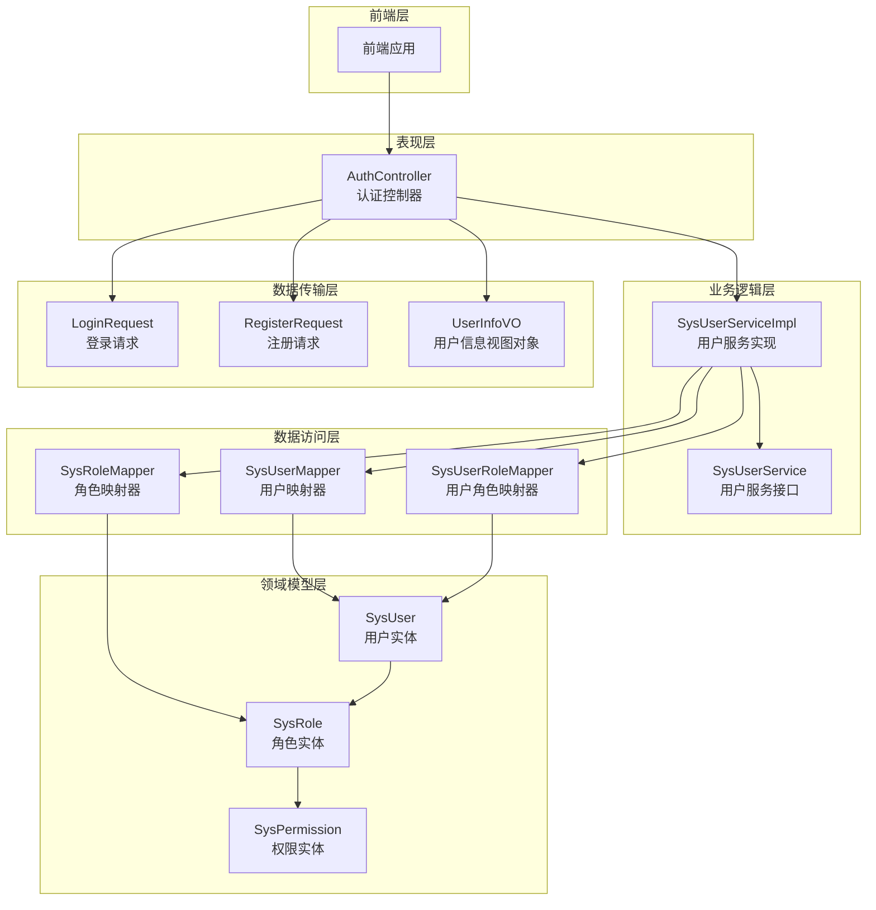
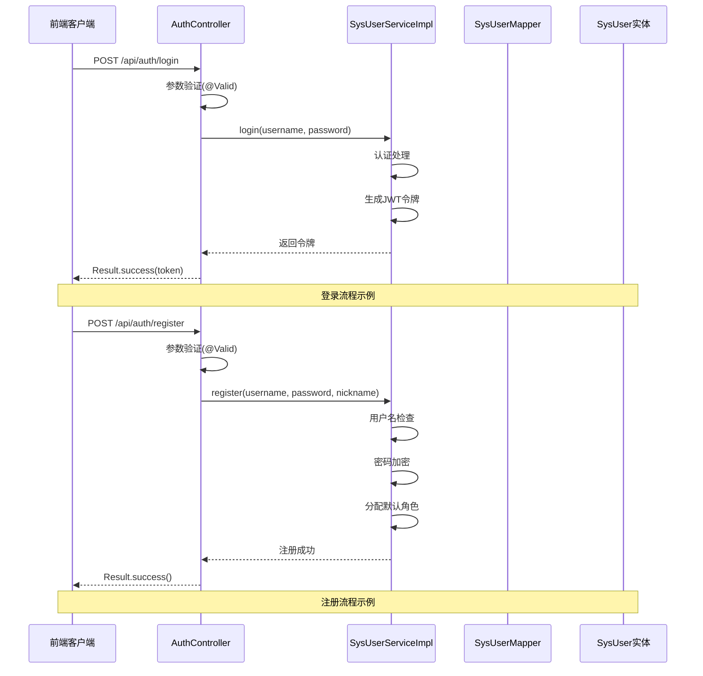
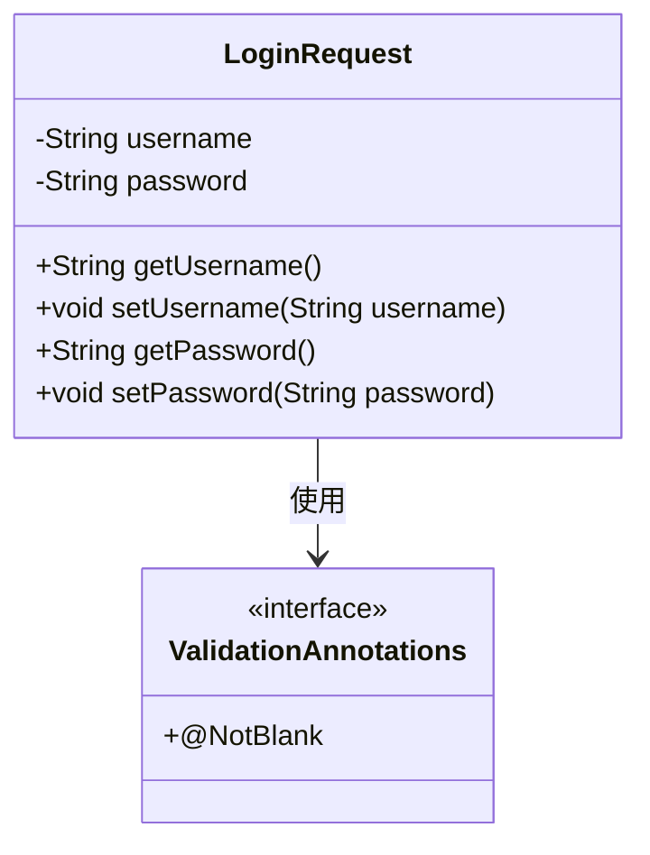
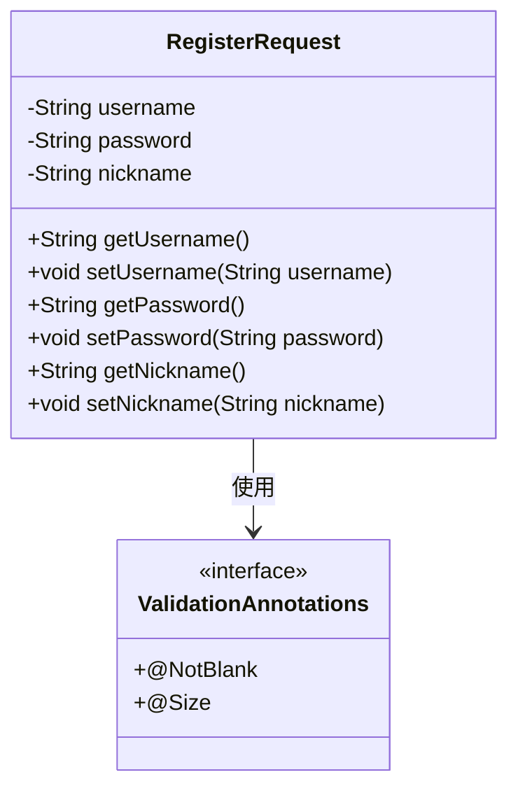
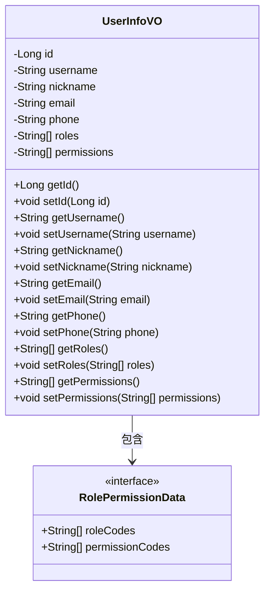
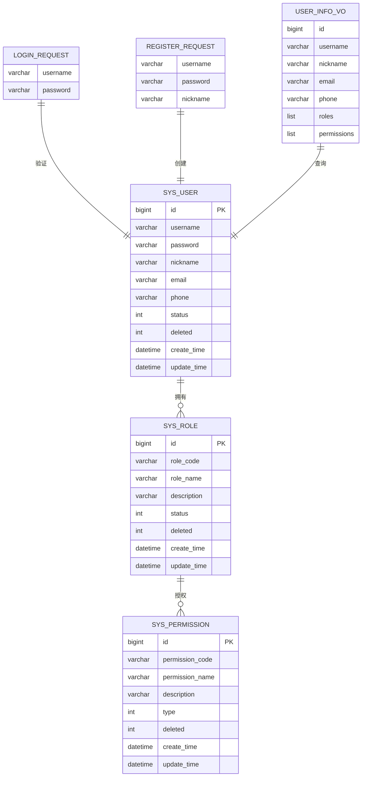
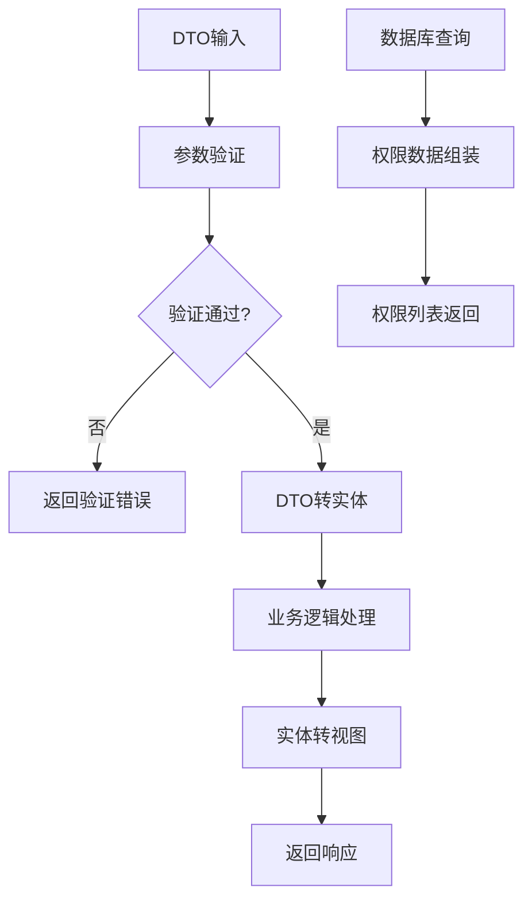

# DTO数据传输对象

<cite>
**本文档引用的文件**
- [LoginRequest.java](file://src/main/java/com/bookorder/dto/LoginRequest.java)
- [RegisterRequest.java](file://src/main/java/com/bookorder/dto/RegisterRequest.java)
- [UserInfoVO.java](file://src/main/java/com/bookorder/dto/UserInfoVO.java)
- [SysUser.java](file://src/main/java/com/bookorder/entity/SysUser.java)
- [SysRole.java](file://src/main/java/com/bookorder/entity/SysRole.java)
- [SysPermission.java](file://src/main/java/com/bookorder/entity/SysPermission.java)
- [AuthController.java](file://src/main/java/com/bookorder/controller/AuthController.java)
- [SysUserService.java](file://src/main/java/com/bookorder/service/SysUserService.java)
- [SysUserServiceImpl.java](file://src/main/java/com/bookorder/service/impl/SysUserServiceImpl.java)
- [SysUserDetails.java](file://src/main/java/com/bookorder/security/SysUserDetails.java)
- [SysUserMapper.java](file://src/main/java/com/bookorder/mapper/SysUserMapper.java)
- [Result.java](file://src/main/java/com/bookorder/common/Result.java)
- [application.yml](file://src/main/resources/application.yml)
- [pom.xml](file://pom.xml)
</cite>

## 目录
1. [引言](#引言)
2. [项目结构](#项目结构)
3. [核心组件](#核心组件)
4. [架构概览](#架构概览)
5. [详细组件分析](#详细组件分析)
6. [依赖关系分析](#依赖关系分析)
7. [性能考虑](#性能考虑)
8. [故障排除指南](#故障排除指南)
9. [结论](#结论)
10. [附录](#附录)

## 引言

本文件为图书订单系统中的DTO（数据传输对象）设计文档，深入解释了各个DTO类的设计目的、使用场景、字段定义和验证规则。DTO作为前后端交互的数据载体，在系统中承担着重要的数据封装和传输职责。本文档将详细说明DTO与实体类的区别和转换关系，包括数据映射和转换策略，以及参数验证的实现方式和最佳实践。

## 项目结构

该图书订单系统采用标准的Spring Boot三层架构设计，DTO位于业务逻辑层与表现层之间，负责数据的封装和传输。

**图表来源**
- [AuthController.java:18-59](file://src/main/java/com/bookorder/controller/AuthController.java#L18-L59)
- [SysUserServiceImpl.java:22-87](file://src/main/java/com/bookorder/service/impl/SysUserServiceImpl.java#L22-L87)

**章节来源**
- [AuthController.java:1-59](file://src/main/java/com/bookorder/controller/AuthController.java#L1-L59)
- [SysUserServiceImpl.java:1-87](file://src/main/java/com/bookorder/service/impl/SysUserServiceImpl.java#L1-L87)

## 核心组件

### DTO设计原则

系统中的DTO遵循以下设计原则：

1. **单一职责原则**：每个DTO专注于特定的业务场景
2. **数据封装原则**：对外暴露只读属性，内部进行数据封装
3. **验证分离原则**：输入验证与业务逻辑分离
4. **前后端兼容原则**：字段命名和数据类型便于前后端交互

### 主要DTO类概述

系统包含三个核心DTO类，分别服务于不同的业务场景：

1. **LoginRequest**：用户登录请求数据传输对象
2. **RegisterRequest**：用户注册请求数据传输对象  
3. **UserInfoVO**：用户信息视图对象，用于返回给客户端

**章节来源**
- [LoginRequest.java:1-18](file://src/main/java/com/bookorder/dto/LoginRequest.java#L1-L18)
- [RegisterRequest.java:1-25](file://src/main/java/com/bookorder/dto/RegisterRequest.java#L1-L25)
- [UserInfoVO.java:1-30](file://src/main/java/com/bookorder/dto/UserInfoVO.java#L1-L30)

## 架构概览

DTO在整个系统架构中扮演着关键的数据传输中介角色，连接着表现层、业务逻辑层和数据持久层。

**图表来源**
- [AuthController.java:28-38](file://src/main/java/com/bookorder/controller/AuthController.java#L28-L38)
- [SysUserServiceImpl.java:50-80](file://src/main/java/com/bookorder/service/impl/SysUserServiceImpl.java#L50-L80)

**章节来源**
- [AuthController.java:28-57](file://src/main/java/com/bookorder/controller/AuthController.java#L28-L57)
- [SysUserServiceImpl.java:43-85](file://src/main/java/com/bookorder/service/impl/SysUserServiceImpl.java#L43-L85)

## 详细组件分析

### LoginRequest - 登录请求DTO

LoginRequest是用户登录时使用的请求数据传输对象，专门用于接收和验证登录凭据。

#### 字段定义与验证规则

| 字段名 | 类型 | 验证规则 | 必填性 | 描述 |
|--------|------|----------|--------|------|
| username | String | @NotBlank | 必填 | 用户名，不能为空 |
| password | String | @NotBlank | 必填 | 密码，不能为空 |

#### 设计特点

1. **最小化设计**：仅包含登录所需的必要字段
2. **严格验证**：使用@NotBlank确保字段非空
3. **安全性考虑**：密码字段不进行额外验证，避免泄露
4. **前后端兼容**：字段命名符合RESTful API规范

**图表来源**
- [LoginRequest.java:5-17](file://src/main/java/com/bookorder/dto/LoginRequest.java#L5-L17)

**章节来源**
- [LoginRequest.java:1-18](file://src/main/java/com/bookorder/dto/LoginRequest.java#L1-L18)

### RegisterRequest - 注册请求DTO

RegisterRequest是用户注册时使用的请求数据传输对象，支持用户名、密码和昵称的注册。

#### 字段定义与验证规则

| 字段名 | 类型 | 验证规则 | 必填性 | 描述 |
|--------|------|----------|--------|------|
| username | String | @NotBlank, @Size(3-50) | 必填 | 用户名，3-50字符 |
| password | String | @NotBlank, @Size(6-50) | 必填 | 密码，6-50字符 |
| nickname | String | 可选 | 可选 | 昵称，可为空 |

#### 设计特点

1. **灵活扩展**：nickname字段可选，支持不同注册场景
2. **严格长度控制**：用户名和密码都有明确的长度限制
3. **安全性保障**：密码长度至少6位，提高安全性
4. **国际化支持**：错误消息使用中文，提升用户体验

**图表来源**
- [RegisterRequest.java:6-24](file://src/main/java/com/bookorder/dto/RegisterRequest.java#L6-L24)

**章节来源**
- [RegisterRequest.java:1-25](file://src/main/java/com/bookorder/dto/RegisterRequest.java#L1-L25)

### UserInfoVO - 用户信息视图对象

UserInfoVO是用户信息的视图对象，用于向客户端返回用户的完整信息，包括角色和权限。

#### 字段定义与用途

| 字段名 | 类型 | 描述 |
|--------|------|------|
| id | Long | 用户唯一标识符 |
| username | String | 用户名 |
| nickname | String | 昵称 |
| email | String | 邮箱地址 |
| phone | String | 电话号码 |
| roles | List~String~ | 用户角色列表 |
| permissions | List~String~ | 用户权限列表 |

#### 设计特点

1. **信息聚合**：整合用户基本信息和权限信息
2. **权限分离**：区分角色和具体权限，便于前端权限控制
3. **数据精简**：不包含敏感信息如密码
4. **前后端友好**：字段命名清晰，便于前端处理

**图表来源**
- [UserInfoVO.java:5-29](file://src/main/java/com/bookorder/dto/UserInfoVO.java#L5-L29)

**章节来源**
- [UserInfoVO.java:1-30](file://src/main/java/com/bookorder/dto/UserInfoVO.java#L1-L30)

## 依赖关系分析

### DTO与实体类的关系

DTO与实体类之间存在明确的映射关系，但保持了良好的分层隔离。

**图表来源**
- [SysUser.java:6-47](file://src/main/java/com/bookorder/entity/SysUser.java#L6-L47)
- [SysRole.java:6-41](file://src/main/java/com/bookorder/entity/SysRole.java#L6-L41)
- [SysPermission.java:6-41](file://src/main/java/com/bookorder/entity/SysPermission.java#L6-L41)

### 数据转换策略

系统实现了多种数据转换策略，确保各层间的数据正确传递：

1. **输入验证转换**：从DTO到业务逻辑的参数验证
2. **实体转换**：从DTO到实体类的数据映射
3. **视图转换**：从实体到视图对象的数据封装
4. **权限转换**：从数据库查询结果到权限列表的组装

**图表来源**
- [AuthController.java:29-57](file://src/main/java/com/bookorder/controller/AuthController.java#L29-L57)
- [SysUserServiceImpl.java:50-85](file://src/main/java/com/bookorder/service/impl/SysUserServiceImpl.java#L50-L85)

**章节来源**
- [SysUserServiceImpl.java:57-80](file://src/main/java/com/bookorder/service/impl/SysUserServiceImpl.java#L57-L80)

## 性能考虑

### DTO设计的性能优化

1. **字段最小化**：只包含必要的字段，减少序列化开销
2. **懒加载策略**：对于大型对象采用延迟加载
3. **缓存机制**：对频繁访问的用户权限信息进行缓存
4. **批量查询**：使用批量操作减少数据库往返次数

### 内存管理

1. **对象复用**：对于简单的DTO对象可以考虑复用
2. **流式处理**：大数据量时采用流式处理避免内存溢出
3. **及时释放**：确保不再使用的DTO对象能够被垃圾回收

## 故障排除指南

### 常见验证错误

1. **用户名为空**：检查@NotBlank注解是否正确配置
2. **密码长度不足**：确认@Size注解的范围设置
3. **用户名重复**：检查业务逻辑中的唯一性验证

### 调试技巧

1. **启用日志**：在application.yml中配置日志级别
2. **单元测试**：为DTO添加完整的单元测试覆盖
3. **参数校验**：使用@Valid注解确保参数验证生效

**章节来源**
- [application.yml:30-33](file://src/main/resources/application.yml#L30-L33)
- [pom.xml:26-43](file://pom.xml#L26-L43)

## 结论

本DTO设计文档详细阐述了图书订单系统中数据传输对象的设计理念、实现方式和最佳实践。通过合理的DTO设计，系统实现了：

1. **清晰的分层架构**：各层职责明确，数据流向清晰
2. **严格的参数验证**：确保数据质量和系统安全性
3. **高效的性能表现**：通过合理的数据封装提升系统性能
4. **良好的扩展性**：为未来的功能扩展提供了基础

这些DTO设计原则和实践方法可以作为类似系统的参考模板，帮助开发者构建高质量的数据传输层。

## 附录

### 最佳实践清单

1. **命名规范**
   - DTO类名使用名词短语，如LoginRequest、RegisterRequest
   - 字段名使用驼峰命名法
   - 常量使用全大写字母和下划线分隔

2. **验证策略**
   - 输入验证与业务验证分离
   - 错误消息国际化
   - 自定义验证注解的合理使用

3. **数据安全**
   - 敏感信息的过滤和脱敏
   - 参数的白名单验证
   - 安全上下文的正确传递

4. **性能优化**
   - DTO的轻量化设计
   - 合理的数据缓存策略
   - 批量操作的使用

### 兼容性考虑

1. **版本兼容**：DTO字段变更时保持向后兼容
2. **跨平台支持**：JSON序列化的兼容性
3. **国际化支持**：错误消息的多语言支持