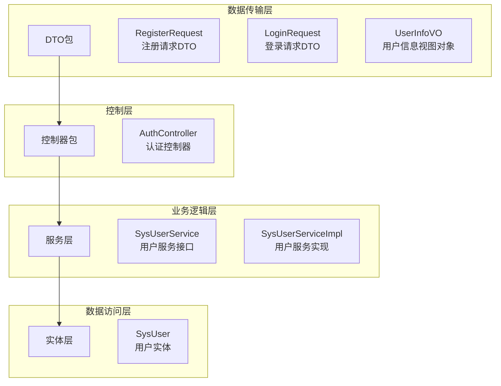
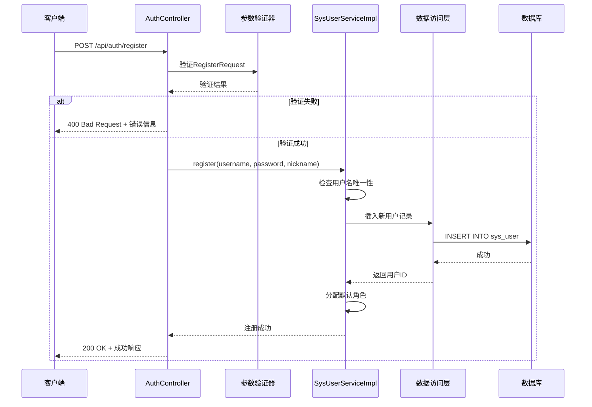
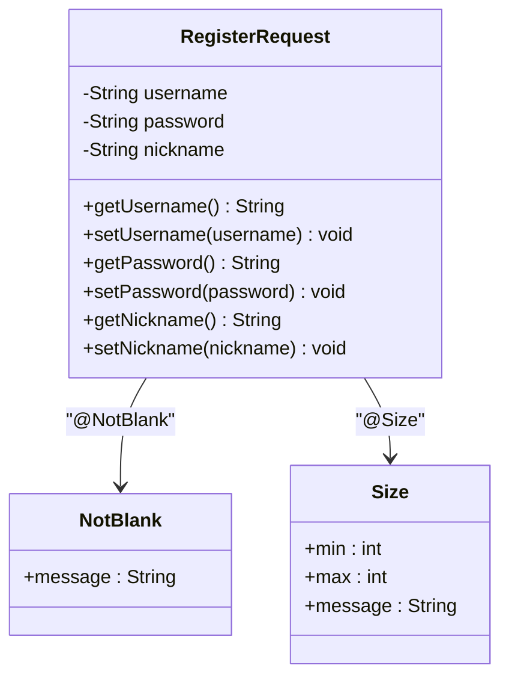
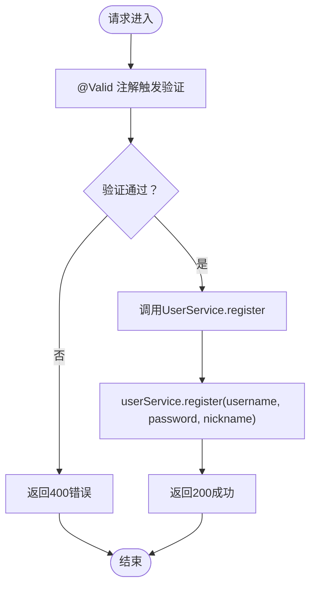
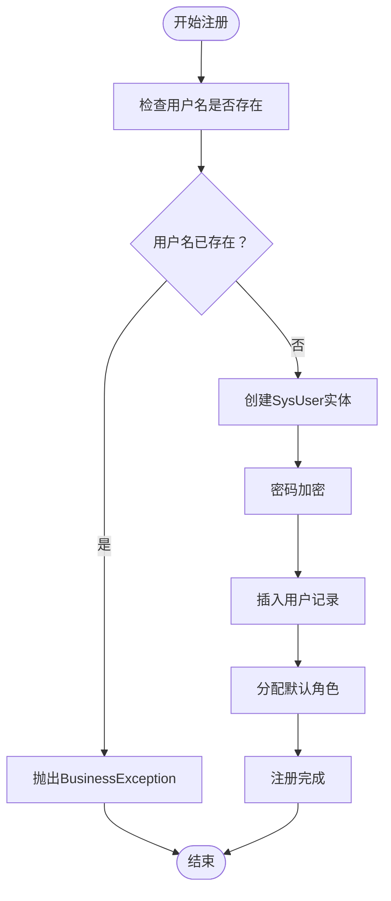
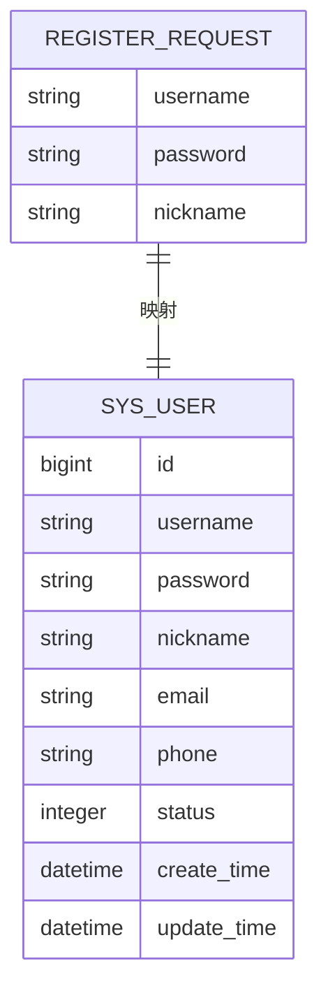
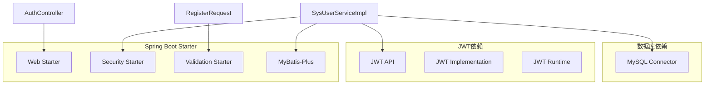
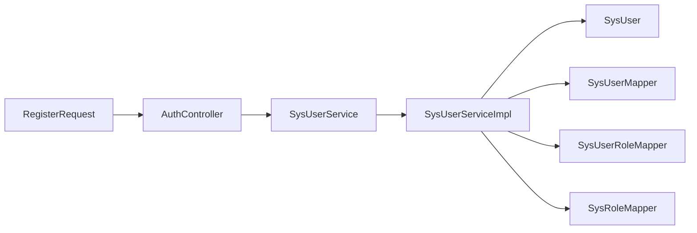

# 注册请求DTO

<cite>
**本文档引用的文件**
- [RegisterRequest.java](file://src/main/java/com/bookorder/dto/RegisterRequest.java)
- [AuthController.java](file://src/main/java/com/bookorder/controller/AuthController.java)
- [SysUserServiceImpl.java](file://src/main/java/com/bookorder/service/impl/SysUserServiceImpl.java)
- [SysUserService.java](file://src/main/java/com/bookorder/service/SysUserService.java)
- [SysUser.java](file://src/main/java/com/bookorder/entity/SysUser.java)
- [LoginRequest.java](file://src/main/java/com/bookorder/dto/LoginRequest.java)
- [UserInfoVO.java](file://src/main/java/com/bookorder/dto/UserInfoVO.java)
- [application.yml](file://src/main/resources/application.yml)
- [pom.xml](file://pom.xml)
</cite>

## 目录
1. [简介](#简介)
2. [项目结构](#项目结构)
3. [核心组件](#核心组件)
4. [架构概览](#架构概览)
5. [详细组件分析](#详细组件分析)
6. [依赖分析](#依赖分析)
7. [性能考虑](#性能考虑)
8. [故障排除指南](#故障排除指南)
9. [结论](#结论)

## 简介

本文档详细介绍了用户注册请求DTO（数据传输对象）的设计和实现。RegisterRequest类是系统用户注册功能的核心数据载体，负责接收和验证客户端提交的注册信息。该DTO采用Spring Validation注解确保数据的有效性和完整性，并与后端服务层紧密协作完成用户注册流程。

该DTO设计遵循了RESTful API的最佳实践，提供了清晰的字段定义、严格的验证规则和良好的扩展性。通过使用标准的HTTP状态码和统一的响应格式，确保了前后端交互的一致性和可靠性。

## 项目结构

系统采用典型的分层架构设计，RegisterRequest作为数据传输层的重要组成部分，位于DTO包中，与控制器、服务层和实体层形成清晰的职责分离。

**图表来源**
- [RegisterRequest.java:1-25](file://src/main/java/com/bookorder/dto/RegisterRequest.java#L1-L25)
- [AuthController.java:1-59](file://src/main/java/com/bookorder/controller/AuthController.java#L1-L59)
- [SysUserServiceImpl.java:1-87](file://src/main/java/com/bookorder/service/impl/SysUserServiceImpl.java#L1-L87)

**章节来源**
- [RegisterRequest.java:1-25](file://src/main/java/com/bookorder/dto/RegisterRequest.java#L1-L25)
- [AuthController.java:18-38](file://src/main/java/com/bookorder/controller/AuthController.java#L18-L38)

## 核心组件

### RegisterRequest类概述

RegisterRequest是用户注册功能的核心数据传输对象，采用Java Bean的标准属性模式设计，提供了完整的getter和setter方法。该类继承了Spring Validation框架的注解体系，确保了数据验证的自动化和一致性。

#### 设计特点

1. **字段封装性**: 所有字段均声明为私有属性，通过公共方法进行访问和修改
2. **验证注解集成**: 使用Jakarta Validation注解实现声明式验证
3. **可选字段设计**: 支持昵称等可选字段，提高灵活性
4. **类型安全**: 明确的字符串类型定义，确保数据一致性

#### 字段定义

| 字段名 | 类型 | 必填 | 长度限制 | 验证规则 | 描述 |
|--------|------|------|----------|----------|------|
| username | String | 是 | 3-50字符 | 非空且长度验证 | 用户唯一标识符 |
| password | String | 是 | 6-50字符 | 非空且长度验证 | 用户登录密码 |
| nickname | String | 否 | 最大50字符 | 可为空 | 用户显示名称 |

**章节来源**
- [RegisterRequest.java:6-24](file://src/main/java/com/bookorder/dto/RegisterRequest.java#L6-L24)

## 架构概览

系统采用MVC架构模式，RegisterRequest在整个请求处理流程中扮演着关键角色。从HTTP请求接收到数据库持久化的完整流程如下：

**图表来源**
- [AuthController.java:34-38](file://src/main/java/com/bookorder/controller/AuthController.java#L34-L38)
- [SysUserServiceImpl.java:57-80](file://src/main/java/com/bookorder/service/impl/SysUserServiceImpl.java#L57-L80)

**章节来源**
- [AuthController.java:28-38](file://src/main/java/com/bookorder/controller/AuthController.java#L28-L38)
- [SysUserServiceImpl.java:57-80](file://src/main/java/com/bookorder/service/impl/SysUserServiceImpl.java#L57-L80)

## 详细组件分析

### RegisterRequest类详细分析

#### 字段验证机制

RegisterRequest采用了多层次的验证策略，确保数据质量和用户体验：

**图表来源**
- [RegisterRequest.java:3-16](file://src/main/java/com/bookorder/dto/RegisterRequest.java#L3-L16)

#### 验证规则详解

1. **用户名验证规则**
   - 必填性：使用`@NotBlank`确保用户名非空
   - 长度限制：最小3字符，最大50字符
   - 验证消息：中文提示"用户名不能为空"和长度范围提示

2. **密码验证规则**
   - 必填性：使用`@NotBlank`确保密码非空
   - 长度限制：最小6字符，最大50字符
   - 验证消息：中文提示"密码不能为空"和长度范围提示

3. **昵称验证规则**
   - 可选字段：不包含任何验证注解
   - 长度限制：通过业务逻辑控制，最大50字符

#### 数据类型和约束

| 字段 | 数据类型 | 长度限制 | 格式要求 | 约束条件 |
|------|----------|----------|----------|----------|
| username | String | 3-50字符 | ASCII字母数字 | 必填，唯一性由业务层保证 |
| password | String | 6-50字符 | 任意字符 | 必填，将被加密存储 |
| nickname | String | 0-50字符 | UTF-8编码 | 可选，支持中文 |

**章节来源**
- [RegisterRequest.java:8-16](file://src/main/java/com/bookorder/dto/RegisterRequest.java#L8-L16)

### 控制器集成分析

#### AuthController中的注册处理

AuthController的register方法展示了RegisterRequest在实际应用中的使用方式：

**图表来源**
- [AuthController.java:34-38](file://src/main/java/com/bookorder/controller/AuthController.java#L34-L38)

#### 参数绑定和映射

控制器通过`@RequestBody`注解自动将JSON请求体映射到RegisterRequest对象，实现了无缝的数据绑定：

**章节来源**
- [AuthController.java:34-38](file://src/main/java/com/bookorder/controller/AuthController.java#L34-L38)

### 服务层实现分析

#### 注册业务逻辑

SysUserServiceImpl的register方法实现了完整的注册业务流程：

**图表来源**
- [SysUserServiceImpl.java:57-80](file://src/main/java/com/bookorder/service/impl/SysUserServiceImpl.java#L57-L80)

#### 事务管理和异常处理

注册操作使用了`@Transactional`注解确保数据一致性，当用户名重复时抛出`BusinessException`，错误码为400。

**章节来源**
- [SysUserServiceImpl.java:57-80](file://src/main/java/com/bookorder/service/impl/SysUserServiceImpl.java#L57-L80)

### 实体映射分析

#### 数据库映射关系

RegisterRequest与SysUser实体之间存在直接的映射关系：

**图表来源**
- [RegisterRequest.java:10-16](file://src/main/java/com/bookorder/dto/RegisterRequest.java#L10-L16)
- [SysUser.java:9-16](file://src/main/java/com/bookorder/entity/SysUser.java#L9-L16)

#### 字段对应关系

| RegisterRequest字段 | SysUser字段 | 映射说明 |
|-------------------|-------------|----------|
| username | username | 直接映射 |
| password | password | 经过加密处理 |
| nickname | nickname | 直接映射 |

**章节来源**
- [SysUser.java:10-16](file://src/main/java/com/bookorder/entity/SysUser.java#L10-L16)

## 依赖分析

### 外部依赖关系

系统使用了多种Spring Boot Starter来实现核心功能：

**图表来源**
- [pom.xml:26-76](file://pom.xml#L26-L76)

### 内部模块依赖

RegisterRequest与其他组件的依赖关系体现了清晰的分层架构：

**图表来源**
- [RegisterRequest.java:1-25](file://src/main/java/com/bookorder/dto/RegisterRequest.java#L1-L25)
- [AuthController.java:22-26](file://src/main/java/com/bookorder/controller/AuthController.java#L22-L26)
- [SysUserServiceImpl.java:25-32](file://src/main/java/com/bookorder/service/impl/SysUserServiceImpl.java#L25-L32)

**章节来源**
- [pom.xml:26-76](file://pom.xml#L26-L76)

## 性能考虑

### 验证性能优化

1. **注解验证效率**: 使用Spring Validation注解进行声明式验证，避免手动验证逻辑
2. **数据库查询优化**: 通过`getByUsername`方法使用索引查询用户名
3. **事务边界**: 将注册操作包装在单个事务中，减少数据库往返次数

### 安全性考虑

1. **密码加密**: 使用`PasswordEncoder`对密码进行加密存储
2. **SQL注入防护**: 通过MyBatis-Plus的条件构造器防止SQL注入
3. **输入验证**: 前端和后端双重验证确保数据安全

## 故障排除指南

### 常见验证错误

| 错误类型 | 触发条件 | 错误信息 | 解决方案 |
|----------|----------|----------|----------|
| 用户名为空 | username为null或空字符串 | "用户名不能为空" | 确保提供有效的用户名 |
| 用户名长度不符 | 长度小于3或大于50 | "用户名长度为3-50个字符" | 调整用户名长度至有效范围 |
| 密码为空 | password为null或空字符串 | "密码不能为空" | 提供符合要求的密码 |
| 密码长度不符 | 长度小于6或大于50 | "密码长度为6-50个字符" | 调整密码长度至有效范围 |
| 用户名重复 | 数据库中已存在相同用户名 | "用户名已存在" | 更换唯一的用户名 |

### 排错步骤

1. **验证请求格式**: 确认JSON格式正确且字段完整
2. **检查网络连接**: 确保能够访问`/api/auth/register`端点
3. **查看服务器日志**: 检查Spring Boot应用的日志输出
4. **验证数据库连接**: 确认MySQL数据库连接正常

**章节来源**
- [SysUserServiceImpl.java:60-62](file://src/main/java/com/bookorder/service/impl/SysUserServiceImpl.java#L60-L62)

## 结论

RegisterRequest DTO作为用户注册系统的核心数据载体，展现了现代Spring Boot应用的最佳实践。其设计充分考虑了以下方面：

1. **数据完整性**: 通过严格的验证规则确保输入数据的质量
2. **安全性**: 密码加密存储和多重验证机制保护用户信息安全
3. **可维护性**: 清晰的分层架构和标准化的命名约定便于代码维护
4. **扩展性**: 支持可选字段和灵活的验证规则适应未来需求变化

该DTO不仅满足了当前的注册需求，还为系统的进一步发展奠定了坚实的基础。通过合理的架构设计和完善的错误处理机制，确保了用户注册流程的稳定性和可靠性。