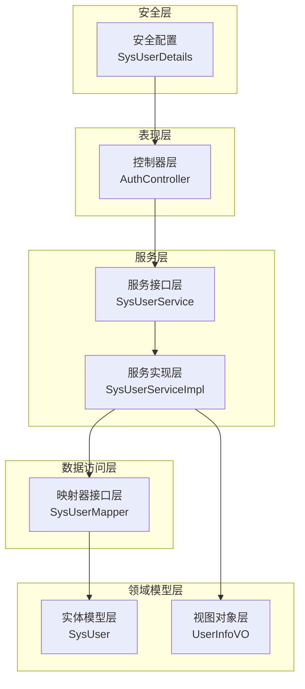
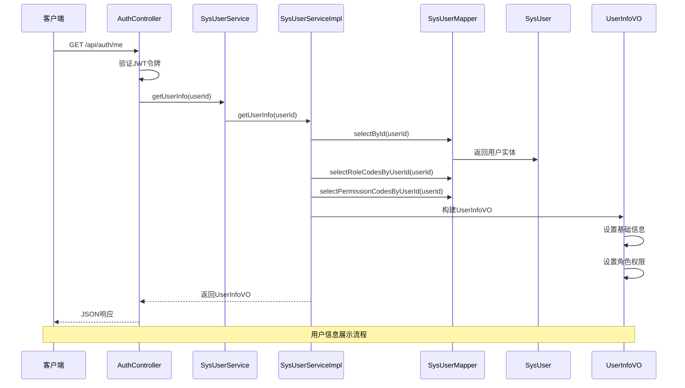
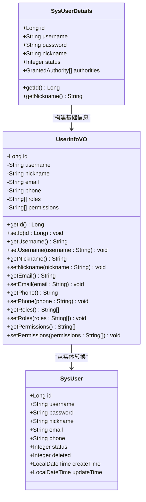
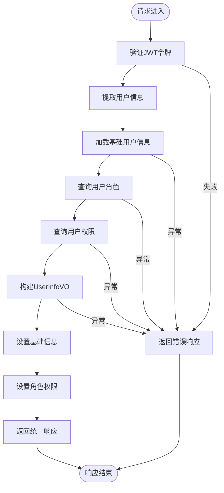
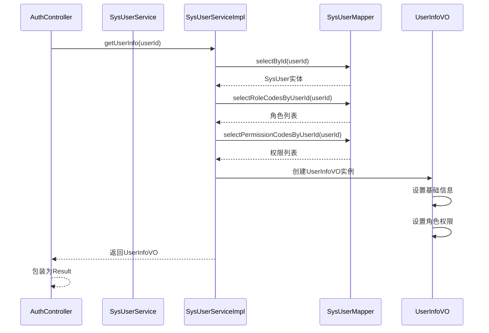
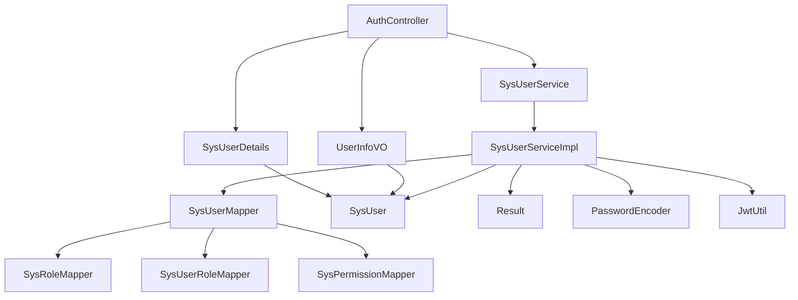

# 用户信息视图对象

<cite>
**本文档引用的文件**
- [UserInfoVO.java](file://src/main/java/com/bookorder/dto/UserInfoVO.java)
- [SysUser.java](file://src/main/java/com/bookorder/entity/SysUser.java)
- [SysUserDetails.java](file://src/main/java/com/bookorder/security/SysUserDetails.java)
- [SysUserMapper.java](file://src/main/java/com/bookorder/mapper/SysUserMapper.java)
- [SysUserServiceImpl.java](file://src/main/java/com/bookorder/service/impl/SysUserServiceImpl.java)
- [AuthController.java](file://src/main/java/com/bookorder/controller/AuthController.java)
- [Result.java](file://src/main/java/com/bookorder/common/Result.java)
- [LoginRequest.java](file://src/main/java/com/bookorder/dto/LoginRequest.java)
- [RegisterRequest.java](file://src/main/java/com/bookorder/dto/RegisterRequest.java)
- [README.md](file://README.md)
</cite>

## 目录
1. [简介](#简介)
2. [项目结构](#项目结构)
3. [核心组件](#核心组件)
4. [架构概览](#架构概览)
5. [详细组件分析](#详细组件分析)
6. [依赖关系分析](#依赖关系分析)
7. [性能考虑](#性能考虑)
8. [故障排除指南](#故障排除指南)
9. [结论](#结论)

## 简介

本文档深入解析用户信息视图对象（UserInfoVO）的设计理念、实现细节和应用场景。UserInfoVO作为值对象（Value Object），专门用于用户信息的展示和前后端数据交互，它与数据传输对象（DTO）在设计目的和使用场景上有着明确的区别。

该系统采用Spring Boot 3 + Java 17 + MyBatis-Plus + Spring Security + JWT的技术栈，实现了完整的RBAC权限管理体系。UserInfoVO在其中扮演着关键角色，负责将用户的基本信息、角色权限等数据进行合理的数据结构化封装，以便于前端展示和后续的权限控制。

## 项目结构

该项目遵循标准的MVC架构模式，采用分层设计：



**图表来源**
- [AuthController.java:18-59](file://src/main/java/com/bookorder/controller/AuthController.java#L18-L59)
- [SysUserServiceImpl.java:22-87](file://src/main/java/com/bookorder/service/impl/SysUserServiceImpl.java#L22-L87)
- [SysUserMapper.java:11-25](file://src/main/java/com/bookorder/mapper/SysUserMapper.java#L11-L25)

**章节来源**
- [README.md:128-168](file://README.md#L128-L168)

## 核心组件

### UserInfoVO类设计

UserInfoVO是一个轻量级的值对象，专门用于用户信息的展示和数据传输。其设计遵循以下原则：

#### 数据结构设计
- **标识信息**：用户ID、用户名
- **基本信息**：昵称、邮箱、电话
- **权限信息**：角色列表、权限列表

#### 字段组织原则
1. **展示导向**：只包含前端展示所需的核心字段
2. **最小化原则**：避免冗余字段，减少网络传输开销
3. **类型安全**：使用强类型定义，确保数据完整性
4. **可扩展性**：预留扩展字段，支持未来功能需求

#### 封装策略
- 使用私有字段配合公共getter/setter方法
- 支持链式调用和构建模式
- 符合JavaBean规范，便于框架序列化

**章节来源**
- [UserInfoVO.java:5-29](file://src/main/java/com/bookorder/dto/UserInfoVO.java#L5-L29)

### DTO与VO的区别

| 特性 | DTO（数据传输对象） | VO（值对象） |
|------|-------------------|-------------|
| **设计目的** | 跨层数据传输 | 展示层数据封装 |
| **使用场景** | 控制器间、服务间通信 | 前后端数据交换 |
| **数据范围** | 包含完整业务数据 | 仅包含展示所需数据 |
| **复杂度** | 可能包含复杂业务逻辑 | 简单数据容器 |
| **生命周期** | 短暂的传输载体 | 长期存在的展示对象 |

## 架构概览

系统采用分层架构，UserInfoVO在整个数据流转过程中发挥着桥梁作用：



**图表来源**
- [AuthController.java:40-57](file://src/main/java/com/bookorder/controller/AuthController.java#L40-L57)
- [SysUserServiceImpl.java:82-85](file://src/main/java/com/bookorder/service/impl/SysUserServiceImpl.java#L82-L85)
- [SysUserMapper.java:14-23](file://src/main/java/com/bookorder/mapper/SysUserMapper.java#L14-L23)

## 详细组件分析

### UserInfoVO类结构分析



**图表来源**
- [UserInfoVO.java:5-29](file://src/main/java/com/bookorder/dto/UserInfoVO.java#L5-L29)
- [SysUser.java:7-48](file://src/main/java/com/bookorder/entity/SysUser.java#L7-L48)
- [SysUserDetails.java:10-54](file://src/main/java/com/bookorder/security/SysUserDetails.java#L10-L54)

### 数据流处理流程



**图表来源**
- [AuthController.java:40-57](file://src/main/java/com/bookorder/controller/AuthController.java#L40-L57)
- [SysUserServiceImpl.java:82-85](file://src/main/java/com/bookorder/service/impl/SysUserServiceImpl.java#L82-L85)

### 字段定义与数据封装

#### 基础信息字段
- **id**: 用户唯一标识符，Long类型，主键
- **username**: 用户名，字符串类型，登录凭证
- **nickname**: 昵称，字符串类型，显示名称

#### 联系信息字段
- **email**: 邮箱地址，字符串类型，可为空
- **phone**: 电话号码，字符串类型，可为空

#### 权限信息字段
- **roles**: 角色列表，字符串数组，如["ADMIN", "READER"]
- **permissions**: 权限列表，字符串数组，如["system:manage", "user:list"]

#### 数据封装原则
1. **类型一致性**：所有字段类型与数据库映射保持一致
2. **空值处理**：允许部分字段为空，体现实际业务场景
3. **权限过滤**：仅暴露必要的权限信息给前端
4. **命名规范**：遵循驼峰命名法，符合JSON序列化要求

**章节来源**
- [UserInfoVO.java:7-13](file://src/main/java/com/bookorder/dto/UserInfoVO.java#L7-L13)
- [SysUser.java:10-15](file://src/main/java/com/bookorder/entity/SysUser.java#L10-L15)

### 查询与展示示例

#### 后端查询流程


**图表来源**
- [AuthController.java:47-54](file://src/main/java/com/bookorder/controller/AuthController.java#L47-L54)
- [SysUserServiceImpl.java:82-85](file://src/main/java/com/bookorder/service/impl/SysUserServiceImpl.java#L82-L85)

#### 前端展示格式
系统返回的标准JSON格式如下：
```json
{
  "code": 200,
  "message": "success",
  "data": {
    "id": 1,
    "username": "admin",
    "nickname": "系统管理员",
    "email": null,
    "phone": null,
    "roles": ["ADMIN"],
    "permissions": ["system:manage", "user:manage", "user:list"]
  }
}
```

**章节来源**
- [README.md:111-126](file://README.md#L111-L126)

## 依赖关系分析

### 组件耦合关系



**图表来源**
- [AuthController.java:22-26](file://src/main/java/com/bookorder/controller/AuthController.java#L22-L26)
- [SysUserServiceImpl.java:25-41](file://src/main/java/com/bookorder/service/impl/SysUserServiceImpl.java#L25-L41)

### 外部依赖分析

系统主要依赖以下外部组件：
- **Spring Security**: 提供认证授权机制
- **MyBatis-Plus**: 提供ORM映射和数据库操作
- **JWT**: 提供令牌生成和验证
- **MySQL**: 数据库存储

这些依赖确保了UserInfoVO能够在安全、高效的环境中正常工作。

**章节来源**
- [README.md:5-14](file://README.md#L5-L14)

## 性能考虑

### 查询优化策略

1. **懒加载机制**: UserInfoVO仅包含必要字段，避免不必要的数据传输
2. **批量查询**: 角色和权限通过专门的SQL查询一次性获取
3. **缓存策略**: 可在服务层添加适当的缓存机制
4. **连接池优化**: 合理配置数据库连接池参数

### 内存使用优化

- **对象复用**: 在同一请求范围内复用UserInfoVO实例
- **集合优化**: 使用合适的集合类型，避免内存泄漏
- **及时释放**: 确保临时对象及时被垃圾回收

## 故障排除指南

### 常见问题及解决方案

#### 1. 用户信息查询失败
**症状**: 返回空的用户信息或异常
**原因**: 用户不存在或数据库连接异常
**解决**: 检查用户ID有效性，确认数据库连接状态

#### 2. 权限信息缺失
**症状**: roles或permissions列表为空
**原因**: 用户未正确分配角色或权限
**解决**: 验证用户角色关联表数据，检查权限配置

#### 3. JSON序列化问题
**症状**: 响应格式不正确
**原因**: 字段类型不匹配或序列化配置错误
**解决**: 确认字段类型定义，检查Jackson配置

**章节来源**
- [AuthController.java:40-57](file://src/main/java/com/bookorder/controller/AuthController.java#L40-L57)
- [SysUserServiceImpl.java:82-85](file://src/main/java/com/bookorder/service/impl/SysUserServiceImpl.java#L82-L85)

## 结论

UserInfoVO作为用户信息展示的核心数据结构，在整个系统中发挥着重要的桥梁作用。它通过精心设计的数据结构和封装策略，有效地解决了前后端数据交互中的关键问题。

### 设计优势

1. **职责清晰**: 专注于用户信息展示，避免了过度复杂的业务逻辑
2. **性能优化**: 通过最小化数据传输，提高了系统的整体性能
3. **扩展性强**: 良好的设计为未来的功能扩展提供了便利
4. **安全性**: 仅暴露必要的用户信息，符合最小权限原则

### 应用场景

- 用户个人资料页面展示
- 权限控制和菜单渲染
- 用户信息编辑界面
- 系统日志和审计记录

通过合理使用UserInfoVO，系统能够为用户提供高效、安全、友好的用户体验，同时保证系统的稳定性和可维护性。