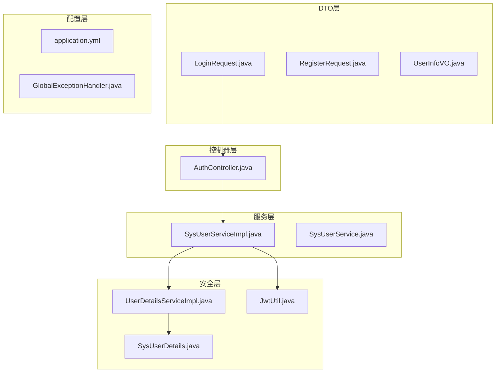
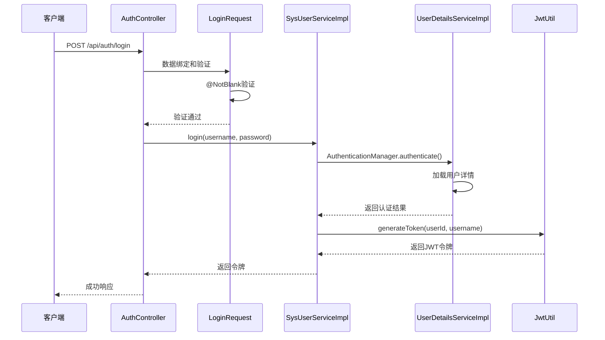
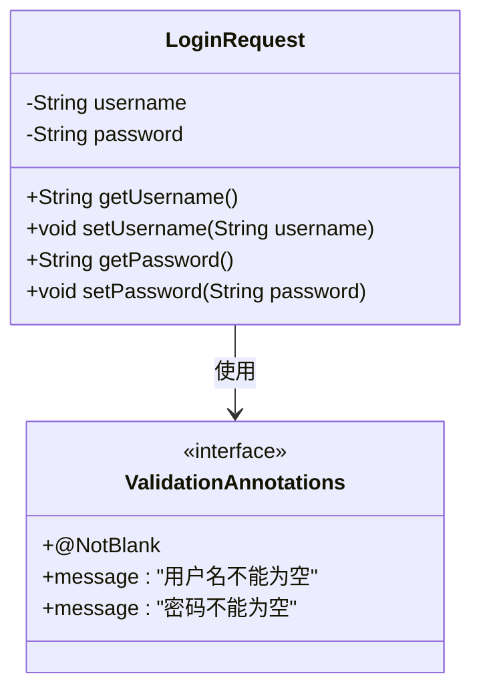
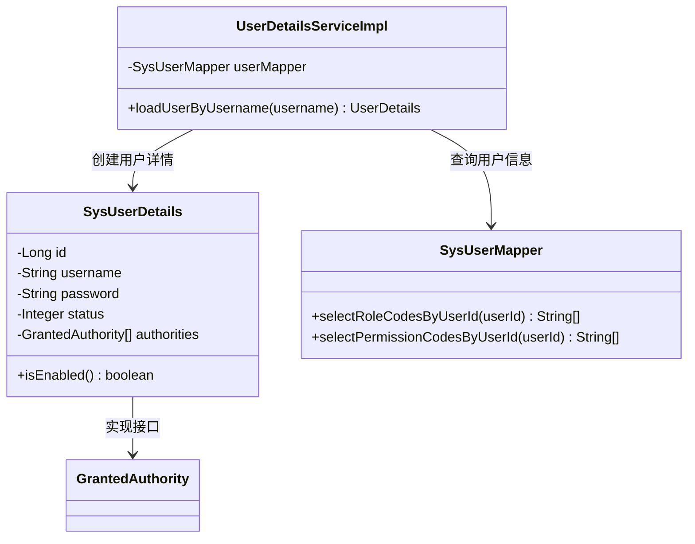
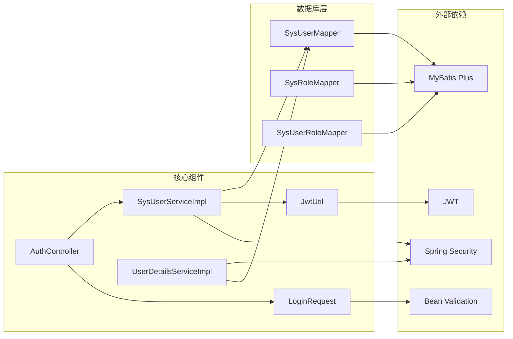

# 登录请求DTO

<cite>
**本文档引用的文件**
- [LoginRequest.java](file://src/main/java/com/bookorder/dto/LoginRequest.java)
- [AuthController.java](file://src/main/java/com/bookorder/controller/AuthController.java)
- [SysUserServiceImpl.java](file://src/main/java/com/bookorder/service/impl/SysUserServiceImpl.java)
- [UserDetailsServiceImpl.java](file://src/main/java/com/bookorder/security/UserDetailsServiceImpl.java)
- [JwtUtil.java](file://src/main/java/com/bookorder/security/JwtUtil.java)
- [GlobalExceptionHandler.java](file://src/main/java/com/bookorder/common/GlobalExceptionHandler.java)
- [application.yml](file://src/main/resources/application.yml)
</cite>

## 目录
1. [简介](#简介)
2. [项目结构](#项目结构)
3. [核心组件](#核心组件)
4. [架构概览](#架构概览)
5. [详细组件分析](#详细组件分析)
6. [依赖关系分析](#依赖关系分析)
7. [性能考虑](#性能考虑)
8. [故障排除指南](#故障排除指南)
9. [结论](#结论)

## 简介

登录请求DTO（数据传输对象）是用户认证系统的核心组件之一，负责封装用户登录时提交的凭证信息。本文档将深入分析LoginRequest类的设计目的、字段定义、验证规则以及在整个认证流程中的作用和与其他组件的交互关系。

## 项目结构

该项目采用标准的Spring Boot分层架构，登录功能涉及以下关键目录和文件：



**图表来源**
- [LoginRequest.java:1-18](file://src/main/java/com/bookorder/dto/LoginRequest.java#L1-L18)
- [AuthController.java:1-59](file://src/main/java/com/bookorder/controller/AuthController.java#L1-L59)
- [SysUserServiceImpl.java:1-87](file://src/main/java/com/bookorder/service/impl/SysUserServiceImpl.java#L1-L87)

**章节来源**
- [LoginRequest.java:1-18](file://src/main/java/com/bookorder/dto/LoginRequest.java#L1-L18)
- [AuthController.java:1-59](file://src/main/java/com/bookorder/controller/AuthController.java#L1-L59)

## 核心组件

### LoginRequest类设计分析

LoginRequest是一个简单的数据传输对象，专门用于处理用户登录请求。该类的设计体现了以下特点：

#### 字段定义与类型
- **username**: 用户名字段，类型为String
- **password**: 密码字段，类型为String

#### 验证注解配置
- 使用`@NotBlank`注解确保字段非空
- 错误消息配置为中文提示："用户名不能为空" 和 "密码不能为空"

#### 设计模式
该类遵循Java Bean规范，提供了标准的getter和setter方法，便于Spring框架进行数据绑定和序列化。

**章节来源**
- [LoginRequest.java:5-17](file://src/main/java/com/bookorder/dto/LoginRequest.java#L5-L17)

## 架构概览

登录请求DTO在整个认证系统中扮演着关键角色，其工作流程如下：



**图表来源**
- [AuthController.java:28-32](file://src/main/java/com/bookorder/controller/AuthController.java#L28-L32)
- [SysUserServiceImpl.java:50-55](file://src/main/java/com/bookorder/service/impl/SysUserServiceImpl.java#L50-L55)
- [UserDetailsServiceImpl.java:23-48](file://src/main/java/com/bookorder/security/UserDetailsServiceImpl.java#L23-L48)

## 详细组件分析

### LoginRequest类详细分析

#### 类结构设计



**图表来源**
- [LoginRequest.java:5-17](file://src/main/java/com/bookorder/dto/LoginRequest.java#L5-L17)

#### 字段验证规则

| 字段 | 注解 | 验证规则 | 错误消息 |
|------|------|----------|----------|
| username | @NotBlank | 必填字段，不允许为空字符串 | "用户名不能为空" |
| password | @NotBlank | 必填字段，不允许为空字符串 | "密码不能为空" |

#### 数据格式要求

登录请求的JSON格式应为：
```json
{
    "username": "string",
    "password": "string"
}
```

#### 参数验证策略

1. **输入验证**: 使用Bean Validation框架进行实时验证
2. **错误处理**: 自定义全局异常处理器统一处理验证错误
3. **安全性**: 密码字段不进行序列化输出，仅用于认证

**章节来源**
- [LoginRequest.java:7-11](file://src/main/java/com/bookorder/dto/LoginRequest.java#L7-L11)
- [GlobalExceptionHandler.java:40-47](file://src/main/java/com/bookorder/common/GlobalExceptionHandler.java#L40-L47)

### 认证流程集成

#### 控制器集成

AuthController中的登录端点展示了LoginRequest的完整使用流程：

```mermaid
flowchart TD
A[POST /api/auth/login] --> B[@Valid参数绑定]
B --> C{验证通过?}
C --> |否| D[返回400错误]
C --> |是| E[调用UserService.login]
E --> F[AuthenticationManager认证]
F --> G[生成JWT令牌]
G --> H[返回200成功响应]
D --> I[GlobalExceptionHandler处理]
I --> J[统一错误格式]
```

**图表来源**
- [AuthController.java:28-32](file://src/main/java/com/bookorder/controller/AuthController.java#L28-L32)
- [SysUserServiceImpl.java:50-55](file://src/main/java/com/bookorder/service/impl/SysUserServiceImpl.java#L50-L55)

#### 服务层处理

SysUserServiceImpl中的login方法实现了完整的认证逻辑：

1. **认证管理**: 使用AuthenticationManager进行用户名密码认证
2. **令牌生成**: 通过JWT工具类生成访问令牌
3. **异常处理**: 处理认证失败和业务异常

**章节来源**
- [AuthController.java:28-32](file://src/main/java/com/bookorder/controller/AuthController.java#L28-L32)
- [SysUserServiceImpl.java:50-55](file://src/main/java/com/bookorder/service/impl/SysUserServiceImpl.java#L50-L55)

### 安全配置集成

#### 用户详情服务

UserDetailsServiceImpl负责加载用户的安全信息：



**图表来源**
- [UserDetailsServiceImpl.java:18-48](file://src/main/java/com/bookorder/security/UserDetailsServiceImpl.java#L18-L48)
- [SysUserDetails.java:10-53](file://src/main/java/com/bookorder/security/SysUserDetails.java#L10-L53)

#### JWT配置

application.yml中的JWT配置参数：

| 配置项 | 值 | 说明 |
|--------|-----|------|
| jwt.secret | Y29tLmJvb2tvcmRlci5ib29rLW9yZGVyLXN5c3RlbS1qd3Qtc2VjcmV0LWtl... | Base64编码的密钥 |
| jwt.expiration | 86400000 | 过期时间（毫秒），默认24小时 |

**章节来源**
- [UserDetailsServiceImpl.java:23-48](file://src/main/java/com/bookorder/security/UserDetailsServiceImpl.java#L23-L48)
- [application.yml:26-28](file://src/main/resources/application.yml#L26-L28)

## 依赖关系分析

### 组件依赖图



**图表来源**
- [LoginRequest.java:3](file://src/main/java/com/bookorder/dto/LoginRequest.java#L3)
- [AuthController.java:4](file://src/main/java/com/bookorder/controller/AuthController.java#L4)
- [SysUserServiceImpl.java:15](file://src/main/java/com/bookorder/service/impl/SysUserServiceImpl.java#L15)

### 关键依赖关系

1. **验证依赖**: LoginRequest依赖Bean Validation框架进行字段验证
2. **安全依赖**: SysUserServiceImpl依赖Spring Security进行认证管理
3. **数据访问依赖**: 所有服务类依赖MyBatis Plus进行数据库操作
4. **加密依赖**: 使用BCryptPasswordEncoder进行密码加密

**章节来源**
- [SysUserServiceImpl.java:15-18](file://src/main/java/com/bookorder/service/impl/SysUserServiceImpl.java#L15-L18)

## 性能考虑

### 认证性能优化

1. **数据库查询优化**: 使用MyBatis Plus的条件构造器进行高效查询
2. **缓存策略**: 可考虑添加用户信息缓存减少数据库访问
3. **连接池配置**: 合理配置数据库连接池参数
4. **日志优化**: 调整日志级别避免认证过程中的性能开销

### 安全性能平衡

1. **密码哈希成本**: BCrypt的计算成本需要在安全性与性能间平衡
2. **令牌过期时间**: 合理设置JWT过期时间避免频繁重新认证
3. **并发控制**: 在高并发场景下考虑令牌刷新机制

## 故障排除指南

### 常见问题及解决方案

#### 验证错误处理

当LoginRequest验证失败时，系统会返回统一的错误格式：

| 错误类型 | HTTP状态码 | 错误代码 | 错误消息 |
|----------|------------|----------|----------|
| 参数验证失败 | 400 | 400 | 字段验证错误消息 |
| 凭证错误 | 401 | 401 | "用户名或密码错误" |
| 权限不足 | 403 | 403 | "权限不足" |
| 系统异常 | 500 | 500 | "系统内部错误" |

#### 调试建议

1. **启用调试日志**: 在application.yml中调整日志级别
2. **检查数据库连接**: 确认MySQL连接配置正确
3. **验证JWT配置**: 检查JWT密钥和过期时间配置
4. **监控认证频率**: 防止暴力破解攻击

**章节来源**
- [GlobalExceptionHandler.java:28-32](file://src/main/java/com/bookorder/common/GlobalExceptionHandler.java#L28-L32)
- [application.yml:30-33](file://src/main/resources/application.yml#L30-L33)

## 结论

LoginRequest作为用户认证系统的基础组件，虽然结构简单但承担着重要的职责。其设计体现了以下优势：

1. **简洁性**: 仅包含必要的认证字段，避免了过度设计
2. **可验证性**: 通过Bean Validation确保数据完整性
3. **安全性**: 与Spring Security深度集成，提供完整的认证保障
4. **可扩展性**: 易于扩展其他认证方式（如多因素认证）

该DTO在实际应用中应该：
- 严格遵守验证规则
- 配合HTTPS协议使用
- 定期更新JWT配置
- 实施适当的速率限制和防护措施

通过合理的配置和使用，LoginRequest能够为整个认证系统提供稳定可靠的基础支撑。