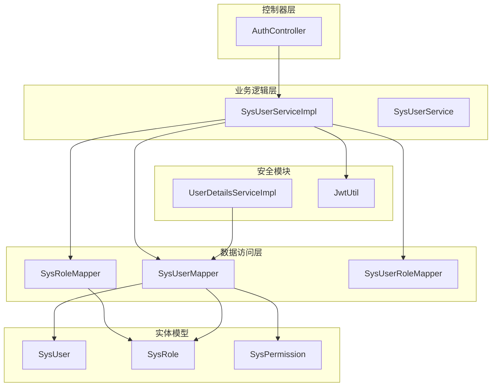
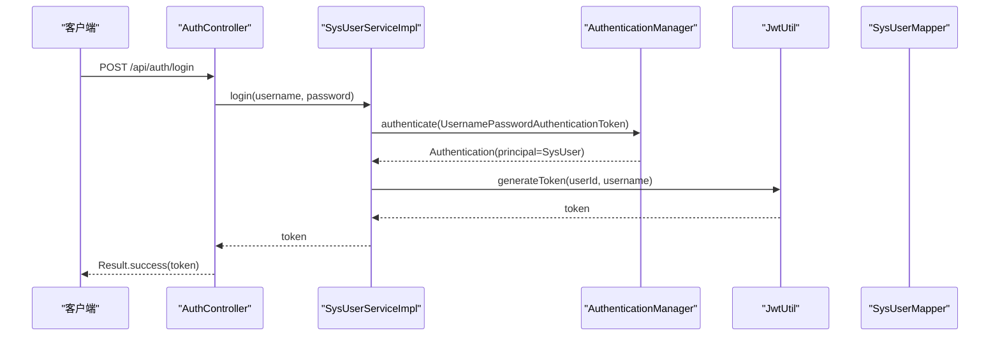
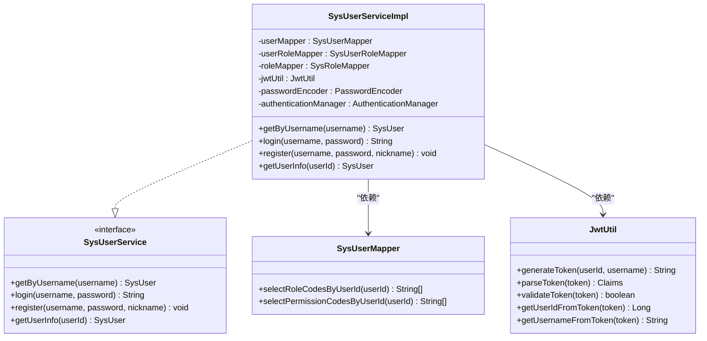
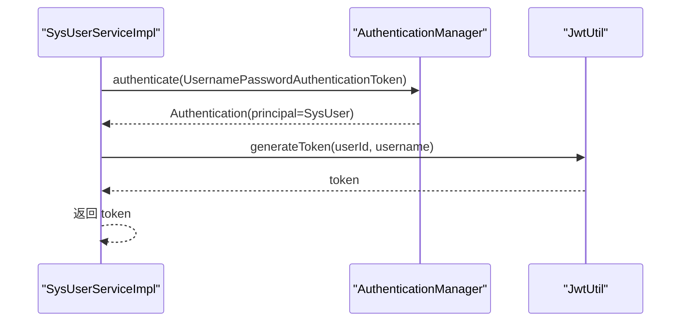
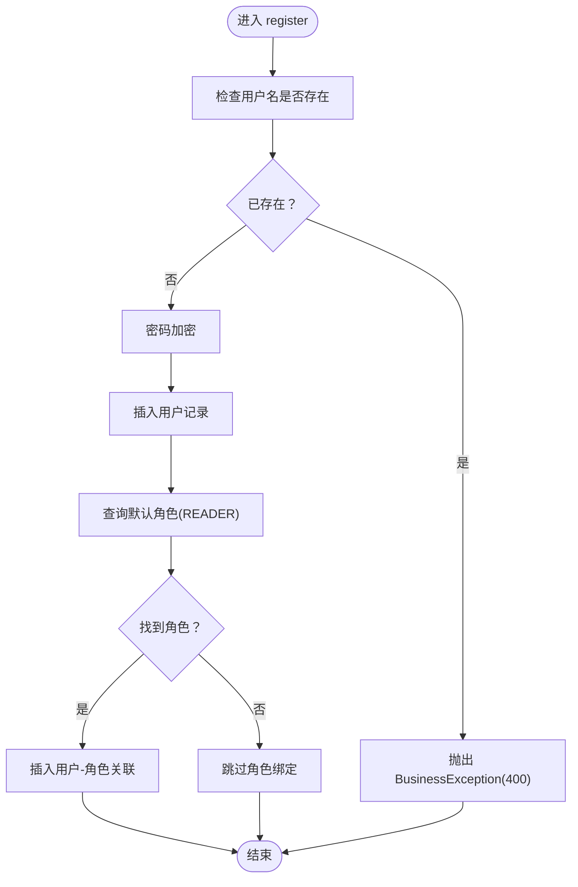
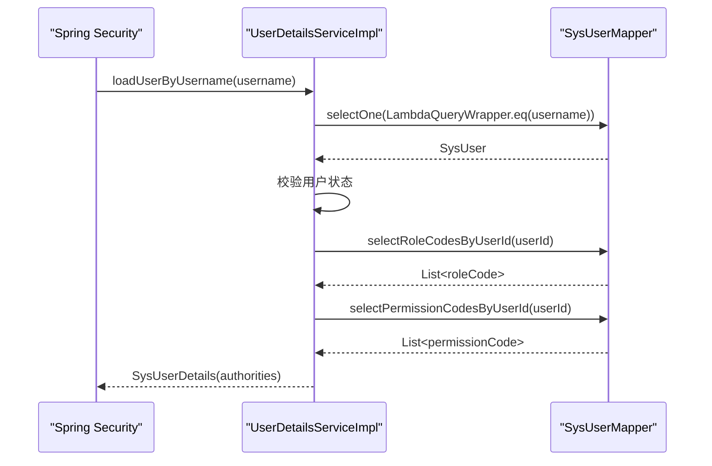
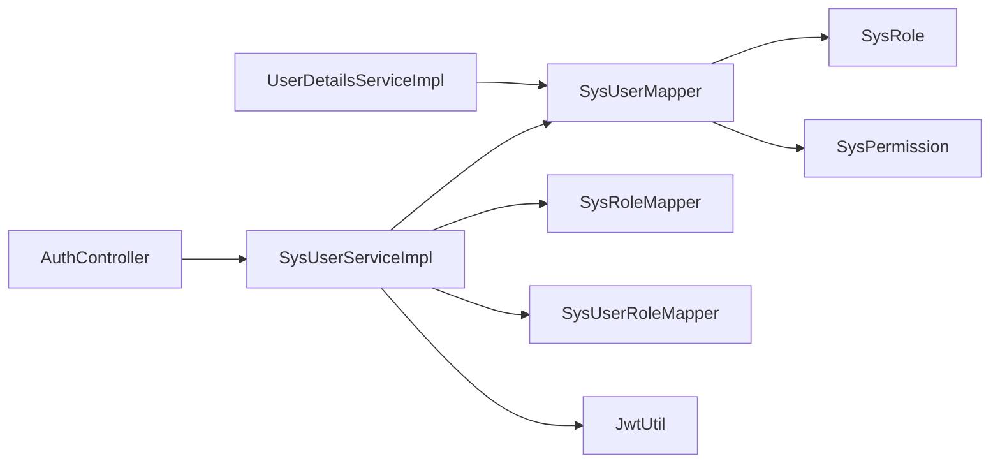

# 业务逻辑层

<cite>
**本文档引用的文件**
- [SysUserService.java](file://src/main/java/com/bookorder/service/SysUserService.java)
- [SysUserServiceImpl.java](file://src/main/java/com/bookorder/service/impl/SysUserServiceImpl.java)
- [SysUser.java](file://src/main/java/com/bookorder/entity/SysUser.java)
- [SysRole.java](file://src/main/java/com/bookorder/entity/SysRole.java)
- [SysPermission.java](file://src/main/java/com/bookorder/entity/SysPermission.java)
- [SysUserMapper.java](file://src/main/java/com/bookorder/mapper/SysUserMapper.java)
- [UserDetailsServiceImpl.java](file://src/main/java/com/bookorder/security/UserDetailsServiceImpl.java)
- [JwtUtil.java](file://src/main/java/com/bookorder/security/JwtUtil.java)
- [AuthController.java](file://src/main/java/com/bookorder/controller/AuthController.java)
- [BusinessException.java](file://src/main/java/com/bookorder/common/BusinessException.java)
- [application.yml](file://src/main/resources/application.yml)
</cite>

## 目录
1. [简介](#简介)
2. [项目结构](#项目结构)
3. [核心组件](#核心组件)
4. [架构总览](#架构总览)
5. [详细组件分析](#详细组件分析)
6. [依赖关系分析](#依赖关系分析)
7. [性能考虑](#性能考虑)
8. [故障排除指南](#故障排除指南)
9. [结论](#结论)
10. [附录](#附录)

## 简介
本文件聚焦于业务逻辑层（Service Layer），围绕 SysUserService 接口及其实现 SysUserServiceImpl 的设计与实现进行深入解析。内容涵盖：
- 业务逻辑的组织方式与职责划分
- 事务管理与异常处理策略
- 用户登录、注册、信息查询等核心业务流程
- 业务层与数据访问层（Mapper）的交互模式与数据传递方式
- 权限验证与安全集成点
- 扩展设计模式与最佳实践
- 边界条件与业务规则的实现细节

## 项目结构
业务逻辑层位于 com.bookorder.service 包中，采用 Spring Boot + MyBatis-Plus 架构，结合 Spring Security 进行认证授权。核心目录与文件如下：
- 接口与实现：SysUserService、SysUserServiceImpl
- 实体模型：SysUser、SysRole、SysPermission
- 数据访问：SysUserMapper（含自定义 SQL 查询角色与权限）
- 安全模块：UserDetailsServiceImpl、JwtUtil
- 控制器：AuthController（暴露 /api/auth 下的认证接口）
- 公共异常：BusinessException
- 配置：application.yml（JWT 密钥与过期时间）

图表来源
- [SysUserServiceImpl.java:1-87](file://src/main/java/com/bookorder/service/impl/SysUserServiceImpl.java#L1-L87)
- [SysUserService.java:1-16](file://src/main/java/com/bookorder/service/SysUserService.java#L1-L16)
- [SysUserMapper.java:1-25](file://src/main/java/com/bookorder/mapper/SysUserMapper.java#L1-L25)
- [UserDetailsServiceImpl.java:1-50](file://src/main/java/com/bookorder/security/UserDetailsServiceImpl.java#L1-L50)
- [JwtUtil.java:1-62](file://src/main/java/com/bookorder/security/JwtUtil.java#L1-L62)
- [AuthController.java:1-59](file://src/main/java/com/bookorder/controller/AuthController.java#L1-L59)

章节来源
- [SysUserService.java:1-16](file://src/main/java/com/bookorder/service/SysUserService.java#L1-L16)
- [SysUserServiceImpl.java:1-87](file://src/main/java/com/bookorder/service/impl/SysUserServiceImpl.java#L1-L87)
- [application.yml:1-33](file://src/main/resources/application.yml#L1-L33)

## 核心组件
- SysUserService：定义用户相关业务契约，继承 MyBatis-Plus 的 IService，提供按用户名查询、登录、注册、获取用户信息等方法。
- SysUserServiceImpl：具体实现，负责：
  - 身份认证与令牌签发（结合 AuthenticationManager 与 JwtUtil）
  - 注册流程（密码加密、默认角色绑定、事务控制）
  - 基础查询（按用户名与按 ID）
- SysUserMapper：扩展查询用户的角色代码与权限代码，用于权限体系构建。
- UserDetailsServiceImpl：Spring Security 的 UserDetailsService 实现，加载用户的角色与权限集合。
- JwtUtil：JWT 工具，生成、解析与校验 Token。
- AuthController：对外暴露登录、注册、获取当前用户信息的 REST 接口。

章节来源
- [SysUserService.java:6-15](file://src/main/java/com/bookorder/service/SysUserService.java#L6-L15)
- [SysUserServiceImpl.java:23-86](file://src/main/java/com/bookorder/service/impl/SysUserServiceImpl.java#L23-L86)
- [SysUserMapper.java:12-24](file://src/main/java/com/bookorder/mapper/SysUserMapper.java#L12-L24)
- [UserDetailsServiceImpl.java:18-49](file://src/main/java/com/bookorder/security/UserDetailsServiceImpl.java#L18-L49)
- [JwtUtil.java:14-61](file://src/main/java/com/bookorder/security/JwtUtil.java#L14-L61)
- [AuthController.java:18-59](file://src/main/java/com/bookorder/controller/AuthController.java#L18-L59)

## 架构总览
业务逻辑层通过接口隔离与实现解耦，遵循分层架构原则：
- 控制器层仅负责请求参数接收与响应封装
- 业务层负责核心业务规则与流程编排
- 数据访问层专注数据持久化与复杂查询
- 安全模块负责认证与授权

图表来源
- [AuthController.java:28-32](file://src/main/java/com/bookorder/controller/AuthController.java#L28-L32)
- [SysUserServiceImpl.java:50-55](file://src/main/java/com/bookorder/service/impl/SysUserServiceImpl.java#L50-L55)
- [JwtUtil.java:27-35](file://src/main/java/com/bookorder/security/JwtUtil.java#L27-L35)

## 详细组件分析

### SysUserService 接口设计
- 设计理念
  - 继承 MyBatis-Plus 的 IService，复用通用 CRUD 能力
  - 明确暴露业务方法：按用户名查询、登录、注册、获取用户信息
  - 将“登录”从控制器下沉到业务层，便于统一处理认证与鉴权
- 方法职责
  - getByUsername：基于用户名检索用户，供认证与权限加载使用
  - login：完成身份认证并签发 JWT
  - register：完成用户注册与默认角色绑定，事务保障一致性
  - getUserInfo：按用户 ID 获取完整用户信息

章节来源
- [SysUserService.java:6-15](file://src/main/java/com/bookorder/service/SysUserService.java#L6-L15)

### SysUserServiceImpl 实现详解
- 类图概览

图表来源
- [SysUserService.java:6-15](file://src/main/java/com/bookorder/service/SysUserService.java#L6-L15)
- [SysUserServiceImpl.java:23-86](file://src/main/java/com/bookorder/service/impl/SysUserServiceImpl.java#L23-L86)
- [SysUserMapper.java:12-24](file://src/main/java/com/bookorder/mapper/SysUserMapper.java#L12-L24)
- [JwtUtil.java:14-61](file://src/main/java/com/bookorder/security/JwtUtil.java#L14-L61)

- 登录流程（login）
  - 使用 AuthenticationManager 对用户名与密码进行认证
  - 从认证主体中提取用户 ID
  - 通过 JwtUtil 生成 JWT
  - 返回给控制器封装为 Result
  - 异常：认证失败由 Spring Security 抛出，交由全局异常处理器处理

图表来源
- [SysUserServiceImpl.java:50-55](file://src/main/java/com/bookorder/service/impl/SysUserServiceImpl.java#L50-L55)
- [JwtUtil.java:27-35](file://src/main/java/com/bookorder/security/JwtUtil.java#L27-L35)

- 注册流程（register）
  - 参数校验：用户名存在性检查
  - 密码加密：使用 PasswordEncoder
  - 插入用户并设置默认状态
  - 查询默认角色（READER）并插入用户-角色关联
  - 事务控制：使用 @Transactional，保证注册与角色绑定的一致性
  - 异常：用户名重复抛出 BusinessException，错误码 400

图表来源
- [SysUserServiceImpl.java:58-80](file://src/main/java/com/bookorder/service/impl/SysUserServiceImpl.java#L58-L80)
- [BusinessException.java:3-18](file://src/main/java/com/bookorder/common/BusinessException.java#L3-L18)

- 用户信息查询（getUserInfo）
  - 通过主键查询用户详情
  - 供控制器组装 UserInfoVO 并返回

章节来源
- [SysUserServiceImpl.java:43-47](file://src/main/java/com/bookorder/service/impl/SysUserServiceImpl.java#L43-L47)
- [SysUserServiceImpl.java:57-85](file://src/main/java/com/bookorder/service/impl/SysUserServiceImpl.java#L57-L85)

### 权限验证与安全集成
- UserDetailsServiceImpl
  - 加载用户基本信息与状态校验
  - 通过 SysUserMapper 查询用户的角色代码与权限代码
  - 组装 GrantedAuthority 列表（前缀 ROLE_ 与权限代码）
  - 返回自定义 SysUserDetails 供 Spring Security 使用
- SysUserMapper 自定义 SQL
  - selectRoleCodesByUserId：内连接 sys_role 与 sys_user_role
  - selectPermissionCodesByUserId：内连接 sys_role_permission 与 sys_user_role
  - 均过滤 deleted 字段，确保逻辑删除生效

图表来源
- [UserDetailsServiceImpl.java:24-48](file://src/main/java/com/bookorder/security/UserDetailsServiceImpl.java#L24-L48)
- [SysUserMapper.java:14-23](file://src/main/java/com/bookorder/mapper/SysUserMapper.java#L14-L23)

章节来源
- [UserDetailsServiceImpl.java:18-49](file://src/main/java/com/bookorder/security/UserDetailsServiceImpl.java#L18-L49)
- [SysUserMapper.java:12-24](file://src/main/java/com/bookorder/mapper/SysUserMapper.java#L12-L24)

### 业务层与数据访问层交互模式
- 交互方式
  - 业务层直接注入 Mapper，执行基础 CRUD 与自定义 SQL
  - 通过 LambdaQueryWrapper 构建查询条件，提升类型安全
  - 通过 MyBatis-Plus 的逻辑删除字段 deleted 过滤无效数据
- 数据传递
  - DTO/VO：AuthController 中使用 LoginRequest、RegisterRequest、UserInfoVO
  - Entity：SysUser、SysRole、SysPermission 作为领域对象
  - Authority：UserDetailsServiceImpl 组装角色与权限列表

章节来源
- [SysUserServiceImpl.java:43-47](file://src/main/java/com/bookorder/service/impl/SysUserServiceImpl.java#L43-L47)
- [SysUserMapper.java:12-24](file://src/main/java/com/bookorder/mapper/SysUserMapper.java#L12-L24)
- [AuthController.java:28-57](file://src/main/java/com/bookorder/controller/AuthController.java#L28-L57)

### 事务管理与异常处理策略
- 事务管理
  - 注册方法使用 @Transactional(rollbackFor = Exception.class)，确保异常时回滚
- 异常处理
  - 注册阶段：用户名重复抛出 BusinessException（错误码 400）
  - 认证阶段：由 Spring Security 抛出异常，交由全局异常处理器统一处理
  - 全局异常：BusinessException 提供 code 字段，便于前端识别业务错误

章节来源
- [SysUserServiceImpl.java:58-80](file://src/main/java/com/bookorder/service/impl/SysUserServiceImpl.java#L58-L80)
- [BusinessException.java:3-18](file://src/main/java/com/bookorder/common/BusinessException.java#L3-L18)

### 业务规则与边界条件
- 用户名唯一性：注册前检查用户名是否已存在
- 密码安全：注册时使用 PasswordEncoder 加密存储
- 默认角色：注册后自动绑定角色 CODE 为 "READER"
- 用户状态：UserDetailsServiceImpl 在加载用户时校验状态
- 逻辑删除：MyBatis-Plus 全局配置启用 deleted 字段，Mapper 查询均过滤已删除项

章节来源
- [SysUserServiceImpl.java:60-79](file://src/main/java/com/bookorder/service/impl/SysUserServiceImpl.java#L60-L79)
- [UserDetailsServiceImpl.java:32-34](file://src/main/java/com/bookorder/security/UserDetailsServiceImpl.java#L32-L34)
- [application.yml:20-24](file://src/main/resources/application.yml#L20-L24)

## 依赖关系分析
- 组件耦合
  - SysUserServiceImpl 依赖多个 Mapper 与安全工具，耦合度适中，职责清晰
  - AuthController 仅依赖 SysUserService，保持控制器薄化
- 外部依赖
  - Spring Security：认证与授权
  - MyBatis-Plus：通用 CRUD 与逻辑删除
  - JWT：令牌生成与校验
- 潜在循环依赖
  - 未发现循环依赖；各层职责明确

图表来源
- [SysUserServiceImpl.java:23-86](file://src/main/java/com/bookorder/service/impl/SysUserServiceImpl.java#L23-L86)
- [AuthController.java:22-26](file://src/main/java/com/bookorder/controller/AuthController.java#L22-L26)
- [UserDetailsServiceImpl.java:21](file://src/main/java/com/bookorder/security/UserDetailsServiceImpl.java#L21)

章节来源
- [SysUserServiceImpl.java:23-86](file://src/main/java/com/bookorder/service/impl/SysUserServiceImpl.java#L23-L86)
- [AuthController.java:18-59](file://src/main/java/com/bookorder/controller/AuthController.java#L18-L59)

## 性能考虑
- 查询优化
  - 使用 LambdaQueryWrapper 构建条件，避免硬编码字符串
  - SysUserMapper 的自定义 SQL 已通过内连接与过滤 deleted 字段，减少无效数据扫描
- 缓存建议
  - 可在 UserDetailsServiceImpl 中引入缓存（如 Redis），降低频繁查询角色与权限的成本
- 事务范围
  - 注册事务覆盖用户创建与角色绑定，避免跨事务不一致
- 日志与监控
  - application.yml 启用了 MyBatis 日志输出，便于开发调试

[本节为通用性能建议，无需特定文件来源]

## 故障排除指南
- 登录失败
  - 检查用户名与密码是否正确
  - 确认用户状态为启用（status=1）
- 注册失败
  - 检查用户名是否重复
  - 确认密码长度与格式符合要求
  - 查看注册日志，确认事务是否回滚
- 权限不足
  - 检查用户是否成功绑定默认角色（READER）
  - 确认角色与权限代码是否正确映射到 GrantedAuthority
- Token 校验失败
  - 检查 JWT 密钥与过期时间配置
  - 确认客户端携带的 Token 是否过期或被篡改

章节来源
- [UserDetailsServiceImpl.java:28-34](file://src/main/java/com/bookorder/security/UserDetailsServiceImpl.java#L28-L34)
- [SysUserServiceImpl.java:60-62](file://src/main/java/com/bookorder/service/impl/SysUserServiceImpl.java#L60-L62)
- [JwtUtil.java:45-52](file://src/main/java/com/bookorder/security/JwtUtil.java#L45-L52)
- [application.yml:26-28](file://src/main/resources/application.yml#L26-L28)

## 结论
业务逻辑层通过清晰的接口设计与实现分离，实现了认证、注册、信息查询等核心功能。配合 Spring Security 与 JWT，提供了完善的认证与授权能力；通过 MyBatis-Plus 的逻辑删除与通用 CRUD 能力，简化了数据访问层的实现。整体架构层次清晰、职责明确，具备良好的可维护性与扩展性。

[本节为总结性内容，无需特定文件来源]

## 附录
- 扩展设计模式与最佳实践
  - 工厂模式：新增角色类型时，可通过工厂动态选择默认角色
  - 策略模式：不同角色绑定策略可抽象为策略接口，便于扩展
  - 装饰器模式：在现有业务方法上增加审计日志或缓存装饰
  - 最佳实践
    - 严格区分业务异常与系统异常
    - 使用 DTO/VO 屏蔽实体细节
    - 事务边界最小化，避免长事务阻塞
    - 权限校验前置，尽早失败
- 关键配置
  - JWT 密钥与过期时间：application.yml 中的 jwt.secret 与 jwt.expiration
  - MyBatis-Plus 逻辑删除字段：deleted，值为 1 表示已删除

章节来源
- [application.yml:26-28](file://src/main/resources/application.yml#L26-L28)
- [application.yml:20-24](file://src/main/resources/application.yml#L20-L24)