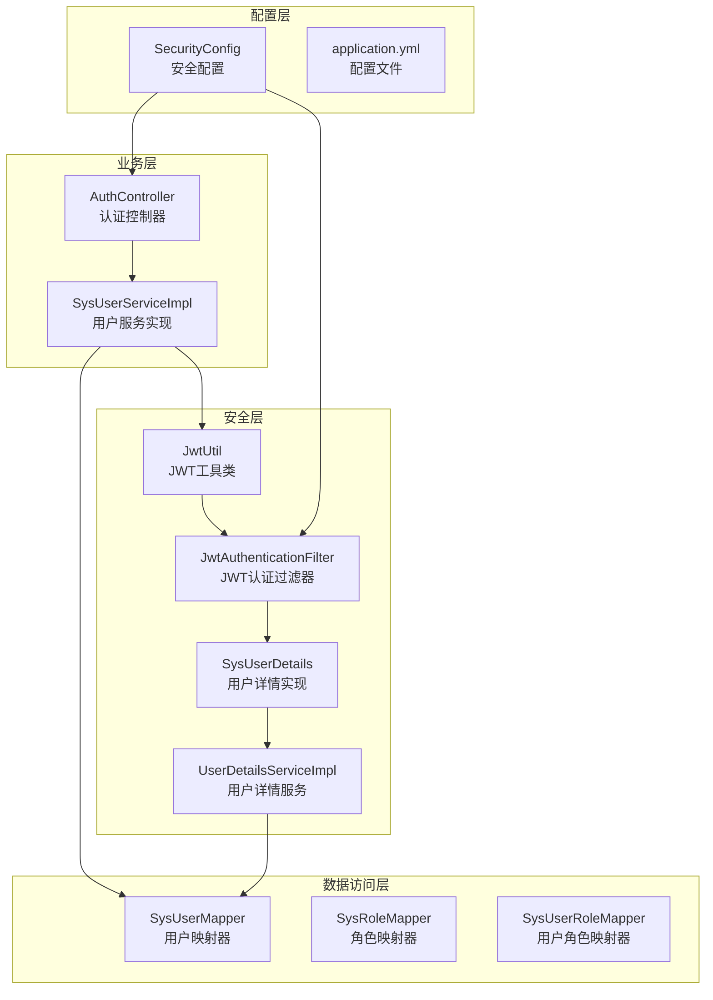
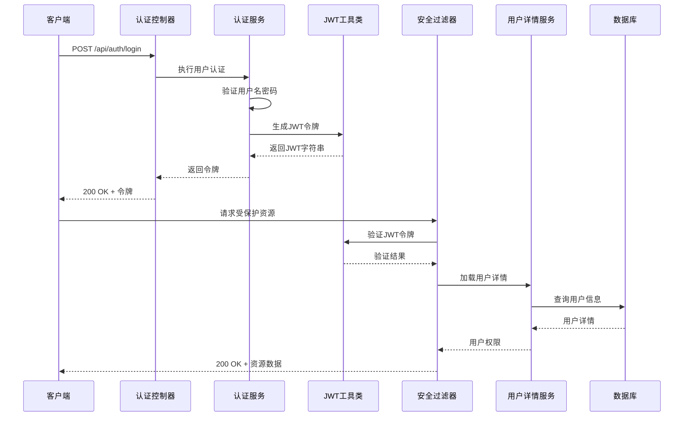
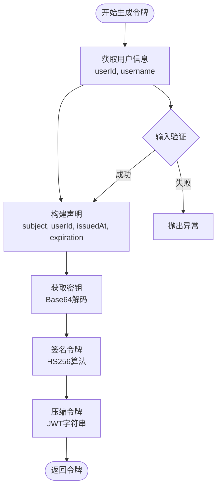
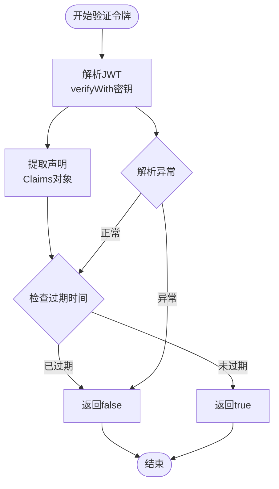
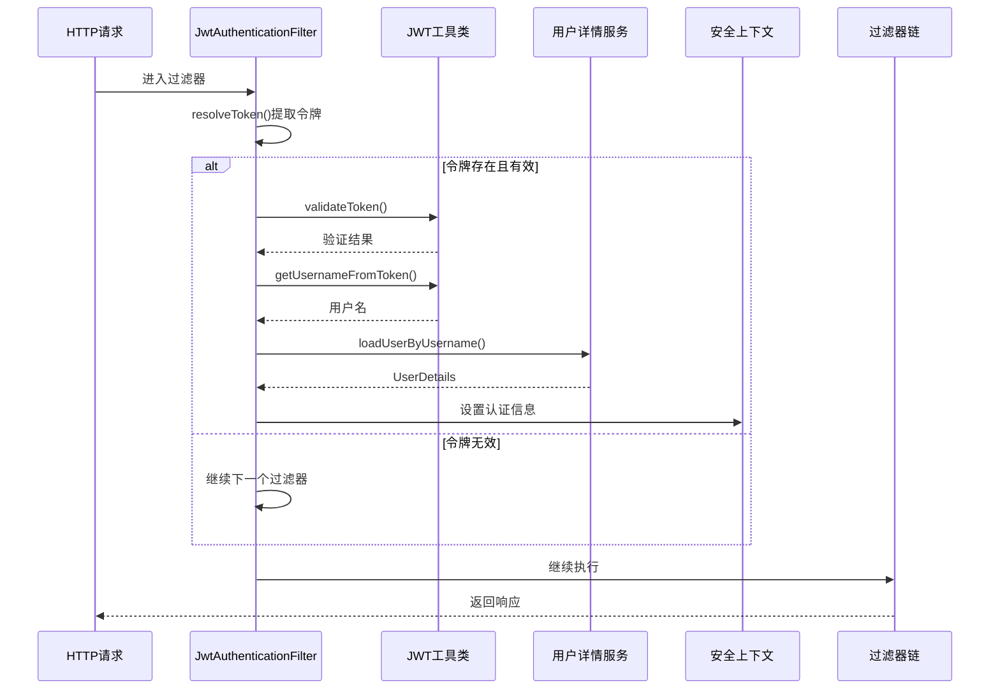
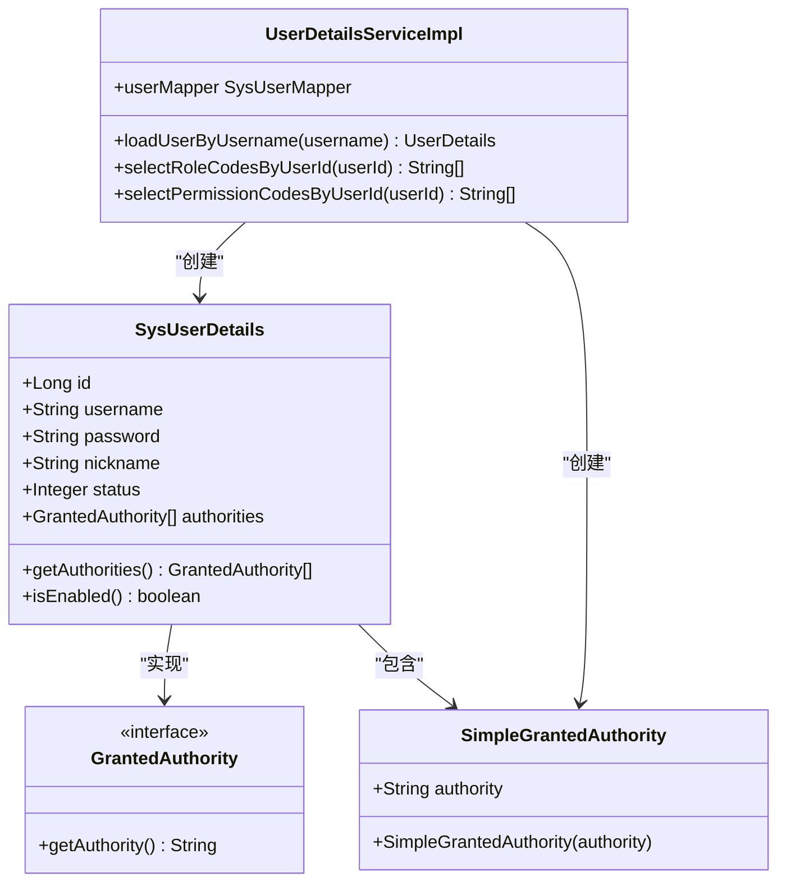
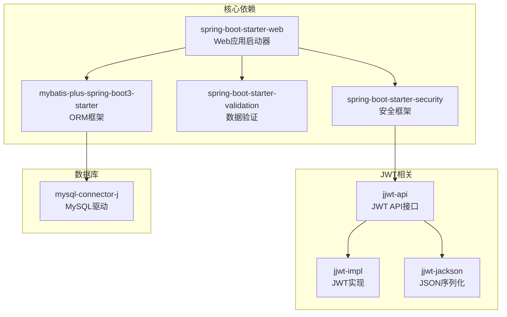

# JWT认证机制

<cite>
**本文档引用的文件**
- [JwtUtil.java](file://src/main/java/com/bookorder/security/JwtUtil.java)
- [JwtAuthenticationFilter.java](file://src/main/java/com/bookorder/security/JwtAuthenticationFilter.java)
- [SysUserDetails.java](file://src/main/java/com/bookorder/security/SysUserDetails.java)
- [UserDetailsServiceImpl.java](file://src/main/java/com/bookorder/security/UserDetailsServiceImpl.java)
- [SecurityConfig.java](file://src/main/java/com/bookorder/config/SecurityConfig.java)
- [AuthController.java](file://src/main/java/com/bookorder/controller/AuthController.java)
- [SysUserServiceImpl.java](file://src/main/java/com/bookorder/service/impl/SysUserServiceImpl.java)
- [application.yml](file://src/main/resources/application.yml)
- [pom.xml](file://pom.xml)
</cite>

## 目录
1. [简介](#简介)
2. [项目结构](#项目结构)
3. [核心组件](#核心组件)
4. [架构概览](#架构概览)
5. [详细组件分析](#详细组件分析)
6. [依赖关系分析](#依赖关系分析)
7. [性能考虑](#性能考虑)
8. [故障排除指南](#故障排除指南)
9. [结论](#结论)
10. [附录](#附录)

## 简介

本项目实现了基于JWT（JSON Web Token）的无状态认证机制，采用Spring Security框架构建完整的RBAC（基于角色的访问控制）系统。JWT认证通过在客户端和服务器之间传输加密令牌来实现用户身份验证和授权，无需在服务器端维护会话状态，具有良好的可扩展性和分布式支持能力。

该认证机制的核心特性包括：
- 基于HS256算法的对称密钥签名
- 24小时有效期的令牌管理
- 完整的RBAC权限控制
- 无状态的分布式部署支持
- 标准化的RESTful API设计

## 项目结构

项目采用标准的Spring Boot分层架构，JWT认证相关的代码主要分布在以下模块中：



**图表来源**
- [JwtUtil.java:1-62](file://src/main/java/com/bookorder/security/JwtUtil.java#L1-L62)
- [JwtAuthenticationFilter.java:1-56](file://src/main/java/com/bookorder/security/JwtAuthenticationFilter.java#L1-L56)
- [SecurityConfig.java:1-74](file://src/main/java/com/bookorder/config/SecurityConfig.java#L1-L74)

**章节来源**
- [pom.xml:1-95](file://pom.xml#L1-L95)
- [application.yml:1-33](file://src/main/resources/application.yml#L1-L33)

## 核心组件

### JWT工具类（JwtUtil）

JwtUtil是JWT认证机制的核心工具类，负责令牌的生成、解析和验证操作。该类使用Base64编码的对称密钥进行HS256算法签名。

**主要功能特性：**
- **令牌生成**：包含用户ID、用户名、签发时间、过期时间和签名信息
- **令牌解析**：从JWT中提取声明信息（Claims）
- **令牌验证**：检查令牌的有效性和过期状态
- **信息提取**：从令牌中获取用户ID和用户名

**配置参数：**
- 密钥长度：256位（通过Base64解码获得）
- 过期时间：86400000毫秒（24小时）
- 签名算法：HS256（HMAC-SHA256）

**章节来源**
- [JwtUtil.java:14-61](file://src/main/java/com/bookorder/security/JwtUtil.java#L14-L61)
- [application.yml:26-28](file://src/main/resources/application.yml#L26-L28)

### JWT认证过滤器（JwtAuthenticationFilter）

JwtAuthenticationFilter是Spring Security的过滤器，负责拦截HTTP请求并进行JWT令牌验证。

**工作流程：**
1. 从Authorization头提取Bearer令牌
2. 验证令牌格式和有效性
3. 解析用户详情并加载到Spring Security上下文
4. 将认证信息传递给后续过滤器链

**安全特性：**
- 每个请求只处理一次（OncePerRequestFilter）
- 支持自定义异常处理
- 集成Spring Security的认证机制

**章节来源**
- [JwtAuthenticationFilter.java:19-55](file://src/main/java/com/bookorder/security/JwtAuthenticationFilter.java#L19-L55)

### 用户详情实现（SysUserDetails）

SysUserDetails实现了Spring Security的UserDetails接口，封装了用户的基本信息和权限。

**核心属性：**
- 用户ID：用于令牌中存储的用户标识
- 用户名：登录凭证
- 密码：用于认证验证
- 昵称：用户显示名称
- 状态：账户启用状态
- 权限列表：角色和权限集合

**权限管理：**
- 支持角色前缀"ROLE_"
- 动态权限加载
- 账户状态验证

**章节来源**
- [SysUserDetails.java:10-53](file://src/main/java/com/bookorder/security/SysUserDetails.java#L10-L53)

### 用户详情服务（UserDetailsServiceImpl）

UserDetailsServiceImpl负责从数据库加载用户详情，包括基础信息和权限信息。

**查询逻辑：**
1. 根据用户名查询用户基本信息
2. 查询用户的角色代码列表
3. 查询用户的权限代码列表
4. 组装权限集合（角色+权限）

**权限类型：**
- 角色权限：以"ROLE_"前缀标识
- 资源权限：直接使用权限代码
- 动态权限：根据用户实际拥有的权限动态分配

**章节来源**
- [UserDetailsServiceImpl.java:18-48](file://src/main/java/com/bookorder/security/UserDetailsServiceImpl.java#L18-L48)

## 架构概览

JWT认证机制的整体架构采用分层设计，确保了高内聚低耦合的软件结构。



**图表来源**
- [AuthController.java:28-32](file://src/main/java/com/bookorder/controller/AuthController.java#L28-L32)
- [SysUserServiceImpl.java:50-55](file://src/main/java/com/bookorder/service/impl/SysUserServiceImpl.java#L50-L55)
- [JwtAuthenticationFilter.java:28-46](file://src/main/java/com/bookorder/security/JwtAuthenticationFilter.java#L28-L46)
- [UserDetailsServiceImpl.java:23-48](file://src/main/java/com/bookorder/security/UserDetailsServiceImpl.java#L23-L48)

## 详细组件分析

### JWT令牌生成流程



**图表来源**
- [JwtUtil.java:27-35](file://src/main/java/com/bookorder/security/JwtUtil.java#L27-L35)

**实现细节：**
- 使用当前时间作为签发时间（iat）
- 过期时间为当前时间加上配置的过期时长
- 将用户ID存储在自定义声明中，便于后续快速识别用户
- 采用HS256算法确保签名的安全性

**章节来源**
- [JwtUtil.java:27-35](file://src/main/java/com/bookorder/security/JwtUtil.java#L27-L35)

### JWT令牌验证流程



**图表来源**
- [JwtUtil.java:37-52](file://src/main/java/com/bookorder/security/JwtUtil.java#L37-L52)

**验证逻辑：**
- 使用相同的密钥进行签名验证
- 检查令牌是否在有效期内
- 捕获并处理各种解析异常
- 返回布尔值表示验证结果

**章节来源**
- [JwtUtil.java:45-52](file://src/main/java/com/bookorder/security/JwtUtil.java#L45-L52)

### 请求拦截与认证流程



**图表来源**
- [JwtAuthenticationFilter.java:28-46](file://src/main/java/com/bookorder/security/JwtAuthenticationFilter.java#L28-L46)
- [JwtUtil.java:54-60](file://src/main/java/com/bookorder/security/JwtUtil.java#L54-L60)
- [UserDetailsServiceImpl.java:23-48](file://src/main/java/com/bookorder/security/UserDetailsServiceImpl.java#L23-L48)

**认证步骤：**
1. 从Authorization头提取Bearer令牌
2. 验证令牌格式和有效性
3. 解析用户名并加载用户详情
4. 创建认证令牌并设置到安全上下文
5. 允许请求继续到目标控制器

**章节来源**
- [JwtAuthenticationFilter.java:28-46](file://src/main/java/com/bookorder/security/JwtAuthenticationFilter.java#L28-L46)

### 权限管理系统

系统实现了完整的RBAC权限控制模型，支持角色和资源级别的权限管理。



**图表来源**
- [SysUserDetails.java:10-53](file://src/main/java/com/bookorder/security/SysUserDetails.java#L10-L53)
- [UserDetailsServiceImpl.java:18-48](file://src/main/java/com/bookorder/security/UserDetailsServiceImpl.java#L18-L48)

**权限类型：**
- **角色权限**：以"ROLE_"前缀标识，如"ROLE_ADMIN"
- **资源权限**：直接使用权限代码，如"USER_READ"
- **动态权限**：根据用户实际拥有的权限动态分配

**章节来源**
- [SysUserDetails.java:32-34](file://src/main/java/com/bookorder/security/SysUserDetails.java#L32-L34)
- [UserDetailsServiceImpl.java:39-46](file://src/main/java/com/bookorder/security/UserDetailsServiceImpl.java#L39-L46)

## 依赖关系分析

项目使用Maven管理依赖，JWT认证相关的依赖配置如下：



**图表来源**
- [pom.xml:26-76](file://pom.xml#L26-L76)

**版本兼容性：**
- Spring Boot 3.2.5
- MyBatis-Plus 3.5.6
- jjwt 0.12.5
- Java 17

**章节来源**
- [pom.xml:20-24](file://pom.xml#L20-L24)

## 性能考虑

### 令牌大小优化

JWT令牌包含以下信息：
- 头部（Header）：固定长度，约100字节
- 载荷（Payload）：包含用户ID、用户名等信息，约150字节
- 签名（Signature）：HS256算法产生32字节

**总大小**：约350字节，对网络传输影响极小

### 缓存策略

建议在高并发场景下实施以下缓存策略：
- **用户权限缓存**：缓存用户权限信息，减少数据库查询
- **令牌黑名单缓存**：对于需要撤销的令牌，维护短期缓存
- **会话状态缓存**：利用Redis等外部缓存存储会话状态

### 并发处理

- 每个请求只处理一次，避免重复认证
- 使用线程安全的JWT工具类
- 异步处理权限验证逻辑

## 故障排除指南

### 常见问题及解决方案

**1. 令牌过期问题**
- **症状**：401未授权错误
- **原因**：令牌超过24小时有效期
- **解决方案**：重新登录获取新令牌

**2. 密钥不匹配问题**
- **症状**：令牌验证失败
- **原因**：服务器重启后密钥发生变化
- **解决方案**：确保所有实例使用相同密钥

**3. 权限不足问题**
- **症状**：403权限不足
- **原因**：用户缺少必要权限
- **解决方案**：检查用户角色和权限配置

**4. 数据库连接问题**
- **症状**：用户详情加载失败
- **原因**：数据库连接异常
- **解决方案**：检查数据库配置和连接池

**章节来源**
- [SecurityConfig.java:44-57](file://src/main/java/com/bookorder/config/SecurityConfig.java#L44-L57)

### 调试建议

1. **启用调试日志**：在application.yml中设置日志级别为debug
2. **监控令牌生命周期**：记录令牌生成和验证的时间戳
3. **跟踪用户权限**：记录用户权限加载过程
4. **监控数据库性能**：观察用户详情查询的响应时间

## 结论

本JWT认证机制实现了完整的无状态认证解决方案，具有以下优势：

**技术优势：**
- 基于标准JWT规范，具有良好的互操作性
- 采用HS256算法，安全性高且性能优异
- 完整的RBAC权限控制，支持细粒度权限管理
- 无状态设计，支持水平扩展和微服务架构

**安全特性：**
- 24小时有效期，降低长期风险
- 对称密钥签名，防止令牌篡改
- 完整的异常处理机制
- 标准化的Spring Security集成

**最佳实践建议：**
- 在生产环境中使用更长的有效期和更强的密钥
- 实施令牌刷新策略以提高用户体验
- 添加令牌撤销机制以应对安全威胁
- 考虑使用HTTPS传输以保护令牌安全

该实现为构建现代Web应用提供了坚实的基础，既满足了功能需求，又兼顾了安全性和可维护性。

## 附录

### 配置参数说明

| 参数名称 | 默认值 | 单位 | 说明 |
|---------|--------|------|------|
| jwt.secret | Y29tLmJvb2tvcmRlci5ib29rLW9yZGVyLXN5c3RlbS1qd3Qtc2VjcmV0LWtl | Base64编码 | JWT签名密钥 |
| jwt.expiration | 86400000 | 毫秒 | 令牌有效期（24小时） |

### API使用示例

**登录获取令牌：**
```
POST /api/auth/login
Content-Type: application/json

{
    "username": "admin",
    "password": "password"
}
```

**访问受保护资源：**
```
GET /api/users
Authorization: Bearer YOUR_JWT_TOKEN_HERE
```

### 安全最佳实践

1. **密钥管理**：使用强随机密钥，定期轮换
2. **传输安全**：始终使用HTTPS协议
3. **令牌存储**：客户端应安全存储令牌
4. **权限最小化**：遵循最小权限原则分配权限
5. **监控审计**：实施完整的访问日志记录