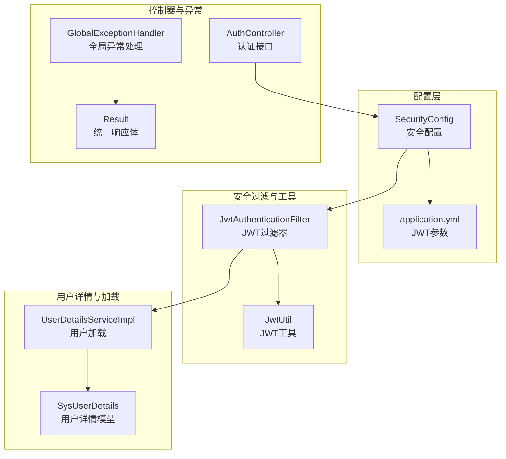
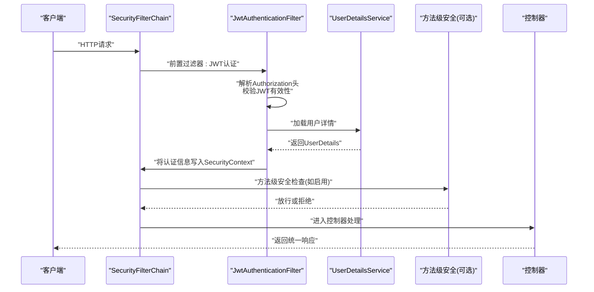
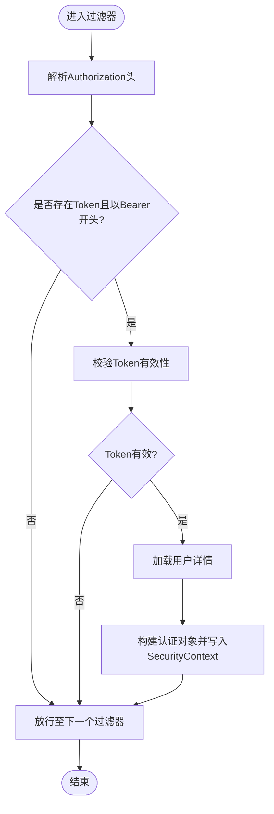
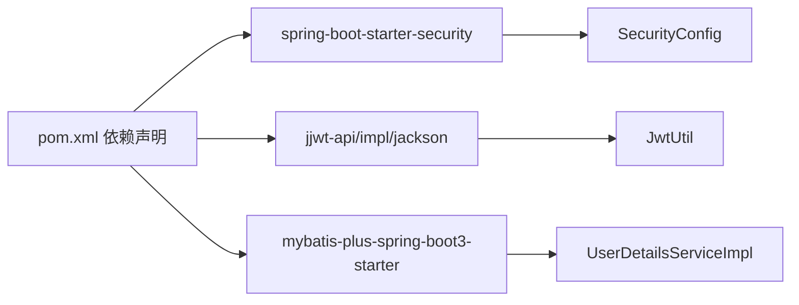

# Spring Security配置

<cite>
**本文引用的文件**
- [SecurityConfig.java](file://src/main/java/com/bookorder/config/SecurityConfig.java)
- [JwtAuthenticationFilter.java](file://src/main/java/com/bookorder/security/JwtAuthenticationFilter.java)
- [JwtUtil.java](file://src/main/java/com/bookorder/security/JwtUtil.java)
- [UserDetailsServiceImpl.java](file://src/main/java/com/bookorder/security/UserDetailsServiceImpl.java)
- [SysUserDetails.java](file://src/main/java/com/bookorder/security/SysUserDetails.java)
- [AuthController.java](file://src/main/java/com/bookorder/controller/AuthController.java)
- [GlobalExceptionHandler.java](file://src/main/java/com/bookorder/common/GlobalExceptionHandler.java)
- [Result.java](file://src/main/java/com/bookorder/common/Result.java)
- [application.yml](file://src/main/resources/application.yml)
- [pom.xml](file://pom.xml)
</cite>

## 目录
1. [简介](#简介)
2. [项目结构](#项目结构)
3. [核心组件](#核心组件)
4. [架构总览](#架构总览)
5. [详细组件分析](#详细组件分析)
6. [依赖分析](#依赖分析)
7. [性能考虑](#性能考虑)
8. [故障排查指南](#故障排查指南)
9. [结论](#结论)
10. [附录](#附录)

## 简介
本文件面向Spring Security在RBAC权限控制场景下的配置与使用，围绕以下目标展开：深入解析SecurityConfig类的HTTP安全配置、会话管理策略与CSRF防护；详解安全过滤器链的构建与JWT认证过滤器的插入位置及执行顺序；说明认证入口点与访问拒绝处理器的实现与统一错误响应格式；阐述密码编码器与认证管理器的配置；最后给出最佳实践与常见问题的解决方案。该系统采用基于JWT的无状态认证，通过自定义UserDetailsService加载用户角色与权限，并在全局异常处理中统一返回Result格式的错误信息。

## 项目结构
该项目采用分层与按功能模块组织的结构，与安全相关的关键文件分布如下：
- 配置层：SecurityConfig（安全配置）、application.yml（JWT参数）
- 安全过滤与工具：JwtAuthenticationFilter（JWT过滤器）、JwtUtil（JWT工具）
- 用户详情与加载：UserDetailsServiceImpl（用户加载）、SysUserDetails（用户详情模型）
- 控制器：AuthController（认证接口）
- 全局异常：GlobalExceptionHandler（统一异常处理）
- 响应封装：Result（统一响应体）

图表来源
- [SecurityConfig.java:34-62](file://src/main/java/com/bookorder/config/SecurityConfig.java#L34-L62)
- [JwtAuthenticationFilter.java:19-56](file://src/main/java/com/bookorder/security/JwtAuthenticationFilter.java#L19-L56)
- [JwtUtil.java:13-62](file://src/main/java/com/bookorder/security/JwtUtil.java#L13-L62)
- [UserDetailsServiceImpl.java:17-50](file://src/main/java/com/bookorder/security/UserDetailsServiceImpl.java#L17-L50)
- [SysUserDetails.java:10-54](file://src/main/java/com/bookorder/security/SysUserDetails.java#L10-L54)
- [AuthController.java:18-59](file://src/main/java/com/bookorder/controller/AuthController.java#L18-L59)
- [GlobalExceptionHandler.java:17-62](file://src/main/java/com/bookorder/common/GlobalExceptionHandler.java#L17-L62)
- [Result.java:3-41](file://src/main/java/com/bookorder/common/Result.java#L3-L41)

章节来源
- [SecurityConfig.java:23-74](file://src/main/java/com/bookorder/config/SecurityConfig.java#L23-L74)
- [application.yml:26-28](file://src/main/resources/application.yml#L26-L28)

## 核心组件
- 安全配置类SecurityConfig：负责HTTP安全策略、会话管理、CSRF关闭、请求授权规则、异常处理、以及将JWT过滤器插入到UsernamePasswordAuthenticationFilter之前。
- JWT认证过滤器JwtAuthenticationFilter：从请求头提取Bearer Token，校验有效性，解析用户信息并写入SecurityContext。
- JWT工具JwtUtil：生成与验证JWT、解析载荷、获取用户标识与用户名。
- 用户详情服务UserDetailsServiceImpl：根据用户名查询用户，组装角色与权限集合，返回SysUserDetails。
- 用户详情模型SysUserDetails：实现UserDetails接口，封装用户基本信息与权限。
- 认证控制器AuthController：提供登录、注册、获取当前用户信息等端点。
- 全局异常处理GlobalExceptionHandler：对认证失败、权限不足等进行统一响应。
- 统一响应Result：封装通用的响应结构。

章节来源
- [SecurityConfig.java:34-72](file://src/main/java/com/bookorder/config/SecurityConfig.java#L34-L72)
- [JwtAuthenticationFilter.java:28-46](file://src/main/java/com/bookorder/security/JwtAuthenticationFilter.java#L28-L46)
- [JwtUtil.java:22-60](file://src/main/java/com/bookorder/security/JwtUtil.java#L22-L60)
- [UserDetailsServiceImpl.java:23-48](file://src/main/java/com/bookorder/security/UserDetailsServiceImpl.java#L23-L48)
- [SysUserDetails.java:31-52](file://src/main/java/com/bookorder/security/SysUserDetails.java#L31-L52)
- [AuthController.java:28-57](file://src/main/java/com/bookorder/controller/AuthController.java#L28-L57)
- [GlobalExceptionHandler.java:28-38](file://src/main/java/com/bookorder/common/GlobalExceptionHandler.java#L28-L38)
- [Result.java:18-35](file://src/main/java/com/bookorder/common/Result.java#L18-L35)

## 架构总览
下图展示了从客户端请求到安全过滤器链再到控制器的完整流程，重点标注了JWT过滤器的插入位置与执行顺序。

图表来源
- [SecurityConfig.java:59](file://src/main/java/com/bookorder/config/SecurityConfig.java#L59)
- [JwtAuthenticationFilter.java:28-46](file://src/main/java/com/bookorder/security/JwtAuthenticationFilter.java#L28-L46)
- [UserDetailsServiceImpl.java:23-48](file://src/main/java/com/bookorder/security/UserDetailsServiceImpl.java#L23-L48)
- [AuthController.java:28-57](file://src/main/java/com/bookorder/controller/AuthController.java#L28-L57)

## 详细组件分析

### 安全配置类SecurityConfig
- HTTP安全配置
  - CSRF关闭：显式禁用CSRF，适用于无状态API。
  - 会话管理：设置为STATELESS，避免服务器端会话存储。
  - 请求授权：对登录与注册接口放行，其余请求均需认证。
- 异常处理
  - 认证入口点：当未认证访问受保护资源时，返回JSON格式的401错误。
  - 访问拒绝处理器：当认证用户权限不足时，返回JSON格式的403错误。
- 过滤器链
  - 将JWT认证过滤器插入到UsernamePasswordAuthenticationFilter之前，确保在用户名密码过滤器前完成JWT解析与认证写入。

章节来源
- [SecurityConfig.java:34-62](file://src/main/java/com/bookorder/config/SecurityConfig.java#L34-L62)

### JWT认证过滤器JwtAuthenticationFilter
- 功能职责
  - 从Authorization头解析Bearer Token。
  - 调用JwtUtil校验Token有效性并解析用户名。
  - 通过UserDetailsService加载用户详情，构造UsernamePasswordAuthenticationToken并写入SecurityContext。
  - 放行至后续过滤器链。
- 关键点
  - 使用OncePerRequestFilter保证每个请求只处理一次。
  - 仅当存在有效Token且能解析出用户名时才进行认证写入。

图表来源
- [JwtAuthenticationFilter.java:28-46](file://src/main/java/com/bookorder/security/JwtAuthenticationFilter.java#L28-L46)
- [JwtUtil.java:45-52](file://src/main/java/com/bookorder/security/JwtUtil.java#L45-L52)
- [UserDetailsServiceImpl.java:23-48](file://src/main/java/com/bookorder/security/UserDetailsServiceImpl.java#L23-L48)

章节来源
- [JwtAuthenticationFilter.java:19-56](file://src/main/java/com/bookorder/security/JwtAuthenticationFilter.java#L19-L56)

### JWT工具JwtUtil
- 密钥与过期时间
  - 从配置文件读取JWT密钥与过期时间。
  - 使用Base64解码密钥并生成HMAC密钥。
- Token操作
  - 生成：包含用户名、用户ID、签发时间与过期时间。
  - 解析：解析签名并获取载荷。
  - 校验：判断是否过期。
  - 提取：从载荷中获取用户ID与用户名。

章节来源
- [JwtUtil.java:16-60](file://src/main/java/com/bookorder/security/JwtUtil.java#L16-L60)
- [application.yml:26-28](file://src/main/resources/application.yml#L26-L28)

### 用户详情服务UserDetailsServiceImpl
- 加载逻辑
  - 按用户名查询用户，若不存在或被禁用则抛出异常。
  - 查询用户的角色编码与权限编码，组装为GrantedAuthority列表。
  - 返回SysUserDetails实例供认证流程使用。

章节来源
- [UserDetailsServiceImpl.java:23-48](file://src/main/java/com/bookorder/security/UserDetailsServiceImpl.java#L23-L48)

### 用户详情模型SysUserDetails
- 实现细节
  - 实现UserDetails接口，提供用户名、密码、权限集合等。
  - isEnabled根据用户状态返回，用于账户启用控制。

章节来源
- [SysUserDetails.java:31-52](file://src/main/java/com/bookorder/security/SysUserDetails.java#L31-L52)

### 认证控制器AuthController
- 登录：接收用户名与密码，调用服务生成JWT并返回。
- 注册：接收注册信息，调用服务完成注册。
- 获取当前用户：读取SecurityContext中的用户详情，组合角色与权限返回。

章节来源
- [AuthController.java:28-57](file://src/main/java/com/bookorder/controller/AuthController.java#L28-L57)

### 全局异常处理GlobalExceptionHandler
- 对认证失败与权限不足分别返回401与403，并统一使用Result格式。
- 与SecurityConfig中的认证入口点与访问拒绝处理器配合，形成一致的错误输出风格。

章节来源
- [GlobalExceptionHandler.java:28-38](file://src/main/java/com/bookorder/common/GlobalExceptionHandler.java#L28-L38)
- [SecurityConfig.java:43-58](file://src/main/java/com/bookorder/config/SecurityConfig.java#L43-L58)

### 统一响应Result
- 提供success与error静态方法，封装统一的响应结构。
- 与全局异常处理配合，确保前后端交互的一致性。

章节来源
- [Result.java:18-35](file://src/main/java/com/bookorder/common/Result.java#L18-L35)

## 依赖分析
- Spring Security Starter：提供WebSecurity、方法级安全、认证管理器等能力。
- JWT依赖：jjwt-api、jjwt-impl、jjwt-jackson，用于生成与解析JWT。
- MyBatis-Plus：用于用户与权限数据的查询。
- 全局异常处理：与Spring Security异常类型协同工作，统一错误响应。

图表来源
- [pom.xml:33-76](file://pom.xml#L33-L76)
- [SecurityConfig.java:34-62](file://src/main/java/com/bookorder/config/SecurityConfig.java#L34-L62)
- [JwtUtil.java:13-62](file://src/main/java/com/bookorder/security/JwtUtil.java#L13-L62)
- [UserDetailsServiceImpl.java:17-50](file://src/main/java/com/bookorder/security/UserDetailsServiceImpl.java#L17-L50)

章节来源
- [pom.xml:26-76](file://pom.xml#L26-L76)

## 性能考虑
- 无状态设计：通过STATELESS会话策略减少服务器端会话开销。
- 过滤器链轻量：JWT过滤器仅在存在Authorization头时进行Token解析，避免不必要的数据库查询。
- 缓存建议：对于频繁访问的用户信息，可在应用层缓存角色与权限集合，降低数据库压力。
- Token有效期：合理设置过期时间，平衡安全性与用户体验。

## 故障排查指南
- 401未登录或token已过期
  - 检查请求头Authorization是否正确携带Bearer Token。
  - 校验JWT密钥与过期时间配置是否正确。
  - 确认JwtUtil的validateToken逻辑与服务端时间同步。
- 403权限不足
  - 检查用户角色与权限是否正确映射到GrantedAuthority。
  - 确认方法级安全注解与URL授权规则是否冲突。
- 用户名或密码错误
  - 全局异常处理会返回401与统一错误信息，确认认证流程是否正常。
- Token解析失败
  - 检查Authorization头格式是否为“Bearer ”前缀加空格再加token。
  - 确认UserDetailsService返回的UserDetails是否包含正确的权限集合。

章节来源
- [SecurityConfig.java:43-58](file://src/main/java/com/bookorder/config/SecurityConfig.java#L43-L58)
- [JwtAuthenticationFilter.java:48-54](file://src/main/java/com/bookorder/security/JwtAuthenticationFilter.java#L48-L54)
- [JwtUtil.java:45-52](file://src/main/java/com/bookorder/security/JwtUtil.java#L45-L52)
- [UserDetailsServiceImpl.java:23-48](file://src/main/java/com/bookorder/security/UserDetailsServiceImpl.java#L23-L48)
- [GlobalExceptionHandler.java:28-38](file://src/main/java/com/bookorder/common/GlobalExceptionHandler.java#L28-L38)

## 结论
本配置采用无状态JWT认证，结合自定义UserDetailsService与统一响应机制，实现了清晰、可维护的安全体系。通过在过滤器链中前置JWT认证过滤器，确保所有受保护请求在进入控制器前完成身份与权限校验。建议在生产环境中进一步完善日志审计、限流策略与密钥轮换机制，持续提升系统的安全性与稳定性。

## 附录
- 最佳实践
  - 使用HTTPS传输，防止Token泄露。
  - 合理设置JWT过期时间，支持刷新令牌策略。
  - 在UserDetailsService中缓存用户角色与权限，减少数据库查询。
  - 对敏感接口启用方法级安全注解，细化权限控制。
  - 定期轮换JWT密钥，确保密钥安全。
- 常见问题
  - Authorization头格式不正确导致认证失败。
  - 数据库中用户状态异常导致认证失败。
  - 方法级安全注解与URL授权规则冲突导致权限不足。
  - JWT密钥或过期时间配置错误导致Token无法解析。