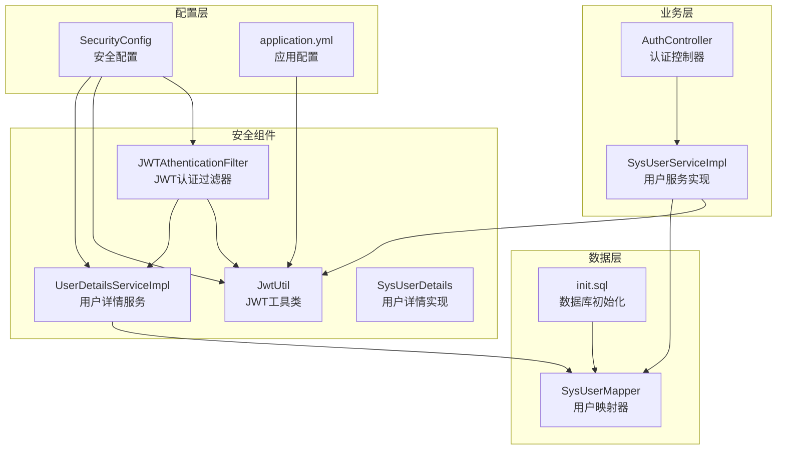
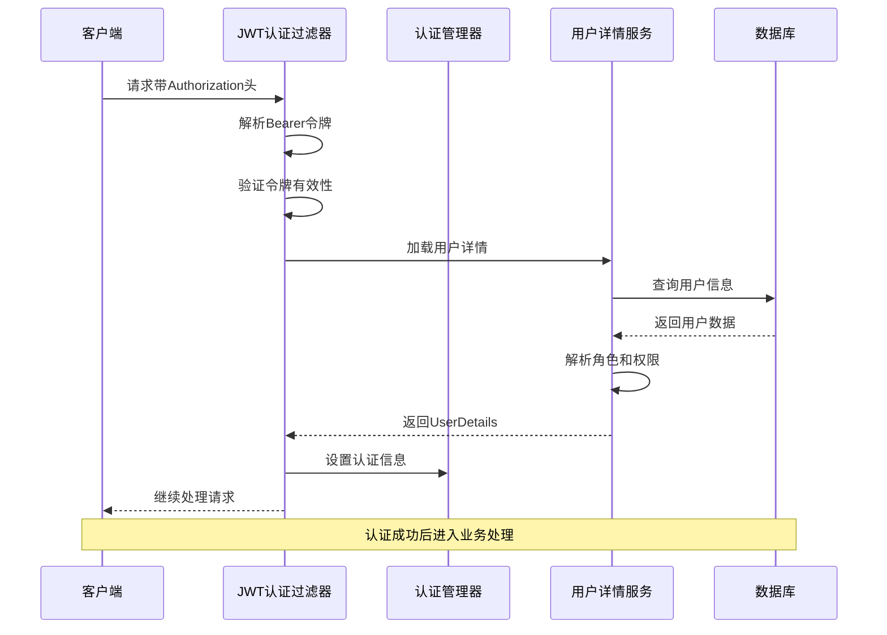
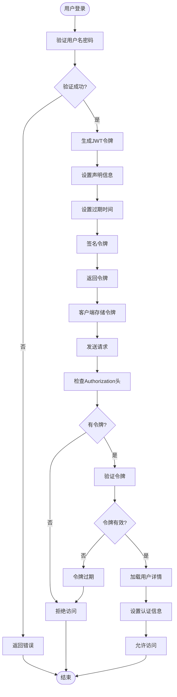
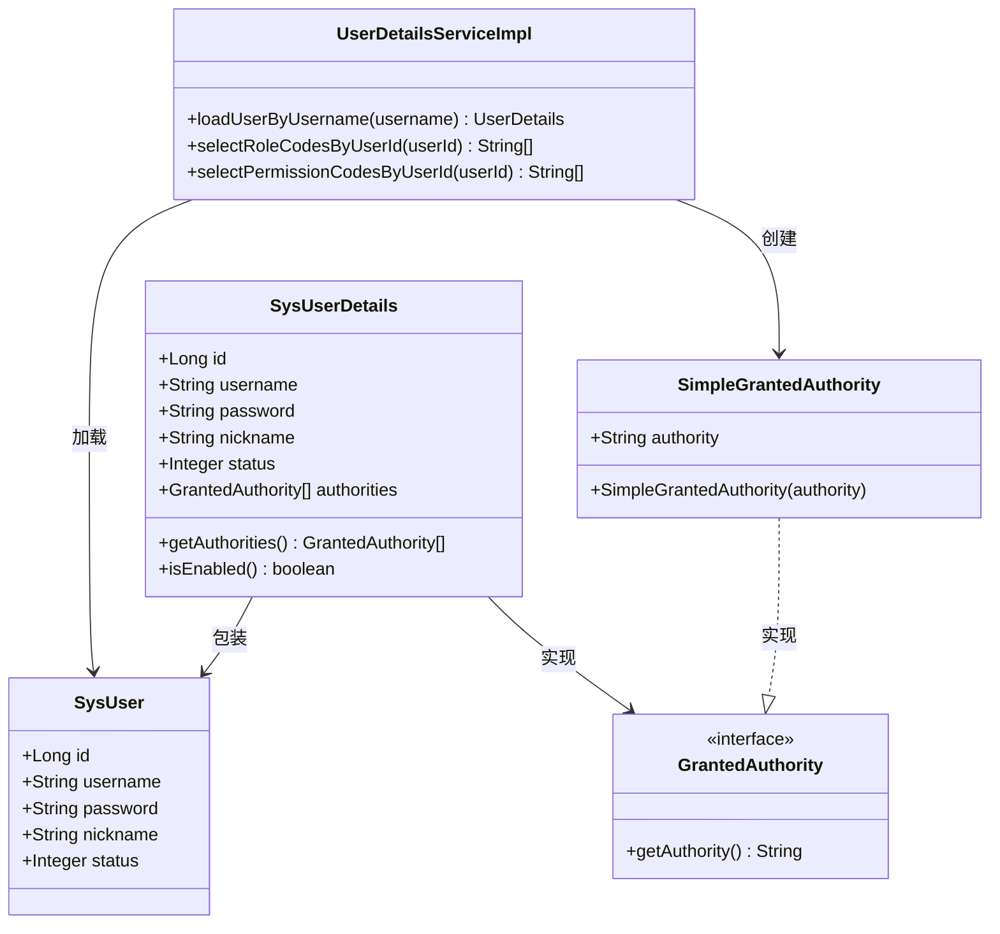
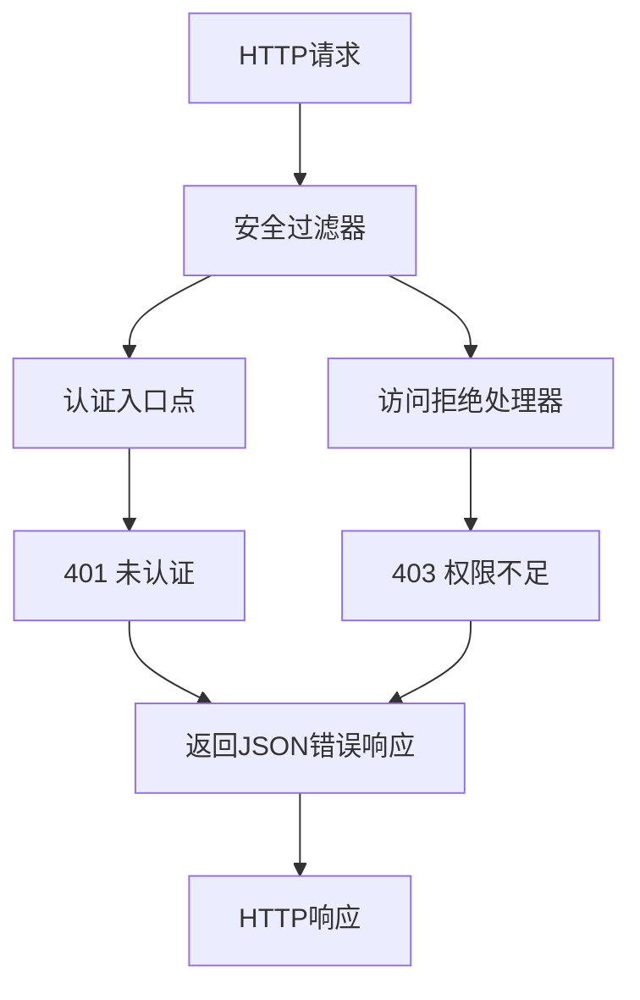
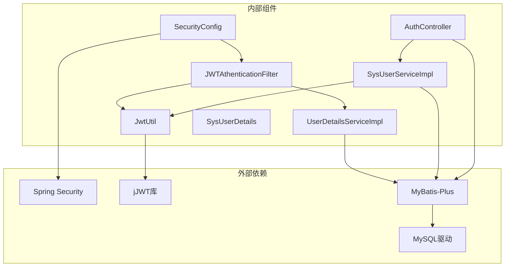

# 安全配置模块

<cite>
**本文档引用的文件**
- [SecurityConfig.java](file://src/main/java/com/bookorder/config/SecurityConfig.java)
- [JwtUtil.java](file://src/main/java/com/bookorder/security/JwtUtil.java)
- [JwtAuthenticationFilter.java](file://src/main/java/com/bookorder/security/JwtAuthenticationFilter.java)
- [UserDetailsServiceImpl.java](file://src/main/java/com/bookorder/security/UserDetailsServiceImpl.java)
- [SysUserDetails.java](file://src/main/java/com/bookorder/security/SysUserDetails.java)
- [AuthController.java](file://src/main/java/com/bookorder/controller/AuthController.java)
- [SysUserServiceImpl.java](file://src/main/java/com/bookorder/service/impl/SysUserServiceImpl.java)
- [application.yml](file://src/main/resources/application.yml)
- [pom.xml](file://pom.xml)
- [init.sql](file://sql/init.sql)
</cite>

## 目录
1. [简介](#简介)
2. [项目结构](#项目结构)
3. [核心组件](#核心组件)
4. [架构概览](#架构概览)
5. [详细组件分析](#详细组件分析)
6. [依赖关系分析](#依赖关系分析)
7. [性能考虑](#性能考虑)
8. [故障排除指南](#故障排除指南)
9. [结论](#结论)

## 简介

本项目采用基于JWT（JSON Web Token）的无状态认证方案，实现了完整的RBAC（基于角色的访问控制）安全体系。系统通过Spring Security配置过滤器链，结合自定义的JWT工具类和用户详情服务，提供了安全的用户认证和授权机制。

该安全配置模块的核心特点包括：
- 基于JWT的无状态认证
- 自定义用户详情加载机制
- RBAC权限控制
- 完整的异常处理机制
- 灵活的配置扩展性

## 项目结构

安全配置模块在项目中的组织结构如下：

**图表来源**
- [SecurityConfig.java:23-74](file://src/main/java/com/bookorder/config/SecurityConfig.java#L23-L74)
- [JwtAuthenticationFilter.java:19-56](file://src/main/java/com/bookorder/security/JwtAuthenticationFilter.java#L19-L56)
- [application.yml:26-28](file://src/main/resources/application.yml#L26-L28)

**章节来源**
- [SecurityConfig.java:1-74](file://src/main/java/com/bookorder/config/SecurityConfig.java#L1-L74)
- [application.yml:1-33](file://src/main/resources/application.yml#L1-L33)

## 核心组件

### 安全配置类 SecurityConfig

SecurityConfig是整个安全系统的核心配置类，负责定义安全过滤器链和认证策略。

**主要功能：**
- 禁用CSRF保护（无状态JWT）
- 设置会话管理为STATELESS
- 配置URL访问规则
- 注册JWT认证过滤器
- 配置异常处理器

**关键配置：**
- 公开访问路径：`/api/auth/login` 和 `/api/auth/register`
- 所有其他请求都需要认证
- 使用BCrypt密码编码器

**章节来源**
- [SecurityConfig.java:34-62](file://src/main/java/com/bookorder/config/SecurityConfig.java#L34-L62)

### JWT工具类 JwtUtil

JwtUtil提供了JWT令牌的完整生命周期管理功能。

**核心功能：**
- 令牌生成：包含用户ID和用户名
- 令牌解析：提取声明信息
- 令牌验证：检查过期时间和有效性
- 用户信息提取：从令牌中获取用户标识

**配置参数：**
- 密钥：通过`jwt.secret`配置
- 过期时间：通过`jwt.expiration`配置（毫秒）

**章节来源**
- [JwtUtil.java:13-62](file://src/main/java/com/bookorder/security/JwtUtil.java#L13-L62)
- [application.yml:26-28](file://src/main/resources/application.yml#L26-L28)

### JWT认证过滤器 JwtAuthenticationFilter

JwtAuthenticationFilter是自定义的过滤器，负责在每个请求到达时进行JWT认证。

**工作流程：**
1. 从Authorization头提取Bearer令牌
2. 验证令牌的有效性
3. 通过UserDetailsService加载用户详情
4. 在SecurityContext中设置认证信息

**章节来源**
- [JwtAuthenticationFilter.java:19-56](file://src/main/java/com/bookorder/security/JwtAuthenticationFilter.java#L19-L56)

### 用户详情服务 UserDetailsServiceImpl

UserDetailsServiceImpl实现了Spring Security的UserDetailsService接口，负责用户信息的加载和权限解析。

**核心逻辑：**
- 根据用户名查询用户信息
- 验证用户状态（必须为启用状态）
- 查询用户的角色代码
- 查询用户的权限代码
- 构建包含角色和权限的UserDetails对象

**权限模型：**
- 角色前缀：`ROLE_`
- 权限直接使用代码
- 支持多角色和多权限

**章节来源**
- [UserDetailsServiceImpl.java:17-50](file://src/main/java/com/bookorder/security/UserDetailsServiceImpl.java#L17-L50)

### 用户详情实现类 SysUserDetails

SysUserDetails是UserDetails的具体实现，封装了用户的基本信息和权限。

**属性字段：**
- 用户ID、用户名、密码、昵称
- 用户状态（用于启用/禁用判断）
- 授权列表（角色和权限）

**章节来源**
- [SysUserDetails.java:10-54](file://src/main/java/com/bookorder/security/SysUserDetails.java#L10-L54)

## 架构概览

系统采用分层架构设计，安全模块位于业务层之上，提供统一的认证和授权服务。

**图表来源**
- [JwtAuthenticationFilter.java:28-46](file://src/main/java/com/bookorder/security/JwtAuthenticationFilter.java#L28-L46)
- [UserDetailsServiceImpl.java:23-48](file://src/main/java/com/bookorder/security/UserDetailsServiceImpl.java#L23-L48)

## 详细组件分析

### JWT认证机制设计

JWT认证机制采用无状态设计，所有认证信息都包含在令牌中。

**图表来源**
- [JwtUtil.java:27-52](file://src/main/java/com/bookorder/security/JwtUtil.java#L27-L52)
- [JwtAuthenticationFilter.java:32-43](file://src/main/java/com/bookorder/security/JwtAuthenticationFilter.java#L32-L43)

### 权限控制系统

系统实现了完整的RBAC权限控制，支持角色和权限的层级关系。

**图表来源**
- [SysUserDetails.java:10-54](file://src/main/java/com/bookorder/security/SysUserDetails.java#L10-L54)
- [UserDetailsServiceImpl.java:17-50](file://src/main/java/com/bookorder/security/UserDetailsServiceImpl.java#L17-L50)

**章节来源**
- [UserDetailsServiceImpl.java:36-47](file://src/main/java/com/bookorder/security/UserDetailsServiceImpl.java#L36-L47)
- [SysUserDetails.java:31-52](file://src/main/java/com/bookorder/security/SysUserDetails.java#L31-L52)

### 异常处理机制

系统提供了完善的异常处理机制，确保安全相关的错误能够被正确处理。

**图表来源**
- [SecurityConfig.java:43-58](file://src/main/java/com/bookorder/config/SecurityConfig.java#L43-L58)

**章节来源**
- [SecurityConfig.java:43-58](file://src/main/java/com/bookorder/config/SecurityConfig.java#L43-L58)

## 依赖关系分析

系统依赖关系清晰，各组件职责明确，耦合度适中。

**图表来源**
- [pom.xml:26-77](file://pom.xml#L26-L77)
- [SecurityConfig.java:3-21](file://src/main/java/com/bookorder/config/SecurityConfig.java#L3-L21)

**章节来源**
- [pom.xml:1-95](file://pom.xml#L1-L95)

## 性能考虑

### JWT令牌优化

- **令牌大小控制**：仅包含必要的用户标识信息，避免携带过多数据
- **过期时间合理设置**：根据业务需求平衡安全性与性能
- **内存缓存策略**：可以考虑实现令牌黑名单缓存以提高验证性能

### 数据库查询优化

- **索引优化**：确保username字段有唯一索引
- **权限查询优化**：使用JOIN查询减少数据库往返次数
- **连接池配置**：合理配置数据库连接池参数

### 过滤器性能

- **短路原则**：在令牌无效时尽快返回，避免不必要的后续处理
- **线程安全**：确保JWT工具类和用户详情服务的线程安全性

## 故障排除指南

### 常见问题及解决方案

**1. 登录后无法访问受保护资源**
- 检查Authorization头格式是否正确（Bearer token）
- 验证令牌是否过期
- 确认用户状态是否为启用状态

**2. 权限验证失败**
- 检查用户角色和权限是否正确分配
- 验证权限代码格式是否符合预期
- 确认RBAC配置是否正确

**3. 令牌验证异常**
- 检查JWT密钥配置是否正确
- 验证令牌签名是否匹配
- 确认时间偏移问题

**4. 数据库连接问题**
- 检查数据库连接配置
- 验证初始化脚本执行情况
- 确认表结构是否正确

**章节来源**
- [JwtAuthenticationFilter.java:32-43](file://src/main/java/com/bookorder/security/JwtAuthenticationFilter.java#L32-L43)
- [UserDetailsServiceImpl.java:28-34](file://src/main/java/com/bookorder/security/UserDetailsServiceImpl.java#L28-L34)

## 结论

本安全配置模块实现了完整的JWT认证和RBAC权限控制体系，具有以下优势：

**技术优势：**
- 无状态设计，易于水平扩展
- 完善的异常处理机制
- 灵活的权限控制模型
- 清晰的组件职责分离

**最佳实践建议：**
- 生产环境建议启用HTTPS
- 定期轮换JWT密钥
- 实施令牌刷新机制
- 添加审计日志记录
- 考虑实现令牌黑名单机制

该模块为后续的功能扩展提供了良好的基础，可以根据业务需求进一步增强安全性和功能性。