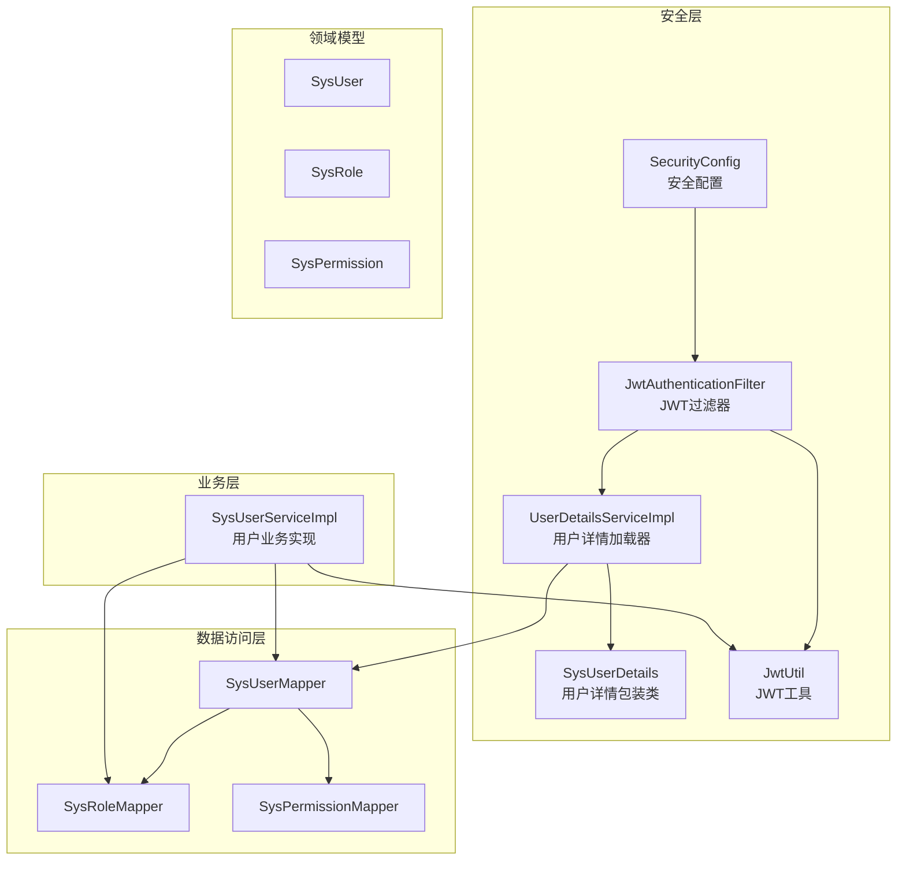
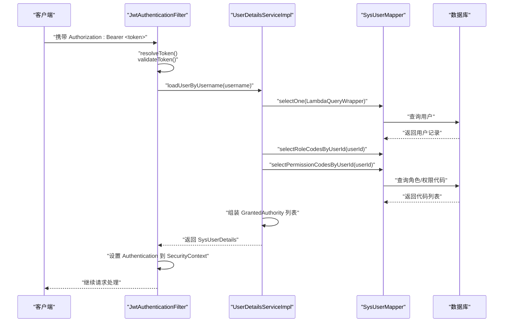
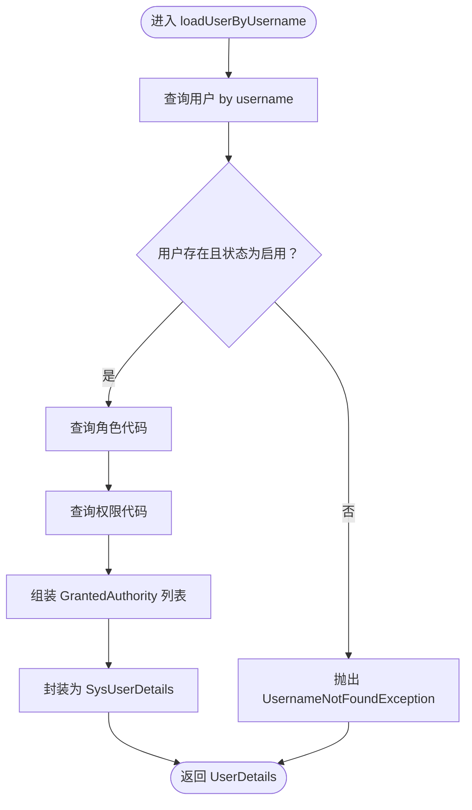
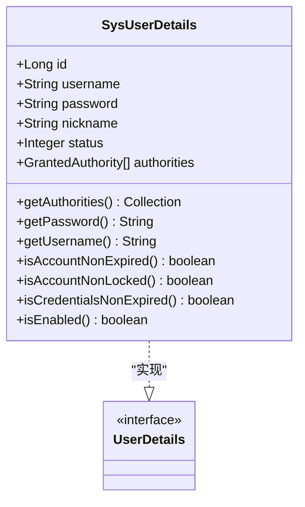
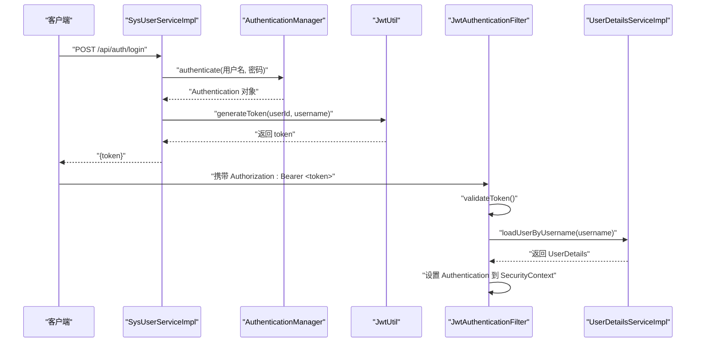
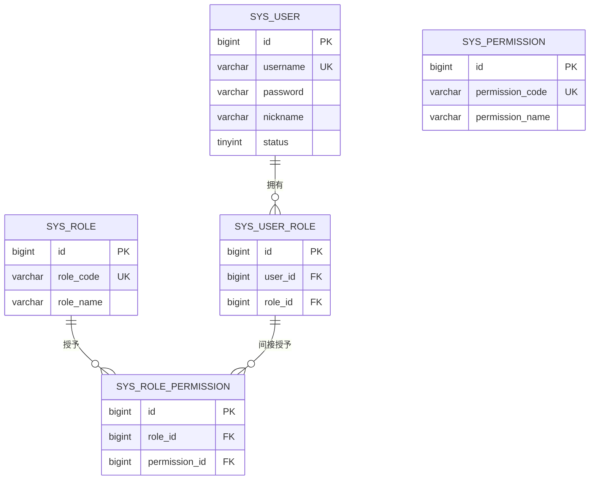
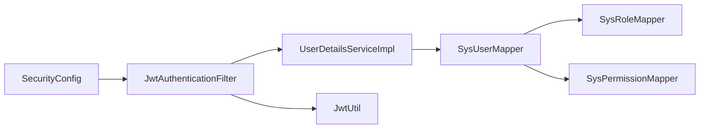

# 用户详情服务

<cite>
**本文引用的文件**
- [UserDetailsServiceImpl.java](file://src/main/java/com/bookorder/security/UserDetailsServiceImpl.java)
- [SysUserDetails.java](file://src/main/java/com/bookorder/security/SysUserDetails.java)
- [SysUser.java](file://src/main/java/com/bookorder/entity/SysUser.java)
- [SysRole.java](file://src/main/java/com/bookorder/entity/SysRole.java)
- [SysPermission.java](file://src/main/java/com/bookorder/entity/SysPermission.java)
- [SysUserMapper.java](file://src/main/java/com/bookorder/mapper/SysUserMapper.java)
- [SysRoleMapper.java](file://src/main/java/com/bookorder/mapper/SysRoleMapper.java)
- [SysPermissionMapper.java](file://src/main/java/com/bookorder/mapper/SysPermissionMapper.java)
- [SysUserServiceImpl.java](file://src/main/java/com/bookorder/service/impl/SysUserServiceImpl.java)
- [SecurityConfig.java](file://src/main/java/com/bookorder/config/SecurityConfig.java)
- [JwtAuthenticationFilter.java](file://src/main/java/com/bookorder/security/JwtAuthenticationFilter.java)
- [JwtUtil.java](file://src/main/java/com/bookorder/security/JwtUtil.java)
- [init.sql](file://sql/init.sql)
</cite>

## 目录
1. [简介](#简介)
2. [项目结构](#项目结构)
3. [核心组件](#核心组件)
4. [架构总览](#架构总览)
5. [详细组件分析](#详细组件分析)
6. [依赖关系分析](#依赖关系分析)
7. [性能考虑](#性能考虑)
8. [故障排查指南](#故障排查指南)
9. [结论](#结论)
10. [附录](#附录)

## 简介
本文件围绕用户详情服务展开，重点阐述以下内容：
- UserDetailsServiceImpl 的实现细节：用户信息加载、数据库查询与用户对象转换。
- SysUserDetails 类的设计与实现：如何实现 UserDetails 接口、权限集合的组织与角色解析。
- 认证流程中用户信息的加载路径：从用户名查找、密码验证到账户状态检查。
- 权限的动态加载机制与权限继承关系（基于角色-权限映射）。
- 扩展方法与自定义实现指南，帮助在现有框架上进行二次开发。

## 项目结构
用户详情服务位于安全模块下，配合 Spring Security、MyBatis-Plus 以及 JWT 实现认证与授权。关键文件分布如下：
- 安全层：UserDetailsServiceImpl、SysUserDetails、JwtAuthenticationFilter、JwtUtil、SecurityConfig
- 数据访问层：SysUserMapper、SysRoleMapper、SysPermissionMapper
- 领域模型：SysUser、SysRole、SysPermission
- 业务层：SysUserServiceImpl（包含登录、注册等）

图表来源
- [UserDetailsServiceImpl.java:1-50](file://src/main/java/com/bookorder/security/UserDetailsServiceImpl.java#L1-L50)
- [SysUserDetails.java:1-54](file://src/main/java/com/bookorder/security/SysUserDetails.java#L1-L54)
- [JwtAuthenticationFilter.java:1-56](file://src/main/java/com/bookorder/security/JwtAuthenticationFilter.java#L1-L56)
- [JwtUtil.java:1-62](file://src/main/java/com/bookorder/security/JwtUtil.java#L1-L62)
- [SecurityConfig.java:1-74](file://src/main/java/com/bookorder/config/SecurityConfig.java#L1-L74)
- [SysUserMapper.java:1-25](file://src/main/java/com/bookorder/mapper/SysUserMapper.java#L1-L25)
- [SysRoleMapper.java:1-10](file://src/main/java/com/bookorder/mapper/SysRoleMapper.java#L1-L10)
- [SysPermissionMapper.java:1-10](file://src/main/java/com/bookorder/mapper/SysPermissionMapper.java#L1-L10)
- [SysUserServiceImpl.java:1-87](file://src/main/java/com/bookorder/service/impl/SysUserServiceImpl.java#L1-L87)

章节来源
- [UserDetailsServiceImpl.java:1-50](file://src/main/java/com/bookorder/security/UserDetailsServiceImpl.java#L1-L50)
- [SysUserDetails.java:1-54](file://src/main/java/com/bookorder/security/SysUserDetails.java#L1-L54)
- [JwtAuthenticationFilter.java:1-56](file://src/main/java/com/bookorder/security/JwtAuthenticationFilter.java#L1-L56)
- [JwtUtil.java:1-62](file://src/main/java/com/bookorder/security/JwtUtil.java#L1-L62)
- [SecurityConfig.java:1-74](file://src/main/java/com/bookorder/config/SecurityConfig.java#L1-L74)
- [SysUserMapper.java:1-25](file://src/main/java/com/bookorder/mapper/SysUserMapper.java#L1-L25)
- [SysRoleMapper.java:1-10](file://src/main/java/com/bookorder/mapper/SysRoleMapper.java#L1-L10)
- [SysPermissionMapper.java:1-10](file://src/main/java/com/bookorder/mapper/SysPermissionMapper.java#L1-L10)
- [SysUserServiceImpl.java:1-87](file://src/main/java/com/bookorder/service/impl/SysUserServiceImpl.java#L1-L87)

## 核心组件
- UserDetailsServiceImpl：实现 UserDetailsService 接口，负责根据用户名加载用户详情，并构建权限集合。
- SysUserDetails：实现 UserDetails 接口，封装用户基本信息与权限集合，提供账户状态判断。
- SysUserMapper：提供用户基础信息查询及角色、权限代码查询。
- JwtAuthenticationFilter：拦截请求，从 JWT 中提取用户信息并注入 Spring Security 上下文。
- SecurityConfig：配置无状态会话策略、放行登录/注册端点、异常处理与过滤器链。

章节来源
- [UserDetailsServiceImpl.java:17-48](file://src/main/java/com/bookorder/security/UserDetailsServiceImpl.java#L17-L48)
- [SysUserDetails.java:10-53](file://src/main/java/com/bookorder/security/SysUserDetails.java#L10-L53)
- [SysUserMapper.java:12-23](file://src/main/java/com/bookorder/mapper/SysUserMapper.java#L12-L23)
- [JwtAuthenticationFilter.java:19-46](file://src/main/java/com/bookorder/security/JwtAuthenticationFilter.java#L19-L46)
- [SecurityConfig.java:26-62](file://src/main/java/com/bookorder/config/SecurityConfig.java#L26-L62)

## 架构总览
用户认证与授权的整体流程如下：
- 客户端携带 JWT 请求受保护资源。
- JwtAuthenticationFilter 从 Authorization 头解析 Token 并校验有效性。
- 若有效，从 Token 中提取用户名，调用 UserDetailsServiceImpl 加载用户详情。
- UserDetailsServiceImpl 查询用户基础信息与角色/权限代码，组装 GrantedAuthority 列表。
- 将 UserDetails 注入 Spring Security 上下文，后续访问控制由方法级注解或 Web 层规则生效。

图表来源
- [JwtAuthenticationFilter.java:28-46](file://src/main/java/com/bookorder/security/JwtAuthenticationFilter.java#L28-L46)
- [UserDetailsServiceImpl.java:23-48](file://src/main/java/com/bookorder/security/UserDetailsServiceImpl.java#L23-L48)
- [SysUserMapper.java:14-23](file://src/main/java/com/bookorder/mapper/SysUserMapper.java#L14-L23)

## 详细组件分析

### UserDetailsServiceImpl 实现细节
- 用户名查找：通过 SysUserMapper 使用 LambdaQueryWrapper 查询用户名匹配的用户。
- 账户状态检查：若用户不存在或状态非启用，则抛出 UsernameNotFoundException。
- 权限动态加载：
  - 先查询用户的角色代码集合，为每个角色代码添加前缀生成 ROLE_ 前缀的权限标识。
  - 再查询用户继承的权限代码集合（去重），直接作为权限标识。
  - 将角色与权限统一放入 GrantedAuthority 列表。
- 用户对象转换：将用户实体与权限集合封装为 SysUserDetails 返回。

图表来源
- [UserDetailsServiceImpl.java:23-48](file://src/main/java/com/bookorder/security/UserDetailsServiceImpl.java#L23-L48)
- [SysUserMapper.java:14-23](file://src/main/java/com/bookorder/mapper/SysUserMapper.java#L14-L23)

章节来源
- [UserDetailsServiceImpl.java:17-48](file://src/main/java/com/bookorder/security/UserDetailsServiceImpl.java#L17-L48)
- [SysUserMapper.java:12-23](file://src/main/java/com/bookorder/mapper/SysUserMapper.java#L12-L23)

### SysUserDetails 设计与实现
- 字段设计：保存用户主键、用户名、密码、昵称、状态与权限集合。
- UserDetails 接口实现要点：
  - getAuthorities：返回权限集合。
  - getPassword/getUsername：返回用户凭证与标识。
  - isAccountNonExpired/isAccountNonLocked/isCredentialsNonExpired：均返回 true，表示不进行时间与锁定校验。
  - isEnabled：依据用户状态字段判断是否启用。
- 作用：作为 Spring Security 的主体对象，承载认证后用户的身份与权限。

图表来源
- [SysUserDetails.java:10-53](file://src/main/java/com/bookorder/security/SysUserDetails.java#L10-L53)

章节来源
- [SysUserDetails.java:10-53](file://src/main/java/com/bookorder/security/SysUserDetails.java#L10-L53)

### 用户认证流程中的信息加载
- 登录阶段：SysUserServiceImpl.login 使用 AuthenticationManager 进行用户名/密码验证；成功后使用 JwtUtil 生成 token。
- 令牌阶段：JwtAuthenticationFilter 从请求头解析并校验 token；若有效则调用 UserDetailsServiceImpl 加载用户详情并注入上下文。
- 账户状态检查：UserDetailsServiceImpl 在加载用户时对状态进行校验，确保仅启用用户可被认证。

图表来源
- [SysUserServiceImpl.java:50-55](file://src/main/java/com/bookorder/service/impl/SysUserServiceImpl.java#L50-L55)
- [JwtUtil.java:27-35](file://src/main/java/com/bookorder/security/JwtUtil.java#L27-L35)
- [JwtAuthenticationFilter.java:34-42](file://src/main/java/com/bookorder/security/JwtAuthenticationFilter.java#L34-L42)
- [UserDetailsServiceImpl.java:23-48](file://src/main/java/com/bookorder/security/UserDetailsServiceImpl.java#L23-L48)

章节来源
- [SysUserServiceImpl.java:43-55](file://src/main/java/com/bookorder/service/impl/SysUserServiceImpl.java#L43-L55)
- [JwtAuthenticationFilter.java:28-46](file://src/main/java/com/bookorder/security/JwtAuthenticationFilter.java#L28-L46)
- [UserDetailsServiceImpl.java:23-48](file://src/main/java/com/bookorder/security/UserDetailsServiceImpl.java#L23-L48)

### 权限动态加载机制与继承关系
- 动态加载：
  - 角色权限：通过角色代码集合，为每个角色生成 ROLE_ 前缀的权限标识。
  - 直接权限：通过用户继承的权限代码集合，直接作为权限标识。
- 权限继承：
  - 用户通过 sys_user_role 关联到多个角色。
  - 角色通过 sys_role_permission 关联到多个权限。
  - 因此用户的最终权限集合为“角色派生权限 + 直接权限”的并集。
- 数据库查询：
  - 角色代码查询：内连接 sys_role 与 sys_user_role。
  - 权限代码查询：内连接 sys_permission、sys_role_permission 与 sys_user_role，并去重。

图表来源
- [SysUser.java:6-47](file://src/main/java/com/bookorder/entity/SysUser.java#L6-L47)
- [SysRole.java:6-41](file://src/main/java/com/bookorder/entity/SysRole.java#L6-L41)
- [SysPermission.java:6-41](file://src/main/java/com/bookorder/entity/SysPermission.java#L6-L41)
- [SysUserMapper.java:14-23](file://src/main/java/com/bookorder/mapper/SysUserMapper.java#L14-L23)

章节来源
- [SysUserMapper.java:14-23](file://src/main/java/com/bookorder/mapper/SysUserMapper.java#L14-L23)
- [init.sql:53-115](file://sql/init.sql#L53-L115)

### 扩展方法与自定义实现指南
- 自定义用户详情对象：
  - 如需扩展用户详情（如部门、岗位等），可在 SysUserDetails 中新增字段，并在构造函数中初始化。
  - 注意保持与 UserDetails 接口一致的权限与状态方法。
- 自定义权限来源：
  - 若需要从第三方系统动态拉取权限，可在 UserDetailsServiceImpl 中增加额外查询或缓存策略。
  - 可引入缓存（如 Redis）以减少重复查询，提升性能。
- 自定义账户状态策略：
  - 若需要更严格的账户状态校验（如过期、锁定），可在 UserDetailsServiceImpl 中增强状态检查逻辑。
- 自定义认证失败处理：
  - 结合 SecurityConfig 的异常处理器，可定制未登录与权限不足的响应格式与日志记录。
- 自定义登录流程：
  - 若需要多因素认证或验证码，可在 SysUserServiceImpl.login 前增加前置校验步骤。

章节来源
- [SysUserDetails.java:19-26](file://src/main/java/com/bookorder/security/SysUserDetails.java#L19-L26)
- [UserDetailsServiceImpl.java:23-48](file://src/main/java/com/bookorder/security/UserDetailsServiceImpl.java#L23-L48)
- [SecurityConfig.java:43-58](file://src/main/java/com/bookorder/config/SecurityConfig.java#L43-L58)

## 依赖关系分析
- 组件耦合：
  - UserDetailsServiceImpl 依赖 SysUserMapper，间接依赖角色与权限查询。
  - JwtAuthenticationFilter 依赖 JwtUtil 与 UserDetailsService，形成“令牌解析—用户加载—上下文注入”的链路。
  - SecurityConfig 配置全局安全策略与过滤器链。
- 外部依赖：
  - Spring Security：提供 UserDetails 接口、AuthenticationManager、过滤器链。
  - MyBatis-Plus：提供 Mapper 接口与条件构造器。
  - JWT 库：提供签名与解析能力。
- 循环依赖：
  - 当前结构未发现循环依赖，各层职责清晰。

图表来源
- [UserDetailsServiceImpl.java:20-21](file://src/main/java/com/bookorder/security/UserDetailsServiceImpl.java#L20-L21)
- [SysUserMapper.java:12-23](file://src/main/java/com/bookorder/mapper/SysUserMapper.java#L12-L23)
- [JwtAuthenticationFilter.java:22-26](file://src/main/java/com/bookorder/security/JwtAuthenticationFilter.java#L22-L26)
- [JwtUtil.java:14-25](file://src/main/java/com/bookorder/security/JwtUtil.java#L14-L25)
- [SecurityConfig.java:29-59](file://src/main/java/com/bookorder/config/SecurityConfig.java#L29-L59)

章节来源
- [UserDetailsServiceImpl.java:17-48](file://src/main/java/com/bookorder/security/UserDetailsServiceImpl.java#L17-L48)
- [JwtAuthenticationFilter.java:19-46](file://src/main/java/com/bookorder/security/JwtAuthenticationFilter.java#L19-L46)
- [SecurityConfig.java:26-62](file://src/main/java/com/bookorder/config/SecurityConfig.java#L26-L62)

## 性能考虑
- 查询优化：
  - 角色与权限查询采用内连接与去重，建议在用户、角色、权限相关字段建立合适索引（如用户唯一索引、角色权限唯一索引）。
- 缓存策略：
  - 对热点用户详情与权限集合进行缓存，避免频繁查询数据库。
- 令牌校验：
  - JwtUtil 已内置过期校验，建议合理设置过期时间，平衡安全性与用户体验。
- 并发与事务：
  - 注册流程使用事务保证一致性；并发场景下注意用户名唯一性检查与默认角色绑定的原子性。

[本节为通用指导，无需列出具体文件来源]

## 故障排查指南
- 用户名不存在或被禁用：
  - 现象：认证时抛出 UsernameNotFoundException。
  - 排查：确认用户名是否存在、状态是否为启用。
- 权限不足：
  - 现象：访问受保护资源返回 403。
  - 排查：确认用户是否具备对应角色或权限代码；检查角色-权限映射是否正确。
- 令牌无效或过期：
  - 现象：请求受保护资源返回 401。
  - 排查：确认 Authorization 头格式、令牌签名密钥与过期时间配置。
- 登录失败：
  - 现象：登录接口返回错误。
  - 排查：确认密码编码器与加密方式一致；检查 AuthenticationManager 配置。

章节来源
- [UserDetailsServiceImpl.java:28-34](file://src/main/java/com/bookorder/security/UserDetailsServiceImpl.java#L28-L34)
- [SecurityConfig.java:43-58](file://src/main/java/com/bookorder/config/SecurityConfig.java#L43-L58)
- [JwtUtil.java:45-52](file://src/main/java/com/bookorder/security/JwtUtil.java#L45-L52)

## 结论
用户详情服务通过 UserDetailsServiceImpl 与 SysUserDetails 实现了从用户名到用户详情与权限集合的完整加载链路。结合 JwtAuthenticationFilter 与 SecurityConfig，实现了基于 JWT 的无状态认证与细粒度授权。权限体系基于角色-权限映射，支持动态加载与继承，满足常见业务场景。通过合理的扩展点与缓存策略，可在保证安全性的前提下进一步提升性能与灵活性。

[本节为总结性内容，无需列出具体文件来源]

## 附录
- 数据库初始化脚本包含用户、角色、权限及其映射关系，便于快速搭建测试环境。
- 建议在生产环境中：
  - 使用强密码策略与安全的 JWT 密钥管理。
  - 启用 HTTPS 与合适的 CORS 策略。
  - 对敏感操作启用审计与日志记录。

章节来源
- [init.sql:1-124](file://sql/init.sql#L1-L124)