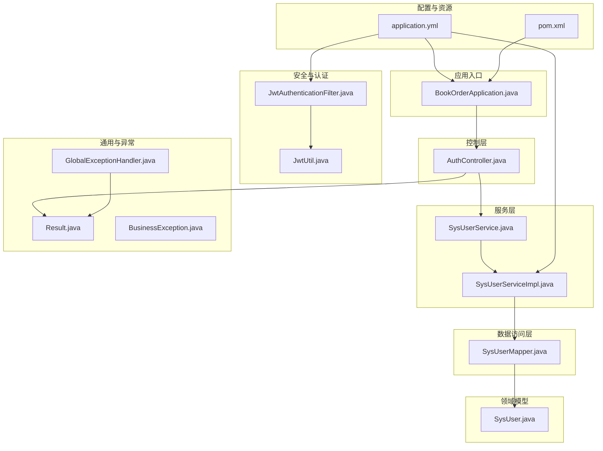
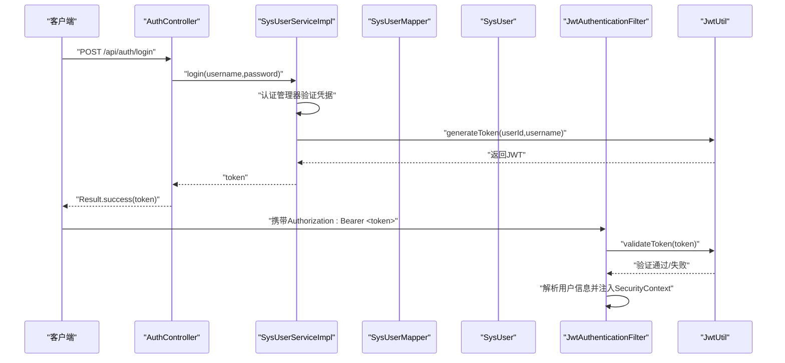
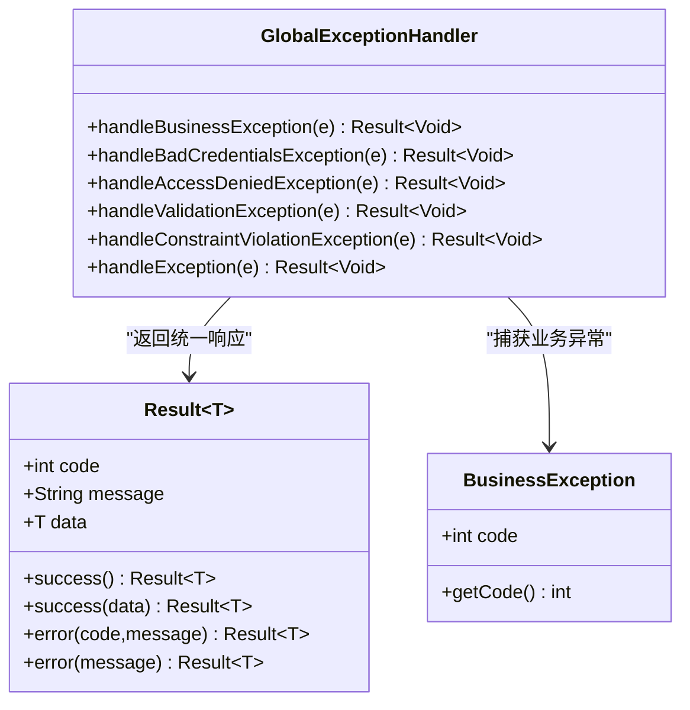
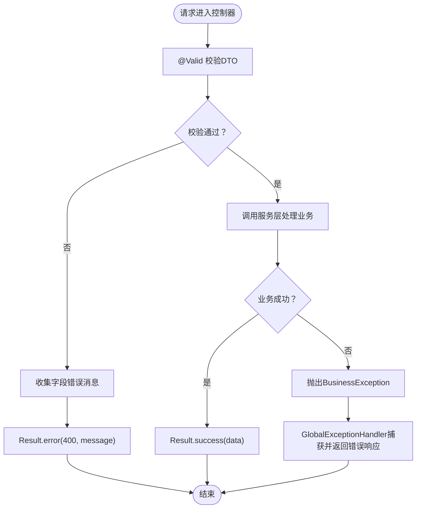
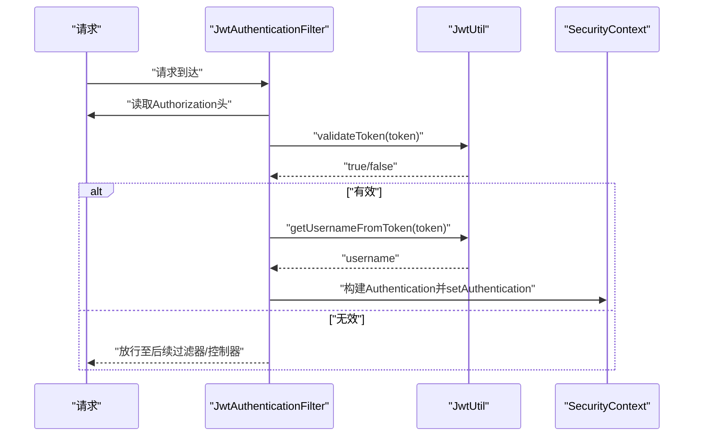
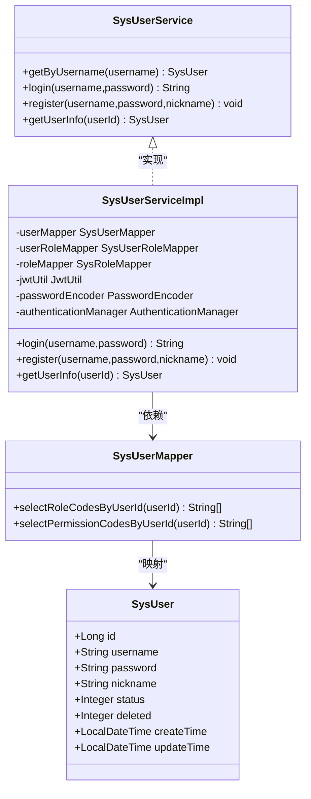
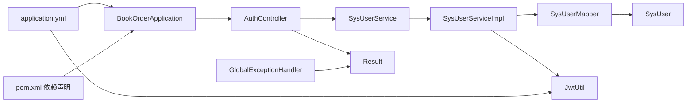

# 代码规范与最佳实践

<cite>
**本文引用的文件**
- [BookOrderApplication.java](file://src/main/java/com/bookorder/BookOrderApplication.java)
- [GlobalExceptionHandler.java](file://src/main/java/com/bookorder/common/GlobalExceptionHandler.java)
- [BusinessException.java](file://src/main/java/com/bookorder/common/BusinessException.java)
- [Result.java](file://src/main/java/com/bookorder/common/Result.java)
- [AuthController.java](file://src/main/java/com/bookorder/controller/AuthController.java)
- [SysUserService.java](file://src/main/java/com/bookorder/service/SysUserService.java)
- [SysUserServiceImpl.java](file://src/main/java/com/bookorder/service/impl/SysUserServiceImpl.java)
- [LoginRequest.java](file://src/main/java/com/bookorder/dto/LoginRequest.java)
- [JwtAuthenticationFilter.java](file://src/main/java/com/bookorder/security/JwtAuthenticationFilter.java)
- [JwtUtil.java](file://src/main/java/com/bookorder/security/JwtUtil.java)
- [SysUser.java](file://src/main/java/com/bookorder/entity/SysUser.java)
- [SysUserMapper.java](file://src/main/java/com/bookorder/mapper/SysUserMapper.java)
- [application.yml](file://src/main/resources/application.yml)
- [pom.xml](file://pom.xml)
- [README.md](file://README.md)
</cite>

## 目录
1. [引言](#引言)
2. [项目结构](#项目结构)
3. [核心组件](#核心组件)
4. [架构总览](#架构总览)
5. [详细组件分析](#详细组件分析)
6. [依赖分析](#依赖分析)
7. [性能考虑](#性能考虑)
8. [故障排查指南](#故障排查指南)
9. [结论](#结论)
10. [附录](#附录)

## 引言
本文件旨在制定并说明本项目的代码规范与最佳实践标准，覆盖Java编码规范、Spring Boot目录结构组织原则、统一响应与异常处理模式、日志与错误信息格式化、Git提交消息与分支管理策略等内容。文档以现有代码库为依据，结合可扩展性与可维护性的视角，提供可落地的规范建议。

## 项目结构
项目采用标准的Spring Boot多模块风格，按职责分层组织在src/main/java/com/bookorder下，主要层次如下：
- common：通用工具与全局异常处理
- config：框架配置（安全、MyBatis-Plus）
- controller：REST控制器
- dto：请求/响应数据传输对象
- entity：领域实体（MyBatis-Plus映射）
- mapper：数据访问接口
- security：认证与授权相关组件
- service：服务接口与实现
- resources：配置与初始化SQL

图表来源
- [BookOrderApplication.java:1-15](file://src/main/java/com/bookorder/BookOrderApplication.java#L1-L15)
- [AuthController.java:1-59](file://src/main/java/com/bookorder/controller/AuthController.java#L1-L59)
- [SysUserService.java:1-16](file://src/main/java/com/bookorder/service/SysUserService.java#L1-L16)
- [SysUserServiceImpl.java:1-87](file://src/main/java/com/bookorder/service/impl/SysUserServiceImpl.java#L1-L87)
- [SysUserMapper.java:1-25](file://src/main/java/com/bookorder/mapper/SysUserMapper.java#L1-L25)
- [SysUser.java:1-48](file://src/main/java/com/bookorder/entity/SysUser.java#L1-L48)
- [JwtAuthenticationFilter.java:1-56](file://src/main/java/com/bookorder/security/JwtAuthenticationFilter.java#L1-L56)
- [JwtUtil.java:1-62](file://src/main/java/com/bookorder/security/JwtUtil.java#L1-L62)
- [Result.java:1-41](file://src/main/java/com/bookorder/common/Result.java#L1-L41)
- [GlobalExceptionHandler.java:1-62](file://src/main/java/com/bookorder/common/GlobalExceptionHandler.java#L1-L62)
- [BusinessException.java:1-19](file://src/main/java/com/bookorder/common/BusinessException.java#L1-L19)
- [application.yml:1-33](file://src/main/resources/application.yml#L1-L33)
- [pom.xml:1-95](file://pom.xml#L1-L95)

章节来源
- [README.md:128-168](file://README.md#L128-L168)

## 核心组件
- 统一响应模型：Result<T> 提供success/error静态工厂方法，统一返回结构，便于前端消费与调试。
- 全局异常处理：GlobalExceptionHandler集中捕获业务异常、参数校验异常、认证/授权异常及未捕获异常，返回标准化错误响应，并记录日志。
- 业务异常类型：BusinessException支持自定义状态码与消息，便于区分不同业务错误场景。
- 控制器：AuthController提供登录、注册、获取当前用户信息等接口，使用DTO接收请求，返回Result封装结果。
- 安全过滤链：JwtAuthenticationFilter从请求头解析Bearer Token，验证后注入Security上下文；JwtUtil负责签发与解析JWT。
- 数据访问：SysUserMapper通过注解SQL查询用户的角色与权限编码；SysUser为MyBatis-Plus实体，启用逻辑删除与字段填充。

章节来源
- [Result.java:1-41](file://src/main/java/com/bookorder/common/Result.java#L1-L41)
- [GlobalExceptionHandler.java:1-62](file://src/main/java/com/bookorder/common/GlobalExceptionHandler.java#L1-L62)
- [BusinessException.java:1-19](file://src/main/java/com/bookorder/common/BusinessException.java#L1-L19)
- [AuthController.java:1-59](file://src/main/java/com/bookorder/controller/AuthController.java#L1-L59)
- [JwtAuthenticationFilter.java:1-56](file://src/main/java/com/bookorder/security/JwtAuthenticationFilter.java#L1-L56)
- [JwtUtil.java:1-62](file://src/main/java/com/bookorder/security/JwtUtil.java#L1-L62)
- [SysUserMapper.java:1-25](file://src/main/java/com/bookorder/mapper/SysUserMapper.java#L1-L25)
- [SysUser.java:1-48](file://src/main/java/com/bookorder/entity/SysUser.java#L1-L48)

## 架构总览
系统采用经典的分层架构：表现层（Controller）- 领域服务（Service）- 数据访问（Mapper/Entity）- 安全过滤（JWT）。请求流程从控制器进入，经由服务层处理业务逻辑，访问数据层持久化，异常通过全局处理器统一拦截并格式化输出。

图表来源
- [AuthController.java:28-32](file://src/main/java/com/bookorder/controller/AuthController.java#L28-L32)
- [SysUserServiceImpl.java:49-55](file://src/main/java/com/bookorder/service/impl/SysUserServiceImpl.java#L49-L55)
- [JwtUtil.java:27-35](file://src/main/java/com/bookorder/security/JwtUtil.java#L27-L35)
- [JwtAuthenticationFilter.java:32-43](file://src/main/java/com/bookorder/security/JwtAuthenticationFilter.java#L32-L43)

## 详细组件分析

### 统一响应与异常处理
- 统一响应：Result<T>提供成功与错误两类静态工厂方法，约定code/message/data三段式结构，便于前端统一处理。
- 全局异常：对业务异常、认证失败、权限不足、参数校验失败、其他异常分别处理，设置对应HTTP状态码与错误信息，并记录日志。
- 业务异常：BusinessException支持自定义code，便于区分不同业务错误。

图表来源
- [Result.java:3-40](file://src/main/java/com/bookorder/common/Result.java#L3-L40)
- [BusinessException.java:3-18](file://src/main/java/com/bookorder/common/BusinessException.java#L3-L18)
- [GlobalExceptionHandler.java:22-60](file://src/main/java/com/bookorder/common/GlobalExceptionHandler.java#L22-L60)

章节来源
- [Result.java:18-40](file://src/main/java/com/bookorder/common/Result.java#L18-L40)
- [GlobalExceptionHandler.java:22-60](file://src/main/java/com/bookorder/common/GlobalExceptionHandler.java#L22-L60)
- [BusinessException.java:3-18](file://src/main/java/com/bookorder/common/BusinessException.java#L3-L18)

### 控制器与DTO
- 控制器：AuthController使用@RestController与@RequestMapping组织端点，使用@Autowired注入服务与Mapper，返回Result封装结果。
- DTO：LoginRequest使用Jakarta Bean Validation注解进行参数校验，保证入参合法性。
- 参数校验：@Valid配合全局异常处理，MethodArgumentNotValidException与ConstraintViolationException被转换为统一错误响应。

图表来源
- [AuthController.java:28-38](file://src/main/java/com/bookorder/controller/AuthController.java#L28-L38)
- [LoginRequest.java:7-11](file://src/main/java/com/bookorder/dto/LoginRequest.java#L7-L11)
- [GlobalExceptionHandler.java:40-53](file://src/main/java/com/bookorder/common/GlobalExceptionHandler.java#L40-L53)

章节来源
- [AuthController.java:1-59](file://src/main/java/com/bookorder/controller/AuthController.java#L1-L59)
- [LoginRequest.java:1-18](file://src/main/java/com/bookorder/dto/LoginRequest.java#L1-L18)
- [GlobalExceptionHandler.java:40-53](file://src/main/java/com/bookorder/common/GlobalExceptionHandler.java#L40-L53)

### 安全与认证
- 过滤器：JwtAuthenticationFilter从Authorization头解析Bearer Token，校验后将用户信息注入SecurityContext，供后续鉴权使用。
- 工具类：JwtUtil负责密钥生成、令牌签发、载荷解析与过期判断，确保安全性与可读性。

图表来源
- [JwtAuthenticationFilter.java:28-46](file://src/main/java/com/bookorder/security/JwtAuthenticationFilter.java#L28-L46)
- [JwtUtil.java:45-60](file://src/main/java/com/bookorder/security/JwtUtil.java#L45-L60)

章节来源
- [JwtAuthenticationFilter.java:1-56](file://src/main/java/com/bookorder/security/JwtAuthenticationFilter.java#L1-L56)
- [JwtUtil.java:1-62](file://src/main/java/com/bookorder/security/JwtUtil.java#L1-L62)

### 服务层与数据访问
- 服务接口：SysUserService继承IService，定义业务契约；实现类SysUserServiceImpl承担登录、注册、查询等业务逻辑。
- 事务与加密：注册流程使用@Transactional回滚异常，密码通过PasswordEncoder加密存储。
- 角色与权限：注册后默认绑定READER角色；查询用户角色与权限编码通过Mapper注解SQL完成。

图表来源
- [SysUserService.java:6-15](file://src/main/java/com/bookorder/service/SysUserService.java#L6-L15)
- [SysUserServiceImpl.java:22-86](file://src/main/java/com/bookorder/service/impl/SysUserServiceImpl.java#L22-L86)
- [SysUserMapper.java:11-24](file://src/main/java/com/bookorder/mapper/SysUserMapper.java#L11-L24)
- [SysUser.java:6-47](file://src/main/java/com/bookorder/entity/SysUser.java#L6-L47)

章节来源
- [SysUserService.java:1-16](file://src/main/java/com/bookorder/service/SysUserService.java#L1-L16)
- [SysUserServiceImpl.java:1-87](file://src/main/java/com/bookorder/service/impl/SysUserServiceImpl.java#L1-L87)
- [SysUserMapper.java:1-25](file://src/main/java/com/bookorder/mapper/SysUserMapper.java#L1-L25)
- [SysUser.java:1-48](file://src/main/java/com/bookorder/entity/SysUser.java#L1-L48)

## 依赖分析
- 模块依赖：应用入口扫描mapper包，控制器依赖服务与DTO，服务实现依赖Mapper、实体、安全工具与加密器。
- 外部依赖：Spring Boot Web、Security、Validation、MyBatis-Plus、MySQL驱动、JWT等。
- 配置依赖：application.yml中定义数据源、MyBatis-Plus行为、JWT密钥与过期时间、日志级别。

图表来源
- [BookOrderApplication.java:7-8](file://src/main/java/com/bookorder/BookOrderApplication.java#L7-L8)
- [AuthController.java:1-16](file://src/main/java/com/bookorder/controller/AuthController.java#L1-L16)
- [SysUserServiceImpl.java:1-20](file://src/main/java/com/bookorder/service/impl/SysUserServiceImpl.java#L1-L20)
- [SysUserMapper.java:1-9](file://src/main/java/com/bookorder/mapper/SysUserMapper.java#L1-L9)
- [application.yml:4-28](file://src/main/resources/application.yml#L4-L28)
- [pom.xml:26-83](file://pom.xml#L26-L83)

章节来源
- [pom.xml:1-95](file://pom.xml#L1-L95)
- [application.yml:1-33](file://src/main/resources/application.yml#L1-L33)

## 性能考虑
- 数据访问优化：优先使用MyBatis-Plus条件构造器与注解SQL，避免N+1查询；合理使用分页与索引。
- 安全开销：JWT验证仅在必要路径执行，避免重复解析；Token有效期适配业务场景。
- 日志级别：开发环境开启debug，生产环境建议调整为info以上，减少IO开销。
- 事务边界：将事务作用域最小化，避免长事务占用数据库锁资源。

## 故障排查指南
- 统一错误响应：所有异常最终通过GlobalExceptionHandler转换为Result.error，前端可根据code/message快速定位问题。
- 日志记录：业务异常记录warn级别日志，系统异常记录error并附带堆栈，便于追踪。
- 参数校验：字段级校验失败返回400与具体错误消息；Bean约束校验返回400与异常信息。
- 认证失败：用户名或密码错误返回401；权限不足返回403；其他异常返回500。

章节来源
- [GlobalExceptionHandler.java:22-60](file://src/main/java/com/bookorder/common/GlobalExceptionHandler.java#L22-L60)
- [application.yml:30-33](file://src/main/resources/application.yml#L30-L33)

## 结论
本项目遵循清晰的分层架构与统一响应/异常处理模式，结合JWT认证与MyBatis-Plus数据访问，具备良好的可维护性与扩展性。建议在后续迭代中持续完善单元测试、接口文档与监控告警体系，进一步提升质量与稳定性。

## 附录

### Java编码规范
- 包名：全部小写，如com.bookorder。
- 类名：帕斯卡命名法，如BookOrderApplication、SysUserServiceImpl。
- 方法名：驼峰命名法，如login、register。
- 常量：全部大写，以下划线分隔，如MAX_SIZE。
- 字段与局部变量：驼峰命名法，如userId、username。
- 注释规范：
  - 类与接口：简述职责与关键行为。
  - 方法：说明输入、输出、异常与注意事项。
  - 关键逻辑：补充算法要点或边界条件。
- 代码缩进与格式化：
  - 使用4空格缩进，大括号独占一行。
  - 行宽不超过120字符，合理换行。
  - 二元运算符两侧与逗号后保留空格。
- 导入顺序：第三方库在前，项目内包在后，按字母排序。

### Spring Boot目录结构组织原则与文件命名规范
- 包结构：按功能域划分common、config、controller、dto、entity、mapper、security、service等。
- 文件命名：
  - 接口以I开头或以Interface结尾（此处采用接口即接口命名，符合常见约定）。
  - 实现类以Impl结尾，如SysUserServiceImpl。
  - 配置类以Config结尾，如SecurityConfig、MyBatisPlusConfig。
  - 工具类以Util结尾，如JwtUtil。
  - 异常类以Exception结尾，如BusinessException。
  - 控制器以Controller结尾，如AuthController。
  - Mapper接口以Mapper结尾，如SysUserMapper。
  - 实体类与数据库表同名，采用驼峰映射。
- 资源文件：application.yml位于resources目录，SQL脚本置于resources/sql。

### 代码审查清单与质量检查标准
- 结构与职责：
  - 是否严格分层，各层职责清晰？
  - 控制器是否仅做参数绑定与结果封装？
  - 业务逻辑是否集中在服务层？
- 异常与日志：
  - 是否使用统一响应Result？
  - 是否使用GlobalExceptionHandler集中处理异常？
  - 是否对业务异常与系统异常进行区分记录？
- 安全与认证：
  - 是否正确使用JWT过滤器与认证管理器？
  - 是否对敏感字段（密码）进行加密存储？
- 数据访问：
  - 是否使用MyBatis-Plus条件构造器与注解SQL？
  - 是否避免N+1查询与不必要的JOIN？
- 测试与文档：
  - 是否补充必要的单元测试与集成测试？
  - 是否更新README中的接口文档与示例？

### 日志记录规范、异常处理模式与错误信息格式化标准
- 日志级别：
  - 业务异常：warn，记录业务错误原因与上下文。
  - 系统异常：error，记录堆栈与关键参数。
  - 开发调试：debug，仅在开发环境开启。
- 错误信息格式：
  - 统一使用Result.error(code, message)，code为HTTP语义码或业务码，message为人类可读提示。
  - 参数校验错误：拼接字段级错误消息，便于前端逐项提示。
- 异常处理模式：
  - 业务异常：抛出BusinessException，由全局处理器返回错误响应。
  - 认证/授权异常：返回401/403，提示用户重新登录或权限不足。
  - 其他异常：返回500，提示系统内部错误。

章节来源
- [Result.java:30-39](file://src/main/java/com/bookorder/common/Result.java#L30-L39)
- [GlobalExceptionHandler.java:22-60](file://src/main/java/com/bookorder/common/GlobalExceptionHandler.java#L22-L60)
- [application.yml:30-33](file://src/main/resources/application.yml#L30-L33)

### Git提交消息规范与分支管理策略
- 提交消息规范（参考Angular风格）：
  - 格式：type(scope): subject
  - 示例：feat(security): 添加JWT过滤器；fix(controller): 修复参数校验异常；docs(readme): 更新部署说明；chore(maven): 升级MyBatis-Plus版本
  - type取值：feat、fix、docs、style、refactor、perf、test、chore、revert
- 分支管理策略：
  - main：发布分支，保持稳定
  - develop：开发分支，合并特性分支
  - feature/*：功能开发分支，完成后合并到develop
  - hotfix/*：线上紧急修复分支，修复后同时合并到main与develop
  - release/*：预发布分支，用于打包与回归测试