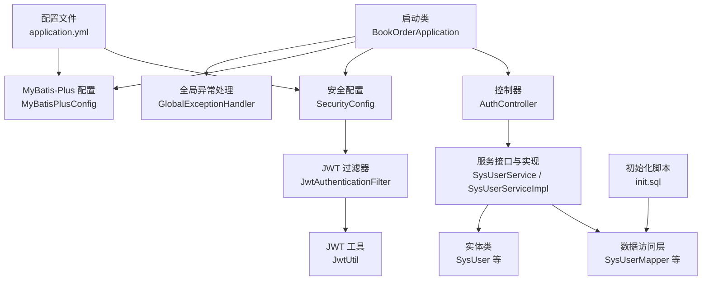
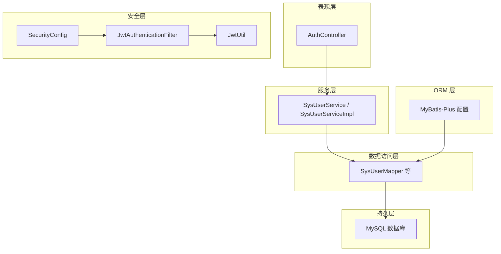
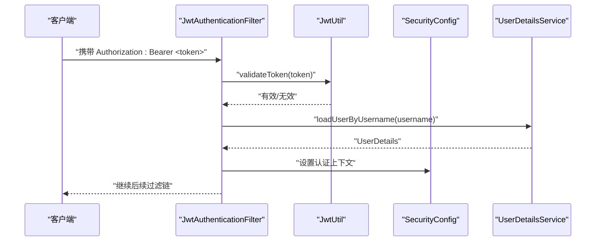
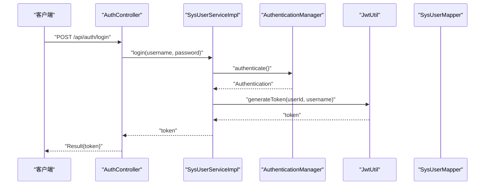
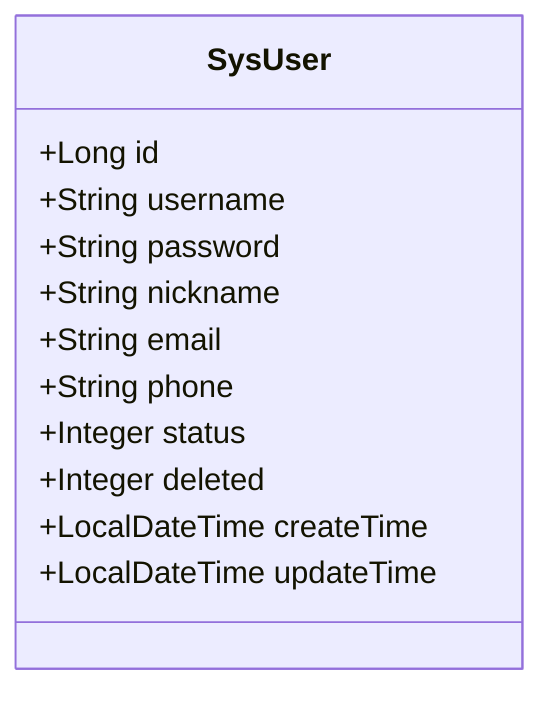
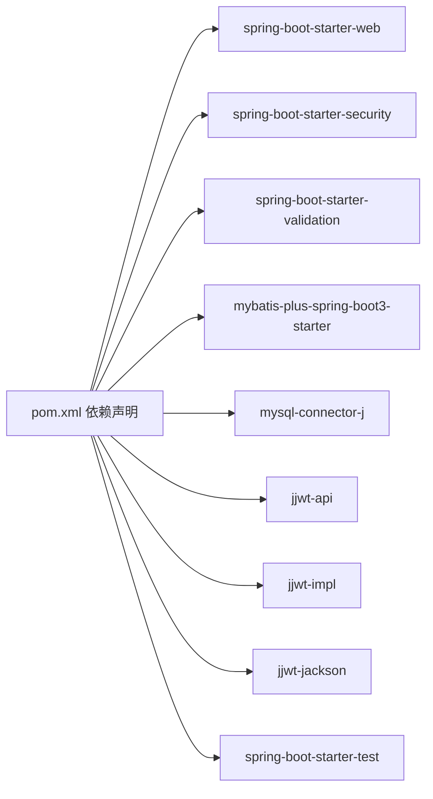

# 开发指南

<cite>
**本文引用的文件**
- [pom.xml](file://pom.xml)
- [BookOrderApplication.java](file://src/main/java/com/bookorder/BookOrderApplication.java)
- [application.yml](file://src/main/resources/application.yml)
- [README.md](file://README.md)
- [init.sql](file://sql/init.sql)
- [SecurityConfig.java](file://src/main/java/com/bookorder/config/SecurityConfig.java)
- [MyBatisPlusConfig.java](file://src/main/java/com/bookorder/config/MyBatisPlusConfig.java)
- [JwtUtil.java](file://src/main/java/com/bookorder/security/JwtUtil.java)
- [JwtAuthenticationFilter.java](file://src/main/java/com/bookorder/security/JwtAuthenticationFilter.java)
- [GlobalExceptionHandler.java](file://src/main/java/com/bookorder/common/GlobalExceptionHandler.java)
- [AuthController.java](file://src/main/java/com/bookorder/controller/AuthController.java)
- [SysUserService.java](file://src/main/java/com/bookorder/service/SysUserService.java)
- [SysUserServiceImpl.java](file://src/main/java/com/bookorder/service/impl/SysUserServiceImpl.java)
- [LoginRequest.java](file://src/main/java/com/bookorder/dto/LoginRequest.java)
- [SysUser.java](file://src/main/java/com/bookorder/entity/SysUser.java)
</cite>

## 目录
1. [简介](#简介)
2. [项目结构](#项目结构)
3. [核心组件](#核心组件)
4. [架构总览](#架构总览)
5. [详细组件分析](#详细组件分析)
6. [依赖分析](#依赖分析)
7. [性能考虑](#性能考虑)
8. [故障排查指南](#故障排查指南)
9. [结论](#结论)
10. [附录](#附录)

## 简介
本开发指南面向参与图书订单系统的开发者，目标是帮助团队快速搭建开发与运行环境、统一代码规范与最佳实践、掌握构建与依赖管理、编写高质量的单元与集成测试、掌握调试与性能分析方法，并建立规范化的版本控制与协作流程。项目采用 Spring Boot 3 + Java 17 + Maven 构建，集成了 MyBatis-Plus、Spring Security、JWT 与 RBAC 权限模型。

## 项目结构
项目遵循标准的 Spring Boot 多模块风格（单模块），采用按功能域分包的组织方式：
- 启动类位于根包路径，负责扫描 Mapper 与启动应用
- 核心目录：common（通用工具与全局异常）、config（安全与 MyBatis-Plus 配置）、controller（REST 控制器）、dto（请求/响应对象）、entity（实体）、mapper（数据访问层）、security（认证与授权）、service（服务层）
- 资源目录 resources 下包含配置文件与 SQL 初始化脚本
- 数据库初始化脚本位于根目录 sql 与 resources/sql 两处，首次启动会自动执行

图表来源
- [BookOrderApplication.java:1-15](file://src/main/java/com/bookorder/BookOrderApplication.java#L1-L15)
- [AuthController.java:1-59](file://src/main/java/com/bookorder/controller/AuthController.java#L1-L59)
- [SysUserService.java:1-16](file://src/main/java/com/bookorder/service/SysUserService.java#L1-L16)
- [SysUserServiceImpl.java:1-87](file://src/main/java/com/bookorder/service/impl/SysUserServiceImpl.java#L1-L87)
- [SecurityConfig.java:1-74](file://src/main/java/com/bookorder/config/SecurityConfig.java#L1-L74)
- [JwtAuthenticationFilter.java:1-56](file://src/main/java/com/bookorder/security/JwtAuthenticationFilter.java#L1-L56)
- [JwtUtil.java:1-62](file://src/main/java/com/bookorder/security/JwtUtil.java#L1-L62)
- [MyBatisPlusConfig.java:1-23](file://src/main/java/com/bookorder/config/MyBatisPlusConfig.java#L1-L23)
- [GlobalExceptionHandler.java:1-62](file://src/main/java/com/bookorder/common/GlobalExceptionHandler.java#L1-L62)
- [application.yml:1-33](file://src/main/resources/application.yml#L1-L33)
- [init.sql:1-124](file://sql/init.sql#L1-L124)

章节来源
- [README.md:128-168](file://README.md#L128-L168)
- [BookOrderApplication.java:1-15](file://src/main/java/com/bookorder/BookOrderApplication.java#L1-L15)
- [application.yml:1-33](file://src/main/resources/application.yml#L1-L33)

## 核心组件
- 启动类与包扫描：通过注解启用 Spring Boot 并扫描 Mapper 包，确保 MyBatis-Plus 能发现映射器
- 安全与鉴权：基于 Spring Security 的无状态 JWT 流程，过滤器解析 Authorization 头中的 Bearer Token，校验后注入认证上下文
- 统一响应与异常：Result 封装统一返回；GlobalExceptionHandler 统一处理业务异常、参数校验异常、权限不足与系统异常
- ORM 配置：MyBatis-Plus 自动填充时间字段，逻辑删除字段配置，驼峰映射开启
- 数据初始化：首次启动自动执行初始化 SQL，创建角色、权限与默认管理员账户

章节来源
- [BookOrderApplication.java:7-9](file://src/main/java/com/bookorder/BookOrderApplication.java#L7-L9)
- [SecurityConfig.java:34-62](file://src/main/java/com/bookorder/config/SecurityConfig.java#L34-L62)
- [JwtAuthenticationFilter.java:28-46](file://src/main/java/com/bookorder/security/JwtAuthenticationFilter.java#L28-L46)
- [JwtUtil.java:27-42](file://src/main/java/com/bookorder/security/JwtUtil.java#L27-L42)
- [GlobalExceptionHandler.java:22-60](file://src/main/java/com/bookorder/common/GlobalExceptionHandler.java#L22-L60)
- [MyBatisPlusConfig.java:12-21](file://src/main/java/com/bookorder/config/MyBatisPlusConfig.java#L12-L21)
- [application.yml:15-28](file://src/main/resources/application.yml#L15-L28)
- [init.sql:76-124](file://sql/init.sql#L76-L124)

## 架构总览
系统采用经典的分层架构：表现层（Controller）调用服务层，服务层通过 Mapper 访问数据库，安全层在过滤器中完成认证与授权。MyBatis-Plus 提供 ORM 能力与自动填充、逻辑删除等增强特性。

图表来源
- [AuthController.java:18-59](file://src/main/java/com/bookorder/controller/AuthController.java#L18-L59)
- [SysUserServiceImpl.java:22-87](file://src/main/java/com/bookorder/service/impl/SysUserServiceImpl.java#L22-L87)
- [SysUser.java:6-48](file://src/main/java/com/bookorder/entity/SysUser.java#L6-L48)
- [SecurityConfig.java:23-74](file://src/main/java/com/bookorder/config/SecurityConfig.java#L23-L74)
- [JwtAuthenticationFilter.java:19-56](file://src/main/java/com/bookorder/security/JwtAuthenticationFilter.java#L19-L56)
- [JwtUtil.java:13-62](file://src/main/java/com/bookorder/security/JwtUtil.java#L13-L62)
- [MyBatisPlusConfig.java:9-23](file://src/main/java/com/bookorder/config/MyBatisPlusConfig.java#L9-L23)

## 详细组件分析

### 安全与认证组件
- 过滤器链：禁用 CSRF，会话策略为无状态，放行登录与注册接口，其余请求需认证；在用户名密码过滤器之前添加 JWT 过滤器
- 异常处理：未登录与权限不足分别返回 JSON 错误体，便于前端统一处理
- 密码编码：使用 BCryptPasswordEncoder 对密码进行编码存储
- JWT 工具：基于 Base64 秘钥与过期时间生成与解析令牌，提供从令牌提取用户信息的能力

图表来源
- [JwtAuthenticationFilter.java:28-46](file://src/main/java/com/bookorder/security/JwtAuthenticationFilter.java#L28-L46)
- [JwtUtil.java:45-52](file://src/main/java/com/bookorder/security/JwtUtil.java#L45-L52)
- [SecurityConfig.java:34-62](file://src/main/java/com/bookorder/config/SecurityConfig.java#L34-L62)

章节来源
- [SecurityConfig.java:34-72](file://src/main/java/com/bookorder/config/SecurityConfig.java#L34-L72)
- [JwtAuthenticationFilter.java:19-56](file://src/main/java/com/bookorder/security/JwtAuthenticationFilter.java#L19-L56)
- [JwtUtil.java:13-62](file://src/main/java/com/bookorder/security/JwtUtil.java#L13-L62)

### 控制器与服务层
- 控制器：提供登录、注册、获取当前用户信息三个接口，均使用 DTO 接收请求参数并返回统一响应包装
- 服务层：登录使用 AuthenticationManager 校验凭据，成功后生成 JWT；注册对用户名唯一性校验，密码加密后保存，并默认绑定 READER 角色
- 参数校验：DTO 使用 Jakarta Bean Validation 注解保证必填字段非空

图表来源
- [AuthController.java:28-32](file://src/main/java/com/bookorder/controller/AuthController.java#L28-L32)
- [SysUserServiceImpl.java:50-55](file://src/main/java/com/bookorder/service/impl/SysUserServiceImpl.java#L50-L55)
- [SysUserServiceImpl.java:51-54](file://src/main/java/com/bookorder/service/impl/SysUserServiceImpl.java#L51-L54)
- [JwtUtil.java:27-35](file://src/main/java/com/bookorder/security/JwtUtil.java#L27-L35)

章节来源
- [AuthController.java:18-59](file://src/main/java/com/bookorder/controller/AuthController.java#L18-L59)
- [SysUserService.java:6-15](file://src/main/java/com/bookorder/service/SysUserService.java#L6-L15)
- [SysUserServiceImpl.java:22-87](file://src/main/java/com/bookorder/service/impl/SysUserServiceImpl.java#L22-L87)
- [LoginRequest.java:1-18](file://src/main/java/com/bookorder/dto/LoginRequest.java#L1-L18)

### 实体与自动填充
- 实体类使用注解定义主键、逻辑删除、自动填充字段等元数据
- MyBatis-Plus 配置实现插入与更新时自动填充时间字段

图表来源
- [SysUser.java:6-48](file://src/main/java/com/bookorder/entity/SysUser.java#L6-L48)

章节来源
- [SysUser.java:6-48](file://src/main/java/com/bookorder/entity/SysUser.java#L6-L48)
- [MyBatisPlusConfig.java:12-21](file://src/main/java/com/bookorder/config/MyBatisPlusConfig.java#L12-L21)

### 全局异常处理
- 捕获业务异常、凭证错误、权限不足、参数校验异常与系统异常，统一返回 Result 包裹的错误码与消息
- 日志记录异常堆栈，便于定位问题

章节来源
- [GlobalExceptionHandler.java:17-62](file://src/main/java/com/bookorder/common/GlobalExceptionHandler.java#L17-L62)

## 依赖分析
- 核心依赖：Spring Boot Starter Web、Security、Validation、MyBatis-Plus、MySQL Connector、JWT（API/IMPL/JACKSON）
- 构建插件：spring-boot-maven-plugin
- 版本属性：Java 17、MyBatis-Plus 3.5.6、jjwt 0.12.5

图表来源
- [pom.xml:26-84](file://pom.xml#L26-L84)

章节来源
- [pom.xml:20-24](file://pom.xml#L20-L24)
- [pom.xml:26-84](file://pom.xml#L26-L84)

## 性能考虑
- 无状态认证：JWT 无状态设计避免服务器端会话存储开销，但需关注令牌大小与网络传输成本
- 数据库连接与 SQL：建议结合 MyBatis-Plus 分页查询与必要索引优化；避免 N+1 查询
- 日志级别：生产环境建议调整日志级别，减少不必要的输出
- 启动与初始化：首次初始化 SQL 较大时可考虑拆分或异步化，避免启动阻塞

## 故障排查指南
- 启动失败（数据库连接）：检查 application.yml 中数据库 URL、用户名、密码是否正确
- 首次启动无数据：确认 SQL 初始化是否执行，检查 spring.sql.init.mode 与 schema-locations 配置
- 登录失败：确认用户名密码正确，检查 BCrypt 编码是否匹配；查看全局异常返回的 401/403 信息
- 权限不足：确认用户角色与权限映射是否正确，检查 JWT 过滤器是否正确解析与注入认证信息
- 参数校验失败：检查 DTO 字段注解与请求体格式，关注 400 返回的字段提示

章节来源
- [application.yml:4-13](file://src/main/resources/application.yml#L4-L13)
- [init.sql:76-124](file://sql/init.sql#L76-L124)
- [GlobalExceptionHandler.java:28-53](file://src/main/java/com/bookorder/common/GlobalExceptionHandler.java#L28-L53)
- [JwtAuthenticationFilter.java:34-43](file://src/main/java/com/bookorder/security/JwtAuthenticationFilter.java#L34-L43)

## 结论
本指南提供了从环境搭建、代码规范、构建与依赖管理、测试策略、调试与性能分析到版本控制与协作的全流程开发指引。建议团队在开发过程中严格遵循统一的包结构、命名约定与异常处理规范，配合完善的测试覆盖与日志监控，持续提升系统的稳定性与可维护性。

## 附录

### 开发环境搭建与 IDE 推荐
- JDK 17+、Maven 3.8+、MySQL 8.0+
- 在 IDE 中启用 Lombok（如使用）以支持注解处理器
- 推荐插件：Checkstyle（代码规范）、SpotBugs（静态分析）、MyBatis Log（SQL 输出）

章节来源
- [README.md:18-23](file://README.md#L18-L23)

### 代码规范与最佳实践
- 包与类命名：采用小驼峰与领域名词组合，保持语义清晰
- 控制器：使用统一响应 Result 包裹返回值；对敏感信息（如密码）不直接暴露
- 服务层：事务边界明确，异常向上抛出或转换为业务异常
- DTO：使用 Bean Validation 注解保证入参合法性
- 日志：区分 warn/error/info 级别，避免泄露敏感信息

章节来源
- [GlobalExceptionHandler.java:22-60](file://src/main/java/com/bookorder/common/GlobalExceptionHandler.java#L22-L60)
- [LoginRequest.java:7-11](file://src/main/java/com/bookorder/dto/LoginRequest.java#L7-L11)

### Maven 构建与依赖管理
- 使用 Java 17 与 Spring Boot 3.2.5 版本属性
- MyBatis-Plus 与 jjwt 版本通过属性统一管理
- 构建阶段使用 spring-boot-maven-plugin

章节来源
- [pom.xml:20-24](file://pom.xml#L20-L24)
- [pom.xml:86-93](file://pom.xml#L86-L93)

### 单元测试与集成测试
- 测试框架：建议使用 Spring Boot Test 与 JUnit 5
- 单测要点：对服务层方法进行隔离测试，使用 Mock 或内存数据库；对控制器使用 @WebMvcTest 或 @Import
- 集成测要点：使用 @SpringBootTest 启动完整上下文，结合 @AutoConfigureTestDatabase 与 @Sql 初始化测试数据
- 覆盖率：优先保证核心业务分支与异常路径

章节来源
- [pom.xml:78-83](file://pom.xml#L78-L83)

### 调试技巧与性能分析
- 调试：在控制器、服务与过滤器关键节点设置断点；利用日志与线程转储定位问题
- 性能：结合慢查询日志、数据库索引与分页查询；评估 JWT 令牌长度与网络往返

章节来源
- [application.yml:30-33](file://src/main/resources/application.yml#L30-L33)

### 版本控制与协作规范
- 分支策略：采用 Git Flow，主分支保护，功能开发在 feature 分支，修复在 hotfix 分支
- 提交规范：使用 Conventional Commits，明确 feat/fix/docs/chore 等类型
- 合并与评审：PR 必须通过 CI 与代码审查，合并前确保测试通过

章节来源
- [.gitignore](file://.gitignore)