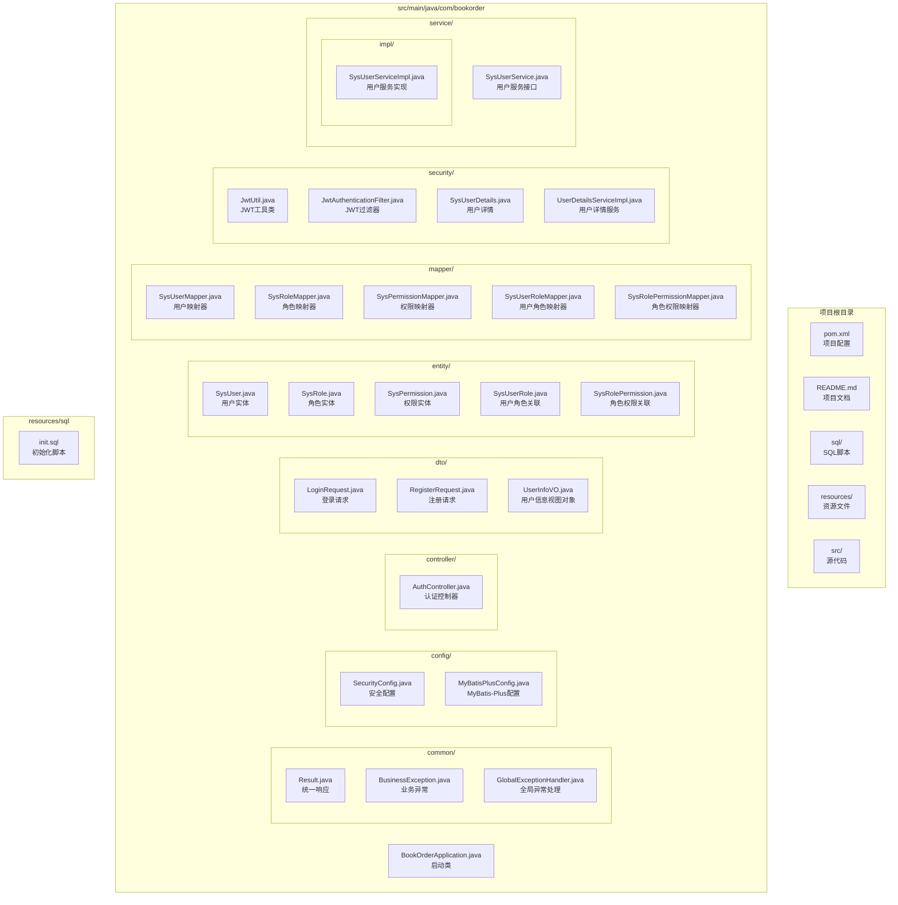
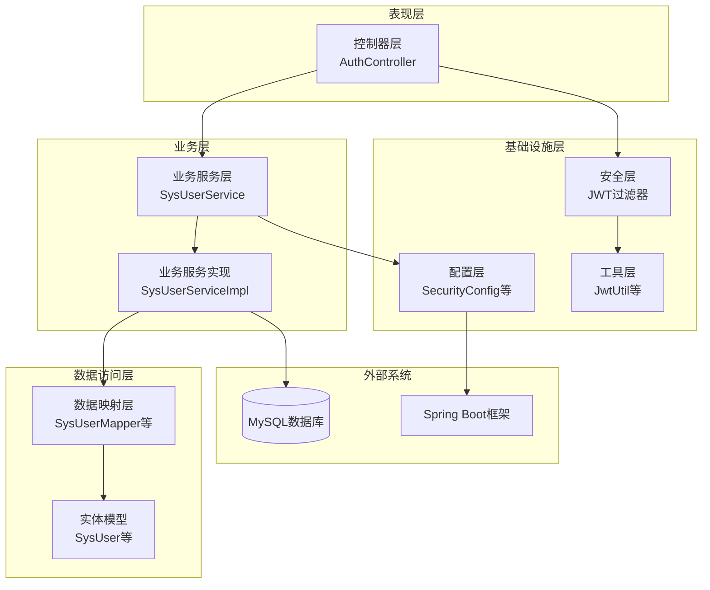
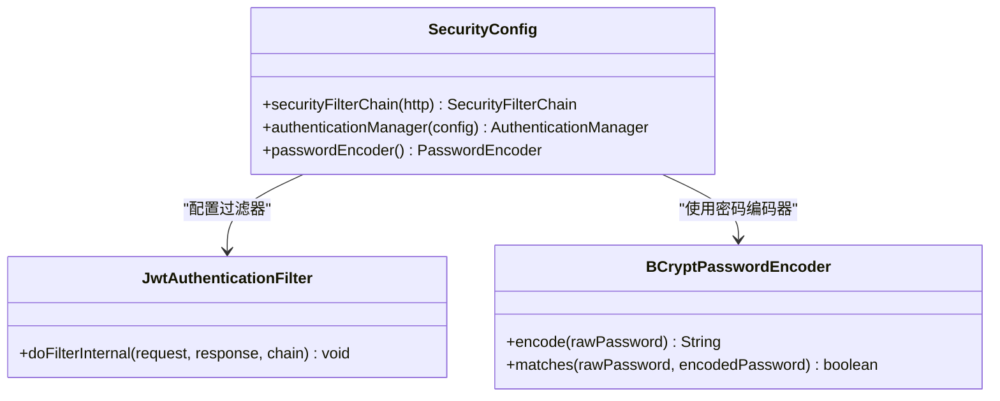
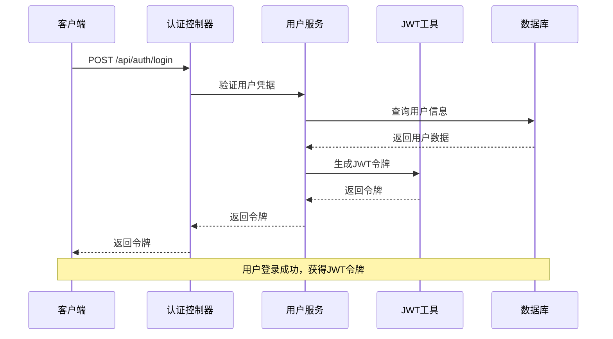
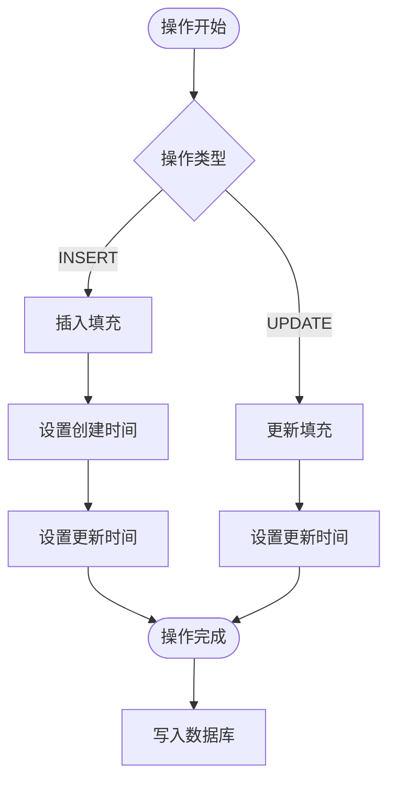
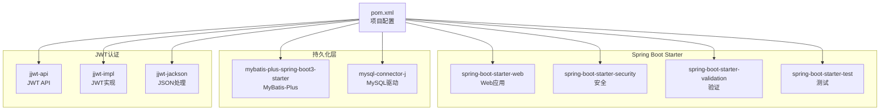

# 开发环境搭建

<cite>
**本文档引用的文件**
- [pom.xml](file://pom.xml)
- [application.yml](file://src/main/resources/application.yml)
- [init.sql](file://sql/init.sql)
- [README.md](file://README.md)
- [BookOrderApplication.java](file://src/main/java/com/bookorder/BookOrderApplication.java)
- [SecurityConfig.java](file://src/main/java/com/bookorder/config/SecurityConfig.java)
- [JwtUtil.java](file://src/main/java/com/bookorder/security/JwtUtil.java)
- [MyBatisPlusConfig.java](file://src/main/java/com/bookorder/config/MyBatisPlusConfig.java)
- [GlobalExceptionHandler.java](file://src/main/java/com/bookorder/common/GlobalExceptionHandler.java)
- [AuthController.java](file://src/main/java/com/bookorder/controller/AuthController.java)
- [UserDetailsServiceImpl.java](file://src/main/java/com/bookorder/security/UserDetailsServiceImpl.java)
- [SysUser.java](file://src/main/java/com/bookorder/entity/SysUser.java)
</cite>

## 目录
1. [简介](#简介)
2. [项目结构](#项目结构)
3. [核心组件](#核心组件)
4. [架构概览](#架构概览)
5. [详细组件分析](#详细组件分析)
6. [依赖分析](#依赖分析)
7. [性能考虑](#性能考虑)
8. [故障排除指南](#故障排除指南)
9. [结论](#结论)
10. [附录](#附录)

## 简介

图书订单管理系统是一个基于 Spring Boot 3 + Java 17 + Maven 构建的企业级应用，集成了 MyBatis-Plus、Spring Security 和 JWT，实现了 RBAC 权限管理。该系统提供了完整的用户认证授权功能，支持管理员、图书管理员和读者三种角色，每种角色具有不同的权限范围。

## 项目结构

该项目采用标准的 Maven 多模块结构，主要包含以下目录结构：



**图表来源**
- [BookOrderApplication.java:1-15](file://src/main/java/com/bookorder/BookOrderApplication.java#L1-L15)
- [pom.xml:1-95](file://pom.xml#L1-L95)

**章节来源**
- [README.md:128-168](file://README.md#L128-L168)
- [pom.xml:1-95](file://pom.xml#L1-L95)

## 核心组件

### 技术栈概述

系统采用现代化的技术栈构建，确保了良好的可维护性和扩展性：

| 组件 | 版本 | 用途 |
|------|------|------|
| Spring Boot | 3.2.5 | 应用框架 |
| Java | 17 | 开发语言 |
| MyBatis-Plus | 3.5.6 | ORM框架 |
| Spring Security | 6.x | 安全框架 |
| JWT (jjwt) | 0.12.5 | 令牌认证 |
| MySQL | 8.0+ | 数据库 |

### 核心配置文件

#### application.yml 配置详解

系统的核心配置集中在 application.yml 文件中，包含以下关键配置：

**服务器配置**
- 端口：8080
- 服务器基础配置

**数据库配置**
- JDBC URL：jdbc:mysql://localhost:3306/book_order?useUnicode=true&characterEncoding=utf-8&serverTimezone=Asia/Shanghai&allowPublicKeyRetrieval=true&useSSL=false
- 用户名：root
- 密码：root
- 驱动类：com.mysql.cj.jdbc.Driver

**数据库初始化配置**
- 初始化模式：always（每次启动都执行）
- 脚本位置：classpath:sql/init.sql

**MyBatis-Plus 配置**
- 下划线转驼峰：启用
- 日志输出：控制台
- ID策略：自增
- 逻辑删除字段：deleted
- 逻辑删除值：1
- 未删除值：0

**JWT 配置**
- 密钥：Y29tLmJvb2tvcmRlci5ib29rLW9yZGVyLXN5c3RlbS1qd3Qtc2VjcmV0LWtlYXktMjAyNA==（Base64编码）
- 过期时间：86400000毫秒（24小时）

**日志配置**
- 包级别：com.bookorder 设置为 debug 级别

**章节来源**
- [application.yml:1-33](file://src/main/resources/application.yml#L1-L33)

### 数据库初始化脚本

系统提供了完整的数据库初始化脚本，包含以下内容：

**数据库创建**
- 创建名为 book_order 的数据库
- 字符集：utf8mb4
- 排序规则：utf8mb4_unicode_ci

**表结构定义**
- sys_user：用户表
- sys_role：角色表  
- sys_permission：权限表
- sys_user_role：用户角色关联表
- sys_role_permission：角色权限关联表

**初始化数据**
- 角色：ADMIN（管理员）、LIBRARIAN（图书管理员）、READER（读者）
- 权限：系统管理、用户管理、图书管理、订单管理、角色管理等
- 默认管理员账号：admin/admin123
- 角色权限绑定关系

**章节来源**
- [init.sql:1-124](file://sql/init.sql#L1-L124)

## 架构概览

系统采用分层架构设计，遵循关注点分离原则：



**图表来源**
- [AuthController.java:1-59](file://src/main/java/com/bookorder/controller/AuthController.java#L1-L59)
- [UserDetailsServiceImpl.java:1-50](file://src/main/java/com/bookorder/security/UserDetailsServiceImpl.java#L1-L50)
- [JwtUtil.java:1-62](file://src/main/java/com/bookorder/security/JwtUtil.java#L1-L62)

## 详细组件分析

### 安全配置组件

#### SecurityConfig 分析

安全配置类实现了基于 JWT 的无状态认证机制：

**核心特性**
- CSRF 禁用（RESTful API 不需要 CSRF 保护）
- 会话状态：STATELESS（无状态会话）
- 认证路径：/api/auth/login 和 /api/auth/register 允许匿名访问
- 其他所有请求都需要认证

**异常处理**
- 未登录或 token 过期：返回 401 状态码
- 权限不足：返回 403 状态码
- 统一 JSON 格式响应

**密码加密**
- 使用 BCryptPasswordEncoder 进行密码加密



**图表来源**
- [SecurityConfig.java:23-74](file://src/main/java/com/bookorder/config/SecurityConfig.java#L23-L74)
- [JwtUtil.java:1-62](file://src/main/java/com/bookorder/security/JwtUtil.java#L1-L62)

**章节来源**
- [SecurityConfig.java:1-74](file://src/main/java/com/bookorder/config/SecurityConfig.java#L1-L74)

### JWT 认证组件

#### JwtUtil 分析

JWT 工具类提供了完整的令牌生成、解析和验证功能：

**令牌结构**
- Header：指定 HMAC SHA 签名算法
- Payload：包含用户标识、用户名、用户ID、签发时间、过期时间
- Signature：使用 Base64 编码的密钥进行签名

**核心方法**
- generateToken：生成新的 JWT 令牌
- parseToken：解析并验证令牌
- validateToken：验证令牌有效性
- extractUserId：从令牌中提取用户ID
- extractUsername：从令牌中提取用户名



**图表来源**
- [AuthController.java:28-32](file://src/main/java/com/bookorder/controller/AuthController.java#L28-L32)
- [JwtUtil.java:27-35](file://src/main/java/com/bookorder/security/JwtUtil.java#L27-L35)

**章节来源**
- [JwtUtil.java:1-62](file://src/main/java/com/bookorder/security/JwtUtil.java#L1-L62)

### 数据访问层组件

#### MyBatis-Plus 配置分析

MyBatis-Plus 配置实现了自动字段填充功能：

**自动填充字段**
- createTime：插入时自动设置当前时间
- updateTime：插入和更新时自动设置当前时间

**配置特点**
- 使用 MetaObjectHandler 接口实现
- 支持严格模式填充
- 自动处理 LocalDateTime 类型



**图表来源**
- [MyBatisPlusConfig.java:10-22](file://src/main/java/com/bookorder/config/MyBatisPlusConfig.java#L10-L22)

**章节来源**
- [MyBatisPlusConfig.java:1-23](file://src/main/java/com/bookorder/config/MyBatisPlusConfig.java#L1-L23)

### 异常处理组件

#### GlobalExceptionHandler 分析

全局异常处理器提供了统一的错误响应格式：

**异常类型处理**
- BusinessException：业务异常，返回自定义错误码和消息
- BadCredentialsException：认证失败，返回 401 状态码
- AccessDeniedException：权限不足，返回 403 状态码
- MethodArgumentNotValidException：参数验证失败，返回 400 状态码
- ConstraintViolationException：约束验证失败，返回 400 状态码
- Exception：系统内部异常，返回 500 状态码

**响应格式**
- 统一的 Result 包装格式
- 包含 code、message、data 字段
- 错误码与 HTTP 状态码对应

**章节来源**
- [GlobalExceptionHandler.java:1-62](file://src/main/java/com/bookorder/common/GlobalExceptionHandler.java#L1-L62)

## 依赖分析

### Maven 依赖关系

项目使用 Maven 管理依赖，核心依赖关系如下：



**图表来源**
- [pom.xml:26-84](file://pom.xml#L26-L84)

### 版本兼容性

系统版本配置确保了各组件之间的兼容性：

- Java 17：满足 Spring Boot 3.x 要求
- Spring Boot 3.2.5：提供最新的框架特性
- MyBatis-Plus 3.5.6：增强的数据访问能力
- Spring Security 6.x：最新的安全框架
- JWT 0.12.5：可靠的令牌认证方案

**章节来源**
- [pom.xml:20-24](file://pom.xml#L20-L24)

## 性能考虑

### 数据库性能优化

**索引策略**
- 用户名字段设置唯一索引，确保查询效率
- 用户角色关联表设置复合唯一索引，防止重复绑定
- 角色权限关联表设置复合唯一索引，确保权限唯一性

**连接池配置**
- 使用 Spring Boot 默认的 HikariCP 连接池
- 合理配置最大连接数和超时时间

**查询优化**
- 使用 MyBatis-Plus 的条件构造器进行高效查询
- 避免 N+1 查询问题，使用关联查询一次性获取所需数据

### 缓存策略

**JWT 令牌缓存**
- 令牌在内存中验证，避免频繁的数据库查询
- 合理设置令牌过期时间，平衡安全性与性能

**静态资源缓存**
- 静态资源使用浏览器缓存机制
- API 响应头设置适当的缓存策略

## 故障排除指南

### 环境配置问题

**JDK 17 安装问题**
- 确认 JAVA_HOME 环境变量正确设置
- 验证 java -version 输出为 17.x
- 检查 PATH 中 JDK bin 目录的位置

**Maven 配置问题**
- 确认 MAVEN_HOME 环境变量设置
- 验证 mvn -version 输出正确版本
- 检查本地仓库配置和网络代理设置

**MySQL 连接问题**
- 确认 MySQL 服务正在运行
- 验证数据库连接字符串中的主机名、端口、数据库名
- 检查用户名和密码是否正确
- 确认 MySQL 8.0+ 兼容性

### 应用启动问题

**端口占用**
- 默认端口 8080 被其他程序占用
- 解决方案：修改 application.yml 中的 server.port
- 或者停止占用端口的进程

**数据库初始化失败**
- 检查数据库连接配置
- 确认数据库用户具有创建数据库权限
- 验证 SQL 脚本语法正确性

**JWT 密钥问题**
- 确认 application.yml 中的 jwt.secret 配置
- 验证 Base64 编码的密钥格式正确
- 检查密钥长度是否符合要求

### 常见错误诊断

**启动时数据库连接错误**
```bash
# 检查数据库连接
mysql -h localhost -P 3306 -u root -p

# 查看应用日志
tail -f target/classes/application.yml
```

**权限验证失败**
- 检查用户角色权限绑定是否正确
- 验证 JWT 令牌生成和解析过程
- 确认用户状态为正常状态

**API 调用失败**
- 使用 curl 测试 API 接口
- 检查请求头中的 Authorization 头
- 验证请求参数格式和内容

**章节来源**
- [application.yml:1-33](file://src/main/resources/application.yml#L1-L33)
- [SecurityConfig.java:44-58](file://src/main/java/com/bookorder/config/SecurityConfig.java#L44-L58)

## 结论

本开发环境搭建指南涵盖了图书订单管理系统所需的全部技术栈配置。通过遵循本文档的步骤，开发者可以快速搭建起完整的开发环境，并成功运行项目。

系统的主要优势包括：
- 现代化的技术栈选择，确保长期维护性
- 完善的 RBAC 权限管理体系
- 基于 JWT 的无状态认证机制
- 统一的异常处理和响应格式
- 自动化的数据库初始化脚本

建议在实际开发中：
- 根据生产环境需求调整 JWT 密钥和过期时间
- 配置合适的日志级别和监控指标
- 实施数据库备份和恢复策略
- 建立完善的测试覆盖体系

## 附录

### 开发工具推荐

**IDE 推荐配置**

**IntelliJ IDEA**
- Java 17 SDK 配置
- Maven 项目自动导入
- Lombok 插件安装
- MyBatis Log 插件
- YAML 配置文件高亮

**Eclipse**
- Java 17 项目配置
- Maven 项目导入
- MyBatis 插件安装
- Spring Boot 工具集成

**Maven 配置**
- 本地仓库设置
- 私有仓库配置
- 代理设置（如需要）

### 数据库管理工具

**推荐工具**
- MySQL Workbench：图形化数据库管理
- DBeaver：跨平台数据库工具
- Navicat：专业的数据库管理工具

**常用命令**
```sql
-- 查看数据库状态
SHOW DATABASES;

-- 切换数据库
USE book_order;

-- 查看表结构
DESCRIBE sys_user;

-- 查看初始化数据
SELECT * FROM sys_user WHERE id = 1;
```

### API 测试工具

**推荐工具**
- Postman：API 测试和文档
- Insomnia：现代 API 客户端
- curl：命令行测试工具

**测试流程**
1. 启动应用：mvn spring-boot:run
2. 访问：http://localhost:8080
3. 测试登录接口
4. 验证用户信息接口
5. 测试权限控制