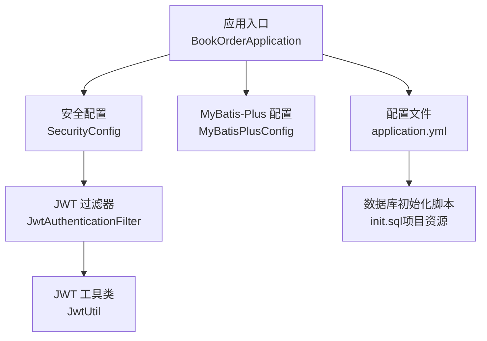
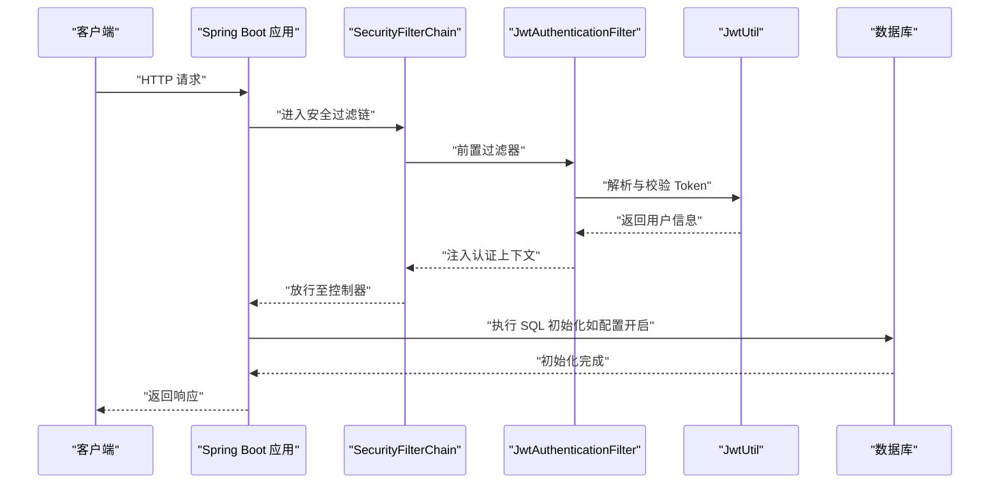
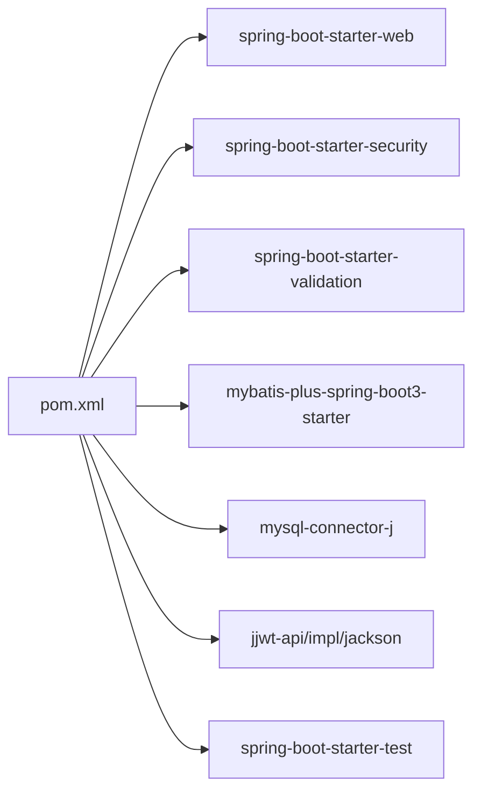

# 构建与部署

<cite>
**本文引用的文件**
- [pom.xml](file://pom.xml)
- [application.yml](file://src/main/resources/application.yml)
- [README.md](file://README.md)
- [BookOrderApplication.java](file://src/main/java/com/bookorder/BookOrderApplication.java)
- [SecurityConfig.java](file://src/main/java/com/bookorder/config/SecurityConfig.java)
- [MyBatisPlusConfig.java](file://src/main/java/com/bookorder/config/MyBatisPlusConfig.java)
- [JwtUtil.java](file://src/main/java/com/bookorder/security/JwtUtil.java)
- [JwtAuthenticationFilter.java](file://src/main/java/com/bookorder/security/JwtAuthenticationFilter.java)
- [init.sql（项目资源）](file://src/main/resources/sql/init.sql)
- [.gitignore](file://.gitignore)
</cite>

## 目录
1. [简介](#简介)
2. [项目结构](#项目结构)
3. [核心组件](#核心组件)
4. [架构总览](#架构总览)
5. [详细组件分析](#详细组件分析)
6. [依赖分析](#依赖分析)
7. [性能考虑](#性能考虑)
8. [故障排查指南](#故障排查指南)
9. [结论](#结论)
10. [附录](#附录)

## 简介
本项目是一个基于 Spring Boot 3 + Java 17 的图书订单系统，采用 Maven 构建，集成了 MyBatis-Plus、Spring Security 和 JWT，实现 RBAC 权限控制。本文档提供从本地构建、打包、多环境配置、Docker 容器化到 CI/CD 自动化部署的完整指导，并给出部署后验证与故障排查建议。

## 项目结构
- 使用 Spring Boot 起步依赖，主程序入口位于应用根包下，扫描 Mapper 包路径以启用 MyBatis-Plus。
- 配置集中在 application.yml 中，包含服务器端口、数据库连接、SQL 初始化、MyBatis-Plus 参数、JWT 密钥与过期时间以及日志级别。
- 安全模块通过自定义过滤器链启用无状态认证，使用 JWT 校验与授权。
- 提供两套初始化 SQL：一套用于手动建库与导入，另一套由 Spring Boot 在启动时按配置自动执行。

图表来源
- [BookOrderApplication.java:1-15](file://src/main/java/com/bookorder/BookOrderApplication.java#L1-L15)
- [SecurityConfig.java:1-74](file://src/main/java/com/bookorder/config/SecurityConfig.java#L1-L74)
- [MyBatisPlusConfig.java:1-23](file://src/main/java/com/bookorder/config/MyBatisPlusConfig.java#L1-L23)
- [JwtAuthenticationFilter.java:1-32](file://src/main/java/com/bookorder/security/JwtAuthenticationFilter.java#L1-L32)
- [JwtUtil.java:1-61](file://src/main/java/com/bookorder/security/JwtUtil.java#L1-L61)
- [application.yml:1-33](file://src/main/resources/application.yml#L1-L33)
- [init.sql（项目资源）:1-121](file://src/main/resources/sql/init.sql#L1-L121)

章节来源
- [BookOrderApplication.java:1-15](file://src/main/java/com/bookorder/BookOrderApplication.java#L1-L15)
- [application.yml:1-33](file://src/main/resources/application.yml#L1-L33)
- [README.md:128-168](file://README.md#L128-L168)

## 核心组件
- 应用入口与包扫描：应用启动类负责引导 Spring Boot 并扫描 Mapper 包，确保 MyBatis-Plus 正常工作。
- 安全配置：禁用 CSRF，设置会话为无状态，开放登录与注册接口，其余请求需鉴权；统一处理未登录与权限不足的异常输出。
- MyBatis-Plus 配置：自动填充创建与更新时间字段，支持逻辑删除与下划线转驼峰映射。
- JWT：工具类负责生成、解析与校验令牌，配合过滤器在每次请求中解析并注入认证上下文。
- 配置中心：application.yml 提供数据库、SQL 初始化、MyBatis-Plus、JWT 与日志等关键参数。

章节来源
- [BookOrderApplication.java:1-15](file://src/main/java/com/bookorder/BookOrderApplication.java#L1-L15)
- [SecurityConfig.java:1-74](file://src/main/java/com/bookorder/config/SecurityConfig.java#L1-L74)
- [MyBatisPlusConfig.java:1-23](file://src/main/java/com/bookorder/config/MyBatisPlusConfig.java#L1-L23)
- [JwtUtil.java:1-61](file://src/main/java/com/bookorder/security/JwtUtil.java#L1-L61)
- [application.yml:1-33](file://src/main/resources/application.yml#L1-L33)

## 架构总览
下图展示应用启动与请求处理的关键流程，包括安全过滤链、JWT 解析与数据库初始化。

图表来源
- [SecurityConfig.java:34-62](file://src/main/java/com/bookorder/config/SecurityConfig.java#L34-L62)
- [JwtAuthenticationFilter.java:28-32](file://src/main/java/com/bookorder/security/JwtAuthenticationFilter.java#L28-L32)
- [JwtUtil.java:27-43](file://src/main/java/com/bookorder/security/JwtUtil.java#L27-L43)
- [application.yml:10-13](file://src/main/resources/application.yml#L10-L13)

## 详细组件分析

### 构建与打包策略
- 使用 Maven 构建，Spring Boot Maven 插件已内置，可直接生成可执行 jar。
- 项目未声明打包类型，默认继承 Spring Boot 父 POM 的默认打包方式（jar），无需额外配置即可生成可执行 jar。
- 若需生成 war 包，请在 POM 中显式设置 packaging 为 war，并确保嵌入式 servlet 容器的 scope 为 provided。由于当前仓库未包含 web 容器依赖，如需 war 包，需补充相应容器依赖并在 POM 中声明 packaging。

章节来源
- [pom.xml:86-94](file://pom.xml#L86-L94)
- [pom.xml:14-18](file://pom.xml#L14-L18)

### 多环境配置与切换
- 开发、测试、生产环境的配置可通过 Spring Profile 切换与外部化配置实现：
  - Profile 切换：在 application.yml 中添加 profiles 激活与分环境配置文件（例如 application-dev.yml、application-prod.yml），通过 JVM 参数或环境变量激活对应 profile。
  - 外部化配置：将敏感信息与环境差异项移出仓库，使用环境变量或配置中心覆盖 application.yml 中的值。
  - 数据库与日志：将数据库连接、JWT 密钥、日志级别等放入外部配置，避免硬编码。
- 项目当前配置要点：
  - server.port、spring.datasource.*、mybatis-plus.*、jwt.*、logging.level.* 均可外部化覆盖。
  - SQL 初始化模式与脚本位置可在 application.yml 中调整，便于不同环境复用。

章节来源
- [application.yml:1-33](file://src/main/resources/application.yml#L1-L33)
- [README.md:30-48](file://README.md#L30-L48)

### Docker 容器化部署
- 基础镜像选择：使用官方 OpenJDK 17 运行时镜像作为基础镜像，保证与项目 Java 版本一致。
- 构建产物：将 Maven 构建生成的可执行 jar 放入镜像内，设置 JAVA_OPTS 与 JRE 内存参数。
- 启动命令：通过 ENTRYPOINT 或 CMD 启动 Spring Boot 应用，暴露容器端口并与宿主机映射。
- 数据持久化：将数据库置于独立容器或外部实例，应用容器不存储持久数据。
- 健康检查：在容器编排中加入 HTTP 健康检查，探测应用健康状态。
- 日志采集：将容器标准输出接入日志系统，或挂载日志目录到宿主机。

说明：以上为通用容器化实践建议，具体镜像与编排文件需结合实际环境另行编写。

### CI/CD 流水线与自动化部署
- 触发条件：代码推送至分支（如 main/master）、打标签或 Pull Request 合并。
- 构建阶段：拉取源码 → 安装依赖 → 单元测试 → Maven 构建 → 产出可执行 jar。
- 安全扫描：在流水线中集成静态代码分析与依赖漏洞扫描。
- 镜像构建与推送：将可执行 jar 打包进容器镜像，推送到镜像仓库。
- 部署阶段：根据目标环境（测试/预发布/生产）进行蓝绿/滚动发布，执行数据库迁移（如需要）。
- 回滚策略：记录版本号与镜像标签，失败时快速回滚至上一个稳定版本。
- 监控与告警：结合部署后的健康检查与日志指标，触发告警。

说明：以上为通用 CI/CD 最佳实践，具体流水线脚本与平台配置需结合团队工具链实现。

### 监控与日志收集
- 应用日志：通过 application.yml 设置日志级别与输出位置，建议在容器环境中统一输出到 stdout/stderr，交由日志系统集中采集。
- 指标与链路追踪：可引入 Actuator 暴露健康与指标端点，结合 Prometheus/Grafana 与链路追踪系统（如 Jaeger/Zipkin）进行观测。
- 健康检查：对外暴露健康端点，供负载均衡与编排系统进行存活/就绪探针。

章节来源
- [application.yml:30-33](file://src/main/resources/application.yml#L30-L33)
- [pom.xml:26-84](file://pom.xml#L26-L84)

### 部署后验证与故障排查
- 基础连通性：确认容器端口映射正确，服务可被外部访问；检查防火墙与安全组规则。
- 数据库初始化：若开启 SQL 初始化，确认数据库已存在且具备写权限；核对初始化脚本与表结构是否一致。
- 认证与授权：使用登录接口获取 token，携带 Authorization 请求受保护接口，验证权限链路是否生效。
- 日志定位：查看应用日志与数据库日志，关注启动阶段的初始化错误与运行期异常堆栈。
- 性能问题：检查 GC 日志、慢查询与并发瓶颈，必要时调整 JVM 参数与数据库连接池配置。

章节来源
- [application.yml:10-13](file://src/main/resources/application.yml#L10-L13)
- [SecurityConfig.java:34-62](file://src/main/java/com/bookorder/config/SecurityConfig.java#L34-L62)
- [JwtUtil.java:45-52](file://src/main/java/com/bookorder/security/JwtUtil.java#L45-L52)
- [.gitignore:38-40](file://.gitignore#L38-L40)

## 依赖分析
- Spring Boot 3.2.5：提供 Web、Security、Validation、Test 等起步依赖。
- MyBatis-Plus 3.5.6：简化数据库操作与逻辑删除、自动填充等功能。
- MySQL Connector/J：数据库驱动，运行时生效。
- jjwt 0.12.5：JWT 工具链，包含 api、impl、jackson 三部分。
- 项目未包含嵌入式容器依赖，因此默认生成可执行 jar；如需 war 包，需在 POM 中声明 packaging 为 war 并将容器依赖 scope 设为 provided。

图表来源
- [pom.xml:26-84](file://pom.xml#L26-L84)

章节来源
- [pom.xml:26-84](file://pom.xml#L26-L84)

## 性能考虑
- JVM 参数：合理设置堆大小、GC 策略与线程数，结合容器内存限制进行调优。
- 数据库连接池：根据并发量与数据库承载能力配置连接池大小与超时参数。
- SQL 优化：利用 MyBatis-Plus 的逻辑删除与自动填充减少冗余字段，避免 N+1 查询。
- 缓存策略：对热点数据与权限信息引入缓存，降低数据库压力。
- 日志级别：生产环境建议提升日志级别，减少 IO 压力。

## 故障排查指南
- 启动失败：检查 application.yml 中数据库连接、JWT 密钥与日志级别；确认数据库已创建并具备初始化权限。
- 认证失败：核对 JWT 密钥是否一致、过期时间是否合理；检查过滤器链是否正确注入。
- 权限不足：确认用户角色与权限映射是否正确，控制器方法上的权限注解是否生效。
- 初始化异常：确认 SQL 初始化模式与脚本路径；检查脚本语法与字符集设置。
- 日志缺失：确认容器日志输出配置，检查日志文件是否被挂载或清理。

章节来源
- [application.yml:4-28](file://src/main/resources/application.yml#L4-L28)
- [SecurityConfig.java:34-62](file://src/main/java/com/bookorder/config/SecurityConfig.java#L34-L62)
- [JwtUtil.java:16-20](file://src/main/java/com/bookorder/security/JwtUtil.java#L16-L20)
- [init.sql（项目资源）:1-121](file://src/main/resources/sql/init.sql#L1-L121)

## 结论
本项目以 Spring Boot 为基础，结合 MyBatis-Plus 与 JWT 实现了清晰的权限体系与简洁的构建流程。通过 Profile 与外部化配置可灵活适配多环境；默认可执行 jar 适合容器化部署；结合 CI/CD 与监控日志体系，可实现高效、稳定的自动化交付与运维。

## 附录

### Maven 构建命令与参数
- 本地启动（开发调试）
  - 使用 Spring Boot Maven 插件启动：mvn spring-boot:run
- 清理与打包
  - 清理构建产物：mvn clean
  - 单元测试：mvn test
  - 生成可执行 jar：mvn package
- 构建参数（示例）
  - 指定 Profile：-Dspring.profiles.active=prod
  - 指定配置文件：-Dspring.config.location=classpath:/,file:./config/
  - 指定日志级别：-Dlogging.level.com.bookorder=debug

章节来源
- [README.md:44-46](file://README.md#L44-L46)
- [pom.xml:86-94](file://pom.xml#L86-L94)

### 打包策略（可执行 jar 与 war）
- 可执行 jar：默认生成，无需额外配置；适合容器化部署。
- war 包：需在 POM 中设置 packaging 为 war，并将嵌入式容器依赖 scope 设为 provided；同时确保 web 容器依赖存在。

章节来源
- [pom.xml:14-18](file://pom.xml#L14-L18)
- [pom.xml:86-94](file://pom.xml#L86-L94)

### 环境配置管理与切换
- 使用 Profile 文件与外部化配置，将数据库、JWT、日志等参数分离。
- 在容器或编排系统中通过环境变量注入敏感参数，避免提交到版本库。

章节来源
- [application.yml:1-33](file://src/main/resources/application.yml#L1-L33)
- [README.md:30-48](file://README.md#L30-L48)

### Docker 部署要点
- 基础镜像：OpenJDK 17 运行时
- 构建产物：将可执行 jar 放入镜像，设置 JAVA_OPTS
- 启动命令：ENTRYPOINT/CMD 启动 Spring Boot 应用
- 健康检查：HTTP 探针
- 日志采集：stdout/stderr 统一输出

说明：以上为通用实践，具体镜像与编排文件需另行编写。

### CI/CD 流水线建议
- 触发：分支推送、标签创建
- 步骤：安装依赖 → 单测 → 构建 → 扫描 → 构建镜像 → 推送 → 发布 → 健康检查
- 回滚：版本标签与镜像回滚

说明：以上为通用建议，具体流水线脚本需结合团队工具链实现。

### 监控与日志
- 日志：application.yml 控制日志级别与输出
- 指标：引入 Actuator 暴露健康与指标端点
- 链路追踪：结合 Prometheus/Grafana 与链路追踪系统

章节来源
- [application.yml:30-33](file://src/main/resources/application.yml#L30-L33)
- [pom.xml:26-84](file://pom.xml#L26-L84)