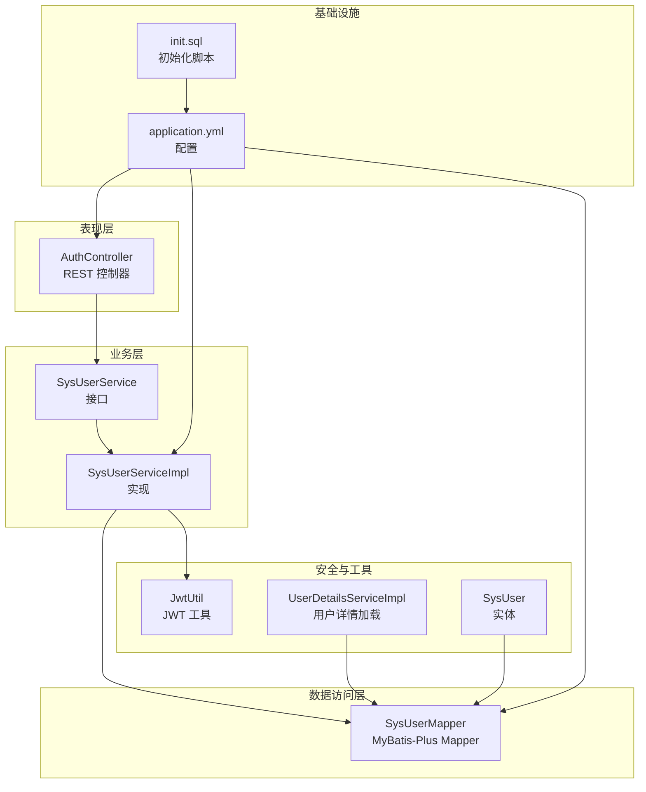
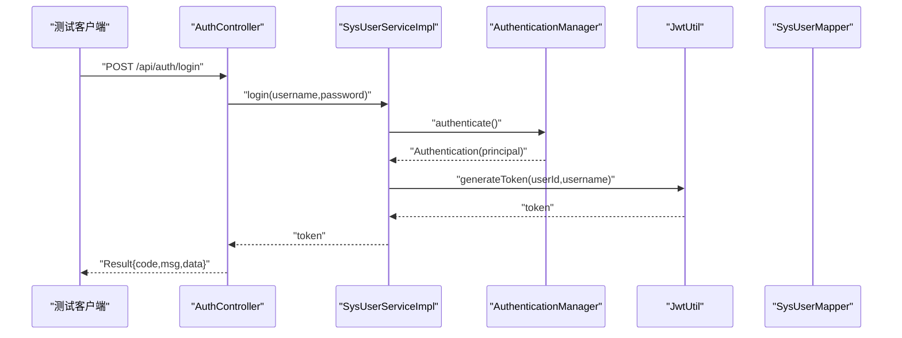
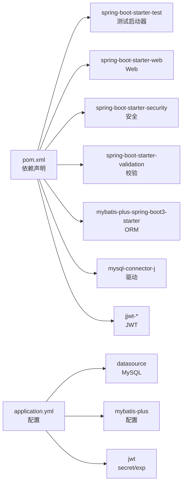

# 测试策略与实践

<cite>
**本文引用的文件**
- [pom.xml](file://pom.xml)
- [application.yml](file://src/main/resources/application.yml)
- [init.sql](file://sql/init.sql)
- [AuthController.java](file://src/main/java/com/bookorder/controller/AuthController.java)
- [SysUserService.java](file://src/main/java/com/bookorder/service/SysUserService.java)
- [SysUserServiceImpl.java](file://src/main/java/com/bookorder/service/impl/SysUserServiceImpl.java)
- [SysUserMapper.java](file://src/main/java/com/bookorder/mapper/SysUserMapper.java)
- [JwtUtil.java](file://src/main/java/com/bookorder/security/JwtUtil.java)
- [UserDetailsServiceImpl.java](file://src/main/java/com/bookorder/security/UserDetailsServiceImpl.java)
- [GlobalExceptionHandler.java](file://src/main/java/com/bookorder/common/GlobalExceptionHandler.java)
- [SysUser.java](file://src/main/java/com/bookorder/entity/SysUser.java)
- [LoginRequest.java](file://src/main/java/com/bookorder/dto/LoginRequest.java)
- [RegisterRequest.java](file://src/main/java/com/bookorder/dto/RegisterRequest.java)
</cite>

## 目录
1. 引言
2. 项目结构
3. 核心组件
4. 架构总览
5. 详细组件分析
6. 依赖分析
7. 性能考虑
8. 故障排查指南
9. 结论
10. 附录

## 引言
本文件面向图书订单系统（RBAC）的测试策略与实践，围绕单元测试、集成测试与端到端测试给出可落地的方法论与最佳实践；重点覆盖：
- 使用 JUnit 5 的测试组织与断言规范
- 使用 Mockito 进行依赖模拟与测试隔离
- 控制器层、服务层、数据访问层的测试策略与示例路径
- 数据库测试的初始化、事务回滚与隔离策略
- 测试覆盖率要求与报告生成建议
- 性能与压力测试的入门指导

## 项目结构
该工程采用 Spring Boot 3 + MyBatis-Plus 的分层架构：controller 负责 HTTP 接口，service 提供业务逻辑，mapper 基于 MyBatis-Plus 访问数据库，security 提供认证与授权支持，common 提供统一响应与全局异常处理。

图示来源
- [AuthController.java:1-59](file://src/main/java/com/bookorder/controller/AuthController.java#L1-L59)
- [SysUserService.java:1-16](file://src/main/java/com/bookorder/service/SysUserService.java#L1-L16)
- [SysUserServiceImpl.java:1-87](file://src/main/java/com/bookorder/service/impl/SysUserServiceImpl.java#L1-L87)
- [SysUserMapper.java:1-25](file://src/main/java/com/bookorder/mapper/SysUserMapper.java#L1-L25)
- [JwtUtil.java:1-62](file://src/main/java/com/bookorder/security/JwtUtil.java#L1-L62)
- [UserDetailsServiceImpl.java:1-50](file://src/main/java/com/bookorder/security/UserDetailsServiceImpl.java#L1-L50)
- [SysUser.java:1-48](file://src/main/java/com/bookorder/entity/SysUser.java#L1-L48)
- [application.yml:1-33](file://src/main/resources/application.yml#L1-L33)
- [init.sql:1-124](file://sql/init.sql#L1-L124)

章节来源
- [pom.xml:1-95](file://pom.xml#L1-L95)
- [application.yml:1-33](file://src/main/resources/application.yml#L1-L33)

## 核心组件
- 控制器层：负责接收请求、参数校验、调用服务层并返回统一结果包装。
- 服务层：封装业务规则、事务控制、与安全组件协作。
- 数据访问层：基于 MyBatis-Plus 的通用 Mapper，提供查询与关联角色/权限的能力。
- 安全模块：JWT 工具用于签发与解析令牌；UserDetailsServiceImpl 实现 Spring Security 的用户加载逻辑。
- 全局异常处理：统一捕获业务异常、参数校验异常与系统异常，返回标准化响应。

章节来源
- [AuthController.java:1-59](file://src/main/java/com/bookorder/controller/AuthController.java#L1-L59)
- [SysUserService.java:1-16](file://src/main/java/com/bookorder/service/SysUserService.java#L1-L16)
- [SysUserServiceImpl.java:1-87](file://src/main/java/com/bookorder/service/impl/SysUserServiceImpl.java#L1-L87)
- [SysUserMapper.java:1-25](file://src/main/java/com/bookorder/mapper/SysUserMapper.java#L1-L25)
- [JwtUtil.java:1-62](file://src/main/java/com/bookorder/security/JwtUtil.java#L1-L62)
- [UserDetailsServiceImpl.java:1-50](file://src/main/java/com/bookorder/security/UserDetailsServiceImpl.java#L1-L50)
- [GlobalExceptionHandler.java:1-62](file://src/main/java/com/bookorder/common/GlobalExceptionHandler.java#L1-L62)

## 架构总览
下图展示登录流程在测试中的关键交互点，便于设计单元测试与集成测试：

图示来源
- [AuthController.java:28-32](file://src/main/java/com/bookorder/controller/AuthController.java#L28-L32)
- [SysUserServiceImpl.java:50-55](file://src/main/java/com/bookorder/service/impl/SysUserServiceImpl.java#L50-L55)
- [JwtUtil.java:27-35](file://src/main/java/com/bookorder/security/JwtUtil.java#L27-L35)
- [SysUserMapper.java:1-25](file://src/main/java/com/bookorder/mapper/SysUserMapper.java#L1-L25)

## 详细组件分析

### 控制器层测试策略
- 目标：验证请求参数校验、鉴权注解、控制器返回值与状态码。
- 关键点：
  - 登录接口：校验用户名/密码非空；返回 Result 成功；可结合 Mock Service 返回 token。
  - 注册接口：校验用户名/密码长度；返回 Result 成功；可结合 Mock Service 验证调用。
  - 个人信息接口：使用 @AuthenticationPrincipal 注入用户详情；需模拟 SecurityContext 或 JWT 解析。
- 示例路径参考：
  - [AuthController.java:28-38](file://src/main/java/com/bookorder/controller/AuthController.java#L28-L38)
  - [AuthController.java:40-57](file://src/main/java/com/bookorder/controller/AuthController.java#L40-L57)

章节来源
- [AuthController.java:1-59](file://src/main/java/com/bookorder/controller/AuthController.java#L1-L59)

### 服务层测试策略
- 目标：验证业务规则、事务边界、异常分支与外部依赖行为。
- 关键点：
  - 登录流程：认证失败抛出凭证异常；认证成功生成 JWT。
  - 注册流程：用户名重复抛出业务异常；密码加密；默认绑定 READER 角色；事务回滚策略。
  - 用户信息查询：直接通过 Mapper 查询用户。
- 示例路径参考：
  - [SysUserService.java:8-15](file://src/main/java/com/bookorder/service/SysUserService.java#L8-L15)
  - [SysUserServiceImpl.java:50-55](file://src/main/java/com/bookorder/service/impl/SysUserServiceImpl.java#L50-L55)
  - [SysUserServiceImpl.java:58-80](file://src/main/java/com/bookorder/service/impl/SysUserServiceImpl.java#L58-L80)
  - [SysUserServiceImpl.java:82-85](file://src/main/java/com/bookorder/service/impl/SysUserServiceImpl.java#L82-L85)

章节来源
- [SysUserService.java:1-16](file://src/main/java/com/bookorder/service/SysUserService.java#L1-L16)
- [SysUserServiceImpl.java:1-87](file://src/main/java/com/bookorder/service/impl/SysUserServiceImpl.java#L1-L87)

### 数据访问层测试策略
- 目标：验证查询逻辑、关联角色/权限查询、逻辑删除字段。
- 关键点：
  - 用户查询：基于用户名唯一性查询。
  - 角色/权限查询：通过用户 ID 查询角色编码与权限编码集合。
  - 逻辑删除：MyBatis-Plus 配置了逻辑删除字段，测试应关注未删除记录。
- 示例路径参考：
  - [SysUserMapper.java:14-23](file://src/main/java/com/bookorder/mapper/SysUserMapper.java#L14-L23)
  - [SysUser.java:18-19](file://src/main/java/com/bookorder/entity/SysUser.java#L18-L19)
  - [application.yml:20-24](file://src/main/resources/application.yml#L20-L24)

章节来源
- [SysUserMapper.java:1-25](file://src/main/java/com/bookorder/mapper/SysUserMapper.java#L1-L25)
- [SysUser.java:1-48](file://src/main/java/com/bookorder/entity/SysUser.java#L1-L48)
- [application.yml:15-25](file://src/main/resources/application.yml#L15-L25)

### 安全与异常处理测试策略
- 目标：验证 JWT 签发与校验、用户详情加载、全局异常映射。
- 关键点：
  - JWT 工具：签发、解析、过期判断、从令牌提取用户信息。
  - 用户详情加载：根据用户名加载用户、装配角色与权限、状态校验。
  - 全局异常：业务异常、凭证错误、权限不足、参数校验异常、系统异常。
- 示例路径参考：
  - [JwtUtil.java:27-56](file://src/main/java/com/bookorder/security/JwtUtil.java#L27-L56)
  - [UserDetailsServiceImpl.java:24-48](file://src/main/java/com/bookorder/security/UserDetailsServiceImpl.java#L24-L48)
  - [GlobalExceptionHandler.java:22-60](file://src/main/java/com/bookorder/common/GlobalExceptionHandler.java#L22-L60)

章节来源
- [JwtUtil.java:1-62](file://src/main/java/com/bookorder/security/JwtUtil.java#L1-L62)
- [UserDetailsServiceImpl.java:1-50](file://src/main/java/com/bookorder/security/UserDetailsServiceImpl.java#L1-L50)
- [GlobalExceptionHandler.java:1-62](file://src/main/java/com/bookorder/common/GlobalExceptionHandler.java#L1-L62)

## 依赖分析
- 测试依赖：Spring Boot Starter Test 已在 POM 中声明，可用于单元测试与集成测试。
- 数据源与初始化：application.yml 配置了 MySQL 数据源与 SQL 初始化脚本位置。
- MyBatis-Plus：启用下划线转驼峰、日志输出、逻辑删除字段等配置。
- JWT：配置了密钥与过期时间，用于控制器与服务层的令牌生成与校验。

图示来源
- [pom.xml:26-83](file://pom.xml#L26-L83)
- [application.yml:4-28](file://src/main/resources/application.yml#L4-L28)

章节来源
- [pom.xml:1-95](file://pom.xml#L1-L95)
- [application.yml:1-33](file://src/main/resources/application.yml#L1-L33)

## 性能考虑
- 单元测试：优先使用内存数据库或嵌入式数据库（如 H2），避免真实数据库 IO；对热点方法进行基准测试（Benchmark）以识别瓶颈。
- 集成测试：使用事务回滚策略减少写操作对后续测试的影响；批量插入与查询时注意索引与分页。
- 端到端测试：使用容器化数据库（如 Docker）确保环境一致性；限制并发与请求频率，避免对数据库造成过大压力。
- 压力测试：可借助 JMeter 或 Gatling 对登录、注册等关键接口施压，观察响应时间与错误率。

## 故障排查指南
- 参数校验失败：检查 DTO 字段注解与消息提示是否正确；在控制器层使用 MethodArgumentNotValidException 的全局处理。
- 凭证错误：确认 AuthenticationManager 的认证流程与密码编码器配置；必要时在测试中注入假用户详情。
- 权限不足：核对用户角色与权限映射是否正确；检查 UserDetailsServiceImpl 的权限装配逻辑。
- 数据库异常：确认初始化脚本是否执行；检查逻辑删除字段与查询条件；在测试中使用事务回滚避免脏数据。
- JWT 校验失败：核对密钥与过期时间配置；在测试中构造合法令牌或模拟解析失败场景。

章节来源
- [GlobalExceptionHandler.java:40-53](file://src/main/java/com/bookorder/common/GlobalExceptionHandler.java#L40-L53)
- [UserDetailsServiceImpl.java:24-48](file://src/main/java/com/bookorder/security/UserDetailsServiceImpl.java#L24-L48)
- [JwtUtil.java:45-52](file://src/main/java/com/bookorder/security/JwtUtil.java#L45-L52)
- [application.yml:26-28](file://src/main/resources/application.yml#L26-L28)

## 结论
本测试策略以分层清晰的代码结构为基础，结合 JUnit 5 与 Mockito 实现高内聚低耦合的测试方案。通过控制器层的输入输出验证、服务层的业务规则与异常分支覆盖、数据访问层的查询与逻辑删除验证，以及安全与异常处理的专项测试，能够有效保障系统质量。配合数据库初始化与事务回滚策略，可实现稳定可靠的集成与端到端测试。最后，建议持续引入覆盖率指标与性能测试，形成闭环的质量保障体系。

## 附录

### JUnit 5 与 Mockito 使用要点
- 测试组织：使用 @Test、@BeforeEach、@AfterEach、@ExtendWith(MockitoExtension.class) 等注解。
- 断言规范：优先使用 assertEquals、assertTrue、assertThat 等明确语义的断言。
- 依赖模拟：使用 @Mock/@InjectMocks 模拟 Service/Mapper；使用 @Spy/@Captor 处理复杂场景。
- 参数校验：对 DTO 使用 @Valid 并在测试中构造非法参数触发校验异常。

### 数据库测试配置与回滚策略
- 初始化：通过 application.yml 的 SQL 初始化脚本加载基础数据。
- 回滚：在测试类上使用 @Transactional 与 @Rollback(true)，或在方法上使用 @Commit/@Rollback 控制。
- 隔离：每个测试独立事务，避免共享状态；必要时使用 @DirtiesContext 清理上下文。
- 示例路径参考：
  - [application.yml:10-13](file://src/main/resources/application.yml#L10-L13)
  - [init.sql:1-124](file://sql/init.sql#L1-L124)

章节来源
- [application.yml:10-13](file://src/main/resources/application.yml#L10-L13)
- [init.sql:1-124](file://sql/init.sql#L1-L124)

### 测试覆盖率与报告生成
- 覆盖率目标：核心业务（服务层）建议达到 80%+；控制器层 70%+；数据访问层 60%+。
- 报告生成：使用 JaCoCo 插件在 Maven 构建后生成 HTML 报告；在 CI 中设置阈值门禁。

### 性能与压力测试基本指导
- 单元性能：针对热点方法进行微基准测试，定位性能瓶颈。
- 集成性能：对关键接口（登录/注册）进行吞吐量与延迟测试。
- 压力测试：逐步提升并发与请求速率，观察错误率与响应时间拐点。