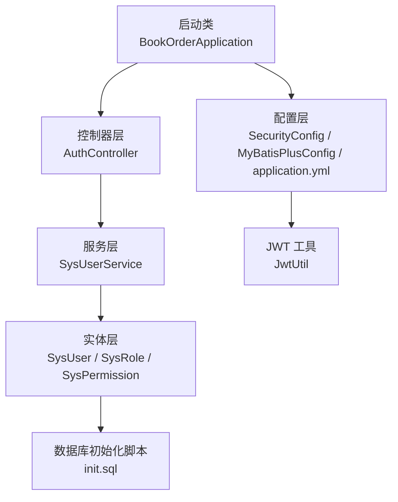
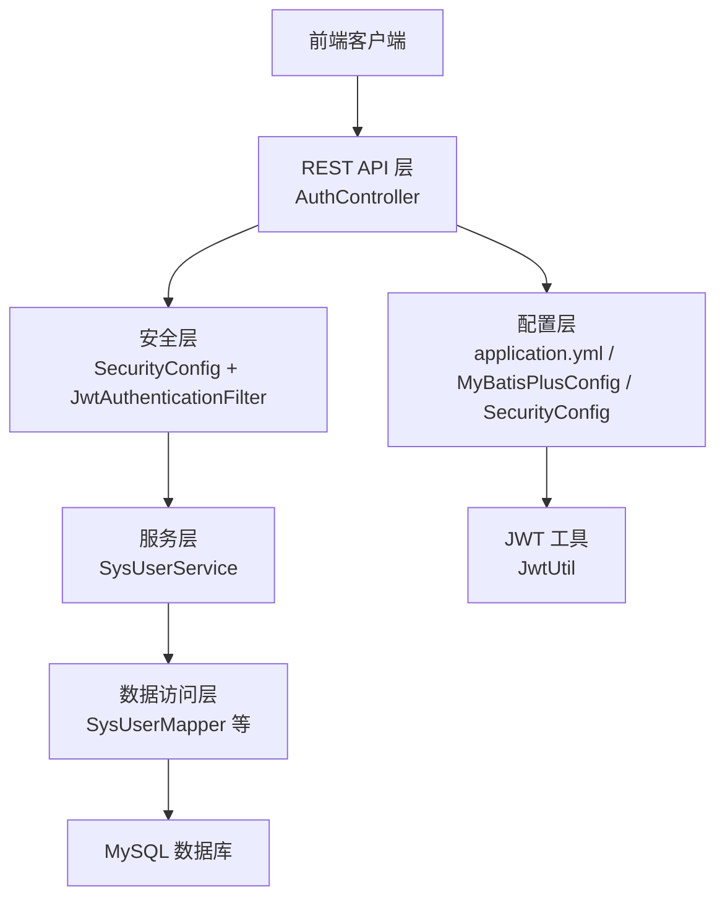
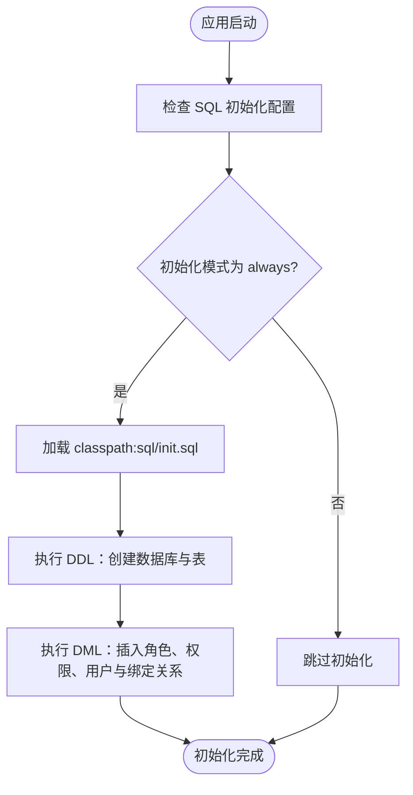
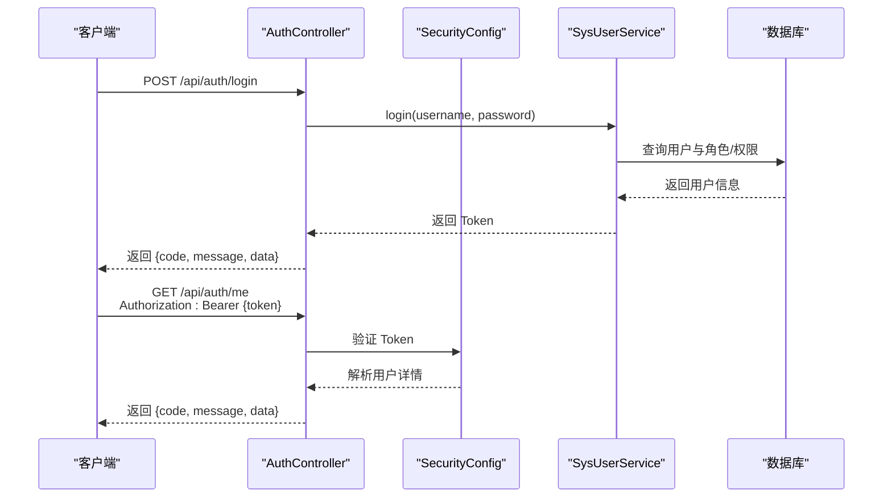
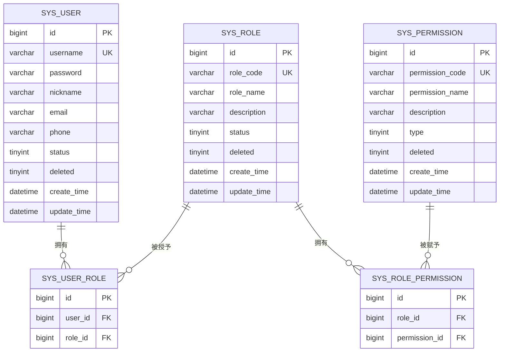
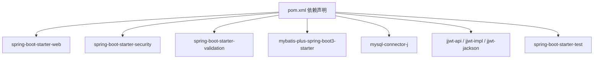

# 快速开始

<cite>
**本文引用的文件**
- [README.md](file://README.md)
- [pom.xml](file://pom.xml)
- [application.yml](file://src/main/resources/application.yml)
- [init.sql](file://sql/init.sql)
- [BookOrderApplication.java](file://src/main/java/com/bookorder/BookOrderApplication.java)
- [SecurityConfig.java](file://src/main/java/com/bookorder/config/SecurityConfig.java)
- [MyBatisPlusConfig.java](file://src/main/java/com/bookorder/config/MyBatisPlusConfig.java)
- [JwtUtil.java](file://src/main/java/com/bookorder/security/JwtUtil.java)
- [AuthController.java](file://src/main/java/com/bookorder/controller/AuthController.java)
- [SysUser.java](file://src/main/java/com/bookorder/entity/SysUser.java)
- [SysUserService.java](file://src/main/java/com/bookorder/service/SysUserService.java)
- [Result.java](file://src/main/java/com/bookorder/common/Result.java)
</cite>

## 目录
1. [简介](#简介)
2. [项目结构](#项目结构)
3. [核心组件](#核心组件)
4. [架构总览](#架构总览)
5. [详细组件分析](#详细组件分析)
6. [依赖关系分析](#依赖关系分析)
7. [性能考虑](#性能考虑)
8. [故障排除指南](#故障排除指南)
9. [结论](#结论)
10. [附录](#附录)

## 简介
本指南面向首次接触图书订单系统的开发者，帮助你在30分钟内完成环境准备、数据库初始化、配置与启动，掌握系统首次启动时的自动初始化流程（表结构创建与默认数据插入），并提供常见问题的解决方案。该系统基于 Spring Boot 3 + Java 17 + Maven，采用 MyBatis-Plus、Spring Security 和 JWT 实现 RBAC 权限控制。

## 项目结构
项目采用标准的 Spring Boot 结构，主要模块如下：
- 启动类：负责应用引导与 Mapper 扫描
- 配置层：Spring Security 安全配置、MyBatis-Plus 配置、JWT 参数配置
- 控制器层：认证相关接口（登录、注册、获取当前用户）
- 实体与映射：用户、角色、权限及其关联表的实体与 Mapper
- 服务层：用户服务接口与实现
- 通用工具：统一响应封装、全局异常处理、业务异常定义
- 资源文件：数据库初始化脚本、应用配置

图表来源
- [BookOrderApplication.java:1-15](file://src/main/java/com/bookorder/BookOrderApplication.java#L1-L15)
- [SecurityConfig.java:1-74](file://src/main/java/com/bookorder/config/SecurityConfig.java#L1-L74)
- [MyBatisPlusConfig.java:1-23](file://src/main/java/com/bookorder/config/MyBatisPlusConfig.java#L1-L23)
- [application.yml:1-33](file://src/main/resources/application.yml#L1-L33)
- [AuthController.java:1-59](file://src/main/java/com/bookorder/controller/AuthController.java#L1-L59)
- [SysUser.java:1-48](file://src/main/java/com/bookorder/entity/SysUser.java#L1-L48)
- [init.sql:1-124](file://sql/init.sql#L1-L124)
- [JwtUtil.java:1-62](file://src/main/java/com/bookorder/security/JwtUtil.java#L1-L62)

章节来源
- [README.md:128-168](file://README.md#L128-L168)
- [pom.xml:1-95](file://pom.xml#L1-L95)

## 核心组件
- 启动类：启用 Spring Boot 并扫描 Mapper 包，负责应用启动入口。
- 安全配置：开启无状态会话、放行登录/注册接口、设置认证失败与权限不足的统一返回。
- MyBatis-Plus 配置：自动填充创建/更新时间字段。
- 应用配置：数据库连接、SQL 初始化策略、MyBatis-Plus 全局配置、JWT 参数、日志级别。
- 认证控制器：提供登录、注册、获取当前用户信息接口。
- 实体模型：用户、角色、权限及关联表，支持逻辑删除与自动时间填充。
- 统一响应：标准化返回结构，便于前端消费。

章节来源
- [BookOrderApplication.java:1-15](file://src/main/java/com/bookorder/BookOrderApplication.java#L1-L15)
- [SecurityConfig.java:1-74](file://src/main/java/com/bookorder/config/SecurityConfig.java#L1-L74)
- [MyBatisPlusConfig.java:1-23](file://src/main/java/com/bookorder/config/MyBatisPlusConfig.java#L1-L23)
- [application.yml:1-33](file://src/main/resources/application.yml#L1-L33)
- [AuthController.java:1-59](file://src/main/java/com/bookorder/controller/AuthController.java#L1-L59)
- [SysUser.java:1-48](file://src/main/java/com/bookorder/entity/SysUser.java#L1-L48)
- [Result.java:1-41](file://src/main/java/com/bookorder/common/Result.java#L1-L41)

## 架构总览
系统采用前后端分离架构，后端通过 REST API 提供认证与用户信息查询能力；前端通过 Authorization 头携带 JWT Token 进行鉴权。

图表来源
- [AuthController.java:1-59](file://src/main/java/com/bookorder/controller/AuthController.java#L1-L59)
- [SecurityConfig.java:1-74](file://src/main/java/com/bookorder/config/SecurityConfig.java#L1-L74)
- [JwtUtil.java:1-62](file://src/main/java/com/bookorder/security/JwtUtil.java#L1-L62)
- [application.yml:1-33](file://src/main/resources/application.yml#L1-L33)
- [MyBatisPlusConfig.java:1-23](file://src/main/java/com/bookorder/config/MyBatisPlusConfig.java#L1-L23)

## 详细组件分析

### 环境准备与安装
- JDK 17+：确保本地已安装并配置 JAVA_HOME。
- Maven 3.8+：用于构建与运行项目。
- MySQL 8.0+：用于存储用户、角色、权限等数据。

章节来源
- [README.md:18-22](file://README.md#L18-L22)

### 数据库初始化
系统在首次启动时会自动执行 SQL 初始化脚本，创建数据库与表结构，并插入默认角色、权限与管理员账户。

- 创建数据库与使用数据库
- 创建用户、角色、权限、用户-角色、角色-权限关联表
- 插入默认角色（ADMIN/LIBRARIAN/READER）与权限
- 为 ADMIN 分配全部权限
- 插入默认管理员账号（密码经 BCrypt 加密）

章节来源
- [init.sql:1-124](file://sql/init.sql#L1-L124)

### 配置文件修改
- 修改数据库连接信息：URL、用户名、密码
- 设置 SQL 初始化模式为 always，并指定初始化脚本位置
- MyBatis-Plus 配置：下划线转驼峰、日志输出、主键自增、逻辑删除字段
- JWT 参数：密钥与过期时间
- 日志级别：将包 com.bookorder 的日志级别设为 debug

章节来源
- [application.yml:1-33](file://src/main/resources/application.yml#L1-L33)

### 项目启动流程
- 使用 Maven 启动 Spring Boot 应用
- 应用启动后访问 http://localhost:8080
- 首次启动自动执行 SQL 初始化脚本

章节来源
- [README.md:42-48](file://README.md#L42-L48)
- [application.yml:10-13](file://src/main/resources/application.yml#L10-L13)

### 自动初始化流程（表结构与默认数据）
系统通过 Spring Boot 的 SQL 初始化机制，在应用启动时执行 classpath:sql/init.sql。

图表来源
- [application.yml:10-13](file://src/main/resources/application.yml#L10-L13)
- [init.sql:1-124](file://sql/init.sql#L1-L124)

### 认证与授权流程
- 登录接口：接收用户名与密码，验证通过后签发 JWT Token
- 注册接口：为新用户分配 READER 角色
- 获取当前用户信息：根据 Token 解析用户信息与权限集合

图表来源
- [AuthController.java:28-57](file://src/main/java/com/bookorder/controller/AuthController.java#L28-L57)
- [SecurityConfig.java:34-62](file://src/main/java/com/bookorder/config/SecurityConfig.java#L34-L62)
- [JwtUtil.java:27-43](file://src/main/java/com/bookorder/security/JwtUtil.java#L27-L43)

### 数据模型与关系
系统采用 RBAC 模型，核心实体包括用户、角色、权限以及它们之间的多对多关联。

图表来源
- [SysUser.java:6-26](file://src/main/java/com/bookorder/entity/SysUser.java#L6-L26)
- [init.sql:11-70](file://sql/init.sql#L11-L70)

## 依赖关系分析
系统依赖关系清晰，核心依赖包括 Spring Boot Web、Security、Validation、MyBatis-Plus、MySQL Connector、JWT 等。

图表来源
- [pom.xml:26-84](file://pom.xml#L26-L84)

章节来源
- [pom.xml:1-95](file://pom.xml#L1-L95)

## 性能考虑
- 无状态会话：通过 JWT 实现无状态鉴权，降低服务器会话开销。
- 自动时间填充：利用 MyBatis-Plus 元对象处理器减少重复代码与数据库写入成本。
- SQL 初始化：首次启动执行一次初始化，避免运行时动态建表带来的额外延迟。
- 日志级别：开发阶段建议开启 debug，生产环境可根据需要调整。

## 故障排除指南
- 数据库连接失败
  - 检查 application.yml 中的数据库 URL、用户名、密码是否正确
  - 确认 MySQL 服务已启动且网络可达
- 初始化脚本未执行
  - 确认 SQL 初始化模式为 always，且脚本路径为 classpath:sql/init.sql
  - 检查数据库权限是否允许创建数据库与表
- 登录失败或 Token 无效
  - 确认用户名与密码正确
  - 检查 JWT 密钥与过期时间配置是否一致
- 权限不足
  - 确认用户角色与权限映射是否正确
  - 检查请求头 Authorization 是否携带正确的 Bearer Token

章节来源
- [application.yml:10-28](file://src/main/resources/application.yml#L10-L28)
- [SecurityConfig.java:44-57](file://src/main/java/com/bookorder/config/SecurityConfig.java#L44-L57)
- [init.sql:76-124](file://sql/init.sql#L76-L124)

## 结论
通过本快速开始指南，你可以在30分钟内完成环境准备、数据库初始化、配置修改与项目启动，并理解系统首次启动时的自动初始化流程。系统提供了完善的 RBAC 权限模型与统一响应结构，便于后续功能扩展与维护。

## 附录

### 快速开始清单
- 准备 JDK 17+、Maven 3.8+、MySQL 8.0+
- 在 MySQL 中创建数据库（参考初始化脚本中的建库语句）
- 修改 application.yml 中的数据库连接信息
- 使用 Maven 启动应用
- 首次启动后访问 http://localhost:8080
- 使用默认管理员账号登录（参考默认账号说明）

章节来源
- [README.md:18-58](file://README.md#L18-L58)
- [application.yml:4-8](file://src/main/resources/application.yml#L4-L8)
- [init.sql:5-6](file://sql/init.sql#L5-L6)