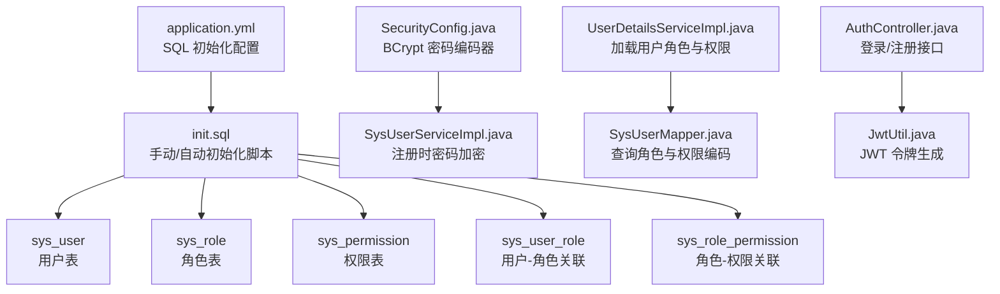
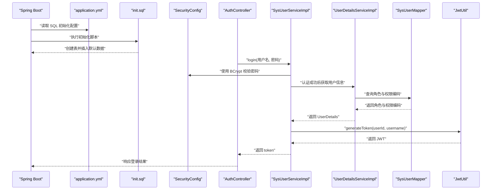
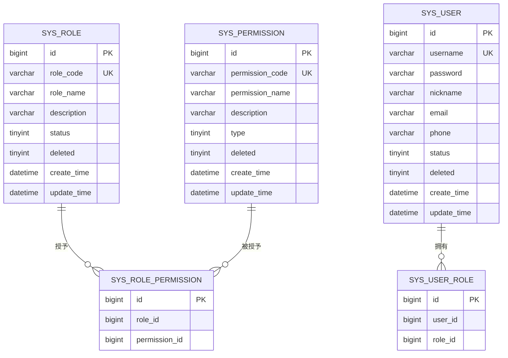
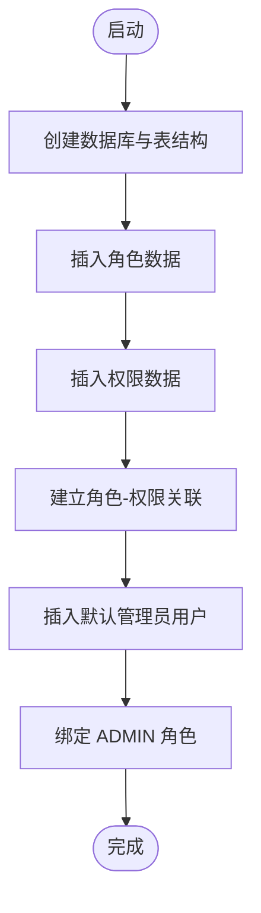
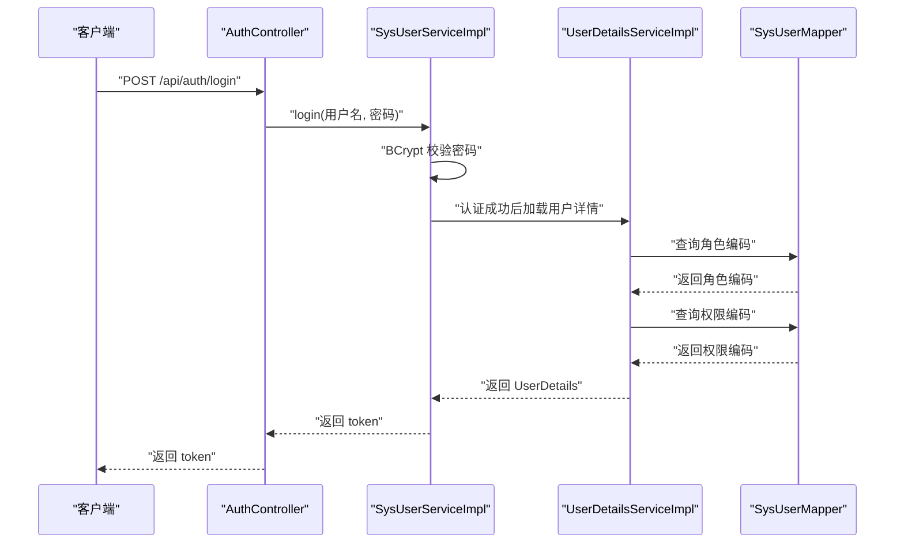
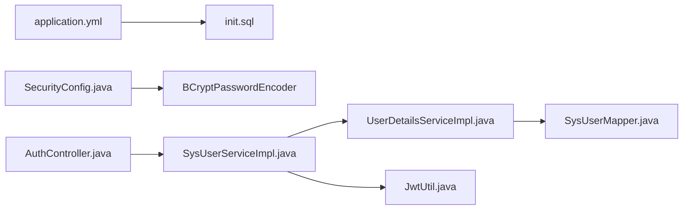

# 初始化数据

<cite>
**本文引用的文件**
- [init.sql](file://sql/init.sql)
- [init.sql](file://src/main/resources/sql/init.sql)
- [application.yml](file://src/main/resources/application.yml)
- [SysRole.java](file://src/main/java/com/bookorder/entity/SysRole.java)
- [SysPermission.java](file://src/main/java/com/bookorder/entity/SysPermission.java)
- [SysUser.java](file://src/main/java/com/bookorder/entity/SysUser.java)
- [SysUserRole.java](file://src/main/java/com/bookorder/entity/SysUserRole.java)
- [SysRolePermission.java](file://src/main/java/com/bookorder/entity/SysRolePermission.java)
- [SysUserMapper.java](file://src/main/java/com/bookorder/mapper/SysUserMapper.java)
- [UserDetailsServiceImpl.java](file://src/main/java/com/bookorder/security/UserDetailsServiceImpl.java)
- [SecurityConfig.java](file://src/main/java/com/bookorder/config/SecurityConfig.java)
- [SysUserServiceImpl.java](file://src/main/java/com/bookorder/service/impl/SysUserServiceImpl.java)
- [AuthController.java](file://src/main/java/com/bookorder/controller/AuthController.java)
- [JwtUtil.java](file://src/main/java/com/bookorder/security/JwtUtil.java)
- [GlobalExceptionHandler.java](file://src/main/java/com/bookorder/common/GlobalExceptionHandler.java)
</cite>

## 目录
1. [简介](#简介)
2. [项目结构](#项目结构)
3. [核心组件](#核心组件)
4. [架构总览](#架构总览)
5. [详细组件分析](#详细组件分析)
6. [依赖分析](#依赖分析)
7. [性能考虑](#性能考虑)
8. [故障排查指南](#故障排查指南)
9. [结论](#结论)

## 简介
本文件聚焦图书订单系统的“初始化数据”主题，系统在首次启动时通过 SQL 脚本完成数据库结构与默认数据的创建与填充，包括：
- 角色数据：ADMIN、LIBRARIAN、READER
- 权限数据：按类型（菜单、按钮、接口）划分的权限集合
- 用户数据：默认管理员账号 admin 及其绑定的 ADMIN 角色
- 权限分配策略与继承关系：ADMIN 拥有全部权限；LIBRARIAN 拥有图书与订单管理权限；READER 仅具备查看与下单权限
- 权限编码规范：采用冒号分隔的层级命名（如 system:user）
- 默认管理员账号创建与 BCrypt 密码加密配置
- 初始化脚本执行顺序与数据依赖关系

## 项目结构
与初始化数据直接相关的文件分布如下：
- 数据库初始化脚本：位于根目录与资源目录各一份，内容一致，用于手动创建数据库与自动初始化
- 应用配置：application.yml 中启用 SQL 初始化模式并指定脚本位置
- 实体模型：SysUser、SysRole、SysPermission、SysUserRole、SysRolePermission
- 安全与认证：SecurityConfig 配置无状态会话与 BCrypt 密码编码器；UserDetailsServiceImpl 根据用户查询角色与权限；AuthController 提供登录与注册入口；JwtUtil 生成与解析 JWT
- Mapper 与 Service：SysUserMapper 查询用户的角色与权限编码；SysUserServiceImpl 处理登录、注册与默认角色绑定



**图表来源**
- [application.yml:10-14](file://src/main/resources/application.yml#L10-L14)
- [init.sql:1-124](file://sql/init.sql#L1-L124)
- [SecurityConfig.java:69-72](file://src/main/java/com/bookorder/config/SecurityConfig.java#L69-L72)
- [SysUserServiceImpl.java:58-80](file://src/main/java/com/bookorder/service/impl/SysUserServiceImpl.java#L58-L80)
- [UserDetailsServiceImpl.java:24-48](file://src/main/java/com/bookorder/security/UserDetailsServiceImpl.java#L24-L48)
- [SysUserMapper.java:14-23](file://src/main/java/com/bookorder/mapper/SysUserMapper.java#L14-L23)
- [AuthController.java:28-38](file://src/main/java/com/bookorder/controller/AuthController.java#L28-L38)
- [JwtUtil.java:27-35](file://src/main/java/com/bookorder/security/JwtUtil.java#L27-L35)

**章节来源**
- [application.yml:10-14](file://src/main/resources/application.yml#L10-L14)
- [init.sql:1-124](file://sql/init.sql#L1-L124)

## 核心组件
- 角色表（sys_role）：包含角色编码（role_code）、角色名称（role_name）、描述等字段
- 权限表（sys_permission）：包含权限编码（permission_code）、权限名称（permission_name）、类型（type，1-菜单、2-按钮、3-接口）
- 用户表（sys_user）：包含用户名、密码（BCrypt 加密存储）、昵称、状态等
- 关联表：
  - sys_user_role：用户与角色的多对多关联
  - sys_role_permission：角色与权限的多对多关联

这些实体映射到 Java 实体类，便于 MyBatis-Plus 在运行时进行 ORM 操作。

**章节来源**
- [SysRole.java:1-42](file://src/main/java/com/bookorder/entity/SysRole.java#L1-L42)
- [SysPermission.java:1-42](file://src/main/java/com/bookorder/entity/SysPermission.java#L1-L42)
- [SysUser.java:1-48](file://src/main/java/com/bookorder/entity/SysUser.java#L1-L48)
- [SysUserRole.java:1-22](file://src/main/java/com/bookorder/entity/SysUserRole.java#L1-L22)
- [SysRolePermission.java:1-22](file://src/main/java/com/bookorder/entity/SysRolePermission.java#L1-L22)

## 架构总览
系统启动时的初始化流程如下：
- Spring Boot 启动后根据 application.yml 的 SQL 初始化配置，执行 classpath 下的 init.sql
- 脚本依次创建表结构并插入默认数据（角色、权限、用户、关联关系）
- 用户登录时由 SecurityConfig 注入的 BCrypt 编码器校验密码
- UserDetailsServiceImpl 基于 sys_user_role 与 sys_role_permission 查询用户的角色与权限编码，并装配为 GrantedAuthority
- AuthController 提供登录接口，登录成功后由 JwtUtil 生成 JWT 令牌返回给客户端



**图表来源**
- [application.yml:10-14](file://src/main/resources/application.yml#L10-L14)
- [init.sql:76-124](file://sql/init.sql#L76-L124)
- [SecurityConfig.java:69-72](file://src/main/java/com/bookorder/config/SecurityConfig.java#L69-L72)
- [AuthController.java:28-32](file://src/main/java/com/bookorder/controller/AuthController.java#L28-L32)
- [SysUserServiceImpl.java:50-55](file://src/main/java/com/bookorder/service/impl/SysUserServiceImpl.java#L50-L55)
- [UserDetailsServiceImpl.java:24-48](file://src/main/java/com/bookorder/security/UserDetailsServiceImpl.java#L24-L48)
- [SysUserMapper.java:14-23](file://src/main/java/com/bookorder/mapper/SysUserMapper.java#L14-L23)
- [JwtUtil.java:27-35](file://src/main/java/com/bookorder/security/JwtUtil.java#L27-L35)

## 详细组件分析

### 角色与权限数据模型
角色与权限通过中间表建立多对多关系，形成清晰的权限矩阵。角色与权限的实体定义如下：



**图表来源**
- [SysRole.java:9-39](file://src/main/java/com/bookorder/entity/SysRole.java#L9-L39)
- [SysPermission.java:9-39](file://src/main/java/com/bookorder/entity/SysPermission.java#L9-L39)
- [SysUser.java:9-46](file://src/main/java/com/bookorder/entity/SysUser.java#L9-L46)
- [SysUserRole.java:10-20](file://src/main/java/com/bookorder/entity/SysUserRole.java#L10-L20)
- [SysRolePermission.java:10-20](file://src/main/java/com/bookorder/entity/SysRolePermission.java#L10-L20)

**章节来源**
- [SysRole.java:1-42](file://src/main/java/com/bookorder/entity/SysRole.java#L1-L42)
- [SysPermission.java:1-42](file://src/main/java/com/bookorder/entity/SysPermission.java#L1-L42)
- [SysUser.java:1-48](file://src/main/java/com/bookorder/entity/SysUser.java#L1-L48)
- [SysUserRole.java:1-22](file://src/main/java/com/bookorder/entity/SysUserRole.java#L1-L22)
- [SysRolePermission.java:1-22](file://src/main/java/com/bookorder/entity/SysRolePermission.java#L1-L22)

### 初始化脚本执行顺序与数据依赖
初始化脚本的执行顺序与依赖关系如下：
- 先创建数据库与表结构（sys_user、sys_role、sys_permission、sys_user_role、sys_role_permission）
- 再插入默认数据：
  - 插入角色数据（ADMIN、LIBRARIAN、READER）
  - 插入权限数据（含菜单、按钮、接口三类）
  - 建立角色与权限的关联（ADMIN 拥有全部权限；LIBRARIAN 拥有图书与订单管理权限；READER 仅具备查看与下单权限）
  - 插入默认管理员用户（用户名 admin，BCrypt 加密密码），并将其绑定到 ADMIN 角色



**图表来源**
- [init.sql:76-124](file://sql/init.sql#L76-L124)

**章节来源**
- [init.sql:76-124](file://sql/init.sql#L76-L124)
- [init.sql:74-121](file://src/main/resources/sql/init.sql#L74-L121)

### 权限类型与编码规范
- 权限类型（type）：1-菜单、2-按钮、3-接口
- 权限编码（permission_code）采用冒号分隔的层级命名，例如 system:user、book:manage、order:list 等
- 该规范确保权限命名统一、层次清晰，便于前端路由、按钮级控制与接口鉴权的匹配

**章节来源**
- [init.sql:46](file://sql/init.sql#L46)
- [init.sql:81-98](file://sql/init.sql#L81-L98)

### 角色权限分配策略与继承关系
- ADMIN：拥有全部权限（sys_role_permission 对 ADMIN 的全量授权）
- LIBRARIAN：拥有图书与订单管理相关权限（图书增删改查、订单增删改查）
- READER：仅具备查看权限与创建订单权限（图书列表、订单列表、创建订单）

```mermaid
classDiagram
class ADMIN {
"+全部权限"
}
class LIBRARIAN {
"+图书管理权限"
"+订单管理权限"
}
class READER {
"+查看权限"
"+创建订单权限"
}
ADMIN --> LIBRARIAN : "继承"
ADMIN --> READER : "继承"
```

**图表来源**
- [init.sql:102-115](file://sql/init.sql#L102-L115)

**章节来源**
- [init.sql:102-115](file://sql/init.sql#L102-L115)

### 默认管理员账号与 BCrypt 密码加密
- 默认管理员账号：用户名 admin，初始密码为 admin123，经 BCrypt 加密后存入 sys_user.password 字段
- 登录时由 SecurityConfig 注入的 BCryptPasswordEncoder 进行密码校验
- 注册新用户时同样使用 BCryptPasswordEncoder 对明文密码进行加密存储
- 默认注册用户将被绑定 READER 角色

**章节来源**
- [init.sql:117-121](file://sql/init.sql#L117-L121)
- [SecurityConfig.java:69-72](file://src/main/java/com/bookorder/config/SecurityConfig.java#L69-L72)
- [SysUserServiceImpl.java:64-79](file://src/main/java/com/bookorder/service/impl/SysUserServiceImpl.java#L64-L79)

### 权限加载与鉴权流程
- 登录请求由 AuthController 接收，调用 SysUserServiceImpl.login 完成认证
- 认证成功后，UserDetailsServiceImpl 根据用户 ID 查询其角色与权限编码，并组装为 GrantedAuthority 列表
- SysUserMapper 提供两个关键查询：
  - selectRoleCodesByUserId：查询用户的角色编码列表
  - selectPermissionCodesByUserId：查询用户的权限编码列表（去重）
- 最终由 Spring Security 结合 JWT 进行无状态鉴权



**图表来源**
- [AuthController.java:28-32](file://src/main/java/com/bookorder/controller/AuthController.java#L28-L32)
- [SysUserServiceImpl.java:50-55](file://src/main/java/com/bookorder/service/impl/SysUserServiceImpl.java#L50-L55)
- [UserDetailsServiceImpl.java:24-48](file://src/main/java/com/bookorder/security/UserDetailsServiceImpl.java#L24-L48)
- [SysUserMapper.java:14-23](file://src/main/java/com/bookorder/mapper/SysUserMapper.java#L14-L23)

**章节来源**
- [AuthController.java:28-32](file://src/main/java/com/bookorder/controller/AuthController.java#L28-L32)
- [SysUserServiceImpl.java:50-55](file://src/main/java/com/bookorder/service/impl/SysUserServiceImpl.java#L50-L55)
- [UserDetailsServiceImpl.java:24-48](file://src/main/java/com/bookorder/security/UserDetailsServiceImpl.java#L24-L48)
- [SysUserMapper.java:14-23](file://src/main/java/com/bookorder/mapper/SysUserMapper.java#L14-L23)

## 依赖分析
- 配置依赖：application.yml 的 spring.sql.init.* 配置决定初始化脚本的执行时机与位置
- 安全依赖：SecurityConfig 注入 BCryptPasswordEncoder，保证密码加密一致性
- 数据访问依赖：SysUserMapper 提供角色与权限编码查询，支撑 UserDetailsServiceImpl 的权限装配
- 控制层依赖：AuthController 作为登录入口，串联登录、鉴权与 JWT 返回流程



**图表来源**
- [application.yml:10-14](file://src/main/resources/application.yml#L10-L14)
- [SecurityConfig.java:69-72](file://src/main/java/com/bookorder/config/SecurityConfig.java#L69-L72)
- [AuthController.java:28-32](file://src/main/java/com/bookorder/controller/AuthController.java#L28-L32)
- [SysUserServiceImpl.java:50-55](file://src/main/java/com/bookorder/service/impl/SysUserServiceImpl.java#L50-L55)
- [UserDetailsServiceImpl.java:24-48](file://src/main/java/com/bookorder/security/UserDetailsServiceImpl.java#L24-L48)
- [SysUserMapper.java:14-23](file://src/main/java/com/bookorder/mapper/SysUserMapper.java#L14-L23)
- [JwtUtil.java:27-35](file://src/main/java/com/bookorder/security/JwtUtil.java#L27-L35)

**章节来源**
- [application.yml:10-14](file://src/main/resources/application.yml#L10-L14)
- [SecurityConfig.java:69-72](file://src/main/java/com/bookorder/config/SecurityConfig.java#L69-L72)
- [SysUserMapper.java:14-23](file://src/main/java/com/bookorder/mapper/SysUserMapper.java#L14-L23)

## 性能考虑
- 初始化脚本采用 INSERT IGNORE，避免重复执行导致的主键冲突
- 权限查询使用 INNER JOIN 并对权限编码去重，减少冗余数据传输
- 使用 BCrypt 进行密码加密，兼顾安全性与可接受的计算开销
- 无状态 JWT 降低服务端会话存储压力

## 故障排查指南
- 登录失败（用户名或密码错误）：检查 application.yml 中数据库连接配置与 init.sql 是否正确执行；确认 sys_user 中是否存在对应用户且状态正常
- 权限不足（403）：检查用户是否绑定了正确的角色与权限；确认 SysUserMapper 查询返回的权限编码与前端/接口期望一致
- 注册失败（用户名已存在）：检查业务层的用户名唯一性判断逻辑
- 未登录（401）：确认请求头携带的 JWT 是否有效，secret 与 expiration 配置是否正确

**章节来源**
- [application.yml:4-9](file://src/main/resources/application.yml#L4-L9)
- [GlobalExceptionHandler.java:28-38](file://src/main/java/com/bookorder/common/GlobalExceptionHandler.java#L28-L38)
- [SysUserServiceImpl.java:58-80](file://src/main/java/com/bookorder/service/impl/SysUserServiceImpl.java#L58-L80)
- [JwtUtil.java:45-60](file://src/main/java/com/bookorder/security/JwtUtil.java#L45-L60)

## 结论
本项目的初始化数据方案通过标准化的 SQL 脚本与 Spring Boot 的自动初始化能力，实现了角色、权限与默认管理员的快速落地。配合 BCrypt 密码加密与基于 JWT 的无状态鉴权，既满足了功能需求，也兼顾了安全与可维护性。建议在生产环境部署前，务必验证数据库连接、脚本执行与权限映射的准确性，并根据实际业务扩展权限类型与编码规范。