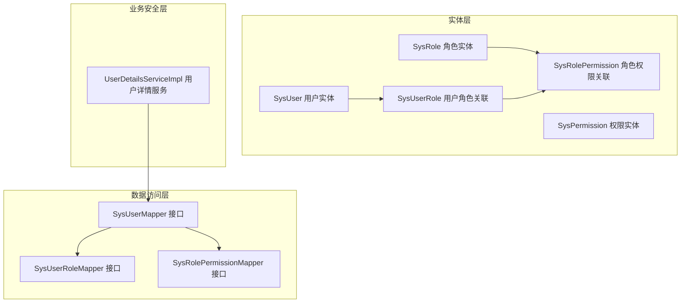
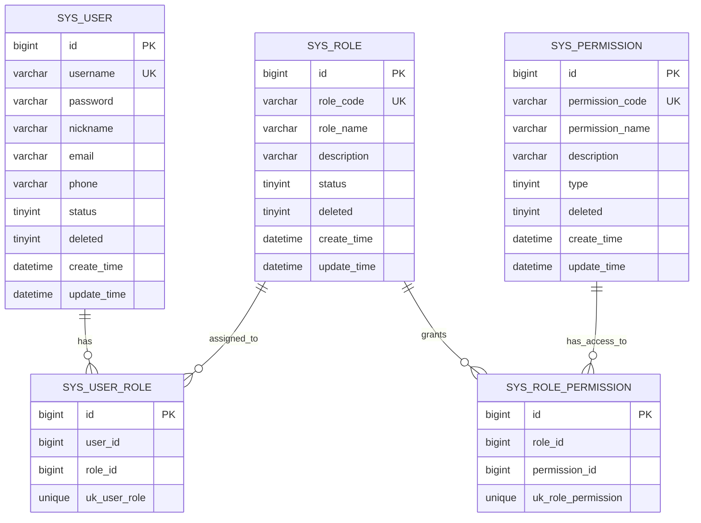
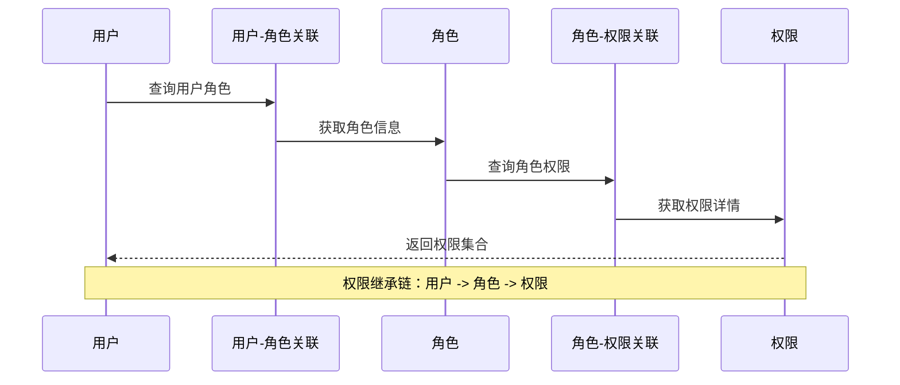
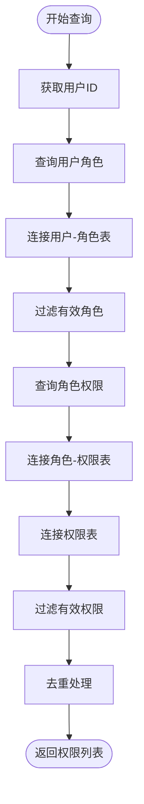
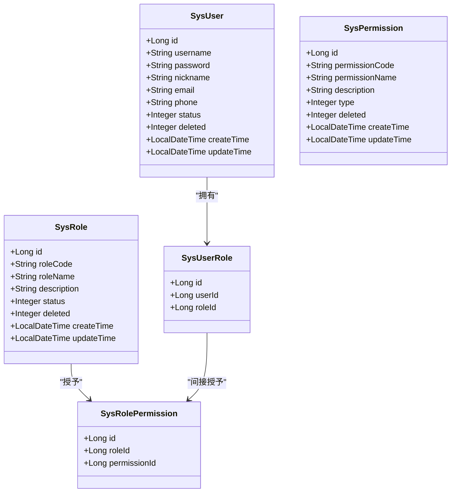
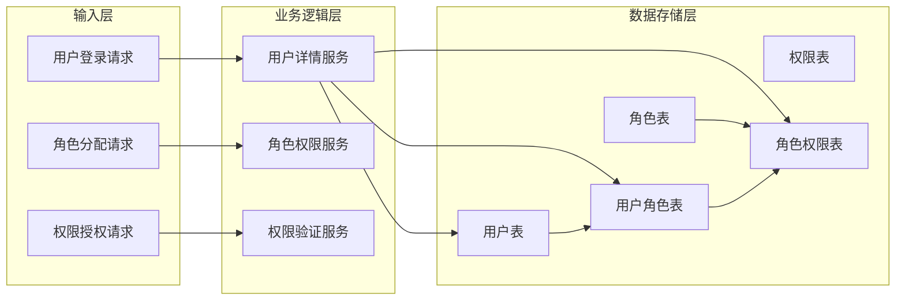

# 实体关系设计

<cite>
**本文档引用的文件**
- [SysUser.java](file://src/main/java/com/bookorder/entity/SysUser.java)
- [SysRole.java](file://src/main/java/com/bookorder/entity/SysRole.java)
- [SysPermission.java](file://src/main/java/com/bookorder/entity/SysPermission.java)
- [SysUserRole.java](file://src/main/java/com/bookorder/entity/SysUserRole.java)
- [SysRolePermission.java](file://src/main/java/com/bookorder/entity/SysRolePermission.java)
- [init.sql](file://sql/init.sql)
- [init.sql](file://src/main/resources/sql/init.sql)
- [SysUserMapper.java](file://src/main/java/com/bookorder/mapper/SysUserMapper.java)
- [UserDetailsServiceImpl.java](file://src/main/java/com/bookorder/security/UserDetailsServiceImpl.java)
</cite>

## 目录
1. [引言](#引言)
2. [项目结构](#项目结构)
3. [核心组件](#核心组件)
4. [架构概览](#架构概览)
5. [详细组件分析](#详细组件分析)
6. [依赖关系分析](#依赖关系分析)
7. [性能考虑](#性能考虑)
8. [故障排除指南](#故障排除指南)
9. [结论](#结论)

## 引言

本文件详细阐述图书订单系统中的实体关系设计，重点分析RBAC（基于角色的访问控制）权限模型中各实体之间的关联关系和多对多映射设计。系统采用标准的三层权限架构：用户-角色关联表（sys_user_role）和角色-权限关联表（sys_role_permission），通过中间表实现灵活的权限分配和继承机制。

## 项目结构

图书订单系统的权限管理模块采用分层架构设计，包含以下关键组件：

**图表来源**
- [SysUser.java:1-48](file://src/main/java/com/bookorder/entity/SysUser.java#L1-L48)
- [SysRole.java:1-42](file://src/main/java/com/bookorder/entity/SysRole.java#L1-L42)
- [SysPermission.java:1-42](file://src/main/java/com/bookorder/entity/SysPermission.java#L1-L42)
- [SysUserRole.java:1-22](file://src/main/java/com/bookorder/entity/SysUserRole.java#L1-L22)
- [SysRolePermission.java:1-22](file://src/main/java/com/bookorder/entity/SysRolePermission.java#L1-L22)

**章节来源**
- [SysUser.java:1-48](file://src/main/java/com/bookorder/entity/SysUser.java#L1-L48)
- [SysRole.java:1-42](file://src/main/java/com/bookorder/entity/SysRole.java#L1-L42)
- [SysPermission.java:1-42](file://src/main/java/com/bookorder/entity/SysPermission.java#L1-L42)
- [SysUserRole.java:1-22](file://src/main/java/com/bookorder/entity/SysUserRole.java#L1-L22)
- [SysRolePermission.java:1-22](file://src/main/java/com/bookorder/entity/SysRolePermission.java#L1-L22)

## 核心组件

### 用户实体（SysUser）

用户实体是系统的基础身份标识，包含用户的基本信息和状态管理。采用逻辑删除字段（deleted）实现软删除机制，支持时间戳自动填充功能。

**主要属性：**
- 基础标识：id（自增主键）
- 身份信息：username（唯一）、password、nickname、email、phone
- 状态管理：status（启用/禁用）、deleted（逻辑删除）
- 时间戳：createTime、updateTime（自动填充）

### 角色实体（SysRole）

角色实体代表用户在系统中的职责分类，支持角色代码唯一性和状态管理。每个角色可以分配给多个用户，形成灵活的权限组织结构。

**主要属性：**
- 唯一标识：id（自增主键）
- 角色标识：roleCode（唯一）、roleName
- 描述信息：description
- 状态管理：status、deleted
- 时间戳：createTime、updateTime

### 权限实体（SysPermission）

权限实体定义系统中的具体操作权限，支持权限类型分类（菜单、按钮、接口）。权限与角色之间建立多对多关系，实现细粒度的权限控制。

**主要属性：**
- 唯一标识：id（自增主键）
- 权限标识：permissionCode（唯一）、permissionName
- 类型分类：type（1-菜单、2-按钮、3-接口）
- 描述信息：description
- 状态管理：deleted
- 时间戳：createTime、updateTime

### 关联实体设计

#### 用户-角色关联表（SysUserRole）

用户-角色关联表实现了用户与角色之间的多对多关系，采用复合唯一索引确保数据完整性。

**表结构特征：**
- 主键：id（自增）
- 外键：user_id、role_id
- 唯一约束：uk_user_role(user_id, role_id)
- 设计目的：支持用户拥有多个角色，角色可分配给多个用户

#### 角色-权限关联表（SysRolePermission）

角色-权限关联表建立了角色与权限之间的多对多关系，为权限继承和传递提供基础。

**表结构特征：**
- 主键：id（自增）
- 外键：role_id、permission_id
- 唯一约束：uk_role_permission(role_id, permission_id)
- 设计目的：支持角色拥有多个权限，权限可属于多个角色

**章节来源**
- [SysUser.java:1-48](file://src/main/java/com/bookorder/entity/SysUser.java#L1-L48)
- [SysRole.java:1-42](file://src/main/java/com/bookorder/entity/SysRole.java#L1-L42)
- [SysPermission.java:1-42](file://src/main/java/com/bookorder/entity/SysPermission.java#L1-L42)
- [SysUserRole.java:1-22](file://src/main/java/com/bookorder/entity/SysUserRole.java#L1-L22)
- [SysRolePermission.java:1-22](file://src/main/java/com/bookorder/entity/SysRolePermission.java#L1-L22)

## 架构概览

系统采用标准的RBAC权限模型，通过中间表实现灵活的权限分配机制：

**图表来源**
- [init.sql:11-50](file://sql/init.sql#L11-L50)
- [init.sql:55-70](file://sql/init.sql#L55-L70)

### 权限继承机制

系统通过用户-角色-权限的三层关联实现权限继承，用户通过所属角色间接获得权限：

**图表来源**
- [SysUserMapper.java:14-23](file://src/main/java/com/bookorder/mapper/SysUserMapper.java#L14-L23)
- [UserDetailsServiceImpl.java:36-47](file://src/main/java/com/bookorder/security/UserDetailsServiceImpl.java#L36-L47)

## 详细组件分析

### 数据库表设计分析

#### 主键设计策略

系统采用统一的自增主键设计：
- 所有实体表使用BIGINT类型的自增主键
- 关联表同样采用自增主键，便于维护和扩展
- 主键设计简单直观，避免复杂关联带来的性能问题

#### 唯一约束设计

系统在关键关联上设置了复合唯一约束：

**用户-角色关联唯一约束：**
- 索引名称：uk_user_role
- 约束条件：(user_id, role_id)
- 设计目的：防止用户重复绑定相同角色

**角色-权限关联唯一约束：**
- 索引名称：uk_role_permission
- 约束条件：(role_id, permission_id)
- 设计目的：防止角色重复授予相同权限

#### 外键引用关系

虽然数据库层面未显式定义外键约束，但应用层面通过以下方式保证数据一致性：

**逻辑外键约束：**
- 用户-角色关联：user_id引用sys_user.id，role_id引用sys_role.id
- 角色-权限关联：role_id引用sys_role.id，permission_id引用sys_permission.id

**查询验证机制：**
- 应用层查询时通过JOIN操作确保关联关系的有效性
- 删除操作前进行存在性检查，避免悬挂引用

### 实体类设计模式

#### MyBatis-Plus注解使用

各实体类均采用MyBatis-Plus注解实现ORM映射：

**表映射注解：**
- @TableName注解指定数据库表名
- 支持驼峰命名与数据库字段的自动转换

**主键策略：**
- @TableId注解配置主键生成策略
- 使用AUTO类型实现数据库自增

**字段填充：**
- @TableLogic注解实现逻辑删除
- @TableField注解配置字段填充策略

#### 时间戳管理

系统采用统一的时间戳管理模式：
- 创建时间：仅在插入时设置
- 更新时间：插入和更新时自动更新
- 支持精确到秒的时间记录

### 权限查询实现

#### 用户权限查询流程

系统通过自定义SQL实现高效的权限查询：

**图表来源**
- [SysUserMapper.java:14-23](file://src/main/java/com/bookorder/mapper/SysUserMapper.java#L14-L23)

#### 权限继承算法

系统实现的权限继承算法具有以下特点：

**递归权限收集：**
- 从用户开始，逐级向上查询角色和权限
- 支持多层级权限继承（用户->角色->权限）
- 自动去重，避免重复权限的多次计算

**性能优化策略：**
- 使用DISTINCT关键字避免重复权限
- 通过INNER JOIN确保只返回有效关联
- 支持批量权限查询，减少数据库往返

**章节来源**
- [init.sql:55-70](file://sql/init.sql#L55-L70)
- [SysUserMapper.java:14-23](file://src/main/java/com/bookorder/mapper/SysUserMapper.java#L14-L23)
- [UserDetailsServiceImpl.java:36-47](file://src/main/java/com/bookorder/security/UserDetailsServiceImpl.java#L36-L47)

## 依赖关系分析

### 类层次结构

**图表来源**
- [SysUser.java:1-48](file://src/main/java/com/bookorder/entity/SysUser.java#L1-L48)
- [SysRole.java:1-42](file://src/main/java/com/bookorder/entity/SysRole.java#L1-L42)
- [SysPermission.java:1-42](file://src/main/java/com/bookorder/entity/SysPermission.java#L1-L42)
- [SysUserRole.java:1-22](file://src/main/java/com/bookorder/entity/SysUserRole.java#L1-L22)
- [SysRolePermission.java:1-22](file://src/main/java/com/bookorder/entity/SysRolePermission.java#L1-L22)

### 数据流关系

系统中的数据流向体现了典型的RBAC权限模型：

**图表来源**
- [UserDetailsServiceImpl.java:18-48](file://src/main/java/com/bookorder/security/UserDetailsServiceImpl.java#L18-L48)
- [SysUserMapper.java:12-24](file://src/main/java/com/bookorder/mapper/SysUserMapper.java#L12-L24)

**章节来源**
- [SysUser.java:1-48](file://src/main/java/com/bookorder/entity/SysUser.java#L1-L48)
- [SysRole.java:1-42](file://src/main/java/com/bookorder/entity/SysRole.java#L1-L42)
- [SysPermission.java:1-42](file://src/main/java/com/bookorder/entity/SysPermission.java#L1-L42)
- [SysUserRole.java:1-22](file://src/main/java/com/bookorder/entity/SysUserRole.java#L1-L22)
- [SysRolePermission.java:1-22](file://src/main/java/com/bookorder/entity/SysRolePermission.java#L1-L22)

## 性能考虑

### 查询优化策略

#### 索引设计建议

基于当前的唯一约束设计，建议在以下列上建立索引以提升查询性能：

**用户相关查询索引：**
- sys_user(username) - 用户名查询
- sys_user_role(user_id) - 用户角色查询
- sys_user_role(role_id) - 角色用户查询

**权限相关查询索引：**
- sys_role_permission(role_id) - 角色权限查询
- sys_role_permission(permission_id) - 权限角色查询

#### 缓存策略

**权限缓存：**
- 用户登录后缓存其权限集合
- 设置合理的缓存过期时间
- 支持权限变更时的缓存刷新

**角色缓存：**
- 缓存用户的角色代码列表
- 减少频繁的角色查询开销

### 存储优化

#### 表设计优化

**字段类型选择：**
- 使用TINYINT存储状态字段，节省存储空间
- 使用VARCHAR存储文本字段，支持国际化需求
- 合理设置字段长度，避免存储浪费

**索引优化：**
- 复合唯一索引uk_user_role和uk_role_permission
- 避免过多的二级索引影响写入性能

## 故障排除指南

### 常见问题诊断

#### 权限查询异常

**问题现象：**
- 用户登录后权限不完整
- 权限验证失败但数据库中存在关联

**诊断步骤：**
1. 检查用户状态是否为启用状态
2. 验证角色是否处于有效状态
3. 确认权限是否被标记为删除
4. 检查关联表数据的完整性

#### 数据一致性问题

**问题现象：**
- 关联表出现重复记录
- 删除用户后角色仍然存在

**解决方案：**
1. 检查唯一约束是否生效
2. 验证事务处理的完整性
3. 确认删除操作的级联处理

### 性能监控指标

#### 关键性能指标

**查询响应时间：**
- 用户权限查询应在100ms以内
- 角色权限查询应在50ms以内
- 复杂权限组合查询应在200ms以内

**并发处理能力：**
- 支持1000+并发用户的权限查询
- 角色权限变更的实时同步
- 缓存命中率保持在80%以上

**章节来源**
- [UserDetailsServiceImpl.java:24-48](file://src/main/java/com/bookorder/security/UserDetailsServiceImpl.java#L24-L48)
- [SysUserMapper.java:14-23](file://src/main/java/com/bookorder/mapper/SysUserMapper.java#L14-L23)

## 结论

图书订单系统的实体关系设计充分体现了RBAC权限模型的最佳实践，通过精心设计的关联表实现了灵活而高效的权限管理机制。

### 设计优势

**三范式设计：**
- 消除了数据冗余，提高了数据一致性
- 支持灵活的权限分配和继承
- 便于维护和扩展新的权限类型

**反规范化考虑：**
- 在关联表中适度引入冗余字段
- 优化查询性能，减少JOIN操作
- 平衡了规范化和性能的需求

**扩展性设计：**
- 支持动态权限分配
- 灵活的角色继承机制
- 可扩展的权限类型体系

### 最佳实践建议

**数据完整性保障：**
- 建议在数据库层面添加外键约束
- 实现完整的事务处理机制
- 建立完善的审计日志系统

**性能优化方向：**
- 实施合理的缓存策略
- 优化索引设计和查询语句
- 考虑读写分离和分库分表

该设计为图书订单系统的权限管理提供了坚实的技术基础，能够满足复杂的业务需求并在性能和可维护性之间取得良好平衡。