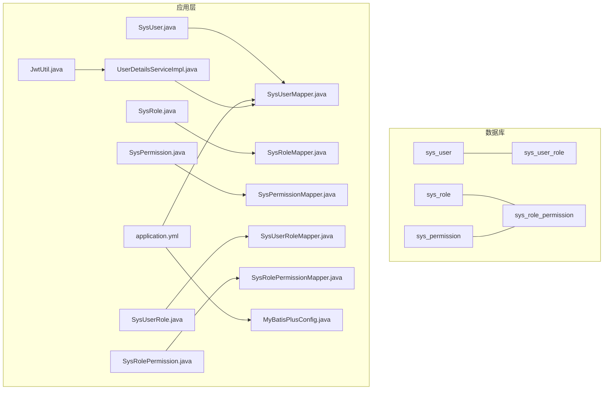
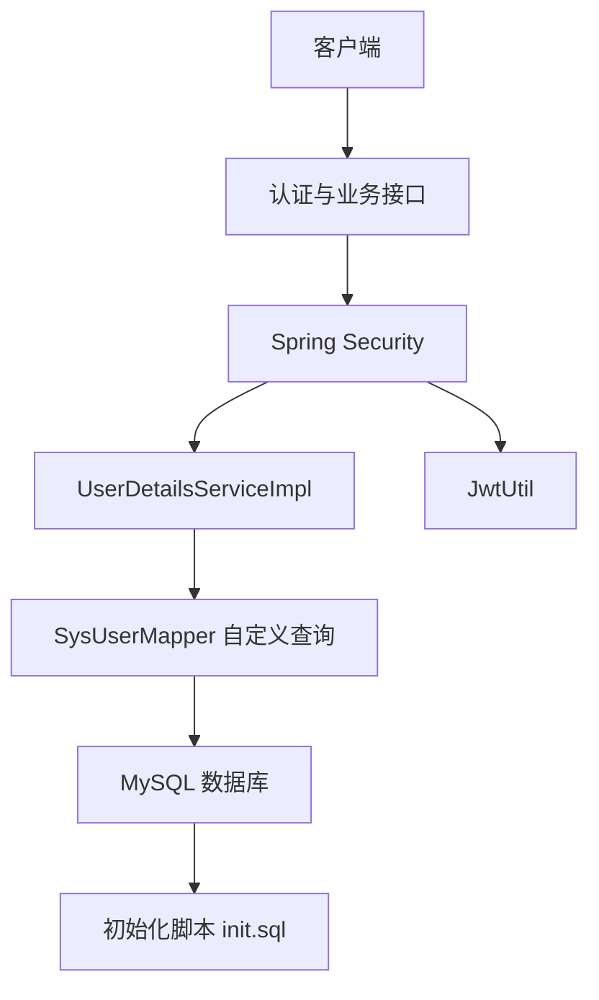
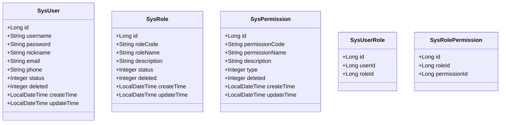
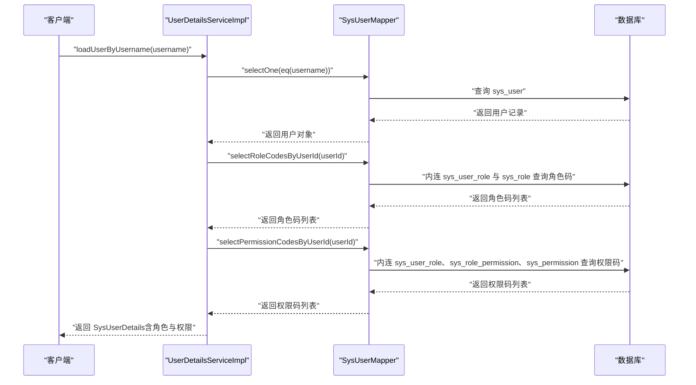
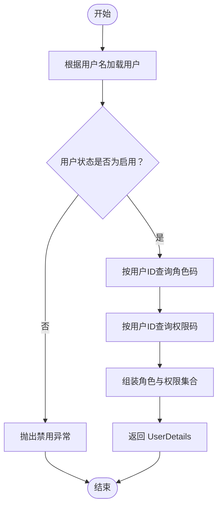
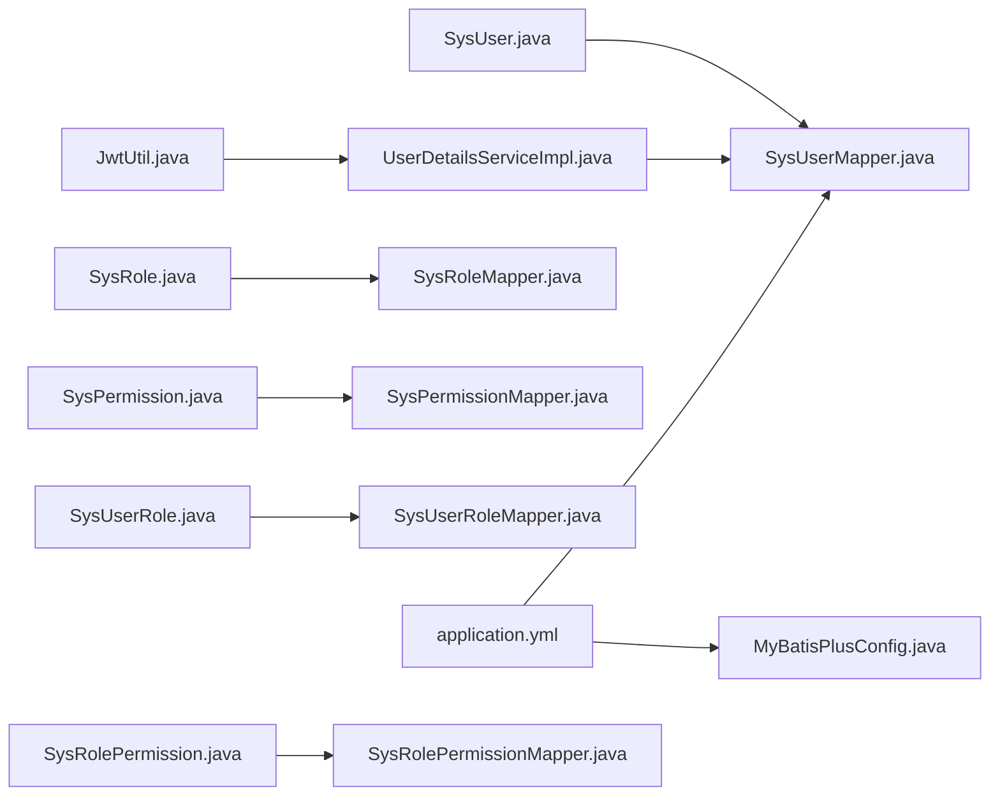
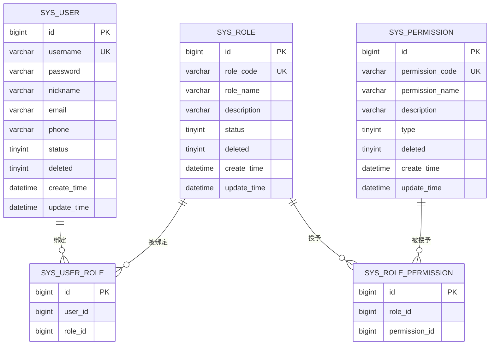

# 数据库设计

<cite>
**本文引用的文件**
- [init.sql](file://sql/init.sql)
- [SysUser.java](file://src/main/java/com/bookorder/entity/SysUser.java)
- [SysRole.java](file://src/main/java/com/bookorder/entity/SysRole.java)
- [SysPermission.java](file://src/main/java/com/bookorder/entity/SysPermission.java)
- [SysUserRole.java](file://src/main/java/com/bookorder/entity/SysUserRole.java)
- [SysRolePermission.java](file://src/main/java/com/bookorder/entity/SysRolePermission.java)
- [SysUserMapper.java](file://src/main/java/com/bookorder/mapper/SysUserMapper.java)
- [SysRoleMapper.java](file://src/main/java/com/bookorder/mapper/SysRoleMapper.java)
- [SysPermissionMapper.java](file://src/main/java/com/bookorder/mapper/SysPermissionMapper.java)
- [SysUserRoleMapper.java](file://src/main/java/com/bookorder/mapper/SysUserRoleMapper.java)
- [SysRolePermissionMapper.java](file://src/main/java/com/bookorder/mapper/SysRolePermissionMapper.java)
- [application.yml](file://src/main/resources/application.yml)
- [MyBatisPlusConfig.java](file://src/main/java/com/bookorder/config/MyBatisPlusConfig.java)
- [UserDetailsServiceImpl.java](file://src/main/java/com/bookorder/security/UserDetailsServiceImpl.java)
- [JwtUtil.java](file://src/main/java/com/bookorder/security/JwtUtil.java)
</cite>

## 目录
1. [简介](#简介)
2. [项目结构](#项目结构)
3. [核心组件](#核心组件)
4. [架构总览](#架构总览)
5. [详细组件分析](#详细组件分析)
6. [依赖分析](#依赖分析)
7. [性能考虑](#性能考虑)
8. [故障排查指南](#故障排查指南)
9. [结论](#结论)
10. [附录](#附录)

## 简介
本文件为图书订单系统的数据库设计与实现文档，围绕用户、角色、权限三元组模型展开，覆盖表结构、主外键约束、索引策略、初始化数据、逻辑删除、时间字段自动填充、MyBatis-Plus 映射与命名规范、以及基于 JWT 的鉴权集成。文档同时给出 ER 图、类图、序列图与流程图，帮助开发者快速理解与落地。

## 项目结构
- 数据库初始化脚本位于 sql/init.sql，包含数据库创建、表结构定义与初始数据插入。
- 实体层位于 entity 包，对应 sys_user、sys_role、sys_permission、sys_user_role、sys_role_permission。
- Mapper 层位于 mapper 包，继承 MyBatis-Plus 的 BaseMapper，并在 SysUserMapper 中自定义了角色与权限查询 SQL。
- 配置层位于 resources/application.yml，定义数据源、SQL 初始化、MyBatis-Plus 全局配置（下划线转驼峰、逻辑删除）。
- 安全层位于 security 包，整合 Spring Security 与 JWT，通过 UserDetailsServiceImpl 聚合角色与权限码。

图表来源
- [init.sql:11-70](file://sql/init.sql#L11-L70)
- [SysUser.java:6-25](file://src/main/java/com/bookorder/entity/SysUser.java#L6-L25)
- [SysRole.java:6-23](file://src/main/java/com/bookorder/entity/SysRole.java#L6-L23)
- [SysPermission.java:6-23](file://src/main/java/com/bookorder/entity/SysPermission.java#L6-L23)
- [SysUserRole.java:7-13](file://src/main/java/com/bookorder/entity/SysUserRole.java#L7-L13)
- [SysRolePermission.java:7-13](file://src/main/java/com/bookorder/entity/SysRolePermission.java#L7-L13)
- [SysUserMapper.java:11-24](file://src/main/java/com/bookorder/mapper/SysUserMapper.java#L11-L24)
- [application.yml:4-24](file://src/main/resources/application.yml#L4-L24)
- [MyBatisPlusConfig.java:9-22](file://src/main/java/com/bookorder/config/MyBatisPlusConfig.java#L9-L22)
- [UserDetailsServiceImpl.java:17-48](file://src/main/java/com/bookorder/security/UserDetailsServiceImpl.java#L17-L48)
- [JwtUtil.java:13-61](file://src/main/java/com/bookorder/security/JwtUtil.java#L13-L61)

章节来源
- [init.sql:1-124](file://sql/init.sql#L1-L124)
- [application.yml:1-33](file://src/main/resources/application.yml#L1-L33)

## 核心组件
- 用户表 sys_user：存储用户基本信息与状态，支持逻辑删除与时间字段自动填充。
- 角色表 sys_role：存储角色编码、名称与状态，支持逻辑删除与时间字段自动填充。
- 权限表 sys_permission：存储权限编码、名称、类型（菜单/按钮/接口），支持逻辑删除与时间字段自动填充。
- 用户-角色关联表 sys_user_role：多对多关联，唯一约束确保同一用户不能重复绑定相同角色。
- 角色-权限关联表 sys_role_permission：多对多关联，唯一约束确保同一角色不能重复绑定相同权限。

章节来源
- [init.sql:11-70](file://sql/init.sql#L11-L70)
- [SysUser.java:6-25](file://src/main/java/com/bookorder/entity/SysUser.java#L6-L25)
- [SysRole.java:6-23](file://src/main/java/com/bookorder/entity/SysRole.java#L6-L23)
- [SysPermission.java:6-23](file://src/main/java/com/bookorder/entity/SysPermission.java#L6-L23)
- [SysUserRole.java:7-13](file://src/main/java/com/bookorder/entity/SysUserRole.java#L7-L13)
- [SysRolePermission.java:7-13](file://src/main/java/com/bookorder/entity/SysRolePermission.java#L7-L13)

## 架构总览
系统采用“数据库 + MyBatis-Plus + Spring Security + JWT”的分层架构。数据库层面通过初始化脚本完成建表与默认数据；应用层通过实体类映射表结构，利用 MyBatis-Plus 的自动填充与逻辑删除配置；安全层通过 UserDetailsServiceImpl 聚合用户的角色与权限码，结合 JWT 进行认证与授权。

图表来源
- [UserDetailsServiceImpl.java:17-48](file://src/main/java/com/bookorder/security/UserDetailsServiceImpl.java#L17-L48)
- [SysUserMapper.java:14-23](file://src/main/java/com/bookorder/mapper/SysUserMapper.java#L14-L23)
- [init.sql:72-124](file://sql/init.sql#L72-L124)
- [JwtUtil.java:13-61](file://src/main/java/com/bookorder/security/JwtUtil.java#L13-L61)

## 详细组件分析

### 实体类与表结构映射
- 字段映射规则：application.yml 启用了下划线转驼峰，因此数据库字段如 user_name 对应实体的 userName。
- 逻辑删除：实体类使用 @TableLogic 标注 deleted 字段，配合全局配置实现软删除。
- 时间字段自动填充：MyBatisPlusConfig 在插入与更新时自动填充 createTime、updateTime。
- 主键策略：application.yml 设置 id-type: auto，实体类中使用 @TableId(type = IdType.AUTO)。

图表来源
- [SysUser.java:6-47](file://src/main/java/com/bookorder/entity/SysUser.java#L6-L47)
- [SysRole.java:6-41](file://src/main/java/com/bookorder/entity/SysRole.java#L6-L41)
- [SysPermission.java:6-41](file://src/main/java/com/bookorder/entity/SysPermission.java#L6-L41)
- [SysUserRole.java:7-21](file://src/main/java/com/bookorder/entity/SysUserRole.java#L7-L21)
- [SysRolePermission.java:7-21](file://src/main/java/com/bookorder/entity/SysRolePermission.java#L7-L21)

章节来源
- [application.yml:15-24](file://src/main/resources/application.yml#L15-L24)
- [MyBatisPlusConfig.java:9-22](file://src/main/java/com/bookorder/config/MyBatisPlusConfig.java#L9-L22)
- [SysUser.java:6-25](file://src/main/java/com/bookorder/entity/SysUser.java#L6-L25)
- [SysRole.java:6-23](file://src/main/java/com/bookorder/entity/SysRole.java#L6-L23)
- [SysPermission.java:6-23](file://src/main/java/com/bookorder/entity/SysPermission.java#L6-L23)
- [SysUserRole.java:7-13](file://src/main/java/com/bookorder/entity/SysUserRole.java#L7-L13)
- [SysRolePermission.java:7-13](file://src/main/java/com/bookorder/entity/SysRolePermission.java#L7-L13)

### 表结构与约束
- 主键：各表均以自增主键 id 作为标识。
- 外键：实体类未声明外键，但通过 sys_user_role 与 sys_role_permission 的 role_id、permission_id 引用 sys_role 与 sys_permission 的 id。
- 唯一约束：sys_user.username、sys_role.role_code、sys_permission.permission_code 唯一；关联表对 (user_id, role_id)、(role_id, permission_id) 建立唯一索引。
- 索引策略：除唯一索引外，建议在常用过滤字段上建立单列索引（如 sys_user.username、sys_role.role_code、sys_permission.permission_code），在关联查询上使用复合索引（如 sys_user_role(user_id)、sys_user_role(role_id)、sys_role_permission(role_id)、sys_role_permission(permission_id)）。
- 逻辑删除：deleted 字段用于软删除，默认值 0 表示未删除，全局配置将其映射为逻辑删除字段。

章节来源
- [init.sql:11-70](file://sql/init.sql#L11-L70)
- [application.yml:20-24](file://src/main/resources/application.yml#L20-L24)

### 初始化数据与默认角色权限
- 角色：ADMIN（管理员）、LIBRARIAN（图书管理员）、READER（读者）。
- 权限：涵盖系统管理、用户管理、图书管理、订单管理等模块，权限类型包括菜单、按钮、接口。
- 角色-权限映射：
  - ADMIN 拥有全部权限；
  - LIBRARIAN 拥有图书与订单管理相关权限；
  - READER 仅具备查看与下单权限。
- 默认管理员账号：用户名 admin，密码经 BCrypt 加密后存入，初始绑定 ADMIN 角色。

章节来源
- [init.sql:72-124](file://sql/init.sql#L72-L124)

### 认证与授权流程（序列图）
该流程展示从登录到获取权限码的关键步骤，包括用户查询、角色与权限码聚合、生成 JWT。

图表来源
- [UserDetailsServiceImpl.java:23-48](file://src/main/java/com/bookorder/security/UserDetailsServiceImpl.java#L23-L48)
- [SysUserMapper.java:14-23](file://src/main/java/com/bookorder/mapper/SysUserMapper.java#L14-L23)
- [init.sql:72-124](file://sql/init.sql#L72-L124)

### 权限查询算法（流程图）
该流程图抽象了 UserDetailsServiceImpl 中的角色与权限码聚合过程，便于理解查询逻辑与性能关注点。

图表来源
- [UserDetailsServiceImpl.java:23-48](file://src/main/java/com/bookorder/security/UserDetailsServiceImpl.java#L23-L48)

## 依赖分析
- 实体与表：实体类通过 @TableName 与数据库表一一对应，字段遵循下划线命名，由 MyBatis-Plus 下划线转驼峰映射。
- Mapper 接口：继承 BaseMapper，SysUserMapper 自定义 SQL 查询角色码与权限码，其余 Mapper 保持默认 CRUD。
- 配置：application.yml 统一配置数据源、SQL 初始化、MyBatis-Plus 全局行为（下划线转驼峰、逻辑删除、ID 策略）。
- 安全：UserDetailsServiceImpl 依赖 SysUserMapper 获取角色与权限码；JwtUtil 提供令牌签发与解析能力。

图表来源
- [SysUser.java:6-47](file://src/main/java/com/bookorder/entity/SysUser.java#L6-L47)
- [SysRole.java:6-41](file://src/main/java/com/bookorder/entity/SysRole.java#L6-L41)
- [SysPermission.java:6-41](file://src/main/java/com/bookorder/entity/SysPermission.java#L6-L41)
- [SysUserRole.java:7-21](file://src/main/java/com/bookorder/entity/SysUserRole.java#L7-L21)
- [SysRolePermission.java:7-21](file://src/main/java/com/bookorder/entity/SysRolePermission.java#L7-L21)
- [SysUserMapper.java:11-24](file://src/main/java/com/bookorder/mapper/SysUserMapper.java#L11-L24)
- [SysRoleMapper.java:7-9](file://src/main/java/com/bookorder/mapper/SysRoleMapper.java#L7-L9)
- [SysPermissionMapper.java:7-9](file://src/main/java/com/bookorder/mapper/SysPermissionMapper.java#L7-L9)
- [SysUserRoleMapper.java:7-9](file://src/main/java/com/bookorder/mapper/SysUserRoleMapper.java#L7-L9)
- [SysRolePermissionMapper.java:7-9](file://src/main/java/com/bookorder/mapper/SysRolePermissionMapper.java#L7-L9)
- [application.yml:15-24](file://src/main/resources/application.yml#L15-L24)
- [MyBatisPlusConfig.java:9-22](file://src/main/java/com/bookorder/config/MyBatisPlusConfig.java#L9-L22)
- [UserDetailsServiceImpl.java:17-48](file://src/main/java/com/bookorder/security/UserDetailsServiceImpl.java#L17-L48)
- [JwtUtil.java:13-61](file://src/main/java/com/bookorder/security/JwtUtil.java#L13-L61)

章节来源
- [application.yml:1-33](file://src/main/resources/application.yml#L1-L33)
- [MyBatisPlusConfig.java:9-22](file://src/main/java/com/bookorder/config/MyBatisPlusConfig.java#L9-L22)
- [SysUserMapper.java:11-24](file://src/main/java/com/bookorder/mapper/SysUserMapper.java#L11-L24)
- [UserDetailsServiceImpl.java:17-48](file://src/main/java/com/bookorder/security/UserDetailsServiceImpl.java#L17-L48)
- [JwtUtil.java:13-61](file://src/main/java/com/bookorder/security/JwtUtil.java#L13-L61)

## 性能考虑
- 索引建议
  - 单列索引：sys_user(username)、sys_role(role_code)、sys_permission(permission_code)。
  - 关联索引：sys_user_role(user_id)、sys_user_role(role_id)、sys_role_permission(role_id)、sys_role_permission(permission_id)。
- 查询优化
  - 使用自定义 SQL 时尽量减少不必要的列选择，仅返回角色码与权限码即可。
  - 避免 N+1 查询：当前实现已通过一次角色查询与一次权限查询聚合，避免多次往返。
- 逻辑删除
  - 通过 deleted 字段进行软删除，查询时需注意过滤 deleted=0，避免统计偏差。
- 时间字段
  - 利用自动填充减少业务代码负担，同时保证数据一致性与时序准确性。

[本节为通用性能指导，不直接分析具体文件]

## 故障排查指南
- 登录失败
  - 检查用户名是否存在且状态为启用；确认密码加密方式与存储一致。
  - 关注 UserDetailsServiceImpl 中的异常抛出逻辑。
- 权限不足
  - 核对 sys_role_permission 的初始化映射是否正确；确认用户是否绑定对应角色。
- 数据库连接
  - 检查 application.yml 中的数据源配置与 SQL 初始化路径。
- 逻辑删除影响
  - 若查询不到数据，确认是否遗漏过滤 deleted 字段或未启用逻辑删除配置。

章节来源
- [UserDetailsServiceImpl.java:23-48](file://src/main/java/com/bookorder/security/UserDetailsServiceImpl.java#L23-L48)
- [application.yml:4-13](file://src/main/resources/application.yml#L4-L13)
- [init.sql:72-124](file://sql/init.sql#L72-L124)

## 结论
本设计以“用户-角色-权限”为核心，通过清晰的表结构、唯一约束与初始化数据，构建了可扩展的权限体系。借助 MyBatis-Plus 的逻辑删除与自动填充、Spring Security 与 JWT 的认证授权集成，系统在保证数据完整性的同时，提供了良好的开发体验与运行效率。后续可在索引与查询路径上持续优化，以满足高并发场景下的性能需求。

[本节为总结性内容，不直接分析具体文件]

## 附录

### ERD（实体关系图）

图表来源
- [init.sql:11-70](file://sql/init.sql#L11-L70)

### MyBatis-Plus 映射与命名规范
- 表名映射：实体类通过 @TableName 指定表名，如 sys_user。
- 字段映射：数据库字段与实体属性遵循下划线转驼峰规则，如 user_name -> userName。
- 逻辑删除：实体类使用 @TableLogic 标注 deleted 字段，全局配置指定逻辑删除字段与取值。
- 自动填充：MetaObjectHandler 在插入与更新时自动填充 createTime、updateTime。
- ID 策略：全局配置 id-type: auto，实体类使用 @TableId(type = IdType.AUTO)。

章节来源
- [application.yml:15-24](file://src/main/resources/application.yml#L15-L24)
- [MyBatisPlusConfig.java:9-22](file://src/main/java/com/bookorder/config/MyBatisPlusConfig.java#L9-L22)
- [SysUser.java:6-25](file://src/main/java/com/bookorder/entity/SysUser.java#L6-L25)
- [SysRole.java:6-23](file://src/main/java/com/bookorder/entity/SysRole.java#L6-L23)
- [SysPermission.java:6-23](file://src/main/java/com/bookorder/entity/SysPermission.java#L6-L23)
- [SysUserRole.java:7-13](file://src/main/java/com/bookorder/entity/SysUserRole.java#L7-L13)
- [SysRolePermission.java:7-13](file://src/main/java/com/bookorder/entity/SysRolePermission.java#L7-L13)