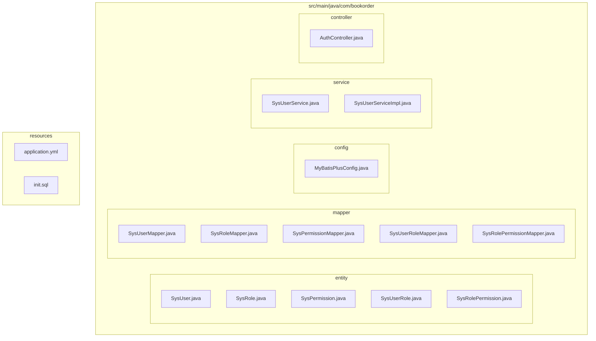
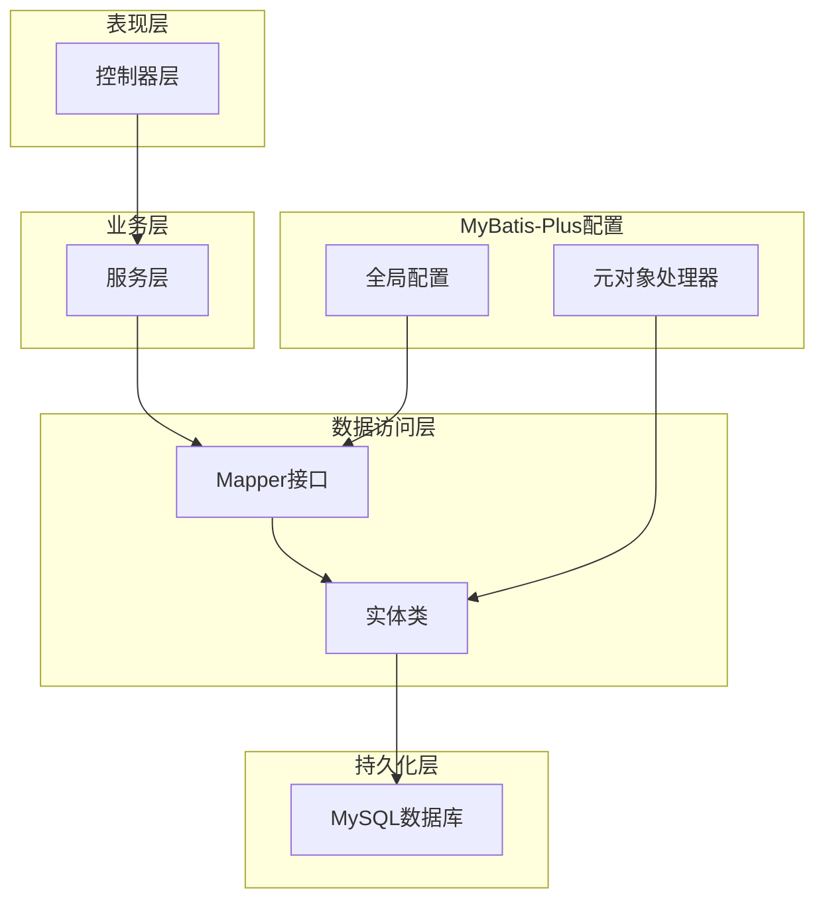
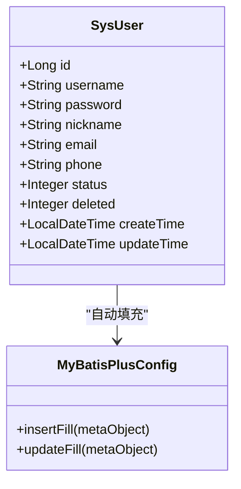
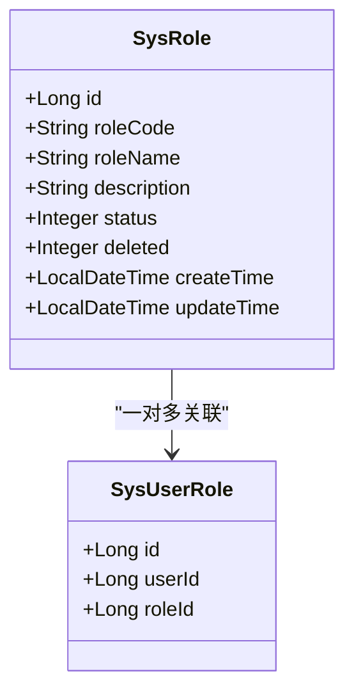
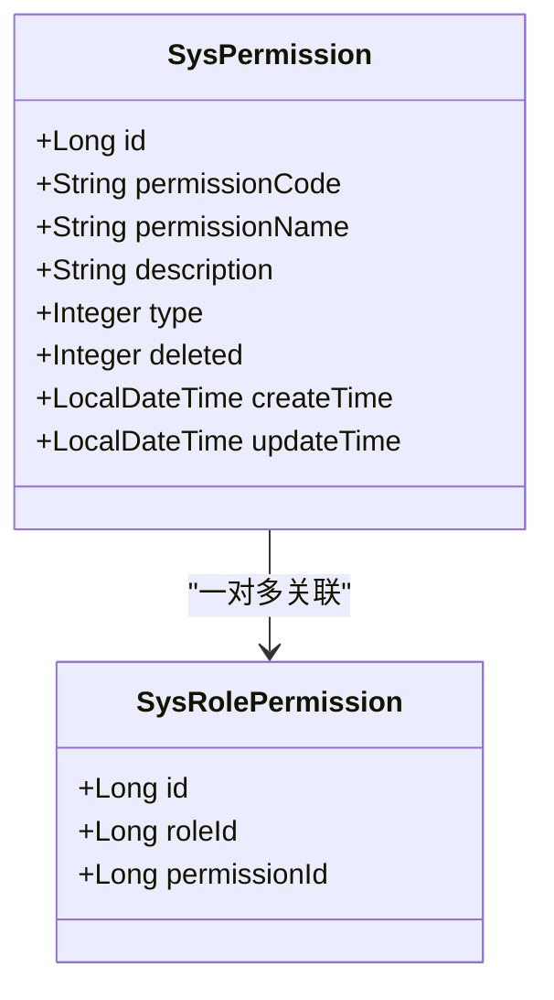
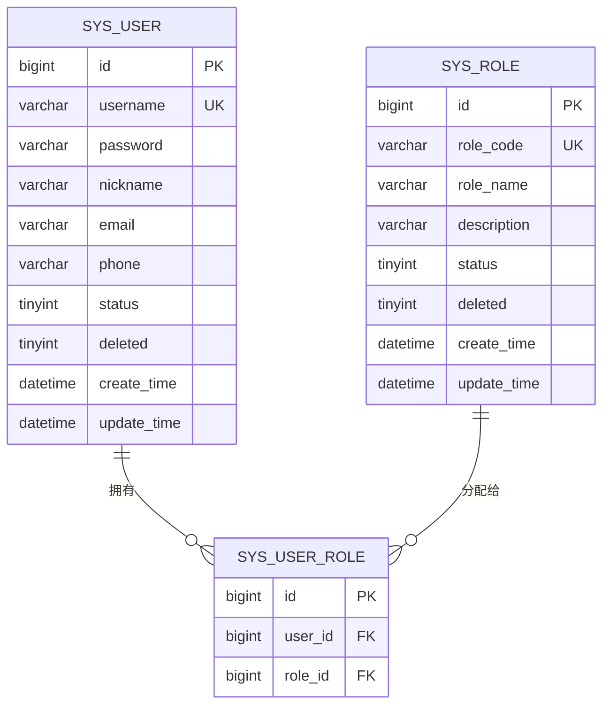
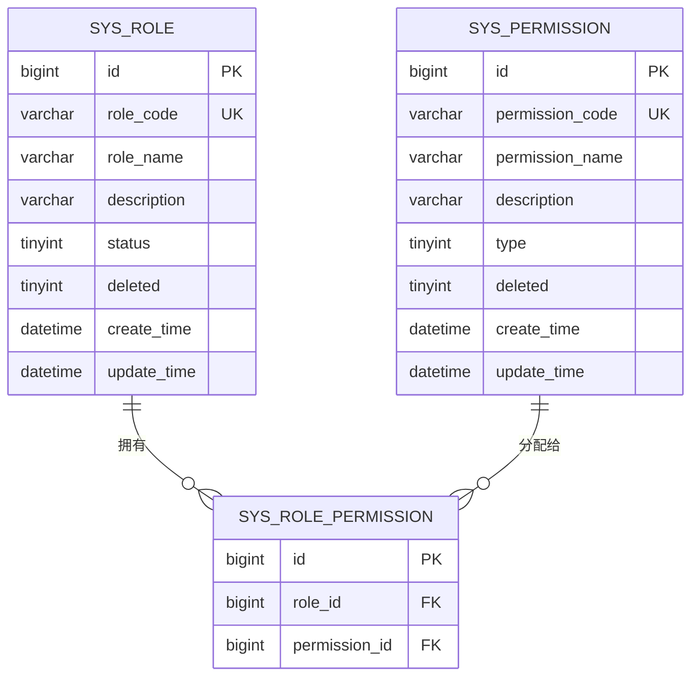
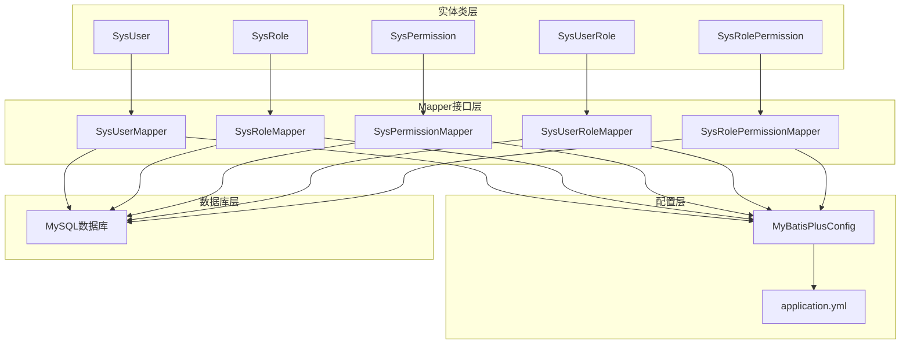
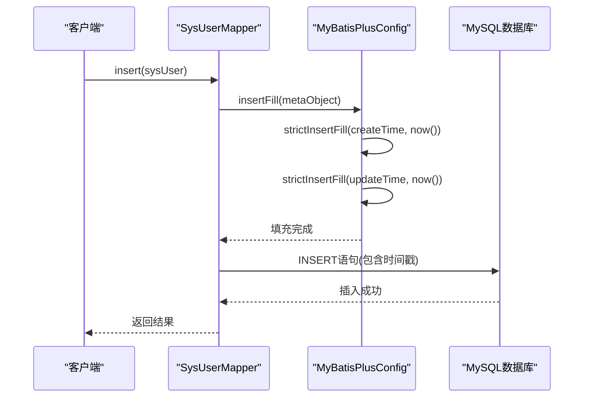
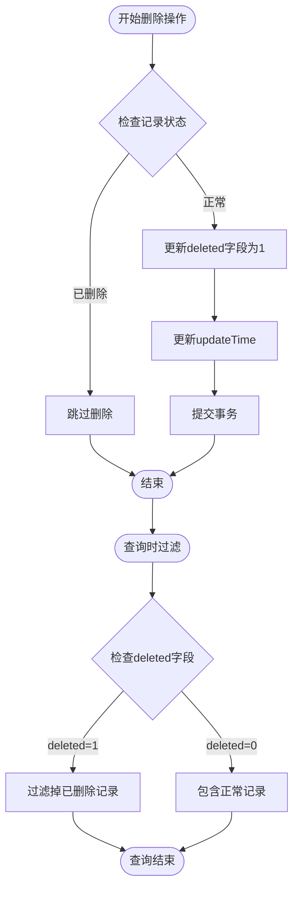

# 数据模型映射

<cite>
**本文档引用的文件**
- [SysUser.java](file://src/main/java/com/bookorder/entity/SysUser.java)
- [SysRole.java](file://src/main/java/com/bookorder/entity/SysRole.java)
- [SysPermission.java](file://src/main/java/com/bookorder/entity/SysPermission.java)
- [SysUserRole.java](file://src/main/java/com/bookorder/entity/SysUserRole.java)
- [SysRolePermission.java](file://src/main/java/com/bookorder/entity/SysRolePermission.java)
- [MyBatisPlusConfig.java](file://src/main/java/com/bookorder/config/MyBatisPlusConfig.java)
- [SysUserMapper.java](file://src/main/java/com/bookorder/mapper/SysUserMapper.java)
- [SysRoleMapper.java](file://src/main/java/com/bookorder/mapper/SysRoleMapper.java)
- [SysPermissionMapper.java](file://src/main/java/com/bookorder/mapper/SysPermissionMapper.java)
- [SysUserRoleMapper.java](file://src/main/java/com/bookorder/mapper/SysUserRoleMapper.java)
- [SysRolePermissionMapper.java](file://src/main/java/com/bookorder/mapper/SysRolePermissionMapper.java)
- [application.yml](file://src/main/resources/application.yml)
- [init.sql](file://sql/init.sql)
</cite>

## 目录
1. [简介](#简介)
2. [项目结构](#项目结构)
3. [核心组件](#核心组件)
4. [架构概览](#架构概览)
5. [详细组件分析](#详细组件分析)
6. [依赖分析](#依赖分析)
7. [性能考虑](#性能考虑)
8. [故障排除指南](#故障排除指南)
9. [结论](#结论)

## 简介

本项目是一个基于Spring Boot和MyBatis-Plus的图书订单管理系统，采用标准的分层架构设计。本文档专注于数据模型映射，详细说明Java实体类与数据库表之间的映射关系、MyBatis-Plus配置以及相关的最佳实践。

系统采用MySQL作为数据存储，包含用户管理、角色管理和权限管理等核心功能模块。通过MyBatis-Plus的自动映射机制，实现了高效的数据库操作和灵活的数据访问模式。

## 项目结构

项目采用标准的Maven多模块结构，主要包含以下核心目录：

**图表来源**
- [SysUser.java:1-48](file://src/main/java/com/bookorder/entity/SysUser.java#L1-L48)
- [MyBatisPlusConfig.java:1-23](file://src/main/java/com/bookorder/config/MyBatisPlusConfig.java#L1-L23)
- [application.yml:1-33](file://src/main/resources/application.yml#L1-L33)

**章节来源**
- [SysUser.java:1-48](file://src/main/java/com/bookorder/entity/SysUser.java#L1-L48)
- [SysRole.java:1-42](file://src/main/java/com/bookorder/entity/SysRole.java#L1-L42)
- [SysPermission.java:1-42](file://src/main/java/com/bookorder/entity/SysPermission.java#L1-L42)

## 核心组件

### 实体类设计原则

系统中的实体类遵循以下设计原则：

1. **统一的字段命名规范**
   - Java字段使用驼峰命名法（如 `createTime`）
   - 数据库字段使用下划线命名法（如 `create_time`）
   - 通过MyBatis-Plus配置实现自动转换

2. **统一的逻辑删除策略**
   - 所有实体类都包含 `deleted` 字段用于软删除
   - 使用 `@TableLogic` 注解标识逻辑删除字段

3. **统一的时间戳管理**
   - 包含 `createTime` 和 `updateTime` 字段
   - 通过MyBatis-Plus自动填充机制维护

4. **统一的状态字段**
   - 使用 `status` 字段表示记录状态
   - 通常采用0禁用、1正常的业务约定

**章节来源**
- [SysUser.java:18-25](file://src/main/java/com/bookorder/entity/SysUser.java#L18-L25)
- [SysRole.java:16-23](file://src/main/java/com/bookorder/entity/SysRole.java#L16-L23)
- [SysPermission.java:16-23](file://src/main/java/com/bookorder/entity/SysPermission.java#L16-L23)

## 架构概览

系统采用经典的三层架构模式，数据访问层通过MyBatis-Plus实现：

**图表来源**
- [MyBatisPlusConfig.java:10-22](file://src/main/java/com/bookorder/config/MyBatisPlusConfig.java#L10-L22)
- [application.yml:15-24](file://src/main/resources/application.yml#L15-L24)

## 详细组件分析

### 用户实体类映射分析

用户实体类是系统的核心实体之一，负责管理用户的基本信息和认证相关数据：

**图表来源**
- [SysUser.java:6-47](file://src/main/java/com/bookorder/entity/SysUser.java#L6-L47)
- [MyBatisPlusConfig.java:10-22](file://src/main/java/com/bookorder/config/MyBatisPlusConfig.java#L10-L22)

#### 字段映射策略

| Java字段 | 数据库字段 | 类型 | 映射注解 | 说明 |
|---------|-----------|------|----------|------|
| `id` | `id` | BIGINT | `@TableId` | 主键，自增 |
| `username` | `username` | VARCHAR(50) | 无 | 用户名，唯一 |
| `password` | `password` | VARCHAR(255) | 无 | 密码，加密存储 |
| `nickname` | `nickname` | VARCHAR(50) | 无 | 昵称 |
| `email` | `email` | VARCHAR(100) | 无 | 邮箱 |
| `phone` | `phone` | VARCHAR(20) | 无 | 电话 |
| `status` | `status` | TINYINT | 无 | 状态：0禁用/1正常 |
| `deleted` | `deleted` | TINYINT | `@TableLogic` | 逻辑删除标志 |
| `createTime` | `create_time` | DATETIME | `@TableField(fill=INSERT)` | 创建时间 |
| `updateTime` | `update_time` | DATETIME | `@TableField(fill=INSERT_UPDATE)` | 更新时间 |

**章节来源**
- [SysUser.java:9-25](file://src/main/java/com/bookorder/entity/SysUser.java#L9-L25)
- [init.sql:11-22](file://sql/init.sql#L11-L22)

### 角色实体类映射分析

角色实体类管理系统的角色定义和权限分配：

**图表来源**
- [SysRole.java:6-41](file://src/main/java/com/bookorder/entity/SysRole.java#L6-L41)
- [SysUserRole.java:7-21](file://src/main/java/com/bookorder/entity/SysUserRole.java#L7-L21)

#### 角色表字段映射

| Java字段 | 数据库字段 | 类型 | 映射注解 | 说明 |
|---------|-----------|------|----------|------|
| `id` | `id` | BIGINT | `@TableId` | 主键，自增 |
| `roleCode` | `role_code` | VARCHAR(50) | 无 | 角色编码，唯一 |
| `roleName` | `role_name` | VARCHAR(50) | 无 | 角色名称 |
| `description` | `description` | VARCHAR(255) | 无 | 描述信息 |
| `status` | `status` | TINYINT | 无 | 状态：0禁用/1正常 |
| `deleted` | `deleted` | TINYINT | `@TableLogic` | 逻辑删除标志 |
| `createTime` | `create_time` | DATETIME | `@TableField(fill=INSERT)` | 创建时间 |
| `updateTime` | `update_time` | DATETIME | `@TableField(fill=INSERT_UPDATE)` | 更新时间 |

**章节来源**
- [SysRole.java:9-23](file://src/main/java/com/bookorder/entity/SysRole.java#L9-L23)
- [init.sql:27-36](file://sql/init.sql#L27-L36)

### 权限实体类映射分析

权限实体类管理系统的权限定义和分类：

**图表来源**
- [SysPermission.java:6-41](file://src/main/java/com/bookorder/entity/SysPermission.java#L6-L41)
- [SysRolePermission.java:7-21](file://src/main/java/com/bookorder/entity/SysRolePermission.java#L7-L21)

#### 权限表字段映射

| Java字段 | 数据库字段 | 类型 | 映射注解 | 说明 |
|---------|-----------|------|----------|------|
| `id` | `id` | BIGINT | `@TableId` | 主键，自增 |
| `permissionCode` | `permission_code` | VARCHAR(100) | 无 | 权限编码，唯一 |
| `permissionName` | `permission_name` | VARCHAR(100) | 无 | 权限名称 |
| `description` | `description` | VARCHAR(255) | 无 | 描述信息 |
| `type` | `type` | TINYINT | 无 | 权限类型：1菜单/2按钮/3接口 |
| `deleted` | `deleted` | TINYINT | `@TableLogic` | 逻辑删除标志 |
| `createTime` | `create_time` | DATETIME | `@TableField(fill=INSERT)` | 创建时间 |
| `updateTime` | `update_time` | DATETIME | `@TableField(fill=INSERT_UPDATE)` | 更新时间 |

**章节来源**
- [SysPermission.java:9-23](file://src/main/java/com/bookorder/entity/SysPermission.java#L9-L23)
- [init.sql:41-50](file://sql/init.sql#L41-L50)

### 关联表实体类映射

系统使用关联表实现多对多关系管理：

#### 用户-角色关联表

**图表来源**
- [SysUserRole.java:7-21](file://src/main/java/com/bookorder/entity/SysUserRole.java#L7-L21)
- [init.sql:55-60](file://sql/init.sql#L55-L60)

#### 角色-权限关联表

**图表来源**
- [SysRolePermission.java:7-21](file://src/main/java/com/bookorder/entity/SysRolePermission.java#L7-L21)
- [init.sql:65-70](file://sql/init.sql#L65-L70)

**章节来源**
- [SysUserRole.java:1-22](file://src/main/java/com/bookorder/entity/SysUserRole.java#L1-L22)
- [SysRolePermission.java:1-22](file://src/main/java/com/bookorder/entity/SysRolePermission.java#L1-L22)

## 依赖分析

系统通过MyBatis-Plus实现ORM映射，依赖关系如下：

**图表来源**
- [MyBatisPlusConfig.java:10-22](file://src/main/java/com/bookorder/config/MyBatisPlusConfig.java#L10-L22)
- [application.yml:15-24](file://src/main/resources/application.yml#L15-L24)

### 自动填充机制

系统实现了完整的自动填充机制，确保时间戳字段的一致性：

**图表来源**
- [MyBatisPlusConfig.java:12-16](file://src/main/java/com/bookorder/config/MyBatisPlusConfig.java#L12-L16)
- [SysUser.java:21-25](file://src/main/java/com/bookorder/entity/SysUser.java#L21-L25)

### 逻辑删除配置

系统采用逻辑删除策略，避免物理删除造成的数据丢失：

**图表来源**
- [application.yml:22-24](file://src/main/resources/application.yml#L22-L24)
- [SysUser.java:18-19](file://src/main/java/com/bookorder/entity/SysUser.java#L18-L19)

**章节来源**
- [MyBatisPlusConfig.java:1-23](file://src/main/java/com/bookorder/config/MyBatisPlusConfig.java#L1-L23)
- [application.yml:15-24](file://src/main/resources/application.yml#L15-L24)

## 性能考虑

### 查询优化策略

1. **索引设计**
   - 主键索引：所有表的主键默认创建
   - 唯一索引：用户名、角色编码、权限编码等唯一约束
   - 联合索引：用户-角色、角色-权限的组合索引

2. **查询缓存**
   - 对于频繁读取但不经常变更的数据可以考虑缓存
   - 用户权限信息建议缓存以提升鉴权性能

3. **批量操作**
   - 支持批量插入和更新操作
   - 合理使用批处理减少数据库往返

### 连接池配置

系统使用HikariCP连接池，建议根据生产环境调整以下参数：
- 最小空闲连接数
- 最大池大小
- 连接超时时间
- 空闲超时时间

## 故障排除指南

### 常见问题及解决方案

#### 1. 字段映射错误

**问题描述**：Java字段与数据库字段映射不正确

**解决方案**：
- 检查 `@TableName` 和 `@TableField` 注解配置
- 确认 `application.yml` 中的 `map-underscore-to-camel-case` 设置
- 验证数据库字段名与实体类字段名的对应关系

#### 2. 自动填充失效

**问题描述**：`createTime` 和 `updateTime` 字段未自动填充

**解决方案**：
- 确认 `MyBatisPlusConfig` 类正确实现 `MetaObjectHandler`
- 检查实体类中 `@TableField(fill=...)` 注解配置
- 验证 `application.yml` 中的MyBatis-Plus配置

#### 3. 逻辑删除异常

**问题描述**：逻辑删除功能不生效

**解决方案**：
- 检查 `@TableLogic` 注解配置
- 确认 `application.yml` 中的逻辑删除字段设置
- 验证数据库中 `deleted` 字段的数据类型和默认值

#### 4. 数据库初始化失败

**问题描述**：应用启动时数据库初始化脚本执行失败

**解决方案**：
- 检查数据库连接配置
- 验证SQL脚本语法正确性
- 确认数据库权限足够执行DDL操作

**章节来源**
- [application.yml:15-24](file://src/main/resources/application.yml#L15-L24)
- [init.sql:1-124](file://sql/init.sql#L1-L124)

## 结论

本项目通过精心设计的数据模型映射和MyBatis-Plus配置，实现了高效、可靠的数据库访问层。主要特点包括：

1. **标准化的实体设计**：统一的字段命名规范和注解使用
2. **完善的自动填充机制**：确保时间戳字段的一致性和准确性
3. **灵活的逻辑删除策略**：支持软删除而不影响数据完整性
4. **清晰的关联关系**：通过关联表实现多对多关系的有效管理
5. **可扩展的架构设计**：为后续功能扩展提供了良好的基础

通过遵循本文档中介绍的最佳实践，开发者可以更好地理解和维护这个数据模型映射系统，确保应用程序的稳定性和可维护性。