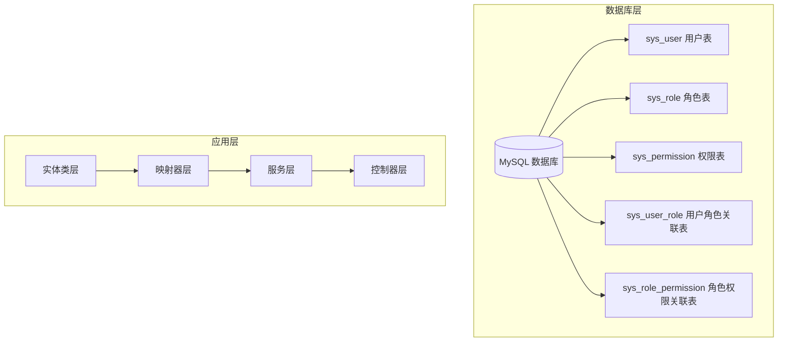
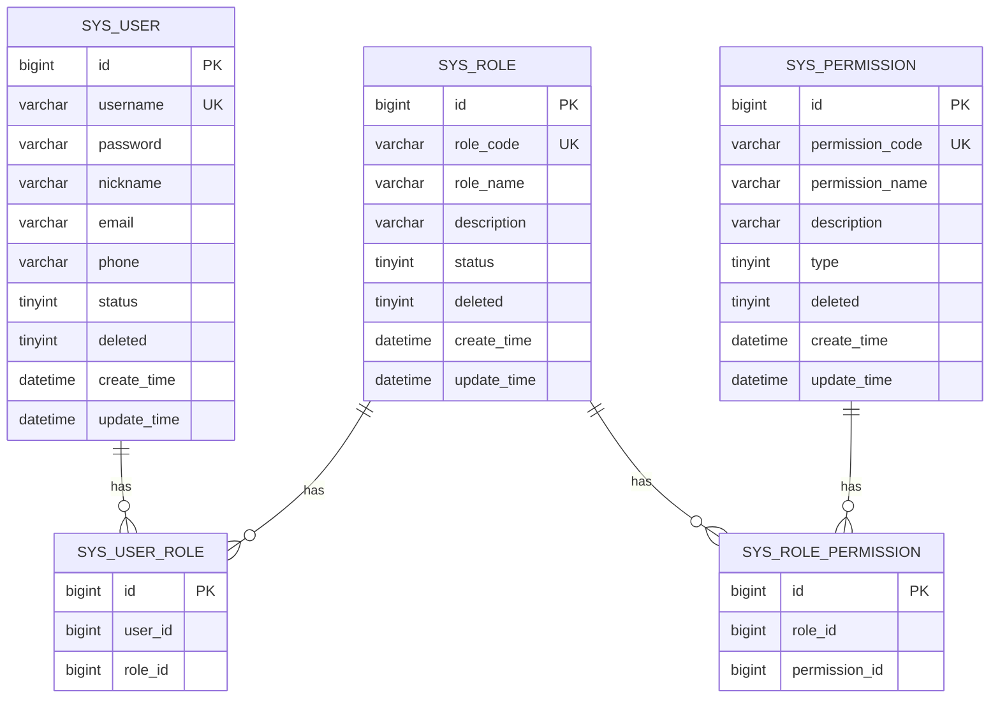
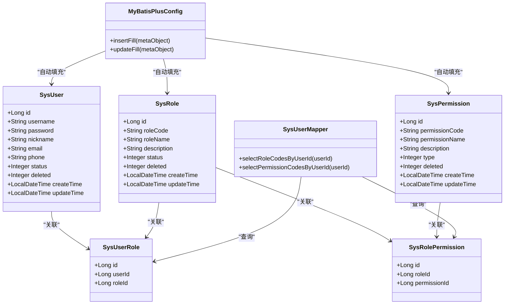

# 表结构设计

<cite>
**本文档引用的文件**
- [init.sql](file://sql/init.sql)
- [init.sql](file://src/main/resources/sql/init.sql)
- [SysUser.java](file://src/main/java/com/bookorder/entity/SysUser.java)
- [SysRole.java](file://src/main/java/com/bookorder/entity/SysRole.java)
- [SysPermission.java](file://src/main/java/com/bookorder/entity/SysPermission.java)
- [SysRolePermission.java](file://src/main/java/com/bookorder/entity/SysRolePermission.java)
- [SysUserRole.java](file://src/main/java/com/bookorder/entity/SysUserRole.java)
- [SysUserMapper.java](file://src/main/java/com/bookorder/mapper/SysUserMapper.java)
- [MyBatisPlusConfig.java](file://src/main/java/com/bookorder/config/MyBatisPlusConfig.java)
- [application.yml](file://src/main/resources/application.yml)
</cite>

## 目录
1. [简介](#简介)
2. [项目结构](#项目结构)
3. [核心组件](#核心组件)
4. [架构概览](#架构概览)
5. [详细组件分析](#详细组件分析)
6. [依赖分析](#依赖分析)
7. [性能考虑](#性能考虑)
8. [故障排除指南](#故障排除指南)
9. [结论](#结论)

## 简介

本文件详细描述图书订单系统中的数据库表结构设计，重点涵盖用户、角色、权限三个核心表及其关联表的设计。该系统采用基于MySQL的权限控制模型，通过用户-角色-权限三层关系实现细粒度的访问控制。文档将从表结构、字段定义、约束条件、索引策略、业务逻辑等多个维度进行全面分析。

## 项目结构

系统采用标准的Spring Boot分层架构，数据库初始化脚本位于resources目录下，实体类采用MyBatis Plus注解进行ORM映射。

**图表来源**
- [init.sql:11-70](file://sql/init.sql#L11-L70)
- [SysUser.java:6-47](file://src/main/java/com/bookorder/entity/SysUser.java#L6-L47)

## 核心组件

系统包含五个核心数据表，构成完整的用户权限管理体系：

### 主要表结构概览

| 表名 | 描述 | 主键 | 唯一约束 |
|------|------|------|----------|
| sys_user | 用户表 | id | username |
| sys_role | 角色表 | id | role_code |
| sys_permission | 权限表 | id | permission_code |
| sys_user_role | 用户-角色关联表 | id | (user_id, role_id) |
| sys_role_permission | 角色-权限关联表 | id | (role_id, permission_id) |

**章节来源**
- [init.sql:11-70](file://sql/init.sql#L11-L70)
- [SysUser.java:9-19](file://src/main/java/com/bookorder/entity/SysUser.java#L9-L19)

## 架构概览

系统采用经典的三层权限控制架构，通过多对多关联实现灵活的权限分配。

**图表来源**
- [init.sql:11-70](file://sql/init.sql#L11-L70)

## 详细组件分析

### sys_user 用户表

用户表是系统的核心基础表，存储所有用户的基本信息和状态管理。

#### 字段定义与业务用途

| 字段名 | 数据类型 | 长度限制 | 约束条件 | 默认值 | 业务用途 |
|--------|----------|----------|----------|--------|----------|
| id | BIGINT | - | AUTO_INCREMENT, PRIMARY KEY | - | 用户唯一标识符 |
| username | VARCHAR | 50 | NOT NULL, UNIQUE | - | 用户登录用户名 |
| password | VARCHAR | 255 | NOT NULL | - | 用户密码（BCrypt加密） |
| nickname | VARCHAR | 50 | - | - | 用户昵称 |
| email | VARCHAR | 100 | - | - | 用户邮箱地址 |
| phone | VARCHAR | 20 | - | - | 用户手机号码 |
| status | TINYINT | - | NOT NULL, DEFAULT 1 | 1 | 用户状态（0-禁用, 1-正常） |
| deleted | TINYINT | - | NOT NULL, DEFAULT 0 | 0 | 逻辑删除标志 |
| create_time | DATETIME | - | NOT NULL, DEFAULT CURRENT_TIMESTAMP | CURRENT_TIMESTAMP | 记录创建时间 |
| update_time | DATETIME | - | NOT NULL, DEFAULT CURRENT_TIMESTAMP ON UPDATE CURRENT_TIMESTAMP | CURRENT_TIMESTAMP | 记录最后更新时间 |

#### 设计要点分析

1. **主键设计**: 使用BIGINT自增主键，支持大规模用户量需求
2. **唯一约束**: username字段确保用户名全局唯一性
3. **状态管理**: 通过status字段实现用户启用/禁用控制
4. **逻辑删除**: deleted字段支持软删除，避免物理删除造成的数据丢失
5. **时间戳**: 自动维护创建和更新时间，确保审计追踪

**章节来源**
- [init.sql:11-22](file://sql/init.sql#L11-L22)
- [SysUser.java:9-25](file://src/main/java/com/bookorder/entity/SysUser.java#L9-L25)

### sys_role 角色表

角色表定义系统中的各种角色及其权限范围。

#### 字段定义与业务用途

| 字段名 | 数据类型 | 长度限制 | 约束条件 | 默认值 | 业务用途 |
|--------|----------|----------|----------|--------|----------|
| id | BIGINT | - | AUTO_INCREMENT, PRIMARY KEY | - | 角色唯一标识符 |
| role_code | VARCHAR | 50 | NOT NULL, UNIQUE | - | 角色编码（如ADMIN, LIBRARIAN等） |
| role_name | VARCHAR | 50 | NOT NULL | - | 角色显示名称 |
| description | VARCHAR | 255 | - | - | 角色功能描述 |
| status | TINYINT | - | NOT NULL, DEFAULT 1 | 1 | 角色状态（0-禁用, 1-正常） |
| deleted | TINYINT | - | NOT NULL, DEFAULT 0 | 0 | 逻辑删除标志 |
| create_time | DATETIME | - | NOT NULL, DEFAULT CURRENT_TIMESTAMP | CURRENT_TIMESTAMP | 记录创建时间 |
| update_time | DATETIME | - | NOT NULL, DEFAULT CURRENT_TIMESTAMP ON UPDATE CURRENT_TIMESTAMP | CURRENT_TIMESTAMP | 记录最后更新时间 |

#### 角色层次设计

系统预置三种基础角色：
- **ADMIN**: 系统管理员，拥有所有权限
- **LIBRARIAN**: 图书管理员，管理图书和订单
- **READER**: 普通读者，仅具备浏览和借阅权限

**章节来源**
- [init.sql:27-36](file://sql/init.sql#L27-L36)
- [SysRole.java:9-23](file://src/main/java/com/bookorder/entity/SysRole.java#L9-L23)

### sys_permission 权限表

权限表定义系统中的具体权限项，支持菜单、按钮、接口三种类型。

#### 字段定义与业务用途

| 字段名 | 数据类型 | 长度限制 | 约束条件 | 默认值 | 业务用途 |
|--------|----------|----------|----------|--------|----------|
| id | BIGINT | - | AUTO_INCREMENT, PRIMARY KEY | - | 权限唯一标识符 |
| permission_code | VARCHAR | 100 | NOT NULL, UNIQUE | - | 权限编码（如user:manage, book:list等） |
| permission_name | VARCHAR | 100 | NOT NULL | - | 权限显示名称 |
| description | VARCHAR | 255 | - | - | 权限功能描述 |
| type | TINYINT | - | NOT NULL, DEFAULT 1 | 1 | 权限类型（1-菜单, 2-按钮, 3-接口） |
| deleted | TINYINT | - | NOT NULL, DEFAULT 0 | 0 | 逻辑删除标志 |
| create_time | DATETIME | - | NOT NULL, DEFAULT CURRENT_TIMESTAMP | CURRENT_TIMESTAMP | 记录创建时间 |
| update_time | DATETIME | - | NOT NULL, DEFAULT CURRENT_TIMESTAMP ON UPDATE CURRENT_TIMESTAMP | CURRENT_TIMESTAMP | 记录最后更新时间 |

#### 权限类型分类

- **菜单权限 (type=1)**: 控制页面导航和功能模块访问
- **按钮权限 (type=2)**: 控制页面内操作按钮的可见性和可用性
- **接口权限 (type=3)**: 控制后端API接口的访问权限

**章节来源**
- [init.sql:41-50](file://sql/init.sql#L41-L50)
- [SysPermission.java:9-23](file://src/main/java/com/bookorder/entity/SysPermission.java#L9-L23)

### sys_user_role 关联表

用户-角色关联表实现用户与角色的多对多关系。

#### 字段定义

| 字段名 | 数据类型 | 约束条件 | 业务用途 |
|--------|----------|----------|----------|
| id | BIGINT | AUTO_INCREMENT, PRIMARY KEY | 关联记录唯一标识 |
| user_id | BIGINT | NOT NULL | 用户标识符 |
| role_id | BIGINT | NOT NULL | 角色标识符 |

#### 唯一约束设计

- **uk_user_role**: (user_id, role_id) 唯一索引，确保用户不能重复绑定同一角色

**章节来源**
- [init.sql:55-60](file://sql/init.sql#L55-L60)
- [SysUserRole.java:10-13](file://src/main/java/com/bookorder/entity/SysUserRole.java#L10-L13)

### sys_role_permission 关联表

角色-权限关联表实现角色与权限的多对多关系。

#### 字段定义

| 字段名 | 数据类型 | 约束条件 | 业务用途 |
|--------|----------|----------|----------|
| id | BIGINT | AUTO_INCREMENT, PRIMARY KEY | 关联记录唯一标识 |
| role_id | BIGINT | NOT NULL | 角色标识符 |
| permission_id | BIGINT | NOT NULL | 权限标识符 |

#### 唯一约束设计

- **uk_role_permission**: (role_id, permission_id) 唯一索引，确保角色不能重复拥有同一权限

**章节来源**
- [init.sql:65-70](file://sql/init.sql#L65-L70)
- [SysRolePermission.java:10-13](file://src/main/java/com/bookorder/entity/SysRolePermission.java#L10-L13)

## 依赖分析

系统通过MyBatis Plus实现ORM映射，配置了自动填充和逻辑删除功能。

**图表来源**
- [SysUser.java:6-47](file://src/main/java/com/bookorder/entity/SysUser.java#L6-L47)
- [SysRole.java:6-41](file://src/main/java/com/bookorder/entity/SysRole.java#L6-L41)
- [SysPermission.java:6-41](file://src/main/java/com/bookorder/entity/SysPermission.java#L6-L41)
- [MyBatisPlusConfig.java:10-22](file://src/main/java/com/bookorder/config/MyBatisPlusConfig.java#L10-L22)

### 数据完整性保证机制

1. **主键约束**: 所有表均定义主键，确保记录唯一性
2. **外键约束**: 关联表通过业务逻辑保证引用完整性
3. **唯一约束**: 关键字段（username、role_code、permission_code）设置唯一性
4. **逻辑删除**: 通过deleted字段实现软删除，保护历史数据
5. **自动填充**: MyBatis Plus配置自动维护时间戳字段

**章节来源**
- [application.yml:20-24](file://src/main/resources/application.yml#L20-L24)
- [MyBatisPlusConfig.java:12-21](file://src/main/java/com/bookorder/config/MyBatisPlusConfig.java#L12-L21)

## 性能考虑

### 索引策略

1. **主键索引**: 所有表的主键字段自动建立聚簇索引
2. **唯一索引**: 关键唯一字段建立唯一索引
3. **组合索引**: 关联表的联合字段建立复合唯一索引

### 查询优化

1. **权限查询**: 提供专门的SQL查询方法，使用INNER JOIN优化权限查询性能
2. **批量操作**: 支持批量插入和更新操作
3. **缓存策略**: 可结合Redis实现权限缓存，减少数据库查询压力

## 故障排除指南

### 常见问题及解决方案

1. **用户重复注册**: 系统会因username唯一约束而拒绝重复注册请求
2. **权限不足**: 通过权限查询接口验证用户权限，确保访问控制
3. **逻辑删除**: 软删除机制避免误删重要数据，可通过查询条件过滤

**章节来源**
- [SysUserMapper.java:14-23](file://src/main/java/com/bookorder/mapper/SysUserMapper.java#L14-L23)

## 结论

该图书订单系统的表结构设计遵循了数据库规范化原则，通过清晰的实体关系和完善的约束机制，实现了灵活且安全的权限控制体系。系统采用逻辑删除和自动时间戳填充等现代数据库设计模式，既保证了数据完整性，又提供了良好的可维护性。推荐的索引策略和查询优化方案能够满足大多数业务场景的需求，为系统的稳定运行奠定了坚实的基础。