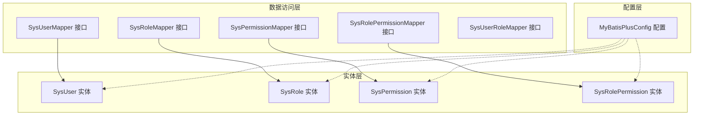
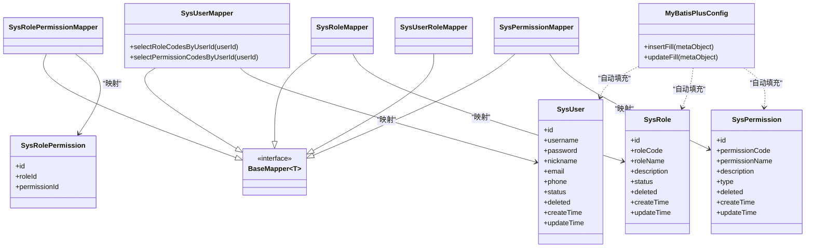
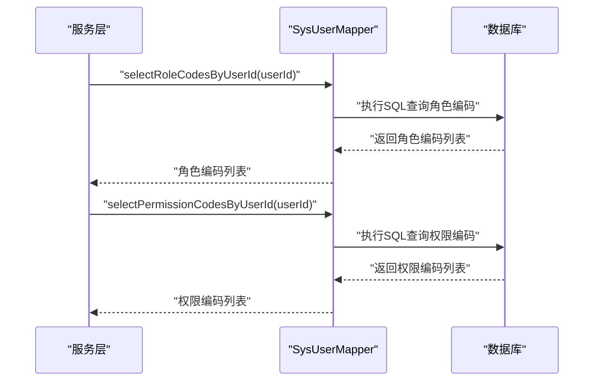
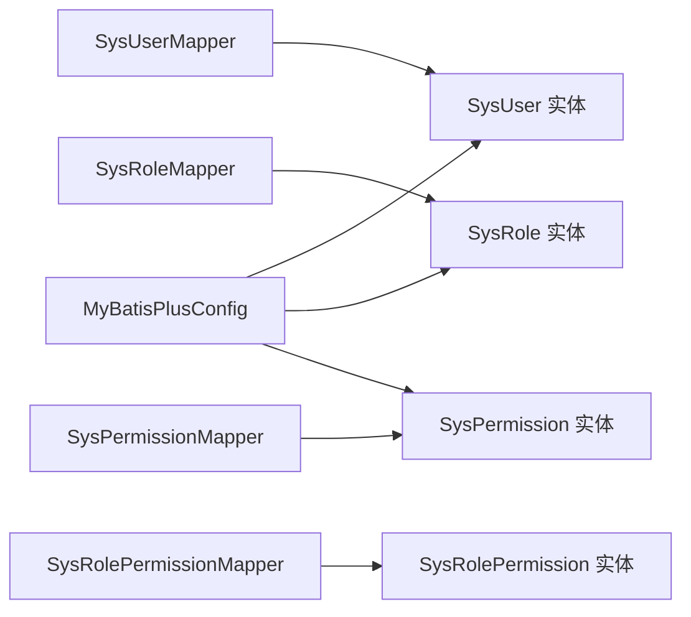

# Mapper接口设计

<cite>
**本文引用的文件**
- [SysUserMapper.java](file://src/main/java/com/bookorder/mapper/SysUserMapper.java)
- [SysRoleMapper.java](file://src/main/java/com/bookorder/mapper/SysRoleMapper.java)
- [SysPermissionMapper.java](file://src/main/java/com/bookorder/mapper/SysPermissionMapper.java)
- [SysRolePermissionMapper.java](file://src/main/java/com/bookorder/mapper/SysRolePermissionMapper.java)
- [SysUserRoleMapper.java](file://src/main/java/com/bookorder/mapper/SysUserRoleMapper.java)
- [MyBatisPlusConfig.java](file://src/main/java/com/bookorder/config/MyBatisPlusConfig.java)
- [SysUser.java](file://src/main/java/com/bookorder/entity/SysUser.java)
- [SysRole.java](file://src/main/java/com/bookorder/entity/SysRole.java)
- [SysPermission.java](file://src/main/java/com/bookorder/entity/SysPermission.java)
- [SysRolePermission.java](file://src/main/java/com/bookorder/entity/SysRolePermission.java)
</cite>

## 目录
1. [引言](#引言)
2. [项目结构](#项目结构)
3. [核心组件](#核心组件)
4. [架构总览](#架构总览)
5. [详细组件分析](#详细组件分析)
6. [依赖分析](#依赖分析)
7. [性能考虑](#性能考虑)
8. [故障排查指南](#故障排查指南)
9. [结论](#结论)
10. [附录](#附录)

## 引言
本文件围绕系统中的Mapper接口设计进行系统化技术说明，重点覆盖以下方面：
- Mapper接口的继承关系与泛型参数配置
- 基础CRUD与扩展方法的实现方式
- 条件构造器与动态SQL的使用要点
- 主键策略与ID生成机制
- 复杂查询、批量操作、分页与联表查询的最佳实践
- Mapper与实体类的映射关系与命名规范

## 项目结构
本项目采用标准的分层架构，Mapper位于数据访问层，与实体类、配置类协同工作：
- 实体类：位于entity包，标注MyBatis-Plus注解以声明表名、主键策略、逻辑删除与自动填充字段
- Mapper接口：位于mapper包，统一继承BaseMapper并绑定对应实体类型
- 配置类：位于config包，提供MetaObjectHandler用于自动填充时间字段

图表来源
- [SysUserMapper.java:1-25](file://src/main/java/com/bookorder/mapper/SysUserMapper.java#L1-L25)
- [SysRoleMapper.java:1-10](file://src/main/java/com/bookorder/mapper/SysRoleMapper.java#L1-L10)
- [SysPermissionMapper.java:1-10](file://src/main/java/com/bookorder/mapper/SysPermissionMapper.java#L1-L10)
- [SysRolePermissionMapper.java:1-10](file://src/main/java/com/bookorder/mapper/SysRolePermissionMapper.java#L1-L10)
- [SysUserRoleMapper.java:1-10](file://src/main/java/com/bookorder/mapper/SysUserRoleMapper.java#L1-L10)
- [MyBatisPlusConfig.java:1-23](file://src/main/java/com/bookorder/config/MyBatisPlusConfig.java#L1-L23)
- [SysUser.java:1-48](file://src/main/java/com/bookorder/entity/SysUser.java#L1-L48)
- [SysRole.java:1-42](file://src/main/java/com/bookorder/entity/SysRole.java#L1-L42)
- [SysPermission.java:1-42](file://src/main/java/com/bookorder/entity/SysPermission.java#L1-L42)
- [SysRolePermission.java:1-22](file://src/main/java/com/bookorder/entity/SysRolePermission.java#L1-L22)

章节来源
- [SysUserMapper.java:1-25](file://src/main/java/com/bookorder/mapper/SysUserMapper.java#L1-L25)
- [SysRoleMapper.java:1-10](file://src/main/java/com/bookorder/mapper/SysRoleMapper.java#L1-L10)
- [SysPermissionMapper.java:1-10](file://src/main/java/com/bookorder/mapper/SysPermissionMapper.java#L1-L10)
- [SysRolePermissionMapper.java:1-10](file://src/main/java/com/bookorder/mapper/SysRolePermissionMapper.java#L1-L10)
- [SysUserRoleMapper.java:1-10](file://src/main/java/com/bookorder/mapper/SysUserRoleMapper.java#L1-L10)
- [MyBatisPlusConfig.java:1-23](file://src/main/java/com/bookorder/config/MyBatisPlusConfig.java#L1-L23)
- [SysUser.java:1-48](file://src/main/java/com/bookorder/entity/SysUser.java#L1-L48)
- [SysRole.java:1-42](file://src/main/java/com/bookorder/entity/SysRole.java#L1-L42)
- [SysPermission.java:1-42](file://src/main/java/com/bookorder/entity/SysPermission.java#L1-L42)
- [SysRolePermission.java:1-22](file://src/main/java/com/bookorder/entity/SysRolePermission.java#L1-L22)

## 核心组件
- 继承关系与泛型参数
  - 所有Mapper接口均通过泛型参数绑定对应实体类，并继承BaseMapper，从而获得标准CRUD能力
  - 典型形式为：接口 extends BaseMapper<实体类>
- 自动填充配置
  - 通过实现MetaObjectHandler，在插入与更新时自动填充时间字段，减少业务代码重复
- 实体注解要点
  - 表名映射：@TableName
  - 主键策略：@TableId(type=IdType.AUTO)
  - 逻辑删除：@TableLogic
  - 字段自动填充：@TableField(fill=FieldFill.INSERT[_UPDATE])

章节来源
- [SysUserMapper.java:11-12](file://src/main/java/com/bookorder/mapper/SysUserMapper.java#L11-L12)
- [SysRoleMapper.java:7-8](file://src/main/java/com/bookorder/mapper/SysRoleMapper.java#L7-L8)
- [SysPermissionMapper.java:7-8](file://src/main/java/com/bookorder/mapper/SysPermissionMapper.java#L7-L8)
- [SysRolePermissionMapper.java:7-8](file://src/main/java/com/bookorder/mapper/SysRolePermissionMapper.java#L7-L8)
- [SysUserRoleMapper.java:7-8](file://src/main/java/com/bookorder/mapper/SysUserRoleMapper.java#L7-L8)
- [MyBatisPlusConfig.java:10-22](file://src/main/java/com/bookorder/config/MyBatisPlusConfig.java#L10-L22)
- [SysUser.java:6](file://src/main/java/com/bookorder/entity/SysUser.java#L6)
- [SysRole.java:6](file://src/main/java/com/bookorder/entity/SysRole.java#L6)
- [SysPermission.java:6](file://src/main/java/com/bookorder/entity/SysPermission.java#L6)
- [SysRolePermission.java:7](file://src/main/java/com/bookorder/entity/SysRolePermission.java#L7)
- [SysUser.java:9](file://src/main/java/com/bookorder/entity/SysUser.java#L9)
- [SysRole.java:9](file://src/main/java/com/bookorder/entity/SysRole.java#L9)
- [SysPermission.java:9](file://src/main/java/com/bookorder/entity/SysPermission.java#L9)
- [SysRolePermission.java:10](file://src/main/java/com/bookorder/entity/SysRolePermission.java#L10)
- [SysUser.java:18](file://src/main/java/com/bookorder/entity/SysUser.java#L18)
- [SysRole.java:16](file://src/main/java/com/bookorder/entity/SysRole.java#L16)
- [SysPermission.java:16](file://src/main/java/com/bookorder/entity/SysPermission.java#L16)
- [SysUser.java:21](file://src/main/java/com/bookorder/entity/SysUser.java#L21)
- [SysRole.java:19](file://src/main/java/com/bookorder/entity/SysRole.java#L19)
- [SysPermission.java:19](file://src/main/java/com/bookorder/entity/SysPermission.java#L19)
- [SysUser.java:24](file://src/main/java/com/bookorder/entity/SysUser.java#L24)
- [SysRole.java:22](file://src/main/java/com/bookorder/entity/SysRole.java#L22)
- [SysPermission.java:22](file://src/main/java/com/bookorder/entity/SysPermission.java#L22)

## 架构总览
下图展示Mapper接口与其对应实体及配置之间的关系，以及扩展方法的典型调用路径。

图表来源
- [SysUserMapper.java:11-23](file://src/main/java/com/bookorder/mapper/SysUserMapper.java#L11-L23)
- [SysRoleMapper.java:7-8](file://src/main/java/com/bookorder/mapper/SysRoleMapper.java#L7-L8)
- [SysPermissionMapper.java:7-8](file://src/main/java/com/bookorder/mapper/SysPermissionMapper.java#L7-L8)
- [SysRolePermissionMapper.java:7-8](file://src/main/java/com/bookorder/mapper/SysRolePermissionMapper.java#L7-L8)
- [SysUserRoleMapper.java:7-8](file://src/main/java/com/bookorder/mapper/SysUserRoleMapper.java#L7-L8)
- [SysUser.java:1-48](file://src/main/java/com/bookorder/entity/SysUser.java#L1-L48)
- [SysRole.java:1-42](file://src/main/java/com/bookorder/entity/SysRole.java#L1-L42)
- [SysPermission.java:1-42](file://src/main/java/com/bookorder/entity/SysPermission.java#L1-L42)
- [SysRolePermission.java:1-22](file://src/main/java/com/bookorder/entity/SysRolePermission.java#L1-L22)
- [MyBatisPlusConfig.java:10-22](file://src/main/java/com/bookorder/config/MyBatisPlusConfig.java#L10-L22)

## 详细组件分析

### SysUserMapper 扩展方法
- 角色编码查询：根据用户ID查询其角色编码列表
- 权限编码查询：根据用户ID查询其权限编码列表（去重）
- 实现方式：通过@Select注解编写原生SQL，使用@Param标注参数
- 调用建议：在服务层组合查询结果，构建用户的角色与权限集合

图表来源
- [SysUserMapper.java:14-23](file://src/main/java/com/bookorder/mapper/SysUserMapper.java#L14-L23)

章节来源
- [SysUserMapper.java:14-23](file://src/main/java/com/bookorder/mapper/SysUserMapper.java#L14-L23)

### 其他Mapper接口
- SysRoleMapper、SysPermissionMapper、SysRolePermissionMapper、SysUserRoleMapper均直接继承BaseMapper，无需额外扩展方法即可获得标准CRUD能力
- 适用场景：通用增删改查、条件构造器查询、分页查询等

章节来源
- [SysRoleMapper.java:7-8](file://src/main/java/com/bookorder/mapper/SysRoleMapper.java#L7-L8)
- [SysPermissionMapper.java:7-8](file://src/main/java/com/bookorder/mapper/SysPermissionMapper.java#L7-L8)
- [SysRolePermissionMapper.java:7-8](file://src/main/java/com/bookorder/mapper/SysRolePermissionMapper.java#L7-L8)
- [SysUserRoleMapper.java:7-8](file://src/main/java/com/bookorder/mapper/SysUserRoleMapper.java#L7-L8)

### 实体类与注解映射
- 表名映射：@TableName("表名")
- 主键策略：@TableId(type=IdType.AUTO)，依赖数据库自增
- 逻辑删除：@TableLogic，配合查询时自动过滤已删除记录
- 自动填充：@TableField(fill=FieldFill.INSERT[_UPDATE])，结合MetaObjectHandler在插入/更新时自动写入时间字段

章节来源
- [SysUser.java:6](file://src/main/java/com/bookorder/entity/SysUser.java#L6)
- [SysRole.java:6](file://src/main/java/com/bookorder/entity/SysRole.java#L6)
- [SysPermission.java:6](file://src/main/java/com/bookorder/entity/SysPermission.java#L6)
- [SysRolePermission.java:7](file://src/main/java/com/bookorder/entity/SysRolePermission.java#L7)
- [SysUser.java:9](file://src/main/java/com/bookorder/entity/SysUser.java#L9)
- [SysRole.java:9](file://src/main/java/com/bookorder/entity/SysRole.java#L9)
- [SysPermission.java:9](file://src/main/java/com/bookorder/entity/SysPermission.java#L9)
- [SysRolePermission.java:10](file://src/main/java/com/bookorder/entity/SysRolePermission.java#L10)
- [SysUser.java:18](file://src/main/java/com/bookorder/entity/SysUser.java#L18)
- [SysRole.java:16](file://src/main/java/com/bookorder/entity/SysRole.java#L16)
- [SysPermission.java:16](file://src/main/java/com/bookorder/entity/SysPermission.java#L16)
- [SysUser.java:21](file://src/main/java/com/bookorder/entity/SysUser.java#L21)
- [SysRole.java:19](file://src/main/java/com/bookorder/entity/SysRole.java#L19)
- [SysPermission.java:19](file://src/main/java/com/bookorder/entity/SysPermission.java#L19)
- [SysUser.java:24](file://src/main/java/com/bookorder/entity/SysUser.java#L24)
- [SysRole.java:22](file://src/main/java/com/bookorder/entity/SysRole.java#L22)
- [SysPermission.java:22](file://src/main/java/com/bookorder/entity/SysPermission.java#L22)

### 条件构造器与动态SQL
- 条件构造器：推荐在服务层使用QueryWrapper/UpdateWrapper等条件构造器，实现安全、可读的动态查询与更新
- 动态SQL：对于复杂关联查询或跨表聚合，可在XML中编写动态SQL；若需在注解中实现，优先使用条件构造器封装
- 本项目中SysUserMapper已通过@Select提供特定查询，其他通用场景建议使用条件构造器

章节来源
- [SysUserMapper.java:14-23](file://src/main/java/com/bookorder/mapper/SysUserMapper.java#L14-L23)

### 主键策略与ID生成
- 策略选择：统一采用IdType.AUTO，依赖数据库自增列
- 注意事项：分布式环境或需要自定义ID时，可考虑雪花算法等策略；当前配置适用于单库单实例场景

章节来源
- [SysUser.java:9](file://src/main/java/com/bookorder/entity/SysUser.java#L9)
- [SysRole.java:9](file://src/main/java/com/bookorder/entity/SysRole.java#L9)
- [SysPermission.java:9](file://src/main/java/com/bookorder/entity/SysPermission.java#L9)
- [SysRolePermission.java:10](file://src/main/java/com/bookorder/entity/SysRolePermission.java#L10)

### 自动填充与逻辑删除
- 自动填充：MetaObjectHandler在插入与更新时自动设置时间字段，避免重复代码
- 逻辑删除：实体类标注@TableLogic，查询时自动过滤deleted=1的数据，确保数据安全

章节来源
- [MyBatisPlusConfig.java:10-22](file://src/main/java/com/bookorder/config/MyBatisPlusConfig.java#L10-L22)
- [SysUser.java:18](file://src/main/java/com/bookorder/entity/SysUser.java#L18)
- [SysRole.java:16](file://src/main/java/com/bookorder/entity/SysRole.java#L16)
- [SysPermission.java:16](file://src/main/java/com/bookorder/entity/SysPermission.java#L16)

## 依赖分析
- 组件耦合
  - Mapper与实体强绑定，通过泛型参数建立编译期约束
  - 扩展方法与数据库表结构紧密耦合，变更表结构需同步调整SQL
- 外部依赖
  - MyBatis-Plus提供的BaseMapper与条件构造器
  - Spring容器管理的MetaObjectHandler

图表来源
- [SysUserMapper.java:11-12](file://src/main/java/com/bookorder/mapper/SysUserMapper.java#L11-L12)
- [SysRoleMapper.java:7-8](file://src/main/java/com/bookorder/mapper/SysRoleMapper.java#L7-L8)
- [SysPermissionMapper.java:7-8](file://src/main/java/com/bookorder/mapper/SysPermissionMapper.java#L7-L8)
- [SysRolePermissionMapper.java:7-8](file://src/main/java/com/bookorder/mapper/SysRolePermissionMapper.java#L7-L8)
- [MyBatisPlusConfig.java:10-22](file://src/main/java/com/bookorder/config/MyBatisPlusConfig.java#L10-L22)
- [SysUser.java:1-48](file://src/main/java/com/bookorder/entity/SysUser.java#L1-L48)
- [SysRole.java:1-42](file://src/main/java/com/bookorder/entity/SysRole.java#L1-L42)
- [SysPermission.java:1-42](file://src/main/java/com/bookorder/entity/SysPermission.java#L1-L42)
- [SysRolePermission.java:1-22](file://src/main/java/com/bookorder/entity/SysRolePermission.java#L1-L22)

## 性能考虑
- 查询优化
  - 为常用过滤字段与连接字段建立索引，避免全表扫描
  - 使用SelectList/SelectMaps减少不必要的对象映射开销
- 分页查询
  - 使用IPage与分页插件，避免一次性加载大量数据
- 批量操作
  - 对于大批量插入/更新，使用批量接口或批处理语句，降低网络往返
- 关联查询
  - 尽量在应用层组装数据，避免N+1查询；必要时使用JOIN并在服务层做DTO转换

## 故障排查指南
- 插入/更新时间未填充
  - 检查MetaObjectHandler是否被Spring加载，确认实体字段注解与处理器一致
- 逻辑删除导致查询不到数据
  - 确认查询是否正确处理deleted字段；必要时显式传入条件排除逻辑删除
- SQL错误或字段不匹配
  - 检查@TableName与实体字段注解是否与数据库一致；核对扩展方法SQL语法

章节来源
- [MyBatisPlusConfig.java:10-22](file://src/main/java/com/bookorder/config/MyBatisPlusConfig.java#L10-L22)
- [SysUser.java:18](file://src/main/java/com/bookorder/entity/SysUser.java#L18)
- [SysRole.java:16](file://src/main/java/com/bookorder/entity/SysRole.java#L16)
- [SysPermission.java:16](file://src/main/java/com/bookorder/entity/SysPermission.java#L16)

## 结论
本项目基于MyBatis-Plus实现了标准化的Mapper接口设计：统一继承BaseMapper获得标准CRUD能力，通过注解完成表名、主键、逻辑删除与自动填充的声明式配置；在SysUserMapper中提供了基于@Select的扩展查询，满足角色与权限的快速获取需求。整体设计简洁清晰，具备良好的可维护性与扩展性。

## 附录
- 命名规范建议
  - Mapper接口：实体名+Mapper，如SysUserMapper
  - 实体类：与表名一一对应，使用驼峰命名
  - 注解使用：@TableName、@TableId、@TableLogic、@TableField
- 最佳实践清单
  - 优先使用条件构造器与分页插件
  - 扩展方法尽量保持单一职责，避免复杂SQL
  - 对高频查询建立索引，关注慢查询日志
  - 批量操作时控制批次大小，避免内存压力