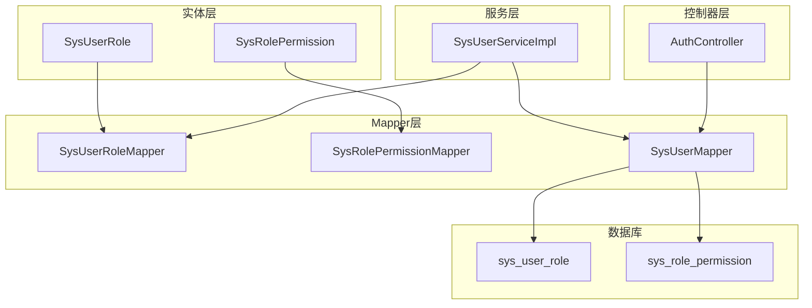
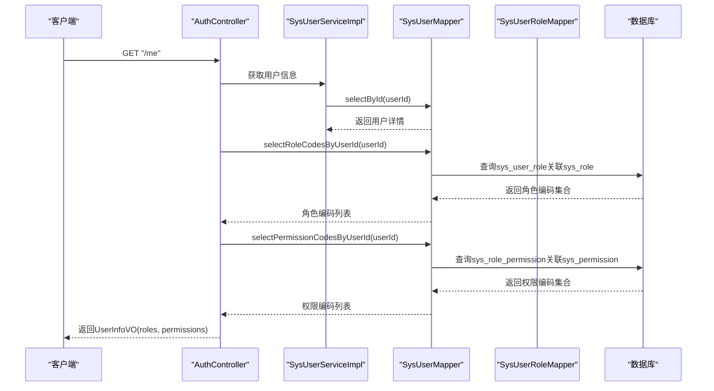
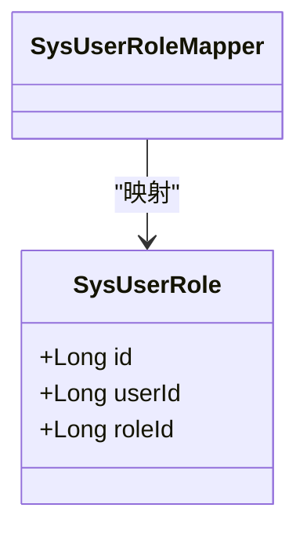
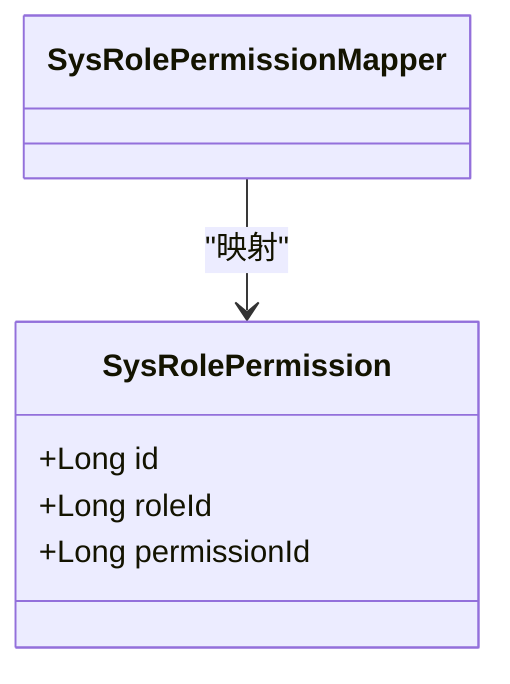
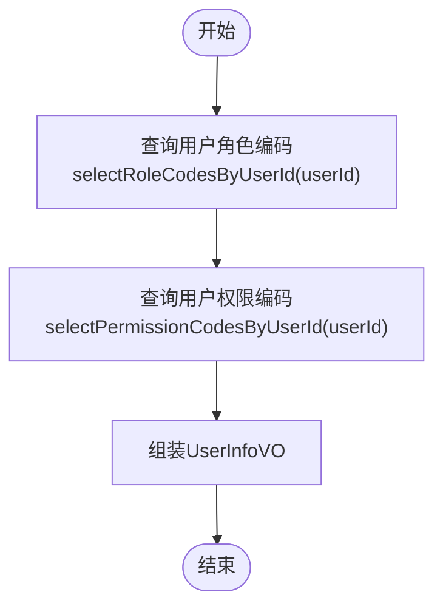
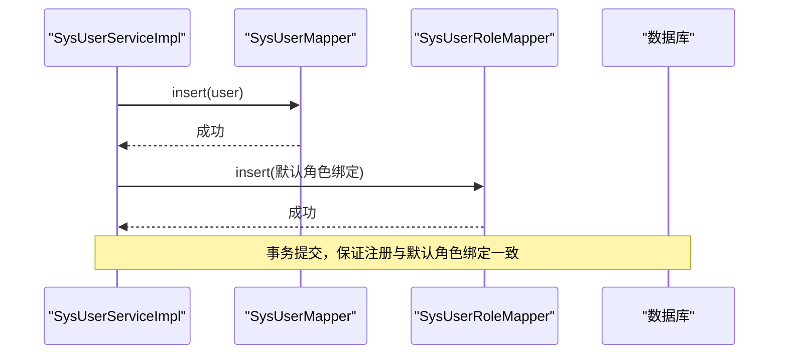
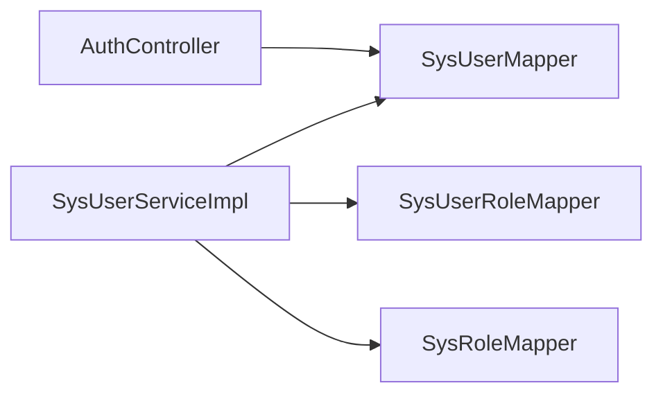

# 关联关系Mapper

<cite>
**本文引用的文件**
- [SysUserRoleMapper.java](file://src/main/java/com/bookorder/mapper/SysUserRoleMapper.java)
- [SysRolePermissionMapper.java](file://src/main/java/com/bookorder/mapper/SysRolePermissionMapper.java)
- [SysUserRole.java](file://src/main/java/com/bookorder/entity/SysUserRole.java)
- [SysRolePermission.java](file://src/main/java/com/bookorder/entity/SysRolePermission.java)
- [SysUserMapper.java](file://src/main/java/com/bookorder/mapper/SysUserMapper.java)
- [SysUserServiceImpl.java](file://src/main/java/com/bookorder/service/impl/SysUserServiceImpl.java)
- [init.sql](file://sql/init.sql)
- [AuthController.java](file://src/main/java/com/bookorder/controller/AuthController.java)
- [UserInfoVO.java](file://src/main/java/com/bookorder/dto/UserInfoVO.java)
</cite>

## 目录
1. [引言](#引言)
2. [项目结构](#项目结构)
3. [核心组件](#核心组件)
4. [架构总览](#架构总览)
5. [详细组件分析](#详细组件分析)
6. [依赖分析](#依赖分析)
7. [性能考虑](#性能考虑)
8. [故障排查指南](#故障排查指南)
9. [结论](#结论)
10. [附录](#附录)

## 引言
本文件聚焦于“关联关系Mapper”的设计与实现，围绕用户-角色（SysUserRole）与角色-权限（SysRolePermission）两张多对多关联表的Mapper展开，系统性阐述：
- 多对多关系的数据访问模式与MyBatis-Plus的使用方式
- 关联数据的增删改查在当前代码中的体现与扩展点
- 基于现有Mapper的关联查询SQL实现与性能优化策略
- 关联关系维护的最佳实践与事务处理方案
- 用户角色分配与角色权限绑定的一致性保障机制

## 项目结构
与关联关系Mapper直接相关的模块包括：
- 实体层：SysUserRole、SysRolePermission
- Mapper层：SysUserRoleMapper、SysRolePermissionMapper、SysUserMapper
- 服务层：SysUserServiceImpl（演示事务内维护用户默认角色）
- 控制器层：AuthController（通过SysUserMapper提供的关联查询接口返回用户的角色与权限）
- 数据初始化脚本：init.sql（定义表结构与初始数据）

**图表来源**
- [SysUserRoleMapper.java:1-10](file://src/main/java/com/bookorder/mapper/SysUserRoleMapper.java#L1-L10)
- [SysRolePermissionMapper.java:1-10](file://src/main/java/com/bookorder/mapper/SysRolePermissionMapper.java#L1-L10)
- [SysUserMapper.java:1-24](file://src/main/java/com/bookorder/mapper/SysUserMapper.java#L1-L24)
- [SysUserServiceImpl.java:22-87](file://src/main/java/com/bookorder/service/impl/SysUserServiceImpl.java#L22-L87)
- [AuthController.java:40-58](file://src/main/java/com/bookorder/controller/AuthController.java#L40-L58)
- [init.sql:53-70](file://sql/init.sql#L53-L70)

**章节来源**
- [SysUserRoleMapper.java:1-10](file://src/main/java/com/bookorder/mapper/SysUserRoleMapper.java#L1-L10)
- [SysRolePermissionMapper.java:1-10](file://src/main/java/com/bookorder/mapper/SysRolePermissionMapper.java#L1-L10)
- [SysUserMapper.java:1-24](file://src/main/java/com/bookorder/mapper/SysUserMapper.java#L1-L24)
- [SysUserServiceImpl.java:22-87](file://src/main/java/com/bookorder/service/impl/SysUserServiceImpl.java#L22-L87)
- [AuthController.java:40-58](file://src/main/java/com/bookorder/controller/AuthController.java#L40-L58)
- [init.sql:53-70](file://sql/init.sql#L53-L70)

## 核心组件
- SysUserRoleMapper：继承BaseMapper，用于sys_user_role表的通用CRUD；当前未自定义方法，复用框架能力。
- SysRolePermissionMapper：继承BaseMapper，用于sys_role_permission表的通用CRUD；当前未自定义方法，复用框架能力。
- SysUserRole：映射sys_user_role表，主键id与外键userId、roleId构成唯一约束。
- SysRolePermission：映射sys_role_permission表，主键id与外键roleId、permissionId构成唯一约束。
- SysUserMapper：提供基于关联表的角色编码与权限编码查询方法，用于鉴权与前端展示。

上述组件共同支撑“用户-角色”和“角色-权限”的多对多关系维护与查询。

**章节来源**
- [SysUserRoleMapper.java:1-10](file://src/main/java/com/bookorder/mapper/SysUserRoleMapper.java#L1-L10)
- [SysRolePermissionMapper.java:1-10](file://src/main/java/com/bookorder/mapper/SysRolePermissionMapper.java#L1-L10)
- [SysUserRole.java:1-22](file://src/main/java/com/bookorder/entity/SysUserRole.java#L1-L22)
- [SysRolePermission.java:1-22](file://src/main/java/com/bookorder/entity/SysRolePermission.java#L1-L22)
- [SysUserMapper.java:1-24](file://src/main/java/com/bookorder/mapper/SysUserMapper.java#L1-L24)

## 架构总览
下图展示了从控制器到服务、再到Mapper与数据库的调用链路，以及关联查询的关键路径。

**图表来源**
- [AuthController.java:40-58](file://src/main/java/com/bookorder/controller/AuthController.java#L40-L58)
- [SysUserMapper.java:14-23](file://src/main/java/com/bookorder/mapper/SysUserMapper.java#L14-L23)
- [SysUserServiceImpl.java:82-87](file://src/main/java/com/bookorder/service/impl/SysUserServiceImpl.java#L82-L87)

## 详细组件分析

### SysUserRoleMapper与SysUserRole实体
- 设计理念
  - 使用MyBatis-Plus的BaseMapper，自动提供通用CRUD能力，降低样板代码。
  - 实体类通过注解映射到sys_user_role表，主键自增，字段对应user_id与role_id。
  - 表层面设置唯一索引uk_user_role(user_id, role_id)，避免重复绑定。
- 实现要点
  - 当前Mapper未自定义方法，适合通过Service层组合调用insert/delete等进行增删维护。
  - 若需批量维护或复杂查询，可在Mapper中扩展方法（见后续“扩展建议”）。

**图表来源**
- [SysUserRole.java:1-22](file://src/main/java/com/bookorder/entity/SysUserRole.java#L1-L22)
- [SysUserRoleMapper.java:1-10](file://src/main/java/com/bookorder/mapper/SysUserRoleMapper.java#L1-L10)

**章节来源**
- [SysUserRoleMapper.java:1-10](file://src/main/java/com/bookorder/mapper/SysUserRoleMapper.java#L1-L10)
- [SysUserRole.java:1-22](file://src/main/java/com/bookorder/entity/SysUserRole.java#L1-L22)
- [init.sql:53-60](file://sql/init.sql#L53-L60)

### SysRolePermissionMapper与SysRolePermission实体
- 设计理念
  - 同样基于BaseMapper，提供通用CRUD。
  - 实体类映射sys_role_permission表，主键自增，字段对应role_id与permission_id。
  - 表层面设置唯一索引uk_role_permission(role_id, permission_id)，确保角色-权限不重复绑定。
- 实现要点
  - 当前Mapper未自定义方法，适合通过Service层进行批量绑定与清理。
  - 扩展时可按角色维度批量插入/删除，提升维护效率。

**图表来源**
- [SysRolePermission.java:1-22](file://src/main/java/com/bookorder/entity/SysRolePermission.java#L1-L22)
- [SysRolePermissionMapper.java:1-10](file://src/main/java/com/bookorder/mapper/SysRolePermissionMapper.java#L1-L10)

**章节来源**
- [SysRolePermissionMapper.java:1-10](file://src/main/java/com/bookorder/mapper/SysRolePermissionMapper.java#L1-L10)
- [SysRolePermission.java:1-22](file://src/main/java/com/bookorder/entity/SysRolePermission.java#L1-L22)
- [init.sql:63-70](file://sql/init.sql#L63-L70)

### 关联查询与数据访问模式
- 角色查询（用户拥有的角色编码）
  - SQL逻辑：通过sys_user_role关联sys_role，筛选用户对应的role_code集合。
  - 调用位置：SysUserMapper.selectRoleCodesByUserId(userId)
- 权限查询（用户拥有的权限编码）
  - SQL逻辑：通过sys_user_role -> sys_role_permission -> sys_permission三级关联，去重返回permission_code集合。
  - 调用位置：SysUserMapper.selectPermissionCodesByUserId(userId)
- 访问模式
  - 控制器层在“获取我的信息”接口中调用上述两个查询，组装UserInfoVO返回给前端。
  - 该模式将鉴权所需的角色与权限一次性拉取，减少多次往返。

**图表来源**
- [SysUserMapper.java:14-23](file://src/main/java/com/bookorder/mapper/SysUserMapper.java#L14-L23)
- [AuthController.java:40-58](file://src/main/java/com/bookorder/controller/AuthController.java#L40-L58)

**章节来源**
- [SysUserMapper.java:14-23](file://src/main/java/com/bookorder/mapper/SysUserMapper.java#L14-L23)
- [AuthController.java:40-58](file://src/main/java/com/bookorder/controller/AuthController.java#L40-L58)
- [UserInfoVO.java:1-29](file://src/main/java/com/bookorder/dto/UserInfoVO.java#L1-L29)

### 关联关系维护与事务处理
- 现状
  - 注册流程中，服务层在事务内为新用户默认绑定“读者”角色，体现事务一致性。
- 推荐实践
  - 批量维护：提供按角色批量插入/删除sys_user_role的方法，避免逐条插入引发的性能问题。
  - 幂等性：利用唯一索引uk_user_role与uk_role_permission，避免重复绑定导致异常。
  - 事务边界：角色分配与权限绑定应放在同一事务内，确保原子性；若涉及跨库或外部资源，需评估分布式事务方案。
  - 并发控制：高并发场景下，建议在业务层增加必要的锁或幂等令牌，防止重复提交。

**图表来源**
- [SysUserServiceImpl.java:58-80](file://src/main/java/com/bookorder/service/impl/SysUserServiceImpl.java#L58-L80)
- [SysUserRoleMapper.java:1-10](file://src/main/java/com/bookorder/mapper/SysUserRoleMapper.java#L1-L10)

**章节来源**
- [SysUserServiceImpl.java:58-80](file://src/main/java/com/bookorder/service/impl/SysUserServiceImpl.java#L58-L80)
- [SysUserRoleMapper.java:1-10](file://src/main/java/com/bookorder/mapper/SysUserRoleMapper.java#L1-L10)

### 数据一致性保障机制
- 唯一约束
  - 用户-角色唯一索引uk_user_role(user_id, role_id)
  - 角色-权限唯一索引uk_role_permission(role_id, permission_id)
- 逻辑删除
  - 主表（用户、角色、权限）均支持逻辑删除字段，关联表未显式声明逻辑删除字段，维护时需结合主表状态过滤。
- 查询一致性
  - SysUserMapper的查询均包含“deleted=0”条件，确保仅返回有效数据，避免脏读。

**章节来源**
- [init.sql:53-70](file://sql/init.sql#L53-L70)
- [SysUserMapper.java:14-23](file://src/main/java/com/bookorder/mapper/SysUserMapper.java#L14-L23)

## 依赖分析
- 组件耦合
  - SysUserServiceImpl依赖SysUserMapper、SysUserRoleMapper与SysRoleMapper，用于用户注册与默认角色绑定。
  - AuthController依赖SysUserMapper提供的关联查询方法，用于返回用户的角色与权限。
- 外部依赖
  - MyBatis-Plus：提供BaseMapper通用能力与注解驱动的SQL映射。
  - Spring事务管理：通过@Transactional保证关键路径的一致性。
- 潜在风险
  - 若未来引入更多关联表或复杂权限模型，需评估是否需要专用Mapper或Repository以降低Service层负担。

**图表来源**
- [SysUserServiceImpl.java:22-87](file://src/main/java/com/bookorder/service/impl/SysUserServiceImpl.java#L22-L87)
- [AuthController.java:40-58](file://src/main/java/com/bookorder/controller/AuthController.java#L40-L58)

**章节来源**
- [SysUserServiceImpl.java:22-87](file://src/main/java/com/bookorder/service/impl/SysUserServiceImpl.java#L22-L87)
- [AuthController.java:40-58](file://src/main/java/com/bookorder/controller/AuthController.java#L40-L58)

## 性能考虑
- 索引与唯一约束
  - 利用uk_user_role与uk_role_permission避免重复写入，减少无效冲突与回滚成本。
- 查询去重
  - 权限查询使用DISTINCT，避免重复权限导致的结果膨胀。
- 批量操作
  - 扩展Mapper提供批量插入/删除方法，减少网络往返与事务次数。
- 分页与缓存
  - 对高频但不频繁变化的权限集，可考虑缓存策略；变更时失效缓存。
- SQL执行计划
  - 在大数据量场景下，建议对user_id、role_id、permission_id建立合适的二级索引，并定期分析执行计划。

[本节为通用指导，无需具体文件来源]

## 故障排查指南
- 重复绑定异常
  - 症状：插入关联记录时报唯一约束冲突。
  - 处理：先检查是否存在重复绑定，再进行插入；或在业务层做幂等校验。
- 无权限/角色数据
  - 症状：查询结果为空。
  - 处理：确认用户是否完成注册、角色是否正确分配、主表deleted字段是否为0。
- 事务未生效
  - 症状：部分操作成功，部分失败。
  - 处理：检查方法是否被事务代理、异常类型是否触发回滚、是否跨类调用导致代理失效。

**章节来源**
- [SysUserServiceImpl.java:58-80](file://src/main/java/com/bookorder/service/impl/SysUserServiceImpl.java#L58-L80)
- [SysUserMapper.java:14-23](file://src/main/java/com/bookorder/mapper/SysUserMapper.java#L14-L23)

## 结论
- SysUserRoleMapper与SysRolePermissionMapper采用简洁的BaseMapper设计，满足通用CRUD需求。
- 通过SysUserMapper提供的关联查询，实现了用户角色与权限的高效拉取。
- 事务内的默认角色绑定体现了基本的一致性保障；建议在扩展中强化批量维护与幂等控制。
- 借助唯一索引与查询过滤，系统在当前规模下具备良好的稳定性与可维护性。

[本节为总结，无需具体文件来源]

## 附录

### 扩展建议（面向未来演进）
- 批量维护接口
  - 在SysUserRoleMapper与SysRolePermissionMapper中新增批量插入/删除方法，减少循环调用带来的性能损耗。
- 条件查询
  - 提供按角色查询用户列表、按权限查询角色列表等方法，便于后台管理界面使用。
- 幂等令牌
  - 在角色分配与权限绑定接口中引入幂等令牌，避免重复提交造成的数据不一致。
- 分布式事务
  - 若未来涉及跨服务或跨库的关联关系变更，评估引入Seata等分布式事务方案。

[本节为概念性建议，无需具体文件来源]