# 权限Mapper接口

<cite>
**本文档引用的文件**
- [SysPermissionMapper.java](file://src/main/java/com/bookorder/mapper/SysPermissionMapper.java)
- [SysPermission.java](file://src/main/java/com/bookorder/entity/SysPermission.java)
- [SysRolePermission.java](file://src/main/java/com/bookorder/entity/SysRolePermission.java)
- [SysUserMapper.java](file://src/main/java/com/bookorder/mapper/SysUserMapper.java)
- [UserDetailsServiceImpl.java](file://src/main/java/com/bookorder/security/UserDetailsServiceImpl.java)
- [JwtAuthenticationFilter.java](file://src/main/java/com/bookorder/security/JwtAuthenticationFilter.java)
- [init.sql](file://sql/init.sql)
- [application.yml](file://src/main/resources/application.yml)
- [MyBatisPlusConfig.java](file://src/main/java/com/bookorder/config/MyBatisPlusConfig.java)
- [SysUserServiceImpl.java](file://src/main/java/com/bookorder/service/impl/SysUserServiceImpl.java)
</cite>

## 目录
1. [简介](#简介)
2. [项目结构](#项目结构)
3. [核心组件](#核心组件)
4. [架构概览](#架构概览)
5. [详细组件分析](#详细组件分析)
6. [依赖关系分析](#依赖关系分析)
7. [性能考虑](#性能考虑)
8. [故障排除指南](#故障排除指南)
9. [结论](#结论)

## 简介

本文档深入分析了Book Order System中的权限Mapper接口，特别是SysPermissionMapper接口的设计与实现。该系统采用基于角色的访问控制（RBAC）模型，通过MyBatis-Plus框架实现权限数据的高效访问和管理。

系统的核心权限模型包括三个主要实体：用户（SysUser）、角色（SysRole）和权限（SysPermission），并通过关联表实现多对多关系。权限数据通过逻辑删除机制进行软删除管理，支持完整的权限继承和权限验证功能。

## 项目结构

系统采用标准的Spring Boot分层架构，权限相关的代码组织如下：

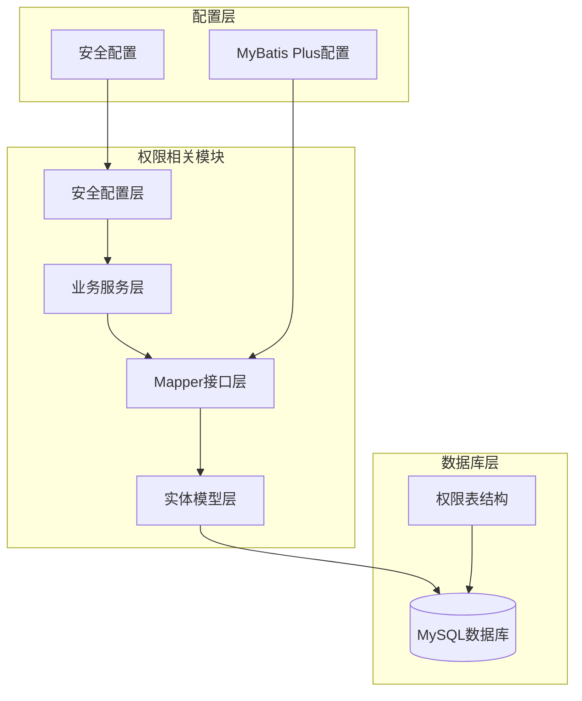

**图表来源**
- [SysPermissionMapper.java:1-10](file://src/main/java/com/bookorder/mapper/SysPermissionMapper.java#L1-L10)
- [SysPermission.java:1-42](file://src/main/java/com/bookorder/entity/SysPermission.java#L1-L42)
- [application.yml:15-25](file://src/main/resources/application.yml#L15-L25)

**章节来源**
- [SysPermissionMapper.java:1-10](file://src/main/java/com/bookorder/mapper/SysPermissionMapper.java#L1-L10)
- [SysPermission.java:1-42](file://src/main/java/com/bookorder/entity/SysPermission.java#L1-L42)
- [application.yml:15-25](file://src/main/resources/application.yml#L15-L25)

## 核心组件

### 权限实体模型

系统使用MyBatis-Plus注解定义权限实体，支持自动时间戳填充和逻辑删除：

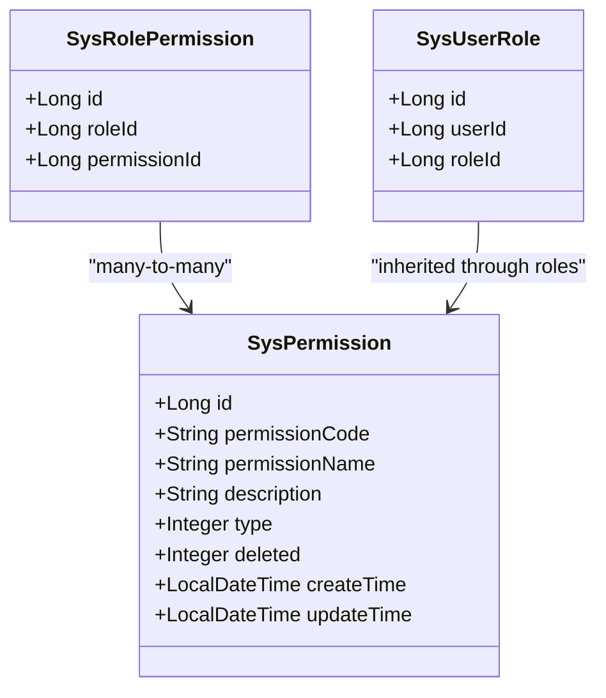

**图表来源**
- [SysPermission.java:6-41](file://src/main/java/com/bookorder/entity/SysPermission.java#L6-L41)
- [SysRolePermission.java:7-21](file://src/main/java/com/bookorder/entity/SysRolePermission.java#L7-L21)
- [SysUserRole.java:7-21](file://src/main/java/com/bookorder/entity/SysUserRole.java#L7-L21)

### 权限查询接口

SysPermissionMapper继承自BaseMapper，提供了基础的CRUD操作能力：

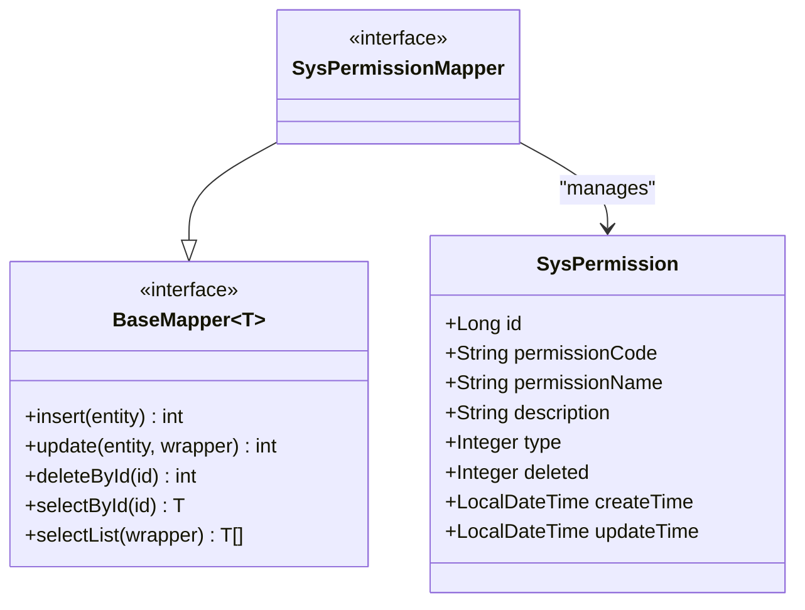

**图表来源**
- [SysPermissionMapper.java:8](file://src/main/java/com/bookorder/mapper/SysPermissionMapper.java#L8)

**章节来源**
- [SysPermissionMapper.java:1-10](file://src/main/java/com/bookorder/mapper/SysPermissionMapper.java#L1-L10)
- [SysPermission.java:1-42](file://src/main/java/com/bookorder/entity/SysPermission.java#L1-L42)

## 架构概览

系统采用分层架构设计，权限访问通过以下流程实现：

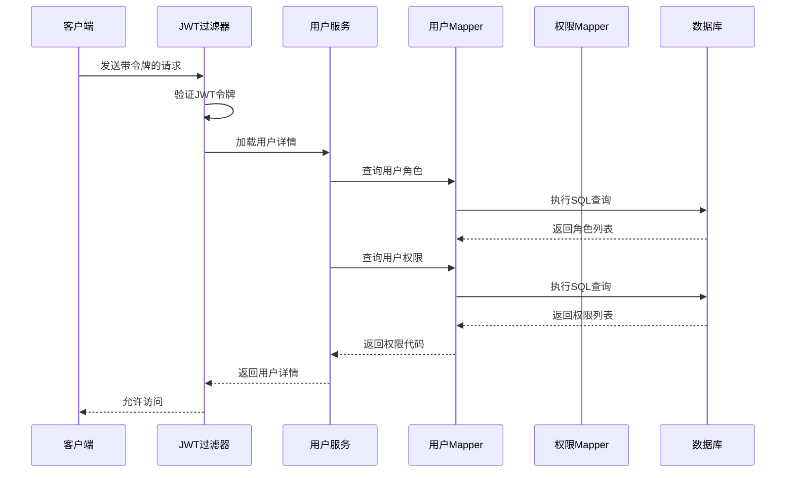

**图表来源**
- [JwtAuthenticationFilter.java:28-46](file://src/main/java/com/bookorder/security/JwtAuthenticationFilter.java#L28-L46)
- [UserDetailsServiceImpl.java:24-48](file://src/main/java/com/bookorder/security/UserDetailsServiceImpl.java#L24-L48)
- [SysUserMapper.java:14-23](file://src/main/java/com/bookorder/mapper/SysUserMapper.java#L14-L23)

## 详细组件分析

### 权限数据查询方法

#### 用户权限查询实现

系统通过自定义SQL查询实现用户权限的高效获取：

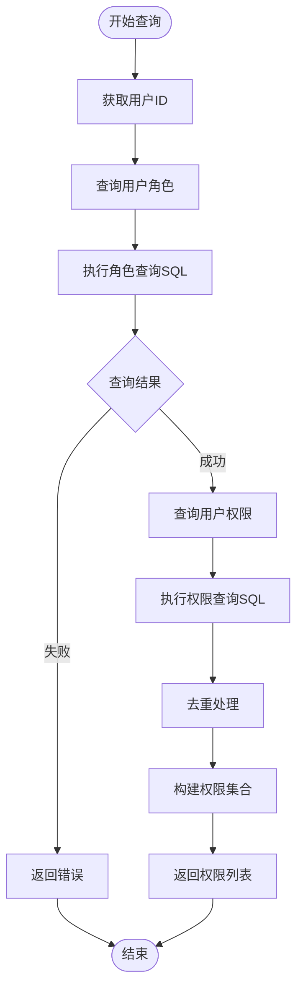

**图表来源**
- [SysUserMapper.java:14-23](file://src/main/java/com/bookorder/mapper/SysUserMapper.java#L14-L23)
- [UserDetailsServiceImpl.java:36-47](file://src/main/java/com/bookorder/security/UserDetailsServiceImpl.java#L36-L47)

#### 权限类型定义

权限类型通过枚举值定义，支持菜单、按钮和接口三种类型：

| 类型编号 | 类型名称 | 描述 |
|---------|---------|------|
| 1 | 菜单 | 导航菜单项 |
| 2 | 按钮 | 页面操作按钮 |
| 3 | 接口 | API接口权限 |

**章节来源**
- [SysPermission.java:14](file://src/main/java/com/bookorder/entity/SysPermission.java#L14)
- [init.sql:46](file://sql/init.sql#L46)

### 权限树形结构构建逻辑

系统通过递归查询实现权限树形结构的构建：

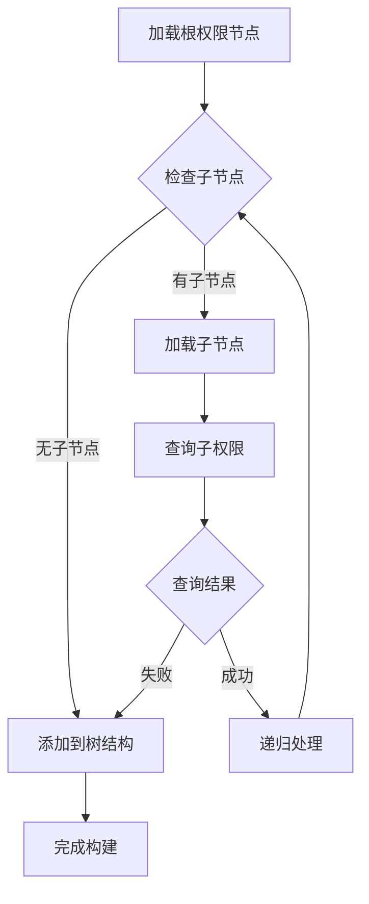

**图表来源**
- [SysPermissionMapper.java:8](file://src/main/java/com/bookorder/mapper/SysPermissionMapper.java#L8)

### 权限与角色关联查询实现

#### 多对多关系映射

系统通过中间表实现用户、角色和权限的多对多关联：

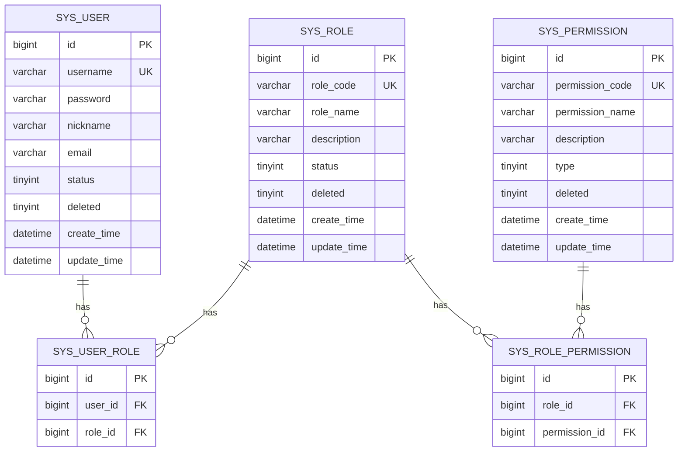

**图表来源**
- [init.sql:11-70](file://sql/init.sql#L11-L70)

**章节来源**
- [init.sql:55-70](file://sql/init.sql#L55-L70)
- [SysUserRole.java:1-22](file://src/main/java/com/bookorder/entity/SysUserRole.java#L1-L22)
- [SysRolePermission.java:1-22](file://src/main/java/com/bookorder/entity/SysRolePermission.java#L1-L22)

### 权限继承关系处理

系统通过角色层次实现权限继承，管理员角色拥有所有权限，其他角色按需分配：

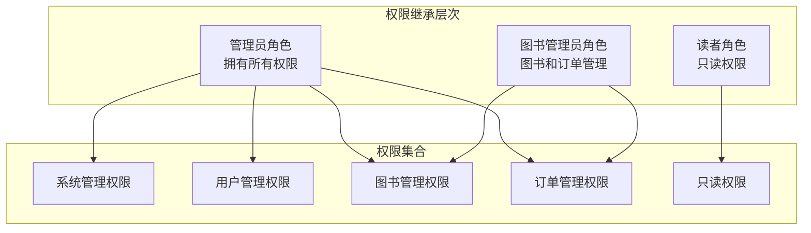

**图表来源**
- [init.sql:102-115](file://sql/init.sql#L102-L115)

**章节来源**
- [init.sql:77-115](file://sql/init.sql#L77-L115)

## 依赖关系分析

### 数据访问层依赖

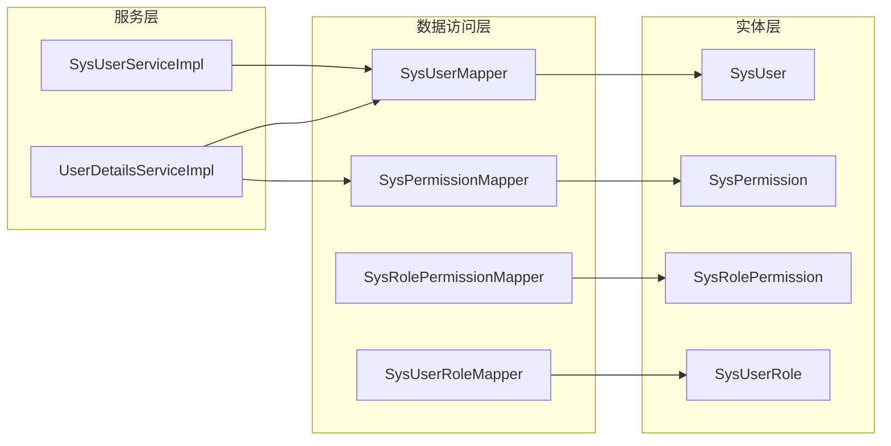

**图表来源**
- [SysUserMapper.java:12-23](file://src/main/java/com/bookorder/mapper/SysUserMapper.java#L12-L23)
- [SysUserServiceImpl.java:22-41](file://src/main/java/com/bookorder/service/impl/SysUserServiceImpl.java#L22-L41)
- [UserDetailsServiceImpl.java:18-48](file://src/main/java/com/bookorder/security/UserDetailsServiceImpl.java#L18-L48)

### 安全过滤器链

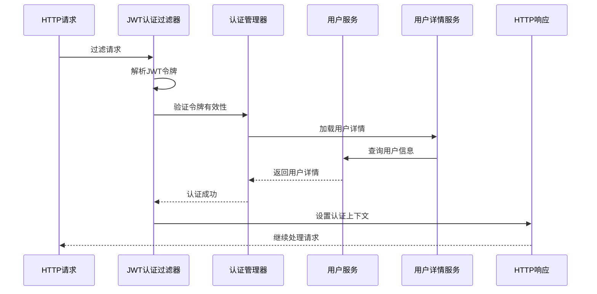

**图表来源**
- [JwtAuthenticationFilter.java:28-46](file://src/main/java/com/bookorder/security/JwtAuthenticationFilter.java#L28-L46)
- [SecurityConfig.java:35-62](file://src/main/java/com/bookorder/config/SecurityConfig.java#L35-L62)

**章节来源**
- [SysUserMapper.java:1-25](file://src/main/java/com/bookorder/mapper/SysUserMapper.java#L1-L25)
- [SysUserServiceImpl.java:1-87](file://src/main/java/com/bookorder/service/impl/SysUserServiceImpl.java#L1-L87)
- [UserDetailsServiceImpl.java:1-50](file://src/main/java/com/bookorder/security/UserDetailsServiceImpl.java#L1-L50)

## 性能考虑

### 缓存策略

系统当前实现中，权限数据通过数据库查询实时获取，建议实施以下缓存策略：

1. **用户权限缓存**：为每个用户的权限集合设置短期缓存
2. **角色权限映射缓存**：缓存角色到权限的映射关系
3. **权限树缓存**：缓存权限树形结构以减少重复计算

### 查询优化

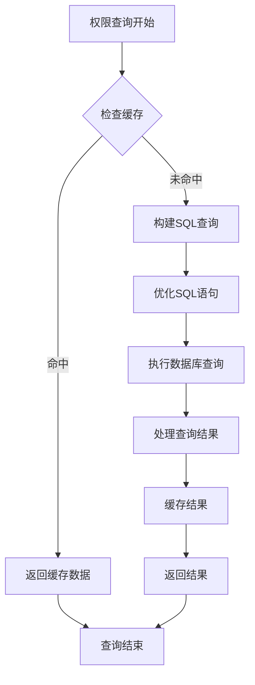

**图表来源**
- [SysUserMapper.java:14-23](file://src/main/java/com/bookorder/mapper/SysUserMapper.java#L14-L23)

### 索引优化

建议在以下字段上建立索引：
- `sys_user.username` (唯一索引)
- `sys_permission.permission_code` (唯一索引)
- `sys_user_role.user_id` (普通索引)
- `sys_user_role.role_id` (普通索引)
- `sys_role_permission.role_id` (普通索引)
- `sys_role_permission.permission_id` (普通索引)

**章节来源**
- [application.yml:15-25](file://src/main/resources/application.yml#L15-L25)
- [MyBatisPlusConfig.java:9-22](file://src/main/java/com/bookorder/config/MyBatisPlusConfig.java#L9-L22)

## 故障排除指南

### 常见问题诊断

#### 权限验证失败

当用户无法访问受保护资源时，检查以下方面：

1. **JWT令牌验证**：确认令牌格式正确且未过期
2. **用户状态检查**：验证用户账户状态为正常
3. **权限映射检查**：确认用户角色与权限的关联关系

#### 权限查询异常

如果权限查询出现异常，检查：

1. **数据库连接**：确认数据库连接正常
2. **SQL语法**：验证自定义SQL查询语法正确
3. **逻辑删除**：确认deleted字段值正确

### 错误处理机制

系统通过统一的异常处理机制提供清晰的错误信息：

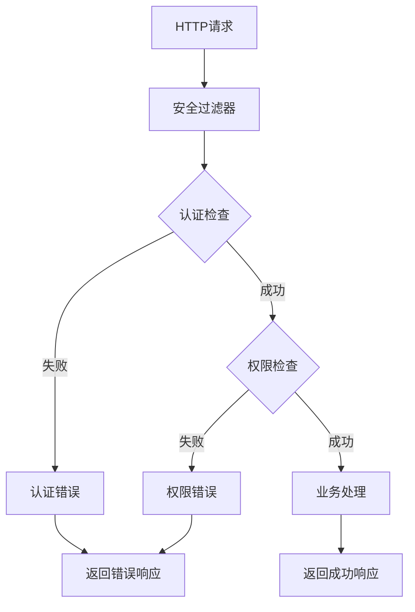

**图表来源**
- [SecurityConfig.java:43-58](file://src/main/java/com/bookorder/config/SecurityConfig.java#L43-L58)

**章节来源**
- [SecurityConfig.java:1-74](file://src/main/java/com/bookorder/config/SecurityConfig.java#L1-L74)

## 结论

Book Order System的权限Mapper接口设计体现了现代RBAC权限管理系统的核心理念。通过MyBatis-Plus框架提供的强大ORM能力，系统实现了高效的权限数据访问和管理。

关键特性包括：
- **灵活的权限模型**：支持多种权限类型和继承关系
- **高效的查询机制**：通过自定义SQL实现精确的权限查询
- **安全的访问控制**：集成JWT认证和Spring Security
- **可扩展的架构**：基于接口的设计便于功能扩展

未来可以考虑的改进方向：
- 实施权限数据缓存机制
- 添加权限变更审计日志
- 增强权限查询的性能监控
- 提供权限管理的可视化界面