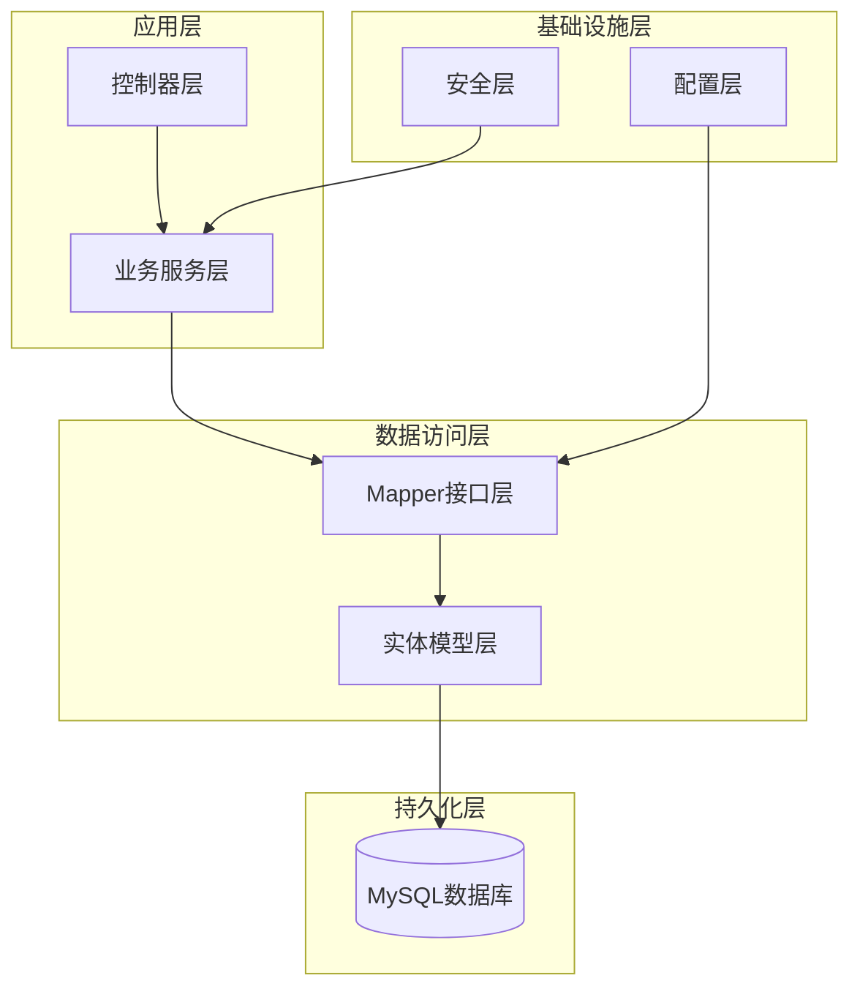
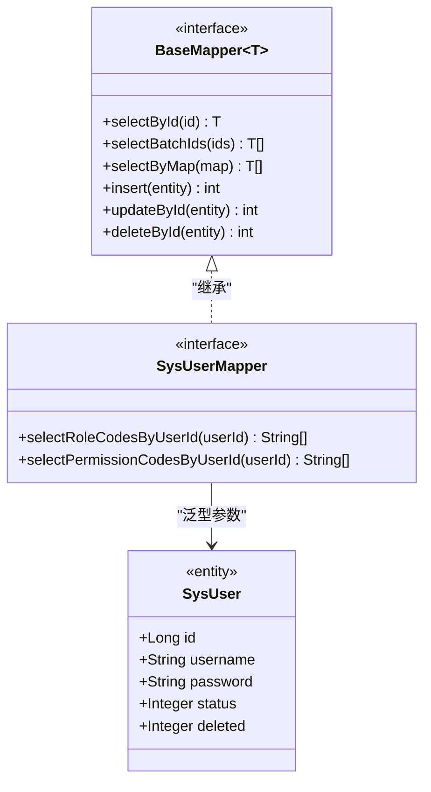
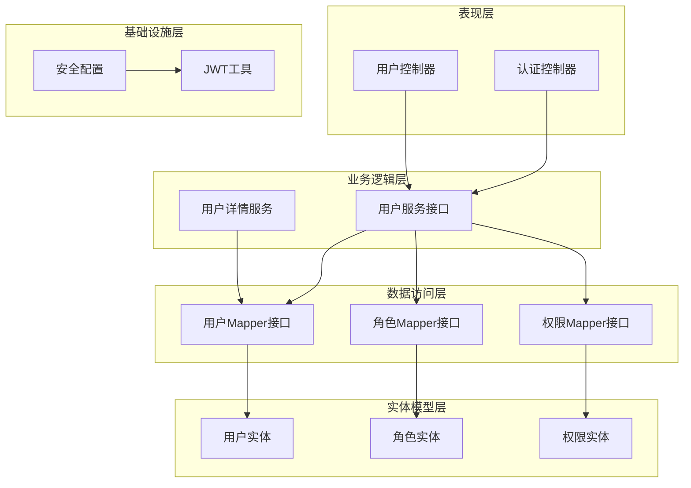
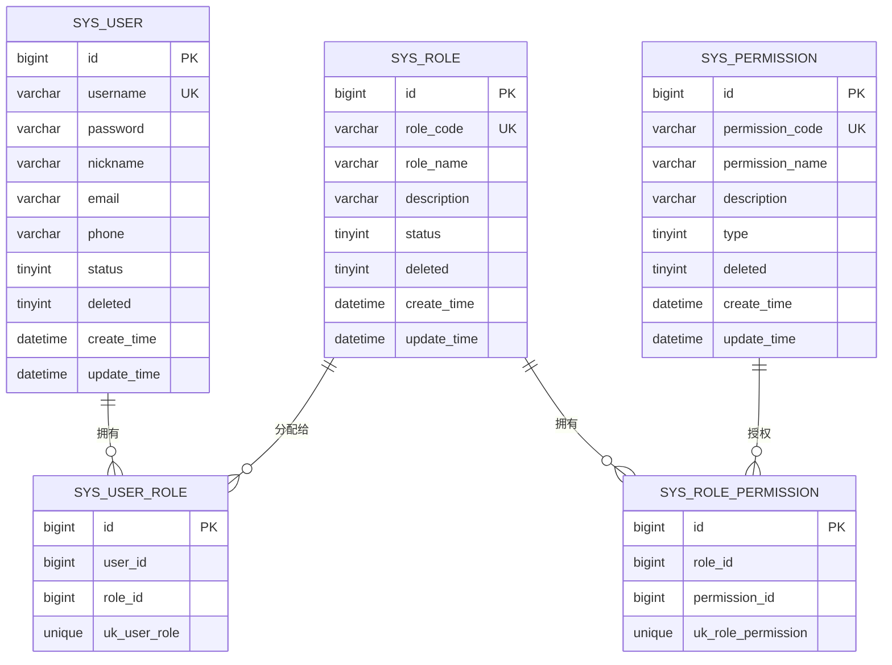
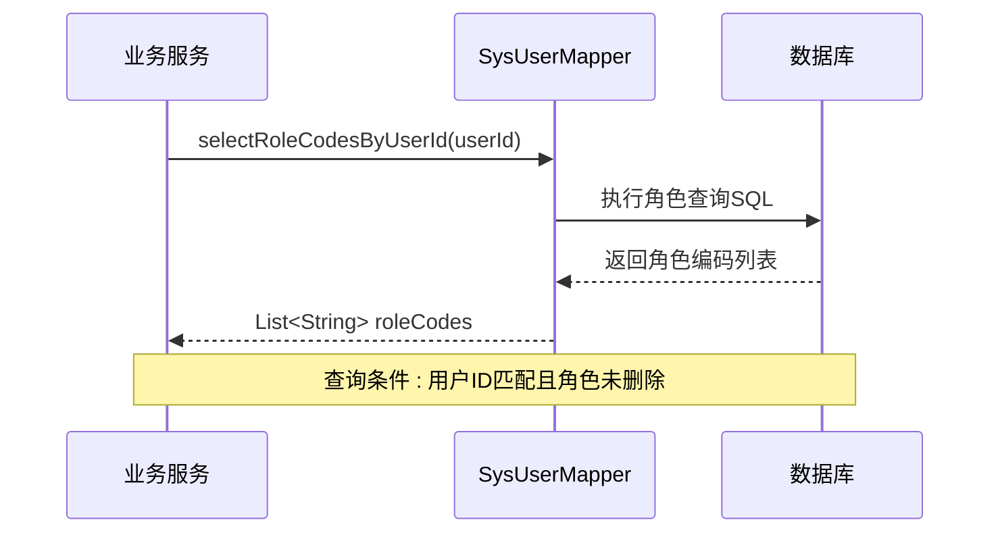
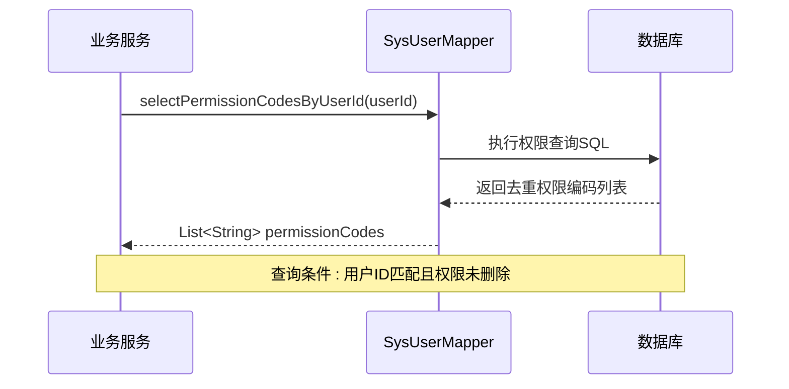
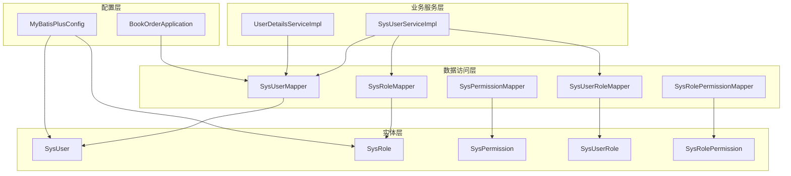

# 用户Mapper接口

<cite>
**本文档引用的文件**
- [SysUserMapper.java](file://src/main/java/com/bookorder/mapper/SysUserMapper.java)
- [SysUser.java](file://src/main/java/com/bookorder/entity/SysUser.java)
- [SysRole.java](file://src/main/java/com/bookorder/entity/SysRole.java)
- [SysPermission.java](file://src/main/java/com/bookorder/entity/SysPermission.java)
- [SysUserRole.java](file://src/main/java/com/bookorder/entity/SysUserRole.java)
- [SysRolePermission.java](file://src/main/java/com/bookorder/entity/SysRolePermission.java)
- [SysUserServiceImpl.java](file://src/main/java/com/bookorder/service/impl/SysUserServiceImpl.java)
- [UserDetailsServiceImpl.java](file://src/main/java/com/bookorder/security/UserDetailsServiceImpl.java)
- [MyBatisPlusConfig.java](file://src/main/java/com/bookorder/config/MyBatisPlusConfig.java)
- [application.yml](file://src/main/resources/application.yml)
- [init.sql](file://sql/init.sql)
- [BookOrderApplication.java](file://src/main/java/com/bookorder/BookOrderApplication.java)
</cite>

## 目录
1. [简介](#简介)
2. [项目结构](#项目结构)
3. [核心组件](#核心组件)
4. [架构概览](#架构概览)
5. [详细组件分析](#详细组件分析)
6. [依赖关系分析](#依赖关系分析)
7. [性能考量](#性能考量)
8. [故障排除指南](#故障排除指南)
9. [结论](#结论)

## 简介

本文档深入分析了Book Order System中的用户Mapper接口设计与实现。该系统采用Spring Boot + MyBatis Plus框架构建，实现了完整的用户认证授权功能。SysUserMapper作为核心数据访问层接口，不仅继承了MyBatis Plus的BaseMapper提供了标准的CRUD操作能力，还通过自定义注解方法实现了复杂的角色权限关联查询。

系统的核心数据模型围绕用户(User)、角色(Role)、权限(Permission)及其关联表展开，形成了典型的RBAC(基于角色的访问控制)权限体系。通过精心设计的SQL查询和索引策略，系统能够高效地为用户提供角色和权限信息，支持系统的安全认证和授权机制。

## 项目结构

该项目采用标准的Spring Boot分层架构，主要包含以下关键模块：



**图表来源**
- [BookOrderApplication.java:1-14](file://src/main/java/com/bookorder/BookOrderApplication.java#L1-L14)
- [application.yml:1-33](file://src/main/resources/application.yml#L1-L33)

**章节来源**
- [BookOrderApplication.java:1-14](file://src/main/java/com/bookorder/BookOrderApplication.java#L1-L14)
- [application.yml:1-33](file://src/main/resources/application.yml#L1-L33)

## 核心组件

### SysUserMapper接口设计

SysUserMapper是本系统的核心数据访问接口，其设计体现了以下特点：

#### 继承关系分析



**图表来源**
- [SysUserMapper.java:12](file://src/main/java/com/bookorder/mapper/SysUserMapper.java#L12)
- [SysUser.java:6-48](file://src/main/java/com/bookorder/entity/SysUser.java#L6-L48)

#### 自定义方法实现

SysUserMapper继承BaseMapper后，新增了两个专门的角色权限查询方法：

1. **角色编码查询**: `selectRoleCodesByUserId` - 查询用户的所有角色编码
2. **权限编码查询**: `selectPermissionCodesByUserId` - 查询用户的权限编码集合

这些方法通过`@Select`注解直接定义SQL语句，避免了XML配置文件的复杂性，同时保持了SQL的可读性和维护性。

**章节来源**
- [SysUserMapper.java:11-24](file://src/main/java/com/bookorder/mapper/SysUserMapper.java#L11-L24)

## 架构概览

系统采用分层架构设计，各层职责明确，耦合度低：



**图表来源**
- [SysUserServiceImpl.java:22-86](file://src/main/java/com/bookorder/service/impl/SysUserServiceImpl.java#L22-L86)
- [UserDetailsServiceImpl.java:17-34](file://src/main/java/com/bookorder/security/UserDetailsServiceImpl.java#L17-L34)

## 详细组件分析

### 数据模型设计

系统采用标准的RBAC权限模型，包含以下核心实体：

#### 用户实体模型



**图表来源**
- [SysUser.java:6-48](file://src/main/java/com/bookorder/entity/SysUser.java#L6-L48)
- [SysRole.java:6-42](file://src/main/java/com/bookorder/entity/SysRole.java#L6-L42)
- [SysPermission.java:6-42](file://src/main/java/com/bookorder/entity/SysPermission.java#L6-L42)
- [SysUserRole.java:7-22](file://src/main/java/com/bookorder/entity/SysUserRole.java#L7-L22)
- [SysRolePermission.java:7-21](file://src/main/java/com/bookorder/entity/SysRolePermission.java#L7-L21)

#### 关联查询实现原理

SysUserMapper的两个自定义方法展示了典型的多表关联查询模式：

**角色查询流程**:


**权限查询流程**:


**图表来源**
- [SysUserMapper.java:14-23](file://src/main/java/com/bookorder/mapper/SysUserMapper.java#L14-L23)

**章节来源**
- [SysUserMapper.java:14-23](file://src/main/java/com/bookorder/mapper/SysUserMapper.java#L14-L23)

### SQL执行逻辑分析

#### @Select注解使用方式

SysUserMapper中使用了两种不同的SQL查询策略：

1. **简单关联查询** (`selectRoleCodesByUserId`):
   - 使用INNER JOIN连接角色表和用户角色关联表
   - 直接返回角色编码，无需去重处理
   - 查询条件包含用户ID和逻辑删除字段

2. **复杂关联查询** (`selectPermissionCodesByUserId`):
   - 连接三层表结构：权限表 → 角色权限关联表 → 用户角色关联表
   - 使用DISTINCT关键字确保权限编码唯一性
   - 同样包含用户ID和逻辑删除过滤条件

#### 参数绑定机制

方法参数通过`@Param`注解进行显式命名绑定：
- `userId`: Long类型，表示用户标识符
- 在SQL语句中使用`#{userId}`进行参数占位符替换

**章节来源**
- [SysUserMapper.java:14-23](file://src/main/java/com/bookorder/mapper/SysUserMapper.java#L14-L23)

### 配置与集成

#### MyBatis Plus配置

系统通过application.yml配置了MyBatis Plus的关键参数：

```yaml
mybatis-plus:
  configuration:
    map-underscore-to-camel-case: true
    log-impl: org.apache.ibatis.logging.stdout.StdOutImpl
  global-config:
    db-config:
      id-type: auto
      logic-delete-field: deleted
      logic-delete-value: 1
      logic-not-delete-value: 0
```

这些配置实现了：
- 下划线到驼峰命名的自动转换
- SQL执行日志输出
- 全局逻辑删除策略
- 自增主键ID生成

#### 应用启动配置

通过`@MapperScan`注解扫描mapper包，确保所有Mapper接口被正确注册到Spring容器中。

**章节来源**
- [application.yml:15-25](file://src/main/resources/application.yml#L15-L25)
- [BookOrderApplication.java:8](file://src/main/java/com/bookorder/BookOrderApplication.java#L8)

## 依赖关系分析

### 组件间依赖关系



**图表来源**
- [SysUserServiceImpl.java:22-86](file://src/main/java/com/bookorder/service/impl/SysUserServiceImpl.java#L22-L86)
- [UserDetailsServiceImpl.java:17-34](file://src/main/java/com/bookorder/security/UserDetailsServiceImpl.java#L17-L34)
- [MyBatisPlusConfig.java:9-23](file://src/main/java/com/bookorder/config/MyBatisPlusConfig.java#L9-L23)

### 外部依赖分析

系统主要依赖以下外部组件：
- **MyBatis Plus**: 提供ORM映射和CRUD操作支持
- **MySQL驱动**: 数据库连接和操作
- **JWT**: 用户认证令牌生成和验证
- **Spring Security**: 安全框架集成

**章节来源**
- [SysUserServiceImpl.java:22-86](file://src/main/java/com/bookorder/service/impl/SysUserServiceImpl.java#L22-L86)
- [UserDetailsServiceImpl.java:17-34](file://src/main/java/com/bookorder/security/UserDetailsServiceImpl.java#L17-L34)

## 性能考量

### 查询优化策略

#### 索引设计建议

基于当前的查询模式，建议在以下字段上建立适当的索引：

1. **用户表**: `username`(唯一索引)、`status`、`deleted`
2. **用户角色关联表**: `user_id`、`(user_id, role_id)`复合唯一索引
3. **角色权限关联表**: `(role_id, permission_id)`复合唯一索引
4. **权限表**: `permission_code`(唯一索引)、`deleted`

#### 查询性能优化

1. **避免SELECT ***: 当前查询只选择必要字段，减少网络传输开销
2. **合理使用DISTINCT**: 权限查询中使用DISTINCT确保结果集唯一性
3. **逻辑删除优化**: 通过逻辑删除字段避免物理删除带来的性能影响
4. **参数化查询**: 使用@Param注解确保SQL预编译，提高查询效率

#### 缓存策略

建议在业务层添加适当的缓存机制：
- 用户角色信息缓存
- 用户权限信息缓存
- 避免重复的数据库查询

### 并发处理

系统通过以下机制保证并发安全性：
- **事务管理**: 注册和登录操作使用@Transactional注解
- **乐观锁**: 通过逻辑删除字段实现软删除
- **线程安全**: Mapper接口无状态设计，天然线程安全

## 故障排除指南

### 常见问题及解决方案

#### 1. SQL执行异常

**问题症状**: 查询失败或返回空结果
**可能原因**:
- 用户ID参数为空或无效
- 数据库连接配置错误
- 表结构不匹配

**解决步骤**:
1. 检查用户ID参数的有效性
2. 验证数据库连接配置
3. 确认表结构与实体类映射一致

#### 2. 权限查询结果异常

**问题症状**: 权限查询返回重复值或缺失权限
**可能原因**:
- 角色权限关联数据不完整
- 逻辑删除字段过滤不当
- 查询条件设置错误

**解决步骤**:
1. 检查sys_user_role表数据完整性
2. 验证sys_role_permission表关联关系
3. 确认deleted字段的逻辑删除值设置

#### 3. 性能问题

**问题症状**: 查询响应时间过长
**可能原因**:
- 缺少必要的数据库索引
- 查询语句未使用索引
- 数据量过大导致查询缓慢

**解决步骤**:
1. 分析SQL执行计划
2. 添加适当的数据库索引
3. 考虑查询结果缓存策略

### 调试技巧

#### 日志配置

通过application.yml启用MyBatis Plus SQL日志输出，便于调试和性能分析。

#### 单元测试

建议为关键查询方法编写单元测试，验证查询结果的正确性和性能表现。

**章节来源**
- [application.yml:15-25](file://src/main/resources/application.yml#L15-L25)

## 结论

SysUserMapper作为Book Order System的核心数据访问接口，成功实现了以下目标：

1. **简洁高效的接口设计**: 通过继承BaseMapper获得完整的CRUD能力，同时提供专门的角色权限查询方法
2. **清晰的数据模型**: 基于RBAC模型的实体设计，支持灵活的权限管理
3. **良好的性能表现**: 通过合理的SQL查询和索引策略，确保系统的响应速度
4. **完善的配置集成**: 与MyBatis Plus和Spring Boot的无缝集成

该设计为系统的用户认证授权功能奠定了坚实的基础，既满足了当前的功能需求，又为未来的扩展提供了良好的架构支撑。通过持续的性能优化和监控，系统能够在高并发场景下保持稳定的性能表现。