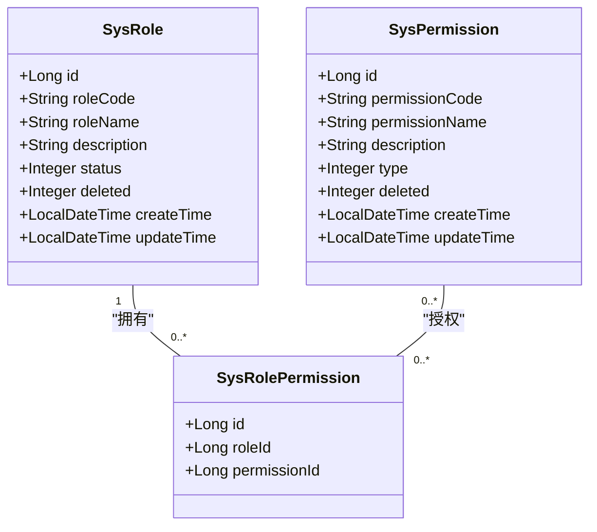
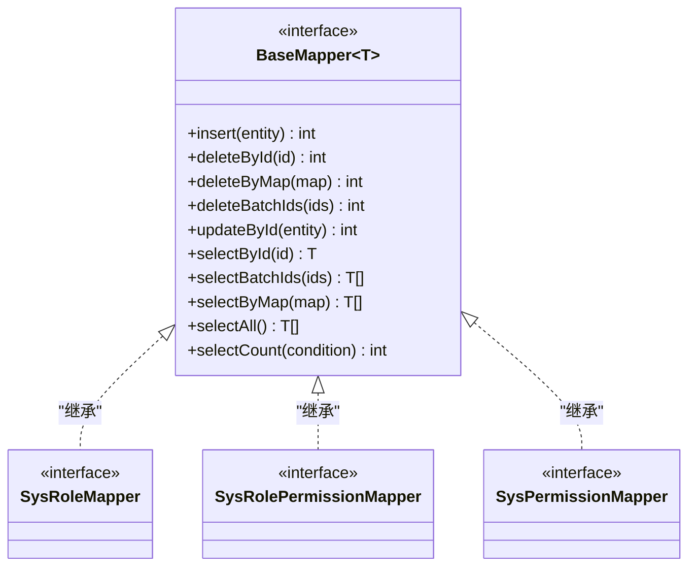
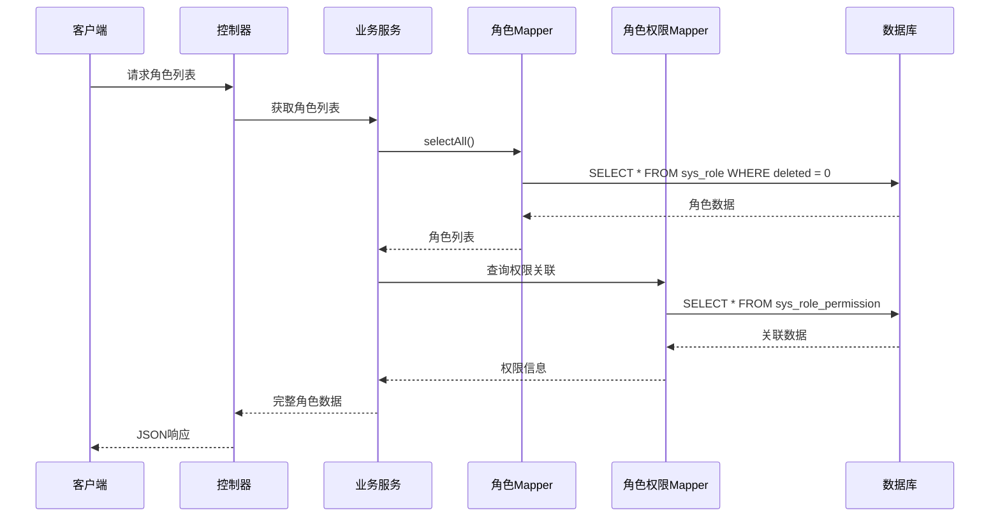
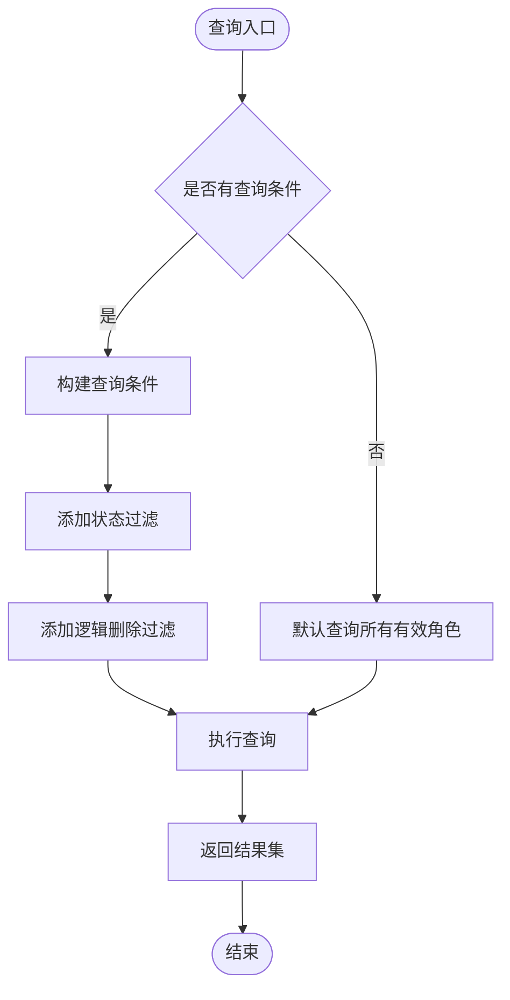
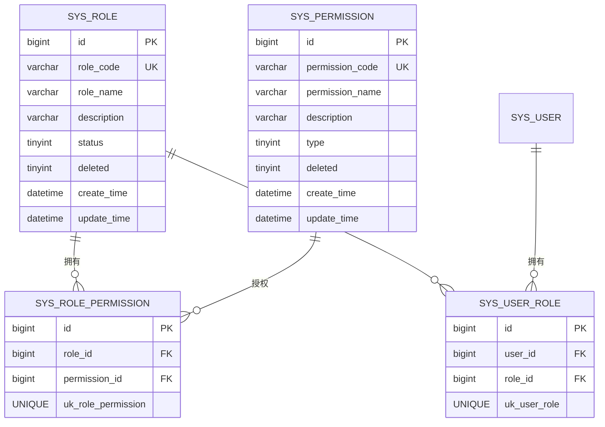
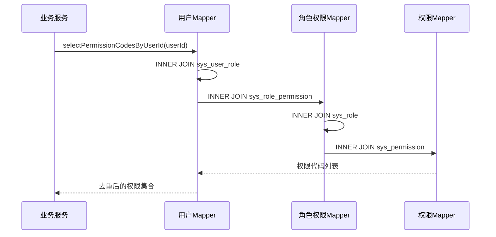
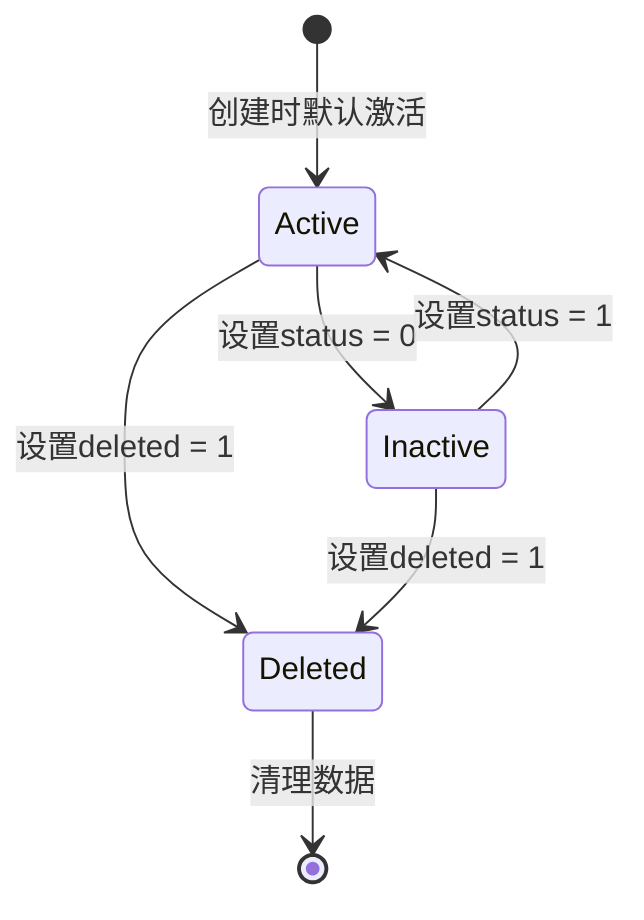
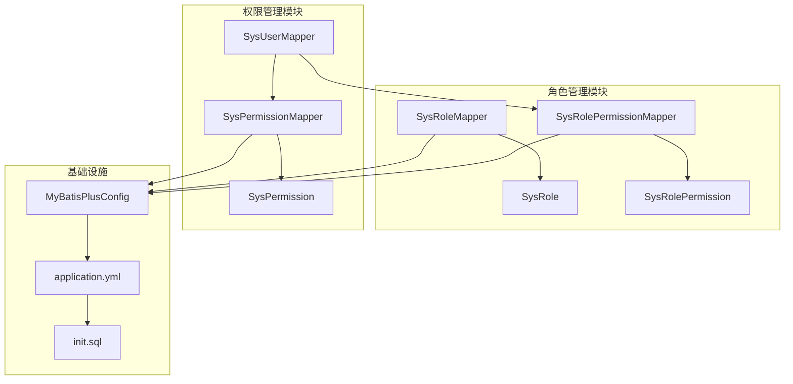
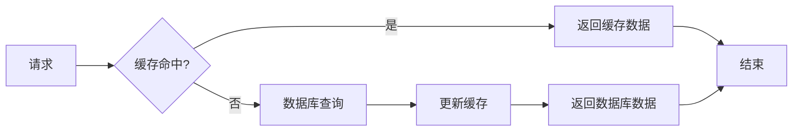

# 角色Mapper接口

<cite>
**本文档引用的文件**
- [SysRoleMapper.java](file://src/main/java/com/bookorder/mapper/SysRoleMapper.java)
- [SysRole.java](file://src/main/java/com/bookorder/entity/SysRole.java)
- [SysRolePermission.java](file://src/main/java/com/bookorder/entity/SysRolePermission.java)
- [SysRolePermissionMapper.java](file://src/main/java/com/bookorder/mapper/SysRolePermissionMapper.java)
- [SysUserMapper.java](file://src/main/java/com/bookorder/mapper/SysUserMapper.java)
- [SysPermission.java](file://src/main/java/com/bookorder/entity/SysPermission.java)
- [SysPermissionMapper.java](file://src/main/java/com/bookorder/mapper/SysPermissionMapper.java)
- [MyBatisPlusConfig.java](file://src/main/java/com/bookorder/config/MyBatisPlusConfig.java)
- [application.yml](file://src/main/resources/application.yml)
- [init.sql](file://sql/init.sql)
</cite>

## 目录
1. [简介](#简介)
2. [项目结构](#项目结构)
3. [核心组件](#核心组件)
4. [架构概览](#架构概览)
5. [详细组件分析](#详细组件分析)
6. [依赖关系分析](#依赖关系分析)
7. [性能考虑](#性能考虑)
8. [故障排除指南](#故障排除指南)
9. [结论](#结论)

## 简介

本文档深入分析了Book Order System中的角色Mapper接口体系，重点解析SysRoleMapper接口的继承关系、基础CRUD操作实现以及角色权限关联查询的实现方式。该系统采用Spring Boot + MyBatis-Plus框架，实现了完整的角色权限管理体系，包括角色状态管理、权限分配和数据访问模式。

## 项目结构

系统采用标准的MVC架构模式，角色相关的组件分布在以下层次：

```mermaid
graph TB
subgraph "应用层"
Controller[控制器层]
Service[业务服务层]
end
subgraph "数据访问层"
Mapper[Mapper接口层]
Entity[实体模型层]
end
subgraph "基础设施"
Config[配置类]
SQL[数据库脚本]
end
Controller --> Service
Service --> Mapper
Mapper --> Entity
Mapper --> Config
Config --> SQL
```

**图表来源**
- [SysRoleMapper.java:1-10](file://src/main/java/com/bookorder/mapper/SysRoleMapper.java#L1-L10)
- [SysRole.java:1-42](file://src/main/java/com/bookorder/entity/SysRole.java#L1-L42)
- [MyBatisPlusConfig.java:1-23](file://src/main/java/com/bookorder/config/MyBatisPlusConfig.java#L1-L23)

**章节来源**
- [SysRoleMapper.java:1-10](file://src/main/java/com/bookorder/mapper/SysRoleMapper.java#L1-L10)
- [SysRole.java:1-42](file://src/main/java/com/bookorder/entity/SysRole.java#L1-L42)
- [application.yml:1-33](file://src/main/resources/application.yml#L1-L33)

## 核心组件

### 角色实体模型

角色实体SysRole定义了完整的角色数据结构，包括标识符、编码、名称、描述、状态和逻辑删除字段：

**图表来源**
- [SysRole.java:6-41](file://src/main/java/com/bookorder/entity/SysRole.java#L6-L41)
- [SysRolePermission.java:7-21](file://src/main/java/com/bookorder/entity/SysRolePermission.java#L7-L21)
- [SysPermission.java:6-41](file://src/main/java/com/bookorder/entity/SysPermission.java#L6-L41)

### Mapper接口继承体系

角色相关的Mapper接口采用MyBatis-Plus的BaseMapper抽象基类，实现了统一的基础CRUD操作：

**图表来源**
- [SysRoleMapper.java:3-8](file://src/main/java/com/bookorder/mapper/SysRoleMapper.java#L3-L8)
- [SysRolePermissionMapper.java:3-8](file://src/main/java/com/bookorder/mapper/SysRolePermissionMapper.java#L3-L8)
- [SysPermissionMapper.java:3-8](file://src/main/java/com/bookorder/mapper/SysPermissionMapper.java#L3-L8)

**章节来源**
- [SysRoleMapper.java:1-10](file://src/main/java/com/bookorder/mapper/SysRoleMapper.java#L1-L10)
- [SysRolePermissionMapper.java:1-10](file://src/main/java/com/bookorder/mapper/SysRolePermissionMapper.java#L1-L10)
- [SysPermissionMapper.java:1-10](file://src/main/java/com/bookorder/mapper/SysPermissionMapper.java#L1-L10)

## 架构概览

系统采用分层架构设计，角色管理通过以下数据流实现：

**图表来源**
- [SysRoleMapper.java:8](file://src/main/java/com/bookorder/mapper/SysRoleMapper.java#L8)
- [SysRolePermissionMapper.java:8](file://src/main/java/com/bookorder/mapper/SysRolePermissionMapper.java#L8)

## 详细组件分析

### SysRoleMapper接口分析

SysRoleMapper作为角色管理的核心数据访问接口，继承自MyBatis-Plus的BaseMapper<T>，自动获得完整的基础CRUD操作能力：

#### 基础CRUD操作实现

| 操作类型 | 方法名 | 功能描述 | 实现方式 |
|---------|--------|----------|----------|
| 创建 | insert | 新增角色记录 | 继承自BaseMapper |
| 读取 | selectById/selectAll | 查询单个/全部角色 | 继承自BaseMapper |
| 更新 | updateById | 更新角色信息 | 继承自BaseMapper |
| 删除 | deleteById/deleteBatchIds | 删除角色记录 | 继承自BaseMapper |
| 条件查询 | selectByMap/selectCount | 条件查询和计数 | 继承自BaseMapper |

#### 自定义查询扩展

虽然SysRoleMapper本身没有自定义方法，但可以通过以下方式扩展查询功能：

**图表来源**
- [SysRole.java:16](file://src/main/java/com/bookorder/entity/SysRole.java#L16)
- [application.yml:22-24](file://src/main/resources/application.yml#L22-L24)

### 角色权限关联查询实现

系统通过多表关联实现角色与权限的复杂查询，主要涉及以下表结构：

**图表来源**
- [init.sql:27-70](file://sql/init.sql#L27-L70)

### 权限查询SQL优化策略

系统提供了多种权限查询的SQL实现策略：

#### 用户权限查询流程

**图表来源**
- [SysUserMapper.java:14-23](file://src/main/java/com/bookorder/mapper/SysUserMapper.java#L14-L23)

#### 查询条件构建策略

| 查询场景 | SQL特点 | 性能优化 |
|---------|---------|----------|
| 角色列表查询 | WHERE deleted = 0 | 使用逻辑删除索引 |
| 权限关联查询 | 多表INNER JOIN | 确保外键索引存在 |
| 用户权限查询 | DISTINCT去重 | 合理使用UNIQUE约束 |
| 角色状态查询 | WHERE status = 1 | 添加状态索引 |

**章节来源**
- [SysUserMapper.java:1-25](file://src/main/java/com/bookorder/mapper/SysUserMapper.java#L1-L25)
- [SysRolePermissionMapper.java:1-10](file://src/main/java/com/bookorder/mapper/SysRolePermissionMapper.java#L1-L10)

### 数据访问最佳实践

#### 角色状态管理

系统采用逻辑删除机制管理角色状态，通过deleted字段实现软删除：

**图表来源**
- [SysRole.java:16](file://src/main/java/com/bookorder/entity/SysRole.java#L16)
- [application.yml:22-24](file://src/main/resources/application.yml#L22-L24)

#### 权限分配数据访问模式

权限分配遵循"角色-权限"多对多关系，通过中间表sys_role_permission实现：

| 操作类型 | 数据访问模式 | 事务处理 | 错误处理 |
|---------|-------------|----------|----------|
| 批量授权 | INSERT IGNORE | 单事务 | 唯一约束冲突 |
| 权限回收 | DELETE FROM | 单事务 | 外键约束检查 |
| 权限查询 | INNER JOIN | 只读事务 | 空结果处理 |
| 权限验证 | EXISTS子查询 | 只读事务 | 缓存命中率 |

**章节来源**
- [SysRolePermission.java:1-22](file://src/main/java/com/bookorder/entity/SysRolePermission.java#L1-L22)
- [init.sql:103-115](file://sql/init.sql#L103-L115)

## 依赖关系分析

系统中角色相关的组件依赖关系如下：

**图表来源**
- [SysRoleMapper.java:3](file://src/main/java/com/bookorder/mapper/SysRoleMapper.java#L3)
- [MyBatisPlusConfig.java:3](file://src/main/java/com/bookorder/config/MyBatisPlusConfig.java#L3)
- [application.yml:15-25](file://src/main/resources/application.yml#L15-L25)

**章节来源**
- [MyBatisPlusConfig.java:1-23](file://src/main/java/com/bookorder/config/MyBatisPlusConfig.java#L1-L23)
- [application.yml:1-33](file://src/main/resources/application.yml#L1-L33)

## 性能考虑

### SQL查询优化策略

#### 索引优化建议

基于现有的表结构，建议添加以下索引以提升查询性能：

| 表名 | 索引类型 | 字段 | 用途 |
|------|---------|------|------|
| sys_role | UNIQUE | role_code | 角色编码唯一性 |
| sys_role | INDEX | status | 角色状态过滤 |
| sys_role | INDEX | deleted | 逻辑删除过滤 |
| sys_role_permission | UNIQUE | role_id, permission_id | 防止重复授权 |
| sys_user_role | UNIQUE | user_id, role_id | 防止重复分配 |

#### 查询性能优化

1. **避免SELECT ***：只选择需要的字段，减少网络传输
2. **合理使用LIMIT**：对分页查询添加适当的限制
3. **索引覆盖查询**：确保常用查询能够利用索引
4. **批量操作**：对于大量数据操作使用批处理

### 缓存策略

建议实现多级缓存机制：

## 故障排除指南

### 常见问题及解决方案

#### 1. 逻辑删除相关问题

**问题现象**：查询不到已删除的角色数据
**解决方案**：确认application.yml中逻辑删除配置正确

**章节来源**
- [application.yml:22-24](file://src/main/resources/application.yml#L22-L24)

#### 2. 权限查询异常

**问题现象**：用户权限查询结果为空
**排查步骤**：
1. 检查用户是否正确绑定角色
2. 验证角色是否正确授权权限
3. 确认逻辑删除状态

**章节来源**
- [SysUserMapper.java:19-23](file://src/main/java/com/bookorder/mapper/SysUserMapper.java#L19-L23)

#### 3. 数据一致性问题

**问题现象**：角色权限状态不一致
**解决方案**：使用事务确保操作的原子性

### 调试技巧

1. **启用SQL日志**：在application.yml中配置MyBatis日志输出
2. **监控慢查询**：使用数据库慢查询日志分析性能瓶颈
3. **单元测试**：为关键查询编写单元测试确保数据准确性

**章节来源**
- [application.yml:18](file://src/main/resources/application.yml#L18)

## 结论

Book Order System的角色Mapper接口体系展现了现代Java企业应用的最佳实践。通过MyBatis-Plus的BaseMapper抽象，系统实现了统一的数据访问层，结合逻辑删除机制和多表关联查询，构建了完整的角色权限管理体系。

### 主要优势

1. **简洁的接口设计**：最小化接口数量，最大化功能复用
2. **完善的权限控制**：支持细粒度的角色权限管理
3. **良好的扩展性**：基于注解的配置便于功能扩展
4. **性能优化**：合理的索引设计和查询策略

### 改进建议

1. **添加更多查询方法**：根据实际业务需求扩展特定查询
2. **实现缓存机制**：提升高频查询的响应速度
3. **增强错误处理**：提供更详细的异常信息和恢复策略
4. **完善监控指标**：添加数据库查询性能监控

该系统为类似的企业级权限管理应用提供了优秀的参考模板，其设计原则和实现模式值得在其他项目中借鉴和应用。