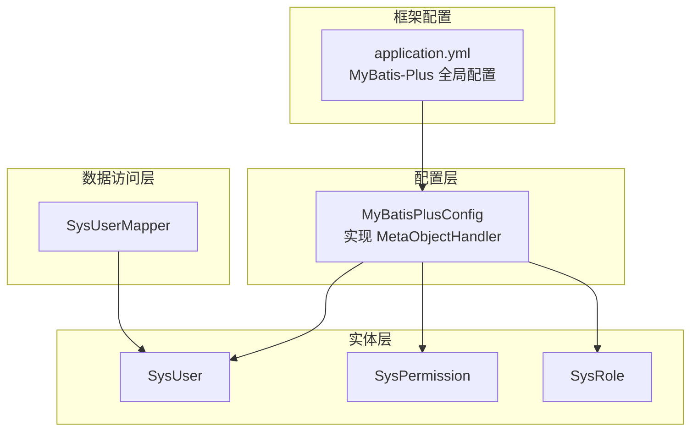
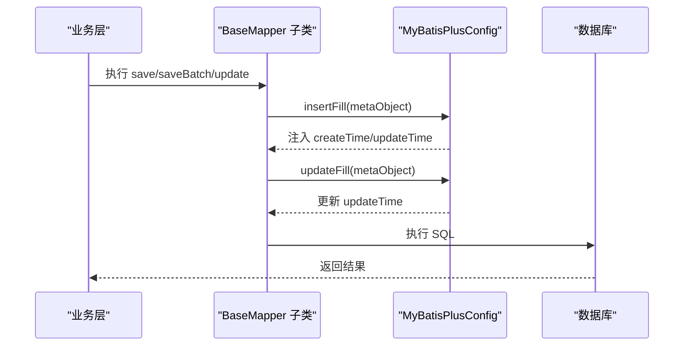
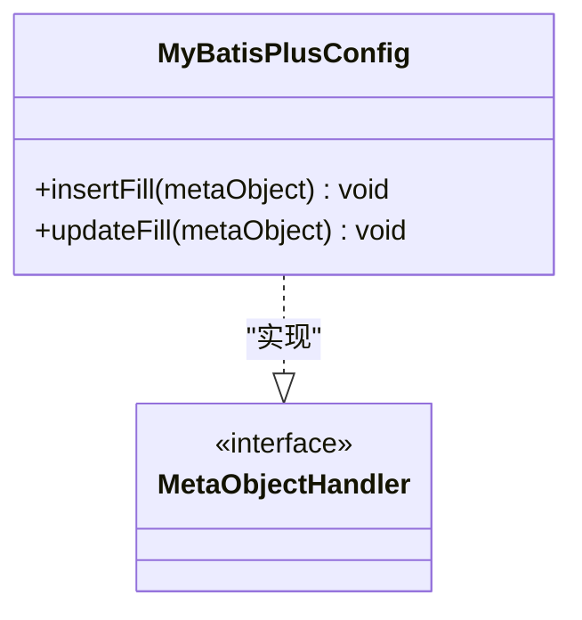
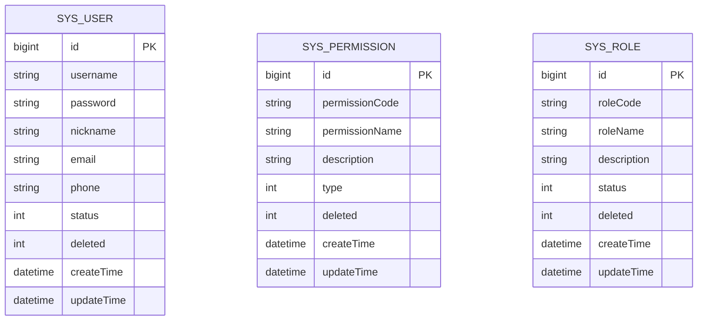
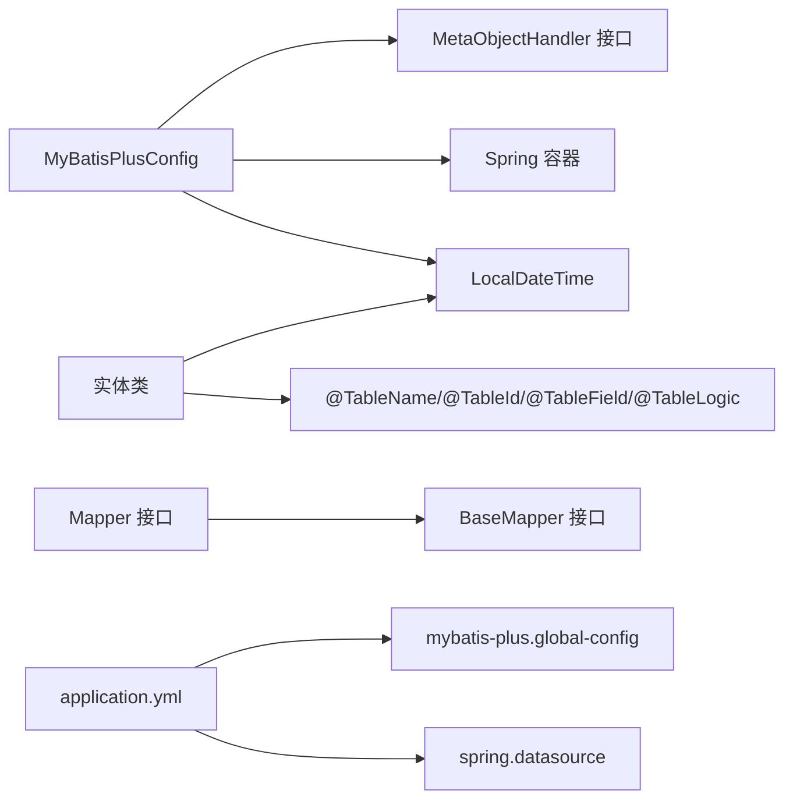

# MyBatis-Plus配置

<cite>
**本文引用的文件**
- [MyBatisPlusConfig.java](file://src/main/java/com/bookorder/config/MyBatisPlusConfig.java)
- [SysUser.java](file://src/main/java/com/bookorder/entity/SysUser.java)
- [SysPermission.java](file://src/main/java/com/bookorder/entity/SysPermission.java)
- [SysRole.java](file://src/main/java/com/bookorder/entity/SysRole.java)
- [SysUserMapper.java](file://src/main/java/com/bookorder/mapper/SysUserMapper.java)
- [application.yml](file://src/main/resources/application.yml)
</cite>

## 目录
1. [简介](#简介)
2. [项目结构](#项目结构)
3. [核心组件](#核心组件)
4. [架构总览](#架构总览)
5. [详细组件分析](#详细组件分析)
6. [依赖分析](#依赖分析)
7. [性能考虑](#性能考虑)
8. [故障排查指南](#故障排查指南)
9. [结论](#结论)
10. [附录](#附录)

## 简介
本文件围绕 MyBatis-Plus 的自动填充配置进行系统性技术文档整理，重点覆盖以下方面：
- MetaObjectHandler 的自动填充机制：insertFill 与 updateFill 的实现原理与调用时机
- 时间字段的自动填充策略与数据类型处理（LocalDateTime）
- 配置类的注解使用与 Spring 容器集成方式
- 自动填充字段的命名规范与扩展方法
- 配置类在数据持久化过程中的作用与最佳实践
- 如何自定义其他类型的自动填充逻辑（如字符串、整数、枚举等）

## 项目结构
该项目采用标准的 Spring Boot 工程结构，MyBatis-Plus 的自动填充配置集中在配置类中，并通过实体类上的注解声明填充策略。关键文件如下：
- 配置类：com.bookorder.config.MyBatisPlusConfig 实现 MetaObjectHandler 接口
- 实体类：SysUser、SysPermission、SysRole 等，使用 @TableField(fill = ...) 声明自动填充
- 映射接口：BaseMapper 子接口，用于数据访问
- 全局配置：application.yml 中的 MyBatis-Plus 全局配置项

图表来源
- [MyBatisPlusConfig.java:1-22](file://src/main/java/com/bookorder/config/MyBatisPlusConfig.java#L1-L22)
- [SysUser.java:1-48](file://src/main/java/com/bookorder/entity/SysUser.java#L1-L48)
- [SysPermission.java:1-42](file://src/main/java/com/bookorder/entity/SysPermission.java#L1-L42)
- [SysRole.java:1-42](file://src/main/java/com/bookorder/entity/SysRole.java#L1-L42)
- [SysUserMapper.java:1-25](file://src/main/java/com/bookorder/mapper/SysUserMapper.java#L1-L25)
- [application.yml:15-24](file://src/main/resources/application.yml#L15-L24)

章节来源
- [MyBatisPlusConfig.java:1-22](file://src/main/java/com/bookorder/config/MyBatisPlusConfig.java#L1-L22)
- [SysUser.java:1-48](file://src/main/java/com/bookorder/entity/SysUser.java#L1-L48)
- [SysPermission.java:1-42](file://src/main/java/com/bookorder/entity/SysPermission.java#L1-L42)
- [SysRole.java:1-42](file://src/main/java/com/bookorder/entity/SysRole.java#L1-L42)
- [SysUserMapper.java:1-25](file://src/main/java/com/bookorder/mapper/SysUserMapper.java#L1-L25)
- [application.yml:15-24](file://src/main/resources/application.yml#L15-L24)

## 核心组件
- 配置类（MyBatisPlusConfig）：实现 MetaObjectHandler 接口，重写 insertFill 与 updateFill 方法，使用 strictInsertFill 与 strictUpdateFill 对指定字段执行自动填充。
- 实体类（SysUser、SysPermission、SysRole）：通过 @TableField(fill = ...) 指定字段在插入或更新时的自动填充行为；时间字段使用 LocalDateTime 类型。
- Mapper 接口：继承 BaseMapper，提供基础 CRUD 能力；自动填充由配置类在持久化前统一注入。
- 全局配置（application.yml）：启用下划线到驼峰映射、开启日志输出、设置全局逻辑删除字段及值。

章节来源
- [MyBatisPlusConfig.java:9-22](file://src/main/java/com/bookorder/config/MyBatisPlusConfig.java#L9-L22)
- [SysUser.java:21-25](file://src/main/java/com/bookorder/entity/SysUser.java#L21-L25)
- [SysPermission.java:19-23](file://src/main/java/com/bookorder/entity/SysPermission.java#L19-L23)
- [SysRole.java:19-23](file://src/main/java/com/bookorder/entity/SysRole.java#L19-L23)
- [application.yml:15-24](file://src/main/resources/application.yml#L15-L24)

## 架构总览
MyBatis-Plus 在执行插入与更新操作前，会回调注册的 MetaObjectHandler 实例，分别调用 insertFill 与 updateFill。配置类根据字段名与类型进行严格填充，确保时间字段在持久化前后的一致性。

图表来源
- [MyBatisPlusConfig.java:12-21](file://src/main/java/com/bookorder/config/MyBatisPlusConfig.java#L12-L21)
- [SysUser.java:21-25](file://src/main/java/com/bookorder/entity/SysUser.java#L21-L25)
- [SysPermission.java:19-23](file://src/main/java/com/bookorder/entity/SysPermission.java#L19-L23)
- [SysRole.java:19-23](file://src/main/java/com/bookorder/entity/SysRole.java#L19-L23)

## 详细组件分析

### 配置类（MetaObjectHandler）实现
- 组件角色：作为全局自动填充处理器，负责在插入与更新时为指定字段注入默认值。
- 关键点：
  - 使用 @Component 注册为 Spring Bean，交由容器管理与发现。
  - insertFill：在插入时为 createTime 与 updateTime 注入当前时间。
  - updateFill：在更新时仅更新 updateTime。
  - 严格填充：通过 strictInsertFill/strictUpdateFill 按字段名与类型进行匹配，避免误填。

图表来源
- [MyBatisPlusConfig.java:9-22](file://src/main/java/com/bookorder/config/MyBatisPlusConfig.java#L9-L22)

章节来源
- [MyBatisPlusConfig.java:9-22](file://src/main/java/com/bookorder/config/MyBatisPlusConfig.java#L9-L22)

### 实体类字段与自动填充策略
- 字段声明：通过 @TableField(fill = ...) 指定字段的自动填充时机。
  - INSERT：仅在插入时填充
  - INSERT_UPDATE：插入与更新时均填充
- 时间字段：所有实体的时间字段类型均为 LocalDateTime，与配置类注入的值类型一致，保证类型安全。
- 逻辑删除：通过 @TableLogic 标记逻辑删除字段，配合全局配置使用。

图表来源
- [SysUser.java:6-25](file://src/main/java/com/bookorder/entity/SysUser.java#L6-L25)
- [SysPermission.java:6-23](file://src/main/java/com/bookorder/entity/SysPermission.java#L6-L23)
- [SysRole.java:6-23](file://src/main/java/com/bookorder/entity/SysRole.java#L6-L23)

章节来源
- [SysUser.java:21-25](file://src/main/java/com/bookorder/entity/SysUser.java#L21-L25)
- [SysPermission.java:19-23](file://src/main/java/com/bookorder/entity/SysPermission.java#L19-L23)
- [SysRole.java:19-23](file://src/main/java/com/bookorder/entity/SysRole.java#L19-L23)

### 数据访问层（Mapper）
- Mapper 接口继承 BaseMapper，获得通用 CRUD 能力。
- 自动填充由配置类在持久化前完成，无需在 Mapper 层重复处理。

章节来源
- [SysUserMapper.java:11-24](file://src/main/java/com/bookorder/mapper/SysUserMapper.java#L11-L24)

### 全局配置（application.yml）
- MyBatis-Plus 全局配置：
  - map-underscore-to-camel-case：开启下划线到驼峰映射
  - log-impl：开启 SQL 日志输出
  - id-type：主键策略
  - logic-delete-field、logic-delete-value、logic-not-delete-value：逻辑删除配置
- Spring DataSource：MySQL 连接信息与初始化脚本位置

章节来源
- [application.yml:15-24](file://src/main/resources/application.yml#L15-L24)
- [application.yml:4-13](file://src/main/resources/application.yml#L4-L13)

## 依赖分析
- 配置类依赖：
  - MyBatis-Plus MetaObjectHandler 接口
  - Spring 容器（@Component）
  - Java 8+ 时间类型 LocalDateTime
- 实体类依赖：
  - MyBatis-Plus 注解（@TableName、@TableId、@TableField、@TableLogic）
  - LocalDateTime 时间类型
- Mapper 依赖：
  - MyBatis-Plus BaseMapper 接口
- 全局配置依赖：
  - application.yml 中的 mybatis-plus.global-config 与 spring.datasource

图表来源
- [MyBatisPlusConfig.java:3-7](file://src/main/java/com/bookorder/config/MyBatisPlusConfig.java#L3-L7)
- [SysUser.java:3-4](file://src/main/java/com/bookorder/entity/SysUser.java#L3-L4)
- [SysUserMapper.java:3-5](file://src/main/java/com/bookorder/mapper/SysUserMapper.java#L3-L5)
- [application.yml:15-24](file://src/main/resources/application.yml#L15-L24)

章节来源
- [MyBatisPlusConfig.java:3-7](file://src/main/java/com/bookorder/config/MyBatisPlusConfig.java#L3-L7)
- [SysUser.java:3-4](file://src/main/java/com/bookorder/entity/SysUser.java#L3-L4)
- [SysUserMapper.java:3-5](file://src/main/java/com/bookorder/mapper/SysUserMapper.java#L3-L5)
- [application.yml:15-24](file://src/main/resources/application.yml#L15-L24)

## 性能考虑
- 自动填充发生在内存层面，对数据库写入性能影响极小。
- 严格填充（按字段名与类型）可避免不必要的反射开销，建议保持字段命名与类型一致以提升匹配效率。
- 合理使用 @TableField(fill = ...) 控制填充范围，避免对不必要字段进行填充。

## 故障排查指南
- 插入后时间字段为空：
  - 检查实体类字段是否正确标注 @TableField(fill = INSERT 或 INSERT_UPDATE)
  - 确认配置类 insertFill 是否被调用（可通过日志或断点验证）
- 更新未更新时间字段：
  - 检查实体类字段是否标注 @TableField(fill = INSERT_UPDATE)
  - 确认配置类 updateFill 是否被调用
- 类型不匹配导致填充失败：
  - 确保注入值类型与实体字段类型一致（例如 LocalDateTime）
- 逻辑删除异常：
  - 检查 application.yml 中逻辑删除字段与值配置是否正确

章节来源
- [SysUser.java:21-25](file://src/main/java/com/bookorder/entity/SysUser.java#L21-L25)
- [SysPermission.java:19-23](file://src/main/java/com/bookorder/entity/SysPermission.java#L19-L23)
- [SysRole.java:19-23](file://src/main/java/com/bookorder/entity/SysRole.java#L19-L23)
- [application.yml:22-24](file://src/main/resources/application.yml#L22-L24)

## 结论
本项目通过 MyBatis-Plus 的 MetaObjectHandler 实现了统一的自动填充机制，结合实体类注解与全局配置，实现了时间字段在插入与更新时的规范化处理。该方案具备良好的可维护性与扩展性，适合在多实体场景下推广使用。

## 附录

### 字段命名规范与扩展方法
- 命名规范：
  - 时间字段建议统一命名为 createTime、updateTime，便于配置类集中处理
  - 逻辑删除字段建议命名为 deleted，并在全局配置中统一设置
- 扩展方法：
  - 新增其他类型自动填充：在配置类中新增 insertFill/updateFill 分支，使用对应类型的默认值
  - 复杂逻辑：可在 insertFill 中根据上下文（如用户 ID、租户 ID）动态计算并注入
  - 条件填充：结合 @TableField(fill = ...) 与配置类逻辑，实现按需填充

### 配置类在数据持久化过程中的作用与最佳实践
- 作用：
  - 在持久化前统一注入时间、逻辑删除等通用字段，减少业务代码重复
  - 保证数据一致性与审计需求
- 最佳实践：
  - 将公共字段抽象为常量或工具类，避免硬编码
  - 对敏感字段（如创建人、更新人）建议结合上下文注入
  - 保持字段命名与类型的一致性，降低匹配失败风险
  - 在开发环境开启日志输出，便于调试与验证

### 自定义其他类型的自动填充逻辑
- 示例思路（概念性说明）：
  - 字符串类型：注入默认标识或 UUID
  - 整数类型：注入默认状态码或版本号
  - 枚举类型：注入当前用户所属角色或权限标识
- 实现步骤（概念性说明）：
  - 在实体类对应字段上标注 @TableField(fill = INSERT 或 INSERT_UPDATE)
  - 在配置类 insertFill/updateFill 中使用 strictInsertFill/strictUpdateFill 注入对应类型的默认值
  - 若需要上下文信息，可通过 Spring 上下文或 ThreadLocal 获取