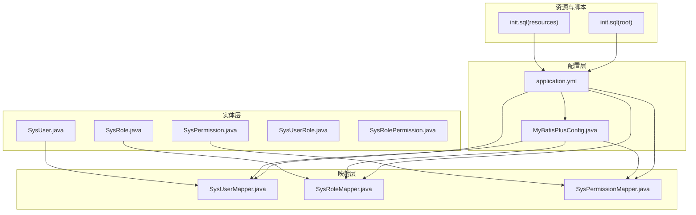
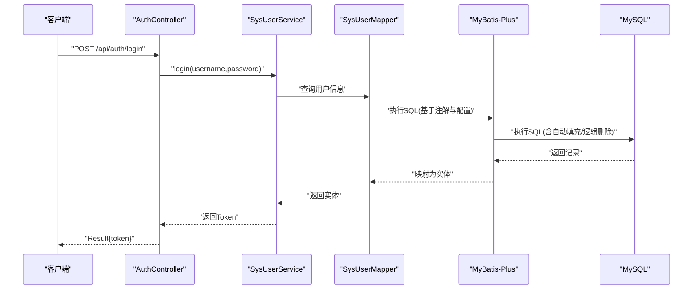
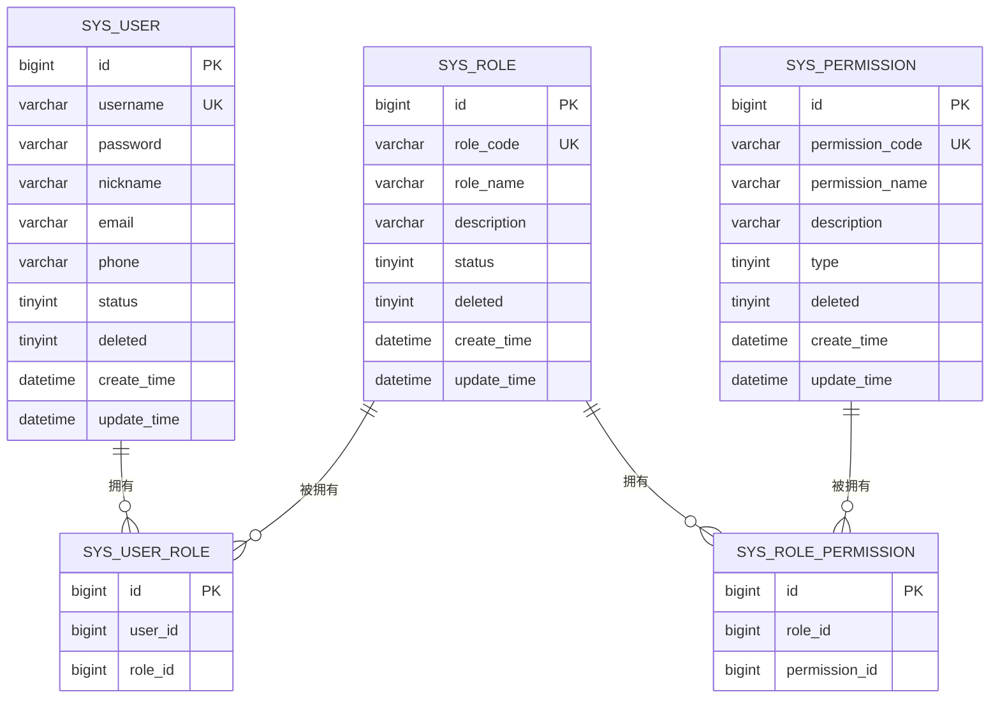
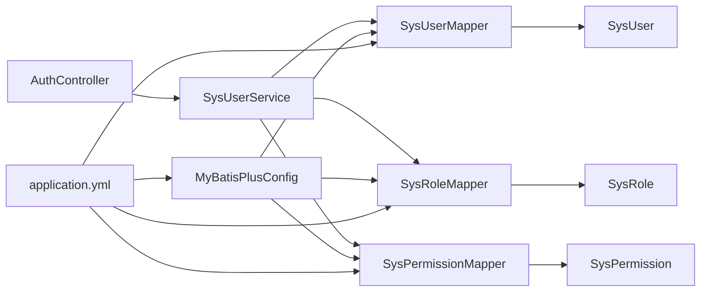

# 数据映射策略

<cite>
**本文引用的文件**
- [SysUser.java](file://src/main/java/com/bookorder/entity/SysUser.java)
- [SysRole.java](file://src/main/java/com/bookorder/entity/SysRole.java)
- [SysPermission.java](file://src/main/java/com/bookorder/entity/SysPermission.java)
- [SysRolePermission.java](file://src/main/java/com/bookorder/entity/SysRolePermission.java)
- [SysUserRole.java](file://src/main/java/com/bookorder/entity/SysUserRole.java)
- [SysUserMapper.java](file://src/main/java/com/bookorder/mapper/SysUserMapper.java)
- [SysRoleMapper.java](file://src/main/java/com/bookorder/mapper/SysRoleMapper.java)
- [SysPermissionMapper.java](file://src/main/java/com/bookorder/mapper/SysPermissionMapper.java)
- [MyBatisPlusConfig.java](file://src/main/java/com/bookorder/config/MyBatisPlusConfig.java)
- [application.yml](file://src/main/resources/application.yml)
- [init.sql（resources）](file://src/main/resources/sql/init.sql)
- [init.sql（根目录）](file://sql/init.sql)
- [LoginRequest.java](file://src/main/java/com/bookorder/dto/LoginRequest.java)
- [UserInfoVO.java](file://src/main/java/com/bookorder/dto/UserInfoVO.java)
- [AuthController.java](file://src/main/java/com/bookorder/controller/AuthController.java)
</cite>

## 目录
1. [引言](#引言)
2. [项目结构](#项目结构)
3. [核心组件](#核心组件)
4. [架构总览](#架构总览)
5. [详细组件分析](#详细组件分析)
6. [依赖分析](#依赖分析)
7. [性能考虑](#性能考虑)
8. [故障排查指南](#故障排查指南)
9. [结论](#结论)
10. [附录](#附录)

## 引言
本文件聚焦于本项目的“数据映射策略”，系统性阐述实体类与数据库表之间的映射关系、注解使用方式、字段命名规范与驼峰命名转换机制、主键策略与自增字段配置、关联关系映射（一对一、一对多、多对多）、逻辑删除、时间戳自动填充、枚举与JSON序列化、数据验证注解与字段约束、以及NULL值与默认值的映射策略。内容以实际源码为依据，辅以图示帮助不同背景的读者理解。

## 项目结构
项目采用分层架构，围绕MyBatis-Plus进行数据访问与映射：
- 实体层：位于entity包，使用MyBatis-Plus注解标注表名、主键、逻辑删除、字段填充等
- 映射层：位于mapper包，继承BaseMapper，提供通用CRUD能力及自定义SQL查询
- 配置层：位于config包，注册MetaObjectHandler实现自动填充
- 资源配置：application.yml中开启下划线转驼峰、全局逻辑删除配置
- 初始化脚本：提供完整的表结构与初始数据



**图表来源**
- [SysUser.java:1-48](file://src/main/java/com/bookorder/entity/SysUser.java#L1-L48)
- [SysRole.java:1-42](file://src/main/java/com/bookorder/entity/SysRole.java#L1-L42)
- [SysPermission.java:1-42](file://src/main/java/com/bookorder/entity/SysPermission.java#L1-L42)
- [SysUserRole.java:1-22](file://src/main/java/com/bookorder/entity/SysUserRole.java#L1-L22)
- [SysRolePermission.java:1-22](file://src/main/java/com/bookorder/entity/SysRolePermission.java#L1-L22)
- [SysUserMapper.java:1-25](file://src/main/java/com/bookorder/mapper/SysUserMapper.java#L1-L25)
- [SysRoleMapper.java:1-10](file://src/main/java/com/bookorder/mapper/SysRoleMapper.java#L1-L10)
- [SysPermissionMapper.java:1-10](file://src/main/java/com/bookorder/mapper/SysPermissionMapper.java#L1-L10)
- [MyBatisPlusConfig.java:1-23](file://src/main/java/com/bookorder/config/MyBatisPlusConfig.java#L1-L23)
- [application.yml:1-33](file://src/main/resources/application.yml#L1-L33)
- [init.sql（resources）:1-121](file://src/main/resources/sql/init.sql#L1-L121)
- [init.sql（根目录）:1-124](file://sql/init.sql#L1-L124)

**章节来源**
- [application.yml:15-25](file://src/main/resources/application.yml#L15-L25)
- [init.sql（resources）:1-121](file://src/main/resources/sql/init.sql#L1-L121)

## 核心组件
- 实体类与表映射
  - 使用@TableName指定表名；字段名与数据库列名一致或通过下划线转驼峰映射
  - 主键策略：@TableId(type = IdType.AUTO)，对应数据库自增
  - 逻辑删除：@TableLogic标记deleted字段，结合全局配置实现软删除
  - 字段填充：@TableField(fill = ...)在插入/更新时自动填充时间字段
- 映射器与通用CRUD
  - Mapper接口继承BaseMapper，获得通用CRUD能力
  - 自定义SQL通过@Select注解实现复杂查询（如按用户查询角色/权限）
- 全局自动填充
  - MetaObjectHandler在插入/更新时统一设置时间字段，避免重复逻辑
- 配置要点
  - mybatis-plus.configuration.map-underscore-to-camel-case: true
  - mybatis-plus.global-config.db-config.id-type: auto
  - 逻辑删除字段与取值：deleted、1、0

**章节来源**
- [SysUser.java:6-25](file://src/main/java/com/bookorder/entity/SysUser.java#L6-L25)
- [SysRole.java:6-23](file://src/main/java/com/bookorder/entity/SysRole.java#L6-L23)
- [SysPermission.java:6-23](file://src/main/java/com/bookorder/entity/SysPermission.java#L6-L23)
- [SysUserMapper.java:11-24](file://src/main/java/com/bookorder/mapper/SysUserMapper.java#L11-L24)
- [MyBatisPlusConfig.java:10-22](file://src/main/java/com/bookorder/config/MyBatisPlusConfig.java#L10-L22)
- [application.yml:15-24](file://src/main/resources/application.yml#L15-L24)

## 架构总览
下图展示从请求到数据库的映射流程：控制器接收参数，服务层调用Mapper执行SQL，MyBatis-Plus根据注解完成映射与自动填充，最终返回结果。



**图表来源**
- [AuthController.java:28-32](file://src/main/java/com/bookorder/controller/AuthController.java#L28-L32)
- [SysUserMapper.java:14-23](file://src/main/java/com/bookorder/mapper/SysUserMapper.java#L14-L23)
- [MyBatisPlusConfig.java:12-21](file://src/main/java/com/bookorder/config/MyBatisPlusConfig.java#L12-L21)
- [application.yml:15-24](file://src/main/resources/application.yml#L15-L24)

## 详细组件分析

### 实体类与表映射关系
- 表与实体映射
  - SysUser -> sys_user
  - SysRole -> sys_role
  - SysPermission -> sys_permission
  - SysUserRole -> sys_user_role
  - SysRolePermission -> sys_role_permission
- 主键策略
  - 所有实体主键均使用@TableName("...")与数据库自增配合(IdType.AUTO)
- 逻辑删除
  - 通过@TableName("...")与deleted字段的@TableLogic注解实现软删除
  - 全局配置中指定了逻辑删除字段与取值
- 时间字段自动填充
  - 插入时填充create_time/update_time
  - 更新时仅填充update_time
- 字段命名与驼峰转换
  - application.yml开启map-underscore-to-camel-case，Java字段如createTime会自动映射到数据库列create_time

```mermaid
classDiagram
class SysUser {
"+Long id"
"+String username"
"+String password"
"+String nickname"
"+String email"
"+String phone"
"+Integer status"
"+Integer deleted"
"+LocalDateTime createTime"
"+LocalDateTime updateTime"
}
class SysRole {
"+Long id"
"+String roleCode"
"+String roleName"
"+String description"
"+Integer status"
"+Integer deleted"
"+LocalDateTime createTime"
"+LocalDateTime updateTime"
}
class SysPermission {
"+Long id"
"+String permissionCode"
"+String permissionName"
"+String description"
"+Integer type"
"+Integer deleted"
"+LocalDateTime createTime"
"+LocalDateTime updateTime"
}
class SysUserRole {
"+Long id"
"+Long userId"
"+Long roleId"
}
class SysRolePermission {
"+Long id"
"+Long roleId"
"+Long permissionId"
}
```

**图表来源**
- [SysUser.java:6-25](file://src/main/java/com/bookorder/entity/SysUser.java#L6-L25)
- [SysRole.java:6-23](file://src/main/java/com/bookorder/entity/SysRole.java#L6-L23)
- [SysPermission.java:6-23](file://src/main/java/com/bookorder/entity/SysPermission.java#L6-L23)
- [SysUserRole.java:7-13](file://src/main/java/com/bookorder/entity/SysUserRole.java#L7-L13)
- [SysRolePermission.java:7-13](file://src/main/java/com/bookorder/entity/SysRolePermission.java#L7-L13)

**章节来源**
- [SysUser.java:6-25](file://src/main/java/com/bookorder/entity/SysUser.java#L6-L25)
- [SysRole.java:6-23](file://src/main/java/com/bookorder/entity/SysRole.java#L6-L23)
- [SysPermission.java:6-23](file://src/main/java/com/bookorder/entity/SysPermission.java#L6-L23)
- [application.yml:15-24](file://src/main/resources/application.yml#L15-L24)

### 字段命名规范与驼峰命名转换机制
- 命名规范
  - Java侧使用驼峰命名（如createTime、roleCode）
  - 数据库侧使用下划线命名（如create_time、role_code）
- 转换机制
  - application.yml启用map-underscore-to-camel-case后，MyBatis-Plus在映射时自动进行转换
- 约束与默认值
  - 表结构中对NOT NULL、UNIQUE、DEFAULT、COMMENT等进行了明确约束，确保数据完整性

**章节来源**
- [application.yml:17-17](file://src/main/resources/application.yml#L17-L17)
- [init.sql（resources）:9-20](file://src/main/resources/sql/init.sql#L9-L20)
- [init.sql（resources）:25-36](file://src/main/resources/sql/init.sql#L25-L36)
- [init.sql（resources）:39-48](file://src/main/resources/sql/init.sql#L39-L48)

### 主键策略与自增字段配置
- 主键策略
  - 实体类使用@IdType.AUTO，对应数据库自增主键
- 全局配置
  - application.yml设置id-type为auto，保证生成策略一致性
- 关联表
  - 关联表（sys_user_role、sys_role_permission）同样使用自增主键，并设置唯一索引组合约束，防止重复绑定

**章节来源**
- [SysUser.java:9-10](file://src/main/java/com/bookorder/entity/SysUser.java#L9-L10)
- [SysRole.java:9-10](file://src/main/java/com/bookorder/entity/SysRole.java#L9-L10)
- [SysPermission.java:9-10](file://src/main/java/com/bookorder/entity/SysPermission.java#L9-L10)
- [SysUserRole.java:10-13](file://src/main/java/com/bookorder/entity/SysUserRole.java#L10-L13)
- [SysRolePermission.java:10-13](file://src/main/java/com/bookorder/entity/SysRolePermission.java#L10-L13)
- [application.yml:21-21](file://src/main/resources/application.yml#L21-L21)
- [init.sql（resources）:53-58](file://src/main/resources/sql/init.sql#L53-L58)
- [init.sql（resources）:63-68](file://src/main/resources/sql/init.sql#L63-L68)

### 关联关系的映射实现
- 多对多关系
  - 用户-角色：SysUserRole作为中间表，保存user_id与role_id
  - 角色-权限：SysRolePermission作为中间表，保存role_id与permission_id
- 查询实现
  - SysUserMapper提供自定义SQL，通过内连接查询用户的角色编码与权限编码
- 关系图



**图表来源**
- [SysUser.java:6-25](file://src/main/java/com/bookorder/entity/SysUser.java#L6-L25)
- [SysRole.java:6-23](file://src/main/java/com/bookorder/entity/SysRole.java#L6-L23)
- [SysPermission.java:6-23](file://src/main/java/com/bookorder/entity/SysPermission.java#L6-L23)
- [SysUserRole.java:7-13](file://src/main/java/com/bookorder/entity/SysUserRole.java#L7-L13)
- [SysRolePermission.java:7-13](file://src/main/java/com/bookorder/entity/SysRolePermission.java#L7-L13)
- [init.sql（resources）:9-20](file://src/main/resources/sql/init.sql#L9-L20)
- [init.sql（resources）:25-36](file://src/main/resources/sql/init.sql#L25-L36)
- [init.sql（resources）:39-48](file://src/main/resources/sql/init.sql#L39-L48)
- [init.sql（resources）:53-68](file://src/main/resources/sql/init.sql#L53-L68)

**章节来源**
- [SysUserMapper.java:14-23](file://src/main/java/com/bookorder/mapper/SysUserMapper.java#L14-L23)
- [SysUserRole.java:7-13](file://src/main/java/com/bookorder/entity/SysUserRole.java#L7-L13)
- [SysRolePermission.java:7-13](file://src/main/java/com/bookorder/entity/SysRolePermission.java#L7-L13)

### 枚举类型与JSON序列化
- 当前实体未直接使用Java枚举类型进行映射
- 若需引入枚举映射，建议：
  - 在实体中使用枚举字段
  - 配置MyBatis-Plus的TypeHandler或Jackson的@JsonFormat以控制序列化格式
  - 在application.yml中可配置全局的JSON序列化策略（如时间格式）

**章节来源**
- [application.yml:15-18](file://src/main/resources/application.yml#L15-L18)

### 数据验证注解与字段约束
- 参数校验
  - DTO中使用@NotBlank等JSR-303注解进行输入校验
  - 控制器方法上使用@Valid触发校验
- 数据库约束
  - 表结构中定义了NOT NULL、UNIQUE、DEFAULT、COMMENT等约束，保障数据一致性
- 示例路径
  - 登录请求参数校验：[LoginRequest.java:7-11](file://src/main/java/com/bookorder/dto/LoginRequest.java#L7-L11)
  - 控制器触发校验：[AuthController.java:29-31](file://src/main/java/com/bookorder/controller/AuthController.java#L29-L31)

**章节来源**
- [LoginRequest.java:7-11](file://src/main/java/com/bookorder/dto/LoginRequest.java#L7-L11)
- [AuthController.java:29-31](file://src/main/java/com/bookorder/controller/AuthController.java#L29-L31)
- [init.sql（resources）:9-20](file://src/main/resources/sql/init.sql#L9-L20)
- [init.sql（resources）:25-36](file://src/main/resources/sql/init.sql#L25-L36)
- [init.sql（resources）:39-48](file://src/main/resources/sql/init.sql#L39-L48)

### NULL值与默认值的映射策略
- 默认值策略
  - 数据库层面：status默认1，deleted默认0，时间字段默认当前时间
  - Java层面：未显式赋值时，整型默认0，LocalDateTime默认空（由自动填充覆盖）
- 逻辑删除
  - deleted=1表示已删除，deleted=0表示未删除；查询默认过滤deleted=0
- 自动填充
  - MetaObjectHandler在插入/更新时统一填充时间字段，减少业务代码中的重复逻辑

**章节来源**
- [MyBatisPlusConfig.java:12-21](file://src/main/java/com/bookorder/config/MyBatisPlusConfig.java#L12-L21)
- [SysUser.java:18-25](file://src/main/java/com/bookorder/entity/SysUser.java#L18-L25)
- [SysRole.java:16-23](file://src/main/java/com/bookorder/entity/SysRole.java#L16-L23)
- [SysPermission.java:16-23](file://src/main/java/com/bookorder/entity/SysPermission.java#L16-L23)
- [application.yml:22-24](file://src/main/resources/application.yml#L22-L24)
- [init.sql（resources）:16-19](file://src/main/resources/sql/init.sql#L16-L19)
- [init.sql（resources）:30-33](file://src/main/resources/sql/init.sql#L30-L33)
- [init.sql（resources）:44-47](file://src/main/resources/sql/init.sql#L44-L47)

## 依赖分析
- 组件耦合
  - 实体类与Mapper之间通过泛型建立强契约；Mapper继承BaseMapper获得通用能力
  - 控制器依赖服务层与Mapper；服务层依赖Mapper
- 依赖关系图



**图表来源**
- [AuthController.java:22-26](file://src/main/java/com/bookorder/controller/AuthController.java#L22-L26)
- [SysUserMapper.java:11-12](file://src/main/java/com/bookorder/mapper/SysUserMapper.java#L11-L12)
- [SysRoleMapper.java:7-8](file://src/main/java/com/bookorder/mapper/SysRoleMapper.java#L7-L8)
- [SysPermissionMapper.java:7-8](file://src/main/java/com/bookorder/mapper/SysPermissionMapper.java#L7-L8)
- [MyBatisPlusConfig.java:9-22](file://src/main/java/com/bookorder/config/MyBatisPlusConfig.java#L9-L22)
- [application.yml:15-24](file://src/main/resources/application.yml#L15-L24)

**章节来源**
- [AuthController.java:22-26](file://src/main/java/com/bookorder/controller/AuthController.java#L22-L26)
- [SysUserMapper.java:11-12](file://src/main/java/com/bookorder/mapper/SysUserMapper.java#L11-L12)
- [SysRoleMapper.java:7-8](file://src/main/java/com/bookorder/mapper/SysRoleMapper.java#L7-L8)
- [SysPermissionMapper.java:7-8](file://src/main/java/com/bookorder/mapper/SysPermissionMapper.java#L7-L8)
- [MyBatisPlusConfig.java:9-22](file://src/main/java/com/bookorder/config/MyBatisPlusConfig.java#L9-L22)
- [application.yml:15-24](file://src/main/resources/application.yml#L15-L24)

## 性能考虑
- 启用下划线转驼峰映射，避免手写列名映射，提升开发效率与可维护性
- 使用MetaObjectHandler统一处理时间字段，减少SQL中重复的时间设置
- 关联查询使用内连接与DISTINCT，避免重复数据与不必要的全表扫描
- 建议在高频查询列（如username、role_code、permission_code）上建立索引，进一步优化查询性能

## 故障排查指南
- 字段映射异常
  - 确认application.yml中map-underscore-to-camel-case是否开启
  - 检查实体字段命名是否符合驼峰规范
- 时间字段为空
  - 确认MetaObjectHandler是否生效，检查insertFill/updateFill逻辑
- 逻辑删除导致查询不到数据
  - 检查deleted字段取值与全局配置是否一致
- 自定义SQL查询失败
  - 核对@Select注解SQL语法与表/列名是否正确
- 参数校验失败
  - 检查DTO注解与控制器@Valid是否正确使用

**章节来源**
- [application.yml:17-17](file://src/main/resources/application.yml#L17-L17)
- [MyBatisPlusConfig.java:12-21](file://src/main/java/com/bookorder/config/MyBatisPlusConfig.java#L12-L21)
- [application.yml:22-24](file://src/main/resources/application.yml#L22-L24)
- [SysUserMapper.java:14-23](file://src/main/java/com/bookorder/mapper/SysUserMapper.java#L14-L23)
- [LoginRequest.java:7-11](file://src/main/java/com/bookorder/dto/LoginRequest.java#L7-L11)
- [AuthController.java:29-31](file://src/main/java/com/bookorder/controller/AuthController.java#L29-L31)

## 结论
本项目通过MyBatis-Plus注解与全局配置，实现了清晰、可维护且高性能的数据映射策略：统一的表名与字段映射、主键自增与逻辑删除、自动时间填充、严格的参数校验与数据库约束。对于扩展场景（如枚举映射、复杂JSON序列化），可在现有基础上引入TypeHandler或Jackson配置，保持整体一致性。

## 附录
- 初始化脚本与表结构参考路径
  - [init.sql（resources）:1-121](file://src/main/resources/sql/init.sql#L1-L121)
  - [init.sql（根目录）:1-124](file://sql/init.sql#L1-L124)
- DTO与控制器参考路径
  - [LoginRequest.java:1-18](file://src/main/java/com/bookorder/dto/LoginRequest.java#L1-L18)
  - [UserInfoVO.java:1-30](file://src/main/java/com/bookorder/dto/UserInfoVO.java#L1-L30)
  - [AuthController.java:1-59](file://src/main/java/com/bookorder/controller/AuthController.java#L1-L59)