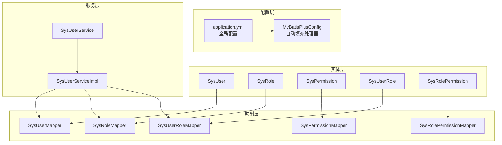
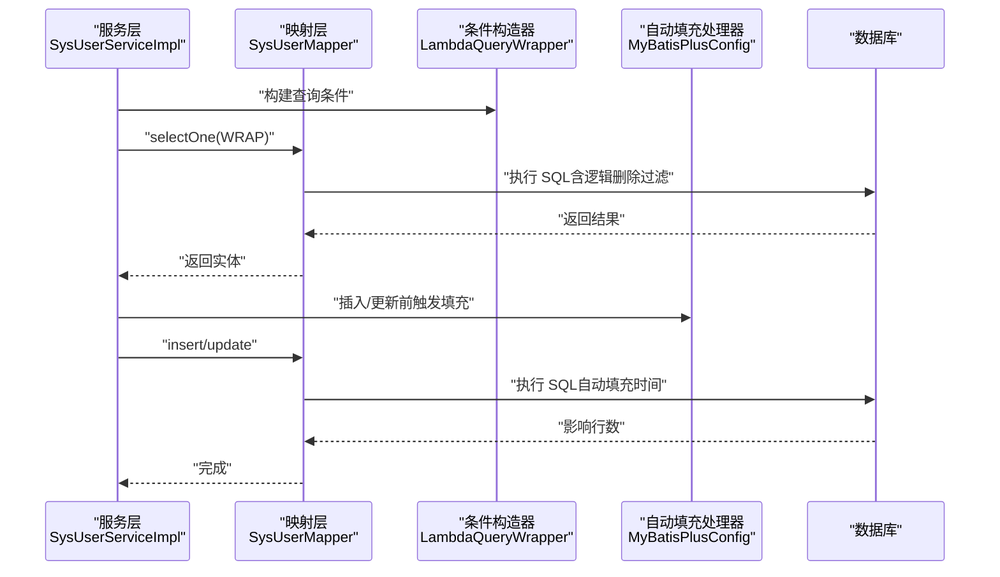
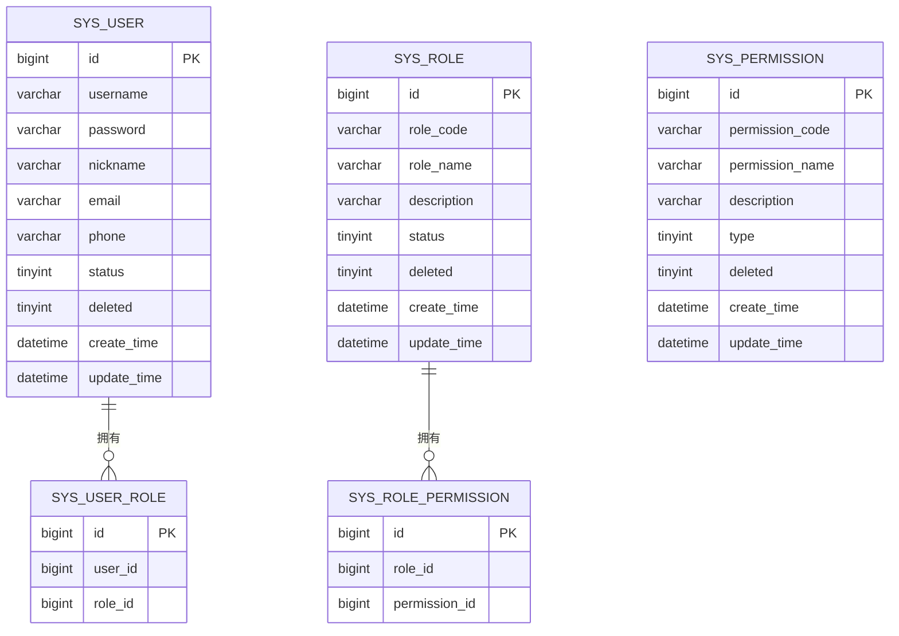
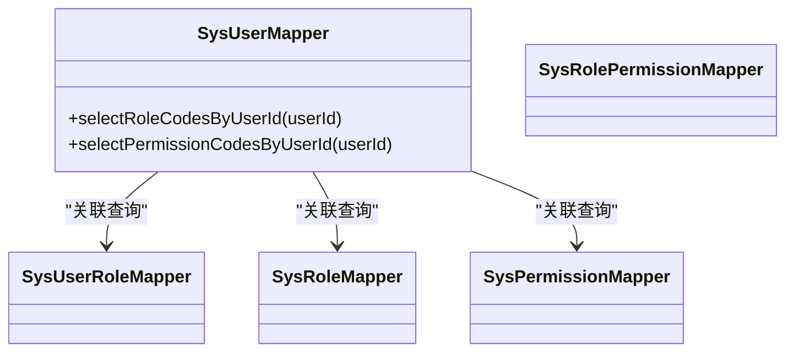
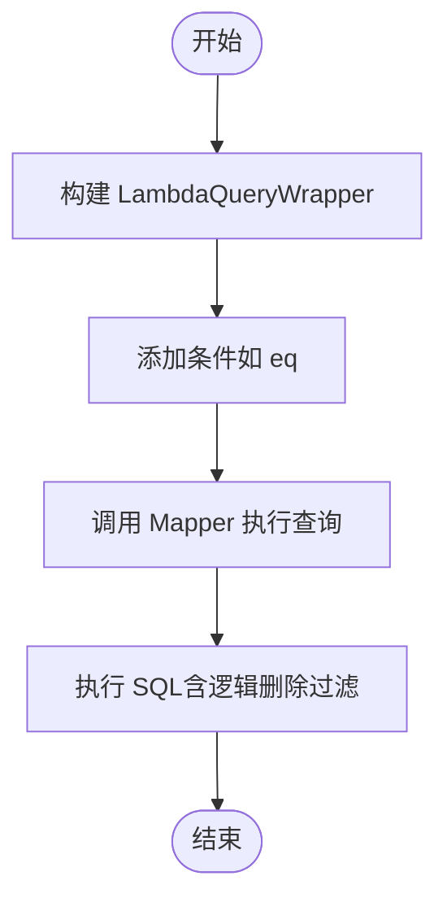
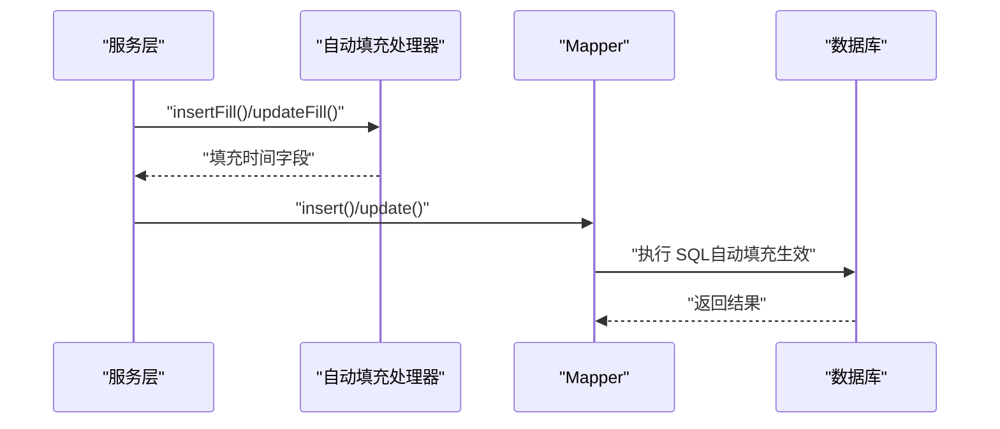
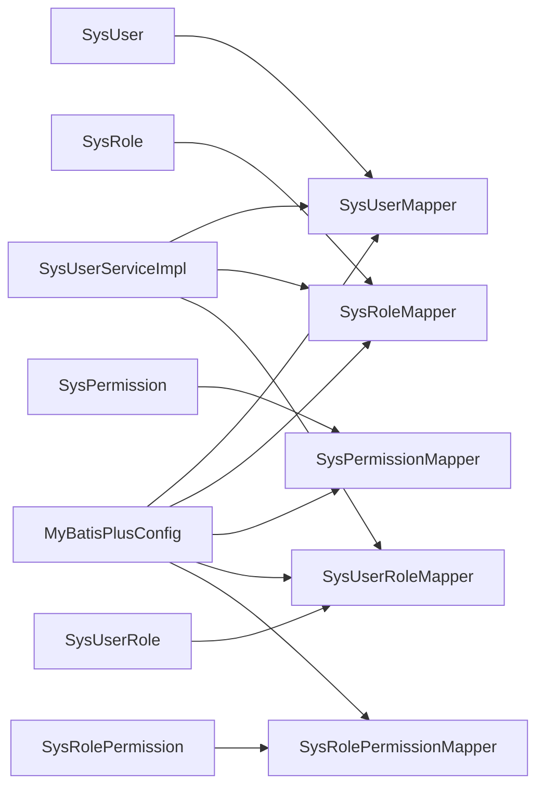

# 数据访问层

<cite>
**本文引用的文件**
- [MyBatisPlusConfig.java](file://src/main/java/com/bookorder/config/MyBatisPlusConfig.java)
- [application.yml](file://src/main/resources/application.yml)
- [SysUserMapper.java](file://src/main/java/com/bookorder/mapper/SysUserMapper.java)
- [SysRoleMapper.java](file://src/main/java/com/bookorder/mapper/SysRoleMapper.java)
- [SysPermissionMapper.java](file://src/main/java/com/bookorder/mapper/SysPermissionMapper.java)
- [SysUserRoleMapper.java](file://src/main/java/com/bookorder/mapper/SysUserRoleMapper.java)
- [SysRolePermissionMapper.java](file://src/main/java/com/bookorder/mapper/SysRolePermissionMapper.java)
- [SysUser.java](file://src/main/java/com/bookorder/entity/SysUser.java)
- [SysRole.java](file://src/main/java/com/bookorder/entity/SysRole.java)
- [SysPermission.java](file://src/main/java/com/bookorder/entity/SysPermission.java)
- [SysUserRole.java](file://src/main/java/com/bookorder/entity/SysUserRole.java)
- [SysRolePermission.java](file://src/main/java/com/bookorder/entity/SysRolePermission.java)
- [SysUserServiceImpl.java](file://src/main/java/com/bookorder/service/impl/SysUserServiceImpl.java)
- [SysUserService.java](file://src/main/java/com/bookorder/service/SysUserService.java)
- [init.sql](file://sql/init.sql)
</cite>

## 目录
1. [引言](#引言)
2. [项目结构](#项目结构)
3. [核心组件](#核心组件)
4. [架构总览](#架构总览)
5. [详细组件分析](#详细组件分析)
6. [依赖分析](#依赖分析)
7. [性能考虑](#性能考虑)
8. [故障排查指南](#故障排查指南)
9. [结论](#结论)
10. [附录](#附录)

## 引言
本文件聚焦于数据访问层（DAO）的技术文档，围绕 MyBatis-Plus 的配置与使用策略展开，涵盖以下主题：
- 全局自动填充（插入/更新时间）与逻辑删除配置
- Mapper 接口设计原则与标准 CRUD 方法使用
- 实体与数据库表的映射关系与命名规范
- 条件构造器与动态 SQL 的使用方式
- 数据访问最佳实践：事务管理、批量操作、性能优化
- 自定义 SQL 编写与复杂查询实现思路

## 项目结构
数据访问层主要由以下模块构成：
- 配置层：MyBatis-Plus 全局配置与自动填充处理器
- 实体层：基于注解的实体类，映射数据库表字段
- 映射层：Mapper 接口，继承 BaseMapper 或扩展自定义 SQL
- 服务层：通过 ServiceImpl 使用 MyBatis-Plus 能力进行业务编排，并结合事务控制

图表来源
- [MyBatisPlusConfig.java:1-23](file://src/main/java/com/bookorder/config/MyBatisPlusConfig.java#L1-L23)
- [application.yml:15-25](file://src/main/resources/application.yml#L15-L25)
- [SysUser.java:1-48](file://src/main/java/com/bookorder/entity/SysUser.java#L1-L48)
- [SysRole.java:1-42](file://src/main/java/com/bookorder/entity/SysRole.java#L1-L42)
- [SysPermission.java:1-42](file://src/main/java/com/bookorder/entity/SysPermission.java#L1-L42)
- [SysUserRole.java:1-22](file://src/main/java/com/bookorder/entity/SysUserRole.java#L1-L22)
- [SysRolePermission.java:1-22](file://src/main/java/com/bookorder/entity/SysRolePermission.java#L1-L22)
- [SysUserMapper.java:1-25](file://src/main/java/com/bookorder/mapper/SysUserMapper.java#L1-L25)
- [SysRoleMapper.java:1-10](file://src/main/java/com/bookorder/mapper/SysRoleMapper.java#L1-L10)
- [SysPermissionMapper.java:1-10](file://src/main/java/com/bookorder/mapper/SysPermissionMapper.java#L1-L10)
- [SysUserRoleMapper.java:1-10](file://src/main/java/com/bookorder/mapper/SysUserRoleMapper.java#L1-L10)
- [SysRolePermissionMapper.java:1-10](file://src/main/java/com/bookorder/mapper/SysRolePermissionMapper.java#L1-L10)
- [SysUserServiceImpl.java:1-87](file://src/main/java/com/bookorder/service/impl/SysUserServiceImpl.java#L1-L87)
- [SysUserService.java:1-16](file://src/main/java/com/bookorder/service/SysUserService.java#L1-L16)

章节来源
- [application.yml:15-25](file://src/main/resources/application.yml#L15-L25)
- [MyBatisPlusConfig.java:1-23](file://src/main/java/com/bookorder/config/MyBatisPlusConfig.java#L1-L23)

## 核心组件
- 全局自动填充处理器：在插入与更新时自动填充时间字段，减少重复代码与遗漏风险
- 逻辑删除配置：统一的逻辑删除字段与值，确保查询默认过滤已删除记录
- 基础 Mapper：继承 BaseMapper 即获得标准 CRUD 能力；必要时通过注解扩展自定义 SQL
- 条件构造器：LambdaQueryWrapper 等提供类型安全的查询条件拼装
- 事务控制：服务层使用 @Transactional 管理跨表写入一致性

章节来源
- [MyBatisPlusConfig.java:10-22](file://src/main/java/com/bookorder/config/MyBatisPlusConfig.java#L10-L22)
- [application.yml:15-25](file://src/main/resources/application.yml#L15-L25)
- [SysUserMapper.java:11-24](file://src/main/java/com/bookorder/mapper/SysUserMapper.java#L11-L24)
- [SysUserServiceImpl.java:43-80](file://src/main/java/com/bookorder/service/impl/SysUserServiceImpl.java#L43-L80)

## 架构总览
下图展示从服务层到数据访问层的关键交互路径，体现条件构造器、自动填充与逻辑删除的协同工作。

图表来源
- [SysUserServiceImpl.java:43-80](file://src/main/java/com/bookorder/service/impl/SysUserServiceImpl.java#L43-L80)
- [SysUserMapper.java:11-24](file://src/main/java/com/bookorder/mapper/SysUserMapper.java#L11-L24)
- [MyBatisPlusConfig.java:10-22](file://src/main/java/com/bookorder/config/MyBatisPlusConfig.java#L10-L22)

## 详细组件分析

### 实体与映射关系
- 表名与实体类采用下划线与驼峰映射策略，配合全局配置启用下划线转驼峰
- 逻辑删除字段统一使用 deleted 字段，配合全局配置设置逻辑删除值
- 时间字段通过注解声明自动填充策略，保证插入与更新时的时间一致性

图表来源
- [SysUser.java:6-26](file://src/main/java/com/bookorder/entity/SysUser.java#L6-L26)
- [SysRole.java:6-24](file://src/main/java/com/bookorder/entity/SysRole.java#L6-L24)
- [SysPermission.java:6-24](file://src/main/java/com/bookorder/entity/SysPermission.java#L6-L24)
- [SysUserRole.java:7-14](file://src/main/java/com/bookorder/entity/SysUserRole.java#L7-L14)
- [SysRolePermission.java:7-14](file://src/main/java/com/bookorder/entity/SysRolePermission.java#L7-L14)
- [init.sql:11-22](file://sql/init.sql#L11-L22)
- [init.sql:27-36](file://sql/init.sql#L27-L36)
- [init.sql:41-50](file://sql/init.sql#L41-L50)
- [init.sql:55-60](file://sql/init.sql#L55-L60)
- [init.sql:65-70](file://sql/init.sql#L65-L70)

章节来源
- [SysUser.java:6-26](file://src/main/java/com/bookorder/entity/SysUser.java#L6-L26)
- [SysRole.java:6-24](file://src/main/java/com/bookorder/entity/SysRole.java#L6-L24)
- [SysPermission.java:6-24](file://src/main/java/com/bookorder/entity/SysPermission.java#L6-L24)
- [SysUserRole.java:7-14](file://src/main/java/com/bookorder/entity/SysUserRole.java#L7-L14)
- [SysRolePermission.java:7-14](file://src/main/java/com/bookorder/entity/SysRolePermission.java#L7-L14)
- [application.yml:17-24](file://src/main/resources/application.yml#L17-L24)

### Mapper 接口设计与标准 CRUD
- 基础能力：所有 Mapper 继承 BaseMapper，即可获得标准 CRUD 与分页能力
- 扩展查询：通过 @Select 注解编写自定义 SQL，满足多表关联与复杂筛选
- 设计原则：
  - 将通用查询封装在 Mapper 中，避免在服务层拼接 SQL
  - 对外暴露清晰的方法语义（如按用户查询角色编码）
  - 保持方法参数与返回值稳定，便于上层调用

图表来源
- [SysUserMapper.java:11-24](file://src/main/java/com/bookorder/mapper/SysUserMapper.java#L11-L24)
- [SysRoleMapper.java:7-9](file://src/main/java/com/bookorder/mapper/SysRoleMapper.java#L7-L9)
- [SysPermissionMapper.java:7-9](file://src/main/java/com/bookorder/mapper/SysPermissionMapper.java#L7-L9)
- [SysUserRoleMapper.java:7-9](file://src/main/java/com/bookorder/mapper/SysUserRoleMapper.java#L7-L9)
- [SysRolePermissionMapper.java:7-9](file://src/main/java/com/bookorder/mapper/SysRolePermissionMapper.java#L7-L9)

章节来源
- [SysUserMapper.java:11-24](file://src/main/java/com/bookorder/mapper/SysUserMapper.java#L11-L24)
- [SysRoleMapper.java:7-9](file://src/main/java/com/bookorder/mapper/SysRoleMapper.java#L7-L9)
- [SysPermissionMapper.java:7-9](file://src/main/java/com/bookorder/mapper/SysPermissionMapper.java#L7-L9)
- [SysUserRoleMapper.java:7-9](file://src/main/java/com/bookorder/mapper/SysUserRoleMapper.java#L7-L9)
- [SysRolePermissionMapper.java:7-9](file://src/main/java/com/bookorder/mapper/SysRolePermissionMapper.java#L7-L9)

### 条件构造器与动态 SQL
- 类型安全：使用 LambdaQueryWrapper 构建查询条件，避免硬编码字段名
- 复杂查询：在 Mapper 中以注解形式编写 SQL，结合多表连接与去重等特性
- 最佳实践：
  - 在服务层组装条件，Mapper 负责执行
  - 对需要“未删除”过滤的查询，依赖全局逻辑删除配置，无需手动拼接 WHERE 条件

图表来源
- [SysUserServiceImpl.java:43-47](file://src/main/java/com/bookorder/service/impl/SysUserServiceImpl.java#L43-L47)
- [SysUserMapper.java:14-23](file://src/main/java/com/bookorder/mapper/SysUserMapper.java#L14-L23)

章节来源
- [SysUserServiceImpl.java:43-47](file://src/main/java/com/bookorder/service/impl/SysUserServiceImpl.java#L43-L47)
- [SysUserMapper.java:14-23](file://src/main/java/com/bookorder/mapper/SysUserMapper.java#L14-L23)

### 自动填充与逻辑删除
- 自动填充：插入与更新时自动填充时间字段，减少手工赋值
- 逻辑删除：全局配置逻辑删除字段与取值，查询默认过滤已删除记录
- 配置要点：
  - application.yml 中开启下划线转驼峰与日志输出
  - 实体类中使用注解声明逻辑删除字段与自动填充字段

图表来源
- [MyBatisPlusConfig.java:10-22](file://src/main/java/com/bookorder/config/MyBatisPlusConfig.java#L10-L22)
- [application.yml:15-25](file://src/main/resources/application.yml#L15-L25)
- [SysUser.java:18-25](file://src/main/java/com/bookorder/entity/SysUser.java#L18-L25)

章节来源
- [MyBatisPlusConfig.java:10-22](file://src/main/java/com/bookorder/config/MyBatisPlusConfig.java#L10-L22)
- [application.yml:15-25](file://src/main/resources/application.yml#L15-L25)
- [SysUser.java:18-25](file://src/main/java/com/bookorder/entity/SysUser.java#L18-L25)

### 事务管理与批量操作
- 事务管理：服务层使用 @Transactional 确保注册流程中的多表写入一致
- 批量操作：MyBatis-Plus 提供批量插入/更新工具，建议在服务层集中处理，避免分散在 Mapper 中
- 优化建议：
  - 合理拆分事务边界，避免长事务阻塞
  - 批量操作时注意内存占用与数据库压力，分批提交

章节来源
- [SysUserServiceImpl.java:57-80](file://src/main/java/com/bookorder/service/impl/SysUserServiceImpl.java#L57-L80)

## 依赖分析
- Mapper 依赖实体类进行字段映射
- 服务层依赖多个 Mapper 完成跨表业务
- 全局配置为自动填充与逻辑删除提供支撑
- 数据初始化脚本定义了完整的表结构与初始数据

图表来源
- [SysUser.java:1-48](file://src/main/java/com/bookorder/entity/SysUser.java#L1-L48)
- [SysRole.java:1-42](file://src/main/java/com/bookorder/entity/SysRole.java#L1-L42)
- [SysPermission.java:1-42](file://src/main/java/com/bookorder/entity/SysPermission.java#L1-L42)
- [SysUserRole.java:1-22](file://src/main/java/com/bookorder/entity/SysUserRole.java#L1-L22)
- [SysRolePermission.java:1-22](file://src/main/java/com/bookorder/entity/SysRolePermission.java#L1-L22)
- [SysUserMapper.java:1-25](file://src/main/java/com/bookorder/mapper/SysUserMapper.java#L1-L25)
- [SysRoleMapper.java:1-10](file://src/main/java/com/bookorder/mapper/SysRoleMapper.java#L1-L10)
- [SysPermissionMapper.java:1-10](file://src/main/java/com/bookorder/mapper/SysPermissionMapper.java#L1-L10)
- [SysUserRoleMapper.java:1-10](file://src/main/java/com/bookorder/mapper/SysUserRoleMapper.java#L1-L10)
- [SysRolePermissionMapper.java:1-10](file://src/main/java/com/bookorder/mapper/SysRolePermissionMapper.java#L1-L10)
- [SysUserServiceImpl.java:1-87](file://src/main/java/com/bookorder/service/impl/SysUserServiceImpl.java#L1-L87)
- [MyBatisPlusConfig.java:1-23](file://src/main/java/com/bookorder/config/MyBatisPlusConfig.java#L1-L23)

章节来源
- [SysUserServiceImpl.java:22-41](file://src/main/java/com/bookorder/service/impl/SysUserServiceImpl.java#L22-L41)
- [SysUserMapper.java:11-24](file://src/main/java/com/bookorder/mapper/SysUserMapper.java#L11-L24)

## 性能考虑
- 查询优化
  - 使用条件构造器精准过滤，避免全表扫描
  - 利用逻辑删除配置减少无效数据扫描
  - 对高频查询建立合适索引（如用户唯一索引）
- 写入优化
  - 批量插入/更新时分批提交，降低锁竞争
  - 合理使用自动填充，避免重复计算
- 配置优化
  - 开启日志便于定位慢查询
  - 下划线转驼峰提升开发体验与可读性

## 故障排查指南
- 插入时间为空
  - 检查自动填充处理器是否生效
  - 确认实体类时间字段注解与全局配置一致
- 查询返回包含已删除数据
  - 检查逻辑删除字段与取值配置
  - 确认查询是否绕过全局配置（不建议）
- 自定义 SQL 报错
  - 核对表名与字段名大小写与数据库一致
  - 确认多表连接字段别名与实体属性映射正确
- 事务未生效
  - 检查服务方法可见性与异常类型是否触发回滚
  - 确认跨方法调用未被代理拦截

章节来源
- [MyBatisPlusConfig.java:10-22](file://src/main/java/com/bookorder/config/MyBatisPlusConfig.java#L10-L22)
- [application.yml:15-25](file://src/main/resources/application.yml#L15-L25)
- [SysUserMapper.java:14-23](file://src/main/java/com/bookorder/mapper/SysUserMapper.java#L14-L23)
- [SysUserServiceImpl.java:57-80](file://src/main/java/com/bookorder/service/impl/SysUserServiceImpl.java#L57-L80)

## 结论
本项目的数据访问层以 MyBatis-Plus 为核心，通过全局自动填充与逻辑删除配置简化了常见业务逻辑，结合条件构造器与标准 CRUD 能力提升了开发效率与一致性。服务层在事务与批量操作方面提供了稳健的保障，配合合理的查询与写入策略，能够满足系统当前的功能需求。后续可在复杂查询与性能监控方面进一步完善。

## 附录
- 数据初始化脚本用于快速搭建开发环境，包含用户、角色、权限及关联关系的初始数据
- 建议在生产环境中增加慢查询日志与数据库连接池监控，持续优化性能

章节来源
- [init.sql:1-124](file://sql/init.sql#L1-L124)