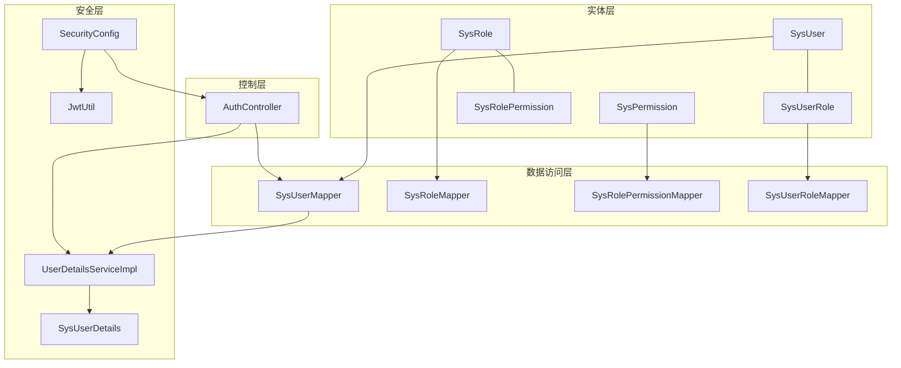
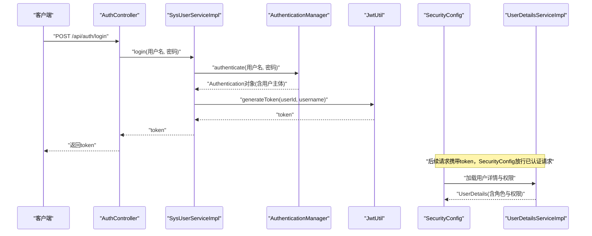
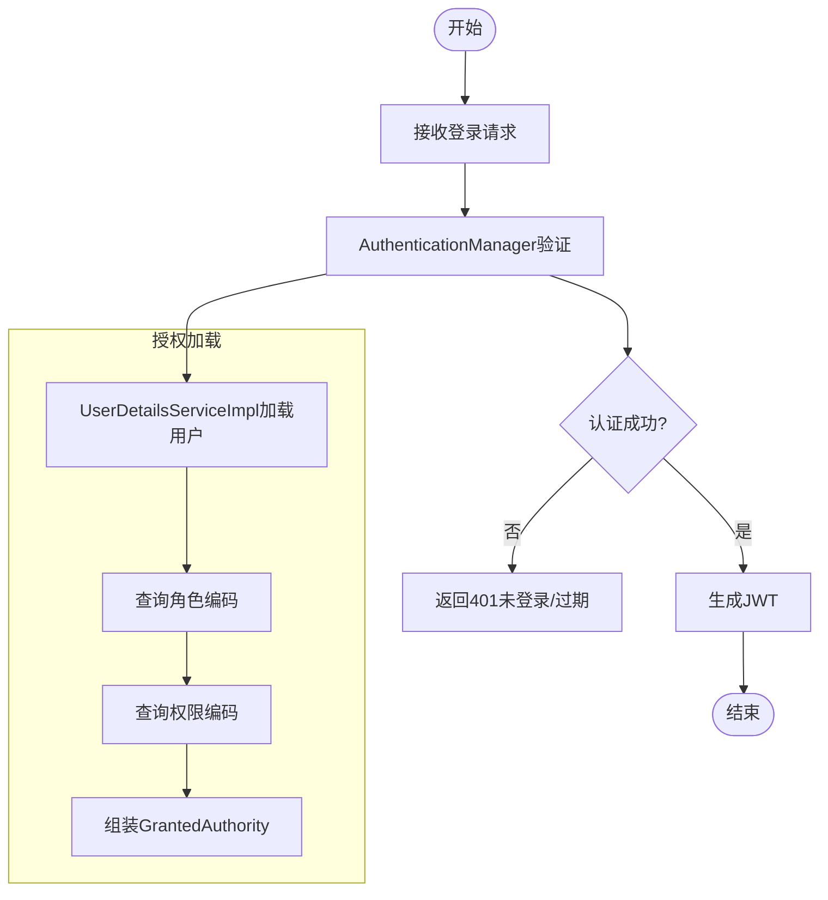
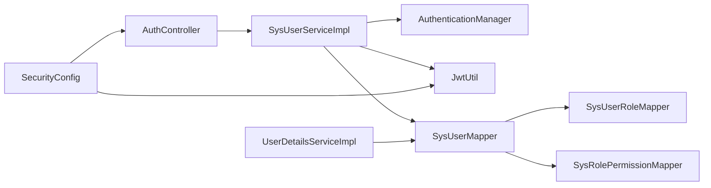

# RBAC权限模型设计

<cite>
**本文档引用的文件**
- [SysRole.java](file://src/main/java/com/bookorder/entity/SysRole.java)
- [SysPermission.java](file://src/main/java/com/bookorder/entity/SysPermission.java)
- [SysUserRole.java](file://src/main/java/com/bookorder/entity/SysUserRole.java)
- [SysRolePermission.java](file://src/main/java/com/bookorder/entity/SysRolePermission.java)
- [SysUser.java](file://src/main/java/com/bookorder/entity/SysUser.java)
- [SysUserMapper.java](file://src/main/java/com/bookorder/mapper/SysUserMapper.java)
- [SysRolePermissionMapper.java](file://src/main/java/com/bookorder/mapper/SysRolePermissionMapper.java)
- [SysUserRoleMapper.java](file://src/main/java/com/bookorder/mapper/SysUserRoleMapper.java)
- [SysRoleMapper.java](file://src/main/java/com/bookorder/mapper/SysRoleMapper.java)
- [UserDetailsServiceImpl.java](file://src/main/java/com/bookorder/security/UserDetailsServiceImpl.java)
- [SysUserDetails.java](file://src/main/java/com/bookorder/security/SysUserDetails.java)
- [JwtUtil.java](file://src/main/java/com/bookorder/security/JwtUtil.java)
- [SecurityConfig.java](file://src/main/java/com/bookorder/config/SecurityConfig.java)
- [AuthController.java](file://src/main/java/com/bookorder/controller/AuthController.java)
- [SysUserServiceImpl.java](file://src/main/java/com/bookorder/service/impl/SysUserServiceImpl.java)
- [application.yml](file://src/main/resources/application.yml)
- [init.sql](file://sql/init.sql)
</cite>

## 目录
1. [引言](#引言)
2. [项目结构](#项目结构)
3. [核心组件](#核心组件)
4. [架构总览](#架构总览)
5. [详细组件分析](#详细组件分析)
6. [依赖分析](#依赖分析)
7. [性能考虑](#性能考虑)
8. [故障排除指南](#故障排除指南)
9. [结论](#结论)
10. [附录](#附录)

## 引言
本文件面向图书订单系统的RBAC（基于角色的访问控制）权限模型，系统化阐述四类核心实体：SysRole（角色）、SysPermission（权限）、SysUserRole（用户-角色关联）、SysRolePermission（角色-权限关联）之间的关系与业务逻辑；解释角色-权限的多对多设计、用户-角色的关联机制；梳理权限继承、权限组合与冲突处理策略；并结合数据库表结构与实体关系图，给出数据模型设计思路、约束关系与扩展性建议。

## 项目结构
围绕RBAC模型，系统采用分层架构：
- 实体层：定义用户、角色、权限及两张关联表的持久化映射
- 数据访问层：MyBatis-Plus Mapper接口，提供基础CRUD与自定义SQL查询
- 安全层：Spring Security + JWT，负责认证、授权与拦截规则
- 控制器层：对外暴露认证、注册、个人信息等接口
- 配置层：数据库连接、MyBatis配置、安全过滤链与密码编码器



图表来源
- [SysUser.java:1-48](file://src/main/java/com/bookorder/entity/SysUser.java#L1-L48)
- [SysRole.java:1-42](file://src/main/java/com/bookorder/entity/SysRole.java#L1-L42)
- [SysPermission.java:1-42](file://src/main/java/com/bookorder/entity/SysPermission.java#L1-L42)
- [SysUserRole.java:1-22](file://src/main/java/com/bookorder/entity/SysUserRole.java#L1-L22)
- [SysRolePermission.java:1-22](file://src/main/java/com/bookorder/entity/SysRolePermission.java#L1-L22)
- [SysUserMapper.java:1-25](file://src/main/java/com/bookorder/mapper/SysUserMapper.java#L1-L25)
- [SysRoleMapper.java:1-10](file://src/main/java/com/bookorder/mapper/SysRoleMapper.java#L1-L10)
- [SysRolePermissionMapper.java:1-10](file://src/main/java/com/bookorder/mapper/SysRolePermissionMapper.java#L1-L10)
- [SysUserRoleMapper.java:1-10](file://src/main/java/com/bookorder/mapper/SysUserRoleMapper.java#L1-L10)
- [UserDetailsServiceImpl.java:1-50](file://src/main/java/com/bookorder/security/UserDetailsServiceImpl.java#L1-L50)
- [SysUserDetails.java:1-54](file://src/main/java/com/bookorder/security/SysUserDetails.java#L1-L54)
- [SecurityConfig.java:1-74](file://src/main/java/com/bookorder/config/SecurityConfig.java#L1-L74)
- [JwtUtil.java:1-62](file://src/main/java/com/bookorder/security/JwtUtil.java#L1-L62)
- [AuthController.java:1-59](file://src/main/java/com/bookorder/controller/AuthController.java#L1-L59)

章节来源
- [application.yml:1-33](file://src/main/resources/application.yml#L1-L33)

## 核心组件
- SysUser：用户实体，包含基础字段与软删除、时间戳字段
- SysRole：角色实体，含角色编码、名称、状态与软删除
- SysPermission：权限实体，含权限编码、名称、类型（菜单/按钮/接口）与软删除
- SysUserRole：用户-角色关联表，唯一约束确保同一用户不可重复绑定相同角色
- SysRolePermission：角色-权限关联表，唯一约束确保同一角色不可重复绑定相同权限

章节来源
- [SysUser.java:1-48](file://src/main/java/com/bookorder/entity/SysUser.java#L1-L48)
- [SysRole.java:1-42](file://src/main/java/com/bookorder/entity/SysRole.java#L1-L42)
- [SysPermission.java:1-42](file://src/main/java/com/bookorder/entity/SysPermission.java#L1-L42)
- [SysUserRole.java:1-22](file://src/main/java/com/bookorder/entity/SysUserRole.java#L1-L22)
- [SysRolePermission.java:1-22](file://src/main/java/com/bookorder/entity/SysRolePermission.java#L1-L22)

## 架构总览
RBAC模型在系统中的运行流程如下：
- 登录认证：用户提交凭据，由AuthenticationManager验证，成功后使用JwtUtil签发token
- 授权加载：UserDetailsServiceImpl按用户ID查询其角色编码与权限编码，组装为GrantedAuthority集合
- 访问控制：SecurityConfig配置拦截规则，未登录返回401，权限不足返回403
- 资源访问：控制器根据用户身份执行业务操作



图表来源
- [AuthController.java:1-59](file://src/main/java/com/bookorder/controller/AuthController.java#L1-L59)
- [SysUserServiceImpl.java:1-87](file://src/main/java/com/bookorder/service/impl/SysUserServiceImpl.java#L1-L87)
- [JwtUtil.java:1-62](file://src/main/java/com/bookorder/security/JwtUtil.java#L1-L62)
- [SecurityConfig.java:1-74](file://src/main/java/com/bookorder/config/SecurityConfig.java#L1-L74)
- [UserDetailsServiceImpl.java:1-50](file://src/main/java/com/bookorder/security/UserDetailsServiceImpl.java#L1-L50)

## 详细组件分析

### 实体类关系与数据模型
四类核心实体构成标准的RBAC三层模型：用户-角色-权限，以及两组多对多关联表。

```mermaid
erDiagram
SYS_USER ||--o{ SYS_USER_ROLE : "拥有"
SYS_ROLE ||--o{ SYS_USER_ROLE : "被授予"
SYS_ROLE ||--o{ SYS_ROLE_PERMISSION : "拥有"
SYS_PERMISSION ||--o{ SYS_ROLE_PERMISSION : "被赋予"
SYS_USER {
bigint id PK
varchar username UK
varchar password
varchar nickname
varchar email
varchar phone
tinyint status
tinyint deleted
datetime create_time
datetime update_time
}
SYS_ROLE {
bigint id PK
varchar role_code UK
varchar role_name
varchar description
tinyint status
tinyint deleted
datetime create_time
datetime update_time
}
SYS_PERMISSION {
bigint id PK
varchar permission_code UK
varchar permission_name
varchar description
tinyint type
tinyint deleted
datetime create_time
datetime update_time
}
SYS_USER_ROLE {
bigint id PK
bigint user_id
bigint role_id
unique uk_user_role(user_id, role_id)
}
SYS_ROLE_PERMISSION {
bigint id PK
bigint role_id
bigint permission_id
unique uk_role_permission(role_id, permission_id)
}
```

图表来源
- [init.sql:11-70](file://sql/init.sql#L11-L70)
- [SysUser.java:1-48](file://src/main/java/com/bookorder/entity/SysUser.java#L1-L48)
- [SysRole.java:1-42](file://src/main/java/com/bookorder/entity/SysRole.java#L1-L42)
- [SysPermission.java:1-42](file://src/main/java/com/bookorder/entity/SysPermission.java#L1-L42)
- [SysUserRole.java:1-22](file://src/main/java/com/bookorder/entity/SysUserRole.java#L1-L22)
- [SysRolePermission.java:1-22](file://src/main/java/com/bookorder/entity/SysRolePermission.java#L1-L22)

章节来源
- [init.sql:1-124](file://sql/init.sql#L1-L124)

### 权限继承与组合
- 继承路径：用户通过SysUserRole间接继承角色的所有权限；角色通过SysRolePermission继承权限
- 组合策略：用户最终权限集为所有角色所拥权限的并集；系统通过一次性查询聚合得到去重后的权限编码
- 冲突处理：由于关联表均设置唯一键约束，避免重复绑定导致的“显式冲突”；若业务需要，可在上层服务层进行语义冲突检测（例如同时授予互斥权限时的校验）

章节来源
- [SysUserMapper.java:14-23](file://src/main/java/com/bookorder/mapper/SysUserMapper.java#L14-L23)
- [init.sql:55-70](file://sql/init.sql#L55-L70)

### 用户-角色关联机制
- 关联表：SysUserRole以(user_id, role_id)唯一索引保证用户与角色的唯一绑定
- 默认角色：新注册用户默认绑定“READER”角色
- 查询策略：UserDetailsServiceImpl按用户ID查询其角色编码与权限编码，用于构建认证主体

章节来源
- [SysUserRole.java:1-22](file://src/main/java/com/bookorder/entity/SysUserRole.java#L1-L22)
- [SysUserMapper.java:14-23](file://src/main/java/com/bookorder/mapper/SysUserMapper.java#L14-L23)
- [SysUserServiceImpl.java:58-80](file://src/main/java/com/bookorder/service/impl/SysUserServiceImpl.java#L58-L80)

### 角色-权限多对多关系设计
- 设计要点：角色与权限通过SysRolePermission建立多对多关系，支持灵活的权限装配
- 唯一约束：(role_id, permission_id)确保同一角色不重复绑定同一权限
- 初始化策略：系统初始化时为ADMIN绑定全部权限，LIBRARIAN绑定图书与订单相关权限，READER仅绑定查看与下单权限

章节来源
- [SysRolePermission.java:1-22](file://src/main/java/com/bookorder/entity/SysRolePermission.java#L1-L22)
- [init.sql:65-115](file://sql/init.sql#L65-L115)

### 权限类型与细粒度控制
- 类型字段：权限实体包含type字段，区分菜单、按钮、接口三类，便于前端路由与按钮级权限控制
- 组合使用：系统通过权限编码组合实现“菜单导航+按钮操作+接口访问”的统一控制

章节来源
- [SysPermission.java:1-42](file://src/main/java/com/bookorder/entity/SysPermission.java#L1-L42)
- [init.sql:41-50](file://sql/init.sql#L41-L50)

### 认证与授权流程
- 认证：AuthController接收登录请求，SysUserServiceImpl调用AuthenticationManager完成认证，成功后生成JWT
- 授权：UserDetailsServiceImpl加载用户的角色与权限，组装为GrantedAuthority集合；SecurityConfig配置拦截规则，未登录与权限不足分别返回401与403
- 会话：系统采用无状态JWT，SecurityConfig配置为STATELESS



图表来源
- [AuthController.java:1-59](file://src/main/java/com/bookorder/controller/AuthController.java#L1-L59)
- [SysUserServiceImpl.java:1-87](file://src/main/java/com/bookorder/service/impl/SysUserServiceImpl.java#L1-L87)
- [UserDetailsServiceImpl.java:1-50](file://src/main/java/com/bookorder/security/UserDetailsServiceImpl.java#L1-L50)
- [SecurityConfig.java:1-74](file://src/main/java/com/bookorder/config/SecurityConfig.java#L1-L74)

## 依赖分析
- 实体与Mapper：各实体对应独立Mapper，SysUserMapper提供角色与权限编码查询
- 服务与安全：SysUserServiceImpl依赖认证管理器、密码编码器与JWT工具；UserDetailsServiceImpl依赖SysUserMapper
- 配置与拦截：SecurityConfig配置无状态会话、匿名放行登录/注册、异常处理器与JWT过滤器



图表来源
- [AuthController.java:1-59](file://src/main/java/com/bookorder/controller/AuthController.java#L1-L59)
- [SysUserServiceImpl.java:1-87](file://src/main/java/com/bookorder/service/impl/SysUserServiceImpl.java#L1-L87)
- [SysUserMapper.java:1-25](file://src/main/java/com/bookorder/mapper/SysUserMapper.java#L1-L25)
- [SysUserRoleMapper.java:1-10](file://src/main/java/com/bookorder/mapper/SysUserRoleMapper.java#L1-L10)
- [SysRolePermissionMapper.java:1-10](file://src/main/java/com/bookorder/mapper/SysRolePermissionMapper.java#L1-L10)
- [SecurityConfig.java:1-74](file://src/main/java/com/bookorder/config/SecurityConfig.java#L1-L74)

章节来源
- [SysUserMapper.java:1-25](file://src/main/java/com/bookorder/mapper/SysUserMapper.java#L1-L25)
- [SysUserRoleMapper.java:1-10](file://src/main/java/com/bookorder/mapper/SysUserRoleMapper.java#L1-L10)
- [SysRolePermissionMapper.java:1-10](file://src/main/java/com/bookorder/mapper/SysRolePermissionMapper.java#L1-L10)
- [SysUserServiceImpl.java:1-87](file://src/main/java/com/bookorder/service/impl/SysUserServiceImpl.java#L1-L87)
- [UserDetailsServiceImpl.java:1-50](file://src/main/java/com/bookorder/security/UserDetailsServiceImpl.java#L1-L50)
- [SecurityConfig.java:1-74](file://src/main/java/com/bookorder/config/SecurityConfig.java#L1-L74)

## 性能考虑
- 查询优化：SysUserMapper使用JOIN一次性获取角色与权限编码，减少多次往返；建议在user_id、role_id、permission_id上建立索引以提升关联查询效率
- 缓存策略：可引入Redis缓存用户权限树，降低频繁查询成本；注意权限变更时的缓存失效
- 分页与去重：权限查询使用DISTINCT避免重复，建议在权限量较大时配合分页与缓存
- 并发控制：角色-权限与用户-角色绑定在数据库层面具备唯一约束，避免并发重复绑定

## 故障排除指南
- 401未登录/过期：检查SecurityConfig的异常处理器是否正确返回JSON；确认客户端携带的JWT有效且未过期
- 403权限不足：检查用户实际角色与权限绑定情况；确认权限编码格式与业务校验一致
- 用户不存在/被禁用：UserDetailsServiceImpl在加载用户时会抛出异常，需检查SysUser状态与软删除字段
- 注册默认角色失败：确认“READER”角色存在且SysRoleMapper可查询到；检查事务回滚条件

章节来源
- [SecurityConfig.java:43-58](file://src/main/java/com/bookorder/config/SecurityConfig.java#L43-L58)
- [UserDetailsServiceImpl.java:24-48](file://src/main/java/com/bookorder/security/UserDetailsServiceImpl.java#L24-L48)
- [SysUserServiceImpl.java:58-80](file://src/main/java/com/bookorder/service/impl/SysUserServiceImpl.java#L58-L80)

## 结论
该RBAC模型通过清晰的实体与关联表设计，实现了用户-角色-权限的解耦与灵活组合；借助Spring Security与JWT，提供了可靠的认证与授权能力。系统初始化数据明确了三类角色的职责边界，满足图书订单场景下的典型权限需求。通过唯一约束与服务层校验，有效规避了权限重复与冲突问题；未来可在权限缓存、权限树构建与动态权限扩展方面进一步增强。

## 附录
- 数据库初始化脚本展示了完整的表结构、索引与初始数据，可作为部署与迁移参考
- 应用配置文件定义了数据源、MyBatis-Plus逻辑删除与JWT参数，确保RBAC模型在运行期正确生效

章节来源
- [init.sql:1-124](file://sql/init.sql#L1-L124)
- [application.yml:1-33](file://src/main/resources/application.yml#L1-L33)