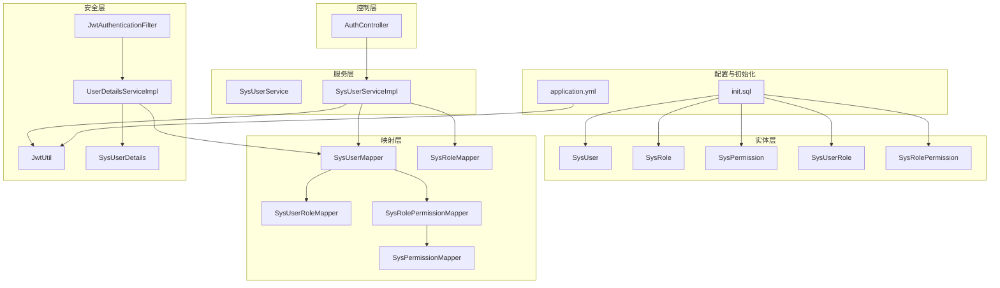
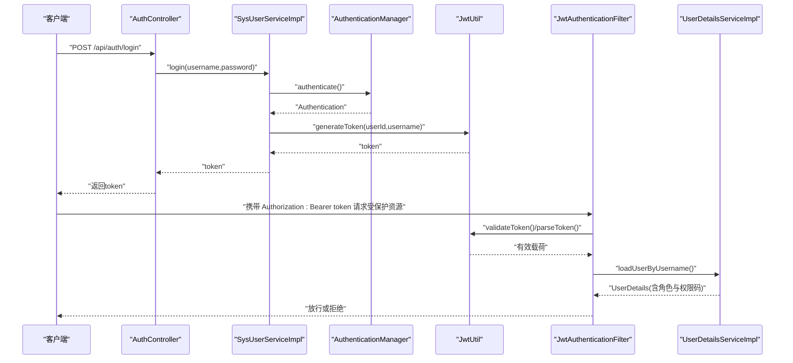
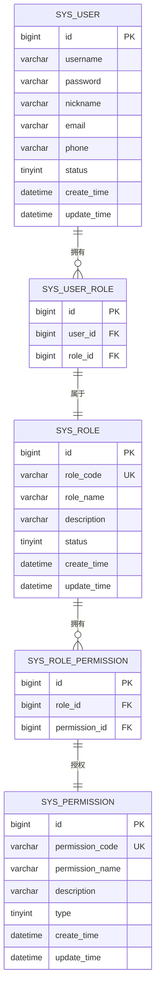
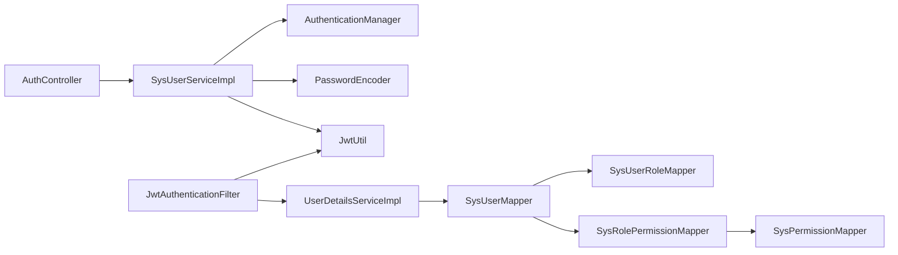

# 权限管理功能

<cite>
**本文引用的文件**
- [SysPermission.java](file://src/main/java/com/bookorder/entity/SysPermission.java)
- [SysRole.java](file://src/main/java/com/bookorder/entity/SysRole.java)
- [SysRolePermission.java](file://src/main/java/com/bookorder/entity/SysRolePermission.java)
- [SysPermissionMapper.java](file://src/main/java/com/bookorder/mapper/SysPermissionMapper.java)
- [SysRolePermissionMapper.java](file://src/main/java/com/bookorder/mapper/SysRolePermissionMapper.java)
- [JwtAuthenticationFilter.java](file://src/main/java/com/bookorder/security/JwtAuthenticationFilter.java)
- [JwtUtil.java](file://src/main/java/com/bookorder/security/JwtUtil.java)
- [UserDetailsServiceImpl.java](file://src/main/java/com/bookorder/security/UserDetailsServiceImpl.java)
- [SysUserDetails.java](file://src/main/java/com/bookorder/security/SysUserDetails.java)
- [AuthController.java](file://src/main/java/com/bookorder/controller/AuthController.java)
- [SysUserService.java](file://src/main/java/com/bookorder/service/SysUserService.java)
- [SysUserServiceImpl.java](file://src/main/java/com/bookorder/service/impl/SysUserServiceImpl.java)
- [SysUserMapper.java](file://src/main/java/com/bookorder/mapper/SysUserMapper.java)
- [application.yml](file://src/main/resources/application.yml)
- [init.sql](file://sql/init.sql)
</cite>

## 目录
1. [简介](#简介)
2. [项目结构](#项目结构)
3. [核心组件](#核心组件)
4. [架构总览](#架构总览)
5. [详细组件分析](#详细组件分析)
6. [依赖分析](#依赖分析)
7. [性能考虑](#性能考虑)
8. [故障排查指南](#故障排查指南)
9. [结论](#结论)
10. [附录](#附录)

## 简介
本文件为图书预订系统的权限管理功能综合技术文档，围绕权限的定义、分类与管理机制展开，涵盖权限标识符设计（权限类型与表达式）、权限与角色的关联管理（批量分配、回收与优先级）、运行时权限校验与缓存策略、API 设计与权限树形展示思路、以及安全策略（白名单与审计日志建议）。系统采用基于 JWT 的认证与 Spring Security 授权体系，权限模型以“角色-权限”关联为核心，结合数据库中的权限码进行细粒度控制。

## 项目结构
权限相关代码主要分布在以下模块：
- 实体层：用户、角色、权限及其关联实体
- 映射层：MyBatis-Plus Mapper 接口
- 安全层：JWT 过滤器、工具类、用户详情加载与封装
- 控制层：认证控制器，提供登录、注册与当前用户信息查询
- 服务层：用户服务接口与实现，负责登录鉴权与默认角色绑定
- 配置与初始化：Spring Boot 配置与数据库初始化脚本

图表来源
- [SysUserMapper.java:11-24](file://src/main/java/com/bookorder/mapper/SysUserMapper.java#L11-L24)
- [SysUserServiceImpl.java:22-87](file://src/main/java/com/bookorder/service/impl/SysUserServiceImpl.java#L22-L87)
- [JwtAuthenticationFilter.java:19-56](file://src/main/java/com/bookorder/security/JwtAuthenticationFilter.java#L19-L56)
- [JwtUtil.java:13-62](file://src/main/java/com/bookorder/security/JwtUtil.java#L13-L62)
- [UserDetailsServiceImpl.java:17-50](file://src/main/java/com/bookorder/security/UserDetailsServiceImpl.java#L17-L50)
- [AuthController.java:18-59](file://src/main/java/com/bookorder/controller/AuthController.java#L18-L59)
- [application.yml:26-28](file://src/main/resources/application.yml#L26-L28)
- [init.sql:11-124](file://sql/init.sql#L11-L124)

章节来源
- [application.yml:1-33](file://src/main/resources/application.yml#L1-L33)
- [init.sql:1-124](file://sql/init.sql#L1-L124)

## 核心组件
- 权限实体与类型
  - 权限实体包含标识符、名称、描述与类型字段；类型取值用于区分菜单、按钮与接口等不同权限类别。
  - 权限标识符采用统一编码规范，便于前端路由与操作按钮的精确匹配。
- 角色与权限关联
  - 通过角色-权限关联表建立多对多关系，支持角色批量授予与回收权限。
- 用户与角色关联
  - 用户-角色关联表维护用户的角色集合，实现权限继承。
- 认证与授权
  - 登录成功后生成 JWT，请求携带令牌进入过滤器链，解析用户并注入 Spring Security 上下文。
  - 用户详情加载时，按用户 ID 查询其角色码与权限码，组装为 GrantedAuthority 列表供授权判断使用。

章节来源
- [SysPermission.java:6-41](file://src/main/java/com/bookorder/entity/SysPermission.java#L6-L41)
- [SysRole.java:6-41](file://src/main/java/com/bookorder/entity/SysRole.java#L6-L41)
- [SysRolePermission.java:7-21](file://src/main/java/com/bookorder/entity/SysRolePermission.java#L7-L21)
- [SysUserMapper.java:14-23](file://src/main/java/com/bookorder/mapper/SysUserMapper.java#L14-L23)
- [UserDetailsServiceImpl.java:23-48](file://src/main/java/com/bookorder/security/UserDetailsServiceImpl.java#L23-L48)
- [JwtAuthenticationFilter.java:28-46](file://src/main/java/com/bookorder/security/JwtAuthenticationFilter.java#L28-L46)

## 架构总览
系统采用“JWT + Spring Security”的认证授权架构。登录流程中，服务端使用认证管理器校验凭据，成功后签发 JWT；后续请求由过滤器解析令牌，加载用户详情并设置认证上下文，授权阶段依据用户拥有的权限码进行访问控制。

图表来源
- [AuthController.java:28-32](file://src/main/java/com/bookorder/controller/AuthController.java#L28-L32)
- [SysUserServiceImpl.java:50-55](file://src/main/java/com/bookorder/service/impl/SysUserServiceImpl.java#L50-L55)
- [JwtUtil.java:27-35](file://src/main/java/com/bookorder/security/JwtUtil.java#L27-L35)
- [JwtAuthenticationFilter.java:32-42](file://src/main/java/com/bookorder/security/JwtAuthenticationFilter.java#L32-L42)
- [UserDetailsServiceImpl.java:24-47](file://src/main/java/com/bookorder/security/UserDetailsServiceImpl.java#L24-L47)

## 详细组件分析

### 权限与角色模型
- 数据模型
  - 用户、角色、权限三者通过中间表形成网状权限图谱，支持灵活的权限组合与继承。
  - 权限类型字段用于前端渲染与后端粗粒度控制，配合权限码实现细粒度授权。
- 关联关系
  - 用户-角色：一对多，一个用户可拥有多个角色。
  - 角色-权限：多对多，一个角色可拥有多个权限，一个权限可被多个角色拥有。

图表来源
- [SysPermission.java:6-41](file://src/main/java/com/bookorder/entity/SysPermission.java#L6-L41)
- [SysRole.java:6-41](file://src/main/java/com/bookorder/entity/SysRole.java#L6-L41)
- [SysRolePermission.java:7-21](file://src/main/java/com/bookorder/entity/SysRolePermission.java#L7-L21)
- [init.sql:41-70](file://sql/init.sql#L41-L70)

章节来源
- [SysPermission.java:6-41](file://src/main/java/com/bookorder/entity/SysPermission.java#L6-L41)
- [SysRole.java:6-41](file://src/main/java/com/bookorder/entity/SysRole.java#L6-L41)
- [SysRolePermission.java:7-21](file://src/main/java/com/bookorder/entity/SysRolePermission.java#L7-L21)
- [init.sql:41-70](file://sql/init.sql#L41-L70)

### 权限标识符设计与表达式
- 设计原则
  - 唯一性：权限编码在数据库中唯一，避免冲突。
  - 可读性：采用“模块:功能”或“模块:动作”的命名约定，便于前端与后端一致识别。
  - 层次化：通过前缀区分模块域，利于权限树形展示与分组。
- 表达式与类型
  - 类型字段区分菜单、按钮、接口等，前端据此决定是否渲染与启用。
  - 后端授权以权限码为准，结合业务逻辑进行更细粒度的校验。

章节来源
- [SysPermission.java:11-14](file://src/main/java/com/bookorder/entity/SysPermission.java#L11-L14)
- [init.sql:46](file://sql/init.sql#L46)

### 权限与角色的关联管理
- 批量分配
  - 通过角色-权限关联表一次性写入多条记录，实现角色对一组权限的批量授予。
- 权限回收
  - 删除角色-权限关联记录即可回收权限；若需彻底移除权限，应同时考虑逻辑删除与关联清理。
- 权限优先级
  - 当前模型未显式定义优先级字段；推荐在业务层通过“角色权重/继承顺序”或“最近生效规则”实现优先级判定，避免高权限被低权限覆盖。

章节来源
- [SysRolePermission.java:10-13](file://src/main/java/com/bookorder/entity/SysRolePermission.java#L10-L13)
- [init.sql:103-115](file://sql/init.sql#L103-L115)

### 运行时权限验证与缓存策略
- 运行时校验
  - 用户详情加载时，按用户 ID 查询其角色码与权限码，组装为 GrantedAuthority 列表。
  - Spring Security 在授权阶段根据权限码进行匹配，实现细粒度访问控制。
- 缓存策略
  - 建议对用户权限码集合进行短期缓存（如 Redis），减少频繁数据库查询。
  - 缓存键建议包含用户 ID 与版本号，版本号随角色/权限变更而更新，确保一致性。

章节来源
- [UserDetailsServiceImpl.java:36-47](file://src/main/java/com/bookorder/security/UserDetailsServiceImpl.java#L36-L47)
- [SysUserMapper.java:19-23](file://src/main/java/com/bookorder/mapper/SysUserMapper.java#L19-L23)

### API 设计与权限树形展示
- 登录与注册
  - 登录成功返回 JWT；注册默认绑定“读者”角色。
- 当前用户信息
  - 返回用户基本信息与角色、权限码列表，前端据此构建权限树与界面元素显示。
- 权限树形展示
  - 建议后端提供权限树接口，按权限类型与层级关系组织节点，前端渲染菜单树与按钮权限开关。

章节来源
- [AuthController.java:28-38](file://src/main/java/com/bookorder/controller/AuthController.java#L28-L38)
- [AuthController.java:40-57](file://src/main/java/com/bookorder/controller/AuthController.java#L40-L57)
- [SysUserServiceImpl.java:71-79](file://src/main/java/com/bookorder/service/impl/SysUserServiceImpl.java#L71-L79)

### 权限变更通知机制
- 事件驱动
  - 建议在角色-权限变更处引入事件发布（如角色更新、权限回收），订阅方刷新目标用户的权限缓存。
- 实时推送
  - 对于在线用户，可通过 WebSocket 或服务端推送机制下发权限变更通知，触发前端重新拉取权限树。

[本节为概念性建议，不直接对应具体源码文件]

### 安全策略
- 白名单机制
  - 对无需登录即可访问的公开接口（如登录、注册）保持开放；对其他接口统一要求认证。
- 审计日志
  - 建议记录关键权限操作（新增/删除角色、授予/回收权限、用户权限变更）与失败授权尝试，便于追踪与审计。

[本节为通用安全建议，不直接对应具体源码文件]

## 依赖分析
- 组件耦合
  - 控制器依赖服务层；服务层依赖认证管理器、密码编码器与 JWT 工具；安全过滤器依赖用户详情加载与 JWT 工具。
  - 用户详情加载依赖用户映射与角色/权限映射，间接依赖角色-权限关联表。
- 外部依赖
  - Spring Security、JWT 库、MyBatis-Plus、MySQL。

图表来源
- [AuthController.java:18-59](file://src/main/java/com/bookorder/controller/AuthController.java#L18-L59)
- [SysUserServiceImpl.java:22-87](file://src/main/java/com/bookorder/service/impl/SysUserServiceImpl.java#L22-L87)
- [JwtAuthenticationFilter.java:19-56](file://src/main/java/com/bookorder/security/JwtAuthenticationFilter.java#L19-L56)
- [UserDetailsServiceImpl.java:17-50](file://src/main/java/com/bookorder/security/UserDetailsServiceImpl.java#L17-L50)
- [SysUserMapper.java:11-24](file://src/main/java/com/bookorder/mapper/SysUserMapper.java#L11-L24)
- [SysPermissionMapper.java:1-10](file://src/main/java/com/bookorder/mapper/SysPermissionMapper.java#L1-L10)
- [SysRolePermissionMapper.java:1-10](file://src/main/java/com/bookorder/mapper/SysRolePermissionMapper.java#L1-L10)

章节来源
- [SysUserServiceImpl.java:22-87](file://src/main/java/com/bookorder/service/impl/SysUserServiceImpl.java#L22-L87)
- [JwtAuthenticationFilter.java:19-56](file://src/main/java/com/bookorder/security/JwtAuthenticationFilter.java#L19-L56)
- [UserDetailsServiceImpl.java:17-50](file://src/main/java/com/bookorder/security/UserDetailsServiceImpl.java#L17-L50)
- [SysUserMapper.java:11-24](file://src/main/java/com/bookorder/mapper/SysUserMapper.java#L11-L24)

## 性能考虑
- 数据库层面
  - 为用户-角色与角色-权限关联表建立联合唯一索引，避免重复授权与查询异常。
  - 对权限码与角色码建立索引，提升用户权限查询效率。
- 缓存层面
  - 将用户权限码集合缓存于 Redis，设置合理过期时间；变更时主动失效或更新版本号。
- 授权层面
  - 使用权限码进行快速匹配，避免复杂表达式导致的性能损耗。

[本节提供通用优化建议，不直接对应具体源码文件]

## 故障排查指南
- 登录失败
  - 检查用户名是否存在且状态正常；确认密码加密方式与存储一致。
- 权限不足
  - 确认用户是否绑定正确角色；检查角色-权限关联是否完整；核对权限码是否正确。
- 令牌无效
  - 检查 JWT 密钥与过期配置；确认请求头格式是否为“Bearer {token}”。

章节来源
- [UserDetailsServiceImpl.java:28-34](file://src/main/java/com/bookorder/security/UserDetailsServiceImpl.java#L28-L34)
- [JwtAuthenticationFilter.java:48-54](file://src/main/java/com/bookorder/security/JwtAuthenticationFilter.java#L48-L54)
- [application.yml:26-28](file://src/main/resources/application.yml#L26-L28)

## 结论
该权限管理方案以“角色-权限”为核心，结合 JWT 与 Spring Security 实现了从认证到授权的完整闭环。通过权限码与类型字段，系统具备良好的扩展性与前端适配能力。建议在现有基础上补充权限缓存、事件通知与审计日志机制，进一步提升安全性与可观测性。

## 附录
- 初始化数据示例
  - 角色：管理员、图书管理员、读者
  - 权限：系统管理、用户管理、图书管理、订单管理等
  - 默认管理员账号与角色绑定

章节来源
- [init.sql:76-124](file://sql/init.sql#L76-L124)