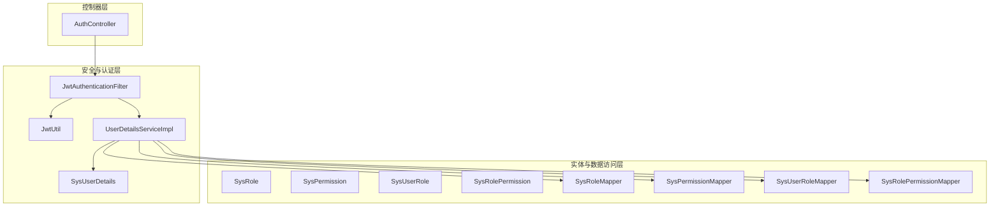
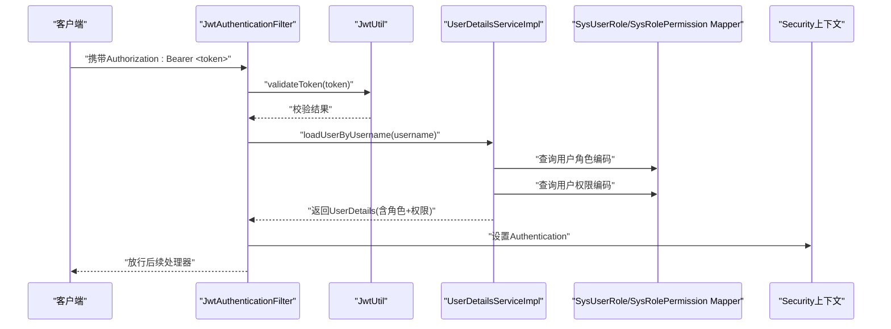
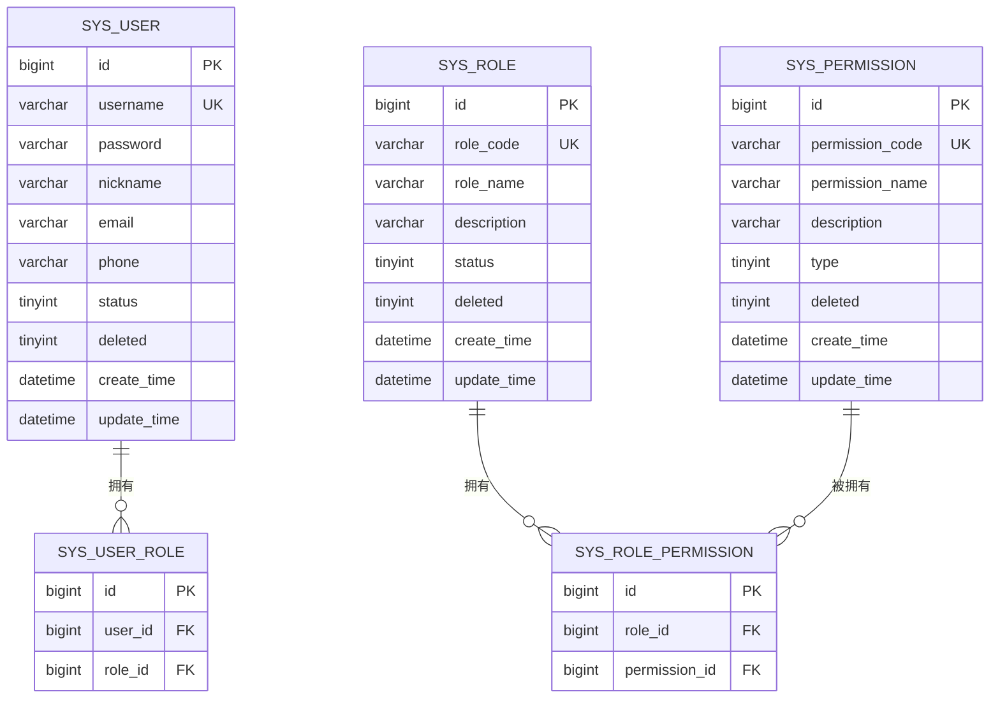
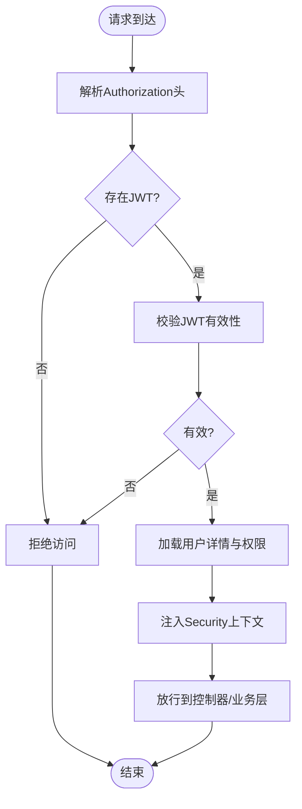
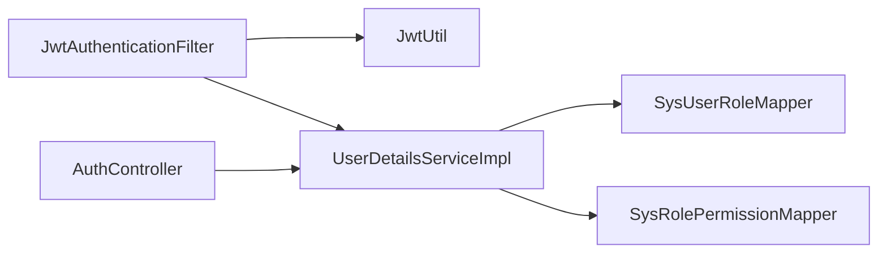

# 权限管理模块

<cite>
**本文引用的文件**
- [SysRole.java](file://src/main/java/com/bookorder/entity/SysRole.java)
- [SysPermission.java](file://src/main/java/com/bookorder/entity/SysPermission.java)
- [SysUserRole.java](file://src/main/java/com/bookorder/entity/SysUserRole.java)
- [SysRolePermission.java](file://src/main/java/com/bookorder/entity/SysRolePermission.java)
- [JwtAuthenticationFilter.java](file://src/main/java/com/bookorder/security/JwtAuthenticationFilter.java)
- [JwtUtil.java](file://src/main/java/com/bookorder/security/JwtUtil.java)
- [UserDetailsServiceImpl.java](file://src/main/java/com/bookorder/security/UserDetailsServiceImpl.java)
- [SysUserDetails.java](file://src/main/java/com/bookorder/security/SysUserDetails.java)
- [SysRoleMapper.java](file://src/main/java/com/bookorder/mapper/SysRoleMapper.java)
- [SysPermissionMapper.java](file://src/main/java/com/bookorder/mapper/SysPermissionMapper.java)
- [SysUserRoleMapper.java](file://src/main/java/com/bookorder/mapper/SysUserRoleMapper.java)
- [SysRolePermissionMapper.java](file://src/main/java/com/bookorder/mapper/SysRolePermissionMapper.java)
- [AuthController.java](file://src/main/java/com/bookorder/controller/AuthController.java)
- [init.sql（resources）](file://src/main/resources/sql/init.sql)
- [init.sql（项目根目录）](file://sql/init.sql)
</cite>

## 目录
1. [简介](#简介)
2. [项目结构](#项目结构)
3. [核心组件](#核心组件)
4. [架构总览](#架构总览)
5. [详细组件分析](#详细组件分析)
6. [依赖分析](#依赖分析)
7. [性能考量](#性能考量)
8. [故障排查指南](#故障排查指南)
9. [结论](#结论)
10. [附录](#附录)

## 简介
本文件面向“权限管理模块”，围绕基于角色的访问控制（RBAC）模型进行系统化梳理与说明。重点覆盖以下方面：
- 角色与权限的数据模型与实体关系
- 角色继承与权限层级的实现方式
- 访问控制策略（方法级与URL级）
- 权限验证机制与认证流程
- 最佳实践与安全注意事项
- 扩展性设计与未来演进方向

该系统采用Spring Security + JWT + MyBatis-Plus实现，通过用户-角色-权限三层映射完成细粒度授权；同时提供初始化脚本以快速搭建角色、权限与默认管理员账户。

## 项目结构
权限管理模块位于后端工程中，主要由以下层次构成：
- 实体层：SysRole、SysPermission、SysUserRole、SysRolePermission
- 安全与认证层：JwtAuthenticationFilter、JwtUtil、UserDetailsServiceImpl、SysUserDetails
- 数据访问层：各Mapper接口
- 控制器层：AuthController（登录、注册、当前用户信息查询）
- 资源与脚本：初始化SQL脚本

图表来源
- [AuthController.java:1-59](file://src/main/java/com/bookorder/controller/AuthController.java#L1-L59)
- [JwtAuthenticationFilter.java:1-56](file://src/main/java/com/bookorder/security/JwtAuthenticationFilter.java#L1-L56)
- [JwtUtil.java:1-62](file://src/main/java/com/bookorder/security/JwtUtil.java#L1-L62)
- [UserDetailsServiceImpl.java:1-50](file://src/main/java/com/bookorder/security/UserDetailsServiceImpl.java#L1-L50)
- [SysUserDetails.java:1-54](file://src/main/java/com/bookorder/security/SysUserDetails.java#L1-L54)
- [SysRole.java:1-42](file://src/main/java/com/bookorder/entity/SysRole.java#L1-L42)
- [SysPermission.java:1-42](file://src/main/java/com/bookorder/entity/SysPermission.java#L1-L42)
- [SysUserRole.java:1-22](file://src/main/java/com/bookorder/entity/SysUserRole.java#L1-L22)
- [SysRolePermission.java:1-22](file://src/main/java/com/bookorder/entity/SysRolePermission.java#L1-L22)
- [SysRoleMapper.java:1-10](file://src/main/java/com/bookorder/mapper/SysRoleMapper.java#L1-L10)
- [SysPermissionMapper.java:1-10](file://src/main/java/com/bookorder/mapper/SysPermissionMapper.java#L1-L10)
- [SysUserRoleMapper.java:1-10](file://src/main/java/com/bookorder/mapper/SysUserRoleMapper.java#L1-L10)
- [SysRolePermissionMapper.java:1-10](file://src/main/java/com/bookorder/mapper/SysRolePermissionMapper.java#L1-L10)

章节来源
- [AuthController.java:1-59](file://src/main/java/com/bookorder/controller/AuthController.java#L1-L59)
- [JwtAuthenticationFilter.java:1-56](file://src/main/java/com/bookorder/security/JwtAuthenticationFilter.java#L1-L56)
- [JwtUtil.java:1-62](file://src/main/java/com/bookorder/security/JwtUtil.java#L1-L62)
- [UserDetailsServiceImpl.java:1-50](file://src/main/java/com/bookorder/security/UserDetailsServiceImpl.java#L1-L50)
- [SysUserDetails.java:1-54](file://src/main/java/com/bookorder/security/SysUserDetails.java#L1-L54)
- [SysRole.java:1-42](file://src/main/java/com/bookorder/entity/SysRole.java#L1-L42)
- [SysPermission.java:1-42](file://src/main/java/com/bookorder/entity/SysPermission.java#L1-L42)
- [SysUserRole.java:1-22](file://src/main/java/com/bookorder/entity/SysUserRole.java#L1-L22)
- [SysRolePermission.java:1-22](file://src/main/java/com/bookorder/entity/SysRolePermission.java#L1-L22)
- [SysRoleMapper.java:1-10](file://src/main/java/com/bookorder/mapper/SysRoleMapper.java#L1-L10)
- [SysPermissionMapper.java:1-10](file://src/main/java/com/bookorder/mapper/SysPermissionMapper.java#L1-L10)
- [SysUserRoleMapper.java:1-10](file://src/main/java/com/bookorder/mapper/SysUserRoleMapper.java#L1-L10)
- [SysRolePermissionMapper.java:1-10](file://src/main/java/com/bookorder/mapper/SysRolePermissionMapper.java#L1-L10)

## 核心组件
- 实体与关系
  - SysRole：角色定义，包含角色编码、名称、状态与时间戳字段
  - SysPermission：权限定义，包含权限编码、名称、类型（菜单/按钮/接口）与时间戳字段
  - SysUserRole：用户-角色关联表，支持多角色绑定
  - SysRolePermission：角色-权限关联表，支持角色继承式权限聚合
- 安全与认证
  - JwtAuthenticationFilter：请求过滤器，从Header解析JWT并注入Security上下文
  - JwtUtil：JWT生成、解析与校验工具
  - UserDetailsServiceImpl：加载用户详情，拼装角色与权限集合
  - SysUserDetails：用户详情包装类，暴露认证与授权所需信息
- 控制器
  - AuthController：提供登录、注册与当前用户信息查询接口

章节来源
- [SysRole.java:1-42](file://src/main/java/com/bookorder/entity/SysRole.java#L1-L42)
- [SysPermission.java:1-42](file://src/main/java/com/bookorder/entity/SysPermission.java#L1-L42)
- [SysUserRole.java:1-22](file://src/main/java/com/bookorder/entity/SysUserRole.java#L1-L22)
- [SysRolePermission.java:1-22](file://src/main/java/com/bookorder/entity/SysRolePermission.java#L1-L22)
- [JwtAuthenticationFilter.java:1-56](file://src/main/java/com/bookorder/security/JwtAuthenticationFilter.java#L1-L56)
- [JwtUtil.java:1-62](file://src/main/java/com/bookorder/security/JwtUtil.java#L1-L62)
- [UserDetailsServiceImpl.java:1-50](file://src/main/java/com/bookorder/security/UserDetailsServiceImpl.java#L1-L50)
- [SysUserDetails.java:1-54](file://src/main/java/com/bookorder/security/SysUserDetails.java#L1-L54)
- [AuthController.java:1-59](file://src/main/java/com/bookorder/controller/AuthController.java#L1-L59)

## 架构总览
下图展示从HTTP请求到权限验证的整体流程，以及与实体模型的对应关系。

图表来源
- [JwtAuthenticationFilter.java:28-46](file://src/main/java/com/bookorder/security/JwtAuthenticationFilter.java#L28-L46)
- [JwtUtil.java:45-52](file://src/main/java/com/bookorder/security/JwtUtil.java#L45-L52)
- [UserDetailsServiceImpl.java:24-48](file://src/main/java/com/bookorder/security/UserDetailsServiceImpl.java#L24-L48)
- [SysUserRoleMapper.java:1-10](file://src/main/java/com/bookorder/mapper/SysUserRoleMapper.java#L1-L10)
- [SysRolePermissionMapper.java:1-10](file://src/main/java/com/bookorder/mapper/SysRolePermissionMapper.java#L1-L10)

## 详细组件分析

### 实体模型与关系
- 实体类均使用MyBatis-Plus注解映射至数据库表，包含通用字段如创建/更新时间与软删除标记
- 关联关系
  - 用户-角色：一对多（用户可拥有多角色）
  - 角色-权限：一对多（角色可拥有多个权限）
- 权限类型
  - SysPermission.type区分“菜单/按钮/接口”三类，便于前端路由与操作按钮的差异化控制

图表来源
- [SysRole.java:1-42](file://src/main/java/com/bookorder/entity/SysRole.java#L1-L42)
- [SysPermission.java:1-42](file://src/main/java/com/bookorder/entity/SysPermission.java#L1-L42)
- [SysUserRole.java:1-22](file://src/main/java/com/bookorder/entity/SysUserRole.java#L1-L22)
- [SysRolePermission.java:1-22](file://src/main/java/com/bookorder/entity/SysRolePermission.java#L1-L22)
- [init.sql（resources）:7-68](file://src/main/resources/sql/init.sql#L7-L68)
- [init.sql（项目根目录）:11-70](file://sql/init.sql#L11-L70)

章节来源
- [SysRole.java:1-42](file://src/main/java/com/bookorder/entity/SysRole.java#L1-L42)
- [SysPermission.java:1-42](file://src/main/java/com/bookorder/entity/SysPermission.java#L1-L42)
- [SysUserRole.java:1-22](file://src/main/java/com/bookorder/entity/SysUserRole.java#L1-L22)
- [SysRolePermission.java:1-22](file://src/main/java/com/bookorder/entity/SysRolePermission.java#L1-L22)
- [init.sql（resources）:7-68](file://src/main/resources/sql/init.sql#L7-L68)
- [init.sql（项目根目录）:11-70](file://sql/init.sql#L11-L70)

### 角色与权限继承、层级与分配
- 设计思路
  - 采用“用户-角色-权限”的三层映射，用户通过角色间接获得权限
  - 角色-权限为多对多，通过SysRolePermission建立关联，实现权限的组合与继承
  - SysPermission.type用于区分权限粒度，便于前端按需渲染
- 初始化数据
  - ADMIN拥有全部权限（菜单、按钮、接口）
  - LIBRARIAN拥有图书与订单管理相关权限
  - READER仅具备查看与创建订单的最小权限集
- 权限聚合
  - UserDetailsServiceImpl在加载用户时，统一收集角色编码与权限编码，形成最终授权集合

章节来源
- [init.sql（resources）:74-124](file://src/main/resources/sql/init.sql#L74-L124)
- [init.sql（项目根目录）:77-124](file://sql/init.sql#L77-L124)
- [UserDetailsServiceImpl.java:36-47](file://src/main/java/com/bookorder/security/UserDetailsServiceImpl.java#L36-L47)

### 认证与授权流程（方法级与URL级）
- 方法级权限控制
  - 登录成功后，服务端签发JWT；客户端在后续请求头中携带Authorization: Bearer <token>
  - JwtAuthenticationFilter在每个请求进入时解析并校验JWT，解析出用户名后加载用户详情与权限
  - Spring Security根据UserDetails中的GrantedAuthority进行鉴权
- URL级访问控制
  - 本仓库未提供显式的URL拦截规则配置文件；建议在SecurityConfig中结合@EnableMethodSecurity与@PreAuthorize/@PostAuthorize等注解实现基于表达式的访问控制
  - 基于角色前缀“ROLE_”与权限前缀“权限编码”的组合，可实现灵活的URL与方法级授权策略

图表来源
- [JwtAuthenticationFilter.java:28-46](file://src/main/java/com/bookorder/security/JwtAuthenticationFilter.java#L28-L46)
- [JwtUtil.java:45-52](file://src/main/java/com/bookorder/security/JwtUtil.java#L45-L52)
- [UserDetailsServiceImpl.java:24-48](file://src/main/java/com/bookorder/security/UserDetailsServiceImpl.java#L24-L48)

章节来源
- [JwtAuthenticationFilter.java:1-56](file://src/main/java/com/bookorder/security/JwtAuthenticationFilter.java#L1-L56)
- [JwtUtil.java:1-62](file://src/main/java/com/bookorder/security/JwtUtil.java#L1-L62)
- [UserDetailsServiceImpl.java:1-50](file://src/main/java/com/bookorder/security/UserDetailsServiceImpl.java#L1-L50)
- [SysUserDetails.java:1-54](file://src/main/java/com/bookorder/security/SysUserDetails.java#L1-L54)

### 授权主体与权限载体
- 授权主体
  - SysUserDetails实现了UserDetails，承载用户标识、昵称、状态与权限集合
- 权限载体
  - 角色权限：通过“ROLE_<roleCode>”形式注入
  - 自定义权限：通过“permissionCode”直接注入
- 作用域
  - 前端可通过/me接口获取当前用户的角色与权限列表，用于界面元素的动态显示与隐藏

章节来源
- [SysUserDetails.java:10-54](file://src/main/java/com/bookorder/security/SysUserDetails.java#L10-L54)
- [UserDetailsServiceImpl.java:39-47](file://src/main/java/com/bookorder/security/UserDetailsServiceImpl.java#L39-L47)
- [AuthController.java:40-57](file://src/main/java/com/bookorder/controller/AuthController.java#L40-L57)

## 依赖分析
- 组件耦合
  - JwtAuthenticationFilter依赖JwtUtil与UserDetailsService
  - UserDetailsServiceImpl依赖SysUserMapper与角色/权限查询能力
  - 控制器依赖服务层与UserDetails
- 外部依赖
  - Spring Security负责认证与授权
  - MyBatis-Plus提供ORM与Mapper接口
  - JWT库用于令牌生成与解析

图表来源
- [JwtAuthenticationFilter.java:22-26](file://src/main/java/com/bookorder/security/JwtAuthenticationFilter.java#L22-L26)
- [JwtUtil.java:1-62](file://src/main/java/com/bookorder/security/JwtUtil.java#L1-L62)
- [UserDetailsServiceImpl.java:21-21](file://src/main/java/com/bookorder/security/UserDetailsServiceImpl.java#L21-L21)
- [SysUserRoleMapper.java:1-10](file://src/main/java/com/bookorder/mapper/SysUserRoleMapper.java#L1-L10)
- [SysRolePermissionMapper.java:1-10](file://src/main/java/com/bookorder/mapper/SysRolePermissionMapper.java#L1-L10)
- [AuthController.java:22-27](file://src/main/java/com/bookorder/controller/AuthController.java#L22-L27)

章节来源
- [JwtAuthenticationFilter.java:1-56](file://src/main/java/com/bookorder/security/JwtAuthenticationFilter.java#L1-L56)
- [JwtUtil.java:1-62](file://src/main/java/com/bookorder/security/JwtUtil.java#L1-L62)
- [UserDetailsServiceImpl.java:1-50](file://src/main/java/com/bookorder/security/UserDetailsServiceImpl.java#L1-L50)
- [SysUserRoleMapper.java:1-10](file://src/main/java/com/bookorder/mapper/SysUserRoleMapper.java#L1-L10)
- [SysRolePermissionMapper.java:1-10](file://src/main/java/com/bookorder/mapper/SysRolePermissionMapper.java#L1-L10)
- [AuthController.java:1-59](file://src/main/java/com/bookorder/controller/AuthController.java#L1-L59)

## 性能考量
- 缓存策略
  - 建议对用户的角色与权限集合进行缓存，减少每次请求的数据库查询
  - 结合Redis或本地缓存，设置合理的过期时间与失效策略
- 查询优化
  - 使用Mapper提供的批量查询接口，避免N+1查询
  - 对常用字段（如username、role_code、permission_code）建立索引
- 令牌处理
  - 合理设置JWT过期时间，平衡安全性与用户体验
  - 在高并发场景下，注意签名算法与密钥的性能开销

## 故障排查指南
- 常见问题
  - 用户不存在或被禁用：UserDetailsServiceImpl在加载用户时会抛出异常，需检查SysUser状态与唯一性约束
  - JWT无效：JwtUtil.validateToken返回false，需检查密钥配置与过期时间
  - 权限不足：确认用户是否正确绑定角色与权限，以及权限编码是否一致
- 排查步骤
  - 检查请求头Authorization格式是否为“Bearer <token>”
  - 校验JWT签名密钥与过期时间配置
  - 核对初始化脚本中的角色-权限映射是否符合预期
  - 查看UserDetailsServiceImpl的权限聚合逻辑是否正确

章节来源
- [UserDetailsServiceImpl.java:24-34](file://src/main/java/com/bookorder/security/UserDetailsServiceImpl.java#L24-L34)
- [JwtUtil.java:45-52](file://src/main/java/com/bookorder/security/JwtUtil.java#L45-L52)
- [init.sql（resources）:74-124](file://src/main/resources/sql/init.sql#L74-L124)

## 结论
本权限管理模块以RBAC为核心，通过清晰的实体关系与认证流程，实现了用户-角色-权限的灵活授权。结合JWT与Spring Security，可在方法级与URL级实现细粒度的访问控制。建议在生产环境中引入缓存、完善拦截规则与审计日志，并持续优化权限模型以满足业务演进需求。

## 附录

### RBAC权限模型最佳实践
- 权限命名规范
  - 采用“模块:动作”语义化命名，便于前端渲染与后端匹配
- 角色设计原则
  - 遵循最小权限原则，避免超级角色滥用
  - 将高频权限抽象为通用角色，降低维护成本
- 安全配置要点
  - 密钥妥善保管，定期轮换
  - 设置合理过期时间，启用刷新机制
  - 对敏感接口开启HTTPS与CORS白名单
- 可观测性
  - 记录登录、授权失败与权限变更日志
  - 监控JWT签发与校验耗时

### 扩展性设计与未来演进
- 权限继承与范围
  - 支持角色继承（父子角色）与组织维度的权限隔离
- 动态权限
  - 引入权限模板与动态授权策略，支持运行时调整
- 多租户
  - 在用户、角色、权限表中增加租户字段，实现数据隔离
- 审计与追踪
  - 增加权限变更审计表，记录谁在何时授予了哪些权限