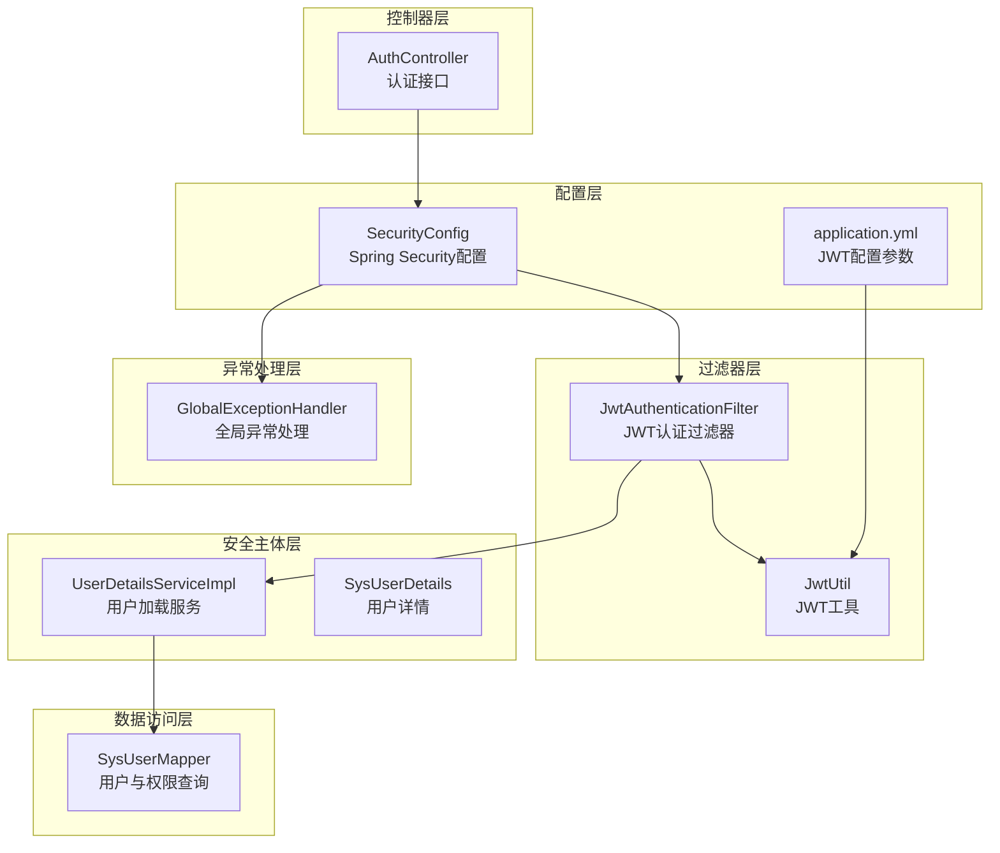
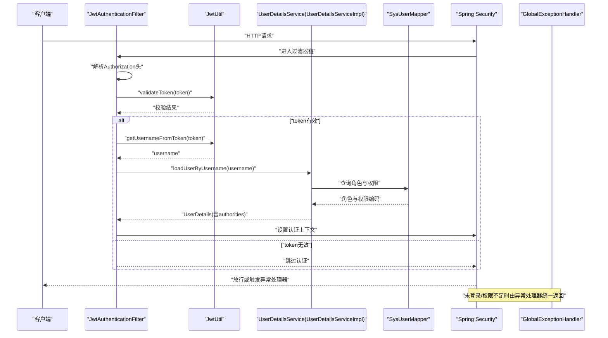
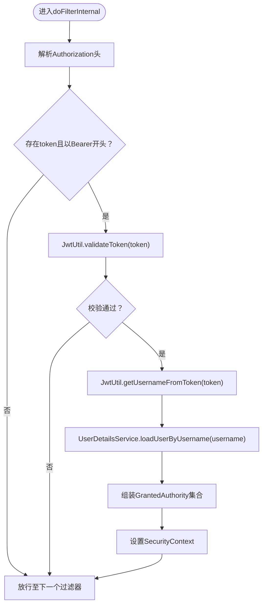
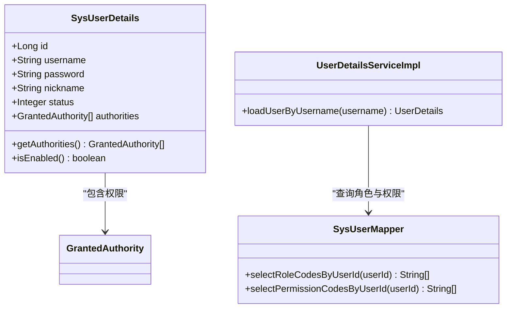
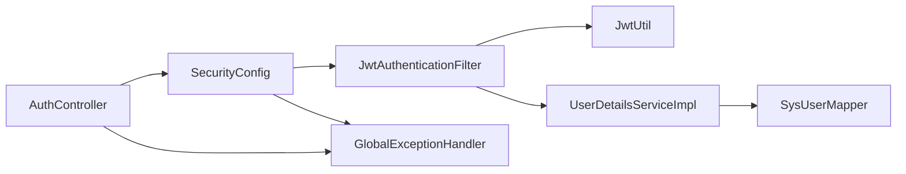

# 权限验证机制

<cite>
**本文档引用的文件**
- [SecurityConfig.java](file://src/main/java/com/bookorder/config/SecurityConfig.java)
- [JwtAuthenticationFilter.java](file://src/main/java/com/bookorder/security/JwtAuthenticationFilter.java)
- [JwtUtil.java](file://src/main/java/com/bookorder/security/JwtUtil.java)
- [SysUserDetails.java](file://src/main/java/com/bookorder/security/SysUserDetails.java)
- [UserDetailsServiceImpl.java](file://src/main/java/com/bookorder/security/UserDetailsServiceImpl.java)
- [AuthController.java](file://src/main/java/com/bookorder/controller/AuthController.java)
- [GlobalExceptionHandler.java](file://src/main/java/com/bookorder/common/GlobalExceptionHandler.java)
- [SysUserMapper.java](file://src/main/java/com/bookorder/mapper/SysUserMapper.java)
- [application.yml](file://src/main/resources/application.yml)
- [init.sql](file://sql/init.sql)
- [SysUser.java](file://src/main/java/com/bookorder/entity/SysUser.java)
- [SysUserService.java](file://src/main/java/com/bookorder/service/SysUserService.java)
- [LoginRequest.java](file://src/main/java/com/bookorder/dto/LoginRequest.java)
- [Result.java](file://src/main/java/com/bookorder/common/Result.java)
</cite>

## 目录
1. [引言](#引言)
2. [项目结构](#项目结构)
3. [核心组件](#核心组件)
4. [架构总览](#架构总览)
5. [详细组件分析](#详细组件分析)
6. [依赖关系分析](#依赖关系分析)
7. [性能考虑](#性能考虑)
8. [故障排除指南](#故障排除指南)
9. [结论](#结论)

## 引言
本文件面向开发者与运维人员，系统性阐述该图书订单系统的权限验证机制实现。内容覆盖：
- 多层次权限验证：URL级访问控制与方法级权限拦截
- JWT过滤器中的权限解析流程：token验证、用户身份获取、权限信息提取
- Spring Security配置：antMatchers风格的URL匹配与access表达式
- 完整执行链路：从请求到达到底层权限检查
- 权限验证失败的统一处理：未登录、权限不足等异常
- 性能优化策略与安全加固建议

## 项目结构
系统采用分层架构，权限相关代码主要分布在以下模块：
- 配置层：Spring Security与JWT配置
- 过滤器层：JWT认证过滤器
- 安全主体层：用户详情与用户加载服务
- 控制器层：认证接口与受保护资源入口
- 数据访问层：用户与权限映射查询
- 全局异常处理层：统一错误响应

图表来源
- [SecurityConfig.java:34-62](file://src/main/java/com/bookorder/config/SecurityConfig.java#L34-L62)
- [JwtAuthenticationFilter.java:28-46](file://src/main/java/com/bookorder/security/JwtAuthenticationFilter.java#L28-L46)
- [JwtUtil.java:22-60](file://src/main/java/com/bookorder/security/JwtUtil.java#L22-L60)
- [UserDetailsServiceImpl.java:23-48](file://src/main/java/com/bookorder/security/UserDetailsServiceImpl.java#L23-L48)
- [SysUserDetails.java:10-53](file://src/main/java/com/bookorder/security/SysUserDetails.java#L10-L53)
- [AuthController.java:28-38](file://src/main/java/com/bookorder/controller/AuthController.java#L28-L38)
- [SysUserMapper.java:14-23](file://src/main/java/com/bookorder/mapper/SysUserMapper.java#L14-L23)
- [GlobalExceptionHandler.java:22-38](file://src/main/java/com/bookorder/common/GlobalExceptionHandler.java#L22-L38)
- [application.yml:26-28](file://src/main/resources/application.yml#L26-L28)

章节来源
- [SecurityConfig.java:23-74](file://src/main/java/com/bookorder/config/SecurityConfig.java#L23-L74)
- [application.yml:1-33](file://src/main/resources/application.yml#L1-L33)

## 核心组件
- Spring Security配置：定义会话策略（无状态）、URL级授权规则、异常处理器、以及在过滤器链中插入JWT过滤器。
- JWT过滤器：从请求头解析Bearer Token，校验有效性，加载用户详情，设置认证上下文。
- JWT工具：生成与解析JWT，提取用户标识与过期时间。
- 用户详情与加载服务：将数据库中的用户、角色、权限映射为Spring Security的GrantedAuthority集合。
- 认证控制器：提供登录注册接口，返回JWT。
- 全局异常处理：统一处理认证与授权相关的异常，返回标准结果对象。

章节来源
- [SecurityConfig.java:34-62](file://src/main/java/com/bookorder/config/SecurityConfig.java#L34-L62)
- [JwtAuthenticationFilter.java:28-46](file://src/main/java/com/bookorder/security/JwtAuthenticationFilter.java#L28-L46)
- [JwtUtil.java:27-60](file://src/main/java/com/bookorder/security/JwtUtil.java#L27-L60)
- [UserDetailsServiceImpl.java:23-48](file://src/main/java/com/bookorder/security/UserDetailsServiceImpl.java#L23-L48)
- [SysUserDetails.java:10-53](file://src/main/java/com/bookorder/security/SysUserDetails.java#L10-L53)
- [AuthController.java:28-38](file://src/main/java/com/bookorder/controller/AuthController.java#L28-L38)
- [GlobalExceptionHandler.java:22-38](file://src/main/java/com/bookorder/common/GlobalExceptionHandler.java#L22-L38)

## 架构总览
下图展示从HTTP请求到权限检查的完整链路，包括URL匹配、JWT过滤器、用户加载与认证上下文设置、以及异常处理。

图表来源
- [JwtAuthenticationFilter.java:28-46](file://src/main/java/com/bookorder/security/JwtAuthenticationFilter.java#L28-L46)
- [JwtUtil.java:45-60](file://src/main/java/com/bookorder/security/JwtUtil.java#L45-L60)
- [UserDetailsServiceImpl.java:23-48](file://src/main/java/com/bookorder/security/UserDetailsServiceImpl.java#L23-L48)
- [SysUserMapper.java:14-23](file://src/main/java/com/bookorder/mapper/SysUserMapper.java#L14-L23)
- [SecurityConfig.java:34-62](file://src/main/java/com/bookorder/config/SecurityConfig.java#L34-L62)
- [GlobalExceptionHandler.java:22-38](file://src/main/java/com/bookorder/common/GlobalExceptionHandler.java#L22-L38)

## 详细组件分析

### URL级访问控制与方法级权限拦截
- URL级控制：通过authorizeHttpRequests配置，将特定路径（如登录、注册）设为permitAll，其余请求均需认证；同时配置了未登录与权限不足的异常处理器。
- 方法级拦截：启用@EnableMethodSecurity后，可在业务方法上使用基于表达式的访问控制（例如@PreAuthorize），但当前仓库未展示具体方法级注解示例。若需要，可在服务层添加相应注解以实现更细粒度的权限控制。

章节来源
- [SecurityConfig.java:39-59](file://src/main/java/com/bookorder/config/SecurityConfig.java#L39-L59)

### JWT过滤器中的权限解析流程
- 请求头解析：从Authorization头读取Bearer token，去除前缀“Bearer ”。
- token校验：调用JwtUtil.validateToken进行签名与过期时间校验。
- 用户身份获取：从token中解析username，调用UserDetailsService.loadUserByUsername加载用户详情。
- 权限信息提取：UserDetailsServiceImpl查询用户的角色与权限编码，组装为GrantedAuthority集合。
- 认证上下文设置：构建UsernamePasswordAuthenticationToken并设置到SecurityContextHolder，供后续授权决策使用。

图表来源
- [JwtAuthenticationFilter.java:28-46](file://src/main/java/com/bookorder/security/JwtAuthenticationFilter.java#L28-L46)
- [JwtUtil.java:45-60](file://src/main/java/com/bookorder/security/JwtUtil.java#L45-L60)
- [UserDetailsServiceImpl.java:23-48](file://src/main/java/com/bookorder/security/UserDetailsServiceImpl.java#L23-L48)

章节来源
- [JwtAuthenticationFilter.java:28-54](file://src/main/java/com/bookorder/security/JwtAuthenticationFilter.java#L28-L54)
- [JwtUtil.java:27-60](file://src/main/java/com/bookorder/security/JwtUtil.java#L27-L60)
- [UserDetailsServiceImpl.java:23-48](file://src/main/java/com/bookorder/security/UserDetailsServiceImpl.java#L23-L48)

### Spring Security配置中的权限规则定义
- 会话策略：STATELESS，避免会话开销。
- URL匹配：/api/auth/login与/api/auth/register免认证；其余请求必须认证。
- 异常处理：未登录返回401，权限不足返回403，均以JSON格式输出标准Result结构。
- 过滤器链：在UsernamePasswordAuthenticationFilter之前插入自定义JWT过滤器。

章节来源
- [SecurityConfig.java:34-62](file://src/main/java/com/bookorder/config/SecurityConfig.java#L34-L62)

### 认证控制器与JWT生成
- 登录接口：接收用户名与密码，调用服务层生成JWT并返回。
- 注册接口：创建新用户。
- me接口：返回当前用户基本信息及角色与权限列表。

章节来源
- [AuthController.java:28-57](file://src/main/java/com/bookorder/controller/AuthController.java#L28-L57)

### 用户详情与权限映射
- SysUserDetails：封装用户基本信息与权限集合，重写isEnabled根据用户状态决定是否可用。
- UserDetailsServiceImpl：按用户ID查询角色与权限编码，拼装为ROLE_*与权限码两类授权项。

图表来源
- [SysUserDetails.java:10-53](file://src/main/java/com/bookorder/security/SysUserDetails.java#L10-L53)
- [UserDetailsServiceImpl.java:23-48](file://src/main/java/com/bookorder/security/UserDetailsServiceImpl.java#L23-L48)
- [SysUserMapper.java:14-23](file://src/main/java/com/bookorder/mapper/SysUserMapper.java#L14-L23)

章节来源
- [SysUserDetails.java:10-53](file://src/main/java/com/bookorder/security/SysUserDetails.java#L10-L53)
- [UserDetailsServiceImpl.java:23-48](file://src/main/java/com/bookorder/security/UserDetailsServiceImpl.java#L23-L48)
- [SysUserMapper.java:14-23](file://src/main/java/com/bookorder/mapper/SysUserMapper.java#L14-L23)

### 权限验证失败的处理机制
- 未登录：authenticationEntryPoint返回401，消息体为标准Result。
- 权限不足：accessDeniedHandler返回403，消息体为标准Result。
- 其他异常：GlobalExceptionHandler统一捕获并返回对应HTTP状态码与错误信息。

章节来源
- [SecurityConfig.java:43-58](file://src/main/java/com/bookorder/config/SecurityConfig.java#L43-L58)
- [GlobalExceptionHandler.java:22-38](file://src/main/java/com/bookorder/common/GlobalExceptionHandler.java#L22-L38)

## 依赖关系分析
- 配置层依赖过滤器层与异常处理层，确保过滤器在认证前生效，异常处理器统一输出。
- 过滤器层依赖JWT工具与用户加载服务，用户加载服务依赖数据访问层。
- 控制器层依赖服务层与安全上下文，用于返回当前用户信息。

图表来源
- [SecurityConfig.java:28-62](file://src/main/java/com/bookorder/config/SecurityConfig.java#L28-L62)
- [JwtAuthenticationFilter.java:22-26](file://src/main/java/com/bookorder/security/JwtAuthenticationFilter.java#L22-L26)
- [JwtUtil.java:16-20](file://src/main/java/com/bookorder/security/JwtUtil.java#L16-L20)
- [UserDetailsServiceImpl.java:20-21](file://src/main/java/com/bookorder/security/UserDetailsServiceImpl.java#L20-L21)
- [SysUserMapper.java:14-23](file://src/main/java/com/bookorder/mapper/SysUserMapper.java#L14-L23)
- [AuthController.java:28-38](file://src/main/java/com/bookorder/controller/AuthController.java#L28-L38)

章节来源
- [SecurityConfig.java:28-62](file://src/main/java/com/bookorder/config/SecurityConfig.java#L28-L62)
- [JwtAuthenticationFilter.java:22-26](file://src/main/java/com/bookorder/security/JwtAuthenticationFilter.java#L22-L26)
- [UserDetailsServiceImpl.java:20-21](file://src/main/java/com/bookorder/security/UserDetailsServiceImpl.java#L20-L21)
- [SysUserMapper.java:14-23](file://src/main/java/com/bookorder/mapper/SysUserMapper.java#L14-L23)
- [AuthController.java:28-38](file://src/main/java/com/bookorder/controller/AuthController.java#L28-L38)

## 性能考虑
- 无状态会话：通过STATELESS策略避免服务器端会话存储，降低内存占用与扩展复杂度。
- JWT缓存策略：可考虑在Redis中缓存最近使用的token以支持主动失效与黑名单，减少重复解析成本。
- 查询优化：UserDetailsServiceImpl一次性查询角色与权限编码，避免多次数据库往返；确保相关字段建立索引。
- 过滤器链顺序：将JWT过滤器置于最前，减少不必要的认证开销。
- 日志级别：生产环境建议调整日志级别，避免敏感信息泄露与IO开销。

## 故障排除指南
- 未登录/权限不足
  - 现象：返回401或403，消息体为标准Result。
  - 排查：确认Authorization头格式正确、token未过期、用户状态正常。
- 用户名或密码错误
  - 现象：返回401，消息体为标准Result。
  - 排查：确认BCrypt加密一致性与数据库中密码值。
- 参数校验失败
  - 现象：返回400，消息体为标准Result。
  - 排查：检查DTO字段约束与前端传参。
- 系统异常
  - 现象：返回500，消息体为标准Result。
  - 排查：查看服务端日志定位具体异常。

章节来源
- [SecurityConfig.java:43-58](file://src/main/java/com/bookorder/config/SecurityConfig.java#L43-L58)
- [GlobalExceptionHandler.java:22-60](file://src/main/java/com/bookorder/common/GlobalExceptionHandler.java#L22-L60)

## 结论
该系统通过Spring Security与JWT实现了清晰的多层级权限验证：URL级免认证与认证分流、JWT过滤器完成token校验与用户加载、用户详情与权限映射支撑授权决策、异常处理器统一输出。整体设计简洁高效，具备良好的扩展性。建议在生产环境中结合Redis实现token缓存与黑名单、完善方法级权限注解与审计日志，进一步提升安全性与可观测性。