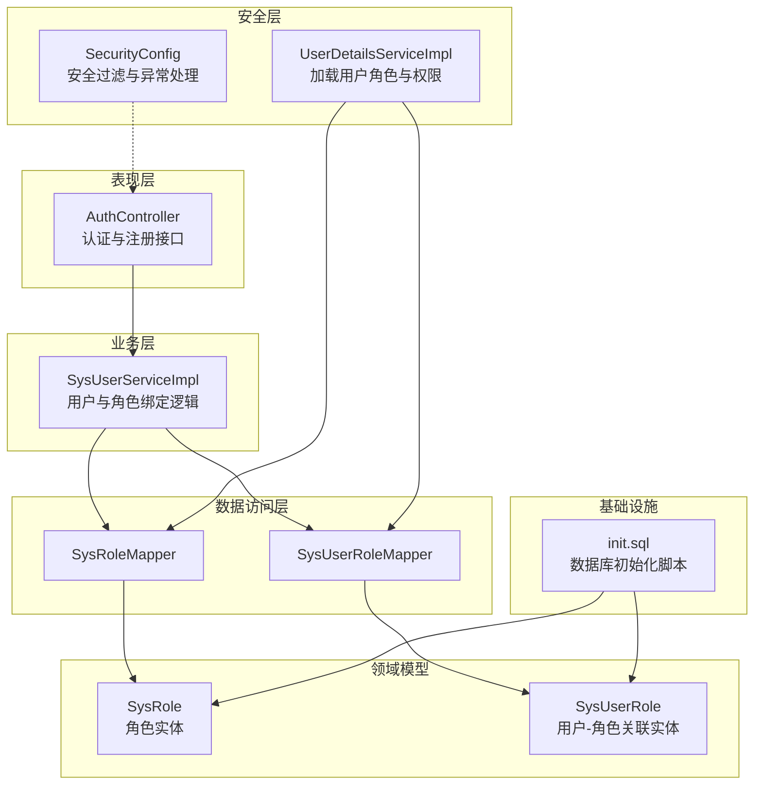
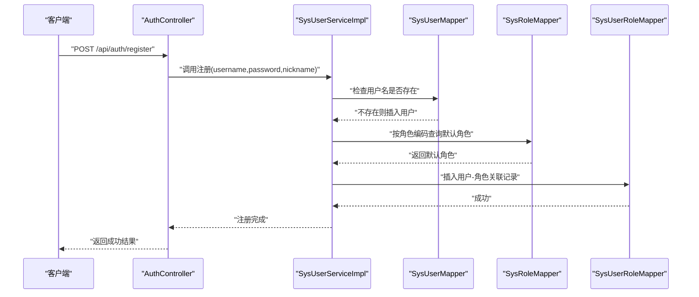
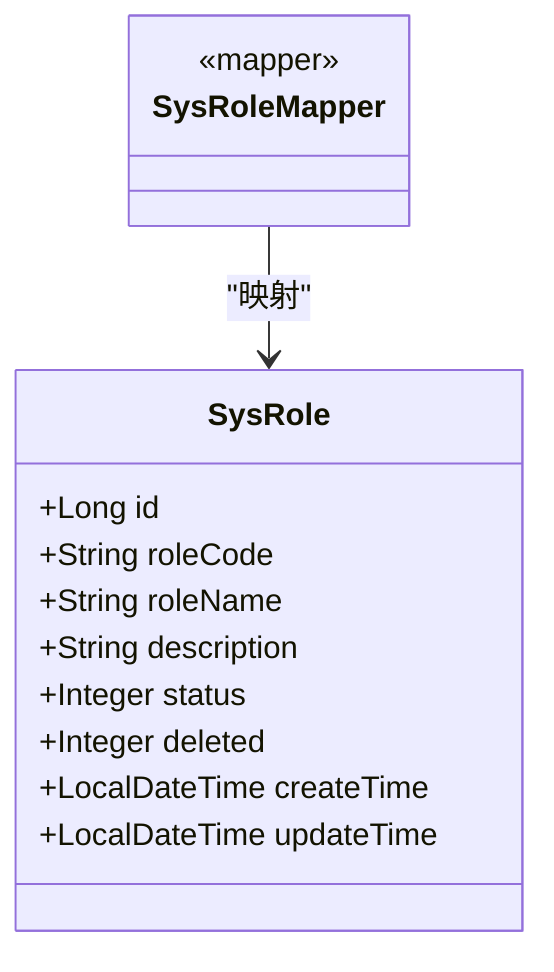
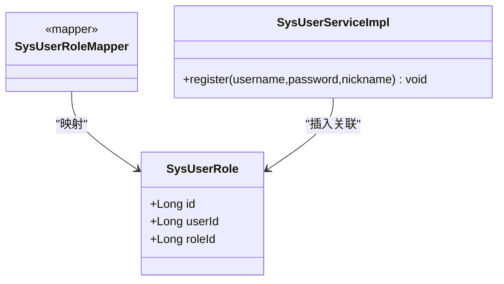
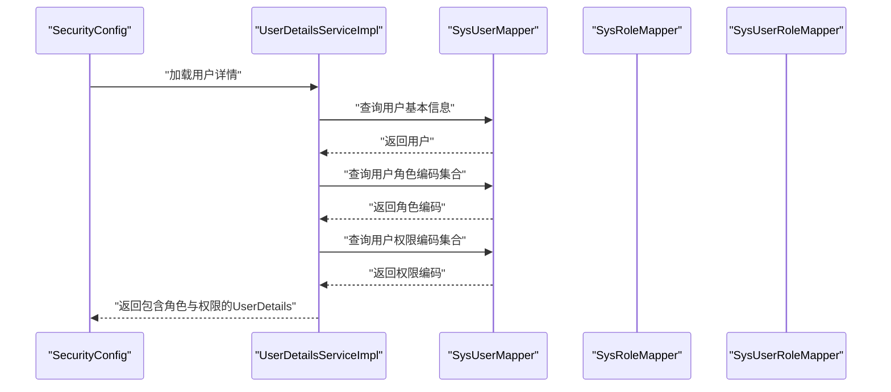
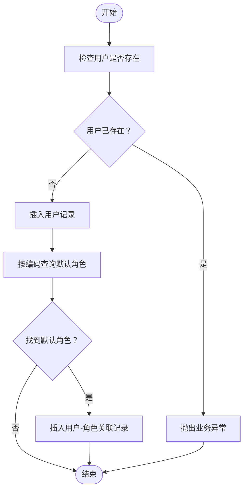
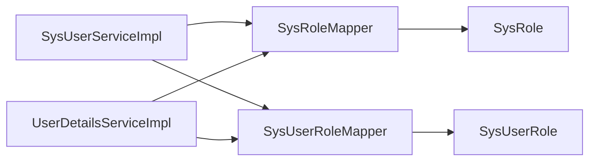

# 角色管理功能

<cite>
**本文档引用的文件**
- [SysRole.java](file://src/main/java/com/bookorder/entity/SysRole.java)
- [SysUserRole.java](file://src/main/java/com/bookorder/entity/SysUserRole.java)
- [SysRoleMapper.java](file://src/main/java/com/bookorder/mapper/SysRoleMapper.java)
- [SysUserRoleMapper.java](file://src/main/java/com/bookorder/mapper/SysUserRoleMapper.java)
- [SysUserServiceImpl.java](file://src/main/java/com/bookorder/service/impl/SysUserServiceImpl.java)
- [UserDetailsServiceImpl.java](file://src/main/java/com/bookorder/security/UserDetailsServiceImpl.java)
- [init.sql](file://sql/init.sql)
- [Result.java](file://src/main/java/com/bookorder/common/Result.java)
- [BusinessException.java](file://src/main/java/com/bookorder/common/BusinessException.java)
- [AuthController.java](file://src/main/java/com/bookorder/controller/AuthController.java)
- [SecurityConfig.java](file://src/main/java/com/bookorder/config/SecurityConfig.java)
</cite>

## 目录
1. [简介](#简介)
2. [项目结构](#项目结构)
3. [核心组件](#核心组件)
4. [架构总览](#架构总览)
5. [详细组件分析](#详细组件分析)
6. [依赖分析](#依赖分析)
7. [性能考虑](#性能考虑)
8. [故障排除指南](#故障排除指南)
9. [结论](#结论)
10. [附录](#附录)

## 简介
本文件面向图书预订系统中的“角色管理”功能，基于现有代码库进行深入分析，覆盖角色的创建、修改、删除与查询能力；角色状态管理、角色编码规范与层级设计；用户角色绑定机制（批量分配、撤销与更新）；角色权限继承关系及对用户权限的影响；API 接口设计、参数校验与错误处理；并提供最佳实践与安全建议（权限最小化与定期审计）。  
需要特别说明：当前仓库中未包含专门的角色管理控制器或服务接口实现，角色管理相关逻辑主要通过用户注册时默认绑定角色、认证授权时按用户查询角色与权限等机制体现。因此，本文在“角色管理 API 设计”部分以概念性方案呈现，便于后续扩展。

## 项目结构
系统采用分层架构，角色管理涉及实体模型、持久层映射、业务服务、安全认证与控制器等模块。数据库初始化脚本定义了角色、权限、用户-角色关联等核心表结构，并内置了管理员、图书管理员、读者三类角色及其权限映射。

**图表来源**
- [AuthController.java:1-38](file://src/main/java/com/bookorder/controller/AuthController.java#L1-L38)
- [SysUserServiceImpl.java:1-87](file://src/main/java/com/bookorder/service/impl/SysUserServiceImpl.java#L1-L87)
- [UserDetailsServiceImpl.java:1-50](file://src/main/java/com/bookorder/security/UserDetailsServiceImpl.java#L1-L50)
- [SysRoleMapper.java:1-10](file://src/main/java/com/bookorder/mapper/SysRoleMapper.java#L1-L10)
- [SysUserRoleMapper.java:1-10](file://src/main/java/com/bookorder/mapper/SysUserRoleMapper.java#L1-L10)
- [SysRole.java:1-42](file://src/main/java/com/bookorder/entity/SysRole.java#L1-L42)
- [SysUserRole.java:1-22](file://src/main/java/com/bookorder/entity/SysUserRole.java#L1-L22)
- [init.sql:1-124](file://sql/init.sql#L1-L124)

**章节来源**
- [AuthController.java:1-38](file://src/main/java/com/bookorder/controller/AuthController.java#L1-L38)
- [SysUserServiceImpl.java:1-87](file://src/main/java/com/bookorder/service/impl/SysUserServiceImpl.java#L1-L87)
- [UserDetailsServiceImpl.java:1-50](file://src/main/java/com/bookorder/security/UserDetailsServiceImpl.java#L1-L50)
- [SysRoleMapper.java:1-10](file://src/main/java/com/bookorder/mapper/SysRoleMapper.java#L1-L10)
- [SysUserRoleMapper.java:1-10](file://src/main/java/com/bookorder/mapper/SysUserRoleMapper.java#L1-L10)
- [SysRole.java:1-42](file://src/main/java/com/bookorder/entity/SysRole.java#L1-L42)
- [SysUserRole.java:1-22](file://src/main/java/com/bookorder/entity/SysUserRole.java#L1-L22)
- [init.sql:1-124](file://sql/init.sql#L1-L124)

## 核心组件
- 角色实体与映射
  - 角色实体包含标识、角色编码、角色名称、描述、状态、软删除标记与时间戳字段，用于支撑角色的增删改查与状态管理。
  - 角色映射器为 MyBatis-Plus 基础映射接口，提供通用 CRUD 能力。
- 用户-角色关联实体与映射
  - 关联实体记录用户与角色的多对多关系，唯一约束避免重复绑定。
  - 关联映射器提供基础 CRUD 能力。
- 用户服务实现
  - 注册流程中默认为新用户绑定“READER”角色，体现角色的初始分配机制。
  - 提供登录、注册、用户信息查询等能力。
- 安全细节
  - 认证成功后生成 JWT；授权时从用户查询其角色与权限集合，形成权限体系。
  - 安全配置对鉴权失败与权限不足场景返回统一结果格式。

**章节来源**
- [SysRole.java:1-42](file://src/main/java/com/bookorder/entity/SysRole.java#L1-L42)
- [SysRoleMapper.java:1-10](file://src/main/java/com/bookorder/mapper/SysRoleMapper.java#L1-L10)
- [SysUserRole.java:1-22](file://src/main/java/com/bookorder/entity/SysUserRole.java#L1-L22)
- [SysUserRoleMapper.java:1-10](file://src/main/java/com/bookorder/mapper/SysUserRoleMapper.java#L1-L10)
- [SysUserServiceImpl.java:57-80](file://src/main/java/com/bookorder/service/impl/SysUserServiceImpl.java#L57-L80)
- [UserDetailsServiceImpl.java:24-48](file://src/main/java/com/bookorder/security/UserDetailsServiceImpl.java#L24-L48)
- [SecurityConfig.java:53-73](file://src/main/java/com/bookorder/config/SecurityConfig.java#L53-L73)

## 架构总览
角色管理在当前系统中的定位是“用户初始角色绑定 + 授权时的角色/权限加载”。系统通过数据库初始化脚本预置角色与权限映射，用户注册时自动绑定默认角色，登录后由安全组件加载用户的角色与权限集合，最终形成 Spring Security 的授权决策依据。

**图表来源**
- [AuthController.java:34-38](file://src/main/java/com/bookorder/controller/AuthController.java#L34-L38)
- [SysUserServiceImpl.java:57-80](file://src/main/java/com/bookorder/service/impl/SysUserServiceImpl.java#L57-L80)
- [SysRoleMapper.java:1-10](file://src/main/java/com/bookorder/mapper/SysRoleMapper.java#L1-L10)
- [SysUserRoleMapper.java:1-10](file://src/main/java/com/bookorder/mapper/SysUserRoleMapper.java#L1-L10)

## 详细组件分析

### 角色实体与映射
- 角色实体字段覆盖标识、编码、名称、描述、状态、软删除与时间戳，满足角色生命周期管理与审计需求。
- 映射器继承 MyBatis-Plus 基础接口，天然具备通用 CRUD 能力，便于后续扩展角色管理 API。

**图表来源**
- [SysRole.java:1-42](file://src/main/java/com/bookorder/entity/SysRole.java#L1-L42)
- [SysRoleMapper.java:1-10](file://src/main/java/com/bookorder/mapper/SysRoleMapper.java#L1-L10)

**章节来源**
- [SysRole.java:1-42](file://src/main/java/com/bookorder/entity/SysRole.java#L1-L42)
- [SysRoleMapper.java:1-10](file://src/main/java/com/bookorder/mapper/SysRoleMapper.java#L1-L10)

### 用户-角色关联与默认绑定
- 关联实体包含用户 ID 与角色 ID，唯一约束保证不重复绑定。
- 用户注册时默认绑定“READER”角色，体现角色的初始分配策略。

**图表来源**
- [SysUserRole.java:1-22](file://src/main/java/com/bookorder/entity/SysUserRole.java#L1-L22)
- [SysUserRoleMapper.java:1-10](file://src/main/java/com/bookorder/mapper/SysUserRoleMapper.java#L1-L10)
- [SysUserServiceImpl.java:57-80](file://src/main/java/com/bookorder/service/impl/SysUserServiceImpl.java#L57-L80)

**章节来源**
- [SysUserRole.java:1-22](file://src/main/java/com/bookorder/entity/SysUserRole.java#L1-L22)
- [SysUserRoleMapper.java:1-10](file://src/main/java/com/bookorder/mapper/SysUserRoleMapper.java#L1-L10)
- [SysUserServiceImpl.java:57-80](file://src/main/java/com/bookorder/service/impl/SysUserServiceImpl.java#L57-L80)

### 授权流程与权限继承
- 登录成功后，安全组件加载用户的角色编码与权限编码，分别转换为“角色前缀 + 编码”的授权标识与直接权限标识，形成完整的授权集合。
- 数据库初始化脚本定义了角色与权限的映射关系，例如管理员拥有全部权限，图书管理员拥有图书与订单管理权限，读者仅有限定权限，体现了“角色继承权限”的设计。

**图表来源**
- [UserDetailsServiceImpl.java:24-48](file://src/main/java/com/bookorder/security/UserDetailsServiceImpl.java#L24-L48)
- [SecurityConfig.java:53-73](file://src/main/java/com/bookorder/config/SecurityConfig.java#L53-L73)

**章节来源**
- [UserDetailsServiceImpl.java:24-48](file://src/main/java/com/bookorder/security/UserDetailsServiceImpl.java#L24-L48)
- [SecurityConfig.java:53-73](file://src/main/java/com/bookorder/config/SecurityConfig.java#L53-L73)
- [init.sql:76-116](file://sql/init.sql#L76-L116)

### 角色管理 API 设计（概念性）
以下为角色管理功能的 API 设计建议，便于后续扩展至独立的控制器与服务层。当前仓库未包含对应实现，故仅作概念性说明。

- 角色创建
  - 方法与路径：POST /api/roles
  - 请求体字段：roleCode、roleName、description、status
  - 参数校验：角色编码唯一、长度与格式限制、状态枚举值
  - 返回：Result.success 或 Result.error
- 角色修改
  - 方法与路径：PUT /api/roles/{id}
  - 请求体字段：roleCode（不可变）、roleName、description、status
  - 参数校验：主键存在、角色编码唯一性
  - 返回：Result.success 或 Result.error
- 角色删除
  - 方法与路径：DELETE /api/roles/{id}
  - 语义：软删除（deleted=1），禁止删除被用户绑定的角色
  - 返回：Result.success 或 Result.error
- 角色查询
  - 方法与路径：GET /api/roles
  - 查询参数：roleCode、roleName、status、page、size
  - 返回：分页结果集
- 用户角色绑定
  - 批量分配：POST /api/users/{userId}/roles（传入角色ID数组）
  - 单个撤销：DELETE /api/users/{userId}/roles/{roleId}
  - 批量撤销：DELETE /api/users/{userId}/roles（传入角色ID数组）
  - 更新：PUT /api/users/{userId}/roles（先撤销旧角色，再批量分配新角色）

参数校验与错误处理
- 使用统一响应包装 Result，错误码遵循约定（如 400、403、500）
- 业务异常 BusinessException 携带业务错误码，便于前端识别

**章节来源**
- [Result.java:1-41](file://src/main/java/com/bookorder/common/Result.java#L1-L41)
- [BusinessException.java:1-19](file://src/main/java/com/bookorder/common/BusinessException.java#L1-L19)

### 角色状态管理、编码规范与层级设计
- 状态管理
  - 角色具备启用/禁用状态字段，配合安全层在认证与授权阶段进行过滤。
- 编码规范
  - 角色编码唯一且区分大小写，作为权限体系中的关键标识。
- 层级设计
  - 当前为扁平角色模型，权限通过角色-权限映射集中管理。若需引入层级，可在角色实体中增加父角色字段并在授权时递归计算权限。

**章节来源**
- [SysRole.java:11-14](file://src/main/java/com/bookorder/entity/SysRole.java#L11-L14)
- [init.sql:27-36](file://sql/init.sql#L27-L36)
- [init.sql:76-80](file://sql/init.sql#L76-L80)

### 用户角色绑定机制
- 初始绑定：注册时默认绑定“READER”角色，确保新用户具备基本权限。
- 批量分配：通过用户-角色关联表一次性插入多条记录。
- 撤销与更新：先删除旧关联，再插入新关联，实现原子性的角色更新。

**图表来源**
- [SysUserServiceImpl.java:57-80](file://src/main/java/com/bookorder/service/impl/SysUserServiceImpl.java#L57-L80)

**章节来源**
- [SysUserServiceImpl.java:57-80](file://src/main/java/com/bookorder/service/impl/SysUserServiceImpl.java#L57-L80)
- [SysUserRole.java:10-13](file://src/main/java/com/bookorder/entity/SysUserRole.java#L10-L13)

### 角色权限继承与对用户权限的影响
- 角色-权限映射由数据库初始化脚本集中维护，管理员拥有全部权限，图书管理员拥有图书与订单管理权限，读者仅有限定权限。
- 授权时，系统将角色编码转换为“ROLE_前缀 + 编码”，并将权限编码直接作为授权标识，最终形成用户拥有的完整权限集合。

**章节来源**
- [init.sql:102-116](file://sql/init.sql#L102-L116)
- [UserDetailsServiceImpl.java:39-47](file://src/main/java/com/bookorder/security/UserDetailsServiceImpl.java#L39-L47)

## 依赖分析
- 实体与映射
  - 角色实体与映射器之间为一对一映射关系，提供通用 CRUD 能力。
  - 用户-角色关联实体与映射器之间为一对一映射关系，支持多对多关系的存储。
- 业务与安全
  - 用户服务实现依赖角色映射器与用户-角色映射器，完成注册时的默认角色绑定。
  - 安全服务实现依赖用户映射器查询用户的角色与权限编码，构建授权集合。
- 数据初始化
  - 初始化脚本定义角色、权限与映射关系，为系统运行期提供基础数据。

**图表来源**
- [SysUserServiceImpl.java:22-41](file://src/main/java/com/bookorder/service/impl/SysUserServiceImpl.java#L22-L41)
- [UserDetailsServiceImpl.java:17-21](file://src/main/java/com/bookorder/security/UserDetailsServiceImpl.java#L17-L21)
- [SysRoleMapper.java:1-10](file://src/main/java/com/bookorder/mapper/SysRoleMapper.java#L1-L10)
- [SysUserRoleMapper.java:1-10](file://src/main/java/com/bookorder/mapper/SysUserRoleMapper.java#L1-L10)
- [SysRole.java:1-42](file://src/main/java/com/bookorder/entity/SysRole.java#L1-L42)
- [SysUserRole.java:1-22](file://src/main/java/com/bookorder/entity/SysUserRole.java#L1-L22)

**章节来源**
- [SysUserServiceImpl.java:22-41](file://src/main/java/com/bookorder/service/impl/SysUserServiceImpl.java#L22-L41)
- [UserDetailsServiceImpl.java:17-21](file://src/main/java/com/bookorder/security/UserDetailsServiceImpl.java#L17-L21)
- [SysRoleMapper.java:1-10](file://src/main/java/com/bookorder/mapper/SysRoleMapper.java#L1-L10)
- [SysUserRoleMapper.java:1-10](file://src/main/java/com/bookorder/mapper/SysUserRoleMapper.java#L1-L10)
- [SysRole.java:1-42](file://src/main/java/com/bookorder/entity/SysRole.java#L1-L42)
- [SysUserRole.java:1-22](file://src/main/java/com/bookorder/entity/SysUserRole.java#L1-L22)

## 性能考虑
- 查询优化
  - 在用户-角色与角色-权限映射表上建立合适的索引，确保按用户 ID 查询角色与权限的效率。
- 写入优化
  - 批量插入用户-角色关联记录时使用事务，减少往返次数。
- 缓存策略
  - 对常用角色与权限映射进行缓存，降低频繁查询带来的数据库压力。
- 分页与过滤
  - 角色查询接口应支持分页与条件过滤，避免一次性返回大量数据。

## 故障排除指南
- 用户名冲突
  - 注册时若用户名已存在，将抛出业务异常，错误码为 400。
- 权限不足
  - 鉴权失败或权限不足时，安全配置会返回统一错误结果，HTTP 状态码为 403。
- 角色默认绑定失败
  - 若默认角色不存在，注册流程不会绑定角色；请检查初始化脚本中的角色数据是否正确导入。

**章节来源**
- [SysUserServiceImpl.java:60-62](file://src/main/java/com/bookorder/service/impl/SysUserServiceImpl.java#L60-L62)
- [SecurityConfig.java:53-57](file://src/main/java/com/bookorder/config/SecurityConfig.java#L53-L57)
- [init.sql:76-80](file://sql/init.sql#L76-L80)

## 结论
当前系统通过“注册默认绑定 + 授权时加载”的方式实现了角色管理的基础能力。角色实体与映射器提供了完善的持久化支持，用户服务在注册流程中完成默认角色绑定，安全服务在授权时加载角色与权限集合。若需进一步增强角色管理能力，建议在现有基础上扩展独立的角色管理控制器与服务层，完善角色的创建、修改、删除与查询接口，并配套严格的参数校验与错误处理机制。

## 附录
- 数据库初始化要点
  - 角色表包含角色编码、名称、描述与状态字段，编码需唯一。
  - 权限表包含权限编码、名称与类型字段，类型区分菜单、按钮与接口。
  - 角色-权限映射表集中维护角色的权限集合。
  - 用户-角色映射表维护用户的角色集合。

**章节来源**
- [init.sql:27-70](file://sql/init.sql#L27-L70)