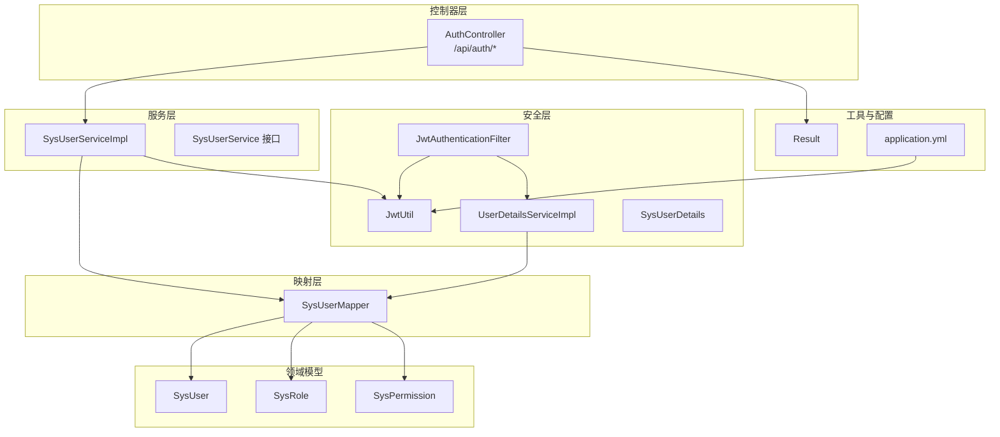
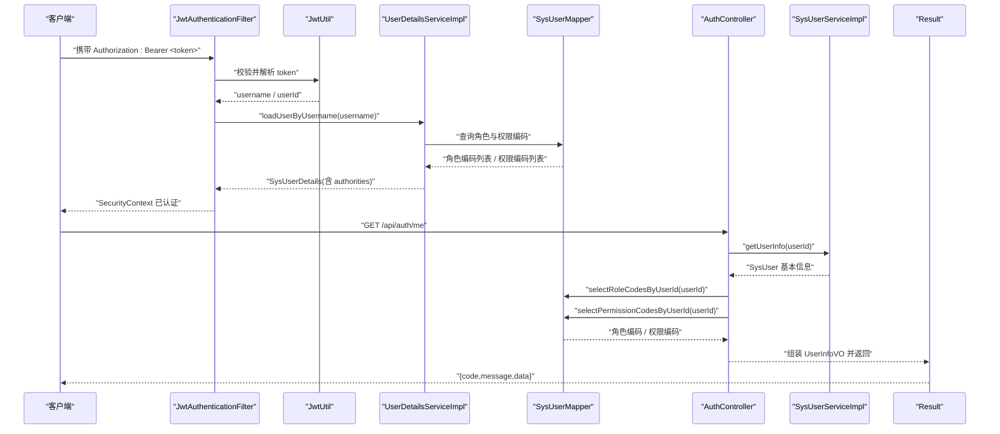
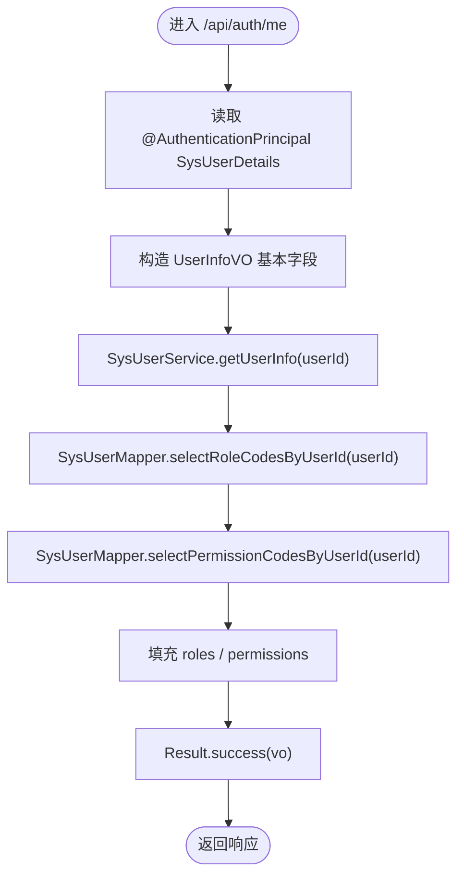
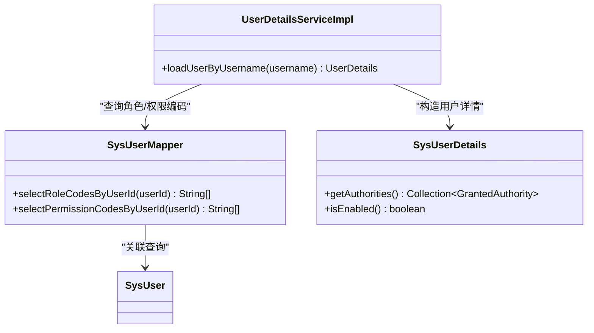
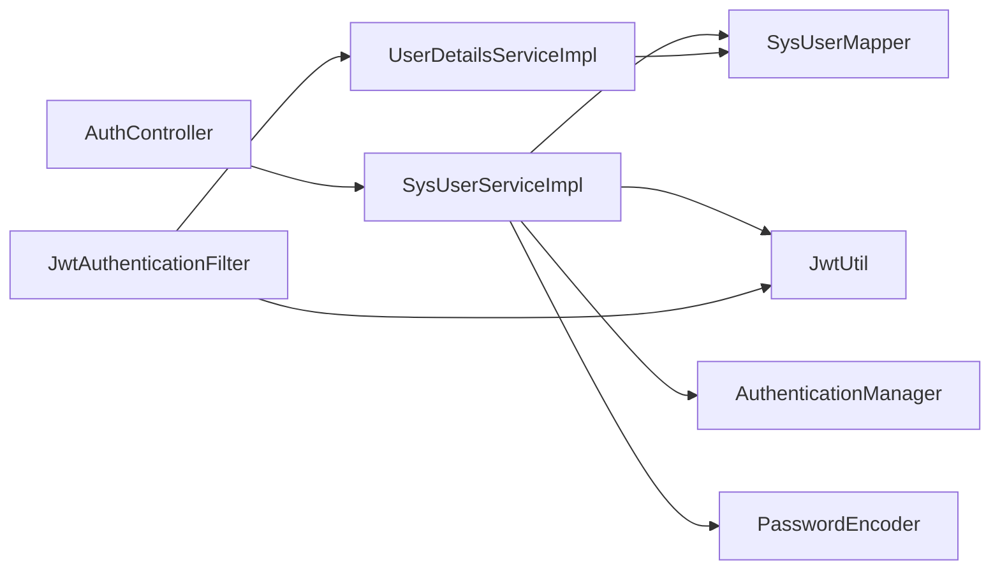
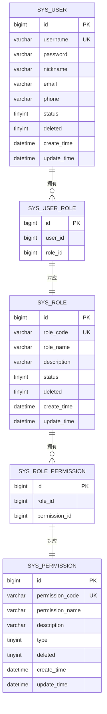

# 用户信息管理

<cite>
**本文引用的文件**
- [AuthController.java](file://src/main/java/com/bookorder/controller/AuthController.java)
- [UserInfoVO.java](file://src/main/java/com/bookorder/dto/UserInfoVO.java)
- [SysUserDetails.java](file://src/main/java/com/bookorder/security/SysUserDetails.java)
- [SysUserService.java](file://src/main/java/com/bookorder/service/SysUserService.java)
- [SysUserServiceImpl.java](file://src/main/java/com/bookorder/service/impl/SysUserServiceImpl.java)
- [SysUserMapper.java](file://src/main/java/com/bookorder/mapper/SysUserMapper.java)
- [SysUser.java](file://src/main/java/com/bookorder/entity/SysUser.java)
- [UserDetailsServiceImpl.java](file://src/main/java/com/bookorder/security/UserDetailsServiceImpl.java)
- [JwtAuthenticationFilter.java](file://src/main/java/com/bookorder/security/JwtAuthenticationFilter.java)
- [JwtUtil.java](file://src/main/java/com/bookorder/security/JwtUtil.java)
- [application.yml](file://src/main/resources/application.yml)
- [init.sql](file://sql/init.sql)
- [Result.java](file://src/main/java/com/bookorder/common/Result.java)
</cite>

## 目录
1. [简介](#简介)
2. [项目结构](#项目结构)
3. [核心组件](#核心组件)
4. [架构总览](#架构总览)
5. [详细组件分析](#详细组件分析)
6. [依赖分析](#依赖分析)
7. [性能考虑](#性能考虑)
8. [故障排查指南](#故障排查指南)
9. [结论](#结论)
10. [附录](#附录)

## 简介
本文件围绕“用户信息管理”功能，系统性阐述从认证到个人信息展示的完整实现路径，重点解析以下内容：
- AuthController 中 /api/auth/me 接口的处理流程与返回结构
- UserInfoVO 数据传输对象的设计与字段语义
- 用户基本信息查询、角色权限信息聚合与 SysUserDetails 的使用方式
- 用户信息缓存策略、权限数据聚合过程与数据安全性保障
- 完整的个人信息 API 文档（认证要求、请求/响应格式）
- 用户信息更新流程、权限验证机制与隐私保护措施

## 项目结构
后端采用 Spring Boot + MyBatis-Plus 架构，按职责分层组织：
- 控制器层：AuthController 提供认证与个人信息接口
- 领域模型：SysUser、SysRole、SysPermission 等实体
- 映射层：SysUserMapper 等 Mapper 负责 SQL 查询
- 服务层：SysUserService 及其实现负责业务编排
- 安全层：JwtUtil、JwtAuthenticationFilter、UserDetailsServiceImpl、SysUserDetails 实现认证与授权
- 工具与通用：Result 统一响应包装

图表来源
- [AuthController.java:1-59](file://src/main/java/com/bookorder/controller/AuthController.java#L1-L59)
- [SysUserServiceImpl.java:1-87](file://src/main/java/com/bookorder/service/impl/SysUserServiceImpl.java#L1-L87)
- [SysUserMapper.java:1-25](file://src/main/java/com/bookorder/mapper/SysUserMapper.java#L1-L25)
- [UserDetailsServiceImpl.java:1-50](file://src/main/java/com/bookorder/security/UserDetailsServiceImpl.java#L1-L50)
- [JwtAuthenticationFilter.java:1-56](file://src/main/java/com/bookorder/security/JwtAuthenticationFilter.java#L1-L56)
- [JwtUtil.java:1-62](file://src/main/java/com/bookorder/security/JwtUtil.java#L1-L62)
- [application.yml:1-33](file://src/main/resources/application.yml#L1-L33)
- [Result.java:1-41](file://src/main/java/com/bookorder/common/Result.java#L1-L41)

章节来源
- [AuthController.java:1-59](file://src/main/java/com/bookorder/controller/AuthController.java#L1-L59)
- [application.yml:1-33](file://src/main/resources/application.yml#L1-L33)

## 核心组件
- AuthController：提供登录、注册与个人信息查询接口，其中 /api/auth/me 返回当前登录用户的完整信息
- UserInfoVO：用于封装个人信息、角色编码与权限编码的传输对象
- SysUserDetails：实现 UserDetails，承载用户身份、昵称、状态与权限集合
- SysUserService/SysUserServiceImpl：提供登录、注册、用户信息查询等业务能力
- SysUserMapper：提供基于用户 ID 的角色编码与权限编码查询
- UserDetailsServiceImpl：加载用户并聚合角色与权限为 GrantedAuthority 列表
- JwtAuthenticationFilter/JwtUtil：解析请求头中的 JWT 并注入认证上下文
- Result：统一响应包装，规范接口返回结构

章节来源
- [AuthController.java:40-57](file://src/main/java/com/bookorder/controller/AuthController.java#L40-L57)
- [UserInfoVO.java:1-30](file://src/main/java/com/bookorder/dto/UserInfoVO.java#L1-L30)
- [SysUserDetails.java:1-54](file://src/main/java/com/bookorder/security/SysUserDetails.java#L1-L54)
- [SysUserService.java:1-16](file://src/main/java/com/bookorder/service/SysUserService.java#L1-L16)
- [SysUserServiceImpl.java:1-87](file://src/main/java/com/bookorder/service/impl/SysUserServiceImpl.java#L1-L87)
- [SysUserMapper.java:1-25](file://src/main/java/com/bookorder/mapper/SysUserMapper.java#L1-L25)
- [UserDetailsServiceImpl.java:1-50](file://src/main/java/com/bookorder/security/UserDetailsServiceImpl.java#L1-L50)
- [JwtAuthenticationFilter.java:1-56](file://src/main/java/com/bookorder/security/JwtAuthenticationFilter.java#L1-L56)
- [JwtUtil.java:1-62](file://src/main/java/com/bookorder/security/JwtUtil.java#L1-L62)
- [Result.java:1-41](file://src/main/java/com/bookorder/common/Result.java#L1-L41)

## 架构总览
下图展示了从客户端发起请求到返回个人信息的完整链路，包括认证过滤、用户详情加载、权限聚合与响应封装。

图表来源
- [JwtAuthenticationFilter.java:28-46](file://src/main/java/com/bookorder/security/JwtAuthenticationFilter.java#L28-L46)
- [JwtUtil.java:37-60](file://src/main/java/com/bookorder/security/JwtUtil.java#L37-L60)
- [UserDetailsServiceImpl.java:24-48](file://src/main/java/com/bookorder/security/UserDetailsServiceImpl.java#L24-L48)
- [SysUserMapper.java:14-23](file://src/main/java/com/bookorder/mapper/SysUserMapper.java#L14-L23)
- [AuthController.java:40-57](file://src/main/java/com/bookorder/controller/AuthController.java#L40-L57)
- [SysUserServiceImpl.java:82-85](file://src/main/java/com/bookorder/service/impl/SysUserServiceImpl.java#L82-L85)
- [Result.java:18-28](file://src/main/java/com/bookorder/common/Result.java#L18-L28)

## 详细组件分析

### AuthController /api/auth/me 接口
- 认证参数：通过 @AuthenticationPrincipal 注入已认证的 SysUserDetails
- 数据来源：
  - 基本信息：从 SysUserDetails 获取 id/username/nickname；再调用 SysUserService.getUserInfo 获取 email/phone
  - 角色与权限：通过 SysUserMapper 的两个方法分别查询角色编码与权限编码
- 返回结构：使用 Result 包装 UserInfoVO，包含 id、username、nickname、email、phone、roles、permissions

图表来源
- [AuthController.java:40-57](file://src/main/java/com/bookorder/controller/AuthController.java#L40-L57)
- [SysUserServiceImpl.java:82-85](file://src/main/java/com/bookorder/service/impl/SysUserServiceImpl.java#L82-L85)
- [SysUserMapper.java:14-23](file://src/main/java/com/bookorder/mapper/SysUserMapper.java#L14-L23)
- [Result.java:18-28](file://src/main/java/com/bookorder/common/Result.java#L18-L28)

章节来源
- [AuthController.java:40-57](file://src/main/java/com/bookorder/controller/AuthController.java#L40-L57)

### UserInfoVO 数据传输对象
- 字段设计：
  - id：用户标识
  - username：登录账户名
  - nickname：用户昵称
  - email：电子邮箱
  - phone：手机号码
  - roles：角色编码列表
  - permissions：权限编码列表
- 设计原则：仅暴露前端所需字段，避免泄露敏感信息；与数据库实体解耦，便于演进

章节来源
- [UserInfoVO.java:1-30](file://src/main/java/com/bookorder/dto/UserInfoVO.java#L1-L30)

### SysUserDetails 用户详情
- 承载字段：id、username、password、nickname、status、authorities
- 关键行为：
  - isEnabled 返回 status == 1，用于启用/禁用控制
  - authorities 由 UserDetailsServiceImpl 聚合角色与权限编码生成
- 作用：作为 Spring Security 的 UserDetails 实现，贯穿认证与授权流程

章节来源
- [SysUserDetails.java:1-54](file://src/main/java/com/bookorder/security/SysUserDetails.java#L1-L54)
- [UserDetailsServiceImpl.java:36-47](file://src/main/java/com/bookorder/security/UserDetailsServiceImpl.java#L36-L47)

### 用户基本信息查询
- SysUserService.getUserInfo：根据 userId 查询 SysUser 基本信息（email/phone 等）
- SysUserServiceImpl 实现：直接委托给 SysUserMapper 的 selectById

章节来源
- [SysUserService.java:14-14](file://src/main/java/com/bookorder/service/SysUserService.java#L14-L14)
- [SysUserServiceImpl.java:82-85](file://src/main/java/com/bookorder/service/impl/SysUserServiceImpl.java#L82-L85)
- [SysUser.java:1-48](file://src/main/java/com/bookorder/entity/SysUser.java#L1-L48)

### 角色权限信息获取与聚合
- 角色编码：通过 SysUserMapper 的 selectRoleCodesByUserId 查询
- 权限编码：通过 SysUserMapper 的 selectPermissionCodesByUserId 查询（去重）
- 聚合过程：UserDetailsServiceImpl 将角色编码前缀化为 ROLE_ 前缀，权限编码保持原样，形成 GrantedAuthority 列表

图表来源
- [UserDetailsServiceImpl.java:24-48](file://src/main/java/com/bookorder/security/UserDetailsServiceImpl.java#L24-L48)
- [SysUserMapper.java:14-23](file://src/main/java/com/bookorder/mapper/SysUserMapper.java#L14-L23)
- [SysUserDetails.java:32-34](file://src/main/java/com/bookorder/security/SysUserDetails.java#L32-L34)

章节来源
- [UserDetailsServiceImpl.java:36-47](file://src/main/java/com/bookorder/security/UserDetailsServiceImpl.java#L36-L47)
- [SysUserMapper.java:14-23](file://src/main/java/com/bookorder/mapper/SysUserMapper.java#L14-L23)

### 用户信息缓存策略
- 当前实现未发现显式缓存组件或注解（如 @Cacheable）。若需提升性能，可在以下位置引入缓存：
  - /api/auth/me 接口结果缓存（基于 userId）
  - 角色/权限编码查询结果缓存（基于 userId）
  - 用户基本信息缓存（基于 userId）
- 缓存键建议：以 userId 为主键，结合版本号或时间戳，避免脏读
- 失效策略：用户信息变更时主动失效；角色/权限变更时同步失效

[本节为通用优化建议，不涉及具体源码实现]

### 数据安全性保障
- 密码加密：注册时使用 PasswordEncoder 对明文密码进行编码存储
- 登录认证：通过 AuthenticationManager 校验凭据，成功后签发 JWT
- Token 校验：JwtUtil 校验签名与过期时间，确保令牌有效性
- 过滤链：JwtAuthenticationFilter 在请求到达控制器前完成认证上下文注入
- 用户状态：SysUserDetails.isEnabled 基于 status 字段判断是否可用

章节来源
- [SysUserServiceImpl.java:58-80](file://src/main/java/com/bookorder/service/impl/SysUserServiceImpl.java#L58-L80)
- [JwtUtil.java:45-60](file://src/main/java/com/bookorder/security/JwtUtil.java#L45-L60)
- [JwtAuthenticationFilter.java:34-43](file://src/main/java/com/bookorder/security/JwtAuthenticationFilter.java#L34-L43)
- [SysUserDetails.java:49-52](file://src/main/java/com/bookorder/security/SysUserDetails.java#L49-L52)

### 个人信息 API 文档

- 基本信息
  - 地址：/api/auth/me
  - 方法：GET
  - 认证：需要在请求头携带 Authorization: Bearer <token>
  - 成功响应：Result.success(UserInfoVO)

- 请求头
  - Authorization: Bearer <token>

- 响应体（Result）
  - code：状态码（200 表示成功）
  - message：消息描述
  - data：UserInfoVO

- UserInfoVO 字段
  - id：Long，用户标识
  - username：String，登录账户名
  - nickname：String，用户昵称
  - email：String，电子邮箱
  - phone：String，手机号码
  - roles：List<String>，角色编码列表
  - permissions：List<String>，权限编码列表

章节来源
- [AuthController.java:40-57](file://src/main/java/com/bookorder/controller/AuthController.java#L40-L57)
- [Result.java:18-28](file://src/main/java/com/bookorder/common/Result.java#L18-L28)
- [UserInfoVO.java:7-13](file://src/main/java/com/bookorder/dto/UserInfoVO.java#L7-L13)

### 用户信息更新流程、权限验证机制与隐私保护
- 更新流程建议（通用实践）：
  - 接口：/api/auth/profile（示例），支持 PATCH/PUT
  - 参数：仅允许更新 email、phone、nickname 等非敏感字段
  - 权限：基于 @PreAuthorize 或拦截器校验当前用户 ID 与目标用户一致
  - 审计：记录变更历史与操作日志
- 权限验证机制：
  - 基于角色：如 READER 可查看自身信息；ADMIN/LIBRARIAN 可管理用户
  - 基于权限：如 user:list、user:update 等细粒度控制
- 隐私保护：
  - 不在 UserInfoVO 中返回 password、status 等敏感字段
  - 仅暴露必要字段，避免信息泄露
  - 对敏感操作增加二次确认与日志审计

[本节为通用最佳实践建议，不涉及具体源码实现]

## 依赖分析
- 控制器依赖服务与映射：AuthController 依赖 SysUserService 与 SysUserMapper
- 服务依赖映射与工具：SysUserServiceImpl 依赖 SysUserMapper、SysUserRoleMapper、SysRoleMapper、JwtUtil、PasswordEncoder、AuthenticationManager
- 安全依赖：JwtAuthenticationFilter 依赖 JwtUtil 与 UserDetailsService；UserDetailsServiceImpl 依赖 SysUserMapper
- 配置依赖：application.yml 提供 JWT 密钥与过期时间

图表来源
- [AuthController.java:22-27](file://src/main/java/com/bookorder/controller/AuthController.java#L22-L27)
- [SysUserServiceImpl.java:22-42](file://src/main/java/com/bookorder/service/impl/SysUserServiceImpl.java#L22-L42)
- [JwtAuthenticationFilter.java:22-26](file://src/main/java/com/bookorder/security/JwtAuthenticationFilter.java#L22-L26)
- [UserDetailsServiceImpl.java:20-21](file://src/main/java/com/bookorder/security/UserDetailsServiceImpl.java#L20-L21)

章节来源
- [application.yml:26-28](file://src/main/resources/application.yml#L26-L28)

## 性能考虑
- 减少 N+1 查询：当前 /api/auth/me 会执行一次用户信息查询与两次权限/角色查询，建议引入缓存或合并查询
- 权限去重：权限查询已使用 DISTINCT，避免重复
- 分页与懒加载：若用户信息扩展更多字段，建议分页与延迟加载
- 连接池与 SQL 日志：application.yml 已开启日志输出，便于定位慢查询

[本节提供通用优化建议，不涉及具体源码实现]

## 故障排查指南
- 401 未认证
  - 检查请求头 Authorization 是否正确，Bearer 前缀与空格是否缺失
  - 校验 token 是否过期或签名无效
- 403 禁用用户
  - 用户状态 status 非 1，SysUserDetails.isEnabled 返回 false
- 用户不存在
  - UserDetailsServiceImpl.loadUserByUsername 抛出异常
- 500 服务器错误
  - 查看 Result.error 统一错误响应与日志

章节来源
- [JwtAuthenticationFilter.java:34-43](file://src/main/java/com/bookorder/security/JwtAuthenticationFilter.java#L34-L43)
- [JwtUtil.java:45-52](file://src/main/java/com/bookorder/security/JwtUtil.java#L45-L52)
- [UserDetailsServiceImpl.java:28-34](file://src/main/java/com/bookorder/security/UserDetailsServiceImpl.java#L28-L34)
- [Result.java:30-39](file://src/main/java/com/bookorder/common/Result.java#L30-L39)

## 结论
本系统通过清晰的分层设计与 Spring Security 的集成，实现了从认证到个人信息展示的完整闭环。UserInfoVO 作为轻量的数据载体，配合 SysUserDetails 与 UserDetailsServiceImpl 的权限聚合，既保证了安全性，也兼顾了可维护性。后续可在缓存与权限细化方面进一步优化，以满足高并发场景下的性能与安全需求。

## 附录

### 数据模型概览

图表来源
- [init.sql:11-70](file://sql/init.sql#L11-L70)