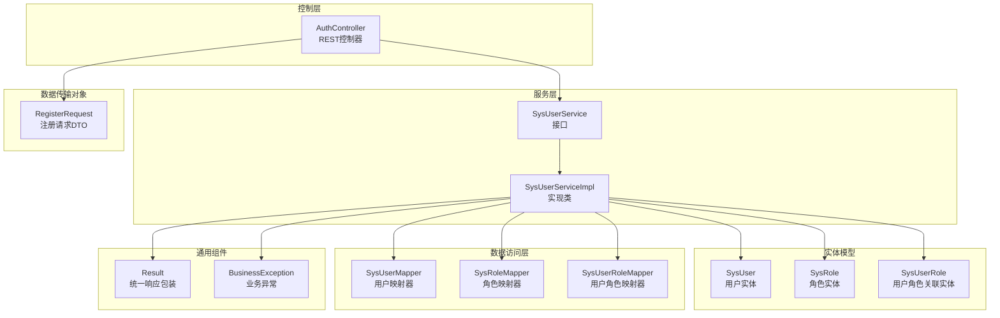
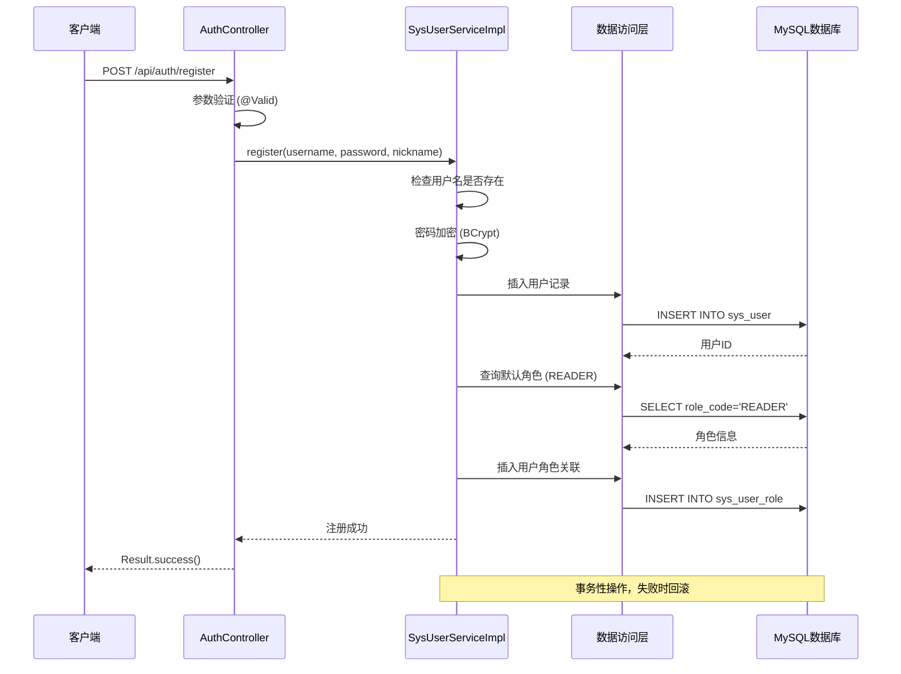
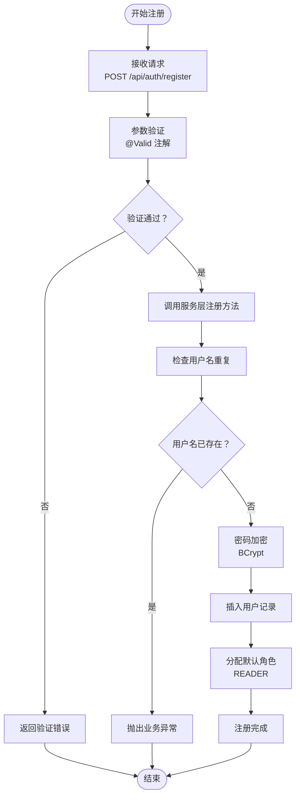
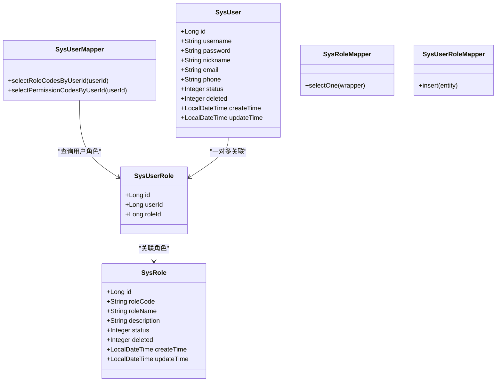
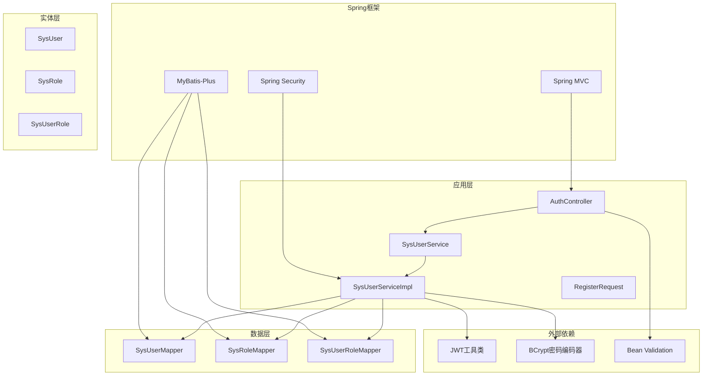

# 用户注册功能

<cite>
**本文档引用的文件**
- [AuthController.java](file://src/main/java/com/bookorder/controller/AuthController.java)
- [SysUserService.java](file://src/main/java/com/bookorder/service/SysUserService.java)
- [SysUserServiceImpl.java](file://src/main/java/com/bookorder/service/impl/SysUserServiceImpl.java)
- [RegisterRequest.java](file://src/main/java/com/bookorder/dto/RegisterRequest.java)
- [SysUser.java](file://src/main/java/com/bookorder/entity/SysUser.java)
- [SysRole.java](file://src/main/java/com/bookorder/entity/SysRole.java)
- [SysUserRole.java](file://src/main/java/com/bookorder/entity/SysUserRole.java)
- [SysUserMapper.java](file://src/main/java/com/bookorder/mapper/SysUserMapper.java)
- [SysRoleMapper.java](file://src/main/java/com/bookorder/mapper/SysRoleMapper.java)
- [SysUserRoleMapper.java](file://src/main/java/com/bookorder/mapper/SysUserRoleMapper.java)
- [Result.java](file://src/main/java/com/bookorder/common/Result.java)
- [BusinessException.java](file://src/main/java/com/bookorder/common/BusinessException.java)
- [application.yml](file://src/main/resources/application.yml)
- [init.sql](file://sql/init.sql)
</cite>

## 目录
1. [简介](#简介)
2. [项目结构](#项目结构)
3. [核心组件](#核心组件)
4. [架构概览](#架构概览)
5. [详细组件分析](#详细组件分析)
6. [依赖关系分析](#依赖关系分析)
7. [性能考虑](#性能考虑)
8. [故障排除指南](#故障排除指南)
9. [结论](#结论)

## 简介

用户注册功能是图书订单系统的核心功能之一，负责新用户的创建、验证和初始化配置。该功能实现了完整的用户注册流程，包括输入验证、数据持久化、角色分配和密码加密等关键环节。

本功能基于Spring Boot框架构建，采用分层架构设计，通过控制器-服务-数据访问层的清晰分离，确保了代码的可维护性和扩展性。系统使用JWT（JSON Web Token）进行身份认证，采用BCrypt算法对用户密码进行安全加密存储。

## 项目结构

用户注册功能涉及的主要模块和文件组织如下：



**图表来源**
- [AuthController.java:18-59](file://src/main/java/com/bookorder/controller/AuthController.java#L18-L59)
- [SysUserService.java:1-16](file://src/main/java/com/bookorder/service/SysUserService.java#L1-L16)
- [SysUserServiceImpl.java:22-87](file://src/main/java/com/bookorder/service/impl/SysUserServiceImpl.java#L22-L87)

**章节来源**
- [AuthController.java:1-59](file://src/main/java/com/bookorder/controller/AuthController.java#L1-L59)
- [SysUserService.java:1-16](file://src/main/java/com/bookorder/service/SysUserService.java#L1-L16)
- [SysUserServiceImpl.java:1-87](file://src/main/java/com/bookorder/service/impl/SysUserServiceImpl.java#L1-L87)

## 核心组件

### 注册控制器 (AuthController)

AuthController是用户注册功能的入口点，提供了RESTful API接口来处理用户注册请求。

**主要职责：**
- 接收和验证注册请求
- 调用业务服务层执行注册逻辑
- 返回标准化的响应结果

**关键方法：**
- `register(RegisterRequest request)`: 处理用户注册请求
- 使用`@Valid`注解启用参数验证
- 通过`Result.success()`返回成功响应

**章节来源**
- [AuthController.java:34-38](file://src/main/java/com/bookorder/controller/AuthController.java#L34-L38)

### 注册请求DTO (RegisterRequest)

RegisterRequest是专门用于用户注册的数据传输对象，包含了注册所需的所有必要信息。

**字段定义：**
- `username`: 用户名，必填，长度3-50字符
- `password`: 密码，必填，长度6-50字符  
- `nickname`: 昵称，可选

**验证规则：**
- 使用`@NotBlank`确保字段非空
- 使用`@Size`限制字符长度范围
- 提供详细的错误消息提示

**章节来源**
- [RegisterRequest.java:6-25](file://src/main/java/com/bookorder/dto/RegisterRequest.java#L6-L25)

### 用户服务接口 (SysUserService)

SysUserService定义了用户相关的业务操作接口，为注册功能提供了抽象的服务层。

**接口方法：**
- `getByUsername(String username)`: 根据用户名查询用户
- `login(String username, String password)`: 用户登录验证
- `register(String username, String password, String nickname)`: 用户注册
- `getUserInfo(Long userId)`: 获取用户详细信息

**章节来源**
- [SysUserService.java:6-15](file://src/main/java/com/bookorder/service/SysUserService.java#L6-L15)

### 用户服务实现 (SysUserServiceImpl)

SysUserServiceImpl是用户服务的具体实现，包含了完整的注册业务逻辑。

**核心功能：**
- 重复用户检查
- 密码加密处理
- 默认角色分配
- 事务性数据库操作

**章节来源**
- [SysUserServiceImpl.java:57-80](file://src/main/java/com/bookorder/service/impl/SysUserServiceImpl.java#L57-L80)

## 架构概览

用户注册功能采用经典的三层架构模式，各层职责明确，耦合度低。



**图表来源**
- [AuthController.java:34-38](file://src/main/java/com/bookorder/controller/AuthController.java#L34-L38)
- [SysUserServiceImpl.java:57-80](file://src/main/java/com/bookorder/service/impl/SysUserServiceImpl.java#L57-L80)

## 详细组件分析

### 注册流程详细分析

#### 1. 请求接收与验证

注册流程从AuthController开始，通过`@PostMapping("/register")`接收POST请求。



**图表来源**
- [AuthController.java:34-38](file://src/main/java/com/bookorder/controller/AuthController.java#L34-L38)
- [SysUserServiceImpl.java:57-80](file://src/main/java/com/bookorder/service/impl/SysUserServiceImpl.java#L57-L80)

#### 2. 业务逻辑实现

SysUserServiceImpl的register方法实现了完整的注册业务逻辑：

**重复用户检查：**
- 通过`getByUsername(username)`查询用户
- 如果用户存在则抛出业务异常
- 错误码：400，消息："用户名已存在"

**密码加密处理：**
- 使用`passwordEncoder.encode(password)`进行BCrypt加密
- 确保密码以哈希形式存储，提高安全性

**默认角色分配：**
- 自动分配"READER"角色给新用户
- 通过SysRoleMapper查询角色ID
- 在SysUserRole表中建立用户与角色的关联关系

**事务性保证：**
- 使用`@Transactional`注解确保操作的原子性
- 发生异常时自动回滚所有数据库操作

**章节来源**
- [SysUserServiceImpl.java:57-80](file://src/main/java/com/bookorder/service/impl/SysUserServiceImpl.java#L57-L80)

#### 3. 数据模型设计

系统使用MyBatis-Plus框架进行ORM映射，实体类设计遵循最佳实践。



**图表来源**
- [SysUser.java:6-48](file://src/main/java/com/bookorder/entity/SysUser.java#L6-L48)
- [SysRole.java:6-42](file://src/main/java/com/bookorder/entity/SysRole.java#L6-L42)
- [SysUserRole.java:7-22](file://src/main/java/com/bookorder/entity/SysUserRole.java#L7-L22)

**章节来源**
- [SysUser.java:1-48](file://src/main/java/com/bookorder/entity/SysUser.java#L1-L48)
- [SysRole.java:1-42](file://src/main/java/com/bookorder/entity/SysRole.java#L1-L42)
- [SysUserRole.java:1-22](file://src/main/java/com/bookorder/entity/SysUserRole.java#L1-L22)

### API文档

#### 注册接口

**请求URL：**
```
POST /api/auth/register
```

**请求头：**
```
Content-Type: application/json
Accept: application/json
```

**请求参数：**

| 参数名 | 类型 | 必填 | 长度限制 | 描述 |
|--------|------|------|----------|------|
| username | String | 是 | 3-50字符 | 用户名，必须唯一 |
| password | String | 是 | 6-50字符 | 登录密码 |
| nickname | String | 否 | 0-50字符 | 用户昵称 |

**请求示例：**
```json
{
  "username": "john_doe",
  "password": "securePassword123",
  "nickname": "John"
}
```

**响应格式：**

成功响应：
```json
{
  "code": 200,
  "message": "success",
  "data": null
}
```

错误响应：
```json
{
  "code": 400,
  "message": "用户名已存在",
  "data": null
}
```

**状态码定义：**

| 状态码 | 描述 | 说明 |
|--------|------|------|
| 200 | 成功 | 注册成功 |
| 400 | 参数错误 | 用户名已存在或其他验证失败 |
| 500 | 服务器错误 | 服务器内部错误 |

**章节来源**
- [AuthController.java:34-38](file://src/main/java/com/bookorder/controller/AuthController.java#L34-L38)
- [Result.java:18-39](file://src/main/java/com/bookorder/common/Result.java#L18-L39)
- [BusinessException.java:12-15](file://src/main/java/com/bookorder/common/BusinessException.java#L12-L15)

### 异常处理机制

系统实现了完善的异常处理机制，确保注册过程的健壮性。

**业务异常处理：**
- 用户名重复：抛出BusinessException，错误码400
- 数据库操作异常：通过@Transactional自动回滚
- 参数验证失败：由Spring Validation框架处理

**全局异常处理：**
- BusinessException转换为标准的Result.error响应
- 其他未捕获异常转换为500错误

**章节来源**
- [SysUserServiceImpl.java:60-62](file://src/main/java/com/bookorder/service/impl/SysUserServiceImpl.java#L60-L62)
- [BusinessException.java:1-19](file://src/main/java/com/bookorder/common/BusinessException.java#L1-L19)

### 安全防护措施

系统在注册过程中实施了多项安全防护措施：

**密码安全：**
- 使用BCrypt算法进行密码加密
- 自动生成盐值，防止彩虹表攻击
- 支持密码强度验证

**输入验证：**
- 严格的参数长度和格式验证
- 防止SQL注入攻击
- XSS防护措施

**数据完整性：**
- 唯一约束保证用户名唯一性
- 事务性操作确保数据一致性
- 逻辑删除支持数据恢复

**章节来源**
- [SysUserServiceImpl.java:66](file://src/main/java/com/bookorder/service/impl/SysUserServiceImpl.java#L66)
- [init.sql:13](file://sql/init.sql#L13)

## 依赖关系分析

用户注册功能的依赖关系体现了清晰的分层架构设计。



**图表来源**
- [AuthController.java:10-13](file://src/main/java/com/bookorder/controller/AuthController.java#L10-L13)
- [SysUserServiceImpl.java:12-41](file://src/main/java/com/bookorder/service/impl/SysUserServiceImpl.java#L12-L41)

**章节来源**
- [application.yml:26-28](file://src/main/resources/application.yml#L26-L28)

## 性能考虑

### 数据库优化

**索引策略：**
- 用户名字段设置唯一索引，确保查询效率
- 用户角色关联表设置复合唯一索引，避免重复关联

**查询优化：**
- 使用MyBatis-Plus的Lambda表达式进行类型安全的查询
- 通过原生SQL查询角色和权限信息，减少JOIN操作

### 缓存策略

**建议的缓存方案：**
- 用户信息缓存：减少频繁的数据库查询
- 角色权限缓存：提升权限验证性能
- JWT令牌缓存：支持令牌撤销和刷新

### 并发处理

**事务隔离：**
- 使用适当的事务隔离级别
- 避免长时间持有数据库连接
- 合理设置超时时间

## 故障排除指南

### 常见问题及解决方案

**1. 用户名重复错误**
- **症状**：注册时返回"用户名已存在"
- **原因**：用户名已被其他用户使用
- **解决**：更换唯一的用户名重新注册

**2. 密码长度验证失败**
- **症状**：返回参数验证错误
- **原因**：密码长度不在6-50字符范围内
- **解决**：调整密码长度符合要求

**3. 数据库连接异常**
- **症状**：注册过程中断
- **原因**：数据库连接池耗尽或连接失败
- **解决**：检查数据库配置和连接状态

**4. JWT生成失败**
- **症状**：注册成功但无法获取令牌
- **原因**：JWT配置错误或密钥不正确
- **解决**：检查application.yml中的JWT配置

### 调试建议

**日志配置：**
- 启用DEBUG级别日志
- 关注注册流程的关键节点
- 记录异常堆栈信息

**监控指标：**
- 注册成功率
- 数据库查询延迟
- 密码加密耗时

**章节来源**
- [BusinessException.java:12-15](file://src/main/java/com/bookorder/common/BusinessException.java#L12-L15)
- [application.yml:30-33](file://src/main/resources/application.yml#L30-L33)

## 结论

用户注册功能通过精心设计的架构和完善的实现，为图书订单系统提供了安全、可靠的用户创建能力。该功能具有以下特点：

**技术优势：**
- 清晰的分层架构，职责分离明确
- 完善的参数验证和异常处理机制
- 安全的密码加密和数据保护措施
- 事务性操作确保数据一致性

**扩展性：**
- 基于接口的设计便于功能扩展
- 支持自定义角色和权限配置
- 可扩展的用户信息字段

**安全性：**
- BCrypt密码加密确保密码安全
- 唯一约束防止数据重复
- 事务回滚保证数据完整性

该注册功能为系统的用户管理奠定了坚实基础，后续可以在此基础上扩展更多用户管理功能，如用户信息修改、角色管理、权限控制等。