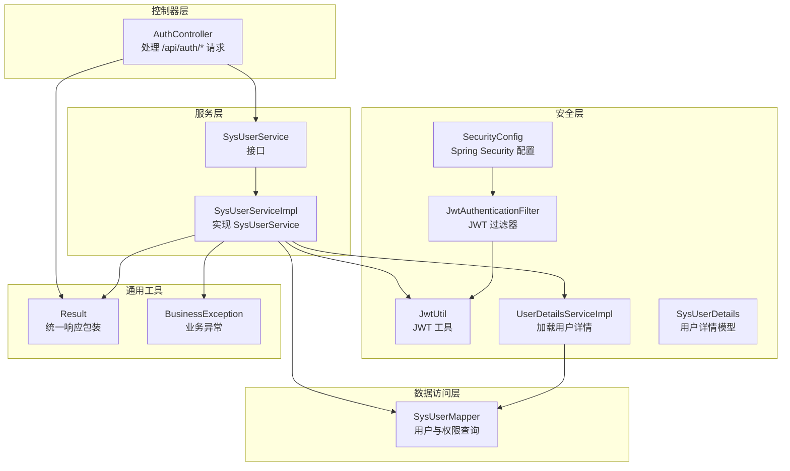
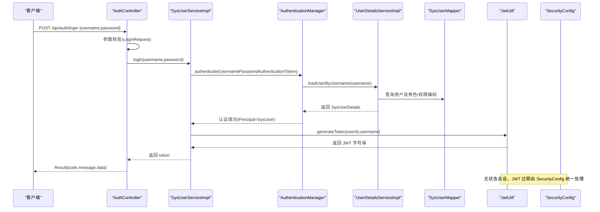
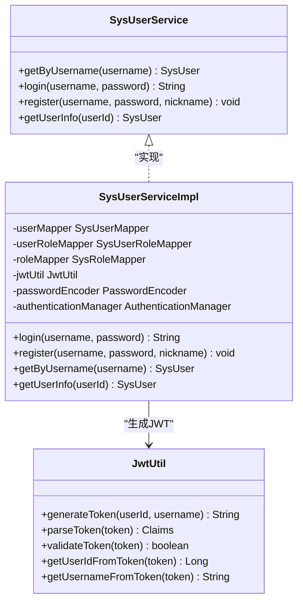
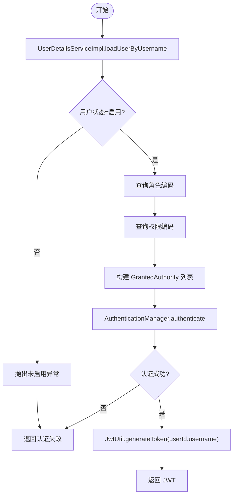
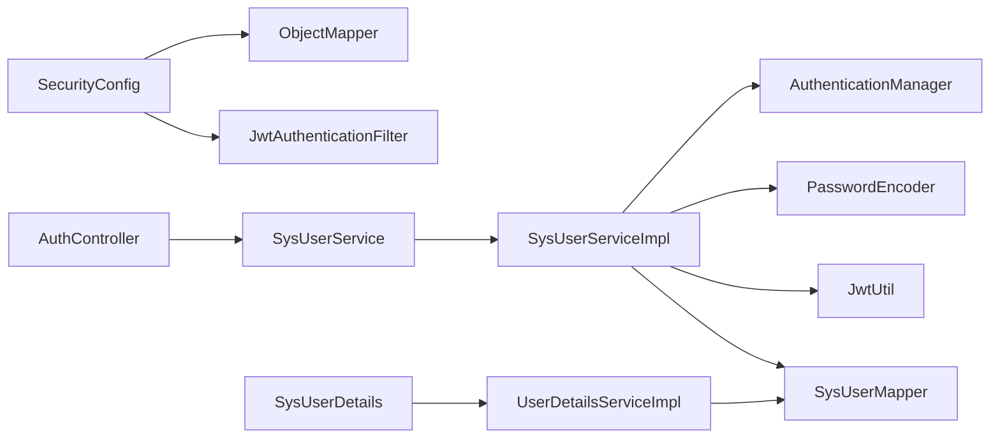
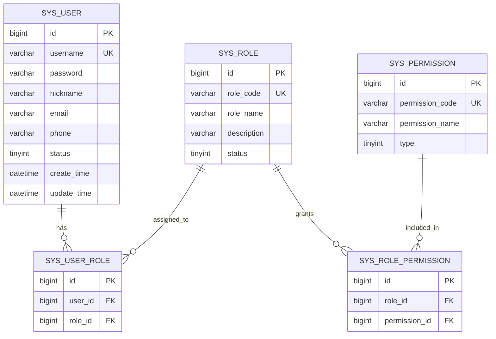

# 用户登录认证

<cite>
**本文档引用的文件**
- [AuthController.java](file://src/main/java/com/bookorder/controller/AuthController.java)
- [SysUserService.java](file://src/main/java/com/bookorder/service/SysUserService.java)
- [SysUserServiceImpl.java](file://src/main/java/com/bookorder/service/impl/SysUserServiceImpl.java)
- [LoginRequest.java](file://src/main/java/com/bookorder/dto/LoginRequest.java)
- [JwtUtil.java](file://src/main/java/com/bookorder/security/JwtUtil.java)
- [UserDetailsServiceImpl.java](file://src/main/java/com/bookorder/security/UserDetailsServiceImpl.java)
- [SysUserDetails.java](file://src/main/java/com/bookorder/security/SysUserDetails.java)
- [SysUserMapper.java](file://src/main/java/com/bookorder/mapper/SysUserMapper.java)
- [SecurityConfig.java](file://src/main/java/com/bookorder/config/SecurityConfig.java)
- [application.yml](file://src/main/resources/application.yml)
- [Result.java](file://src/main/java/com/bookorder/common/Result.java)
- [BusinessException.java](file://src/main/java/com/bookorder/common/BusinessException.java)
- [init.sql](file://sql/init.sql)
</cite>

## 目录
1. [简介](#简介)
2. [项目结构](#项目结构)
3. [核心组件](#核心组件)
4. [架构总览](#架构总览)
5. [详细组件分析](#详细组件分析)
6. [依赖关系分析](#依赖关系分析)
7. [性能考量](#性能考量)
8. [故障排查指南](#故障排查指南)
9. [结论](#结论)
10. [附录](#附录)

## 简介
本文件针对用户登录认证功能进行深入技术文档化，覆盖从请求进入、参数校验、身份确认、密码验证到JWT令牌签发的完整流程。重点解析：
- AuthController 中 `/api/auth/login` 接口的处理逻辑
- SysUserService 接口与 SysUserServiceImpl 的实现细节
- LoginRequest DTO 的参数验证规则与安全考虑
- 密码验证机制、用户身份确认过程与 JWT 令牌生成策略
- 完整的 API 调用示例（请求格式、响应结构、错误处理）
- 登录失败的常见原因与解决方案，以及安全最佳实践

## 项目结构
该模块采用分层架构：控制器层负责接收请求与返回统一结果；服务层封装业务逻辑；安全层集成 Spring Security 与 JWT；数据访问层通过 MyBatis-Plus 访问数据库。

图表来源
- [AuthController.java:18-58](file://src/main/java/com/bookorder/controller/AuthController.java#L18-L58)
- [SysUserService.java:6-15](file://src/main/java/com/bookorder/service/SysUserService.java#L6-L15)
- [SysUserServiceImpl.java:23-86](file://src/main/java/com/bookorder/service/impl/SysUserServiceImpl.java#L23-L86)
- [SecurityConfig.java:26-73](file://src/main/java/com/bookorder/config/SecurityConfig.java#L26-L73)
- [JwtUtil.java:14-61](file://src/main/java/com/bookorder/security/JwtUtil.java#L14-L61)
- [UserDetailsServiceImpl.java:18-49](file://src/main/java/com/bookorder/security/UserDetailsServiceImpl.java#L18-L49)
- [SysUserDetails.java:10-53](file://src/main/java/com/bookorder/security/SysUserDetails.java#L10-L53)
- [SysUserMapper.java:12-24](file://src/main/java/com/bookorder/mapper/SysUserMapper.java#L12-L24)
- [Result.java:3-40](file://src/main/java/com/bookorder/common/Result.java#L3-L40)
- [BusinessException.java:3-18](file://src/main/java/com/bookorder/common/BusinessException.java#L3-L18)

章节来源
- [AuthController.java:18-58](file://src/main/java/com/bookorder/controller/AuthController.java#L18-L58)
- [SysUserService.java:6-15](file://src/main/java/com/bookorder/service/SysUserService.java#L6-L15)
- [SysUserServiceImpl.java:23-86](file://src/main/java/com/bookorder/service/impl/SysUserServiceImpl.java#L23-L86)
- [SecurityConfig.java:26-73](file://src/main/java/com/bookorder/config/SecurityConfig.java#L26-L73)

## 核心组件
- AuthController：提供登录、注册、当前用户信息查询等接口，其中登录接口将请求转发给服务层并返回 JWT 令牌。
- SysUserService/SysUserServiceImpl：定义并实现登录、注册、用户信息查询等业务方法，包含密码加密、角色权限加载与 JWT 生成。
- LoginRequest：登录请求 DTO，使用注解进行非空校验。
- SecurityConfig：配置 Spring Security，开启无状态会话、放行登录/注册接口、设置认证失败与权限不足的统一响应。
- JwtUtil：基于 HMAC-SHA 的 JWT 工具类，支持签发、解析、校验与从令牌提取用户信息。
- UserDetailsServiceImpl/SysUserDetails：实现 Spring Security 的用户详情加载与权限映射，结合数据库中的角色与权限编码。
- SysUserMapper：提供用户角色与权限编码的查询能力。
- Result/BusinessException：统一响应结构与业务异常封装。

章节来源
- [AuthController.java:28-32](file://src/main/java/com/bookorder/controller/AuthController.java#L28-L32)
- [SysUserService.java:8-14](file://src/main/java/com/bookorder/service/SysUserService.java#L8-L14)
- [SysUserServiceImpl.java:49-55](file://src/main/java/com/bookorder/service/impl/SysUserServiceImpl.java#L49-L55)
- [LoginRequest.java:7-11](file://src/main/java/com/bookorder/dto/LoginRequest.java#L7-L11)
- [SecurityConfig.java:35-59](file://src/main/java/com/bookorder/config/SecurityConfig.java#L35-L59)
- [JwtUtil.java:27-35](file://src/main/java/com/bookorder/security/JwtUtil.java#L27-L35)
- [UserDetailsServiceImpl.java:24-47](file://src/main/java/com/bookorder/security/UserDetailsServiceImpl.java#L24-L47)
- [SysUserDetails.java:19-26](file://src/main/java/com/bookorder/security/SysUserDetails.java#L19-L26)
- [SysUserMapper.java:14-23](file://src/main/java/com/bookorder/mapper/SysUserMapper.java#L14-L23)
- [Result.java:18-35](file://src/main/java/com/bookorder/common/Result.java#L18-L35)
- [BusinessException.java:12-15](file://src/main/java/com/bookorder/common/BusinessException.java#L12-L15)

## 架构总览
下图展示登录流程从请求到响应的关键交互路径，包括参数校验、身份认证、令牌生成与统一响应封装。

图表来源
- [AuthController.java:28-32](file://src/main/java/com/bookorder/controller/AuthController.java#L28-L32)
- [SysUserServiceImpl.java:49-55](file://src/main/java/com/bookorder/service/impl/SysUserServiceImpl.java#L49-L55)
- [UserDetailsServiceImpl.java:24-47](file://src/main/java/com/bookorder/security/UserDetailsServiceImpl.java#L24-L47)
- [SysUserMapper.java:14-23](file://src/main/java/com/bookorder/mapper/SysUserMapper.java#L14-L23)
- [JwtUtil.java:27-35](file://src/main/java/com/bookorder/security/JwtUtil.java#L27-L35)
- [SecurityConfig.java:35-59](file://src/main/java/com/bookorder/config/SecurityConfig.java#L35-L59)

## 详细组件分析

### AuthController 登录接口
- 路径：`/api/auth/login`
- 方法：POST
- 输入：LoginRequest（用户名、密码）
- 处理：调用 SysUserService.login 获取 JWT 令牌，封装为 Result.success 返回
- 输出：Result<String>，data 为 JWT 字符串

章节来源
- [AuthController.java:28-32](file://src/main/java/com/bookorder/controller/AuthController.java#L28-L32)
- [Result.java:18-28](file://src/main/java/com/bookorder/common/Result.java#L18-L28)

### SysUserService 接口与 SysUserServiceImpl 实现
- 接口职责：
  - getByUsername：按用户名查询用户
  - login：执行认证并生成 JWT
  - register：注册新用户并绑定默认角色
  - getUserInfo：按 ID 查询用户基础信息
- 实现要点：
  - 使用 AuthenticationManager 执行用户名/密码认证
  - 从认证主体中提取用户 ID，调用 JwtUtil 生成令牌
  - 注册时对密码进行 BCrypt 编码，并默认绑定 READER 角色
  - 查询角色与权限编码用于后续授权

图表来源
- [SysUserService.java:6-15](file://src/main/java/com/bookorder/service/SysUserService.java#L6-L15)
- [SysUserServiceImpl.java:23-86](file://src/main/java/com/bookorder/service/impl/SysUserServiceImpl.java#L23-L86)
- [JwtUtil.java:14-61](file://src/main/java/com/bookorder/security/JwtUtil.java#L14-L61)

章节来源
- [SysUserService.java:8-14](file://src/main/java/com/bookorder/service/SysUserService.java#L8-L14)
- [SysUserServiceImpl.java:43-85](file://src/main/java/com/bookorder/service/impl/SysUserServiceImpl.java#L43-L85)

### LoginRequest DTO 参数验证
- 字段要求：
  - username：非空
  - password：非空
- 验证触发：在 AuthController.login 中使用 @Valid 对请求体进行校验
- 异常处理：校验失败将由全局异常处理机制返回统一错误结构

章节来源
- [LoginRequest.java:7-11](file://src/main/java/com/bookorder/dto/LoginRequest.java#L7-L11)
- [AuthController.java:29](file://src/main/java/com/bookorder/controller/AuthController.java#L29)

### 密码验证机制与用户身份确认
- 用户加载：UserDetailsServiceImpl.loadUserByUsername 按用户名查询用户，检查状态是否启用，并加载角色与权限编码
- 权限映射：将角色编码前缀 ROLE_，权限编码直接作为权限标识
- 认证流程：SysUserServiceImpl.login 使用 AuthenticationManager.authenticate 执行用户名/密码认证
- 成功后：从认证主体 Principal 中获取用户 ID，生成 JWT

图表来源
- [UserDetailsServiceImpl.java:24-47](file://src/main/java/com/bookorder/security/UserDetailsServiceImpl.java#L24-L47)
- [SysUserServiceImpl.java:51-54](file://src/main/java/com/bookorder/service/impl/SysUserServiceImpl.java#L51-L54)
- [JwtUtil.java:27-35](file://src/main/java/com/bookorder/security/JwtUtil.java#L27-L35)

章节来源
- [UserDetailsServiceImpl.java:24-47](file://src/main/java/com/bookorder/security/UserDetailsServiceImpl.java#L24-L47)
- [SysUserServiceImpl.java:51-54](file://src/main/java/com/bookorder/service/impl/SysUserServiceImpl.java#L51-L54)

### JWT 令牌生成策略
- 密钥与过期时间：从 application.yml 读取 jwt.secret 与 jwt.expiration
- 签发内容：包含 subject（用户名）、自定义 claim（userId）、签发时间与过期时间
- 校验策略：解析签名并判断过期时间
- 提取信息：从令牌 payload 中提取 userId 与 username

章节来源
- [application.yml:26-28](file://src/main/resources/application.yml#L26-L28)
- [JwtUtil.java:22-35](file://src/main/java/com/bookorder/security/JwtUtil.java#L22-L35)
- [JwtUtil.java:45-60](file://src/main/java/com/bookorder/security/JwtUtil.java#L45-L60)

### API 调用示例

- 登录接口
  - 请求
    - 方法：POST
    - 路径：/api/auth/login
    - 请求体：JSON
      - username：字符串，必填
      - password：字符串，必填
  - 响应
    - 成功：Result.success，data 为 JWT 字符串
    - 失败：Result.error，包含错误码与消息
  - 示例
    - 请求体示例：{"username":"admin","password":"admin123"}
    - 成功响应示例：{"code":200,"message":"success","data":"<JWT字符串>"}
    - 失败响应示例：{"code":401,"message":"未登录或token已过期"}

- 当前用户信息
  - 请求
    - 方法：GET
    - 路径：/api/auth/me
    - 请求头：Authorization: Bearer <JWT>
  - 响应
    - 成功：Result.success，data 为 UserInfoVO
      - 包含 id、username、nickname、email、phone、roles、permissions

章节来源
- [AuthController.java:28-32](file://src/main/java/com/bookorder/controller/AuthController.java#L28-L32)
- [AuthController.java:40-57](file://src/main/java/com/bookorder/controller/AuthController.java#L40-L57)
- [Result.java:18-35](file://src/main/java/com/bookorder/common/Result.java#L18-L35)
- [SecurityConfig.java:44-57](file://src/main/java/com/bookorder/config/SecurityConfig.java#L44-L57)

## 依赖关系分析
- 控制器依赖服务接口，服务实现依赖数据访问层、安全工具与密码编码器
- 安全配置依赖 JWT 过滤器与对象映射器，拦截器链中添加 JWT 过滤器
- 数据访问层通过 SQL 查询用户的角色与权限编码

图表来源
- [AuthController.java:22-26](file://src/main/java/com/bookorder/controller/AuthController.java#L22-L26)
- [SysUserServiceImpl.java:25-41](file://src/main/java/com/bookorder/service/impl/SysUserServiceImpl.java#L25-L41)
- [SecurityConfig.java:29-32](file://src/main/java/com/bookorder/config/SecurityConfig.java#L29-L32)
- [UserDetailsServiceImpl.java:20-21](file://src/main/java/com/bookorder/security/UserDetailsServiceImpl.java#L20-L21)

章节来源
- [AuthController.java:22-26](file://src/main/java/com/bookorder/controller/AuthController.java#L22-L26)
- [SysUserServiceImpl.java:25-41](file://src/main/java/com/bookorder/service/impl/SysUserServiceImpl.java#L25-L41)
- [SecurityConfig.java:29-32](file://src/main/java/com/bookorder/config/SecurityConfig.java#L29-L32)

## 性能考量
- 无状态会话：Spring Security 配置为 STATELESS，避免服务器端会话存储，降低内存占用与扩展复杂度
- 密码编码：使用 BCrypt，成本因子适中，兼顾安全性与性能
- 查询优化：角色与权限查询使用内连接与去重，建议确保相关字段建立索引
- JWT 解析：仅在需要时解析令牌，避免重复计算

## 故障排查指南
- 登录失败（401 未登录或 token 已过期）
  - 可能原因：缺少 Authorization 头、令牌无效或已过期、未正确配置 JWT 过滤器
  - 解决方案：确认请求头格式为 Bearer <JWT>，检查 application.yml 中 jwt.secret 与 jwt.expiration 是否正确，确认 SecurityConfig 已添加 JwtAuthenticationFilter
- 权限不足（403）
  - 可能原因：用户未绑定所需角色或权限
  - 解决方案：检查 sys_user_role 与 sys_role_permission 关联，确认角色与权限编码正确
- 用户名或密码错误
  - 可能原因：用户名不存在、密码不匹配、用户被禁用
  - 解决方案：确认用户名存在且状态为启用，检查密码是否经过 BCrypt 编码
- 参数校验失败
  - 可能原因：username 或 password 为空
  - 解决方案：确保请求体包含非空值

章节来源
- [SecurityConfig.java:44-57](file://src/main/java/com/bookorder/config/SecurityConfig.java#L44-L57)
- [UserDetailsServiceImpl.java:28-34](file://src/main/java/com/bookorder/security/UserDetailsServiceImpl.java#L28-L34)
- [LoginRequest.java:7-11](file://src/main/java/com/bookorder/dto/LoginRequest.java#L7-L11)
- [application.yml:26-28](file://src/main/resources/application.yml#L26-L28)

## 结论
该登录认证体系通过 Spring Security 与 JWT 实现了无状态的身份验证与授权控制。AuthController 将登录请求委托给 SysUserService，后者完成用户认证、权限加载与令牌生成，并通过统一响应结构对外输出。配合合理的参数校验、密码编码与安全配置，系统在保证安全性的同时具备良好的可维护性与扩展性。

## 附录

### 数据模型概览

图表来源
- [init.sql:11-70](file://sql/init.sql#L11-L70)

### 安全最佳实践
- 密钥管理：确保 jwt.secret 在生产环境安全存储，定期轮换
- 传输安全：使用 HTTPS，防止令牌在传输过程中被窃取
- 令牌策略：合理设置过期时间，必要时引入刷新令牌机制
- 权限最小化：基于角色与权限编码进行细粒度授权
- 日志与监控：记录认证事件与异常，便于审计与问题定位