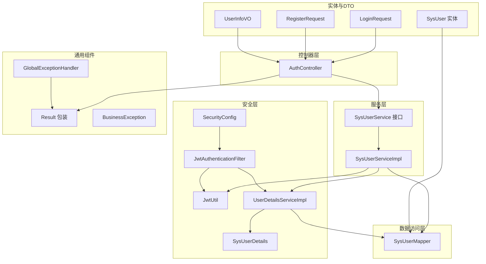
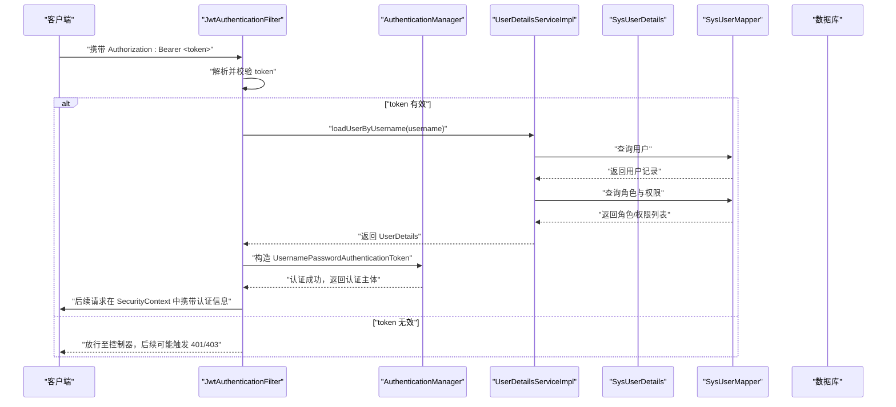
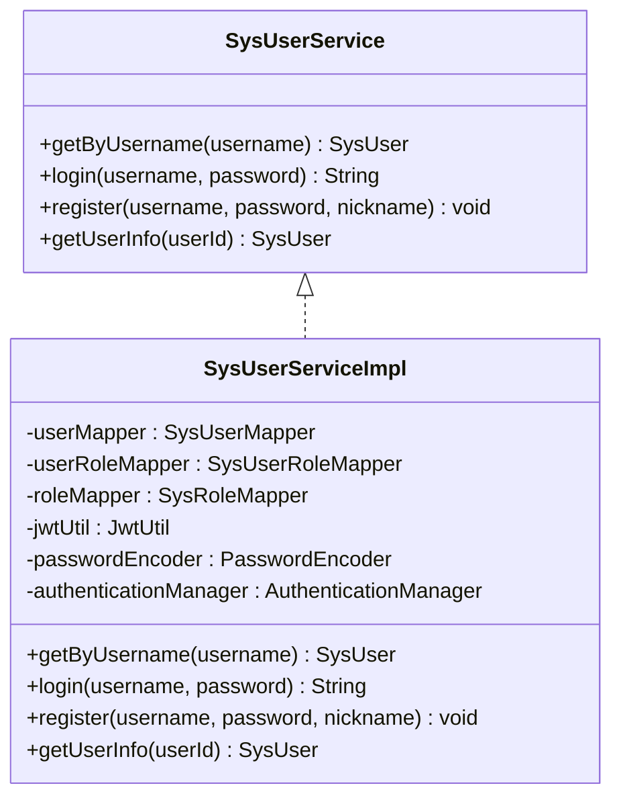
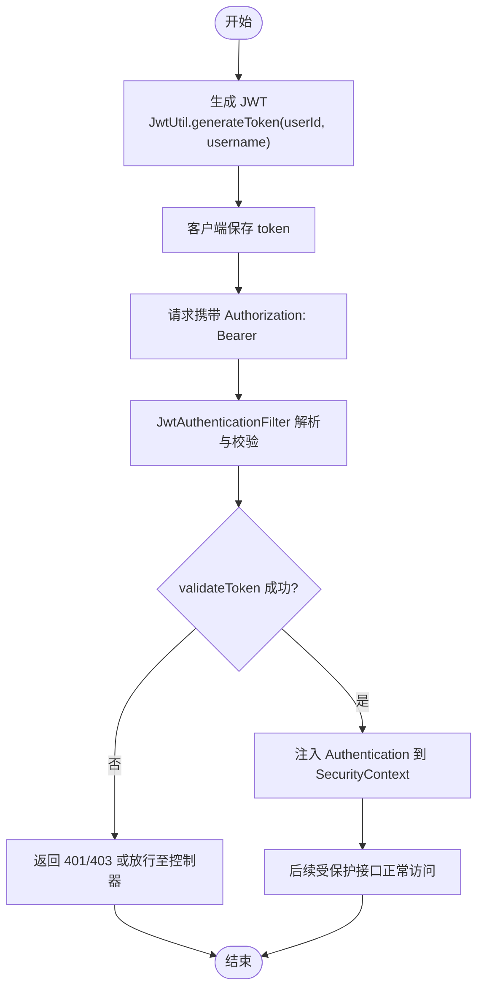
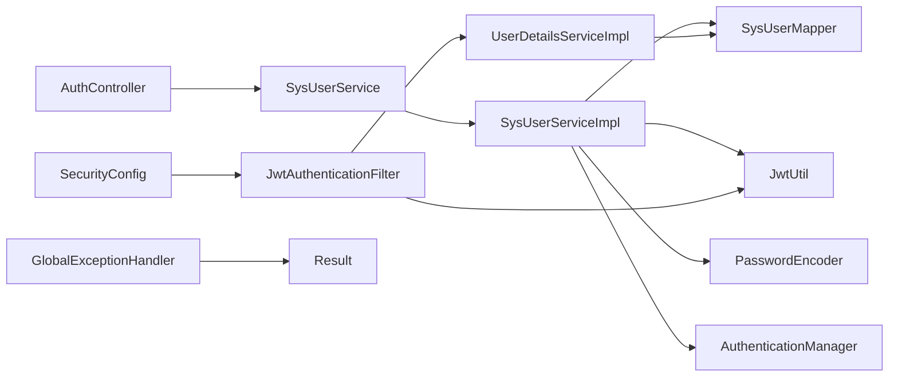

# 用户认证模块

<cite>
**本文引用的文件**
- [AuthController.java](file://src/main/java/com/bookorder/controller/AuthController.java)
- [SysUserService.java](file://src/main/java/com/bookorder/service/SysUserService.java)
- [SysUserServiceImpl.java](file://src/main/java/com/bookorder/service/impl/SysUserServiceImpl.java)
- [LoginRequest.java](file://src/main/java/com/bookorder/dto/LoginRequest.java)
- [RegisterRequest.java](file://src/main/java/com/bookorder/dto/RegisterRequest.java)
- [UserInfoVO.java](file://src/main/java/com/bookorder/dto/UserInfoVO.java)
- [JwtUtil.java](file://src/main/java/com/bookorder/security/JwtUtil.java)
- [SysUserDetails.java](file://src/main/java/com/bookorder/security/SysUserDetails.java)
- [UserDetailsServiceImpl.java](file://src/main/java/com/bookorder/security/UserDetailsServiceImpl.java)
- [JwtAuthenticationFilter.java](file://src/main/java/com/bookorder/security/JwtAuthenticationFilter.java)
- [SecurityConfig.java](file://src/main/java/com/bookorder/config/SecurityConfig.java)
- [GlobalExceptionHandler.java](file://src/main/java/com/bookorder/common/GlobalExceptionHandler.java)
- [BusinessException.java](file://src/main/java/com/bookorder/common/BusinessException.java)
- [Result.java](file://src/main/java/com/bookorder/common/Result.java)
- [SysUser.java](file://src/main/java/com/bookorder/entity/SysUser.java)
- [SysUserMapper.java](file://src/main/java/com/bookorder/mapper/SysUserMapper.java)
- [application.yml](file://src/main/resources/application.yml)
</cite>

## 目录
1. [简介](#简介)
2. [项目结构](#项目结构)
3. [核心组件](#核心组件)
4. [架构总览](#架构总览)
5. [详细组件分析](#详细组件分析)
6. [依赖分析](#依赖分析)
7. [性能考虑](#性能考虑)
8. [故障排查指南](#故障排查指南)
9. [结论](#结论)
10. [附录：API 接口文档](#附录api-接口文档)

## 简介
本文件面向“用户认证模块”的技术文档，覆盖用户登录、注册与个人信息查询的完整流程；深入解析 AuthController 的接口设计与业务逻辑；阐述 SysUserService 接口与 SysUserServiceImpl 的实现细节（含密码加密、用户验证、令牌生成）；说明 DTO 对象的设计目的与参数校验规则；提供完整的 API 文档（请求格式、响应结构、错误码）；解释 JWT 令牌的生成、验证与刷新策略，并给出可直接定位到源码的示例路径与使用场景。

## 项目结构
认证模块采用分层架构，主要由以下层次组成：
- 控制器层：对外暴露 REST 接口，负责接收请求与返回统一结果包装。
- 服务层：定义领域服务接口与实现，封装业务逻辑与事务控制。
- 安全层：集成 Spring Security，提供基于 JWT 的认证过滤、用户详情加载与安全配置。
- 数据访问层：MyBatis-Plus Mapper 负责角色与权限查询。
- 实体与 DTO：描述数据模型与传输对象。
- 配置与工具：Spring Security 配置、全局异常处理、统一响应包装、JWT 工具等。

图表来源
- [AuthController.java:18-58](file://src/main/java/com/bookorder/controller/AuthController.java#L18-L58)
- [SysUserService.java:6-15](file://src/main/java/com/bookorder/service/SysUserService.java#L6-L15)
- [SysUserServiceImpl.java:23-86](file://src/main/java/com/bookorder/service/impl/SysUserServiceImpl.java#L23-L86)
- [SecurityConfig.java:34-62](file://src/main/java/com/bookorder/config/SecurityConfig.java#L34-L62)
- [JwtAuthenticationFilter.java:19-55](file://src/main/java/com/bookorder/security/JwtAuthenticationFilter.java#L19-L55)
- [JwtUtil.java:14-61](file://src/main/java/com/bookorder/security/JwtUtil.java#L14-L61)
- [UserDetailsServiceImpl.java:17-49](file://src/main/java/com/bookorder/security/UserDetailsServiceImpl.java#L17-L49)
- [SysUserMapper.java:11-24](file://src/main/java/com/bookorder/mapper/SysUserMapper.java#L11-L24)
- [GlobalExceptionHandler.java:17-61](file://src/main/java/com/bookorder/common/GlobalExceptionHandler.java#L17-L61)
- [Result.java:3-40](file://src/main/java/com/bookorder/common/Result.java#L3-L40)
- [BusinessException.java:3-18](file://src/main/java/com/bookorder/common/BusinessException.java#L3-L18)
- [SysUser.java:6-47](file://src/main/java/com/bookorder/entity/SysUser.java#L6-L47)
- [LoginRequest.java:5-17](file://src/main/java/com/bookorder/dto/LoginRequest.java#L5-L17)
- [RegisterRequest.java:6-24](file://src/main/java/com/bookorder/dto/RegisterRequest.java#L6-L24)
- [UserInfoVO.java:5-29](file://src/main/java/com/bookorder/dto/UserInfoVO.java#L5-L29)

章节来源
- [AuthController.java:18-58](file://src/main/java/com/bookorder/controller/AuthController.java#L18-L58)
- [SysUserService.java:6-15](file://src/main/java/com/bookorder/service/SysUserService.java#L6-L15)
- [SysUserServiceImpl.java:23-86](file://src/main/java/com/bookorder/service/impl/SysUserServiceImpl.java#L23-L86)
- [SecurityConfig.java:34-62](file://src/main/java/com/bookorder/config/SecurityConfig.java#L34-L62)
- [JwtAuthenticationFilter.java:19-55](file://src/main/java/com/bookorder/security/JwtAuthenticationFilter.java#L19-L55)
- [JwtUtil.java:14-61](file://src/main/java/com/bookorder/security/JwtUtil.java#L14-L61)
- [UserDetailsServiceImpl.java:17-49](file://src/main/java/com/bookorder/security/UserDetailsServiceImpl.java#L17-L49)
- [SysUserMapper.java:11-24](file://src/main/java/com/bookorder/mapper/SysUserMapper.java#L11-L24)
- [GlobalExceptionHandler.java:17-61](file://src/main/java/com/bookorder/common/GlobalExceptionHandler.java#L17-L61)
- [Result.java:3-40](file://src/main/java/com/bookorder/common/Result.java#L3-L40)
- [BusinessException.java:3-18](file://src/main/java/com/bookorder/common/BusinessException.java#L3-L18)
- [SysUser.java:6-47](file://src/main/java/com/bookorder/entity/SysUser.java#L6-L47)
- [LoginRequest.java:5-17](file://src/main/java/com/bookorder/dto/LoginRequest.java#L5-L17)
- [RegisterRequest.java:6-24](file://src/main/java/com/bookorder/dto/RegisterRequest.java#L6-L24)
- [UserInfoVO.java:5-29](file://src/main/java/com/bookorder/dto/UserInfoVO.java#L5-L29)

## 核心组件
- AuthController：提供 /api/auth/login 登录、/api/auth/register 注册、/api/auth/me 获取当前用户信息三个端点，统一返回 Result 包装。
- SysUserService/SysUserServiceImpl：定义并实现按用户名查询、登录认证、注册（含默认角色绑定）、获取用户信息等方法。
- DTO 层：LoginRequest、RegisterRequest、UserInfoVO，分别用于登录请求、注册请求与用户信息返回值对象。
- 安全层：SecurityConfig 配置无状态会话、放行登录/注册、添加 JWT 过滤器；JwtUtil 提供 JWT 生成与校验；JwtAuthenticationFilter 解析 Authorization 头中的 Bearer Token 并注入认证上下文；UserDetailsServiceImpl 加载用户详情与权限；SysUserDetails 实现 UserDetails。
- 统一响应与异常：Result 封装统一响应；GlobalExceptionHandler 捕获业务异常、参数校验异常、凭据错误、权限不足等并返回对应状态码与消息；BusinessException 支持自定义业务错误码。

章节来源
- [AuthController.java:28-57](file://src/main/java/com/bookorder/controller/AuthController.java#L28-L57)
- [SysUserService.java:8-14](file://src/main/java/com/bookorder/service/SysUserService.java#L8-L14)
- [SysUserServiceImpl.java:43-85](file://src/main/java/com/bookorder/service/impl/SysUserServiceImpl.java#L43-L85)
- [LoginRequest.java:7-11](file://src/main/java/com/bookorder/dto/LoginRequest.java#L7-L11)
- [RegisterRequest.java:8-16](file://src/main/java/com/bookorder/dto/RegisterRequest.java#L8-L16)
- [UserInfoVO.java:7-13](file://src/main/java/com/bookorder/dto/UserInfoVO.java#L7-L13)
- [SecurityConfig.java:34-62](file://src/main/java/com/bookorder/config/SecurityConfig.java#L34-L62)
- [JwtUtil.java:27-60](file://src/main/java/com/bookorder/security/JwtUtil.java#L27-L60)
- [JwtAuthenticationFilter.java:28-46](file://src/main/java/com/bookorder/security/JwtAuthenticationFilter.java#L28-L46)
- [UserDetailsServiceImpl.java:24-48](file://src/main/java/com/bookorder/security/UserDetailsServiceImpl.java#L24-L48)
- [SysUserDetails.java:19-52](file://src/main/java/com/bookorder/security/SysUserDetails.java#L19-L52)
- [Result.java:18-35](file://src/main/java/com/bookorder/common/Result.java#L18-L35)
- [GlobalExceptionHandler.java:22-60](file://src/main/java/com/bookorder/common/GlobalExceptionHandler.java#L22-L60)
- [BusinessException.java:12-15](file://src/main/java/com/bookorder/common/BusinessException.java#L12-L15)

## 架构总览
下图展示从客户端到数据库的认证与授权全流程，包括请求进入、JWT 过滤器解析、认证管理器验证、用户详情加载、权限装配以及数据库查询。

图表来源
- [JwtAuthenticationFilter.java:28-46](file://src/main/java/com/bookorder/security/JwtAuthenticationFilter.java#L28-L46)
- [UserDetailsServiceImpl.java:24-48](file://src/main/java/com/bookorder/security/UserDetailsServiceImpl.java#L24-L48)
- [SysUserMapper.java:14-23](file://src/main/java/com/bookorder/mapper/SysUserMapper.java#L14-L23)
- [SysUserDetails.java:19-52](file://src/main/java/com/bookorder/security/SysUserDetails.java#L19-L52)
- [SecurityConfig.java:34-62](file://src/main/java/com/bookorder/config/SecurityConfig.java#L34-L62)

## 详细组件分析

### AuthController 接口设计与业务逻辑
- 登录接口
  - 路径：POST /api/auth/login
  - 请求体：LoginRequest（包含用户名与密码）
  - 响应：Result<String>，返回 JWT 令牌
  - 业务逻辑：调用 SysUserService.login(username, password)，内部通过 AuthenticationManager 认证并通过 JwtUtil 生成令牌
- 注册接口
  - 路径：POST /api/auth/register
  - 请求体：RegisterRequest（用户名、密码、昵称）
  - 响应：Result<Void>，注册成功后自动绑定默认角色（READER）
  - 业务逻辑：SysUserServiceImpl.register(username, password, nickname)，先检查用户名是否存在，存在则抛出业务异常；否则使用 PasswordEncoder 加密密码，插入用户并绑定默认角色
- 个人信息接口
  - 路径：GET /api/auth/me
  - 认证：通过 @AuthenticationPrincipal 注入 SysUserDetails
  - 响应：Result<UserInfoVO>，包含用户基本信息、邮箱、电话、角色与权限列表
  - 业务逻辑：组装 UserInfoVO，查询用户扩展信息与角色/权限码集合

章节来源
- [AuthController.java:28-57](file://src/main/java/com/bookorder/controller/AuthController.java#L28-L57)
- [LoginRequest.java:7-11](file://src/main/java/com/bookorder/dto/LoginRequest.java#L7-L11)
- [RegisterRequest.java:8-16](file://src/main/java/com/bookorder/dto/RegisterRequest.java#L8-L16)
- [UserInfoVO.java:7-13](file://src/main/java/com/bookorder/dto/UserInfoVO.java#L7-L13)
- [SysUserService.java:10-12](file://src/main/java/com/bookorder/service/SysUserService.java#L10-L12)
- [SysUserServiceImpl.java:49-55](file://src/main/java/com/bookorder/service/impl/SysUserServiceImpl.java#L49-L55)
- [SysUserServiceImpl.java:58-80](file://src/main/java/com/bookorder/service/impl/SysUserServiceImpl.java#L58-L80)
- [SysUserServiceImpl.java:82-85](file://src/main/java/com/bookorder/service/impl/SysUserServiceImpl.java#L82-L85)

### SysUserService 接口与 SysUserServiceImpl 实现
- 接口职责
  - getByUsername：按用户名查询用户
  - login：执行认证并生成 JWT
  - register：注册新用户并绑定默认角色
  - getUserInfo：按用户 ID 查询用户信息
- 实现要点
  - 认证流程：使用 AuthenticationManager.authenticate + UsernamePasswordAuthenticationToken，成功后从认证主体中提取用户 ID，再由 JwtUtil 生成 token
  - 密码加密：使用 BCryptPasswordEncoder 对明文密码进行编码存储
  - 默认角色绑定：注册时查询角色表，若存在默认角色（READER），则向用户角色关联表写入一条记录
  - 参数校验：注册时对用户名长度与密码长度进行约束，避免脏数据入库

图表来源
- [SysUserService.java:6-15](file://src/main/java/com/bookorder/service/SysUserService.java#L6-L15)
- [SysUserServiceImpl.java:23-86](file://src/main/java/com/bookorder/service/impl/SysUserServiceImpl.java#L23-L86)

章节来源
- [SysUserService.java:8-14](file://src/main/java/com/bookorder/service/SysUserService.java#L8-L14)
- [SysUserServiceImpl.java:43-85](file://src/main/java/com/bookorder/service/impl/SysUserServiceImpl.java#L43-L85)

### DTO 设计与参数验证规则
- LoginRequest
  - 字段：username、password
  - 校验：均不允许为空
- RegisterRequest
  - 字段：username、password、nickname
  - 校验：username 长度 3-50；password 长度 6-50；均不允许为空
- UserInfoVO
  - 字段：id、username、nickname、email、phone、roles、permissions
  - 用途：作为 /api/auth/me 的返回载体，聚合用户基础信息与权限/角色码

章节来源
- [LoginRequest.java:7-11](file://src/main/java/com/bookorder/dto/LoginRequest.java#L7-L11)
- [RegisterRequest.java:8-16](file://src/main/java/com/bookorder/dto/RegisterRequest.java#L8-L16)
- [UserInfoVO.java:7-13](file://src/main/java/com/bookorder/dto/UserInfoVO.java#L7-L13)

### JWT 令牌生成、验证与刷新策略
- 生成
  - JwtUtil.generateToken(userId, username)：以用户名为 subject，附加 userId 声明，设置签发时间与过期时间，使用 Base64 解码后的密钥签名
- 校验
  - JwtUtil.validateToken(token)：解析并验证签名与过期时间
  - JwtUtil.parseToken(token)：解析载荷 Claims
- 刷新
  - 当前实现未提供专用刷新接口；建议在客户端侧于令牌即将过期时重新发起登录流程换取新令牌
- 过期与禁用处理
  - SecurityConfig 在未登录或 token 过期时返回 401；权限不足返回 403
  - UserDetailsServiceImpl 在用户被禁用时拒绝加载

图表来源
- [JwtUtil.java:27-60](file://src/main/java/com/bookorder/security/JwtUtil.java#L27-L60)
- [JwtAuthenticationFilter.java:28-46](file://src/main/java/com/bookorder/security/JwtAuthenticationFilter.java#L28-L46)
- [SecurityConfig.java:44-58](file://src/main/java/com/bookorder/config/SecurityConfig.java#L44-L58)

章节来源
- [JwtUtil.java:16-25](file://src/main/java/com/bookorder/security/JwtUtil.java#L16-L25)
- [JwtUtil.java:27-60](file://src/main/java/com/bookorder/security/JwtUtil.java#L27-L60)
- [JwtAuthenticationFilter.java:28-46](file://src/main/java/com/bookorder/security/JwtAuthenticationFilter.java#L28-L46)
- [SecurityConfig.java:34-62](file://src/main/java/com/bookorder/config/SecurityConfig.java#L34-L62)

### 用户详情加载与权限装配
- UserDetailsServiceImpl.loadUserByUsername
  - 根据用户名查询用户，不存在或状态非启用则抛出异常
  - 查询用户的角色码与权限码，拼装为 GrantedAuthority 列表（角色前缀 ROLE_ 与权限码）
  - 返回 SysUserDetails，其中 isEnabled 取决于用户状态
- SysUserDetails
  - 实现 UserDetails，提供 id、username、password、nickname、authorities 等字段
  - isEnabled(status==1) 决定账户是否可用

章节来源
- [UserDetailsServiceImpl.java:24-48](file://src/main/java/com/bookorder/security/UserDetailsServiceImpl.java#L24-L48)
- [SysUserDetails.java:19-52](file://src/main/java/com/bookorder/security/SysUserDetails.java#L19-L52)

### 数据访问与角色/权限查询
- SysUserMapper 提供两个 SQL 查询：
  - selectRoleCodesByUserId：查询用户的角色码列表
  - selectPermissionCodesByUserId：查询用户的权限码列表（去重）

章节来源
- [SysUserMapper.java:14-23](file://src/main/java/com/bookorder/mapper/SysUserMapper.java#L14-L23)

### 统一响应与异常处理
- Result
  - success()/error() 提供静态工厂方法，统一封装 code、message、data
- GlobalExceptionHandler
  - 捕获业务异常（BusinessException）、凭据错误（BadCredentialsException）、权限不足（AccessDeniedException）、参数校验异常（MethodArgumentNotValidException/ConstraintViolationException）并返回对应状态码与消息
- BusinessException
  - 支持自定义错误码与消息

章节来源
- [Result.java:18-35](file://src/main/java/com/bookorder/common/Result.java#L18-L35)
- [GlobalExceptionHandler.java:22-60](file://src/main/java/com/bookorder/common/GlobalExceptionHandler.java#L22-L60)
- [BusinessException.java:12-15](file://src/main/java/com/bookorder/common/BusinessException.java#L12-L15)

## 依赖分析
- 控制器依赖服务接口与 Mapper；服务实现依赖 Mapper、JwtUtil、PasswordEncoder、AuthenticationManager
- 安全配置依赖 JwtAuthenticationFilter、ObjectMapper；JwtAuthenticationFilter 依赖 JwtUtil 与 UserDetailsService
- DTO 仅用于请求/响应映射，不参与业务逻辑
- 异常处理与统一响应贯穿各层

图表来源
- [AuthController.java:22-26](file://src/main/java/com/bookorder/controller/AuthController.java#L22-L26)
- [SysUserServiceImpl.java:25-41](file://src/main/java/com/bookorder/service/impl/SysUserServiceImpl.java#L25-L41)
- [SecurityConfig.java:29-32](file://src/main/java/com/bookorder/config/SecurityConfig.java#L29-L32)
- [JwtAuthenticationFilter.java:22-26](file://src/main/java/com/bookorder/security/JwtAuthenticationFilter.java#L22-L26)
- [UserDetailsServiceImpl.java:20-21](file://src/main/java/com/bookorder/security/UserDetailsServiceImpl.java#L20-L21)
- [SysUserMapper.java:11-24](file://src/main/java/com/bookorder/mapper/SysUserMapper.java#L11-L24)
- [GlobalExceptionHandler.java:17-61](file://src/main/java/com/bookorder/common/GlobalExceptionHandler.java#L17-L61)
- [Result.java:3-40](file://src/main/java/com/bookorder/common/Result.java#L3-L40)

章节来源
- [AuthController.java:22-26](file://src/main/java/com/bookorder/controller/AuthController.java#L22-L26)
- [SysUserServiceImpl.java:25-41](file://src/main/java/com/bookorder/service/impl/SysUserServiceImpl.java#L25-L41)
- [SecurityConfig.java:29-32](file://src/main/java/com/bookorder/config/SecurityConfig.java#L29-L32)
- [JwtAuthenticationFilter.java:22-26](file://src/main/java/com/bookorder/security/JwtAuthenticationFilter.java#L22-L26)
- [UserDetailsServiceImpl.java:20-21](file://src/main/java/com/bookorder/security/UserDetailsServiceImpl.java#L20-L21)
- [SysUserMapper.java:11-24](file://src/main/java/com/bookorder/mapper/SysUserMapper.java#L11-L24)
- [GlobalExceptionHandler.java:17-61](file://src/main/java/com/bookorder/common/GlobalExceptionHandler.java#L17-L61)
- [Result.java:3-40](file://src/main/java/com/bookorder/common/Result.java#L3-L40)

## 性能考虑
- 密码加密：使用 BCryptPasswordEncoder，成本较高但安全性高，建议在注册与修改密码时使用
- 令牌有效期：配置项 jwt.expiration 控制过期时间，默认一天；可根据业务调整
- 查询优化：角色与权限查询为单次 SQL，建议在用户角色/权限基数较小的情况下保持现状；如规模扩大，可考虑缓存策略
- 事务边界：注册流程使用 @Transactional，确保用户与默认角色绑定的一致性

[本节为通用指导，无需列出章节来源]

## 故障排查指南
- 400 参数错误
  - 触发条件：用户名/密码为空或长度不合法；参数校验失败
  - 处理方式：检查 DTO 校验注解与前端传参
- 401 未登录或 token 过期
  - 触发条件：Authorization 头缺失或无效；SecurityConfig 的认证入口返回 401
  - 处理方式：重新登录获取新 token
- 403 权限不足
  - 触发条件：访问受保护资源但缺少所需权限
  - 处理方式：确认用户角色与权限码是否正确
- 409 用户名已存在
  - 触发条件：注册时用户名重复
  - 处理方式：提示用户更换用户名

章节来源
- [GlobalExceptionHandler.java:40-53](file://src/main/java/com/bookorder/common/GlobalExceptionHandler.java#L40-L53)
- [GlobalExceptionHandler.java:28-32](file://src/main/java/com/bookorder/common/GlobalExceptionHandler.java#L28-L32)
- [GlobalExceptionHandler.java:34-38](file://src/main/java/com/bookorder/common/GlobalExceptionHandler.java#L34-L38)
- [SysUserServiceImpl.java:60-62](file://src/main/java/com/bookorder/service/impl/SysUserServiceImpl.java#L60-L62)
- [SecurityConfig.java:44-58](file://src/main/java/com/bookorder/config/SecurityConfig.java#L44-L58)

## 结论
该认证模块以 Spring Security + JWT 为核心，结合 DTO 参数校验、统一响应与异常处理，实现了登录、注册与个人信息查询的完整闭环。服务层通过密码加密与默认角色绑定保障了安全与可用性；安全配置与过滤器确保了无状态认证与细粒度权限控制。建议后续补充令牌刷新机制与用户状态变更的审计日志。

[本节为总结性内容，无需列出章节来源]

## 附录：API 接口文档

- 登录
  - 方法与路径：POST /api/auth/login
  - 请求体：LoginRequest
    - username：字符串，必填
    - password：字符串，必填
  - 响应体：Result<String>
    - code：200 表示成功
    - message："success"
    - data：JWT 令牌字符串
  - 错误码
    - 400：用户名或密码为空
    - 401：用户名或密码错误
- 注册
  - 方法与路径：POST /api/auth/register
  - 请求体：RegisterRequest
    - username：字符串，3-50 字符，必填
    - password：字符串，6-50 字符，必填
    - nickname：字符串，可选
  - 响应体：Result<Void>
    - code：200 表示成功
    - message："success"
  - 错误码
    - 400：用户名已存在
    - 400：参数校验失败
- 获取当前用户信息
  - 方法与路径：GET /api/auth/me
  - 认证：需要有效 JWT
  - 响应体：Result<UserInfoVO>
    - code：200 表示成功
    - message："success"
    - data：
      - id：Long
      - username：字符串
      - nickname：字符串
      - email：字符串
      - phone：字符串
      - roles：字符串数组（角色码）
      - permissions：字符串数组（权限码）
  - 错误码
    - 401：未登录或 token 过期
    - 403：权限不足

章节来源
- [AuthController.java:28-57](file://src/main/java/com/bookorder/controller/AuthController.java#L28-L57)
- [LoginRequest.java:7-11](file://src/main/java/com/bookorder/dto/LoginRequest.java#L7-L11)
- [RegisterRequest.java:8-16](file://src/main/java/com/bookorder/dto/RegisterRequest.java#L8-L16)
- [UserInfoVO.java:7-13](file://src/main/java/com/bookorder/dto/UserInfoVO.java#L7-L13)
- [Result.java:18-35](file://src/main/java/com/bookorder/common/Result.java#L18-L35)
- [SecurityConfig.java:44-58](file://src/main/java/com/bookorder/config/SecurityConfig.java#L44-L58)