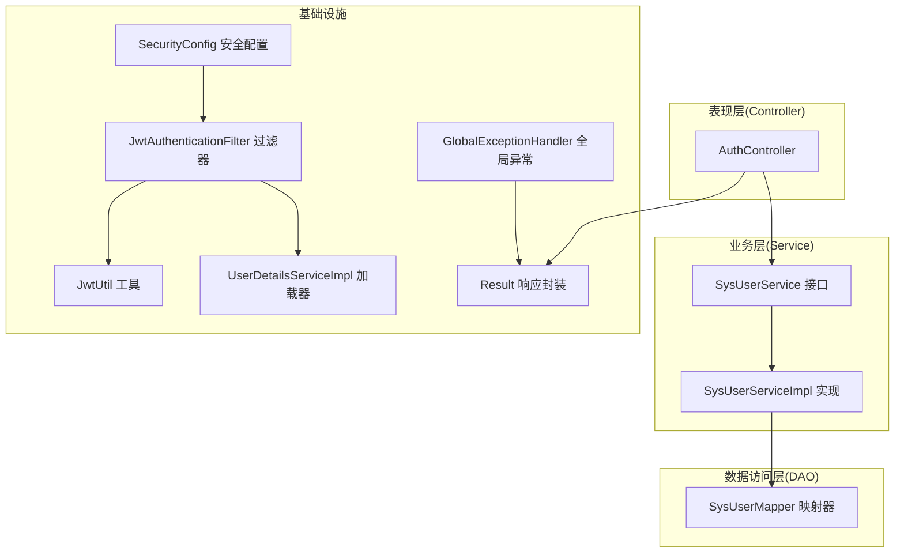
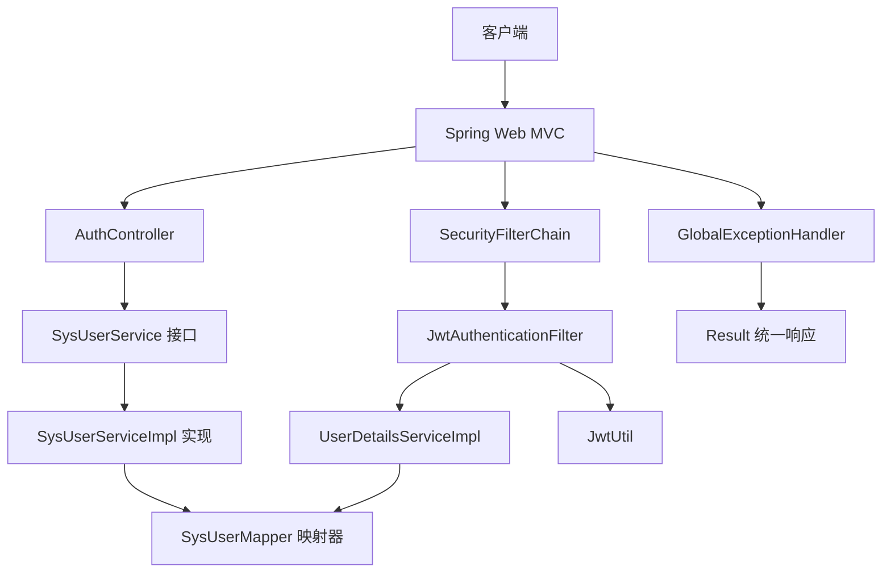
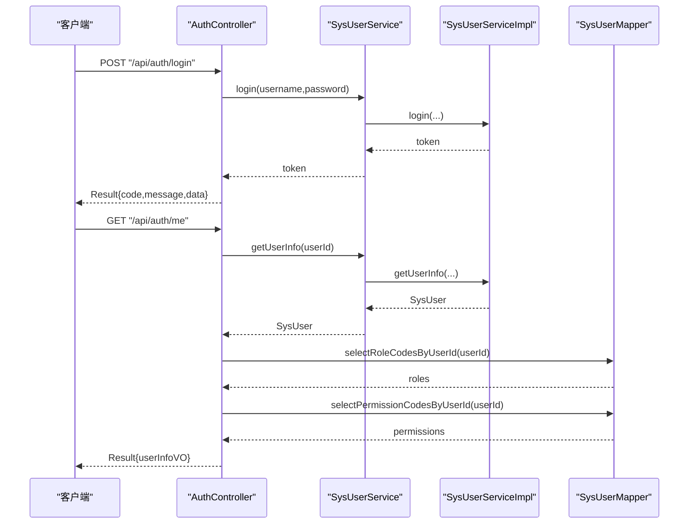
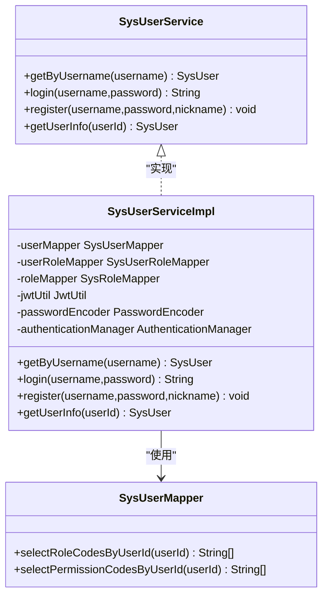
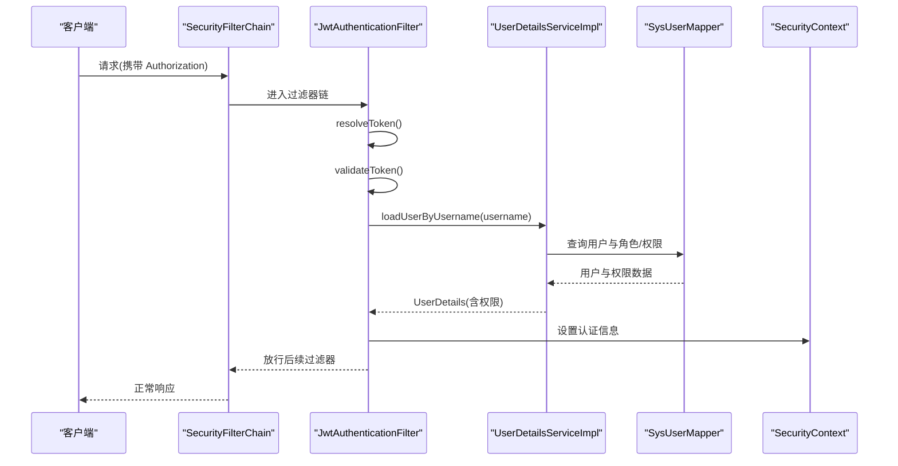
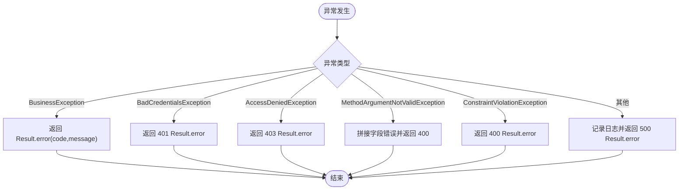
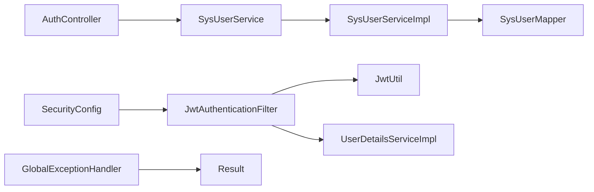

# 分层架构设计

<cite>
**本文引用的文件**
- [BookOrderApplication.java](file://src/main/java/com/bookorder/BookOrderApplication.java)
- [AuthController.java](file://src/main/java/com/bookorder/controller/AuthController.java)
- [SysUserService.java](file://src/main/java/com/bookorder/service/SysUserService.java)
- [SysUserServiceImpl.java](file://src/main/java/com/bookorder/service/impl/SysUserServiceImpl.java)
- [SysUserMapper.java](file://src/main/java/com/bookorder/mapper/SysUserMapper.java)
- [Result.java](file://src/main/java/com/bookorder/common/Result.java)
- [BusinessException.java](file://src/main/java/com/bookorder/common/BusinessException.java)
- [GlobalExceptionHandler.java](file://src/main/java/com/bookorder/common/GlobalExceptionHandler.java)
- [LoginRequest.java](file://src/main/java/com/bookorder/dto/LoginRequest.java)
- [RegisterRequest.java](file://src/main/java/com/bookorder/dto/RegisterRequest.java)
- [JwtUtil.java](file://src/main/java/com/bookorder/security/JwtUtil.java)
- [UserDetailsServiceImpl.java](file://src/main/java/com/bookorder/security/UserDetailsServiceImpl.java)
- [JwtAuthenticationFilter.java](file://src/main/java/com/bookorder/security/JwtAuthenticationFilter.java)
- [SecurityConfig.java](file://src/main/java/com/bookorder/config/SecurityConfig.java)
- [SysUser.java](file://src/main/java/com/bookorder/entity/SysUser.java)
- [application.yml](file://src/main/resources/application.yml)
- [pom.xml](file://pom.xml)
</cite>

## 目录
1. [简介](#简介)
2. [项目结构](#项目结构)
3. [核心组件](#核心组件)
4. [架构总览](#架构总览)
5. [详细组件分析](#详细组件分析)
6. [依赖分析](#依赖分析)
7. [性能考虑](#性能考虑)
8. [故障排查指南](#故障排查指南)
9. [结论](#结论)
10. [附录](#附录)

## 简介
本项目为一个基于 Spring Boot 的图书订单系统，采用经典的 MVC 分层架构：Controller 层负责请求接入与响应封装；Service 层封装业务逻辑并协调数据访问；DAO 层通过 MyBatis-Plus 提供数据持久化能力。系统同时集成 Spring Security 与 JWT 实现认证鉴权，统一异常处理与返回格式，形成清晰的职责边界与可维护的分层结构。

## 项目结构
项目采用按层次与功能混合的组织方式：
- controller：对外暴露 REST 接口，接收参数并返回 Result 统一响应体
- service：定义业务接口与实现，封装事务与业务规则
- mapper：MyBatis-Plus 映射器，提供基础 CRUD 与自定义 SQL 查询
- entity：MyBatis-Plus 实体类，映射数据库表结构
- dto：输入输出数据传输对象，承载校验与视图模型
- common：通用工具（Result、异常）与全局异常处理器
- security：安全过滤器、用户详情加载、JWT 工具与安全配置
- config：Spring 安全与 MyBatis-Plus 配置
- resources：应用配置与初始化脚本
- 根目录：构建脚本与依赖声明

图表来源
- [AuthController.java:18-58](file://src/main/java/com/bookorder/controller/AuthController.java#L18-L58)
- [SysUserService.java:6-15](file://src/main/java/com/bookorder/service/SysUserService.java#L6-L15)
- [SysUserServiceImpl.java:22-86](file://src/main/java/com/bookorder/service/impl/SysUserServiceImpl.java#L22-L86)
- [SysUserMapper.java:11-24](file://src/main/java/com/bookorder/mapper/SysUserMapper.java#L11-L24)
- [SecurityConfig.java:23-73](file://src/main/java/com/bookorder/config/SecurityConfig.java#L23-L73)
- [JwtAuthenticationFilter.java:19-55](file://src/main/java/com/bookorder/security/JwtAuthenticationFilter.java#L19-L55)
- [JwtUtil.java:13-61](file://src/main/java/com/bookorder/security/JwtUtil.java#L13-L61)
- [UserDetailsServiceImpl.java:17-49](file://src/main/java/com/bookorder/security/UserDetailsServiceImpl.java#L17-L49)
- [Result.java:3-40](file://src/main/java/com/bookorder/common/Result.java#L3-L40)
- [GlobalExceptionHandler.java:17-61](file://src/main/java/com/bookorder/common/GlobalExceptionHandler.java#L17-L61)

章节来源
- [BookOrderApplication.java:7-14](file://src/main/java/com/bookorder/BookOrderApplication.java#L7-L14)
- [application.yml:1-33](file://src/main/resources/application.yml#L1-L33)
- [pom.xml:26-83](file://pom.xml#L26-L83)

## 核心组件
- 控制器层
  - AuthController：提供登录、注册、查询当前用户信息等接口，使用 Result 封装响应，依赖 SysUserService 与 SysUserMapper
- 业务层
  - SysUserService：定义用户相关业务方法（登录、注册、查询信息）
  - SysUserServiceImpl：实现业务逻辑，包含事务控制、密码加密、角色默认绑定、认证与令牌签发
- 数据访问层
  - SysUserMapper：继承 MyBatis-Plus 基类，提供自定义 SQL 查询用户的角色与权限编码
- 安全与配置
  - SecurityConfig：配置无状态会话、放行登录/注册、统一异常输出 JSON
  - JwtAuthenticationFilter：从请求头解析 JWT 并写入安全上下文
  - JwtUtil：生成与解析 JWT、校验有效期
  - UserDetailsServiceImpl：加载用户详情与权限集合
- 通用工具
  - Result：统一封装响应码、消息与数据
  - BusinessException：业务异常，配合 GlobalExceptionHandler 统一处理

章节来源
- [AuthController.java:28-57](file://src/main/java/com/bookorder/controller/AuthController.java#L28-L57)
- [SysUserService.java:6-15](file://src/main/java/com/bookorder/service/SysUserService.java#L6-L15)
- [SysUserServiceImpl.java:43-85](file://src/main/java/com/bookorder/service/impl/SysUserServiceImpl.java#L43-L85)
- [SysUserMapper.java:11-24](file://src/main/java/com/bookorder/mapper/SysUserMapper.java#L11-L24)
- [SecurityConfig.java:34-62](file://src/main/java/com/bookorder/config/SecurityConfig.java#L34-L62)
- [JwtAuthenticationFilter.java:28-46](file://src/main/java/com/bookorder/security/JwtAuthenticationFilter.java#L28-L46)
- [JwtUtil.java:27-60](file://src/main/java/com/bookorder/security/JwtUtil.java#L27-L60)
- [UserDetailsServiceImpl.java:23-48](file://src/main/java/com/bookorder/security/UserDetailsServiceImpl.java#L23-L48)
- [Result.java:18-39](file://src/main/java/com/bookorder/common/Result.java#L18-L39)
- [BusinessException.java:3-18](file://src/main/java/com/bookorder/common/BusinessException.java#L3-L18)
- [GlobalExceptionHandler.java:22-60](file://src/main/java/com/bookorder/common/GlobalExceptionHandler.java#L22-L60)

## 架构总览
系统以 Spring Boot 启动，扫描 Mapper 包，启用 MyBatis-Plus 与 Spring Security。请求进入控制器后，由业务层执行业务规则并调用 DAO 层进行数据操作；安全层在过滤器中完成 JWT 解析与用户认证，异常在全局处理器中统一转换为 Result 格式返回。

图表来源
- [BookOrderApplication.java:7-14](file://src/main/java/com/bookorder/BookOrderApplication.java#L7-L14)
- [AuthController.java:28-57](file://src/main/java/com/bookorder/controller/AuthController.java#L28-L57)
- [SysUserService.java:6-15](file://src/main/java/com/bookorder/service/SysUserService.java#L6-L15)
- [SysUserServiceImpl.java:22-86](file://src/main/java/com/bookorder/service/impl/SysUserServiceImpl.java#L22-L86)
- [SysUserMapper.java:11-24](file://src/main/java/com/bookorder/mapper/SysUserMapper.java#L11-L24)
- [SecurityConfig.java:34-62](file://src/main/java/com/bookorder/config/SecurityConfig.java#L34-L62)
- [JwtAuthenticationFilter.java:28-46](file://src/main/java/com/bookorder/security/JwtAuthenticationFilter.java#L28-L46)
- [JwtUtil.java:27-60](file://src/main/java/com/bookorder/security/JwtUtil.java#L27-L60)
- [UserDetailsServiceImpl.java:23-48](file://src/main/java/com/bookorder/security/UserDetailsServiceImpl.java#L23-L48)
- [GlobalExceptionHandler.java:22-60](file://src/main/java/com/bookorder/common/GlobalExceptionHandler.java#L22-L60)
- [Result.java:18-39](file://src/main/java/com/bookorder/common/Result.java#L18-L39)

## 详细组件分析

### 控制器层：AuthController
- 职责
  - 接收登录、注册与当前用户信息查询请求
  - 使用 DTO 校验输入参数，调用服务层执行业务
  - 返回 Result 统一响应体
- 关键点
  - 登录接口：调用服务层登录方法获取令牌
  - 注册接口：调用服务层注册方法
  - 当前用户接口：组合服务层与 Mapper 查询角色与权限编码
- 依赖注入
  - SysUserService：业务编排
  - SysUserMapper：补充查询角色与权限

图表来源
- [AuthController.java:28-57](file://src/main/java/com/bookorder/controller/AuthController.java#L28-L57)
- [SysUserService.java:10-14](file://src/main/java/com/bookorder/service/SysUserService.java#L10-L14)
- [SysUserServiceImpl.java:49-85](file://src/main/java/com/bookorder/service/impl/SysUserServiceImpl.java#L49-L85)
- [SysUserMapper.java:14-23](file://src/main/java/com/bookorder/mapper/SysUserMapper.java#L14-L23)

章节来源
- [AuthController.java:28-57](file://src/main/java/com/bookorder/controller/AuthController.java#L28-L57)
- [LoginRequest.java:5-17](file://src/main/java/com/bookorder/dto/LoginRequest.java#L5-L17)
- [RegisterRequest.java:6-24](file://src/main/java/com/bookorder/dto/RegisterRequest.java#L6-L24)

### 业务层：SysUserService 与 SysUserServiceImpl
- 职责
  - SysUserService：定义业务契约（按用户名查询、登录、注册、获取用户信息）
  - SysUserServiceImpl：实现业务逻辑，包含事务、密码加密、默认角色绑定、认证与令牌生成
- 关键点
  - 登录：使用 AuthenticationManager 认证，成功后通过 JwtUtil 生成令牌
  - 注册：检查用户名唯一性，加密密码，插入用户并默认绑定 READER 角色
  - 获取用户信息：直接查询用户主表
- 依赖注入
  - SysUserMapper、SysUserRoleMapper、SysRoleMapper：数据访问
  - JwtUtil：令牌生成
  - PasswordEncoder：密码加密
  - AuthenticationManager：认证

图表来源
- [SysUserService.java:6-15](file://src/main/java/com/bookorder/service/SysUserService.java#L6-L15)
- [SysUserServiceImpl.java:22-86](file://src/main/java/com/bookorder/service/impl/SysUserServiceImpl.java#L22-L86)
- [SysUserMapper.java:11-24](file://src/main/java/com/bookorder/mapper/SysUserMapper.java#L11-L24)

章节来源
- [SysUserService.java:6-15](file://src/main/java/com/bookorder/service/SysUserService.java#L6-L15)
- [SysUserServiceImpl.java:43-85](file://src/main/java/com/bookorder/service/impl/SysUserServiceImpl.java#L43-L85)

### 数据访问层：SysUserMapper
- 职责
  - 继承 MyBatis-Plus 基类，提供通用 CRUD 能力
  - 自定义 SQL 查询用户的“角色编码”与“权限编码”，用于鉴权
- 关键点
  - 使用注解编写 SQL，参数通过 @Param 指定
  - 与用户角色、角色权限关联查询，去重权限编码

章节来源
- [SysUserMapper.java:11-24](file://src/main/java/com/bookorder/mapper/SysUserMapper.java#L11-L24)

### 安全与鉴权：过滤器、用户详情与配置
- JwtAuthenticationFilter
  - 从 Authorization 请求头解析 Bearer Token
  - 校验有效性后，根据用户名加载用户详情并写入安全上下文
- UserDetailsServiceImpl
  - 从数据库加载用户并校验状态
  - 查询用户角色与权限编码，组装 GrantedAuthority 列表
- SecurityConfig
  - 禁用 CSRF，设置无状态会话
  - 放行登录/注册接口，其余接口需认证
  - 自定义未登录与权限不足的 JSON 输出
  - 注入 JWT 过滤器与密码编码器

图表来源
- [JwtAuthenticationFilter.java:28-46](file://src/main/java/com/bookorder/security/JwtAuthenticationFilter.java#L28-L46)
- [UserDetailsServiceImpl.java:23-48](file://src/main/java/com/bookorder/security/UserDetailsServiceImpl.java#L23-L48)
- [SysUserMapper.java:14-23](file://src/main/java/com/bookorder/mapper/SysUserMapper.java#L14-L23)
- [SecurityConfig.java:34-62](file://src/main/java/com/bookorder/config/SecurityConfig.java#L34-L62)

章节来源
- [JwtAuthenticationFilter.java:28-46](file://src/main/java/com/bookorder/security/JwtAuthenticationFilter.java#L28-L46)
- [UserDetailsServiceImpl.java:23-48](file://src/main/java/com/bookorder/security/UserDetailsServiceImpl.java#L23-L48)
- [SecurityConfig.java:34-73](file://src/main/java/com/bookorder/config/SecurityConfig.java#L34-L73)

### 异常处理与统一响应
- Result
  - 统一响应结构（code/message/data），提供 success/error 工厂方法
- BusinessException
  - 业务异常基类，携带业务码
- GlobalExceptionHandler
  - 捕获业务异常、凭证错误、权限不足、参数校验异常与通用异常
  - 将异常转换为 Result 格式的 JSON 响应

图表来源
- [GlobalExceptionHandler.java:22-60](file://src/main/java/com/bookorder/common/GlobalExceptionHandler.java#L22-L60)
- [Result.java:18-39](file://src/main/java/com/bookorder/common/Result.java#L18-L39)
- [BusinessException.java:3-18](file://src/main/java/com/bookorder/common/BusinessException.java#L3-L18)

章节来源
- [Result.java:3-40](file://src/main/java/com/bookorder/common/Result.java#L3-L40)
- [BusinessException.java:3-18](file://src/main/java/com/bookorder/common/BusinessException.java#L3-L18)
- [GlobalExceptionHandler.java:17-61](file://src/main/java/com/bookorder/common/GlobalExceptionHandler.java#L17-L61)

## 依赖分析
- 模块内依赖
  - 控制器依赖业务接口与部分 Mapper
  - 业务实现依赖多个 Mapper、安全工具与加密器
  - 安全配置依赖过滤器、用户详情加载器与密码编码器
- 外部依赖
  - Spring Boot Starter Web、Security、Validation
  - MyBatis-Plus 与 MySQL 驱动
  - JWT 实现（jjwt）

图表来源
- [AuthController.java:22-26](file://src/main/java/com/bookorder/controller/AuthController.java#L22-L26)
- [SysUserServiceImpl.java:25-41](file://src/main/java/com/bookorder/service/impl/SysUserServiceImpl.java#L25-L41)
- [SecurityConfig.java:28-32](file://src/main/java/com/bookorder/config/SecurityConfig.java#L28-L32)
- [JwtAuthenticationFilter.java:22-26](file://src/main/java/com/bookorder/security/JwtAuthenticationFilter.java#L22-L26)
- [GlobalExceptionHandler.java:17-13](file://src/main/java/com/bookorder/common/GlobalExceptionHandler.java#L17-L13)

章节来源
- [pom.xml:26-83](file://pom.xml#L26-L83)

## 性能考虑
- 数据访问
  - 使用 MyBatis-Plus 基类提供高效 CRUD，避免手写重复 SQL
  - 自定义查询仅在必要时使用，注意索引与去重（DISTINCT）
- 安全与认证
  - 无状态会话减少服务器端状态存储
  - JWT 校验在过滤器中进行，避免重复认证
- 缓存建议
  - 可引入 Redis 对热点用户信息与权限进行缓存，降低数据库压力
- 日志与监控
  - 开启 MyBatis 日志便于定位慢查询
  - 结合 Spring Boot Actuator 与日志聚合进行性能观测

## 故障排查指南
- 登录失败
  - 检查用户名/密码是否正确，确认用户状态正常
  - 查看全局异常处理器对 BadCredentialsException 的处理
- 权限不足
  - 确认用户是否拥有对应角色/权限编码
  - 检查 SecurityConfig 的放行规则与异常处理输出
- 参数校验失败
  - 关注 MethodArgumentNotValidException 与 ConstraintViolationException 的错误信息
- 业务异常
  - BusinessException 会携带业务码与消息，结合日志定位问题

章节来源
- [GlobalExceptionHandler.java:28-53](file://src/main/java/com/bookorder/common/GlobalExceptionHandler.java#L28-L53)
- [UserDetailsServiceImpl.java:23-48](file://src/main/java/com/bookorder/security/UserDetailsServiceImpl.java#L23-L48)
- [SecurityConfig.java:34-62](file://src/main/java/com/bookorder/config/SecurityConfig.java#L34-L62)

## 结论
本项目通过清晰的分层架构实现了高内聚、低耦合的系统设计：控制器负责请求与响应，业务层封装领域规则与事务，DAO 层专注数据访问，安全层保障认证与授权。配合统一异常处理与响应封装，提升了系统的可维护性与一致性。建议在生产环境中进一步引入缓存、监控与更细粒度的事务策略，持续优化性能与稳定性。

## 附录
- 启动入口
  - BookOrderApplication：标注 @SpringBootApplication 与 @MapperScan，启动 Spring 容器与 MyBatis-Plus 扫描
- 配置要点
  - application.yml：数据库连接、MyBatis-Plus 逻辑删除、JWT 密钥与过期时间、日志级别
- 最佳实践
  - 接口设计：DTO 严格校验，Result 统一返回
  - 异常处理：区分业务异常与系统异常，明确状态码
  - 事务管理：在 Service 层使用 @Transactional 标注事务边界
  - 安全设计：无状态会话、JWT 校验、权限最小化

章节来源
- [BookOrderApplication.java:7-14](file://src/main/java/com/bookorder/BookOrderApplication.java#L7-L14)
- [application.yml:4-33](file://src/main/resources/application.yml#L4-L33)