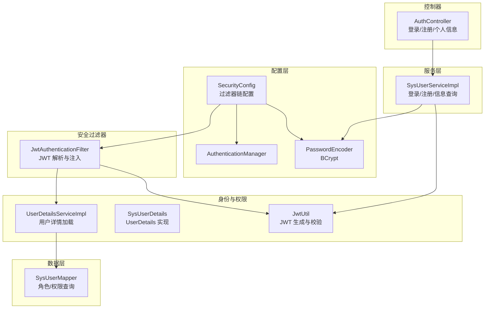
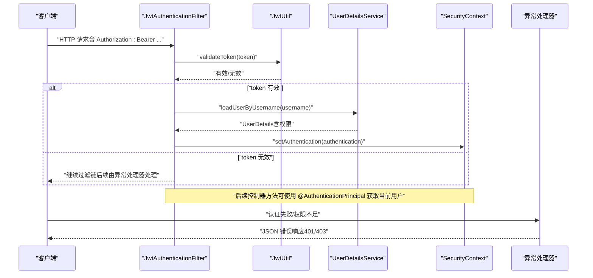
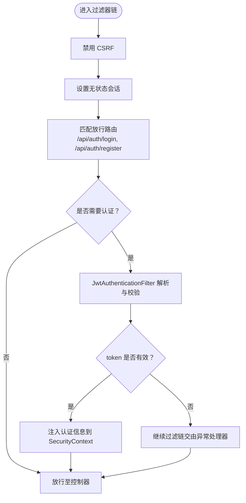
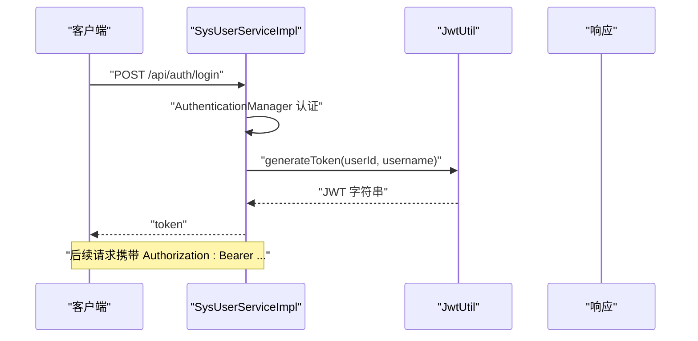
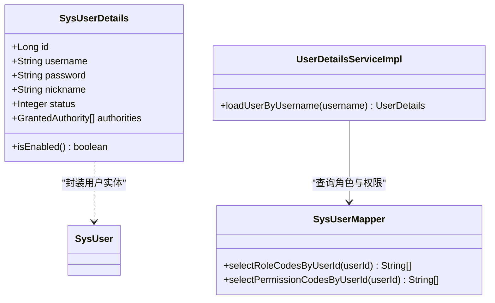
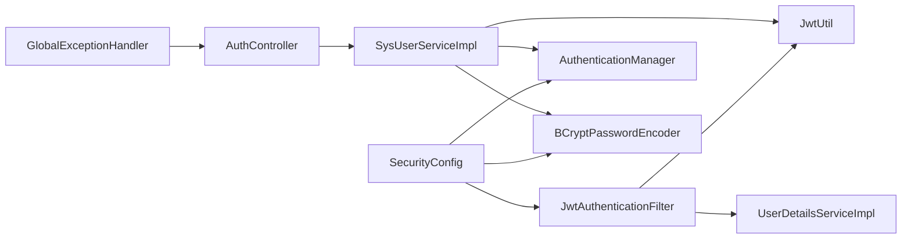

# 安全架构设计

<cite>
**本文档引用的文件**
- [SecurityConfig.java](file://src/main/java/com/bookorder/config/SecurityConfig.java)
- [JwtAuthenticationFilter.java](file://src/main/java/com/bookorder/security/JwtAuthenticationFilter.java)
- [JwtUtil.java](file://src/main/java/com/bookorder/security/JwtUtil.java)
- [UserDetailsServiceImpl.java](file://src/main/java/com/bookorder/security/UserDetailsServiceImpl.java)
- [SysUserDetails.java](file://src/main/java/com/bookorder/security/SysUserDetails.java)
- [SysUserServiceImpl.java](file://src/main/java/com/bookorder/service/impl/SysUserServiceImpl.java)
- [AuthController.java](file://src/main/java/com/bookorder/controller/AuthController.java)
- [application.yml](file://src/main/resources/application.yml)
- [init.sql](file://sql/init.sql)
- [SysUserMapper.java](file://src/main/java/com/bookorder/mapper/SysUserMapper.java)
- [GlobalExceptionHandler.java](file://src/main/java/com/bookorder/common/GlobalExceptionHandler.java)
</cite>

## 目录
1. [引言](#引言)
2. [项目结构](#项目结构)
3. [核心组件](#核心组件)
4. [架构总览](#架构总览)
5. [详细组件分析](#详细组件分析)
6. [依赖关系分析](#依赖关系分析)
7. [性能考量](#性能考量)
8. [故障排除指南](#故障排除指南)
9. [结论](#结论)

## 引言
本文件面向图书订单系统的安全架构，重点解析基于 Spring Security 的无状态认证与授权体系，涵盖：
- 安全过滤器链配置与策略
- JWT 认证机制（生成、验证、刷新）
- 密码加密、用户详情服务与权限验证流程
- CORS、CSRF、会话管理等最佳实践
- 常见安全漏洞与防护建议

## 项目结构
系统采用分层架构，安全相关代码集中在以下模块：
- 配置层：Spring Security 过滤器链与密码编码器配置
- 安全过滤器：JWT 解析与注入认证上下文
- 身份与权限：用户详情加载、角色与权限映射
- 控制器：认证端点与受保护资源访问
- 数据初始化：数据库表结构与默认数据

**图表来源**
- [SecurityConfig.java:34-62](file://src/main/java/com/bookorder/config/SecurityConfig.java#L34-L62)
- [JwtAuthenticationFilter.java:28-46](file://src/main/java/com/bookorder/security/JwtAuthenticationFilter.java#L28-L46)
- [JwtUtil.java:27-52](file://src/main/java/com/bookorder/security/JwtUtil.java#L27-L52)
- [UserDetailsServiceImpl.java:24-48](file://src/main/java/com/bookorder/security/UserDetailsServiceImpl.java#L24-L48)
- [SysUserDetails.java:19-52](file://src/main/java/com/bookorder/security/SysUserDetails.java#L19-L52)
- [SysUserServiceImpl.java:50-55](file://src/main/java/com/bookorder/service/impl/SysUserServiceImpl.java#L50-L55)
- [AuthController.java:28-57](file://src/main/java/com/bookorder/controller/AuthController.java#L28-L57)
- [SysUserMapper.java:14-23](file://src/main/java/com/bookorder/mapper/SysUserMapper.java#L14-L23)

**章节来源**
- [SecurityConfig.java:23-74](file://src/main/java/com/bookorder/config/SecurityConfig.java#L23-L74)
- [application.yml:26-28](file://src/main/resources/application.yml#L26-L28)

## 核心组件
- 安全过滤器链：禁用 CSRF，设置无状态会话，开放登录/注册端点，其余请求需认证；自定义未登录与权限不足响应。
- JWT 过滤器：从 Authorization 头解析 Bearer Token，校验有效性后将认证信息注入 SecurityContext。
- JWT 工具：基于 Base64 密钥与 HMAC-SHA 签名，支持生成、解析、校验与提取声明。
- 用户详情服务：按用户名查询用户，校验状态，加载角色与权限，封装为 UserDetails。
- 登录/注册服务：使用 AuthenticationManager 执行用户名密码认证，成功后签发 JWT；注册时使用 BCrypt 加密密码并绑定默认角色。
- 全局异常处理：统一处理认证失败、权限不足、参数校验等异常，返回标准结果格式。

**章节来源**
- [SecurityConfig.java:34-62](file://src/main/java/com/bookorder/config/SecurityConfig.java#L34-L62)
- [JwtAuthenticationFilter.java:28-46](file://src/main/java/com/bookorder/security/JwtAuthenticationFilter.java#L28-L46)
- [JwtUtil.java:27-60](file://src/main/java/com/bookorder/security/JwtUtil.java#L27-L60)
- [UserDetailsServiceImpl.java:24-48](file://src/main/java/com/bookorder/security/UserDetailsServiceImpl.java#L24-L48)
- [SysUserServiceImpl.java:50-80](file://src/main/java/com/bookorder/service/impl/SysUserServiceImpl.java#L50-L80)
- [GlobalExceptionHandler.java:22-38](file://src/main/java/com/bookorder/common/GlobalExceptionHandler.java#L22-L38)

## 架构总览
下图展示从客户端请求到认证完成的关键交互路径，以及异常处理与响应格式化。

**图表来源**
- [JwtAuthenticationFilter.java:28-46](file://src/main/java/com/bookorder/security/JwtAuthenticationFilter.java#L28-L46)
- [JwtUtil.java:45-52](file://src/main/java/com/bookorder/security/JwtUtil.java#L45-L52)
- [UserDetailsServiceImpl.java:24-48](file://src/main/java/com/bookorder/security/UserDetailsServiceImpl.java#L24-L48)
- [GlobalExceptionHandler.java:28-38](file://src/main/java/com/bookorder/common/GlobalExceptionHandler.java#L28-L38)

## 详细组件分析

### 安全过滤器链与配置策略
- 禁用 CSRF：适用于无状态 API，避免不必要的会话依赖。
- 无状态会话：SessionCreationPolicy.STATELESS，确保不创建/使用会话。
- 路由放行：/api/auth/login 与 /api/auth/register 对外开放。
- 异常处理：未登录与权限不足分别返回 JSON 错误体，便于前端统一处理。
- 过滤器插入：在 UsernamePasswordAuthenticationFilter 之前添加 JWT 过滤器，优先解析令牌。

**图表来源**
- [SecurityConfig.java:34-62](file://src/main/java/com/bookorder/config/SecurityConfig.java#L34-L62)
- [JwtAuthenticationFilter.java:28-46](file://src/main/java/com/bookorder/security/JwtAuthenticationFilter.java#L28-L46)

**章节来源**
- [SecurityConfig.java:34-62](file://src/main/java/com/bookorder/config/SecurityConfig.java#L34-L62)

### JWT 认证机制
- 令牌生成：包含用户标识、用户名、签发时间与过期时间，使用对称密钥签名。
- 令牌解析：验证签名并解析载荷，提取用户信息与权限。
- 令牌校验：检查过期时间，异常情况视为无效。
- 过滤器集成：从 Authorization 头读取 Bearer Token，校验后将认证对象写入上下文。

**图表来源**
- [SysUserServiceImpl.java:50-55](file://src/main/java/com/bookorder/service/impl/SysUserServiceImpl.java#L50-L55)
- [JwtUtil.java:27-35](file://src/main/java/com/bookorder/security/JwtUtil.java#L27-L35)
- [AuthController.java:28-32](file://src/main/java/com/bookorder/controller/AuthController.java#L28-L32)

**章节来源**
- [JwtUtil.java:27-60](file://src/main/java/com/bookorder/security/JwtUtil.java#L27-L60)
- [JwtAuthenticationFilter.java:28-46](file://src/main/java/com/bookorder/security/JwtAuthenticationFilter.java#L28-L46)

### 用户详情服务与权限验证
- 用户加载：根据用户名查询用户，校验状态；加载角色与权限集合。
- 权限映射：角色前缀统一为 ROLE_，权限直接以字符串形式注入。
- UserDetails 实现：提供账户有效期、锁定状态与启用状态的判断逻辑。

**图表来源**
- [SysUserDetails.java:19-52](file://src/main/java/com/bookorder/security/SysUserDetails.java#L19-L52)
- [UserDetailsServiceImpl.java:24-48](file://src/main/java/com/bookorder/security/UserDetailsServiceImpl.java#L24-L48)
- [SysUserMapper.java:14-23](file://src/main/java/com/bookorder/mapper/SysUserMapper.java#L14-L23)

**章节来源**
- [UserDetailsServiceImpl.java:24-48](file://src/main/java/com/bookorder/security/UserDetailsServiceImpl.java#L24-L48)
- [SysUserDetails.java:31-52](file://src/main/java/com/bookorder/security/SysUserDetails.java#L31-L52)

### 密码加密机制
- 使用 BCryptPasswordEncoder 对注册密码进行加密存储。
- 登录时通过 AuthenticationManager 与 UserDetailsService 验证凭据。
- 数据库中默认管理员密码为 BCrypt 加密后的值，确保不可逆存储。

**章节来源**
- [SecurityConfig.java:69-72](file://src/main/java/com/bookorder/config/SecurityConfig.java#L69-L72)
- [SysUserServiceImpl.java:64-69](file://src/main/java/com/bookorder/service/impl/SysUserServiceImpl.java#L64-L69)
- [init.sql:119-120](file://sql/init.sql#L119-L120)

### 无状态认证的优势与安全考虑
- 优势：水平扩展友好、无服务器端会话状态、减少内存占用。
- 安全考虑：令牌有效期应合理设置；密钥需妥善保管；建议启用 HTTPS；避免在日志中输出敏感信息；定期轮换密钥。

[本节为概念性内容，无需列出具体文件来源]

## 依赖关系分析
- 配置层依赖于过滤器、认证管理器与密码编码器。
- 过滤器依赖于 JWT 工具与用户详情服务。
- 服务层依赖于 JWT 工具、密码编码器与认证管理器。
- 控制器依赖于服务层与全局异常处理。
- 数据层通过 SQL 查询角色与权限代码。

**图表来源**
- [SecurityConfig.java:28-32](file://src/main/java/com/bookorder/config/SecurityConfig.java#L28-L32)
- [JwtAuthenticationFilter.java:22-26](file://src/main/java/com/bookorder/security/JwtAuthenticationFilter.java#L22-L26)
- [SysUserServiceImpl.java:34-41](file://src/main/java/com/bookorder/service/impl/SysUserServiceImpl.java#L34-L41)
- [AuthController.java:22-27](file://src/main/java/com/bookorder/controller/AuthController.java#L22-L27)

**章节来源**
- [SecurityConfig.java:28-32](file://src/main/java/com/bookorder/config/SecurityConfig.java#L28-L32)
- [JwtAuthenticationFilter.java:22-26](file://src/main/java/com/bookorder/security/JwtAuthenticationFilter.java#L22-L26)
- [SysUserServiceImpl.java:34-41](file://src/main/java/com/bookorder/service/impl/SysUserServiceImpl.java#L34-L41)
- [AuthController.java:22-27](file://src/main/java/com/bookorder/controller/AuthController.java#L22-L27)

## 性能考量
- 无状态设计降低服务器端状态维护成本，适合高并发场景。
- JWT 校验为本地计算（HMAC），开销较小；建议缩短令牌有效期并结合刷新策略。
- 用户权限查询通过 SQL 聚合，注意索引优化与查询缓存。
- 建议开启响应压缩与合理的连接池配置，提升整体吞吐量。

[本节为通用性能建议，无需列出具体文件来源]

## 故障排除指南
- 未登录或 token 过期：检查 Authorization 头格式与令牌有效期；确认过滤器链正确插入。
- 权限不足：核对用户角色与权限映射；确认权限字符串前缀与控制器注解一致。
- 用户名或密码错误：确认 BCrypt 加密一致性与数据库中用户状态。
- 参数校验失败：关注 DTO 注解与全局异常处理返回的消息。

**章节来源**
- [SecurityConfig.java:43-58](file://src/main/java/com/bookorder/config/SecurityConfig.java#L43-L58)
- [GlobalExceptionHandler.java:28-38](file://src/main/java/com/bookorder/common/GlobalExceptionHandler.java#L28-L38)

## 结论
该系统采用 Spring Security 无状态认证方案，结合 JWT 实现轻量级、可扩展的身份验证与授权。通过明确的过滤器链配置、严格的异常处理与完善的权限模型，满足现代 Web 应用的安全需求。建议在生产环境中进一步强化密钥管理、引入 HTTPS、实施速率限制与审计日志，并持续监控与评估安全策略的有效性。