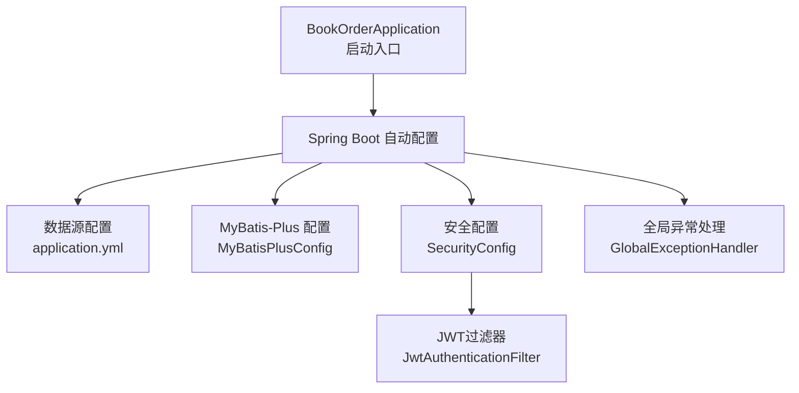
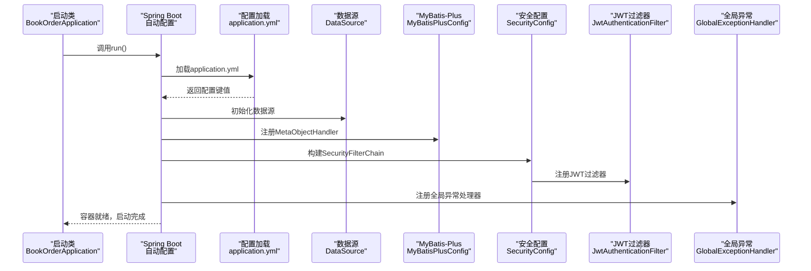
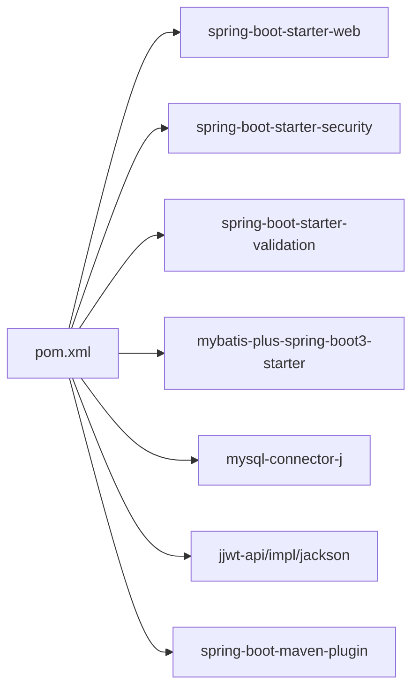

# 应用启动流程

<cite>
**本文引用的文件**
- [BookOrderApplication.java](file://src/main/java/com/bookorder/BookOrderApplication.java)
- [application.yml](file://src/main/resources/application.yml)
- [pom.xml](file://pom.xml)
- [MyBatisPlusConfig.java](file://src/main/java/com/bookorder/config/MyBatisPlusConfig.java)
- [SecurityConfig.java](file://src/main/java/com/bookorder/config/SecurityConfig.java)
- [JwtAuthenticationFilter.java](file://src/main/java/com/bookorder/security/JwtAuthenticationFilter.java)
- [GlobalExceptionHandler.java](file://src/main/java/com/bookorder/common/GlobalExceptionHandler.java)
</cite>

## 目录
1. [简介](#简介)
2. [项目结构](#项目结构)
3. [核心组件](#核心组件)
4. [架构总览](#架构总览)
5. [详细组件分析](#详细组件分析)
6. [依赖分析](#依赖分析)
7. [性能考虑](#性能考虑)
8. [故障排查指南](#故障排查指南)
9. [结论](#结论)

## 简介
本文件面向图书订单系统（基于Spring Boot与MyBatis-Plus）的应用启动流程，系统性阐述以下主题：
- Spring Boot启动入口与@SpringBootApplication注解的作用
- 主类配置与启动方法
- @MapperScan注解对Mapper接口的扫描机制
- Spring容器初始化过程与关键Bean装配
- application.yml配置文件的加载顺序与优先级
- 启动日志分析与常见启动问题排查
- 启动关键节点与性能优化建议

## 项目结构
该工程采用标准的Spring Boot多模块结构，主要代码位于src/main/java与src/main/resources目录下，核心启动类位于com.bookorder包中，配置集中在application.yml，数据库连接、MyBatis-Plus与安全配置分别在config与security包中定义。

图表来源
- [BookOrderApplication.java:1-15](file://src/main/java/com/bookorder/BookOrderApplication.java#L1-L15)
- [application.yml:1-33](file://src/main/resources/application.yml#L1-L33)
- [MyBatisPlusConfig.java:1-23](file://src/main/java/com/bookorder/config/MyBatisPlusConfig.java#L1-L23)
- [SecurityConfig.java:1-74](file://src/main/java/com/bookorder/config/SecurityConfig.java#L1-L74)
- [JwtAuthenticationFilter.java:1-56](file://src/main/java/com/bookorder/security/JwtAuthenticationFilter.java#L1-L56)
- [GlobalExceptionHandler.java:1-62](file://src/main/java/com/bookorder/common/GlobalExceptionHandler.java#L1-L62)

章节来源
- [BookOrderApplication.java:1-15](file://src/main/java/com/bookorder/BookOrderApplication.java#L1-L15)
- [application.yml:1-33](file://src/main/resources/application.yml#L1-L33)

## 核心组件
- 启动类与注解
  - @SpringBootApplication：组合注解，启用自动配置、组件扫描与Spring Boot特性，通常指向包含main方法的类所在包。
  - @MapperScan：指定Mapper接口扫描的基础包，确保MyBatis-Plus能发现并注册对应的Mapper Bean。
  - main方法：调用SpringApplication.run启动内嵌Web服务器与Spring容器。

- 配置文件
  - application.yml：集中管理端口、数据源、SQL初始化、MyBatis-Plus行为、JWT参数与日志级别等。

- 安全与拦截链
  - SecurityConfig：定义无状态会话策略、放行路径、异常处理与JWT过滤器链。
  - JwtAuthenticationFilter：从请求头解析JWT并注入认证上下文。

- 数据访问层
  - MyBatisPlusConfig：实现MetaObjectHandler，自动填充创建与更新时间字段。

章节来源
- [BookOrderApplication.java:7-13](file://src/main/java/com/bookorder/BookOrderApplication.java#L7-L13)
- [application.yml:4-28](file://src/main/resources/application.yml#L4-L28)
- [SecurityConfig.java:34-62](file://src/main/java/com/bookorder/config/SecurityConfig.java#L34-L62)
- [JwtAuthenticationFilter.java:28-46](file://src/main/java/com/bookorder/security/JwtAuthenticationFilter.java#L28-L46)
- [MyBatisPlusConfig.java:10-22](file://src/main/java/com/bookorder/config/MyBatisPlusConfig.java#L10-L22)

## 架构总览
下图展示应用启动时的关键交互：启动类触发Spring Boot自动配置，随后加载application.yml中的配置，装配数据源、MyBatis-Plus、安全与全局异常处理等Bean，并最终构建Web安全过滤链。

图表来源
- [BookOrderApplication.java:11-13](file://src/main/java/com/bookorder/BookOrderApplication.java#L11-L13)
- [application.yml:4-28](file://src/main/resources/application.yml#L4-L28)
- [MyBatisPlusConfig.java:9-22](file://src/main/java/com/bookorder/config/MyBatisPlusConfig.java#L9-L22)
- [SecurityConfig.java:34-62](file://src/main/java/com/bookorder/config/SecurityConfig.java#L34-L62)
- [JwtAuthenticationFilter.java:19-46](file://src/main/java/com/bookorder/security/JwtAuthenticationFilter.java#L19-L46)
- [GlobalExceptionHandler.java:17-61](file://src/main/java/com/bookorder/common/GlobalExceptionHandler.java#L17-L61)

## 详细组件分析

### 启动类与@SpringBootApplication/@MapperScan
- @SpringBootApplication
  - 启用自动配置与组件扫描，默认扫描启动类所在包及其子包。
  - 在本项目中，启动类位于com.bookorder包，因此会扫描该包下的所有组件（含mapper、service、controller、config等）。
- @MapperScan
  - 指定Mapper接口扫描基础包为com.bookorder.mapper，确保MyBatis-Plus生成对应Mapper Bean并注入到Spring容器。
- main方法
  - 通过SpringApplication.run(BookOrderApplication.class, args)启动应用，内部完成Web服务器初始化与容器刷新。

章节来源
- [BookOrderApplication.java:7-13](file://src/main/java/com/bookorder/BookOrderApplication.java#L7-L13)

### application.yml配置加载顺序与优先级
Spring Boot配置加载遵循固定优先级顺序（从高到低），后加载的配置会覆盖之前加载的同名键值。对于本项目，关键配置如下：
- server.port：服务端口
- spring.datasource.*：数据库连接URL、用户名、密码与驱动
- spring.sql.init.*：SQL初始化模式与脚本位置
- mybatis-plus.*：MyBatis-Plus驼峰映射、日志实现与逻辑删除配置
- jwt.*：JWT密钥与过期时间
- logging.level.*：日志级别

优先级概览（从高到低）
1) 命令行参数
2) SPRING_APPLICATION_JSON
3) 系统环境变量
4) application-{profile}.yml
5) application.yml
6) @PropertySource
7) 默认属性

章节来源
- [application.yml:1-33](file://src/main/resources/application.yml#L1-L33)

### Spring容器初始化与Bean装配
- 数据源与SQL初始化
  - 由spring.datasource.*与spring.sql.init.*驱动，自动配置DataSource与Schema初始化。
- MyBatis-Plus
  - 通过MyBatisPlusConfig注册MetaObjectHandler，实现插入与更新时自动填充时间字段。
- 安全框架
  - SecurityConfig定义无状态会话策略、放行路径与异常处理；JwtAuthenticationFilter在过滤链中解析JWT并设置认证上下文。
- 全局异常处理
  - GlobalExceptionHandler统一捕获业务异常、认证失败、权限不足、参数校验异常与通用异常，返回标准化响应。

章节来源
- [application.yml:4-28](file://src/main/resources/application.yml#L4-L28)
- [MyBatisPlusConfig.java:9-22](file://src/main/java/com/bookorder/config/MyBatisPlusConfig.java#L9-L22)
- [SecurityConfig.java:23-73](file://src/main/java/com/bookorder/config/SecurityConfig.java#L23-L73)
- [JwtAuthenticationFilter.java:19-55](file://src/main/java/com/bookorder/security/JwtAuthenticationFilter.java#L19-L55)
- [GlobalExceptionHandler.java:17-61](file://src/main/java/com/bookorder/common/GlobalExceptionHandler.java#L17-L61)

### Mapper接口扫描机制
- @MapperScan("com.bookorder.mapper")确保MyBatis-Plus扫描该包下的所有Mapper接口。
- 扫描后生成Mapper Bean并注入到Spring容器，供Service层使用。
- 若需扩展扫描范围，可在启动类上增加额外包路径或使用@Mapper注解标注特定接口。

章节来源
- [BookOrderApplication.java:8](file://src/main/java/com/bookorder/BookOrderApplication.java#L8)

### 启动关键节点
- 启动类加载与自动配置
  - 启动类触发Spring Boot自动配置，加载application.yml并装配各组件。
- 数据源与数据库初始化
  - 初始化DataSource并执行schema-locations指定的SQL脚本。
- 安全过滤链构建
  - 构建SecurityFilterChain并将JwtAuthenticationFilter加入过滤链。
- 容器刷新完成
  - Web服务器启动，监听server.port端口，等待请求。

章节来源
- [BookOrderApplication.java:11-13](file://src/main/java/com/bookorder/BookOrderApplication.java#L11-L13)
- [application.yml:10-13](file://src/main/resources/application.yml#L10-L13)
- [SecurityConfig.java:34-62](file://src/main/java/com/bookorder/config/SecurityConfig.java#L34-L62)

## 依赖分析
- Maven依赖要点
  - Spring Boot Starter Web、Security、Validation
  - MyBatis-Plus Starter与MySQL Connector
  - JWT相关依赖
- 插件
  - spring-boot-maven-plugin用于打包与运行

图表来源
- [pom.xml:26-83](file://pom.xml#L26-L83)
- [pom.xml:86-93](file://pom.xml#L86-L93)

章节来源
- [pom.xml:1-95](file://pom.xml#L1-L95)

## 性能考虑
- 启动阶段
  - 减少不必要的自动配置：仅保留所需Starter，避免加载无关组件。
  - 使用profile隔离开发/生产配置，减少默认配置项数量。
- 运行阶段
  - 合理设置日志级别，避免在生产开启过细的日志输出。
  - 对数据库连接池参数进行调优（如最大连接数、空闲超时等）。
  - 启用必要的缓存与连接复用，降低重复初始化成本。

## 故障排查指南
- 启动失败（端口占用）
  - 现象：启动报错提示端口不可用
  - 处理：修改server.port或释放占用端口
- 数据库连接失败
  - 现象：无法建立DataSource或SQL初始化失败
  - 排查：核对spring.datasource.url、username、password与driver-class-name是否正确
- SQL初始化未执行
  - 现象：数据库表未创建或数据未导入
  - 排查：确认spring.sql.init.mode与schema-locations配置，检查init.sql路径与内容
- JWT鉴权异常
  - 现象：请求被拒绝或返回401/403
  - 排查：确认JWT密钥、过期时间与请求头格式（Authorization: Bearer ...）
- 日志级别过高导致性能下降
  - 现象：启动或运行缓慢
  - 处理：调整logging.level.com.bookorder为info或warn

章节来源
- [application.yml:1-33](file://src/main/resources/application.yml#L1-L33)
- [SecurityConfig.java:34-62](file://src/main/java/com/bookorder/config/SecurityConfig.java#L34-L62)
- [JwtAuthenticationFilter.java:48-54](file://src/main/java/com/bookorder/security/JwtAuthenticationFilter.java#L48-L54)

## 结论
本项目通过简洁的启动类与明确的配置文件实现了快速启动与稳定运行。@SpringBootApplication与@MapperScan确保了自动配置与Mapper扫描的正确性；application.yml集中管理关键配置；SecurityConfig与JwtAuthenticationFilter共同构建无状态安全体系；MyBatisPlusConfig与GlobalExceptionHandler完善了数据填充与异常处理。结合合理的性能优化与故障排查策略，可保障应用高效、可靠地启动与运行。