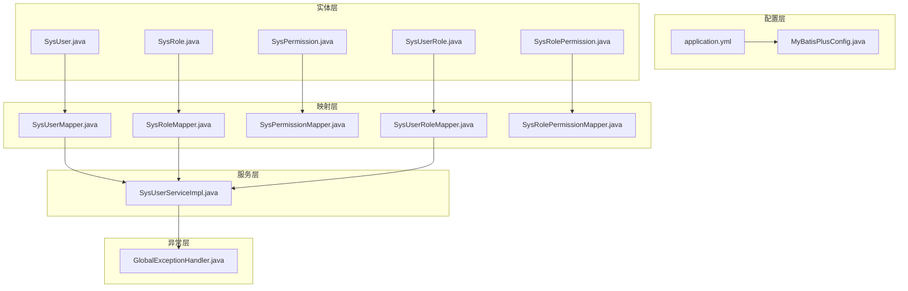
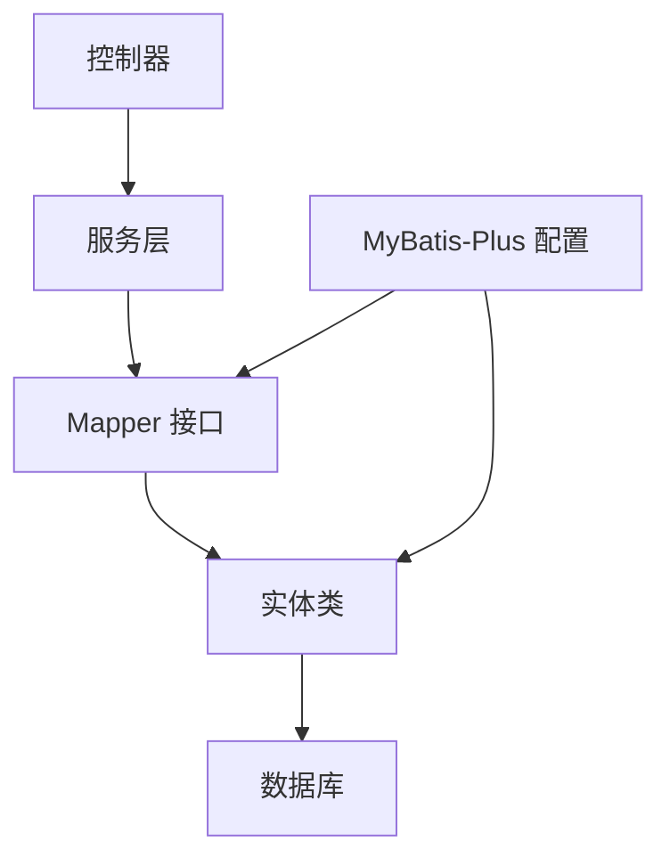
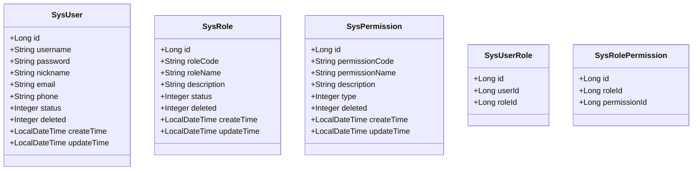
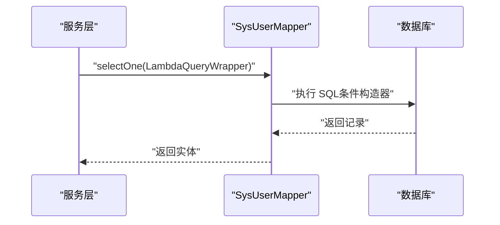
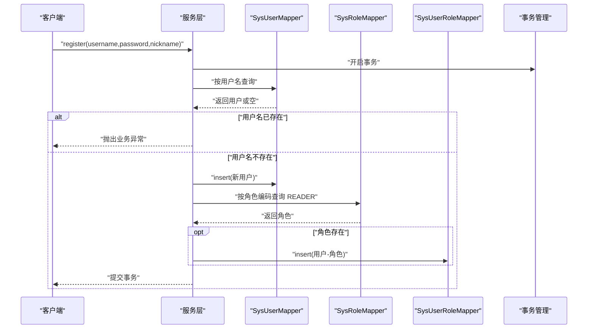
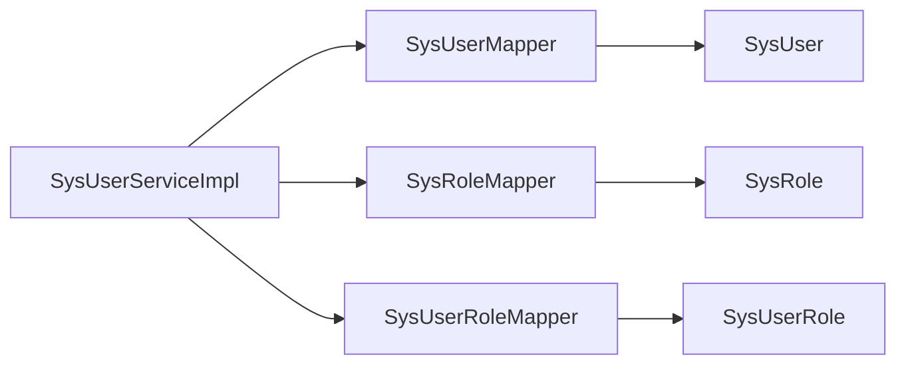

# 数据访问架构

<cite>
**本文引用的文件**
- [MyBatisPlusConfig.java](file://src/main/java/com/bookorder/config/MyBatisPlusConfig.java)
- [application.yml](file://src/main/resources/application.yml)
- [SysUserMapper.java](file://src/main/java/com/bookorder/mapper/SysUserMapper.java)
- [SysRoleMapper.java](file://src/main/java/com/bookorder/mapper/SysRoleMapper.java)
- [SysPermissionMapper.java](file://src/main/java/com/bookorder/mapper/SysPermissionMapper.java)
- [SysUserRoleMapper.java](file://src/main/java/com/bookorder/mapper/SysUserRoleMapper.java)
- [SysRolePermissionMapper.java](file://src/main/java/com/bookorder/mapper/SysRolePermissionMapper.java)
- [SysUser.java](file://src/main/java/com/bookorder/entity/SysUser.java)
- [SysRole.java](file://src/main/java/com/bookorder/entity/SysRole.java)
- [SysPermission.java](file://src/main/java/com/bookorder/entity/SysPermission.java)
- [SysUserRole.java](file://src/main/java/com/bookorder/entity/SysUserRole.java)
- [SysRolePermission.java](file://src/main/java/com/bookorder/entity/SysRolePermission.java)
- [SysUserServiceImpl.java](file://src/main/java/com/bookorder/service/impl/SysUserServiceImpl.java)
- [GlobalExceptionHandler.java](file://src/main/java/com/bookorder/common/GlobalExceptionHandler.java)
- [init.sql](file://sql/init.sql)
</cite>

## 目录
1. [简介](#简介)
2. [项目结构](#项目结构)
3. [核心组件](#核心组件)
4. [架构总览](#架构总览)
5. [详细组件分析](#详细组件分析)
6. [依赖分析](#依赖分析)
7. [性能考虑](#性能考虑)
8. [故障排查指南](#故障排查指南)
9. [结论](#结论)
10. [附录](#附录)

## 简介
本文件面向图书订单系统的数据访问层，系统采用 Spring Boot + MyBatis-Plus 架构，围绕用户、角色、权限及关联表构建了完整的 RBAC 数据模型。本文重点阐述以下方面：
- MyBatis-Plus 的集成配置与 ORM 映射策略
- Mapper 接口设计原则与 CRUD 实现
- 实体类与数据库表的映射关系与字段注解使用
- 分页查询、条件构造器与动态 SQL 的使用
- 数据访问层性能优化（缓存、批量、连接池）
- 事务管理与异常处理机制

## 项目结构
数据访问相关模块分布如下：
- 配置层：MyBatis-Plus 全局配置与自动填充
- 实体层：用户、角色、权限及其关联实体
- 映射层：各实体对应的 Mapper 接口
- 服务层：基于 ServiceImpl 的业务封装与事务控制
- 异常层：全局异常处理与业务异常封装

图表来源
- [MyBatisPlusConfig.java:1-23](file://src/main/java/com/bookorder/config/MyBatisPlusConfig.java#L1-L23)
- [application.yml:1-33](file://src/main/resources/application.yml#L1-L33)
- [SysUser.java:1-48](file://src/main/java/com/bookorder/entity/SysUser.java#L1-L48)
- [SysRole.java:1-42](file://src/main/java/com/bookorder/entity/SysRole.java#L1-L42)
- [SysPermission.java:1-42](file://src/main/java/com/bookorder/entity/SysPermission.java#L1-L42)
- [SysUserRole.java:1-22](file://src/main/java/com/bookorder/entity/SysUserRole.java#L1-L22)
- [SysRolePermission.java:1-22](file://src/main/java/com/bookorder/entity/SysRolePermission.java#L1-L22)
- [SysUserMapper.java:1-25](file://src/main/java/com/bookorder/mapper/SysUserMapper.java#L1-L25)
- [SysRoleMapper.java:1-10](file://src/main/java/com/bookorder/mapper/SysRoleMapper.java#L1-L10)
- [SysPermissionMapper.java:1-10](file://src/main/java/com/bookorder/mapper/SysPermissionMapper.java#L1-L10)
- [SysUserRoleMapper.java:1-10](file://src/main/java/com/bookorder/mapper/SysUserRoleMapper.java#L1-L10)
- [SysRolePermissionMapper.java:1-10](file://src/main/java/com/bookorder/mapper/SysRolePermissionMapper.java#L1-L10)
- [SysUserServiceImpl.java:1-87](file://src/main/java/com/bookorder/service/impl/SysUserServiceImpl.java#L1-L87)
- [GlobalExceptionHandler.java:1-62](file://src/main/java/com/bookorder/common/GlobalExceptionHandler.java#L1-L62)

章节来源
- [application.yml:1-33](file://src/main/resources/application.yml#L1-L33)
- [MyBatisPlusConfig.java:1-23](file://src/main/java/com/bookorder/config/MyBatisPlusConfig.java#L1-L23)

## 核心组件
- MyBatis-Plus 全局配置
  - 自动填充：插入与更新时自动填充时间字段
  - 全局逻辑删除：统一配置逻辑删除字段与值
  - 命名策略：下划线转驼峰映射
- 实体映射
  - 使用注解标注表名、主键策略、逻辑删除与字段自动填充
- Mapper 接口
  - 基于 BaseMapper 提供通用 CRUD
  - 针对复杂查询自定义 SQL 注解
- 服务层
  - 基于 ServiceImpl 封装业务流程
  - 使用条件构造器进行安全查询
  - 通过注解开启事务与回滚策略

章节来源
- [MyBatisPlusConfig.java:10-22](file://src/main/java/com/bookorder/config/MyBatisPlusConfig.java#L10-L22)
- [application.yml:15-24](file://src/main/resources/application.yml#L15-L24)
- [SysUser.java:6-25](file://src/main/java/com/bookorder/entity/SysUser.java#L6-L25)
- [SysRole.java:6-23](file://src/main/java/com/bookorder/entity/SysRole.java#L6-L23)
- [SysPermission.java:6-23](file://src/main/java/com/bookorder/entity/SysPermission.java#L6-L23)
- [SysUserMapper.java:11-23](file://src/main/java/com/bookorder/mapper/SysUserMapper.java#L11-L23)
- [SysUserServiceImpl.java:22-86](file://src/main/java/com/bookorder/service/impl/SysUserServiceImpl.java#L22-L86)

## 架构总览
数据访问层遵循“配置 → 实体 → Mapper → Service → 控制器”的分层设计，结合 MyBatis-Plus 的自动填充、逻辑删除与条件构造器，形成简洁高效的持久化方案。

图表来源
- [application.yml:15-24](file://src/main/resources/application.yml#L15-L24)
- [MyBatisPlusConfig.java:10-22](file://src/main/java/com/bookorder/config/MyBatisPlusConfig.java#L10-L22)
- [SysUserMapper.java:11-23](file://src/main/java/com/bookorder/mapper/SysUserMapper.java#L11-L23)
- [SysUser.java:6-25](file://src/main/java/com/bookorder/entity/SysUser.java#L6-L25)

## 详细组件分析

### 实体与表映射
- 表与实体映射
  - 用户表：SysUser → sys_user
  - 角色表：SysRole → sys_role
  - 权限表：SysPermission → sys_permission
  - 关联表：SysUserRole → sys_user_role；SysRolePermission → sys_role_permission
- 字段注解
  - 表名：@TableName
  - 主键：@TableId（AUTO）
  - 逻辑删除：@TableLogic
  - 字段填充：@TableField(fill=INSERT/INSERT_UPDATE)
- 时间字段
  - createTime、updateTime 在插入与更新时自动填充

图表来源
- [SysUser.java:6-25](file://src/main/java/com/bookorder/entity/SysUser.java#L6-L25)
- [SysRole.java:6-23](file://src/main/java/com/bookorder/entity/SysRole.java#L6-L23)
- [SysPermission.java:6-23](file://src/main/java/com/bookorder/entity/SysPermission.java#L6-L23)
- [SysUserRole.java:7-13](file://src/main/java/com/bookorder/entity/SysUserRole.java#L7-L13)
- [SysRolePermission.java:7-13](file://src/main/java/com/bookorder/entity/SysRolePermission.java#L7-L13)

章节来源
- [SysUser.java:6-25](file://src/main/java/com/bookorder/entity/SysUser.java#L6-L25)
- [SysRole.java:6-23](file://src/main/java/com/bookorder/entity/SysRole.java#L6-L23)
- [SysPermission.java:6-23](file://src/main/java/com/bookorder/entity/SysPermission.java#L6-L23)
- [SysUserRole.java:7-13](file://src/main/java/com/bookorder/entity/SysUserRole.java#L7-L13)
- [SysRolePermission.java:7-13](file://src/main/java/com/bookorder/entity/SysRolePermission.java#L7-L13)

### Mapper 接口设计与 CRUD
- 设计原则
  - 通用 CRUD：继承 BaseMapper，获得标准增删改查能力
  - 自定义 SQL：针对复杂关联查询使用 @Select 注解
  - 参数传递：使用 @Param 标注方法参数，提升可读性
- 典型实现
  - 用户角色代码查询：根据用户 ID 查询角色编码集合
  - 用户权限代码查询：根据用户 ID 查询权限编码集合
- 条件构造器
  - 使用 LambdaQueryWrapper 进行类型安全的条件拼装
  - 支持等值、范围、模糊等常用条件

图表来源
- [SysUserMapper.java:14-23](file://src/main/java/com/bookorder/mapper/SysUserMapper.java#L14-L23)
- [SysUserServiceImpl.java:44-47](file://src/main/java/com/bookorder/service/impl/SysUserServiceImpl.java#L44-L47)

章节来源
- [SysUserMapper.java:11-23](file://src/main/java/com/bookorder/mapper/SysUserMapper.java#L11-L23)
- [SysRoleMapper.java:7-9](file://src/main/java/com/bookorder/mapper/SysRoleMapper.java#L7-L9)
- [SysPermissionMapper.java:7-9](file://src/main/java/com/bookorder/mapper/SysPermissionMapper.java#L7-L9)
- [SysUserRoleMapper.java:7-9](file://src/main/java/com/bookorder/mapper/SysUserRoleMapper.java#L7-L9)
- [SysRolePermissionMapper.java:7-9](file://src/main/java/com/bookorder/mapper/SysRolePermissionMapper.java#L7-L9)
- [SysUserServiceImpl.java:44-47](file://src/main/java/com/bookorder/service/impl/SysUserServiceImpl.java#L44-L47)

### 动态 SQL 与分页查询
- 动态 SQL
  - 复杂关联查询通过 @Select 注解编写原生 SQL，实现多表连接与去重
- 分页查询
  - MyBatis-Plus 提供分页插件与 Page 对象，可在服务层传入分页参数后调用 Mapper 的分页方法
  - 建议在服务层封装分页结果，统一返回格式

说明：当前仓库未直接展示分页调用示例，但基于 MyBatis-Plus 的通用能力可无缝接入。

### 事务管理与异常处理
- 事务
  - 注册流程使用 @Transactional(rollbackFor = Exception.class)，确保用户名重复检查、用户创建与默认角色绑定的原子性
- 异常
  - 全局异常处理器捕获业务异常、认证失败、权限不足、参数校验错误与系统异常，并统一返回 Result 结构

图表来源
- [SysUserServiceImpl.java:57-80](file://src/main/java/com/bookorder/service/impl/SysUserServiceImpl.java#L57-L80)
- [SysUserMapper.java:44-47](file://src/main/java/com/bookorder/mapper/SysUserMapper.java#L44-L47)
- [SysRoleMapper.java:7-9](file://src/main/java/com/bookorder/mapper/SysRoleMapper.java#L7-L9)
- [SysUserRoleMapper.java:7-9](file://src/main/java/com/bookorder/mapper/SysUserRoleMapper.java#L7-L9)

章节来源
- [SysUserServiceImpl.java:57-80](file://src/main/java/com/bookorder/service/impl/SysUserServiceImpl.java#L57-L80)
- [GlobalExceptionHandler.java:22-60](file://src/main/java/com/bookorder/common/GlobalExceptionHandler.java#L22-L60)

## 依赖分析
- 组件耦合
  - 服务层聚合多个 Mapper，形成业务闭环
  - 实体与 Mapper 通过注解建立稳定映射关系
- 外部依赖
  - MyBatis-Plus 提供 ORM 能力与自动填充
  - Spring Data JPA 风格的条件构造器简化查询
- 潜在风险
  - 复杂 SQL 需要维护成本，建议集中管理与单元测试覆盖

图表来源
- [SysUserServiceImpl.java:22-86](file://src/main/java/com/bookorder/service/impl/SysUserServiceImpl.java#L22-L86)
- [SysUserMapper.java:11-23](file://src/main/java/com/bookorder/mapper/SysUserMapper.java#L11-L23)
- [SysRoleMapper.java:7-9](file://src/main/java/com/bookorder/mapper/SysRoleMapper.java#L7-L9)
- [SysUserRoleMapper.java:7-9](file://src/main/java/com/bookorder/mapper/SysUserRoleMapper.java#L7-L9)
- [SysUser.java:6-25](file://src/main/java/com/bookorder/entity/SysUser.java#L6-L25)
- [SysRole.java:6-23](file://src/main/java/com/bookorder/entity/SysRole.java#L6-L23)
- [SysUserRole.java:7-13](file://src/main/java/com/bookorder/entity/SysUserRole.java#L7-L13)

## 性能考虑
- 缓存配置
  - 可在应用层引入 Redis 缓存热点数据（如用户信息、角色/权限清单），降低数据库压力
- 批量操作
  - 对批量插入/更新场景，优先使用 MyBatis-Plus 的批量工具或 JDBC 批处理，减少往返次数
- 连接池管理
  - 建议在 application.yml 中配置连接池参数（最大连接数、空闲超时、连接生命周期），并结合数据库监控观察连接使用率
- SQL 优化
  - 为高频查询字段添加合适索引（如用户唯一索引、角色/权限唯一索引）
  - 避免 N+1 查询，尽量通过一次关联查询获取所需数据
- 日志与监控
  - 启用 SQL 日志（开发环境）与慢查询监控，定位性能瓶颈

## 故障排查指南
- 常见问题
  - 插入时间字段为空：确认自动填充配置与实体字段注解一致
  - 逻辑删除未生效：检查全局逻辑删除配置与实体注解是否匹配
  - 条件查询不生效：核对 LambdaQueryWrapper 的字段是否与实体属性一致
- 定位手段
  - 查看日志级别与 SQL 输出，确认生成的 SQL 是否符合预期
  - 使用单元测试覆盖关键 Mapper 方法，验证边界条件
- 异常处理
  - 全局异常处理器已统一拦截业务异常与系统异常，便于前端统一提示

章节来源
- [application.yml:15-24](file://src/main/resources/application.yml#L15-L24)
- [MyBatisPlusConfig.java:12-21](file://src/main/java/com/bookorder/config/MyBatisPlusConfig.java#L12-L21)
- [GlobalExceptionHandler.java:22-60](file://src/main/java/com/bookorder/common/GlobalExceptionHandler.java#L22-L60)

## 结论
本数据访问架构以 MyBatis-Plus 为核心，结合实体注解、条件构造器与自定义 SQL，实现了清晰的分层与高内聚低耦合的数据持久化方案。通过自动填充、逻辑删除与事务管理，提升了开发效率与数据一致性。建议在生产环境中进一步完善缓存、批量与连接池配置，并持续优化 SQL 与索引，以获得更佳的性能表现。

## 附录
- 数据库初始化脚本
  - 包含用户、角色、权限、关联表的建表与初始化数据
- 配置要点
  - 下划线转驼峰映射、逻辑删除字段与值、自动填充字段

章节来源
- [init.sql:1-124](file://sql/init.sql#L1-L124)
- [application.yml:15-24](file://src/main/resources/application.yml#L15-L24)
- [MyBatisPlusConfig.java:12-21](file://src/main/java/com/bookorder/config/MyBatisPlusConfig.java#L12-L21)