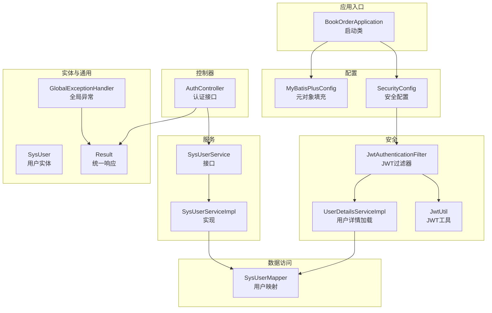
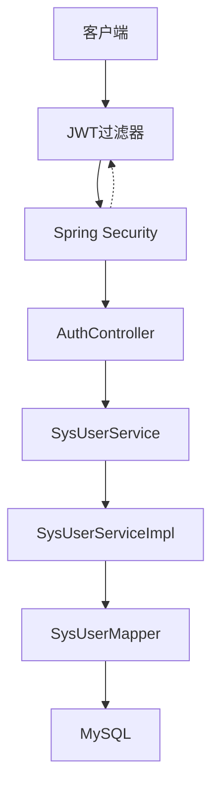
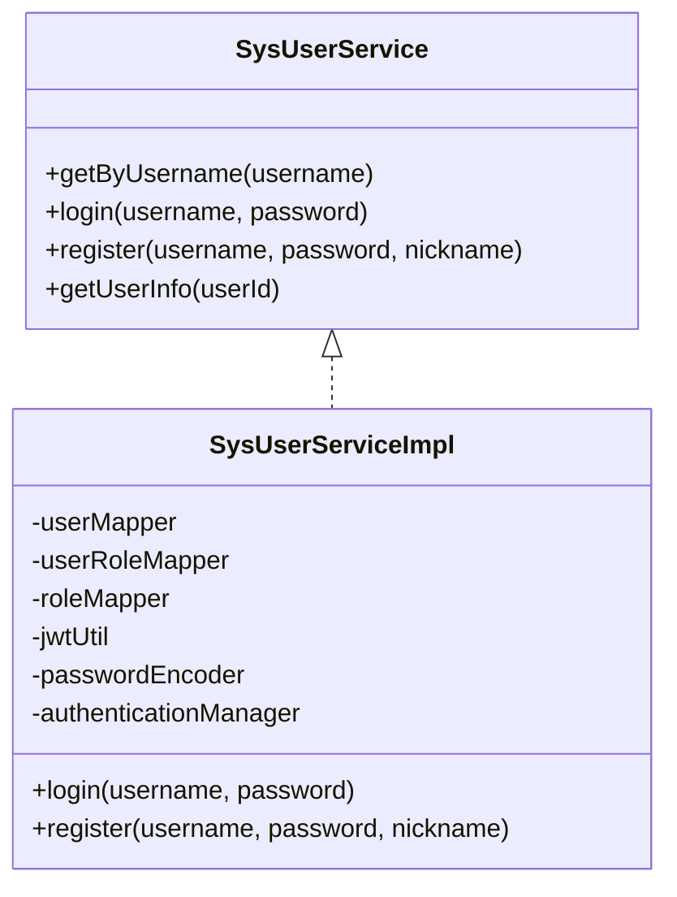
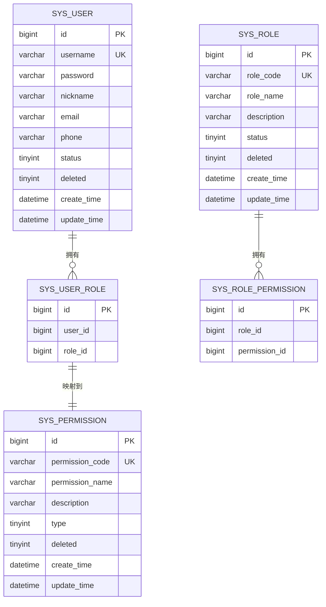
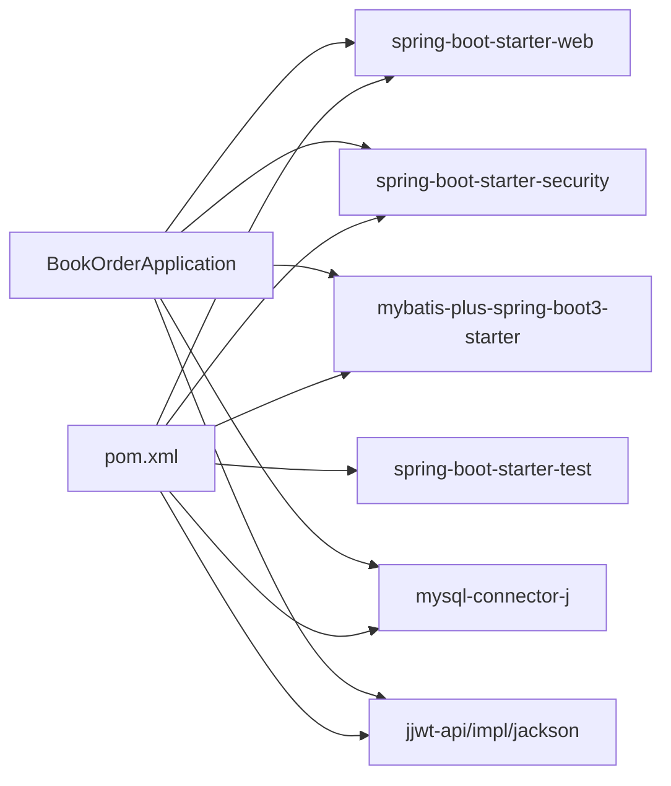

# 系统架构

<cite>
**本文引用的文件**
- [BookOrderApplication.java](file://src/main/java/com/bookorder/BookOrderApplication.java)
- [SecurityConfig.java](file://src/main/java/com/bookorder/config/SecurityConfig.java)
- [MyBatisPlusConfig.java](file://src/main/java/com/bookorder/config/MyBatisPlusConfig.java)
- [AuthController.java](file://src/main/java/com/bookorder/controller/AuthController.java)
- [SysUserService.java](file://src/main/java/com/bookorder/service/SysUserService.java)
- [SysUserServiceImpl.java](file://src/main/java/com/bookorder/service/impl/SysUserServiceImpl.java)
- [UserDetailsServiceImpl.java](file://src/main/java/com/bookorder/security/UserDetailsServiceImpl.java)
- [JwtAuthenticationFilter.java](file://src/main/java/com/bookorder/security/JwtAuthenticationFilter.java)
- [JwtUtil.java](file://src/main/java/com/bookorder/security/JwtUtil.java)
- [SysUserMapper.java](file://src/main/java/com/bookorder/mapper/SysUserMapper.java)
- [SysUser.java](file://src/main/java/com/bookorder/entity/SysUser.java)
- [Result.java](file://src/main/java/com/bookorder/common/Result.java)
- [GlobalExceptionHandler.java](file://src/main/java/com/bookorder/common/GlobalExceptionHandler.java)
- [application.yml](file://src/main/resources/application.yml)
- [pom.xml](file://pom.xml)
- [init.sql](file://sql/init.sql)
</cite>

## 目录
1. [引言](#引言)
2. [项目结构](#项目结构)
3. [核心组件](#核心组件)
4. [架构总览](#架构总览)
5. [详细组件分析](#详细组件分析)
6. [依赖分析](#依赖分析)
7. [性能考虑](#性能考虑)
8. [故障排查指南](#故障排查指南)
9. [结论](#结论)
10. [附录](#附录)

## 引言
本项目是一个基于 Spring Boot 的图书订单系统，采用 RBAC（基于角色的访问控制）模型，结合 Spring Security 实现认证与授权，并通过 JWT 进行无状态会话管理。系统使用 MyBatis-Plus 简化数据访问层开发，统一返回体与全局异常处理，提供清晰的分层架构：Controller-Service-DAO。

## 项目结构
系统采用标准的 Spring Boot 分层组织方式：
- 入口类位于根包下，负责应用启动与 Mapper 扫描
- 配置类集中于 config 包，包含安全与 MyBatis-Plus 配置
- 控制器位于 controller 匹配 REST 接口
- 服务接口与实现位于 service 接口与 impl 包
- 安全相关组件位于 security 包
- 数据访问接口位于 mapper 包
- 实体类位于 entity 包
- 公共工具与异常处理位于 common 包
- 配置文件位于 resources，数据库初始化脚本位于 sql



图表来源
- [BookOrderApplication.java:1-15](file://src/main/java/com/bookorder/BookOrderApplication.java#L1-L15)
- [SecurityConfig.java:1-74](file://src/main/java/com/bookorder/config/SecurityConfig.java#L1-L74)
- [MyBatisPlusConfig.java:1-23](file://src/main/java/com/bookorder/config/MyBatisPlusConfig.java#L1-L23)
- [AuthController.java:1-59](file://src/main/java/com/bookorder/controller/AuthController.java#L1-L59)
- [SysUserService.java:1-16](file://src/main/java/com/bookorder/service/SysUserService.java#L1-L16)
- [SysUserServiceImpl.java:1-87](file://src/main/java/com/bookorder/service/impl/SysUserServiceImpl.java#L1-L87)
- [JwtAuthenticationFilter.java:1-56](file://src/main/java/com/bookorder/security/JwtAuthenticationFilter.java#L1-L56)
- [JwtUtil.java:1-62](file://src/main/java/com/bookorder/security/JwtUtil.java#L1-L62)
- [UserDetailsServiceImpl.java:1-50](file://src/main/java/com/bookorder/security/UserDetailsServiceImpl.java#L1-L50)
- [SysUserMapper.java:1-25](file://src/main/java/com/bookorder/mapper/SysUserMapper.java#L1-L25)
- [SysUser.java:1-48](file://src/main/java/com/bookorder/entity/SysUser.java#L1-L48)
- [Result.java:1-41](file://src/main/java/com/bookorder/common/Result.java#L1-L41)
- [GlobalExceptionHandler.java:1-62](file://src/main/java/com/bookorder/common/GlobalExceptionHandler.java#L1-L62)

章节来源
- [BookOrderApplication.java:1-15](file://src/main/java/com/bookorder/BookOrderApplication.java#L1-L15)
- [application.yml:1-33](file://src/main/resources/application.yml#L1-L33)

## 核心组件
- 启动类与扫描：应用入口启用自动装配与 Mapper 扫描，确保 MyBatis-Plus 能发现 Mapper 接口。
- 安全配置：禁用 CSRF，设置无状态会话，定义公开端点，注册 JWT 过滤器，配置认证与授权异常处理。
- 认证服务：基于 Spring Security 的 AuthenticationManager，使用 BCrypt 密码编码器进行密码校验。
- JWT 工具：生成与解析 JWT，校验签名与过期时间，提取用户信息。
- 用户详情加载：从数据库查询用户及其角色/权限，组装 GrantedAuthority 列表。
- 服务层：封装登录、注册、用户信息查询等业务逻辑，事务性注册默认绑定 READER 角色。
- 数据访问层：基于 MyBatis-Plus 的 BaseMapper，自定义 SQL 查询用户的角色与权限代码。
- 统一响应与异常：Result 统一返回结构，GlobalExceptionHandler 捕获各类异常并格式化输出。

章节来源
- [SecurityConfig.java:23-74](file://src/main/java/com/bookorder/config/SecurityConfig.java#L23-L74)
- [JwtUtil.java:13-62](file://src/main/java/com/bookorder/security/JwtUtil.java#L13-L62)
- [UserDetailsServiceImpl.java:17-50](file://src/main/java/com/bookorder/security/UserDetailsServiceImpl.java#L17-L50)
- [SysUserServiceImpl.java:22-87](file://src/main/java/com/bookorder/service/impl/SysUserServiceImpl.java#L22-L87)
- [SysUserMapper.java:11-25](file://src/main/java/com/bookorder/mapper/SysUserMapper.java#L11-L25)
- [Result.java:3-41](file://src/main/java/com/bookorder/common/Result.java#L3-L41)
- [GlobalExceptionHandler.java:17-62](file://src/main/java/com/bookorder/common/GlobalExceptionHandler.java#L17-L62)

## 架构总览
系统采用经典的 MVC 分层架构，结合 Spring Security 与 JWT 实现无状态认证授权。请求处理流程如下：
- 客户端发送请求至控制器
- 控制器调用服务层执行业务逻辑
- 服务层通过 Mapper 访问数据库
- 安全过滤器链在进入控制器前完成 JWT 校验与用户上下文注入



图表来源
- [JwtAuthenticationFilter.java:19-56](file://src/main/java/com/bookorder/security/JwtAuthenticationFilter.java#L19-L56)
- [SecurityConfig.java:34-62](file://src/main/java/com/bookorder/config/SecurityConfig.java#L34-L62)
- [AuthController.java:18-59](file://src/main/java/com/bookorder/controller/AuthController.java#L18-L59)
- [SysUserServiceImpl.java:22-87](file://src/main/java/com/bookorder/service/impl/SysUserServiceImpl.java#L22-L87)
- [SysUserMapper.java:11-25](file://src/main/java/com/bookorder/mapper/SysUserMapper.java#L11-L25)

## 详细组件分析

### 启动与配置类
- 应用启动类启用自动装配并扫描 Mapper 包，保证 MyBatis-Plus 能发现接口。
- 安全配置类：
  - 禁用 CSRF，设置 Session 为无状态
  - 公开端点放行（登录/注册）
  - 注册 JWT 过滤器于 UsernamePasswordAuthenticationFilter 之前
  - 自定义未登录与权限不足的 JSON 响应
  - 提供 AuthenticationManager 与 PasswordEncoder Bean
- MyBatis-Plus 配置：
  - 实现 MetaObjectHandler，在插入与更新时自动填充时间字段

章节来源
- [BookOrderApplication.java:7-9](file://src/main/java/com/bookorder/BookOrderApplication.java#L7-L9)
- [SecurityConfig.java:34-72](file://src/main/java/com/bookorder/config/SecurityConfig.java#L34-L72)
- [MyBatisPlusConfig.java:10-22](file://src/main/java/com/bookorder/config/MyBatisPlusConfig.java#L10-L22)

### 控制器层（MVC 中的 C）
- AuthController 提供登录、注册、获取当前用户信息接口
- 使用统一响应包装结果，便于前端处理
- me 接口通过 @AuthenticationPrincipal 获取当前用户详情，查询角色与权限代码

章节来源
- [AuthController.java:18-59](file://src/main/java/com/bookorder/controller/AuthController.java#L18-L59)

### 服务层（MVC 中的 S）
- SysUserService 定义业务方法：按用户名查询、登录、注册、获取用户信息
- SysUserServiceImpl 实现：
  - 登录：通过 AuthenticationManager 校验凭据，成功后签发 JWT
  - 注册：检查用户名重复，BCrypt 编码密码，插入用户并默认绑定 READER 角色
  - 用户信息：直接查询用户基础信息



图表来源
- [SysUserService.java:6-15](file://src/main/java/com/bookorder/service/SysUserService.java#L6-L15)
- [SysUserServiceImpl.java:22-87](file://src/main/java/com/bookorder/service/impl/SysUserServiceImpl.java#L22-L87)

章节来源
- [SysUserService.java:6-15](file://src/main/java/com/bookorder/service/SysUserService.java#L6-L15)
- [SysUserServiceImpl.java:22-87](file://src/main/java/com/bookorder/service/impl/SysUserServiceImpl.java#L22-L87)

### 安全与认证（Spring Security + JWT）
- 用户详情加载：根据用户名查询用户，校验状态；查询角色与权限代码，组装 GrantedAuthority 列表
- JWT 过滤器：从 Authorization 头解析 Bearer Token，验证通过后将用户信息写入 SecurityContext
- JWT 工具：基于 Base64 秘钥与过期时间生成与解析 JWT，支持校验过期与提取用户标识

```mermaid
sequenceDiagram
participant Client as "客户端"
participant Filter as "JwtAuthenticationFilter"
participant Details as "UserDetailsServiceImpl"
participant Manager as "AuthenticationManager"
participant Util as "JwtUtil"
Client->>Filter : "携带Authorization头的请求"
Filter->>Util : "validateToken(token)"
Util-->>Filter : "有效/无效"
alt "有效"
Filter->>Details : "loadUserByUsername(username)"
Details-->>Filter : "UserDetails+权限"
Filter->>Manager : "设置SecurityContext"
else "无效"
Filter-->>Client : "继续过滤链"
end
Filter-->>Client : "放行后续处理"
```

图表来源
- [JwtAuthenticationFilter.java:28-46](file://src/main/java/com/bookorder/security/JwtAuthenticationFilter.java#L28-L46)
- [UserDetailsServiceImpl.java:23-48](file://src/main/java/com/bookorder/security/UserDetailsServiceImpl.java#L23-L48)
- [JwtUtil.java:45-60](file://src/main/java/com/bookorder/security/JwtUtil.java#L45-L60)

章节来源
- [UserDetailsServiceImpl.java:17-50](file://src/main/java/com/bookorder/security/UserDetailsServiceImpl.java#L17-L50)
- [JwtAuthenticationFilter.java:19-56](file://src/main/java/com/bookorder/security/JwtAuthenticationFilter.java#L19-L56)
- [JwtUtil.java:13-62](file://src/main/java/com/bookorder/security/JwtUtil.java#L13-L62)

### 数据访问层（DAO）
- SysUserMapper 继承 MyBatis-Plus BaseMapper，并自定义 SQL 查询用户的角色代码与权限代码
- 实体类 SysUser 映射 sys_user 表，使用注解配置主键、逻辑删除与自动填充字段



图表来源
- [SysUser.java:6-48](file://src/main/java/com/bookorder/entity/SysUser.java#L6-L48)
- [SysUserMapper.java:11-25](file://src/main/java/com/bookorder/mapper/SysUserMapper.java#L11-L25)
- [init.sql:11-124](file://sql/init.sql#L11-L124)

章节来源
- [SysUserMapper.java:11-25](file://src/main/java/com/bookorder/mapper/SysUserMapper.java#L11-L25)
- [SysUser.java:6-48](file://src/main/java/com/bookorder/entity/SysUser.java#L6-L48)

### 统一响应与异常处理
- Result 提供统一的响应结构，包含状态码、消息与数据
- GlobalExceptionHandler 捕获业务异常、认证失败、权限不足、参数校验异常与系统异常，统一返回 Result 结构

章节来源
- [Result.java:3-41](file://src/main/java/com/bookorder/common/Result.java#L3-L41)
- [GlobalExceptionHandler.java:17-62](file://src/main/java/com/bookorder/common/GlobalExceptionHandler.java#L17-L62)

## 依赖分析
系统依赖关系如下：
- Spring Boot Starter Web 提供 Web 层能力
- Spring Security 提供认证与授权
- MyBatis-Plus Starter 提供 ORM 能力与自动配置
- MySQL Connector 提供数据库驱动
- jjwt-api/impl/jackson 提供 JWT 能力
- 全局异常处理与统一响应提升接口一致性



图表来源
- [pom.xml:26-84](file://pom.xml#L26-L84)
- [BookOrderApplication.java:3-5](file://src/main/java/com/bookorder/BookOrderApplication.java#L3-L5)

章节来源
- [pom.xml:20-95](file://pom.xml#L20-L95)

## 性能考虑
- 无状态会话：JWT 使服务端无需存储会话，降低内存压力
- 过滤器链短路：未携带有效 Token 的请求快速失败，减少后续处理开销
- 数据访问优化：MyBatis-Plus 自动填充与逻辑删除减少样板代码，提高读写效率
- 密码加密：BCrypt 提升安全性，避免明文存储
- 日志级别：开发阶段开启调试日志，生产环境建议调整以降低 IO 开销

## 故障排查指南
- 未登录或 Token 过期：安全配置中自定义了未登录的 JSON 响应，检查前端是否正确携带 Authorization 头
- 权限不足：确认用户角色与权限映射是否正确，以及请求路径是否被放行
- 参数校验失败：方法参数校验异常会被全局异常处理器转换为 400 错误
- 认证失败：用户名或密码错误会被捕获并返回 401
- 业务异常：抛出 BusinessException 将被转换为对应业务错误码与消息

章节来源
- [SecurityConfig.java:43-58](file://src/main/java/com/bookorder/config/SecurityConfig.java#L43-L58)
- [GlobalExceptionHandler.java:22-60](file://src/main/java/com/bookorder/common/GlobalExceptionHandler.java#L22-L60)

## 结论
该系统通过清晰的分层架构与 Spring Security + JWT 的组合，实现了 RBAC 驱动的认证授权方案。MyBatis-Plus 的引入简化了数据访问层开发，统一响应与全局异常处理提升了接口的一致性与可维护性。整体设计具备良好的扩展性与安全性，适合在企业级场景中进一步演进。

## 附录
- 数据库初始化脚本包含用户、角色、权限及默认数据，用于快速搭建演示环境
- 应用配置文件定义了数据源、MyBatis-Plus 全局配置、JWT 秘钥与过期时间、日志级别等

章节来源
- [init.sql:1-124](file://sql/init.sql#L1-L124)
- [application.yml:4-33](file://src/main/resources/application.yml#L4-L33)