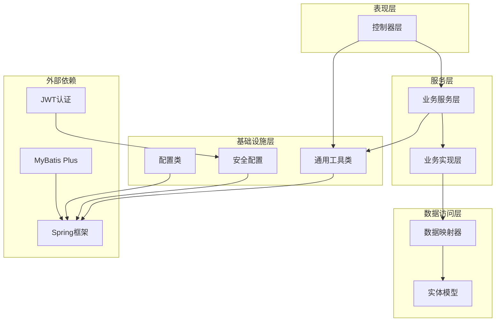
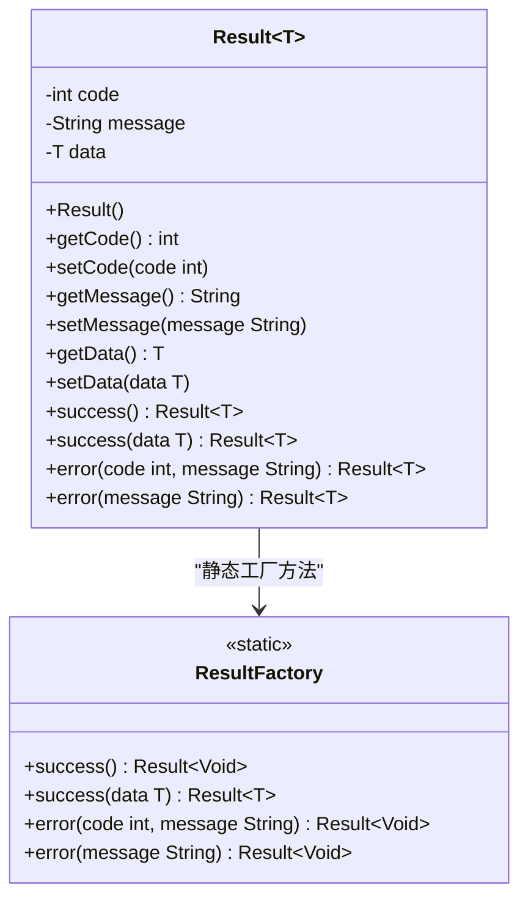
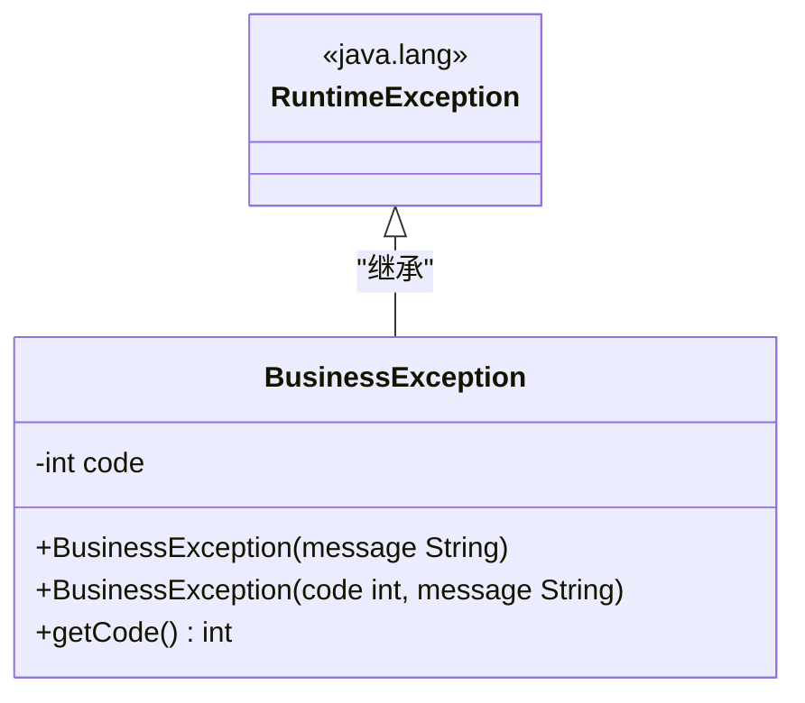
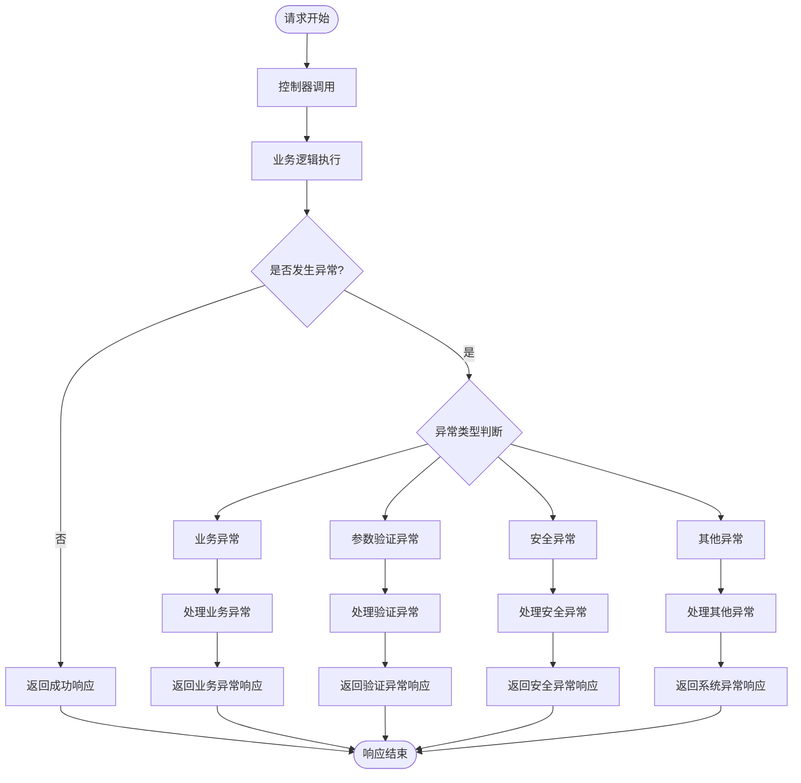
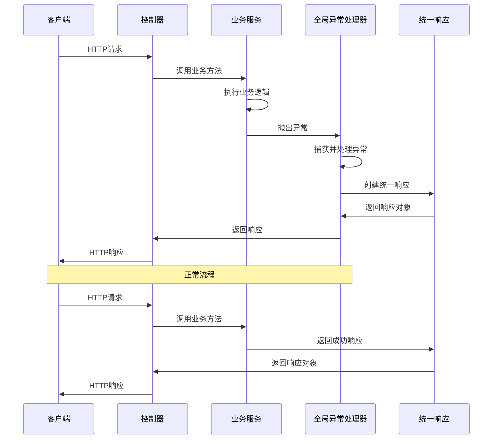
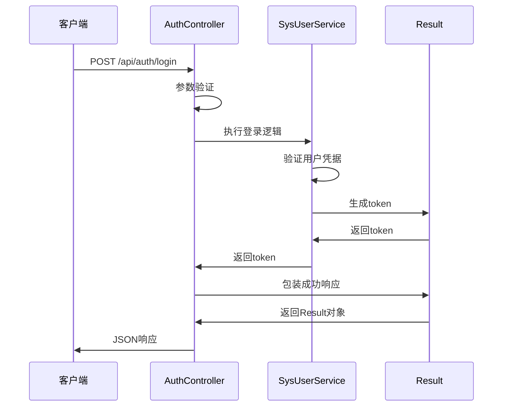
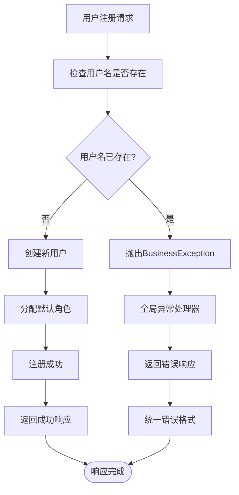
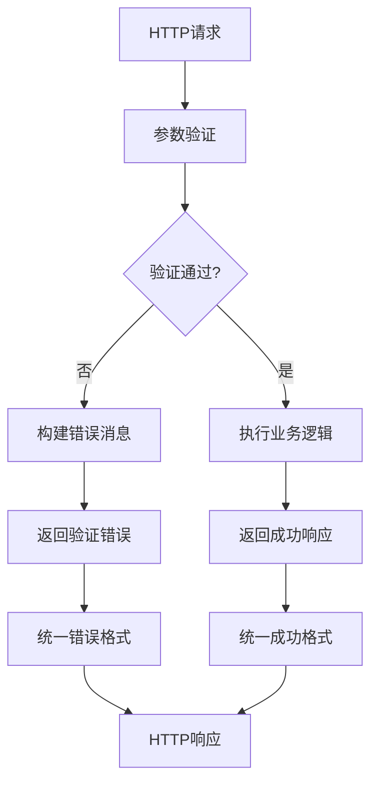
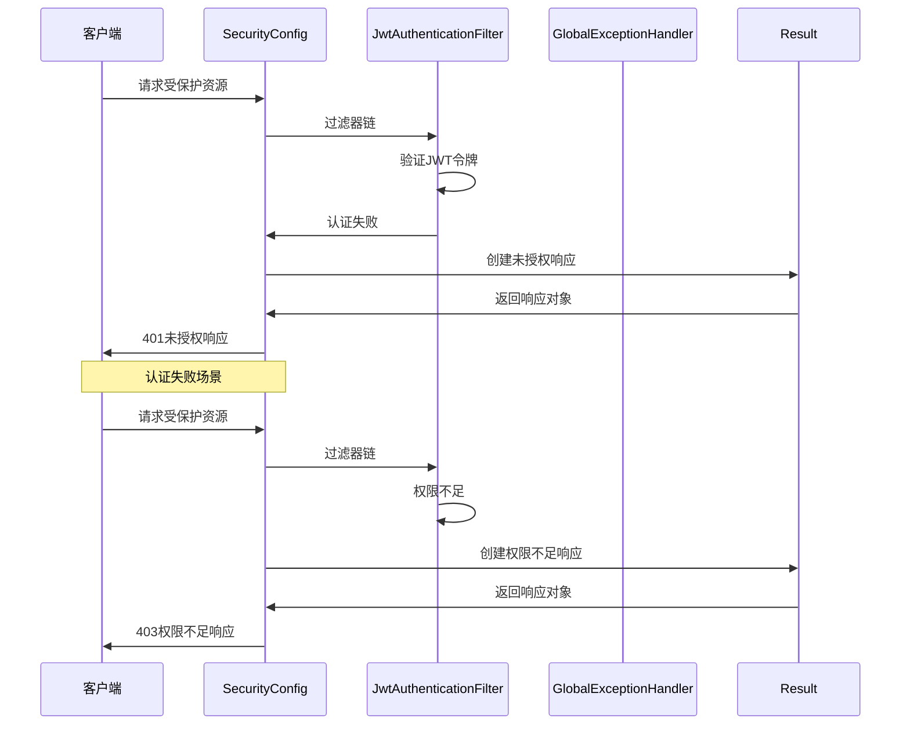
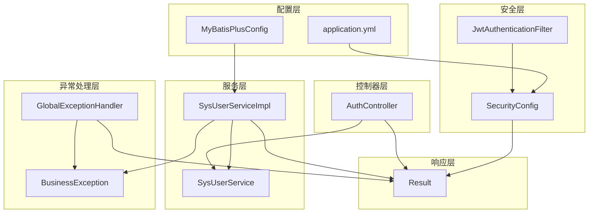

# 统一响应格式

<cite>
**本文档引用的文件**
- [Result.java](file://src/main/java/com/bookorder/common/Result.java)
- [BusinessException.java](file://src/main/java/com/bookorder/common/BusinessException.java)
- [GlobalExceptionHandler.java](file://src/main/java/com/bookorder/common/GlobalExceptionHandler.java)
- [AuthController.java](file://src/main/java/com/bookorder/controller/AuthController.java)
- [SysUserServiceImpl.java](file://src/main/java/com/bookorder/service/impl/SysUserServiceImpl.java)
- [LoginRequest.java](file://src/main/java/com/bookorder/dto/LoginRequest.java)
- [RegisterRequest.java](file://src/main/java/com/bookorder/dto/RegisterRequest.java)
- [UserInfoVO.java](file://src/main/java/com/bookorder/dto/UserInfoVO.java)
- [JwtAuthenticationFilter.java](file://src/main/java/com/bookorder/security/JwtAuthenticationFilter.java)
- [SecurityConfig.java](file://src/main/java/com/bookorder/config/SecurityConfig.java)
- [MyBatisPlusConfig.java](file://src/main/java/com/bookorder/config/MyBatisPlusConfig.java)
- [application.yml](file://src/main/resources/application.yml)
- [init.sql](file://sql/init.sql)
</cite>

## 目录
1. [简介](#简介)
2. [项目结构](#项目结构)
3. [核心组件](#核心组件)
4. [架构概览](#架构概览)
5. [详细组件分析](#详细组件分析)
6. [依赖关系分析](#依赖关系分析)
7. [性能考虑](#性能考虑)
8. [故障排除指南](#故障排除指南)
9. [结论](#结论)
10. [附录](#附录)

## 简介

本项目实现了统一的API响应格式系统，通过标准化的响应结构确保前后端交互的一致性和可靠性。该系统包含三个核心组件：Result统一响应类、BusinessException业务异常类和GlobalExceptionHandler全局异常处理器。

统一响应格式的设计目标是：
- 提供一致的API响应结构
- 支持业务异常和系统异常的分类处理
- 确保客户端能够统一解析响应数据
- 便于调试和问题排查
- 保持向后兼容性和扩展性

## 项目结构

项目采用分层架构设计，主要分为以下层次：



**图表来源**
- [AuthController.java:18-59](file://src/main/java/com/bookorder/controller/AuthController.java#L18-L59)
- [SysUserServiceImpl.java:22-87](file://src/main/java/com/bookorder/service/impl/SysUserServiceImpl.java#L22-L87)
- [Result.java:3-41](file://src/main/java/com/bookorder/common/Result.java#L3-L41)

**章节来源**
- [application.yml:1-33](file://src/main/resources/application.yml#L1-L33)
- [SecurityConfig.java:23-74](file://src/main/java/com/bookorder/config/SecurityConfig.java#L23-L74)

## 核心组件

### Result统一响应类

Result类是整个统一响应系统的核心，提供了泛型化的响应封装机制。

#### 数据结构设计



**图表来源**
- [Result.java:3-41](file://src/main/java/com/bookorder/common/Result.java#L3-L41)

#### 响应格式规范

统一响应格式包含三个核心字段：
- **code**: HTTP状态码风格的业务状态码
- **message**: 人类可读的响应消息
- **data**: 泛型化的业务数据对象

响应格式示例：
```json
{
  "code": 200,
  "message": "success",
  "data": {}
}
```

**章节来源**
- [Result.java:3-41](file://src/main/java/com/bookorder/common/Result.java#L3-L41)

### BusinessException业务异常

BusinessException继承自RuntimeException，专门用于表示业务层面的异常情况。

#### 异常设计理念



**图表来源**
- [BusinessException.java:3-19](file://src/main/java/com/bookorder/common/BusinessException.java#L3-L19)

#### 错误码定义

系统采用HTTP状态码风格的错误码设计：
- **2xx**: 成功状态（如200）
- **4xx**: 客户端错误（如400, 401, 403）
- **5xx**: 服务器错误（如500）

**章节来源**
- [BusinessException.java:3-19](file://src/main/java/com/bookorder/common/BusinessException.java#L3-L19)

### GlobalExceptionHandler全局异常处理器

全局异常处理器负责捕获和处理应用中的各种异常类型。

#### 异常处理策略



**图表来源**
- [GlobalExceptionHandler.java:17-62](file://src/main/java/com/bookorder/common/GlobalExceptionHandler.java#L17-L62)

**章节来源**
- [GlobalExceptionHandler.java:17-62](file://src/main/java/com/bookorder/common/GlobalExceptionHandler.java#L17-L62)

## 架构概览

系统采用MVC架构模式，结合Spring Boot的自动配置特性，实现了完整的API响应处理链路。



**图表来源**
- [AuthController.java:28-57](file://src/main/java/com/bookorder/controller/AuthController.java#L28-L57)
- [GlobalExceptionHandler.java:22-60](file://src/main/java/com/bookorder/common/GlobalExceptionHandler.java#L22-L60)

**章节来源**
- [SecurityConfig.java:34-62](file://src/main/java/com/bookorder/config/SecurityConfig.java#L34-L62)

## 详细组件分析

### 控制器层响应处理

AuthController展示了统一响应格式在实际业务中的应用。

#### 登录接口响应



**图表来源**
- [AuthController.java:28-32](file://src/main/java/com/bookorder/controller/AuthController.java#L28-L32)
- [SysUserServiceImpl.java:50-55](file://src/main/java/com/bookorder/service/impl/SysUserServiceImpl.java#L50-L55)

#### 注册接口响应

注册接口展示了如何处理无数据返回的成功响应。

**章节来源**
- [AuthController.java:34-38](file://src/main/java/com/bookorder/controller/AuthController.java#L34-L38)
- [SysUserServiceImpl.java:58-80](file://src/main/java/com/bookorder/service/impl/SysUserServiceImpl.java#L58-L80)

### 业务异常处理机制

业务异常的抛出和处理体现了统一响应系统的核心价值。

#### 用户名重复异常处理



**图表来源**
- [SysUserServiceImpl.java:60-62](file://src/main/java/com/bookorder/service/impl/SysUserServiceImpl.java#L60-L62)
- [GlobalExceptionHandler.java:22-26](file://src/main/java/com/bookorder/common/GlobalExceptionHandler.java#L22-L26)

**章节来源**
- [SysUserServiceImpl.java:60-62](file://src/main/java/com/bookorder/service/impl/SysUserServiceImpl.java#L60-L62)
- [GlobalExceptionHandler.java:22-26](file://src/main/java/com/bookorder/common/GlobalExceptionHandler.java#L22-L26)

### 参数验证与响应

系统使用Bean Validation进行参数验证，并将验证结果转换为统一的响应格式。

#### 参数验证流程



**图表来源**
- [LoginRequest.java:7-11](file://src/main/java/com/bookorder/dto/LoginRequest.java#L7-L11)
- [RegisterRequest.java:8-14](file://src/main/java/com/bookorder/dto/RegisterRequest.java#L8-L14)
- [GlobalExceptionHandler.java:40-47](file://src/main/java/com/bookorder/common/GlobalExceptionHandler.java#L40-L47)

**章节来源**
- [LoginRequest.java:7-11](file://src/main/java/com/bookorder/dto/LoginRequest.java#L7-L11)
- [RegisterRequest.java:8-14](file://src/main/java/com/bookorder/dto/RegisterRequest.java#L8-L14)
- [GlobalExceptionHandler.java:40-47](file://src/main/java/com/bookorder/common/GlobalExceptionHandler.java#L40-L47)

### 安全异常处理

系统集成了JWT认证机制，安全异常的处理确保了统一的响应格式。

#### 认证异常处理



**图表来源**
- [SecurityConfig.java:43-58](file://src/main/java/com/bookorder/config/SecurityConfig.java#L43-L58)
- [JwtAuthenticationFilter.java:28-46](file://src/main/java/com/bookorder/security/JwtAuthenticationFilter.java#L28-L46)
- [GlobalExceptionHandler.java:28-38](file://src/main/java/com/bookorder/common/GlobalExceptionHandler.java#L28-L38)

**章节来源**
- [SecurityConfig.java:43-58](file://src/main/java/com/bookorder/config/SecurityConfig.java#L43-L58)
- [JwtAuthenticationFilter.java:28-46](file://src/main/java/com/bookorder/security/JwtAuthenticationFilter.java#L28-L46)
- [GlobalExceptionHandler.java:28-38](file://src/main/java/com/bookorder/common/GlobalExceptionHandler.java#L28-L38)

## 依赖关系分析

系统各组件之间的依赖关系体现了清晰的分层架构。



**图表来源**
- [AuthController.java:22-27](file://src/main/java/com/bookorder/controller/AuthController.java#L22-L27)
- [SysUserServiceImpl.java:23-42](file://src/main/java/com/bookorder/service/impl/SysUserServiceImpl.java#L23-L42)
- [GlobalExceptionHandler.java:17-13](file://src/main/java/com/bookorder/common/GlobalExceptionHandler.java#L17-L13)

**章节来源**
- [AuthController.java:22-27](file://src/main/java/com/bookorder/controller/AuthController.java#L22-L27)
- [SysUserServiceImpl.java:23-42](file://src/main/java/com/bookorder/service/impl/SysUserServiceImpl.java#L23-L42)
- [GlobalExceptionHandler.java:17-13](file://src/main/java/com/bookorder/common/GlobalExceptionHandler.java#L17-L13)

### 外部依赖关系

系统依赖的关键外部组件包括：

- **Spring Framework**: 提供依赖注入、AOP、事务管理等核心功能
- **MyBatis Plus**: 提供ORM映射和数据库操作
- **JWT**: 提供令牌认证机制
- **BCrypt**: 提供密码加密功能

**章节来源**
- [SecurityConfig.java:64-72](file://src/main/java/com/bookorder/config/SecurityConfig.java#L64-L72)
- [MyBatisPlusConfig.java:9-22](file://src/main/java/com/bookorder/config/MyBatisPlusConfig.java#L9-L22)

## 性能考虑

统一响应格式在设计时充分考虑了性能影响和优化策略。

### 响应序列化性能

- 使用泛型避免不必要的类型转换
- 统一的响应结构减少客户端解析复杂度
- 静态工厂方法提供高效的响应创建

### 异常处理性能

- 全局异常处理器集中处理，避免重复代码
- 日志记录采用异步方式，减少阻塞
- 异常信息按级别记录，避免过度日志输出

### 缓存策略

- 对于频繁访问的查询结果可以考虑缓存
- JWT令牌验证结果可以短期缓存
- 配置信息可以本地缓存

## 故障排除指南

### 常见问题诊断

#### 响应格式不一致

**症状**: 客户端收到不同格式的响应

**解决方案**:
1. 检查所有控制器方法是否使用Result包装响应
2. 确认全局异常处理器正确处理各类异常
3. 验证业务异常的错误码设置

#### 参数验证失败

**症状**: 参数验证异常导致400错误

**解决方案**:
1. 检查DTO类上的验证注解配置
2. 确认请求体格式符合预期
3. 查看验证错误消息的具体内容

#### 认证失败

**症状**: 401未授权或403权限不足

**解决方案**:
1. 检查JWT令牌的有效性和格式
2. 验证用户权限配置
3. 确认安全过滤器链配置正确

### 调试技巧

#### 启用详细日志

在application.yml中启用调试日志：
```yaml
logging:
  level:
    com.bookorder: debug
```

#### 异常追踪

全局异常处理器会记录详细的异常信息，便于问题定位。

**章节来源**
- [application.yml:30-33](file://src/main/resources/application.yml#L30-L33)
- [GlobalExceptionHandler.java:24-59](file://src/main/java/com/bookorder/common/GlobalExceptionHandler.java#L24-L59)

## 结论

统一响应格式系统通过标准化的API响应结构，显著提升了系统的可维护性和用户体验。该系统的主要优势包括：

1. **一致性**: 所有API响应遵循相同的格式规范
2. **可扩展性**: 泛型设计支持不同类型的数据封装
3. **可维护性**: 集中的异常处理机制简化了错误管理
4. **可观测性**: 标准化的响应格式便于监控和调试
5. **兼容性**: HTTP状态码风格的错误码确保与现有工具的兼容

通过合理的架构设计和完善的异常处理机制，该系统为后续的功能扩展和维护奠定了坚实的基础。

## 附录

### 响应格式规范

#### 成功响应格式
```json
{
  "code": 200,
  "message": "success",
  "data": {}
}
```

#### 错误响应格式
```json
{
  "code": 400,
  "message": "用户名已存在",
  "data": null
}
```

### 错误码参考

- **200**: 操作成功
- **400**: 参数验证失败
- **401**: 未登录或token无效
- **403**: 权限不足
- **500**: 系统内部错误

### 版本兼容性考虑

系统设计时考虑了以下兼容性因素：
- 保持响应格式的向后兼容
- 错误码的稳定性和可预测性
- 渐进式功能升级策略
- 文档化的变更历史