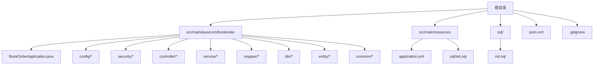
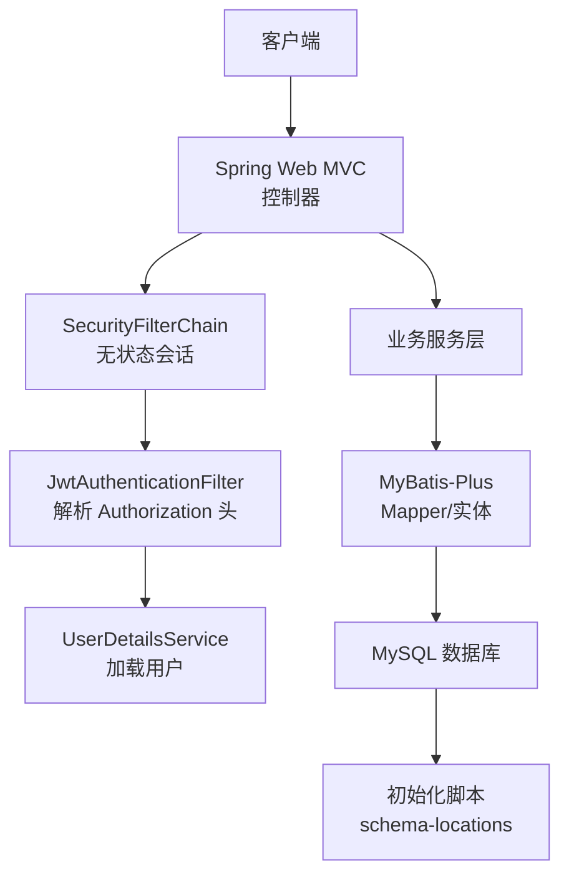
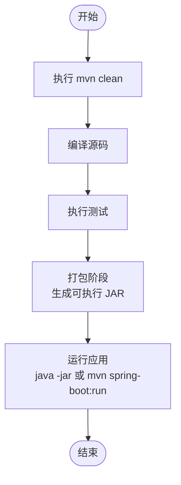
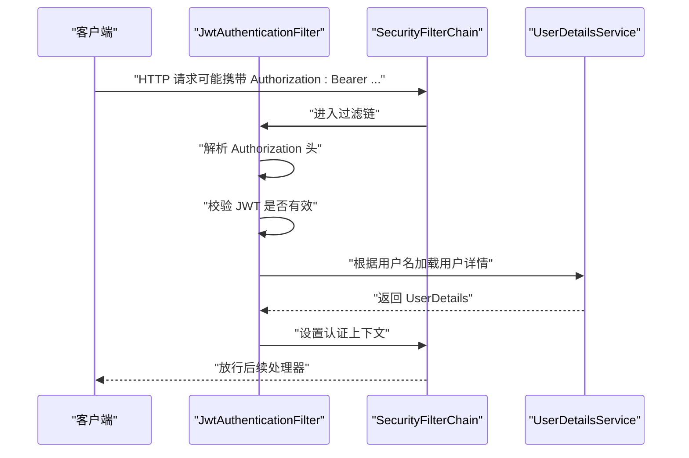
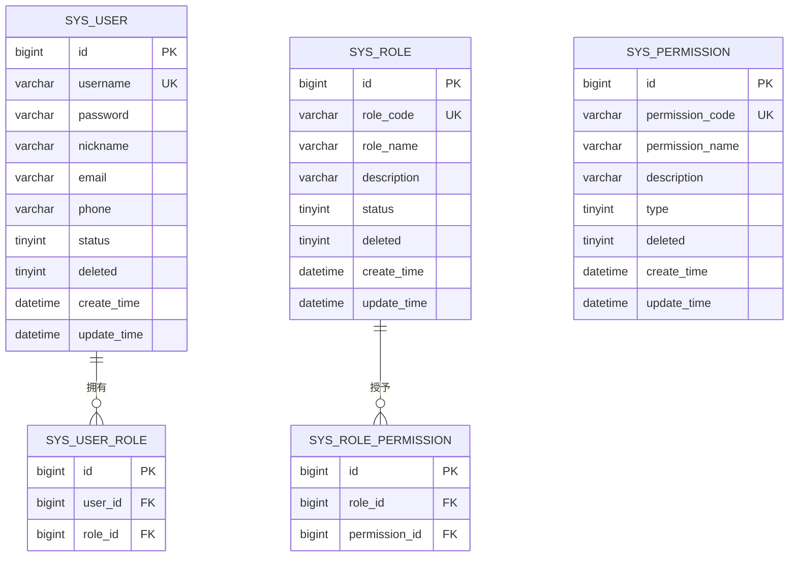
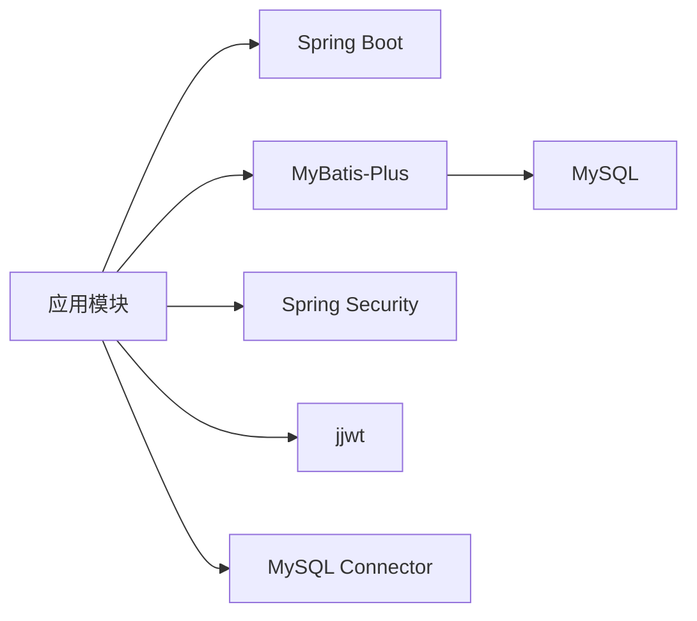

# 打包部署

<cite>
**本文引用的文件**
- [pom.xml](file://pom.xml)
- [application.yml](file://src/main/resources/application.yml)
- [init.sql](file://sql/init.sql)
- [README.md](file://README.md)
- [BookOrderApplication.java](file://src/main/java/com/bookorder/BookOrderApplication.java)
- [SecurityConfig.java](file://src/main/java/com/bookorder/config/SecurityConfig.java)
- [MyBatisPlusConfig.java](file://src/main/java/com/bookorder/config/MyBatisPlusConfig.java)
- [JwtUtil.java](file://src/main/java/com/bookorder/security/JwtUtil.java)
- [.gitignore](file://.gitignore)
</cite>

## 目录
1. [简介](#简介)
2. [项目结构](#项目结构)
3. [核心组件](#核心组件)
4. [架构总览](#架构总览)
5. [详细组件分析](#详细组件分析)
6. [依赖分析](#依赖分析)
7. [性能考虑](#性能考虑)
8. [故障排查指南](#故障排查指南)
9. [结论](#结论)
10. [附录](#附录)

## 简介
本指南面向图书订单系统（基于 Spring Boot 3 + Java 17 + Maven）的打包与部署，覆盖以下主题：
- Maven 构建与依赖管理：构建生命周期、插件配置、打包产物与运行方式
- Docker 容器化：镜像构建、运行参数与环境变量
- Kubernetes 部署：Deployment、Service、ConfigMap/Secret 的基础配置思路
- JAR 包独立部署与传统服务器部署
- 版本管理与发布策略、回滚机制
- 部署前检查清单与部署后验证步骤

## 项目结构
该仓库采用标准 Maven 结构，核心源码位于 src/main/java 与 src/main/resources，配置集中在 application.yml，初始化 SQL 在 sql/ 与 resources/sql 下。

图表来源
- [BookOrderApplication.java:1-15](file://src/main/java/com/bookorder/BookOrderApplication.java#L1-L15)
- [application.yml:1-33](file://src/main/resources/application.yml#L1-L33)
- [init.sql:1-124](file://sql/init.sql#L1-L124)
- [pom.xml:1-95](file://pom.xml#L1-L95)

章节来源
- [pom.xml:1-95](file://pom.xml#L1-L95)
- [application.yml:1-33](file://src/main/resources/application.yml#L1-L33)
- [init.sql:1-124](file://sql/init.sql#L1-L124)
- [README.md:1-168](file://README.md#L1-L168)

## 核心组件
- 应用入口与扫描：应用主类负责启动与 Mapper 扫描，确保 MyBatis-Plus 能发现 Mapper 接口。
- 安全配置：基于 Spring Security 的无状态认证，开放登录/注册端点，其余请求需鉴权；统一异常处理返回 JSON。
- 数据访问层：通过 MyBatis-Plus 与 MySQL 交互，启用逻辑删除与自动填充时间字段。
- JWT：生成与校验 Token，从 Authorization 头解析 Bearer Token 并注入认证上下文。
- 初始化脚本：首次启动自动创建数据库、表与默认角色/权限/用户数据。

章节来源
- [BookOrderApplication.java:1-15](file://src/main/java/com/bookorder/BookOrderApplication.java#L1-L15)
- [SecurityConfig.java:1-74](file://src/main/java/com/bookorder/config/SecurityConfig.java#L1-L74)
- [MyBatisPlusConfig.java:1-23](file://src/main/java/com/bookorder/config/MyBatisPlusConfig.java#L1-L23)
- [JwtUtil.java:1-62](file://src/main/java/com/bookorder/security/JwtUtil.java#L1-L62)
- [application.yml:1-33](file://src/main/resources/application.yml#L1-L33)

## 架构总览
下图展示应用启动与请求处理的关键路径，包括安全过滤链、JWT 解析与数据库初始化。

图表来源
- [SecurityConfig.java:34-62](file://src/main/java/com/bookorder/config/SecurityConfig.java#L34-L62)
- [JwtAuthenticationFilter.java:28-46](file://src/main/java/com/bookorder/security/JwtAuthenticationFilter.java#L28-L46)
- [application.yml:10-13](file://src/main/resources/application.yml#L10-L13)

## 详细组件分析

### Maven 构建与打包
- 构建工具：Maven 3.8+，Java 17，Spring Boot 3.2.5
- 依赖管理：使用 Spring Boot Starter 与第三方组件（MyBatis-Plus、MySQL 驱动、JWT）
- 插件配置：spring-boot-maven-plugin 提供可执行 JAR 打包与运行支持
- 打包产物：单个可执行 JAR（包含内嵌 Tomcat），可通过 java -jar 或 mvn spring-boot:run 启动

章节来源
- [pom.xml:26-84](file://pom.xml#L26-L84)
- [pom.xml:86-93](file://pom.xml#L86-L93)
- [README.md:44-46](file://README.md#L44-L46)

### 配置与环境变量
- 服务器端口：默认 8080
- 数据源：MySQL 地址、用户名、密码、驱动类名
- 初始化：自动执行 classpath:sql/init.sql
- MyBatis-Plus：下划线转驼峰、日志输出、逻辑删除字段
- JWT：密钥与过期时间
- 日志：按包输出调试级别

章节来源
- [application.yml:1-33](file://src/main/resources/application.yml#L1-L33)

### 安全与认证流程

图表来源
- [SecurityConfig.java:34-62](file://src/main/java/com/bookorder/config/SecurityConfig.java#L34-L62)
- [JwtAuthenticationFilter.java:28-46](file://src/main/java/com/bookorder/security/JwtAuthenticationFilter.java#L28-L46)

章节来源
- [SecurityConfig.java:1-74](file://src/main/java/com/bookorder/config/SecurityConfig.java#L1-L74)
- [JwtUtil.java:1-62](file://src/main/java/com/bookorder/security/JwtUtil.java#L1-L62)

### 数据初始化与实体模型
- 初始化脚本：创建数据库、表与默认数据（角色、权限、用户）
- 逻辑删除：deleted 字段用于软删除
- 自动填充：创建/更新时间自动写入

图表来源
- [init.sql:11-70](file://sql/init.sql#L11-L70)
- [init.sql:76-124](file://sql/init.sql#L76-L124)

章节来源
- [MyBatisPlusConfig.java:10-22](file://src/main/java/com/bookorder/config/MyBatisPlusConfig.java#L10-L22)
- [application.yml:15-28](file://src/main/resources/application.yml#L15-L28)

## 依赖分析
- Spring Boot：提供自动装配、嵌入式 Web 服务器与安全框架
- MyBatis-Plus：简化 ORM 与分页、逻辑删除、自动填充
- MySQL Connector：数据库驱动
- JWT：Token 生成与解析
- Spring Security：认证与授权、无状态会话策略

图表来源
- [pom.xml:26-84](file://pom.xml#L26-L84)

章节来源
- [pom.xml:1-95](file://pom.xml#L1-L95)

## 性能考虑
- 无状态认证：减少服务器端会话存储开销
- 日志级别：生产建议调整为 INFO 或 WARN，避免过度输出
- 数据库连接池：可结合实际压测调优（本项目未显式声明）
- JVM 参数：建议在容器/服务器中设置合适的堆大小与 GC 策略

## 故障排查指南
- 启动失败（端口占用）：确认 server.port 未被占用或在运行参数中调整
- 数据库连接失败：核对 application.yml 中的数据库 URL、用户名、密码
- 初始化失败：确认 schema-locations 指向正确且 SQL 文件存在
- JWT 校验失败：确认 jwt.secret 与 jwt.expiration 配置一致，且客户端携带正确的 Bearer Token
- 权限不足：确认用户角色与权限映射是否正确，以及请求路径是否受保护

章节来源
- [application.yml:1-33](file://src/main/resources/application.yml#L1-L33)
- [SecurityConfig.java:43-58](file://src/main/java/com/bookorder/config/SecurityConfig.java#L43-L58)
- [JwtUtil.java:45-52](file://src/main/java/com/bookorder/security/JwtUtil.java#L45-L52)

## 结论
本项目以 Spring Boot 为基础，具备清晰的构建与运行方式。通过 Maven 可快速打包为可执行 JAR，配合 Docker 可实现容器化部署；结合 Kubernetes 的 Deployment/Service/ConfigMap/Secret 可完成云原生部署。生产环境建议完善配置外置、健康检查、滚动更新与回滚策略，并建立完善的版本发布与验证流程。

## 附录

### A. Maven 构建与部署流程
- 本地构建
  - 清理并编译：mvn clean compile
  - 打包：mvn package
  - 运行：java -jar target/<your-artifact>.jar
  - 或直接运行：mvn spring-boot:run
- 产物位置：target 目录下的可执行 JAR
- 依赖范围：运行时依赖由 spring-boot-maven-plugin 封装进最终 JAR

章节来源
- [pom.xml:86-93](file://pom.xml#L86-L93)
- [README.md:44-46](file://README.md#L44-L46)
- [.gitignore:2-6](file://.gitignore#L2-L6)

### B. Docker 容器化部署
- 基础镜像选择：官方 OpenJDK 17（如 alpine 版本更小）
- 构建步骤
  - 复制并打包：将 Maven 产物复制至镜像
  - 设置工作目录与用户（非 root 更佳）
  - 暴露端口 8080
  - 健康检查：GET /actuator/health（如启用 actuator）
  - 启动命令：java -jar app.jar
- 环境变量
  - JAVA_OPTS：JVM 参数
  - SPRING_PROFILES_ACTIVE：激活配置文件
  - 数据库连接：SPRING_DATASOURCE_URL/USERNAME/PASSWORD
  - JWT 密钥与过期：JWT_SECRET/JWT_EXPIRATION
- 常见优化
  - 多阶段构建减小镜像体积
  - 使用只读根文件系统与最小权限
  - 启用 jvm 配置与 GC 调优

[本节为通用实践说明，不直接对应具体源文件]

### C. Kubernetes 部署配置思路
- ConfigMap：存放 application.yml 的部分键值（如数据库连接、JWT 配置）
- Secret：存放敏感信息（数据库密码、JWT 密钥）
- Deployment：副本数、资源限制、滚动更新策略（maxUnavailable/maxSurge）
- Service：ClusterIP/NodePort/LoadBalancer，暴露 8080
- Pod 健康检查：liveness/readiness 探针指向 /actuator/health
- Ingress：若需要域名与 TLS

[本节为通用实践说明，不直接对应具体源文件]

### D. JAR 包独立部署与传统服务器
- 服务器要求：JDK 17、可用端口 8080、MySQL 8.0+
- 步骤
  - 准备 application.yml（或通过外部 ConfigMap/挂载）
  - 上传可执行 JAR 至目标服务器
  - 以 nohup 或 systemd 方式启动
  - 配置防火墙放行 8080
- 注意事项
  - 确保时区与字符集与 init.sql 一致
  - 生产环境建议使用进程管理器与日志切割

[本节为通用实践说明，不直接对应具体源文件]

### E. 版本管理与发布策略、回滚机制
- 版本号：建议遵循语义化版本（主.次.修订），在 pom.xml 中维护
- 发布策略
  - 分支策略：main/release/develop
  - Tag：发布时打 Tag
  - CI：自动化构建、测试、打包、推送镜像
- 回滚
  - 容器化：回滚到上一个镜像标签
  - 传统服务器：保留上一个版本 JAR，替换后快速回退
  - 数据库：如涉及结构变更，准备回滚 SQL

[本节为通用实践说明，不直接对应具体源文件]

### F. 部署前检查清单
- 代码与配置
  - 确认 application.yml 中数据库连接、JWT 配置正确
  - 确认端口未被占用
- 构建与打包
  - mvn clean package 成功
  - 可执行 JAR 可本地运行
- 数据库
  - MySQL 可连通
  - 初始化脚本可执行
- 安全
  - JWT 密钥强度足够
  - 防火墙仅开放必要端口
- 容器/K8s
  - 镜像构建成功
  - ConfigMap/Secret 正确挂载
  - 健康检查可达

[本节为通用实践说明，不直接对应具体源文件]

### G. 部署后验证步骤
- 基础连通性
  - curl 访问 /actuator/health（如启用）
  - 浏览器访问首页端点
- 功能验证
  - 登录接口：POST /api/auth/login
  - 注册接口：POST /api/auth/register
  - 获取当前用户：GET /api/auth/me（携带 Bearer Token）
- 数据一致性
  - 校验默认管理员是否存在
  - 校验角色/权限映射是否正确

[本节为通用实践说明，不直接对应具体源文件]