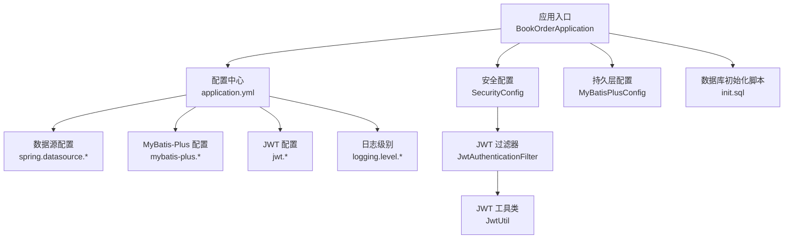
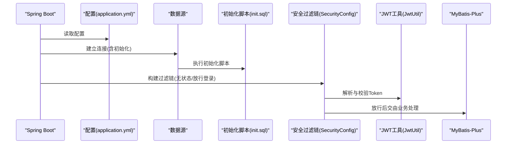
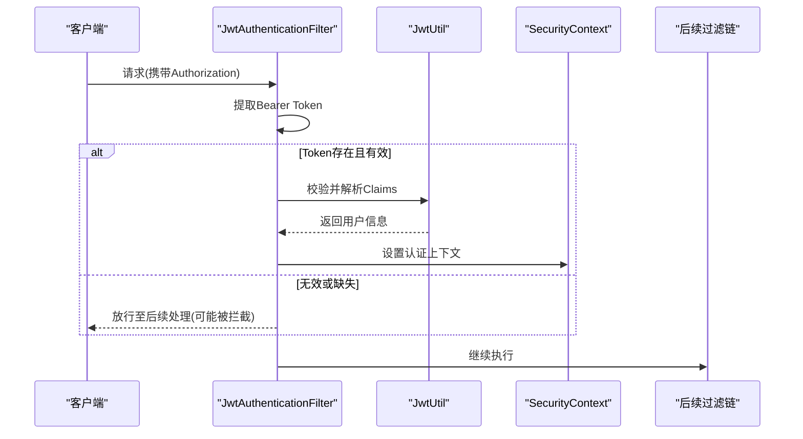
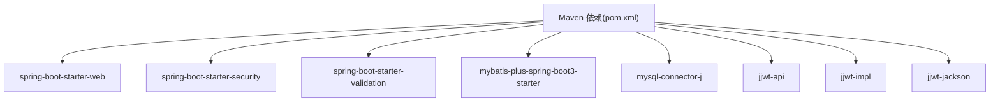

# 环境配置

<cite>
**本文引用的文件**
- [application.yml](file://src/main/resources/application.yml)
- [MyBatisPlusConfig.java](file://src/main/java/com/bookorder/config/MyBatisPlusConfig.java)
- [SecurityConfig.java](file://src/main/java/com/bookorder/config/SecurityConfig.java)
- [JwtUtil.java](file://src/main/java/com/bookorder/security/JwtUtil.java)
- [JwtAuthenticationFilter.java](file://src/main/java/com/bookorder/security/JwtAuthenticationFilter.java)
- [pom.xml](file://pom.xml)
- [init.sql](file://sql/init.sql)
- [README.md](file://README.md)
</cite>

## 目录
1. [简介](#简介)
2. [项目结构](#项目结构)
3. [核心组件](#核心组件)
4. [架构总览](#架构总览)
5. [详细组件分析](#详细组件分析)
6. [依赖分析](#依赖分析)
7. [性能考虑](#性能考虑)
8. [故障排查指南](#故障排查指南)
9. [结论](#结论)
10. [附录](#附录)

## 简介
本文件面向生产环境，系统化梳理该系统的环境配置与优化策略，重点覆盖以下方面：
- 数据库连接配置与初始化脚本
- JWT 密钥与过期时间配置
- 日志级别配置与输出控制
- 开发/测试/生产环境差异与切换方法
- 数据库连接池参数调优建议
- MyBatis-Plus 配置优化要点
- Spring Boot 应用属性配置最佳实践
- 配置文件安全性检查清单与敏感信息保护
- 环境变量使用与配置覆盖机制

## 项目结构
该系统采用标准 Spring Boot 结构，配置集中在 application.yml 中，数据库初始化脚本位于 sql/init.sql。核心安全与持久层配置分别在 SecurityConfig 与 MyBatisPlusConfig 中体现。

图示来源
- [application.yml:1-33](file://src/main/resources/application.yml#L1-L33)
- [SecurityConfig.java:23-74](file://src/main/java/com/bookorder/config/SecurityConfig.java#L23-L74)
- [JwtAuthenticationFilter.java:19-56](file://src/main/java/com/bookorder/security/JwtAuthenticationFilter.java#L19-L56)
- [JwtUtil.java:13-62](file://src/main/java/com/bookorder/security/JwtUtil.java#L13-L62)
- [MyBatisPlusConfig.java:9-23](file://src/main/java/com/bookorder/config/MyBatisPlusConfig.java#L9-L23)
- [init.sql:1-124](file://sql/init.sql#L1-L124)

章节来源
- [application.yml:1-33](file://src/main/resources/application.yml#L1-L33)
- [README.md:1-168](file://README.md#L1-L168)

## 核心组件
- 数据库连接与初始化：通过 spring.datasource.* 与 spring.sql.init.* 完成连接串、用户名、密码、驱动以及初始化脚本位置的配置；首次启动会按配置执行初始化脚本。
- MyBatis-Plus：启用下划线转驼峰映射，开启标准输出日志，并配置逻辑删除字段与全局 ID 策略。
- JWT：从配置读取密钥与过期时间，用于生成与校验令牌。
- 安全过滤链：禁用 CSRF，状态无关，开放认证接口，其余请求需鉴权；未登录/权限不足返回统一 JSON 错误。
- 日志级别：将包 com.bookorder 的日志级别设为调试级别，便于问题定位。

章节来源
- [application.yml:4-32](file://src/main/resources/application.yml#L4-L32)
- [MyBatisPlusConfig.java:9-23](file://src/main/java/com/bookorder/config/MyBatisPlusConfig.java#L9-L23)
- [SecurityConfig.java:23-74](file://src/main/java/com/bookorder/config/SecurityConfig.java#L23-L74)
- [JwtUtil.java:13-62](file://src/main/java/com/bookorder/security/JwtUtil.java#L13-L62)

## 架构总览
下图展示生产环境关键配置如何影响运行时行为：应用启动加载配置 → 连接数据库并初始化 → 启动安全过滤链 → 处理请求时进行 JWT 校验 → ORM 层按配置执行 SQL。

图示来源
- [application.yml:4-32](file://src/main/resources/application.yml#L4-L32)
- [init.sql:1-124](file://sql/init.sql#L1-L124)
- [SecurityConfig.java:34-62](file://src/main/java/com/bookorder/config/SecurityConfig.java#L34-L62)
- [JwtUtil.java:27-43](file://src/main/java/com/bookorder/security/JwtUtil.java#L27-L43)
- [MyBatisPlusConfig.java:9-23](file://src/main/java/com/bookorder/config/MyBatisPlusConfig.java#L9-L23)

## 详细组件分析

### 数据库连接配置
- 连接串、用户名、密码、驱动类均来自配置文件，确保与目标数据库一致。
- 初始化模式与脚本路径配置，保证首次启动自动建库建表并插入默认数据。
- 生产建议：
  - 使用只读账户用于查询，写入账户单独分离。
  - 开启连接池健康检查与超时配置。
  - 使用 SSL 连接数据库，避免明文传输。
  - 将敏感信息放入环境变量或密管系统，不直接写入仓库。

章节来源
- [application.yml:4-13](file://src/main/resources/application.yml#L4-L13)
- [init.sql:1-124](file://sql/init.sql#L1-L124)

### MyBatis-Plus 配置
- 下划线转驼峰映射提升实体命名一致性。
- 开启标准输出日志便于开发阶段排查 SQL。
- 全局逻辑删除字段与值定义，配合实体字段实现软删除。
- 全局 ID 自增策略，简化主键生成。
- 生产建议：
  - 关闭标准输出日志，改用结构化日志与集中式日志平台。
  - 对复杂 SQL 使用分页与索引优化，避免 N+1。
  - 合理设置批量提交大小与超时时间。

章节来源
- [application.yml:15-24](file://src/main/resources/application.yml#L15-L24)
- [MyBatisPlusConfig.java:9-23](file://src/main/java/com/bookorder/config/MyBatisPlusConfig.java#L9-L23)

### JWT 配置与安全过滤
- 密钥与过期时间从配置读取，密钥以 Base64 字符串形式存储。
- 过滤器解析 Authorization 头中的 Bearer Token，校验通过后注入认证上下文。
- 安全配置禁用 CSRF，会话策略为无状态，开放登录注册接口，其余接口需鉴权。
- 生产建议：
  - 密钥必须足够随机且长度符合安全要求，定期轮换。
  - 设置合理的过期时间与刷新策略，避免长期有效令牌。
  - 在网关层统一处理跨域与安全头，增强防护。

图示来源
- [JwtAuthenticationFilter.java:28-46](file://src/main/java/com/bookorder/security/JwtAuthenticationFilter.java#L28-L46)
- [JwtUtil.java:27-43](file://src/main/java/com/bookorder/security/JwtUtil.java#L27-L43)
- [SecurityConfig.java:34-62](file://src/main/java/com/bookorder/config/SecurityConfig.java#L34-L62)

章节来源
- [application.yml:26-28](file://src/main/resources/application.yml#L26-L28)
- [JwtUtil.java:13-62](file://src/main/java/com/bookorder/security/JwtUtil.java#L13-L62)
- [JwtAuthenticationFilter.java:19-56](file://src/main/java/com/bookorder/security/JwtAuthenticationFilter.java#L19-L56)
- [SecurityConfig.java:23-74](file://src/main/java/com/bookorder/config/SecurityConfig.java#L23-L74)

### 日志级别配置
- 将 com.bookorder 包的日志级别设为调试，便于开发与联调。
- 生产建议：
  - 将日志级别调整为 INFO 或 WARN，减少开销。
  - 使用结构化日志(JSON)，配合日志收集与检索平台。
  - 对敏感字段脱敏，避免日志泄露。

章节来源
- [application.yml:30-32](file://src/main/resources/application.yml#L30-L32)

### 环境差异与切换
- 不同环境的差异主要体现在数据库连接、JWT 密钥、日志级别与安全策略上。
- 切换方式建议：
  - 使用 Spring Profile 切换配置文件，如 application-dev.yml、application-prod.yml。
  - 通过环境变量覆盖 application.yml 中的关键项，实现零编译部署。
  - 在容器编排中注入敏感配置，避免硬编码。

章节来源
- [application.yml:1-33](file://src/main/resources/application.yml#L1-L33)
- [README.md:30-48](file://README.md#L30-L48)

### 数据库连接池参数调优（建议）
- 连接池大小：根据并发请求数与数据库承载能力设定最小空闲与最大连接数。
- 超时配置：设置连接获取超时、查询超时与空闲回收时间，避免资源泄漏。
- 健康检查：启用连接有效性检测，剔除失效连接。
- 监控指标：采集活跃连接数、等待时间与拒绝次数，持续优化。

[本节为通用建议，无需特定文件引用]

### MyBatis-Plus 配置优化（建议）
- 关闭开发阶段的 SQL 输出，改为结构化日志。
- 对高频查询建立合适索引，避免全表扫描。
- 使用分页插件限制最大页大小，防止大页导致内存压力。
- 合理设置批量操作的批大小与超时，平衡吞吐与延迟。

[本节为通用建议，无需特定文件引用]

### Spring Boot 应用属性配置（建议）
- server.port：生产环境固定端口，结合反向代理与健康检查。
- spring.profiles.active：通过环境变量指定激活的 profile。
- logging.*：生产环境统一输出到文件或标准输出，接入日志平台。
- spring.jpa.show-sql：关闭 SQL 输出，避免性能与安全风险。
- spring.mvc.async.request-timeout：根据业务场景设置异步请求超时。

[本节为通用建议，无需特定文件引用]

## 依赖分析
系统关键依赖包括 Spring Boot Web、Security、Validation、MyBatis-Plus 与 MySQL Connector，以及 JWT 相关依赖。这些依赖共同支撑配置驱动的应用行为。

图示来源
- [pom.xml:26-84](file://pom.xml#L26-L84)

章节来源
- [pom.xml:20-84](file://pom.xml#L20-L84)

## 性能考虑
- 数据库层面：合理设置连接池参数，开启慢查询日志与索引优化；对热点表分区或缓存。
- 应用层面：关闭不必要的日志输出，使用异步处理与限流；对静态资源启用 CDN 与缓存。
- 安全层面：缩短 JWT 过期时间，启用刷新令牌与黑名单；在网关层做统一限流与风控。

[本节为通用建议，无需特定文件引用]

## 故障排查指南
- 数据库无法连接
  - 检查连接串、用户名与密码是否正确，确认网络连通性与防火墙策略。
  - 查看初始化脚本是否执行成功，确认数据库与字符集设置。
- JWT 校验失败
  - 确认密钥格式与 Base64 编解码一致，检查过期时间是否合理。
  - 核对请求头 Authorization 是否为 Bearer Token，大小写与前缀是否正确。
- 日志过多或性能下降
  - 将日志级别调整为 INFO/WARN，关闭 SQL 标准输出，接入结构化日志。
- 安全错误
  - 未登录/权限不足：确认过滤链配置与用户权限是否匹配；检查用户详情加载逻辑。

章节来源
- [application.yml:4-32](file://src/main/resources/application.yml#L4-L32)
- [JwtUtil.java:16-20](file://src/main/java/com/bookorder/security/JwtUtil.java#L16-L20)
- [JwtAuthenticationFilter.java:48-54](file://src/main/java/com/bookorder/security/JwtAuthenticationFilter.java#L48-L54)
- [SecurityConfig.java:34-62](file://src/main/java/com/bookorder/config/SecurityConfig.java#L34-L62)

## 结论
生产环境配置应以“安全、稳定、可观测”为核心目标。通过合理的数据库连接池与 ORM 配置、严格的 JWT 策略、可控的日志级别与环境隔离，可以显著提升系统可靠性与运维效率。建议在 CI/CD 流程中引入配置审计与密钥轮换机制，持续加固系统安全基线。

[本节为总结性内容，无需特定文件引用]

## 附录

### 环境变量与配置覆盖机制
- 优先级（从高到低）：命令行参数 > 环境变量 > application-{profile}.yml > application.yml。
- 建议将数据库密码、JWT 密钥、日志级别等敏感或环境相关配置放入环境变量，避免硬编码。

[本节为通用建议，无需特定文件引用]

### 配置文件安全性检查清单
- [ ] 数据库密码、JWT 密钥是否加密存储或由密管系统下发
- [ ] 是否移除了本地仓库中的敏感配置
- [ ] 是否启用了 HTTPS 与安全传输
- [ ] 是否对日志中的敏感字段进行了脱敏
- [ ] 是否启用了最小权限原则（数据库、文件系统）
- [ ] 是否定期轮换密钥与证书
- [ ] 是否对配置变更进行审计与回滚预案

[本节为通用建议，无需特定文件引用]