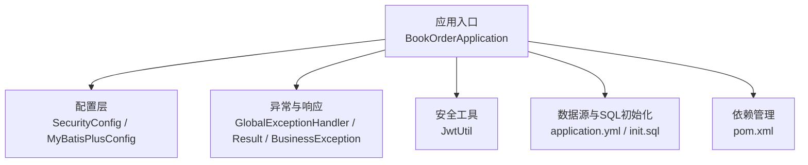
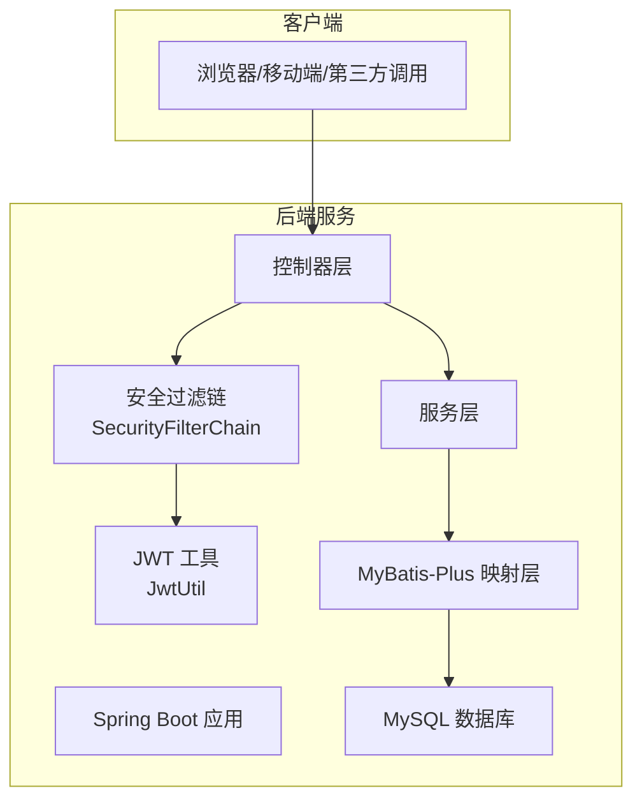
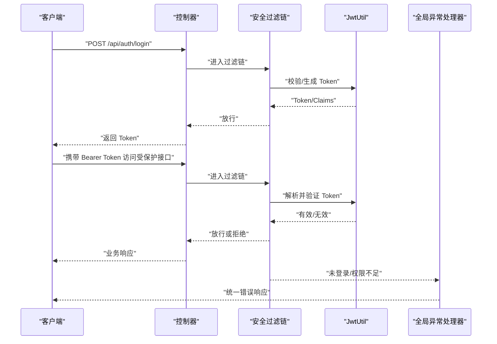
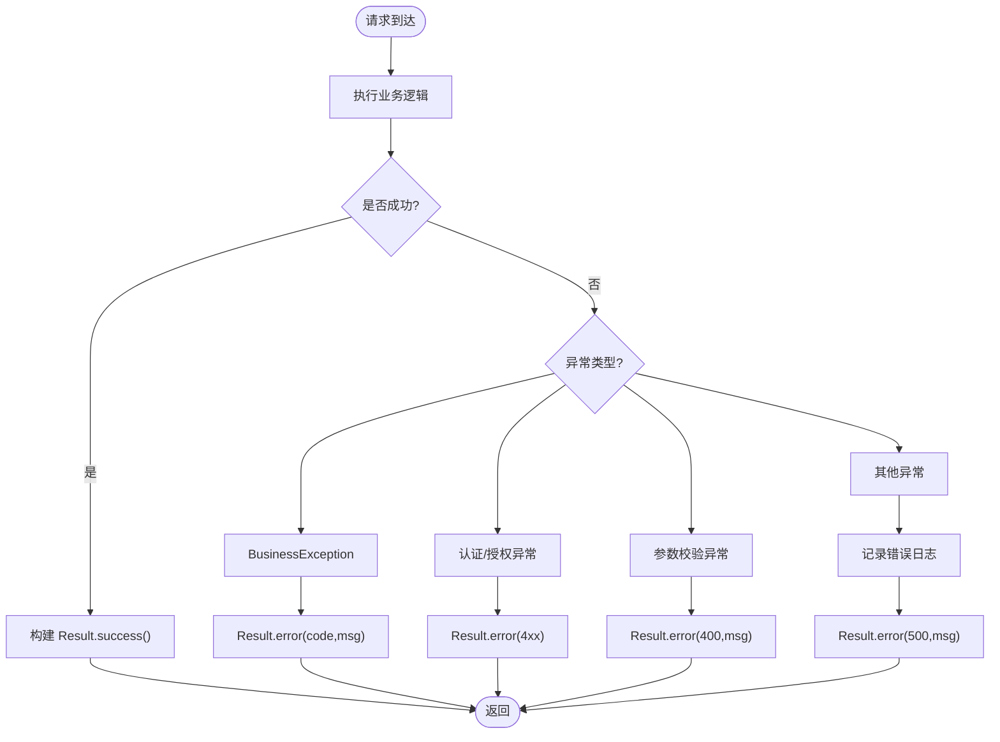
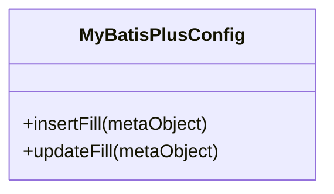
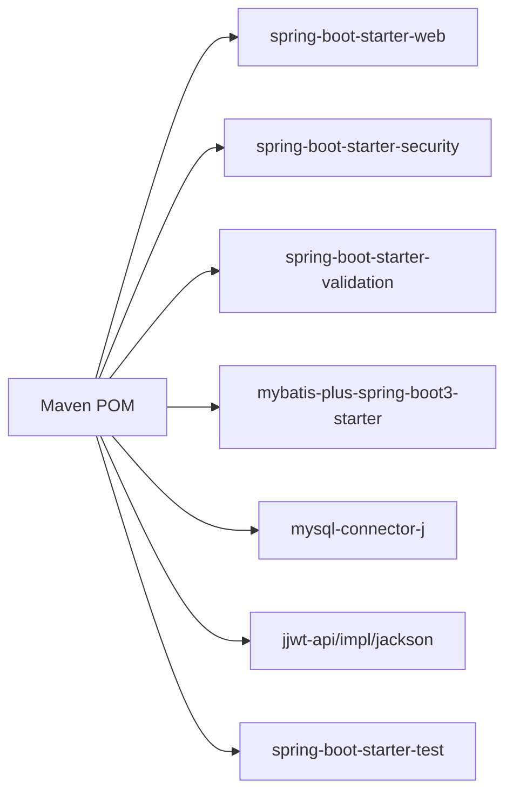

# 监控维护

<cite>
**本文引用的文件**
- [application.yml](file://src/main/resources/application.yml)
- [BookOrderApplication.java](file://src/main/java/com/bookorder/BookOrderApplication.java)
- [GlobalExceptionHandler.java](file://src/main/java/com/bookorder/common/GlobalExceptionHandler.java)
- [Result.java](file://src/main/java/com/bookorder/common/Result.java)
- [BusinessException.java](file://src/main/java/com/bookorder/common/BusinessException.java)
- [SecurityConfig.java](file://src/main/java/com/bookorder/config/SecurityConfig.java)
- [MyBatisPlusConfig.java](file://src/main/java/com/bookorder/config/MyBatisPlusConfig.java)
- [JwtUtil.java](file://src/main/java/com/bookorder/security/JwtUtil.java)
- [init.sql](file://sql/init.sql)
- [pom.xml](file://pom.xml)
- [README.md](file://README.md)
</cite>

## 目录
1. [简介](#简介)
2. [项目结构](#项目结构)
3. [核心组件](#核心组件)
4. [架构总览](#架构总览)
5. [详细组件分析](#详细组件分析)
6. [依赖关系分析](#依赖关系分析)
7. [性能与监控建议](#性能与监控建议)
8. [日志与异常处理](#日志与异常处理)
9. [数据库健康与性能监控](#数据库健康与性能监控)
10. [告警与通知策略](#告警与通知策略)
11. [备份与灾难恢复](#备份与灾难恢复)
12. [常见问题诊断与排障](#常见问题诊断与排障)
13. [结论](#结论)

## 简介
本文件面向生产环境运维与开发团队，提供系统监控与日常维护的完整实践指南。结合现有代码库，重点覆盖应用性能监控（CPU、内存、数据库连接池等）、日志体系与异常处理、数据库健康与性能监控、告警与通知策略、备份与灾难恢复以及常见问题诊断与排障。

## 项目结构
系统采用 Spring Boot 标准目录组织，核心模块包括：
- 应用入口与扫描：启动类负责包扫描与应用启动
- 配置层：安全配置、MyBatis-Plus 配置、日志级别
- 异常与统一响应：全局异常处理器与统一返回体
- 安全与认证：基于 JWT 的无状态鉴权链路
- 数据初始化：首次启动自动执行 SQL 初始化脚本

图示来源
- [BookOrderApplication.java:1-15](file://src/main/java/com/bookorder/BookOrderApplication.java#L1-L15)
- [SecurityConfig.java:1-74](file://src/main/java/com/bookorder/config/SecurityConfig.java#L1-L74)
- [MyBatisPlusConfig.java:1-23](file://src/main/java/com/bookorder/config/MyBatisPlusConfig.java#L1-L23)
- [GlobalExceptionHandler.java:1-62](file://src/main/java/com/bookorder/common/GlobalExceptionHandler.java#L1-L62)
- [Result.java:1-41](file://src/main/java/com/bookorder/common/Result.java#L1-L41)
- [BusinessException.java:1-19](file://src/main/java/com/bookorder/common/BusinessException.java#L1-L19)
- [JwtUtil.java:1-61](file://src/main/java/com/bookorder/security/JwtUtil.java#L1-L61)
- [application.yml:1-33](file://src/main/resources/application.yml#L1-L33)
- [init.sql:1-124](file://sql/init.sql#L1-L124)
- [pom.xml:1-95](file://pom.xml#L1-L95)

章节来源
- [BookOrderApplication.java:1-15](file://src/main/java/com/bookorder/BookOrderApplication.java#L1-L15)
- [application.yml:1-33](file://src/main/resources/application.yml#L1-L33)
- [pom.xml:1-95](file://pom.xml#L1-L95)
- [README.md:1-168](file://README.md#L1-L168)

## 核心组件
- 应用入口与扫描：通过启动类启用组件扫描与应用运行
- 配置层：无状态安全策略、MyBatis-Plus 自动填充与逻辑删除字段
- 异常与统一响应：集中处理各类异常，输出统一 JSON 结构
- 安全与认证：JWT 生成、解析与校验，配合安全过滤器链
- 日志与初始化：调试级别日志、自动 SQL 初始化

章节来源
- [BookOrderApplication.java:1-15](file://src/main/java/com/bookorder/BookOrderApplication.java#L1-L15)
- [SecurityConfig.java:1-74](file://src/main/java/com/bookorder/config/SecurityConfig.java#L1-L74)
- [MyBatisPlusConfig.java:1-23](file://src/main/java/com/bookorder/config/MyBatisPlusConfig.java#L1-L23)
- [GlobalExceptionHandler.java:1-62](file://src/main/java/com/bookorder/common/GlobalExceptionHandler.java#L1-L62)
- [Result.java:1-41](file://src/main/java/com/bookorder/common/Result.java#L1-L41)
- [BusinessException.java:1-19](file://src/main/java/com/bookorder/common/BusinessException.java#L1-L19)
- [JwtUtil.java:1-61](file://src/main/java/com/bookorder/security/JwtUtil.java#L1-L61)
- [application.yml:1-33](file://src/main/resources/application.yml#L1-L33)
- [init.sql:1-124](file://sql/init.sql#L1-L124)

## 架构总览
系统采用前后端分离的无状态架构，后端通过 Spring Security + JWT 提供认证授权；MyBatis-Plus 负责数据持久化；应用通过 application.yml 配置数据源与日志级别；首次启动自动执行初始化脚本。

图示来源
- [SecurityConfig.java:34-73](file://src/main/java/com/bookorder/config/SecurityConfig.java#L34-L73)
- [JwtUtil.java:1-61](file://src/main/java/com/bookorder/security/JwtUtil.java#L1-L61)
- [application.yml:4-13](file://src/main/resources/application.yml#L4-L13)
- [init.sql:1-124](file://sql/init.sql#L1-L124)

## 详细组件分析

### 安全与认证链路
- 无状态会话：禁用 CSRF，设置 SessionCreationPolicy 为 STATELESS
- 白名单路径：登录与注册接口放行
- 异常处理：未登录与权限不足时返回统一 JSON
- JWT：生成、解析、校验与载荷提取

图示来源
- [SecurityConfig.java:34-73](file://src/main/java/com/bookorder/config/SecurityConfig.java#L34-L73)
- [JwtUtil.java:27-52](file://src/main/java/com/bookorder/security/JwtUtil.java#L27-L52)
- [GlobalExceptionHandler.java:28-59](file://src/main/java/com/bookorder/common/GlobalExceptionHandler.java#L28-L59)

章节来源
- [SecurityConfig.java:1-74](file://src/main/java/com/bookorder/config/SecurityConfig.java#L1-L74)
- [JwtUtil.java:1-61](file://src/main/java/com/bookorder/security/JwtUtil.java#L1-L61)
- [GlobalExceptionHandler.java:1-62](file://src/main/java/com/bookorder/common/GlobalExceptionHandler.java#L1-L62)

### 异常处理与统一响应
- 全局异常处理器捕获业务异常、参数校验异常、认证/授权异常与通用异常
- 统一响应体 Result 提供 code/message/data 结构
- BusinessException 支持自定义错误码

图示来源
- [GlobalExceptionHandler.java:22-60](file://src/main/java/com/bookorder/common/GlobalExceptionHandler.java#L22-L60)
- [Result.java:18-40](file://src/main/java/com/bookorder/common/Result.java#L18-L40)
- [BusinessException.java:1-19](file://src/main/java/com/bookorder/common/BusinessException.java#L1-L19)

章节来源
- [GlobalExceptionHandler.java:1-62](file://src/main/java/com/bookorder/common/GlobalExceptionHandler.java#L1-L62)
- [Result.java:1-41](file://src/main/java/com/bookorder/common/Result.java#L1-L41)
- [BusinessException.java:1-19](file://src/main/java/com/bookorder/common/BusinessException.java#L1-L19)

### MyBatis-Plus 自动填充与逻辑删除
- 插入/更新自动填充时间字段
- 逻辑删除字段 deleted 使用 0/1 标识

图示来源
- [MyBatisPlusConfig.java:10-22](file://src/main/java/com/bookorder/config/MyBatisPlusConfig.java#L10-L22)

章节来源
- [MyBatisPlusConfig.java:1-23](file://src/main/java/com/bookorder/config/MyBatisPlusConfig.java#L1-L23)

## 依赖关系分析
- Spring Boot Web、Security、Validation、MyBatis-Plus、MySQL Connector、JWT
- 构建阶段使用 Spring Boot Maven 插件

图示来源
- [pom.xml:26-83](file://pom.xml#L26-L83)

章节来源
- [pom.xml:1-95](file://pom.xml#L1-L95)

## 性能与监控建议
以下为生产环境推荐的监控指标与采集方案（概念性建议，非现有实现）：

- 应用层指标
  - CPU 使用率、内存占用、GC 次数与耗时、线程数峰值
  - 请求延迟分位值（P50/P95/P99）、吞吐量、错误率
  - Tomcat/Netty 连接池使用情况（活跃/空闲/等待队列）
- 数据库指标
  - 连接池活跃/空闲/等待/超时计数
  - QPS/TPS、慢查询、锁等待、缓冲池命中率
  - 表大小、索引使用率、临时文件与排序开销
- 关键链路埋点
  - 认证鉴权耗时、SQL 执行耗时、外部依赖调用耗时
  - 业务事务成功率与失败原因分布

采集方式建议
- JVM 指标：Prometheus Pushgateway 或 Micrometer + Prometheus
- 应用日志：stdout/stderr + 日志采集（如 Fluent Bit/Filebeat），结合结构化 JSON
- 数据库指标：MySQL Exporter 或自定义慢查询日志采集
- 链路追踪：OpenTelemetry 或 SkyWalking（按需）

[本节为通用运维建议，不直接分析具体文件]

## 日志与异常处理
- 日志级别：当前配置为调试级别，便于开发定位；生产建议调整为 INFO/WARN/ERROR 分层
- 异常处理：全局异常处理器统一拦截并输出标准 JSON；业务异常支持自定义错误码
- 响应格式：统一 Result 结构，便于前端与监控系统消费

章节来源
- [application.yml:30-32](file://src/main/resources/application.yml#L30-L32)
- [GlobalExceptionHandler.java:1-62](file://src/main/java/com/bookorder/common/GlobalExceptionHandler.java#L1-L62)
- [Result.java:1-41](file://src/main/java/com/bookorder/common/Result.java#L1-L41)
- [BusinessException.java:1-19](file://src/main/java/com/bookorder/common/BusinessException.java#L1-L19)

## 数据库健康与性能监控
- 数据源配置：MySQL 连接 URL、用户名、密码、驱动
- 初始化策略：首次启动自动执行 SQL 初始化脚本
- 健康检查建议
  - 连接可用性：定时 SELECT 1 或连接池健康检查
  - 表空间与碎片：定期检查表大小、索引碎片率
  - 慢查询：开启慢查询日志，阈值建议 1s~10s，结合 EXPLAIN 分析
  - 锁与阻塞：观察锁等待、事务长事务、死锁日志
- 性能优化建议
  - 合理索引设计，避免全表扫描
  - 参数调优：innodb_buffer_pool_size、max_connections、sort_buffer_size 等
  - 读写分离与分库分表（按业务增长评估）

章节来源
- [application.yml:4-13](file://src/main/resources/application.yml#L4-L13)
- [init.sql:1-124](file://sql/init.sql#L1-L124)

## 告警与通知策略
- 告警维度
  - 应用：错误率、P95 延迟、线程池饱和、连接池耗尽
  - 数据库：慢查询数、连接数上限、缓冲池命中率下降、锁等待
  - 基础设施：磁盘空间、CPU/内存、网络抖动
- 告警规则示例
  - 错误率 > 1% 持续 5 分钟
  - P95 延迟 > 2s 持续 3 分钟
  - 连接池等待时间 > 5s 或等待队列长度 > 阈值
  - 慢查询数 > N/分钟
- 通知渠道
  - 钉钉/企业微信/Webhook/邮件/SMS
  - 分级通知：P0 立即电话，P1 钉钉群，P2 邮件

[本节为通用运维建议，不直接分析具体文件]

## 备份与灾难恢复
- 备份策略
  - 全量备份：每周一次（业务低峰）
  - 增量/日志备份：每日一次，保留至少 7 天
  - 文件级备份：应用代码、配置文件、日志目录
- 存储与传输
  - 本地快照 + 远程对象存储（加密、跨区域冗余）
  - 传输加密与完整性校验
- 恢复流程
  - RTO/RPO 目标明确（如 RPO=1h，RTO=4h）
  - 逐步验证：数据一致性校验、关键接口回归测试
- 灾难场景
  - 单机故障：快速切换到备用节点
  - 数据中心故障：跨区容灾演练与切换
  - 业务数据损坏：基于时间点恢复（PITR）

[本节为通用运维建议，不直接分析具体文件]

## 常见问题诊断与排障
- 启动失败
  - 检查数据库连通性与凭据
  - 查看初始化 SQL 是否执行成功
- 认证失败
  - 核对 JWT 密钥与过期配置
  - 检查白名单路径与过滤器顺序
- 业务异常
  - 依据 BusinessException 错误码定位
  - 结合全局异常处理器输出与日志定位
- 性能退化
  - 关注慢查询与连接池状态
  - 对比关键指标趋势，识别突增环节

章节来源
- [application.yml:4-28](file://src/main/resources/application.yml#L4-L28)
- [JwtUtil.java:16-20](file://src/main/java/com/bookorder/security/JwtUtil.java#L16-L20)
- [SecurityConfig.java:34-62](file://src/main/java/com/bookorder/config/SecurityConfig.java#L34-L62)
- [GlobalExceptionHandler.java:22-60](file://src/main/java/com/bookorder/common/GlobalExceptionHandler.java#L22-L60)
- [BusinessException.java:1-19](file://src/main/java/com/bookorder/common/BusinessException.java#L1-L19)

## 结论
本项目具备清晰的安全与数据层基础，建议在生产环境中补充完善的监控采集、日志分级、数据库性能治理、告警与通知策略以及标准化的备份与灾备流程。通过统一的指标与告警体系，可显著提升系统稳定性与可维护性。