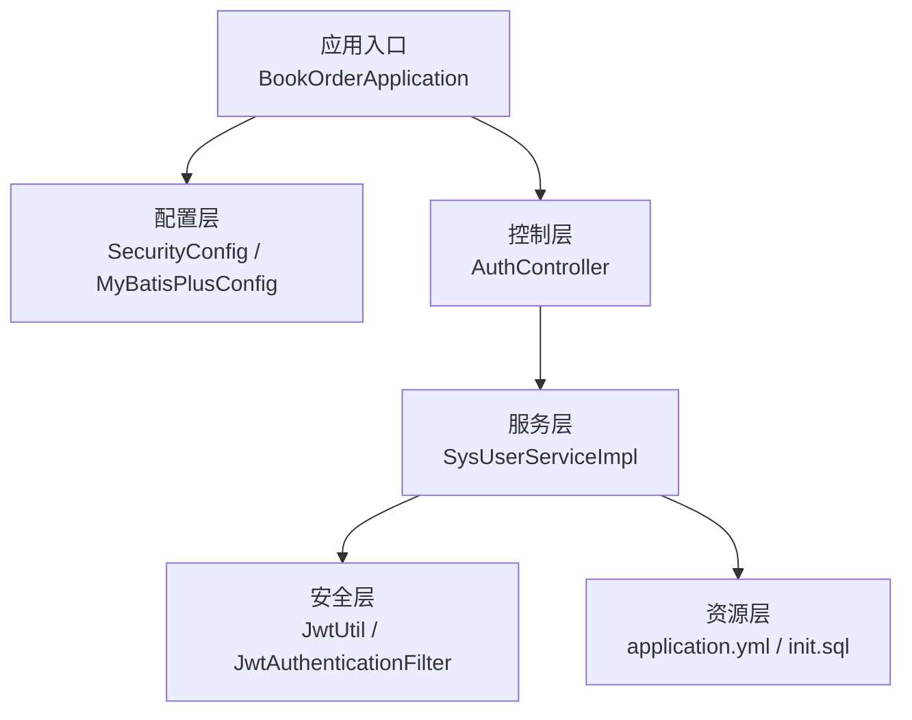
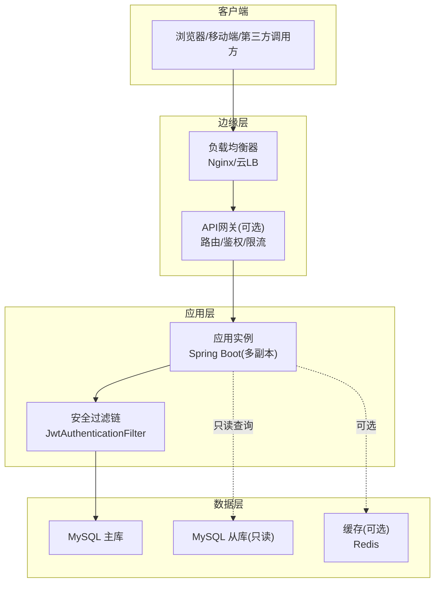
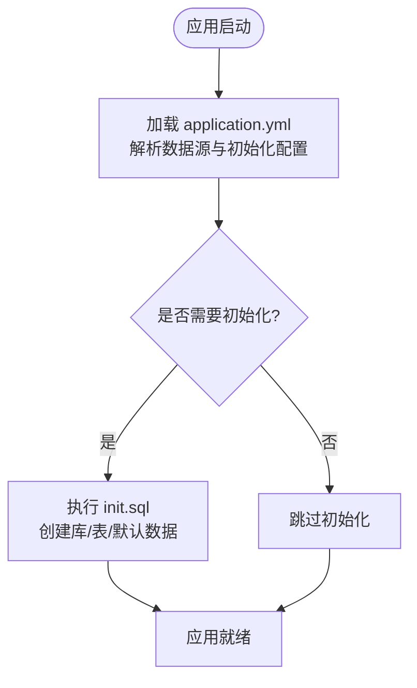
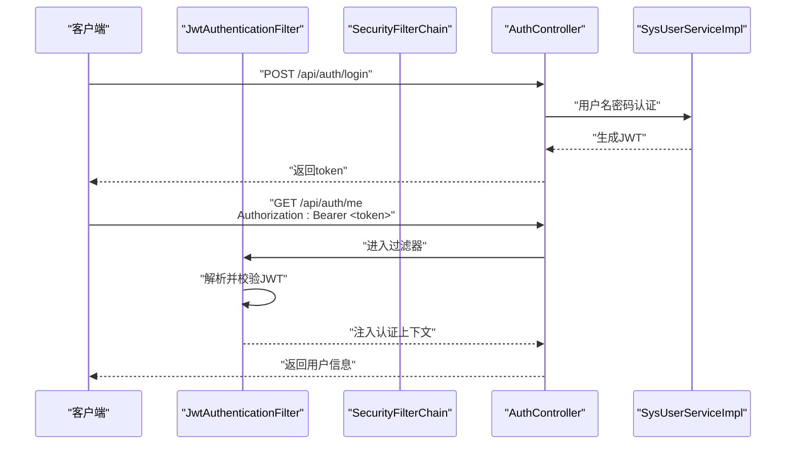
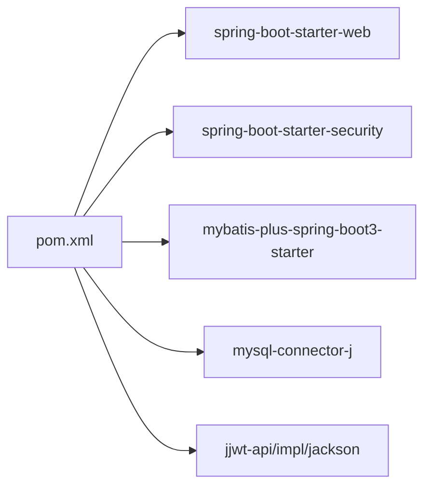

# 部署运维

<cite>
**本文引用的文件**   
- [pom.xml](file://pom.xml)
- [application.yml](file://src/main/resources/application.yml)
- [BookOrderApplication.java](file://src/main/java/com/bookorder/BookOrderApplication.java)
- [init.sql](file://sql/init.sql)
- [README.md](file://README.md)
- [SecurityConfig.java](file://src/main/java/com/bookorder/config/SecurityConfig.java)
- [MyBatisPlusConfig.java](file://src/main/java/com/bookorder/config/MyBatisPlusConfig.java)
- [JwtUtil.java](file://src/main/java/com/bookorder/security/JwtUtil.java)
- [JwtAuthenticationFilter.java](file://src/main/java/com/bookorder/security/JwtAuthenticationFilter.java)
- [GlobalExceptionHandler.java](file://src/main/java/com/bookorder/common/GlobalExceptionHandler.java)
- [AuthController.java](file://src/main/java/com/bookorder/controller/AuthController.java)
- [SysUserServiceImpl.java](file://src/main/java/com/bookorder/service/impl/SysUserServiceImpl.java)
</cite>

## 目录
1. [简介](#简介)
2. [项目结构](#项目结构)
3. [核心组件](#核心组件)
4. [架构总览](#架构总览)
5. [详细组件分析](#详细组件分析)
6. [依赖分析](#依赖分析)
7. [性能考虑](#性能考虑)
8. [故障排查指南](#故障排查指南)
9. [结论](#结论)
10. [附录](#附录)

## 简介
本部署运维文档面向生产环境，围绕图书订单系统（Spring Boot + MyBatis-Plus + Spring Security + JWT）提供从配置、安全加固、打包发布到容器化与编排部署的完整实践指南。内容涵盖数据库连接池与初始化脚本、日志与监控配置、备份恢复策略、高可用与负载均衡建议、缓存策略、CI/CD流水线与自动化部署思路，以及系统日志分析与故障排查流程。

## 项目结构
该工程采用标准 Spring Boot 结构，核心模块如下：
- 应用入口：启动类负责扫描 Mapper 与装配组件
- 配置层：Spring Security 安全过滤链、MyBatis-Plus 元对象填充
- 控制层：认证控制器提供登录、注册、查询当前用户信息
- 安全层：JWT 工具与过滤器、用户详情服务与认证管理
- 服务层：用户服务实现登录、注册、权限查询等
- 资源层：应用配置、SQL 初始化脚本

图表来源
- [BookOrderApplication.java:1-15](file://src/main/java/com/bookorder/BookOrderApplication.java#L1-L15)
- [SecurityConfig.java:1-74](file://src/main/java/com/bookorder/config/SecurityConfig.java#L1-L74)
- [MyBatisPlusConfig.java:1-23](file://src/main/java/com/bookorder/config/MyBatisPlusConfig.java#L1-L23)
- [AuthController.java:1-59](file://src/main/java/com/bookorder/controller/AuthController.java#L1-L59)
- [SysUserServiceImpl.java:1-87](file://src/main/java/com/bookorder/service/impl/SysUserServiceImpl.java#L1-L87)
- [JwtUtil.java:1-62](file://src/main/java/com/bookorder/security/JwtUtil.java#L1-L62)
- [JwtAuthenticationFilter.java:1-56](file://src/main/java/com/bookorder/security/JwtAuthenticationFilter.java#L1-L56)
- [application.yml:1-33](file://src/main/resources/application.yml#L1-L33)
- [init.sql:1-124](file://sql/init.sql#L1-L124)

章节来源
- [README.md:128-168](file://README.md#L128-L168)
- [BookOrderApplication.java:1-15](file://src/main/java/com/bookorder/BookOrderApplication.java#L1-L15)

## 核心组件
- 应用配置与端口：服务器端口、数据源、SQL 初始化、MyBatis-Plus 全局配置、JWT 参数、日志级别
- 安全配置：无状态会话、放行登录/注册路径、统一异常处理返回 JSON
- 数据访问：MyBatis-Plus 自动填充创建/更新时间、逻辑删除字段
- 认证流程：用户名密码认证、生成 JWT、请求头携带 Bearer Token
- 异常处理：业务异常、认证失败、权限不足、参数校验错误、通用异常

章节来源
- [application.yml:1-33](file://src/main/resources/application.yml#L1-L33)
- [SecurityConfig.java:1-74](file://src/main/java/com/bookorder/config/SecurityConfig.java#L1-L74)
- [MyBatisPlusConfig.java:1-23](file://src/main/java/com/bookorder/config/MyBatisPlusConfig.java#L1-L23)
- [JwtUtil.java:1-62](file://src/main/java/com/bookorder/security/JwtUtil.java#L1-L62)
- [JwtAuthenticationFilter.java:1-56](file://src/main/java/com/bookorder/security/JwtAuthenticationFilter.java#L1-L56)
- [GlobalExceptionHandler.java:1-62](file://src/main/java/com/bookorder/common/GlobalExceptionHandler.java#L1-L62)

## 架构总览
下图展示生产环境典型部署拓扑与请求流：

说明
- 负载均衡器分发流量至多个应用实例，支持健康检查与故障切换
- API 网关可集中处理路由、鉴权、限流与熔断
- 数据库主从分离，读写分离；可引入缓存提升热点数据访问性能
- 安全过滤链在应用内完成 JWT 校验与权限解析

## 详细组件分析

### 数据库连接与初始化
- 连接信息：通过配置文件设置 JDBC URL、用户名、密码与驱动
- SQL 初始化：首次启动自动执行初始化脚本，创建库、表与默认数据
- MyBatis-Plus：启用下划线转驼峰映射、开启标准输出日志、自动填充时间字段、逻辑删除字段配置

图表来源
- [application.yml:4-14](file://src/main/resources/application.yml#L4-L14)
- [init.sql:1-124](file://sql/init.sql#L1-L124)

章节来源
- [application.yml:4-14](file://src/main/resources/application.yml#L4-L14)
- [init.sql:1-124](file://sql/init.sql#L1-L124)
- [MyBatisPlusConfig.java:10-22](file://src/main/java/com/bookorder/config/MyBatisPlusConfig.java#L10-L22)

### 安全与认证流程
- 放行路径：登录与注册接口无需鉴权
- 无状态会话：禁止会话创建，使用 JWT 令牌
- 过滤器链：请求进入前解析 Authorization 头，校验 JWT 并注入认证上下文
- 异常处理：未登录/权限不足统一返回 JSON

图表来源
- [SecurityConfig.java:35-62](file://src/main/java/com/bookorder/config/SecurityConfig.java#L35-L62)
- [JwtAuthenticationFilter.java:28-46](file://src/main/java/com/bookorder/security/JwtAuthenticationFilter.java#L28-L46)
- [JwtUtil.java:27-42](file://src/main/java/com/bookorder/security/JwtUtil.java#L27-L42)
- [AuthController.java:28-57](file://src/main/java/com/bookorder/controller/AuthController.java#L28-L57)
- [SysUserServiceImpl.java:50-55](file://src/main/java/com/bookorder/service/impl/SysUserServiceImpl.java#L50-L55)

章节来源
- [SecurityConfig.java:34-62](file://src/main/java/com/bookorder/config/SecurityConfig.java#L34-L62)
- [JwtAuthenticationFilter.java:19-56](file://src/main/java/com/bookorder/security/JwtAuthenticationFilter.java#L19-L56)
- [JwtUtil.java:13-62](file://src/main/java/com/bookorder/security/JwtUtil.java#L13-L62)
- [AuthController.java:18-59](file://src/main/java/com/bookorder/controller/AuthController.java#L18-L59)
- [SysUserServiceImpl.java:22-87](file://src/main/java/com/bookorder/service/impl/SysUserServiceImpl.java#L22-L87)

### 日志与监控配置
- 日志级别：开发阶段建议 debug，生产建议 info 或 warn，避免过度 IO
- 输出位置：建议落盘并配合日志采集（如 Filebeat/Fluent Bit），集中到 ELK/日志中台
- 监控指标：应用层面可暴露 JVM/HTTP 指标，结合 Prometheus/Grafana；数据库层面关注慢查询、连接数、锁等待
- 健康检查：提供 /actuator/health 作为探针，供 LB/K8s 使用

章节来源
- [application.yml:30-33](file://src/main/resources/application.yml#L30-L33)
- [pom.xml:26-84](file://pom.xml#L26-L84)

### 异常处理与可观测性
- 全局异常处理器捕获业务异常、认证失败、权限不足、参数校验错误与通用异常，统一返回 JSON
- 建议在网关或应用侧记录审计日志，区分业务错误与系统错误，便于追踪与告警

章节来源
- [GlobalExceptionHandler.java:17-62](file://src/main/java/com/bookorder/common/GlobalExceptionHandler.java#L17-L62)

## 依赖分析
- 运行时依赖：Spring Boot Web、Security、Validation、MyBatis-Plus、MySQL Connector、JWT
- 构建插件：spring-boot-maven-plugin 用于打包可执行 JAR
- 版本约束：Java 17、Spring Boot 3.2.5、MyBatis-Plus 3.5.6、jjwt 0.12.5

图表来源
- [pom.xml:26-84](file://pom.xml#L26-L84)

章节来源
- [pom.xml:1-95](file://pom.xml#L1-L95)

## 性能考虑
- 数据库连接池：建议引入 HikariCP 并按并发与事务特性调优最大连接数、空闲超时、连接生命周期
- SQL 优化：遵循索引设计原则，避免 N+1 查询；对高频接口增加只读副本
- 缓存策略：热点数据（如字典、权限元数据）引入 Redis；注意缓存一致性与失效策略
- GC 与 JVM：根据流量峰值设置堆大小，开启逃逸分析与并行回收器，定期压测评估
- 网络与 I/O：启用压缩、长连接与合理的超时设置；避免阻塞式操作

## 故障排查指南
- 启动失败
  - 检查数据库连通性与凭据；确认初始化脚本执行结果
  - 关注日志中的 SQL 初始化错误与数据源配置
- 认证失败
  - 核对 JWT 密钥与过期时间；检查请求头 Authorization 是否正确
  - 定位 SecurityFilterChain 的异常处理返回码
- 权限不足
  - 确认用户角色与权限映射；核对权限编码与资源匹配
- 性能问题
  - 分析慢查询与锁等待；检查连接池占用与 GC 峰值
  - 对热点接口进行缓存与异步化改造

章节来源
- [application.yml:4-14](file://src/main/resources/application.yml#L4-L14)
- [SecurityConfig.java:44-58](file://src/main/java/com/bookorder/config/SecurityConfig.java#L44-L58)
- [JwtUtil.java:45-52](file://src/main/java/com/bookorder/security/JwtUtil.java#L45-L52)
- [GlobalExceptionHandler.java:22-60](file://src/main/java/com/bookorder/common/GlobalExceptionHandler.java#L22-L60)

## 结论
本项目具备清晰的安全与认证边界、完善的初始化与数据模型，适合在生产环境中以“无状态应用 + 有状态数据库”的方式部署。建议在生产中补齐连接池、缓存、监控与日志采集，并通过容器化与编排实现弹性伸缩与高可用。

## 附录

### 生产环境配置清单
- 数据库
  - 连接地址、用户名、密码、字符集与时区
  - 初始化脚本路径与执行模式
- 应用
  - 服务器端口、日志级别、JWT 密钥与过期时间
  - MyBatis-Plus 映射与自动填充配置
- 安全
  - CSRF 关闭、无状态会话、放行路径、异常处理
- 运维
  - 健康检查端点、日志落盘与采集、监控指标暴露

章节来源
- [application.yml:1-33](file://src/main/resources/application.yml#L1-L33)
- [SecurityConfig.java:34-62](file://src/main/java/com/bookorder/config/SecurityConfig.java#L34-L62)
- [MyBatisPlusConfig.java:10-22](file://src/main/java/com/bookorder/config/MyBatisPlusConfig.java#L10-L22)

### 备份与恢复策略
- 数据库备份
  - 全量备份：周期性导出主库结构与数据
  - 增量备份：基于 binlog 的增量捕获
  - 归档与异地：备份文件加密归档并跨机房存储
- 恢复演练
  - 定期进行 RTO/RPO 测试，验证备份完整性与恢复速度
  - 恢复流程需覆盖初始化脚本与业务数据一致性校验

### 高可用与负载均衡
- 应用层
  - 多实例部署，共享配置中心与注册发现
  - 健康检查与自动摘除，结合滚动升级
- 数据层
  - 主从复制与只读副本，读写分离
  - 使用中间件（如 ProxySQL）实现读写分离与故障转移
- 边缘层
  - 负载均衡器配置健康检查与超时重试
  - 反向代理开启 Gzip、缓存静态资源

### 缓存策略
- 热点数据：用户角色/权限、字典项、热门查询结果
- 缓存一致性：写策略采用“先删缓存再更新数据库”或“带版本号”
- 缓存穿透与击穿：布隆过滤器与互斥锁保护

### CI/CD 与自动化部署
- 构建
  - Maven 清单构建可执行 JAR，或打包 Docker 镜像
- 测试
  - 单元测试与集成测试在流水线中执行
- 发布
  - 制品上传制品库；灰度发布与回滚策略
- 编排
  - Kubernetes：Deployment/Service/ConfigMap/Secret/HPA
  - Helm Charts 封装配置与版本管理
- 监控与告警
  - 指标采集与可视化，异常自动告警

### 系统日志分析方法
- 分类
  - 访问日志：请求路径、状态码、耗时、IP
  - 业务日志：登录、注册、授权等关键事件
  - 错误日志：异常堆栈与上下文信息
- 分析
  - 统计 4xx/5xx 比例与热点接口
  - 关联用户 ID 与权限维度定位问题
  - 结合审计日志回溯操作轨迹