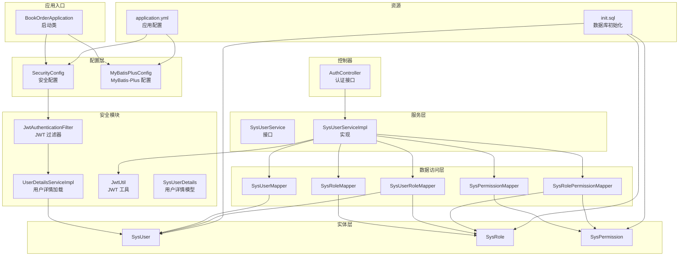
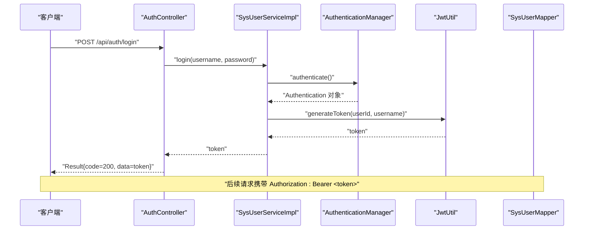
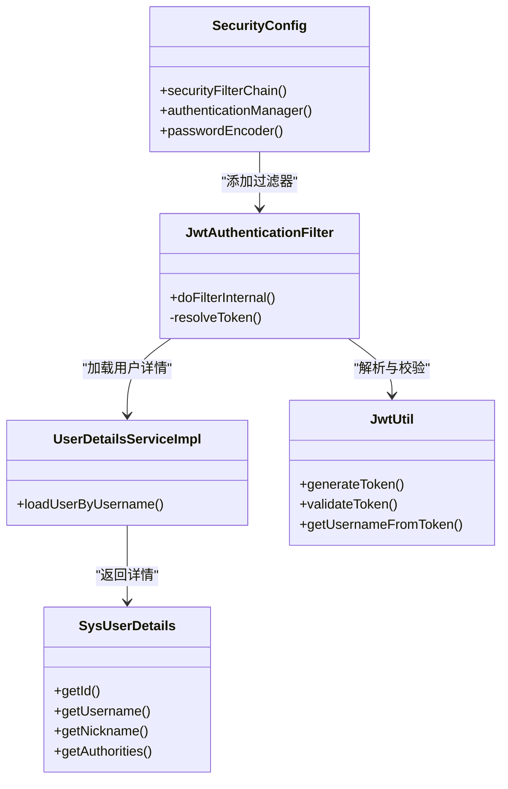
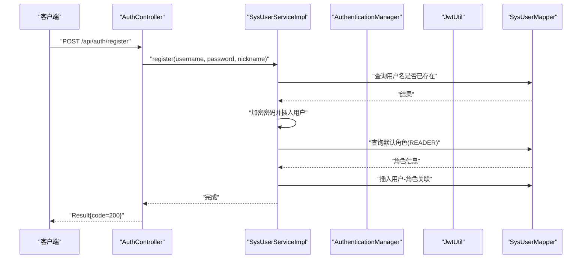
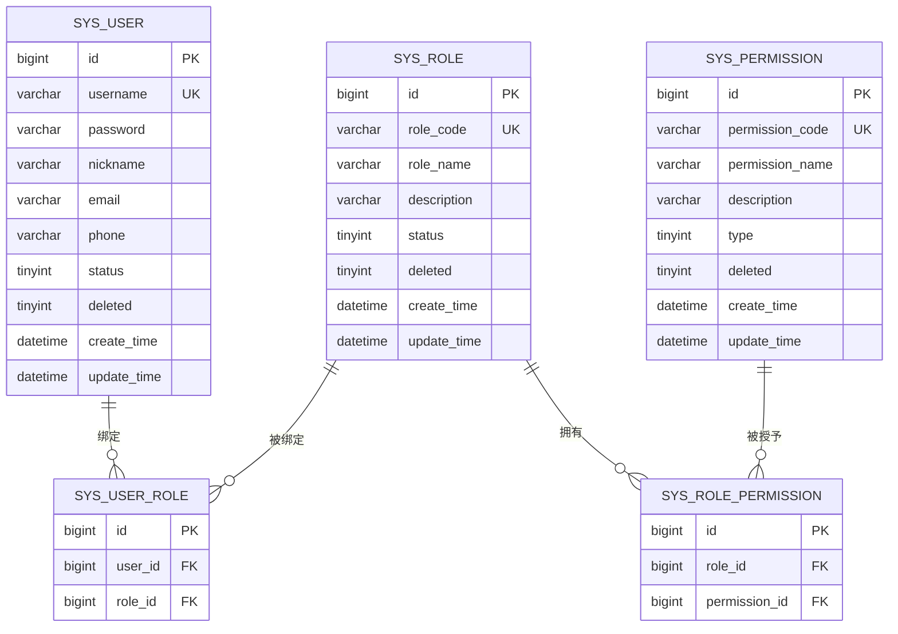
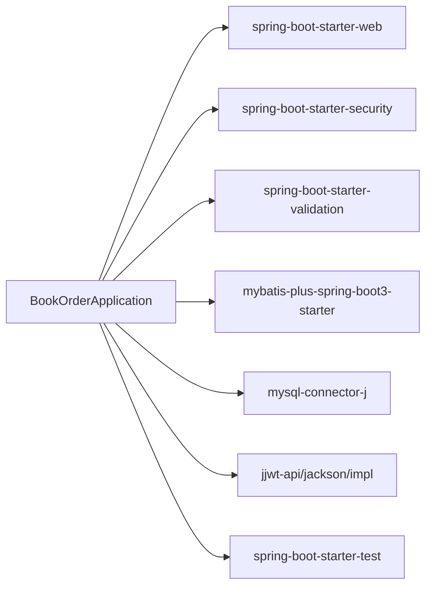

# 项目概述

<cite>
**本文引用的文件**
- [README.md](file://README.md)
- [pom.xml](file://pom.xml)
- [application.yml](file://src/main/resources/application.yml)
- [BookOrderApplication.java](file://src/main/java/com/bookorder/BookOrderApplication.java)
- [SecurityConfig.java](file://src/main/java/com/bookorder/config/SecurityConfig.java)
- [JwtAuthenticationFilter.java](file://src/main/java/com/bookorder/security/JwtAuthenticationFilter.java)
- [UserDetailsServiceImpl.java](file://src/main/java/com/bookorder/security/UserDetailsServiceImpl.java)
- [SysUserDetails.java](file://src/main/java/com/bookorder/security/SysUserDetails.java)
- [JwtUtil.java](file://src/main/java/com/bookorder/security/JwtUtil.java)
- [AuthController.java](file://src/main/java/com/bookorder/controller/AuthController.java)
- [SysUserServiceImpl.java](file://src/main/java/com/bookorder/service/impl/SysUserServiceImpl.java)
- [SysUserService.java](file://src/main/java/com/bookorder/service/SysUserService.java)
- [SysUser.java](file://src/main/java/com/bookorder/entity/SysUser.java)
- [SysRole.java](file://src/main/java/com/bookorder/entity/SysRole.java)
- [SysPermission.java](file://src/main/java/com/bookorder/entity/SysPermission.java)
- [SysUserMapper.java](file://src/main/java/com/bookorder/mapper/SysUserMapper.java)
- [SysRoleMapper.java](file://src/main/java/com/bookorder/mapper/SysRoleMapper.java)
- [SysPermissionMapper.java](file://src/main/java/com/bookorder/mapper/SysPermissionMapper.java)
- [SysUserRoleMapper.java](file://src/main/java/com/bookorder/mapper/SysUserRoleMapper.java)
- [SysRolePermissionMapper.java](file://src/main/java/com/bookorder/mapper/SysRolePermissionMapper.java)
- [init.sql](file://sql/init.sql)
</cite>

## 目录
1. [引言](#引言)
2. [项目结构](#项目结构)
3. [核心组件](#核心组件)
4. [架构总览](#架构总览)
5. [详细组件分析](#详细组件分析)
6. [依赖关系分析](#依赖关系分析)
7. [性能考虑](#性能考虑)
8. [故障排查指南](#故障排查指南)
9. [结论](#结论)
10. [附录](#附录)

## 引言
本项目是一个基于 Spring Boot 3 的图书订单管理系统，采用 Java 17 开发，集成了 MyBatis-Plus、Spring Security 和 JWT，实现了 RBAC（基于角色的权限控制）与无状态认证。系统通过统一响应封装、全局异常处理、数据库初始化脚本与角色权限模型，提供了从用户认证到权限校验的完整能力。

项目旨在为图书馆或图书管理场景提供一套可扩展、安全且易维护的后端服务基础框架，支持管理员、图书管理员与读者三类角色，覆盖用户、图书、订单与角色管理等核心业务。

## 项目结构
项目采用标准的 Spring Boot 分层结构，按功能域划分包，职责清晰：
- 启动类：应用入口，扫描 Mapper 包
- config：安全与持久化配置
- controller：对外暴露认证相关接口
- service：业务逻辑与事务边界
- security：认证与授权过滤器、用户详情加载与 JWT 工具
- entity/mapper：领域模型与数据访问层
- dto：请求与视图对象
- common：统一响应与异常处理
- resources：配置文件与 SQL 初始化脚本

图表来源
- [BookOrderApplication.java:1-15](file://src/main/java/com/bookorder/BookOrderApplication.java#L1-L15)
- [SecurityConfig.java:1-74](file://src/main/java/com/bookorder/config/SecurityConfig.java#L1-L74)
- [JwtAuthenticationFilter.java:1-56](file://src/main/java/com/bookorder/security/JwtAuthenticationFilter.java#L1-L56)
- [UserDetailsServiceImpl.java:1-50](file://src/main/java/com/bookorder/security/UserDetailsServiceImpl.java#L1-L50)
- [AuthController.java:1-59](file://src/main/java/com/bookorder/controller/AuthController.java#L1-L59)
- [SysUserServiceImpl.java:1-87](file://src/main/java/com/bookorder/service/impl/SysUserServiceImpl.java#L1-L87)
- [application.yml:1-33](file://src/main/resources/application.yml#L1-L33)
- [init.sql:1-124](file://sql/init.sql#L1-L124)

章节来源
- [README.md:128-168](file://README.md#L128-L168)
- [BookOrderApplication.java:1-15](file://src/main/java/com/bookorder/BookOrderApplication.java#L1-L15)
- [application.yml:1-33](file://src/main/resources/application.yml#L1-L33)

## 核心组件
- 统一响应与异常处理：通过 Result 封装统一返回格式；GlobalExceptionHandler 提供全局异常处理能力，确保错误信息标准化输出。
- 安全与认证：SecurityConfig 配置无状态会话策略与路径级鉴权；JwtAuthenticationFilter 解析 Authorization 头中的 Bearer Token 并注入认证上下文；UserDetailsServiceImpl 负责加载用户的角色与权限集合；JwtUtil 提供签发与校验令牌的能力。
- 业务服务：SysUserService 定义登录、注册与用户信息查询等契约；SysUserServiceImpl 实现登录认证、密码加密、默认角色绑定与用户信息查询。
- 数据访问：基于 MyBatis-Plus 的 Mapper 层，结合实体类完成用户、角色、权限及其关联表的 CRUD 与查询。
- 配置与初始化：application.yml 提供数据源、SQL 初始化、MyBatis-Plus 配置与 JWT 参数；init.sql 初始化数据库结构与默认数据。

章节来源
- [Result.java:1-41](file://src/main/java/com/bookorder/common/Result.java#L1-L41)
- [SecurityConfig.java:1-74](file://src/main/java/com/bookorder/config/SecurityConfig.java#L1-L74)
- [JwtAuthenticationFilter.java:1-56](file://src/main/java/com/bookorder/security/JwtAuthenticationFilter.java#L1-L56)
- [UserDetailsServiceImpl.java:1-50](file://src/main/java/com/bookorder/security/UserDetailsServiceImpl.java#L1-L50)
- [SysUserServiceImpl.java:1-87](file://src/main/java/com/bookorder/service/impl/SysUserServiceImpl.java#L1-L87)
- [application.yml:1-33](file://src/main/resources/application.yml#L1-L33)
- [init.sql:1-124](file://sql/init.sql#L1-L124)

## 架构总览
系统采用分层架构与无状态认证设计，核心流程如下：
- 控制器接收请求，调用服务层进行业务处理
- 服务层通过 Spring Security 的 AuthenticationManager 完成身份验证，随后使用 JwtUtil 生成 JWT
- 客户端在后续请求中携带 Bearer Token，JwtAuthenticationFilter 在进入业务前解析并注入认证信息
- 安全配置对特定路径放行（如登录、注册），其余请求均需认证

图表来源
- [AuthController.java:28-32](file://src/main/java/com/bookorder/controller/AuthController.java#L28-L32)
- [SysUserServiceImpl.java:50-55](file://src/main/java/com/bookorder/service/impl/SysUserServiceImpl.java#L50-L55)
- [JwtUtil.java](file://src/main/java/com/bookorder/security/JwtUtil.java)
- [SysUserMapper.java](file://src/main/java/com/bookorder/mapper/SysUserMapper.java)

章节来源
- [SecurityConfig.java:34-62](file://src/main/java/com/bookorder/config/SecurityConfig.java#L34-L62)
- [JwtAuthenticationFilter.java:28-46](file://src/main/java/com/bookorder/security/JwtAuthenticationFilter.java#L28-L46)

## 详细组件分析

### 安全与认证组件
- 安全配置（SecurityConfig）
  - 关闭 CSRF，设置 SessionCreationPolicy 为 STATELESS，保证无状态
  - 放行登录与注册接口，其余请求必须认证
  - 自定义未登录与权限不足的 JSON 响应
  - 注入 JwtAuthenticationFilter，拦截请求解析并校验 JWT
- JWT 过滤器（JwtAuthenticationFilter）
  - 从 Authorization 头解析 Bearer Token
  - 使用 JwtUtil 校验并提取用户名，再通过 UserDetailsService 加载用户详情
  - 构造 UsernamePasswordAuthenticationToken 注入 SecurityContext
- 用户详情加载（UserDetailsServiceImpl）
  - 查询用户是否存在且状态正常
  - 查询用户的角色编码与权限编码，组装为 GrantedAuthority 列表
  - 返回包含用户信息与权限集合的 SysUserDetails
- JWT 工具（JwtUtil）
  - 提供签发与校验 JWT 的能力，配合 application.yml 中的密钥与过期时间配置

图表来源
- [SecurityConfig.java:23-73](file://src/main/java/com/bookorder/config/SecurityConfig.java#L23-L73)
- [JwtAuthenticationFilter.java:19-55](file://src/main/java/com/bookorder/security/JwtAuthenticationFilter.java#L19-L55)
- [UserDetailsServiceImpl.java:17-49](file://src/main/java/com/bookorder/security/UserDetailsServiceImpl.java#L17-L49)
- [SysUserDetails.java](file://src/main/java/com/bookorder/security/SysUserDetails.java)
- [JwtUtil.java](file://src/main/java/com/bookorder/security/JwtUtil.java)

章节来源
- [SecurityConfig.java:34-62](file://src/main/java/com/bookorder/config/SecurityConfig.java#L34-L62)
- [JwtAuthenticationFilter.java:28-46](file://src/main/java/com/bookorder/security/JwtAuthenticationFilter.java#L28-L46)
- [UserDetailsServiceImpl.java:23-48](file://src/main/java/com/bookorder/security/UserDetailsServiceImpl.java#L23-L48)

### 认证控制器与服务
- 认证控制器（AuthController）
  - 提供登录、注册与获取当前用户信息接口
  - 登录接口返回 JWT；注册接口调用服务层完成用户创建与默认角色绑定；获取当前用户信息接口汇总角色与权限编码
- 用户服务（SysUserService/SysUserServiceImpl）
  - 登录：通过 AuthenticationManager 校验凭据，随后使用 JwtUtil 生成令牌
  - 注册：校验用户名唯一性，加密密码，插入用户并默认绑定 READER 角色
  - 查询用户信息：根据用户 ID 查询基础信息

图表来源
- [AuthController.java:34-38](file://src/main/java/com/bookorder/controller/AuthController.java#L34-L38)
- [SysUserServiceImpl.java:57-80](file://src/main/java/com/bookorder/service/impl/SysUserServiceImpl.java#L57-L80)
- [SysUserMapper.java](file://src/main/java/com/bookorder/mapper/SysUserMapper.java)

章节来源
- [AuthController.java:28-57](file://src/main/java/com/bookorder/controller/AuthController.java#L28-L57)
- [SysUserServiceImpl.java:43-86](file://src/main/java/com/bookorder/service/impl/SysUserServiceImpl.java#L43-L86)

### 数据模型与权限映射
系统采用 RBAC 模型，核心实体与关联关系如下：
- 用户（SysUser）：基础用户信息，支持逻辑删除与时间字段填充
- 角色（SysRole）：角色编码与名称，支持逻辑删除与时间字段填充
- 权限（SysPermission）：权限编码与类型（菜单/按钮/接口），支持逻辑删除与时间字段填充
- 用户-角色（SysUserRole）：多对多关联，唯一约束避免重复绑定
- 角色-权限（SysRolePermission）：多对多关联，唯一约束避免重复授权

图表来源
- [SysUser.java:6-47](file://src/main/java/com/bookorder/entity/SysUser.java#L6-L47)
- [SysRole.java:6-41](file://src/main/java/com/bookorder/entity/SysRole.java#L6-L41)
- [SysPermission.java:6-41](file://src/main/java/com/bookorder/entity/SysPermission.java#L6-L41)
- [SysUserRoleMapper.java](file://src/main/java/com/bookorder/mapper/SysUserRoleMapper.java)
- [SysRolePermissionMapper.java](file://src/main/java/com/bookorder/mapper/SysRolePermissionMapper.java)
- [init.sql:11-70](file://sql/init.sql#L11-L70)

章节来源
- [init.sql:76-124](file://sql/init.sql#L76-L124)

### 统一响应与异常处理
- 统一响应（Result）：提供 success/error 静态方法，封装 code、message、data 字段，便于前端统一处理
- 全局异常处理：结合 SecurityConfig 的异常处理器，对未登录与权限不足场景返回标准化 JSON

章节来源
- [Result.java:18-39](file://src/main/java/com/bookorder/common/Result.java#L18-L39)
- [SecurityConfig.java:43-58](file://src/main/java/com/bookorder/config/SecurityConfig.java#L43-L58)

## 依赖关系分析
- 技术栈选择理由
  - Spring Boot 3 + Java 17：获得长期支持与现代化特性
  - MyBatis-Plus：简化 CRUD 与逻辑删除、自动填充等常用能力
  - Spring Security + JWT：实现无状态认证与细粒度权限控制
  - jjwt：轻量、标准的 JWT 实现
  - MySQL 8.0+：稳定的企业级数据库
- 依赖关系图

图表来源
- [pom.xml:26-84](file://pom.xml#L26-L84)

章节来源
- [pom.xml:20-77](file://pom.xml#L20-L77)

## 性能考虑
- 无状态认证：JWT 使服务端无需存储会话，降低横向扩展复杂度
- 过滤器链：仅在必要路径进行认证与授权判断，减少不必要的开销
- 数据访问：MyBatis-Plus 提供逻辑删除与自动填充，减少样板代码与潜在错误
- 密码加密：BCrypt 提供安全的密码存储，避免明文或弱加密
- 日志与监控：可通过 application.yml 调整日志级别，便于问题定位

## 故障排查指南
- 未登录或 Token 过期
  - 现象：返回 401 未登录或 token 已过期
  - 排查：确认请求头 Authorization 是否为 Bearer Token；检查 JWT 密钥与过期时间配置
- 权限不足
  - 现象：返回 403 权限不足
  - 排查：确认用户角色与权限映射是否正确；检查角色-权限关联是否缺失
- 用户名不存在或被禁用
  - 现象：登录失败或加载用户详情异常
  - 排查：确认用户状态是否为启用；检查数据库中用户是否存在
- 数据库初始化失败
  - 现象：启动时报错或表不存在
  - 排查：确认 application.yml 中的数据库连接信息；确认 init.sql 已正确执行

章节来源
- [SecurityConfig.java:43-58](file://src/main/java/com/bookorder/config/SecurityConfig.java#L43-L58)
- [UserDetailsServiceImpl.java:23-34](file://src/main/java/com/bookorder/security/UserDetailsServiceImpl.java#L23-L34)
- [application.yml:5-28](file://src/main/resources/application.yml#L5-L28)
- [init.sql:117-124](file://sql/init.sql#L117-L124)

## 结论
本项目以 RBAC 为核心，结合 Spring Security 与 JWT，构建了安全、可扩展的图书订单管理后端服务。通过清晰的分层设计、统一响应与异常处理、完善的数据库初始化与角色权限模型，系统能够快速适配不同业务场景，并为后续的功能扩展提供良好基础。

## 附录
- 快速开始
  - 准备环境：JDK 17+、Maven 3.8+、MySQL 8.0+
  - 建库与初始化：执行建库语句与初始化脚本
  - 修改配置：在 application.yml 中配置数据库连接
  - 启动应用：使用 Maven 启动 Spring Boot 应用
- 默认账号与角色
  - 管理员：admin/admin123，拥有所有权限
  - 注册接口默认分配 READER 角色
- API 示例
  - 登录：POST /api/auth/login
  - 注册：POST /api/auth/register
  - 获取当前用户信息：GET /api/auth/me（携带 Bearer Token）

章节来源
- [README.md:16-58](file://README.md#L16-L58)
- [application.yml:5-28](file://src/main/resources/application.yml#L5-L28)
- [init.sql:76-124](file://sql/init.sql#L76-L124)